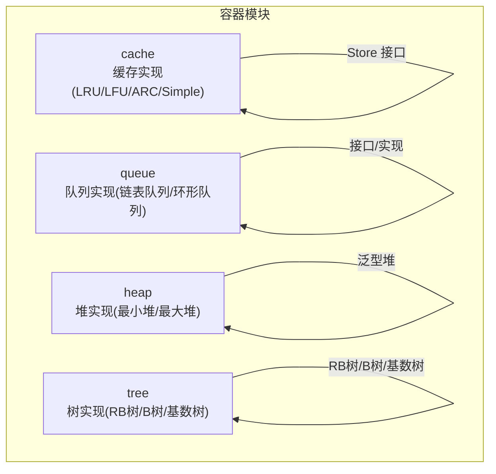
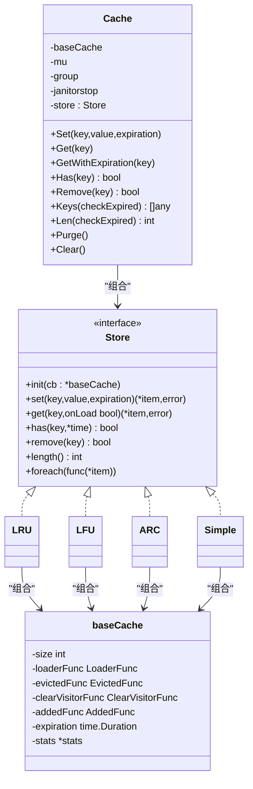
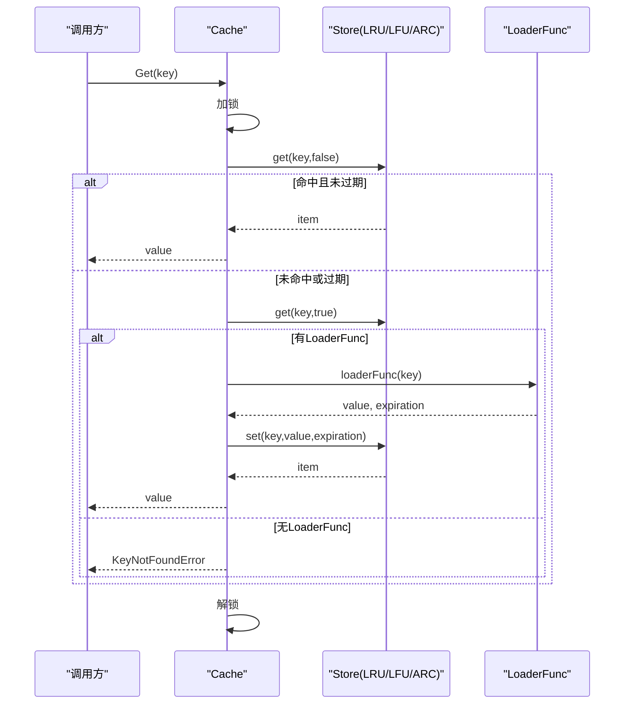
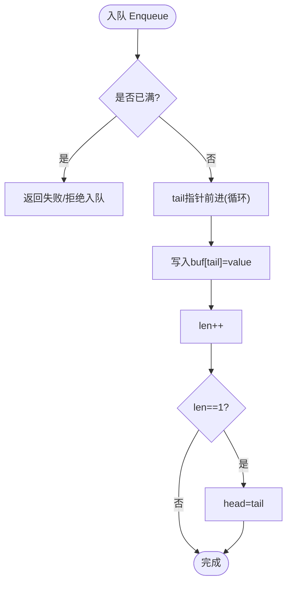
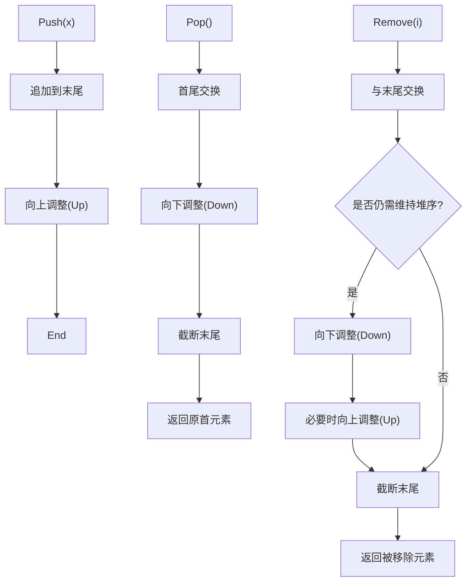
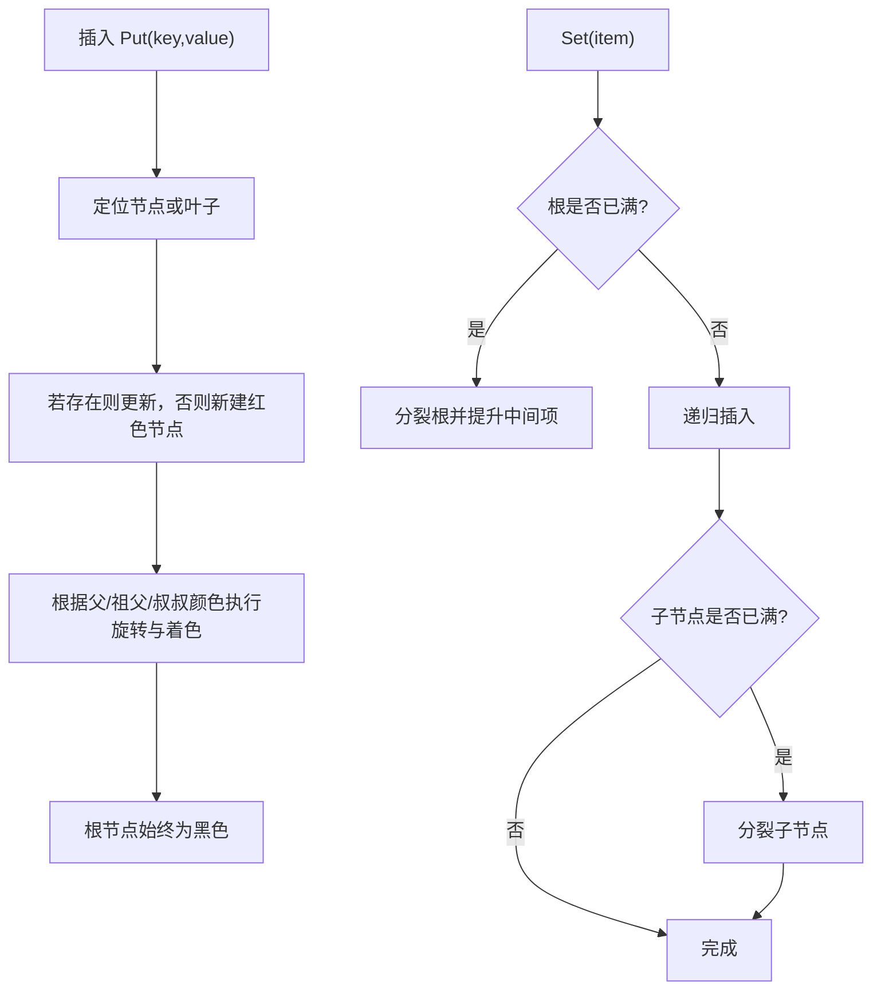
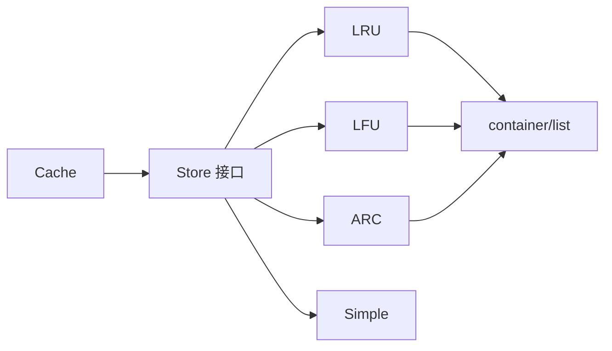

# 容器数据结构

<cite>
**本文档引用的文件**
- [cache.go](file://thirdparty/gox/container/cache/cache.go)
- [lru.go](file://thirdparty/gox/container/cache/lru.go)
- [lfu.go](file://thirdparty/gox/container/cache/lfu.go)
- [arc.go](file://thirdparty/gox/container/cache/arc.go)
- [queue.go](file://thirdparty/gox/container/queue/queue.go)
- [ring_queue.go](file://thirdparty/gox/container/queue/ringqueue/ring_queue.go)
- [heap.go](file://thirdparty/gox/container/heap/heap.go)
- [rbtree.go](file://thirdparty/gox/container/tree/rbtree/rbtree.go)
- [btree.go](file://thirdparty/gox/container/tree/btree/btree.go)
- [trie.go](file://thirdparty/gox/container/tree/radixtree/trie.go)
</cite>

## 目录
1. [简介](#简介)
2. [项目结构](#项目结构)
3. [核心组件](#核心组件)
4. [架构总览](#架构总览)
5. [详细组件分析](#详细组件分析)
6. [依赖分析](#依赖分析)
7. [性能考量](#性能考量)
8. [故障排查指南](#故障排查指南)
9. [结论](#结论)
10. [附录：API 参考](#附录api-参考)

## 简介
本文件面向“容器数据结构”模块，系统性梳理并输出仓库中已实现的各类容器组件的 API 文档与技术要点，覆盖以下类别：
- 缓存：LRU、LFU、ARC、Simple
- 队列：基于双向链表的队列、环形队列
- 堆：最小堆/最大堆（通过比较器抽象）
- 树：红黑树、B树、基数树（前缀树/路由树）

文档将从数据结构原理、时间复杂度、适用场景与性能特征入手，提供完整的 API 参考、调用流程图与使用建议，并给出常见问题的排查思路。

## 项目结构
该模块位于 thirdparty/gox/container 下，按功能域划分子包：
- cache：多策略缓存实现（LRU/LFU/ARC/Simple）
- queue：队列实现（普通队列、环形队列）
- heap：堆实现（最小堆/最大堆抽象）
- tree：树实现（红黑树、B树、基数树）

图表来源
- [cache.go:57-65](file://thirdparty/gox/container/cache/cache.go#L57-L65)
- [queue.go:7-10](file://thirdparty/gox/container/queue/queue.go#L7-L10)
- [heap.go:13-17](file://thirdparty/gox/container/heap/heap.go#L13-L17)
- [rbtree.go:56-61](file://thirdparty/gox/container/tree/rbtree/rbtree.go#L56-L61)
- [btree.go:25-32](file://thirdparty/gox/container/tree/btree/btree.go#L25-L32)
- [trie.go:75-84](file://thirdparty/gox/container/tree/radixtree/trie.go#L75-L84)

章节来源
- [cache.go:1-100](file://thirdparty/gox/container/cache/cache.go#L1-L100)
- [queue.go:1-44](file://thirdparty/gox/container/queue/queue.go#L1-L44)
- [heap.go:1-81](file://thirdparty/gox/container/heap/heap.go#L1-L81)
- [rbtree.go:1-61](file://thirdparty/gox/container/tree/rbtree/rbtree.go#L1-L61)
- [btree.go:1-56](file://thirdparty/gox/container/tree/btree/btree.go#L1-L56)
- [trie.go:1-84](file://thirdparty/gox/container/tree/radixtree/trie.go#L1-L84)

## 核心组件
本节概览各容器的职责边界与关键接口。

- 缓存（Cache）
  - 统一入口：通过 Builder 模式选择具体策略（LRU/LFU/ARC/Simple），支持过期时间、加载器、淘汰回调等扩展点。
  - Store 接口：抽象存储后端，统一 set/get/has/remove/length/foreach 等能力。
- 队列（Queue/RingQueue）
  - 链表队列：基于标准库双向链表，提供入队、出队、长度查询。
  - 环形队列：固定容量数组环形缓冲，提供入队、出队、判满、遍历等。
- 堆（Heap）
  - 泛型堆：通过比较器抽象，支持初始化、Push、Pop、First/Last、Remove 等。
- 树（RBTree/BTree/Trie）
  - 红黑树：有序键值映射，提供插入、查找、删除、旋转与平衡维护。
  - B树：多路搜索树，支持范围扫描、最小/最大、批量加载、高度计算。
  - 基数树：前缀树/路由树，支持参数化路由、通配符匹配、大小写不敏感查找。

章节来源
- [cache.go:32-100](file://thirdparty/gox/container/cache/cache.go#L32-L100)
- [queue.go:7-44](file://thirdparty/gox/container/queue/queue.go#L7-L44)
- [ring_queue.go:9-31](file://thirdparty/gox/container/queue/ringqueue/ring_queue.go#L9-L31)
- [heap.go:13-81](file://thirdparty/gox/container/heap/heap.go#L13-L81)
- [rbtree.go:56-110](file://thirdparty/gox/container/tree/rbtree/rbtree.go#L56-L110)
- [btree.go:25-134](file://thirdparty/gox/container/tree/btree/btree.go#L25-L134)
- [trie.go:75-211](file://thirdparty/gox/container/tree/radixtree/trie.go#L75-L211)

## 架构总览
下图展示 Cache 的整体架构：统一的 Cache 结构持有 Store 接口实例，通过 Builder 选择具体缓存策略；各 Store 实现内部组合 baseCache 并管理各自的并发与淘汰机制。

图表来源
- [cache.go:32-100](file://thirdparty/gox/container/cache/cache.go#L32-L100)
- [cache.go:159-171](file://thirdparty/gox/container/cache/cache.go#L159-L171)
- [lru.go:8-19](file://thirdparty/gox/container/cache/lru.go#L8-L19)
- [lfu.go:8-23](file://thirdparty/gox/container/cache/lfu.go#L8-L23)
- [arc.go:8-27](file://thirdparty/gox/container/cache/arc.go#L8-L27)

章节来源
- [cache.go:32-171](file://thirdparty/gox/container/cache/cache.go#L32-L171)

## 详细组件分析

### 缓存（Cache/LRU/LFU/ARC/Simple）
- 设计要点
  - 统一的 Cache 负责并发控制（读写锁）、过期检查、淘汰清理、统计与回调。
  - Store 接口隔离不同策略的实现细节，便于替换与扩展。
  - 支持 LoaderFunc 自动加载、Added/Evicted/Clear 回调、Janitor 清理器定时清理。
- 时间复杂度与适用场景
  - LRU：访问更新 O(1)，淘汰 O(1)，适合“最近最常用”的热点缓存。
  - LFU：访问频率计数+频率桶，典型 O(log N) 或 O(1) 视实现，适合“最常被用”的稳定热点。
  - ARC：自适应混合 LRU/LFU，兼顾冷热均衡，复杂度略高但鲁棒性强。
  - Simple：无淘汰策略，适合固定容量或外部管理的场景。
- API 概览（以 Cache 为主）
  - 构造与配置：New(size)、LoaderFunc、EvictedFunc、AddedFunc、Expiration、Janitor
  - 存取：Set、SetNX、Get、GetWithExpiration、GetIFPresent、Has、Remove
  - 扫描与统计：Keys、Len、GetALL、Purge、Clear
  - 数值增减：Increment系列、Decrement系列（支持多种数值类型）
- 使用建议
  - 合理设置容量与过期时间，避免内存膨胀。
  - 使用 LoaderFunc 提供懒加载，结合单飞（singleflight）避免缓存击穿。
  - 定时清理 Janitor 仅在需要自动清理过期项时启用。

图表来源
- [cache.go:254-294](file://thirdparty/gox/container/cache/cache.go#L254-L294)
- [cache.go:326-354](file://thirdparty/gox/container/cache/cache.go#L326-L354)

章节来源
- [cache.go:96-157](file://thirdparty/gox/container/cache/cache.go#L96-L157)
- [cache.go:217-426](file://thirdparty/gox/container/cache/cache.go#L217-L426)
- [lru.go:21-67](file://thirdparty/gox/container/cache/lru.go#L21-L67)
- [lfu.go:25-76](file://thirdparty/gox/container/cache/lfu.go#L25-L76)
- [arc.go:53-164](file://thirdparty/gox/container/cache/arc.go#L53-L164)

### 队列（Queue/RingQueue）
- 链表队列（Queue）
  - 基于标准库双向链表，提供 Enqueue、Dequeue、Peek、Len 等。
  - 适合通用队列场景，无需预设容量。
- 环形队列（RingQueue[T]）
  - 固定容量数组实现，支持判满、取头尾、遍历全部元素。
  - 适合高性能、低分配的环形缓冲场景。

图表来源
- [ring_queue.go:49-66](file://thirdparty/gox/container/queue/ringqueue/ring_queue.go#L49-L66)

章节来源
- [queue.go:7-44](file://thirdparty/gox/container/queue/queue.go#L7-L44)
- [ring_queue.go:9-109](file://thirdparty/gox/container/queue/ringqueue/ring_queue.go#L9-L109)

### 堆（Heap）
- 特性
  - 泛型实现，通过比较器抽象决定堆性质（最小堆/最大堆）。
  - 支持初始化、Push、Pop、First/Last、Remove 等操作。
- 复杂度
  - Push/Pop/Remove：O(log N)
  - First/Last：O(1)
- 适用场景
  - 优先队列、Top-K、调度器等。

图表来源
- [heap.go:31-81](file://thirdparty/gox/container/heap/heap.go#L31-L81)

章节来源
- [heap.go:13-81](file://thirdparty/gox/container/heap/heap.go#L13-L81)

### 树（RBTree/BTree/Trie）
- 红黑树（RBTree[K,V]）
  - 性质：自平衡二叉搜索树，保证 O(log N) 查找/插入/删除。
  - 实现要点：节点颜色、旋转（左旋/右旋）、插入/删除的五种情况。
- B树（BTree[T]）
  - 性质：多路搜索树，节点含多个关键字，适合磁盘/批量场景。
  - 支持范围扫描、最小/最大、批量加载、高度计算。
- 基数树（Trie/路由树）
  - 性质：前缀压缩的多叉树，适合路由匹配、URL参数提取。
  - 支持参数化段（:name）、通配符段（*catchAll）、大小写不敏感查找与重定向建议。

图表来源
- [rbtree.go:74-110](file://thirdparty/gox/container/tree/rbtree/rbtree.go#L74-L110)
- [btree.go:132-184](file://thirdparty/gox/container/tree/btree/btree.go#L132-L184)

章节来源
- [rbtree.go:56-326](file://thirdparty/gox/container/tree/rbtree/rbtree.go#L56-L326)
- [btree.go:25-599](file://thirdparty/gox/container/tree/btree/btree.go#L25-L599)
- [trie.go:75-444](file://thirdparty/gox/container/tree/radixtree/trie.go#L75-L444)

## 依赖分析
- 内部依赖
  - Cache 依赖 Store 接口与 baseCache，具体策略（LRU/LFU/ARC/Simple）均实现 Store。
  - 队列与堆均为独立实现，无跨模块依赖。
  - 树实现各自独立，互不依赖。
- 外部依赖
  - 标准库 container/list 用于 LRU/LFU/ARC 的链表组织。
  - 比较器接口（cmp.Comparable、LessFunc、CompareFunc）来自第三方库，用于泛型约束与比较逻辑。

图表来源
- [cache.go:57-65](file://thirdparty/gox/container/cache/cache.go#L57-L65)
- [lru.go:3-6](file://thirdparty/gox/container/cache/lru.go#L3-L6)
- [lfu.go:3-6](file://thirdparty/gox/container/cache/lfu.go#L3-L6)
- [arc.go:3-6](file://thirdparty/gox/container/cache/arc.go#L3-L6)

章节来源
- [cache.go:57-65](file://thirdparty/gox/container/cache/cache.go#L57-L65)
- [lru.go:3-6](file://thirdparty/gox/container/cache/lru.go#L3-L6)
- [lfu.go:3-6](file://thirdparty/gox/container/cache/lfu.go#L3-L6)
- [arc.go:3-6](file://thirdparty/gox/container/cache/arc.go#L3-L6)

## 性能考量
- 缓存
  - LRU/LFU/ARC 在命中率上各有侧重，需结合业务访问模式选择。
  - 过期时间与 LoaderFunc 的配合可降低冷启动成本，但需注意并发加载抖动。
  - Janitor 定时清理会带来额外开销，建议在高频写入场景谨慎开启。
- 队列
  - 链表队列适合一般场景；环形队列在高吞吐、低 GC 场景更优。
  - 注意判满与循环索引的边界条件，避免误判。
- 堆
  - 泛型实现避免装箱，但比较器调用次数较多，应尽量保持比较逻辑轻量。
- 树
  - RBTree/BTree 的平衡性保障了稳定的 O(log N) 操作；BTree 更适合批量与顺序访问。
  - Trie 的前缀匹配在路由场景效率很高，但空间占用可能较大。

## 故障排查指南
- 缓存
  - KeyNotFoundError：确认是否配置 LoaderFunc，或键是否已过期。
  - 淘汰回调未触发：检查是否使用了 Purge/Clear 或 Store 的 remove 实现。
  - 并发问题：确保通过 Cache 的公共方法访问，避免绕过读写锁。
- 队列
  - 环形队列判满错误：确认 IsFull 与 Enqueue 的返回值一致性。
  - 出队空：Dequeue 返回 false 时表示队列为空，需分支处理。
- 堆
  - Pop 返回空值：确认堆非空；检查比较器是否正确。
  - Remove 后堆序异常：检查是否同时进行 Up/Down 调整。
- 树
  - 插入后查找失败：检查比较器与键相等判定逻辑。
  - 删除后旋转不平衡：核对删除的五种情况与旋转顺序。

章节来源
- [cache.go:254-294](file://thirdparty/gox/container/cache/cache.go#L254-L294)
- [ring_queue.go:49-82](file://thirdparty/gox/container/queue/ringqueue/ring_queue.go#L49-L82)
- [heap.go:38-81](file://thirdparty/gox/container/heap/heap.go#L38-L81)
- [rbtree.go:193-250](file://thirdparty/gox/container/tree/rbtree/rbtree.go#L193-L250)
- [btree.go:236-259](file://thirdparty/gox/container/tree/btree/btree.go#L236-L259)

## 结论
本模块提供了从缓存到队列、堆与树的完整容器族谱，具备良好的扩展性与性能表现。建议在实际工程中：
- 明确业务访问模式，选择合适的缓存策略；
- 在高吞吐场景优先考虑环形队列与堆；
- 对于路由/前缀匹配场景采用基数树；
- 合理配置过期与清理策略，避免资源泄漏。

## 附录：API 参考

### 缓存（Cache）
- 构造与配置
  - New(size)：创建 CacheBuilder
  - LoaderFunc(fn)、EvictedFunc(fn)、AddedFunc(fn)、ClearVisitorFunc(fn)、Expiration(dur)、Janitor(interval)
  - LRU()、LFU()、ARC()、Simple()：构建具体缓存实例
- 基本操作
  - Set(key, value, expiration)
  - SetNX(key, value, expiration)
  - Get(key)、GetWithExpiration(key)、GetIFPresent(key)
  - Has(key) bool
  - Remove(key) bool
- 扫描与统计
  - Keys(checkExpired) []any
  - Len(checkExpired) int
  - GetALL(checkExpired) map[any]any
- 清理
  - Purge()、Clear()
- 数值增减（支持多种数值类型）
  - Increment/IncrementFloat/IncrementInt/...、Decrement/DecrementFloat/DecrementInt/...

章节来源
- [cache.go:96-157](file://thirdparty/gox/container/cache/cache.go#L96-L157)
- [cache.go:217-426](file://thirdparty/gox/container/cache/cache.go#L217-L426)
- [cache.go:428-687](file://thirdparty/gox/container/cache/cache.go#L428-L687)

### LRU
- init(baseCache)
- set/get/has/remove/length/foreach

章节来源
- [lru.go:15-116](file://thirdparty/gox/container/cache/lru.go#L15-L116)

### LFU
- init(baseCache)
- set/get/has/remove/length/foreach
- 内部频率桶与增量逻辑

章节来源
- [lfu.go:15-169](file://thirdparty/gox/container/cache/lfu.go#L15-L169)

### ARC
- init(baseCache)
- set/get/has/remove/length/foreach
- part 动态调整与四区列表（t1/t2/b1/b2）

章节来源
- [arc.go:20-277](file://thirdparty/gox/container/cache/arc.go#L20-L277)

### 队列（Queue）
- New() *Queue
- Enqueue(item)、Dequeue()、Peek()、Len() int

章节来源
- [queue.go:12-44](file://thirdparty/gox/container/queue/queue.go#L12-L44)

### 环形队列（RingQueue[T]）
- New[T](capacity) *RingQueue[T]
- Length() int、Capacity() int
- Front() (T,bool)、Tail() (T,bool)
- Enqueue(value) bool、Dequeue() (T,bool)
- IsFull() bool
- LookAll() []T

章节来源
- [ring_queue.go:16-109](file://thirdparty/gox/container/queue/ringqueue/ring_queue.go#L16-L109)

### 堆（Heap[T]）
- New[T](cap)、NewFromArray[T](arr)
- Init()、Push(x)、Pop() (T,bool)、First() (T,bool)、Last() (T,bool)、Remove(i) (T,bool)

章节来源
- [heap.go:15-81](file://thirdparty/gox/container/heap/heap.go#L15-L81)

### 红黑树（RBTree[K,V]）
- NewRBTree(less) *RBTree[K,V]
- Put(key, value)、Get(key) (V,bool)、Del(key)、Len() int
- 内部旋转与平衡维护

章节来源
- [rbtree.go:64-326](file://thirdparty/gox/container/tree/rbtree/rbtree.go#L64-L326)

### B树（BTree[T]）
- New(cmp) *BTree[T]
- Set(item) (prev T,bool)、Get(key) (T,bool)、Delete(key) (T,bool)
- Min/Max、PopMin/PopMax、Ascend/Descend、Walk、Height、Load

章节来源
- [btree.go:49-599](file://thirdparty/gox/container/tree/btree/btree.go#L49-L599)

### 基数树（Trie）
- Node.Set(path, data)、Get(path) (data, params, tsr)
- Node.sortIndices、findCaseInsensitivePath 等

章节来源
- [trie.go:104-444](file://thirdparty/gox/container/tree/radixtree/trie.go#L104-L444)