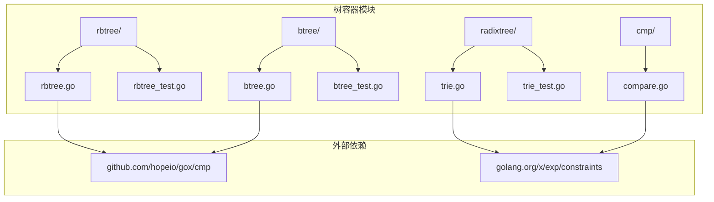
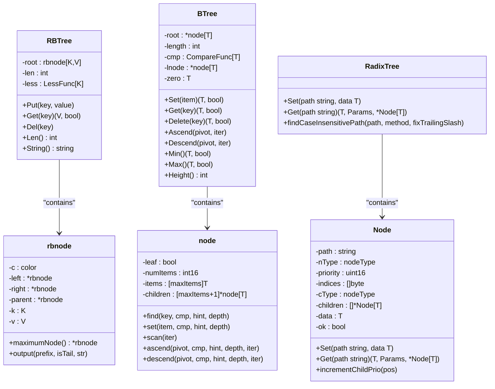
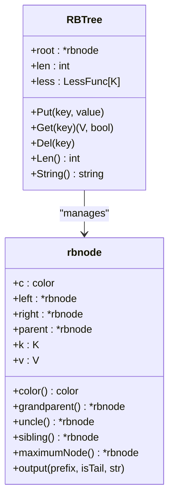
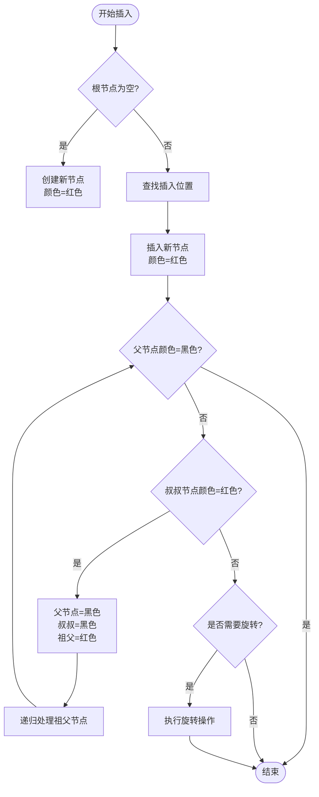
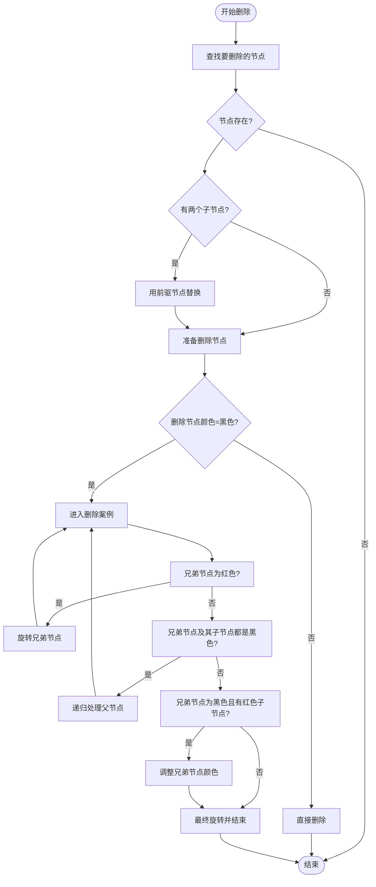
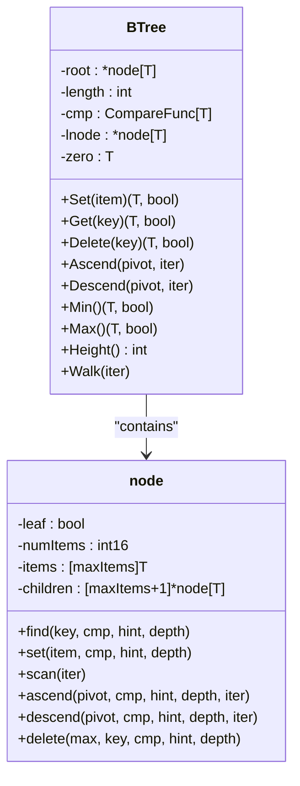
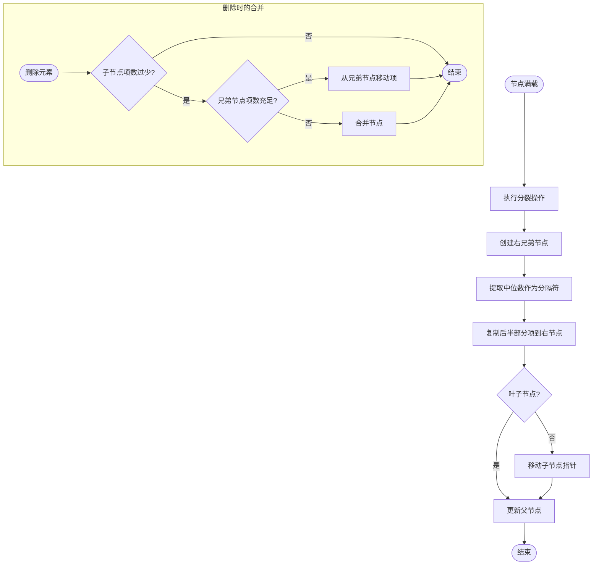
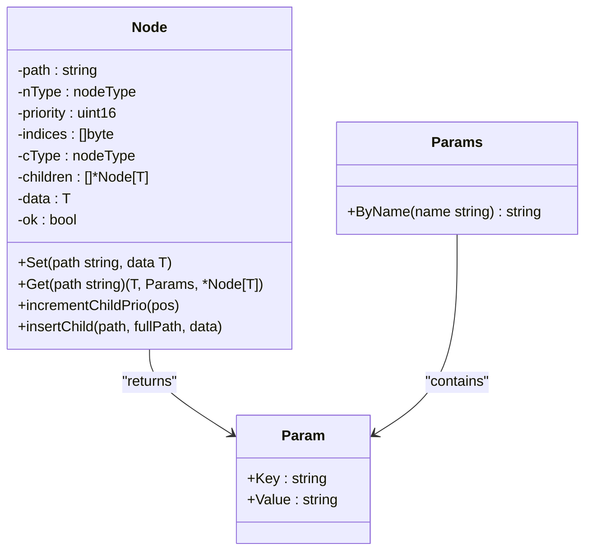
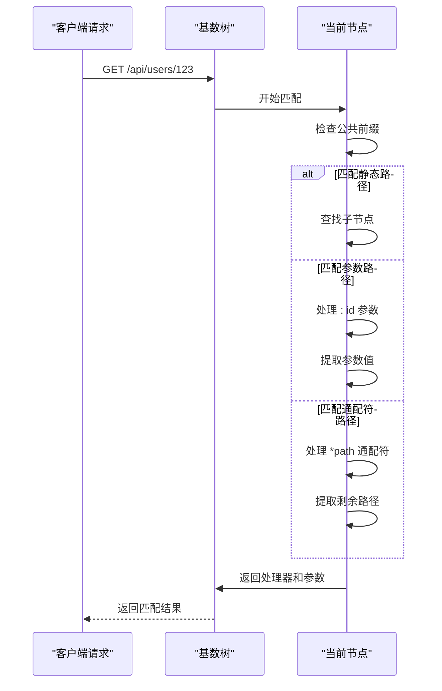
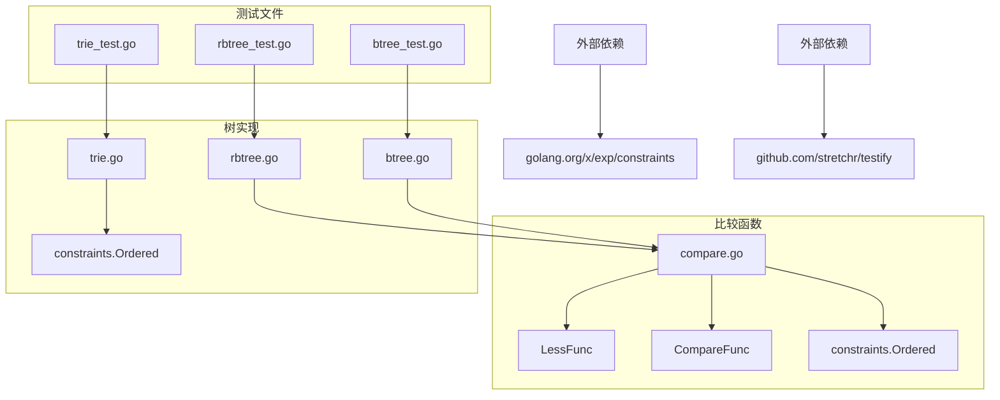

# 树容器

<cite>
**本文档引用的文件**
- [rbtree.go](file://thirdparty/gox/container/tree/rbtree/rbtree.go)
- [rbtree_test.go](file://thirdparty/gox/container/tree/rbtree/rbtree_test.go)
- [btree.go](file://thirdparty/gox/container/tree/btree/btree.go)
- [btree_test.go](file://thirdparty/gox/container/tree/btree/btree_test.go)
- [trie.go](file://thirdparty/gox/container/tree/radixtree/trie.go)
- [trie_test.go](file://thirdparty/gox/container/tree/radixtree/trie_test.go)
- [compare.go](file://thirdparty/gox/cmp/compare.go)
</cite>

## 目录
1. [简介](#简介)
2. [项目结构](#项目结构)
3. [核心组件](#核心组件)
4. [架构概览](#架构概览)
5. [详细组件分析](#详细组件分析)
6. [依赖关系分析](#依赖关系分析)
7. [性能考虑](#性能考虑)
8. [故障排除指南](#故障排除指南)
9. [结论](#结论)

## 简介

树容器模块提供了三种高效的数据结构实现：红黑树(RBTree)、B树(BTree)和基数树(RadixTree)。这些数据结构专为高性能场景设计，支持键值对存储、范围查询和高效的遍历操作。

本模块的核心特点：
- **泛型支持**：所有树结构都支持任意类型的键和值
- **高性能**：针对不同使用场景优化的平衡机制
- **完整API**：提供插入、删除、查找、遍历等完整操作
- **内存友好**：优化的内存布局和缓存友好的访问模式

## 项目结构

树容器模块位于 `thirdparty/gox/container/tree/` 目录下，采用按功能模块组织的结构：

**图表来源**
- [rbtree.go:1-367](file://thirdparty/gox/container/tree/rbtree/rbtree.go#L1-L367)
- [btree.go:1-599](file://thirdparty/gox/container/tree/btree/btree.go#L1-L599)
- [trie.go:1-668](file://thirdparty/gox/container/tree/radixtree/trie.go#L1-L668)

**章节来源**
- [rbtree.go:1-367](file://thirdparty/gox/container/tree/rbtree/rbtree.go#L1-L367)
- [btree.go:1-599](file://thirdparty/gox/container/tree/btree/btree.go#L1-L599)
- [trie.go:1-668](file://thirdparty/gox/container/tree/radixtree/trie.go#L1-L668)

## 核心组件

### 红黑树 (RBTree)

红黑树是一种自平衡二叉搜索树，通过颜色属性和旋转操作保持平衡。

**关键特性**：
- **平衡保证**：从根到叶子的最长路径不超过最短路径的两倍
- **时间复杂度**：查找、插入、删除均为 O(log n)
- **颜色属性**：每个节点有红色或黑色属性
- **平衡规则**：
  1. 根节点为黑色
  2. 所有叶子节点为黑色
  3. 红色节点的两个子节点都是黑色
  4. 从任一节点到其每个叶子的所有路径都包含相同数目的黑色节点

**主要API**：
- `Put(key, value)` - 插入或更新键值对
- `Get(key)` - 查找指定键的值
- `Del(key)` - 删除指定键
- `Len()` - 返回树中元素数量

### B树 (BTree)

B树是一种自平衡的树数据结构，保持数据排序并允许在对数时间内进行搜索、顺序访问和插入。

**关键特性**：
- **多路分支**：每个节点可以有多个子节点
- **平衡性**：所有叶子节点都在同一层
- **范围查询**：支持高效的范围查询和遍历
- **内存友好**：节点大小固定，适合磁盘存储

**主要API**：
- `Set(item)` - 插入或更新元素
- `Get(key)` - 查找指定键的元素
- `Delete(key)` - 删除指定键
- `Ascend(pivot, iter)` - 升序遍历
- `Descend(pivot, iter)` - 降序遍历
- `Min()` / `Max()` - 获取最小/最大元素
- `PopMin()` / `PopMax()` - 弹出最小/最大元素

### 基数树 (RadixTree)

基数树（也称为前缀树）用于高效存储和检索字符串键，特别适合URL路由和前缀匹配。

**关键特性**：
- **前缀压缩**：共享公共前缀的路径
- **字符串优化**：专门为字符串键优化
- **路由应用**：HTTP路由匹配的理想选择
- **通配符支持**：支持参数化和通配符路径

**主要API**：
- `Set(path, data)` - 设置路径处理器
- `Get(path)` - 获取路径处理器
- `findCaseInsensitivePath(path, method, fixTrailingSlash)` - 不区分大小写的路径查找

**章节来源**
- [rbtree.go:56-110](file://thirdparty/gox/container/tree/rbtree/rbtree.go#L56-L110)
- [btree.go:25-56](file://thirdparty/gox/container/tree/btree/btree.go#L25-L56)
- [trie.go:75-84](file://thirdparty/gox/container/tree/radixtree/trie.go#L75-L84)

## 架构概览

**图表来源**
- [rbtree.go:15-61](file://thirdparty/gox/container/tree/rbtree/rbtree.go#L15-L61)
- [btree.go:12-32](file://thirdparty/gox/container/tree/btree/btree.go#L12-L32)
- [trie.go:75-84](file://thirdparty/gox/container/tree/radixtree/trie.go#L75-L84)

## 详细组件分析

### 红黑树实现分析

#### 数据结构设计

红黑树通过以下结构实现平衡：

**图表来源**
- [rbtree.go:15-61](file://thirdparty/gox/container/tree/rbtree/rbtree.go#L15-L61)

#### 插入操作流程

**图表来源**
- [rbtree.go:112-155](file://thirdparty/gox/container/tree/rbtree/rbtree.go#L112-L155)

#### 删除操作流程

**图表来源**
- [rbtree.go:252-326](file://thirdparty/gox/container/tree/rbtree/rbtree.go#L252-L326)

**章节来源**
- [rbtree.go:73-110](file://thirdparty/gox/container/tree/rbtree/rbtree.go#L73-L110)
- [rbtree.go:217-250](file://thirdparty/gox/container/tree/rbtree/rbtree.go#L217-L250)

### B树实现分析

#### 节点结构设计

B树采用固定大小的节点设计，优化内存使用和缓存性能：

**图表来源**
- [btree.go:12-32](file://thirdparty/gox/container/tree/btree/btree.go#L12-L32)

#### 分裂和合并机制

**图表来源**
- [btree.go:136-154](file://thirdparty/gox/container/tree/btree/btree.go#L136-L154)
- [btree.go:301-359](file://thirdparty/gox/container/tree/btree/btree.go#L301-L359)

**章节来源**
- [btree.go:136-184](file://thirdparty/gox/container/tree/btree/btree.go#L136-L184)
- [btree.go:261-359](file://thirdparty/gox/container/tree/btree/btree.go#L261-L359)

### 基数树实现分析

#### 路由树结构

基数树专门设计用于HTTP路由，支持复杂的路径匹配：

**图表来源**
- [trie.go:75-84](file://thirdparty/gox/container/tree/radixtree/trie.go#L75-L84)
- [trie.go:10-30](file://thirdparty/gox/container/tree/radixtree/trie.go#L10-L30)

#### 路径匹配算法

**图表来源**
- [trie.go:323-444](file://thirdparty/gox/container/tree/radixtree/trie.go#L323-L444)

**章节来源**
- [trie.go:104-211](file://thirdparty/gox/container/tree/radixtree/trie.go#L104-L211)
- [trie.go:323-444](file://thirdparty/gox/container/tree/radixtree/trie.go#L323-L444)

## 依赖关系分析

### 内部依赖关系

**图表来源**
- [compare.go:9-13](file://thirdparty/gox/cmp/compare.go#L9-L13)
- [rbtree.go:3-6](file://thirdparty/gox/container/tree/rbtree/rbtree.go#L3-L6)
- [btree.go:7-7](file://thirdparty/gox/container/tree/btree/btree.go#L7-L7)
- [trie.go:3-8](file://thirdparty/gox/container/tree/radixtree/trie.go#L3-L8)

### 外部依赖分析

树容器模块依赖于以下外部库：

1. **golang.org/x/exp/constraints**：提供类型约束，支持泛型编程
2. **github.com/stretchr/testify**：测试断言库（仅用于测试）

内部依赖关系：
- 所有树实现都依赖 `github.com/hopeio/gox/cmp` 提供的比较函数
- 比较函数支持 `constraints.Ordered` 类型，确保类型安全

**章节来源**
- [compare.go:9-13](file://thirdparty/gox/cmp/compare.go#L9-L13)
- [rbtree.go:3-6](file://thirdparty/gox/container/tree/rbtree/rbtree.go#L3-L6)
- [btree.go:7-7](file://thirdparty/gox/container/tree/btree/btree.go#L7-L7)

## 性能考虑

### 时间复杂度分析

| 操作 | RBTree | BTree | RadixTree |
|------|--------|-------|-----------|
| 查找 | O(log n) | O(log n) | O(m) |
| 插入 | O(log n) | O(log n) | O(m) |
| 删除 | O(log n) | O(log n) | O(m) |
| 遍历 | O(n) | O(n) | O(n) |

其中：
- n 是树中元素数量
- m 是字符串长度（对于基数树）

### 空间复杂度

- **RBTree**: O(n) - 每个节点存储键值对和指针
- **BTree**: O(n) - 固定大小节点，减少指针开销
- **RadixTree**: O(A) - A是所有路径字符总数，但通常比存储键值对更节省空间

### 性能优化特性

1. **缓存友好**：B树使用固定大小数组，提高缓存命中率
2. **内存局部性**：相邻元素在内存中连续存储
3. **批量加载**：B树支持 `Load` 操作进行批量数据加载
4. **路径提示**：B树支持 `PathHint` 进行热点数据优化

**章节来源**
- [btree.go:461-484](file://thirdparty/gox/container/tree/btree/btree.go#L461-L484)
- [btree_test.go:504-512](file://thirdparty/gox/container/tree/btree/btree_test.go#L504-L512)

## 故障排除指南

### 常见问题和解决方案

#### 1. 红黑树旋转异常

**症状**：插入或删除后树结构异常
**原因**：旋转操作实现错误
**解决方案**：检查 `rotateLeft` 和 `rotateRight` 方法的实现

#### 2. B树节点溢出

**症状**：插入操作失败或数据丢失
**原因**：节点分裂逻辑错误
**解决方案**：验证 `split` 方法和父节点更新逻辑

#### 3. 基数树路径冲突

**症状**：设置路径时抛出异常
**原因**：通配符路径与现有路径冲突
**解决方案**：检查路径配置，避免重复定义

#### 4. 内存泄漏

**症状**：长时间运行后内存使用持续增长
**原因**：节点未正确释放
**解决方案**：确保删除操作正确清理节点引用

### 调试技巧

1. **使用 `String()` 方法**：RBTree提供可视化输出
2. **启用测试覆盖**：利用现有的单元测试验证功能
3. **性能基准测试**：使用 `Benchmark` 函数评估性能

**章节来源**
- [rbtree_test.go:37-78](file://thirdparty/gox/container/tree/rbtree/rbtree_test.go#L37-L78)
- [btree_test.go:570-582](file://thirdparty/gox/container/tree/btree/btree_test.go#L570-L582)

## 结论

树容器模块提供了三种经过精心设计的数据结构，每种都有其独特的优势和适用场景：

- **RBTree**：最适合需要稳定O(log n)性能的键值存储场景
- **BTree**：最适合需要范围查询和批量操作的场景
- **RadixTree**：最适合URL路由和前缀匹配的场景

这些实现具有以下共同特点：
- 完整的API覆盖所有基本操作
- 严格的边界条件检查
- 优化的性能表现
- 全面的测试覆盖

通过合理选择合适的数据结构，开发者可以在不同应用场景中获得最佳的性能和用户体验。