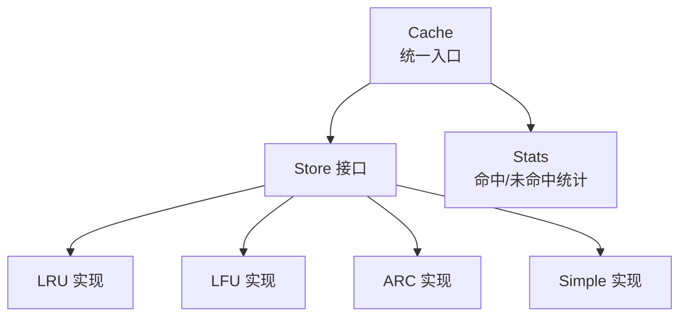
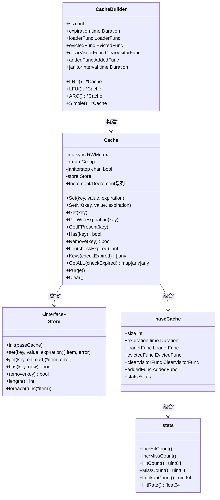
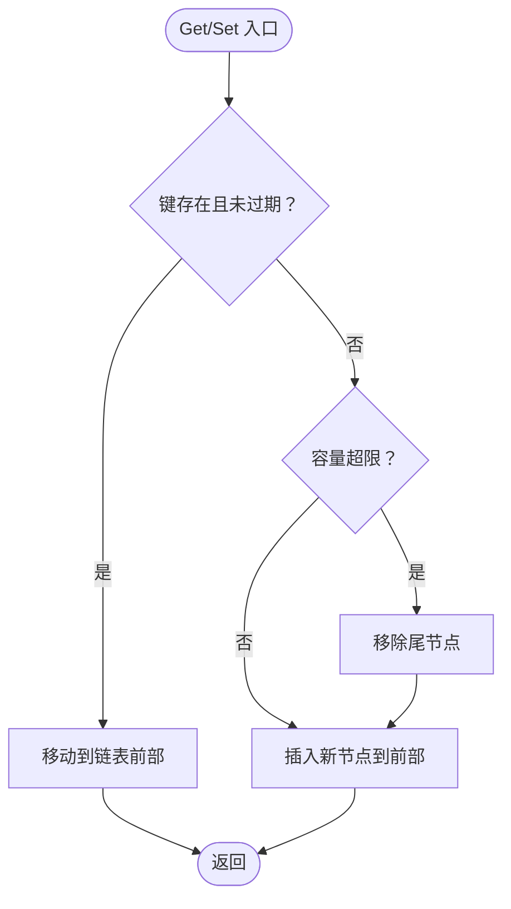
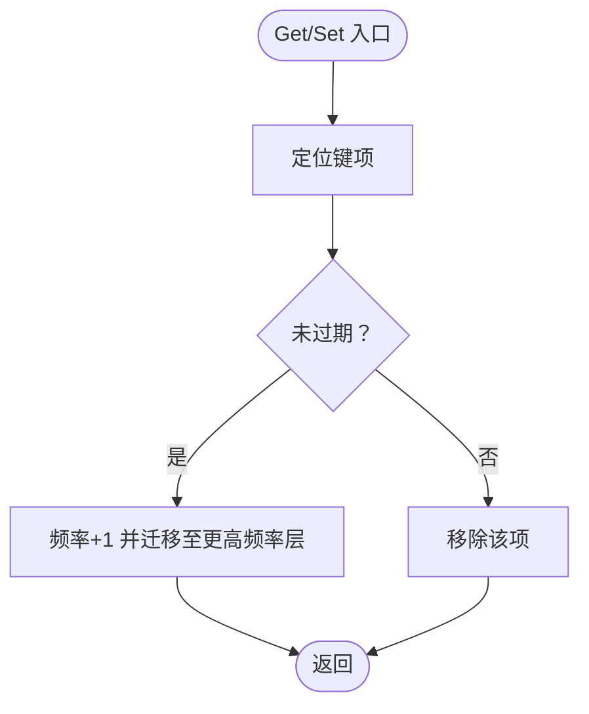
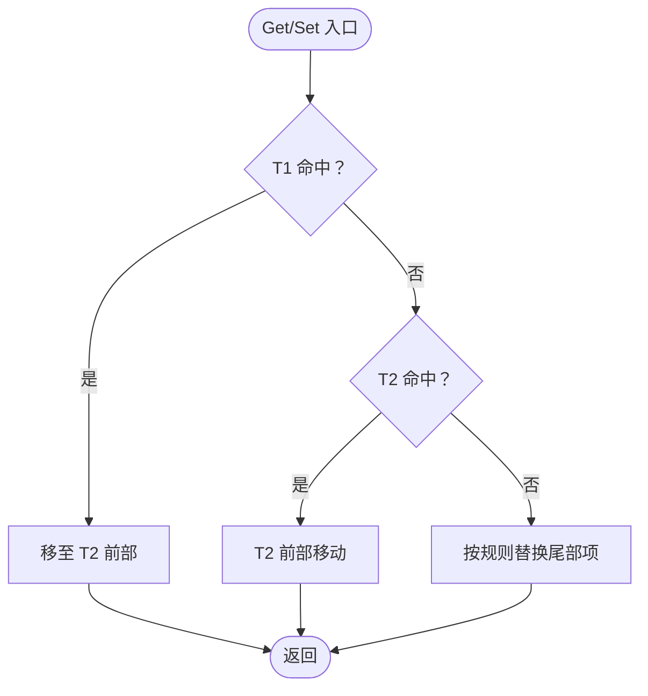
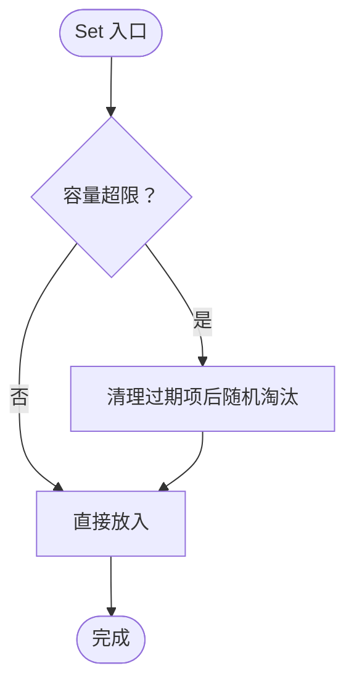
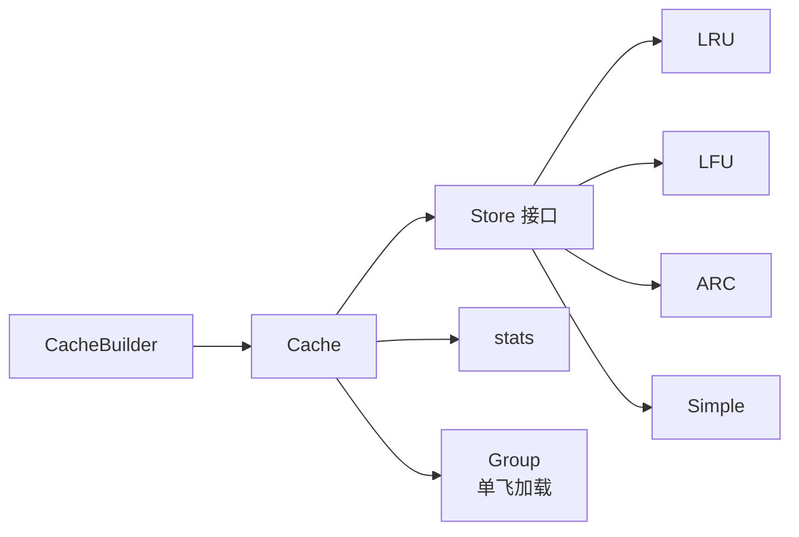

# 缓存容器

<cite>
**本文档引用的文件**
- [cache.go](file://thirdparty/gox/container/cache/cache.go)
- [lru.go](file://thirdparty/gox/container/cache/lru.go)
- [lfu.go](file://thirdparty/gox/container/cache/lfu.go)
- [arc.go](file://thirdparty/gox/container/cache/arc.go)
- [simple.go](file://thirdparty/gox/container/cache/simple.go)
- [stats.go](file://thirdparty/gox/container/cache/stats.go)
- [cache_test.go](file://thirdparty/gox/container/cache/cache_test.go)
- [lru_test.go](file://thirdparty/gox/container/cache/lru_test.go)
- [lfu_test.go](file://thirdparty/gox/container/cache/lfu_test.go)
- [arc_test.go](file://thirdparty/gox/container/cache/arc_test.go)
- [simple_test.go](file://thirdparty/gox/container/cache/simple_test.go)
- [README.md](file://thirdparty/gox/container/cache/README.md)
</cite>

## 目录
1. [简介](#简介)
2. [项目结构](#项目结构)
3. [核心组件](#核心组件)
4. [架构总览](#架构总览)
5. [详细组件分析](#详细组件分析)
6. [依赖关系分析](#依赖关系分析)
7. [性能考量](#性能考量)
8. [故障排查指南](#故障排查指南)
9. [结论](#结论)
10. [附录：API 参考](#附录api-参考)

## 简介
本模块提供统一的缓存容器接口，支持四种缓存算法：
- LRU（最近最少使用）
- LFU（最少使用频率）
- ARC（自适应缓存替换）
- Simple（简单缓存）

每个算法均实现相同的 Store 接口，通过 Cache 统一对外提供 Set、Get、Has、Remove、Len、Purge、Clear 等操作，并支持过期时间、加载函数、清理回调、并发安全、统计指标等功能。

## 项目结构
缓存容器位于 thirdparty/gox/container/cache 目录，核心文件如下：
- cache.go：统一的 Cache 结构体、构建器、公共方法与事件回调
- lru.go：LRU 算法实现
- lfu.go：LFU 算法实现
- arc.go：ARC 算法实现
- simple.go：Simple 算法实现
- stats.go：命中/未命中统计
- 各算法对应的测试文件：验证行为与边界条件

图表来源
- [cache.go:32-65](file://thirdparty/gox/container/cache/cache.go#L32-L65)
- [lru.go:9-13](file://thirdparty/gox/container/cache/lru.go#L9-L13)
- [lfu.go:9-13](file://thirdparty/gox/container/cache/lfu.go#L9-L13)
- [arc.go:9-18](file://thirdparty/gox/container/cache/arc.go#L9-L18)
- [simple.go:7-12](file://thirdparty/gox/container/cache/simple.go#L7-L12)

章节来源
- [cache.go:11-16](file://thirdparty/gox/container/cache/cache.go#L11-L16)
- [cache.go:57-65](file://thirdparty/gox/container/cache/cache.go#L57-L65)

## 核心组件
- CacheBuilder：用于构建不同算法的缓存实例，支持设置容量、过期时间、加载函数、事件回调、清理周期等
- Cache：对外统一 API 的持有者，内部委托具体 Store 实现
- Store 接口：定义 set/get/has/remove/length/foreach 等方法
- baseCache：共享的配置与统计字段（容量、过期时间、回调、统计）
- stats：原子计数的命中/未命中统计
- 单飞加载（singleflight）：避免缓存击穿时的重复加载

章节来源
- [cache.go:86-157](file://thirdparty/gox/container/cache/cache.go#L86-L157)
- [cache.go:32-75](file://thirdparty/gox/container/cache/cache.go#L32-L75)
- [stats.go:14-53](file://thirdparty/gox/container/cache/stats.go#L14-L53)

## 架构总览
CacheBuilder 负责装配 Cache，Cache 内部持有一个 Store 实例（LRU/LFU/ARC/Simple），并维护互斥锁、单飞加载组、清理协程等。所有操作在 Cache 层进行加锁，Store 层负责具体算法细节。

图表来源
- [cache.go:86-157](file://thirdparty/gox/container/cache/cache.go#L86-L157)
- [cache.go:32-75](file://thirdparty/gox/container/cache/cache.go#L32-L75)
- [stats.go:14-53](file://thirdparty/gox/container/cache/stats.go#L14-L53)

## 详细组件分析

### LRU（最近最少使用）
- 数据结构：哈希表 + 双向链表（front 为最近，back 为最久）
- 命中：移动到 front
- 写入/新增：超过容量时淘汰 back；否则插入 front
- 时间复杂度：查找 O(1)，插入/删除 O(1)
- 适用场景：热点数据集中在近期访问的场景

图表来源
- [lru.go:21-67](file://thirdparty/gox/container/cache/lru.go#L21-L67)

章节来源
- [lru.go:9-116](file://thirdparty/gox/container/cache/lru.go#L9-L116)

### LFU（最少使用频率）
- 数据结构：哈希表 + 频率层（freqEntry）+ 频率为键的有序链表
- 命中：频率+1，移动到更高频率层
- 写入：若超容，从最低频率层淘汰
- 时间复杂度：查找 O(1)，更新频率 O(1)
- 适用场景：长尾数据、稳定热点与冷数据共存

图表来源
- [lfu.go:59-93](file://thirdparty/gox/container/cache/lfu.go#L59-L93)

章节来源
- [lfu.go:9-169](file://thirdparty/gox/container/cache/lfu.go#L9-L169)

### ARC（自适应缓存替换）
- 数据结构：两套列表（T1/T2）与两套后备（B1/B2），动态调整比例 p
- 命中：命中 T1 移动到 T2；命中 T2 在 T2 前部移动
- 替换：优先淘汰 T1 尾部，否则 T2 尾部，否则 B1/B2 尾部
- 时间复杂度：查找/更新 O(1)
- 适用场景：混合访问模式（近期与频率兼顾）

图表来源
- [arc.go:124-164](file://thirdparty/gox/container/cache/arc.go#L124-L164)

章节来源
- [arc.go:9-277](file://thirdparty/gox/container/cache/arc.go#L9-L277)

### Simple（简单缓存）
- 数据结构：普通 map，无特定淘汰策略
- 行为：容量超限时先清理过期项，再随机淘汰
- 时间复杂度：查找 O(1)，清理 O(n)
- 适用场景：极简需求或作为默认实现

图表来源
- [simple.go:19-33](file://thirdparty/gox/container/cache/simple.go#L19-L33)

章节来源
- [simple.go:7-102](file://thirdparty/gox/container/cache/simple.go#L7-L102)

## 依赖关系分析
- CacheBuilder 通过 LRU/LFU/ARC/Simple 的 init 方法注入 baseCache
- Cache 对外提供统一 API，内部通过 Store 接口隔离算法差异
- stats 由各 Store 实现调用以记录命中/未命中
- 单飞加载（Group）用于 LoaderFunc 的并发去重

图表来源
- [cache.go:135-157](file://thirdparty/gox/container/cache/cache.go#L135-L157)
- [cache.go:159-171](file://thirdparty/gox/container/cache/cache.go#L159-L171)
- [stats.go:14-53](file://thirdparty/gox/container/cache/stats.go#L14-L53)

章节来源
- [cache.go:173-193](file://thirdparty/gox/container/cache/cache.go#L173-L193)

## 性能考量
- 并发安全：Cache 使用 RWMutex 保护，Store 层各自维护内部状态一致性
- 过期清理：可配置 janitor 清理周期，定期 Purge 过期项
- 加载去重：LoaderFunc 通过单飞加载避免缓存击穿
- 统计指标：原子计数的命中/未命中，便于运行时评估
- 算法复杂度：
  - LRU/LFU/ARC：查找/更新 O(1)
  - Simple：查找 O(1)，清理 O(n)

章节来源
- [cache.go:195-214](file://thirdparty/gox/container/cache/cache.go#L195-L214)
- [stats.go:20-53](file://thirdparty/gox/container/cache/stats.go#L20-L53)

## 故障排查指南
- 键不存在：Get 返回“键不存在”错误；GetIFPresent 不触发加载
- 加载异常：LoaderFunc panic 会被捕获并转换为错误
- 过期项：Has/Get/GetWithExpiration 会过滤过期项
- 清理回调：Clear 会遍历调用 ClearVisitorFunc，Purge 仅清理已过期项并触发 EvictedFunc
- 并发问题：确保使用 Cache 提供的方法，避免直接操作 Store 内部状态

章节来源
- [cache.go:254-269](file://thirdparty/gox/container/cache/cache.go#L254-L269)
- [cache.go:326-355](file://thirdparty/gox/container/cache/cache.go#L326-L355)
- [cache.go:401-414](file://thirdparty/gox/container/cache/cache.go#L401-L414)
- [cache.go:417-426](file://thirdparty/gox/container/cache/cache.go#L417-L426)

## 结论
该缓存容器模块以统一接口封装多种经典缓存算法，具备良好的扩展性与可观测性。在实际选型中：
- 若热点集中在近期访问：优先 LRU
- 若需兼顾稳定热度与长尾：优先 LFU 或 ARC
- 若追求极致简单：可选 Simple
同时结合过期时间、加载函数与清理回调，满足大多数业务场景。

## 附录：API 参考

### 构造与配置
- New(size)：创建 CacheBuilder
- LoaderFunc(fn)：设置加载函数
- EvictedFunc(fn)：设置逐出回调
- ClearVisitorFunc(fn)：设置 Clear 遍历回调
- AddedFunc(fn)：设置新增回调
- Expiration(dur)：设置默认过期时间
- Janitor(interval)：设置清理周期
- LRU()/LFU()/ARC()/Simple()：选择算法并构建 Cache

章节来源
- [cache.go:96-157](file://thirdparty/gox/container/cache/cache.go#L96-L157)

### 基础操作
- Set(key, value, expiration)：设置键值对（可覆盖）
- SetNX(key, value, expiration)：仅当键不存在或已过期时设置
- Get(key)：获取值，不存在则尝试加载
- GetWithExpiration(key)：获取值与剩余过期时间
- GetIFPresent(key)：存在即返回，不存在则触发加载但不阻塞
- Has(key)：检查键是否存在且未过期
- Remove(key)：移除键
- Len(checkExpired)：返回条目数量
- Keys(checkExpired)：返回键列表
- GetALL(checkExpired)：返回全部键值对

章节来源
- [cache.go:217-324](file://thirdparty/gox/container/cache/cache.go#L217-L324)

### 清理与统计
- Purge()：清理所有已过期项
- Clear()：清空缓存并触发 ClearVisitorFunc
- HitCount()/MissCount()/LookupCount()/HitRate()：统计指标

章节来源
- [cache.go:401-426](file://thirdparty/gox/container/cache/cache.go#L401-L426)
- [stats.go:30-53](file://thirdparty/gox/container/cache/stats.go#L30-L53)

### 数值增减（适用于数值类型）
- Increment/Decrement 系列：支持 int/uint/float 等类型增量/减量
- IncrementFloat/DecrementFloat：浮点增量/减量
- 各类型专用返回值方法：如 IncrementInt、IncrementInt64、IncrementUint 等

章节来源
- [cache.go:428-950](file://thirdparty/gox/container/cache/cache.go#L428-L950)

### 使用示例与最佳实践
- 自动加载与过期：通过 LoaderFunc 与 Expiration 配置
- 清理回调：利用 EvictedFunc/ClearVisitorFunc 进行资源回收
- 性能优化：合理设置容量与清理周期；优先选择更贴合访问模式的算法

章节来源
- [README.md:190-336](file://thirdparty/gox/container/cache/README.md#L190-L336)
- [cache_test.go:47-217](file://thirdparty/gox/container/cache/cache_test.go#L47-L217)