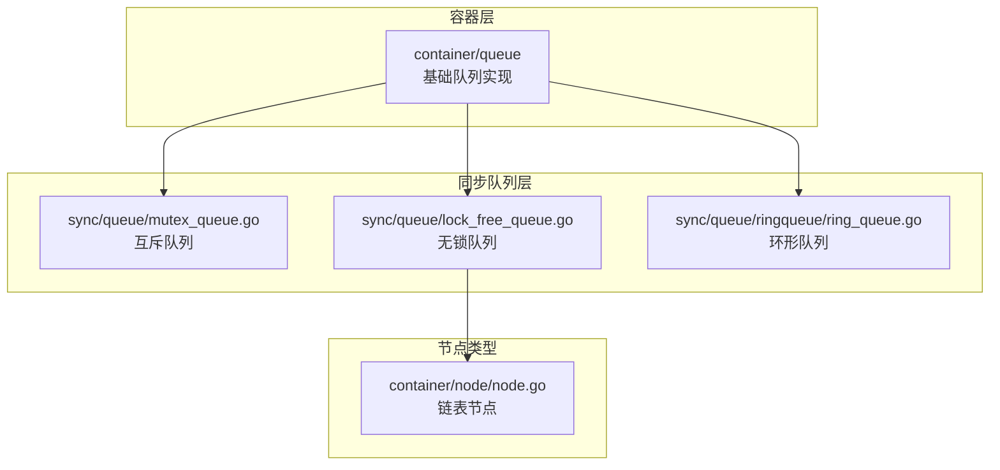
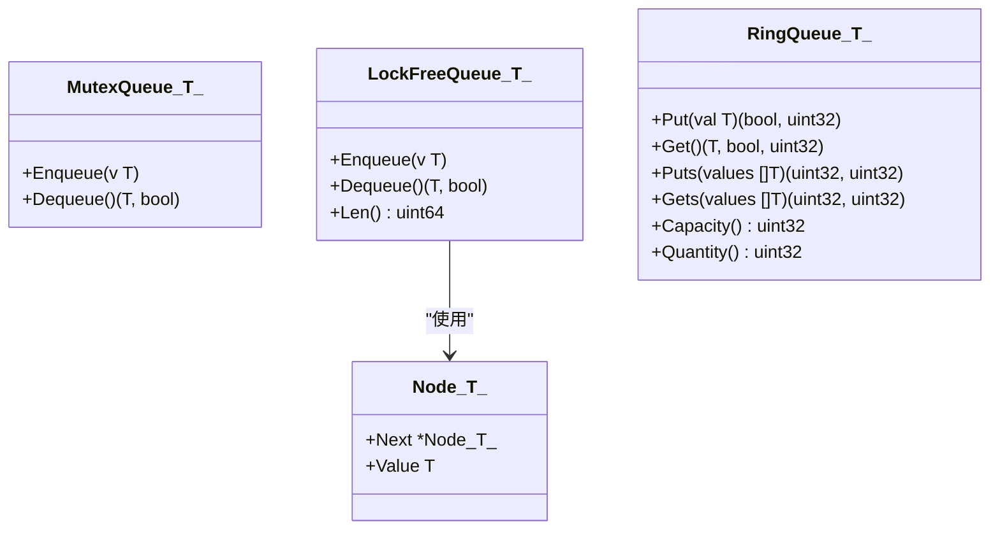
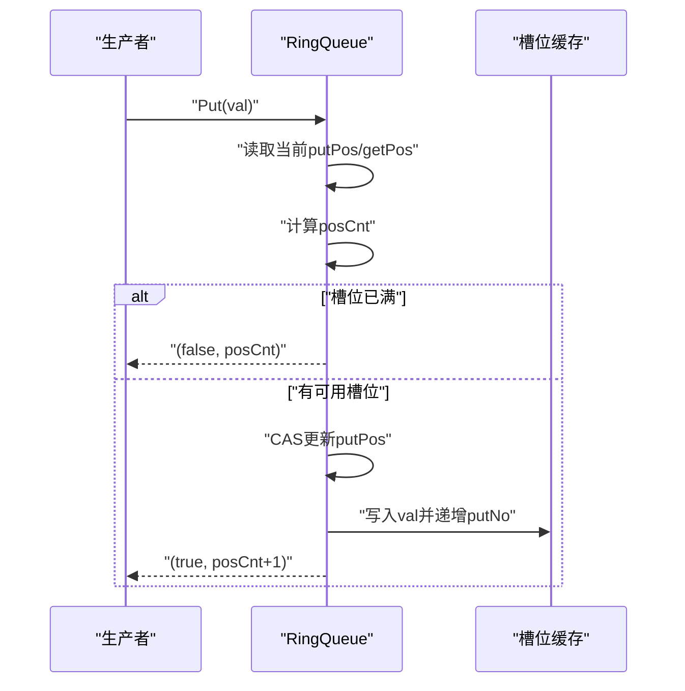
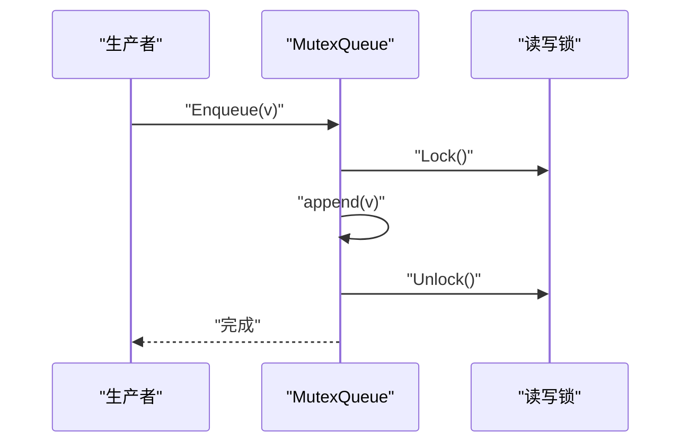
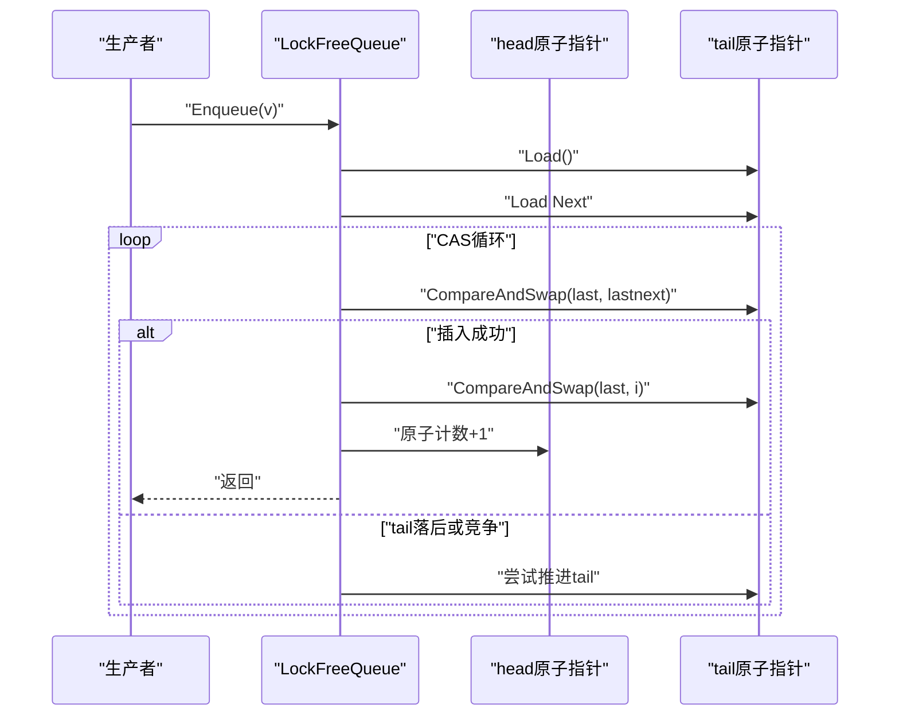
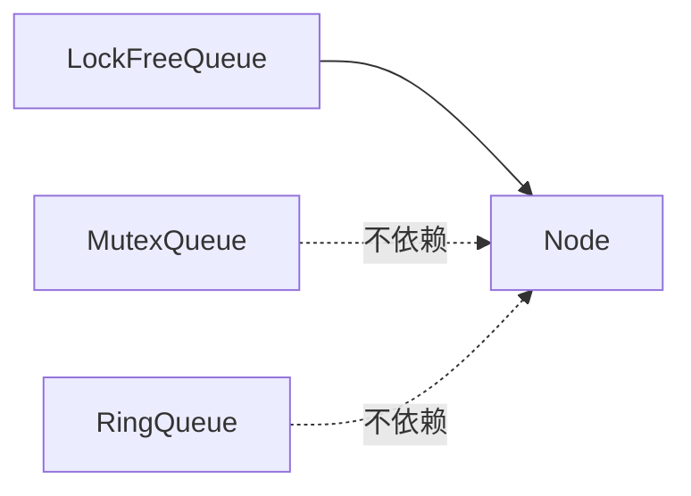

# 队列容器

<cite>
**本文档引用的文件**
- [ring_queue.go](file://thirdparty/gox/container/queue/ringqueue/ring_queue.go)
- [mutex_queue.go](file://thirdparty/gox/sync/queue/mutex_queue.go)
- [lock_free_queue.go](file://thirdparty/gox/sync/queue/lock_free_queue.go)
- [lock_free_queue_test.go](file://thirdparty/gox/sync/queue/lock_free_queue_test.go)
- [ring_queue.go](file://thirdparty/gox/sync/queue/ringqueue/ring_queue.go)
- [node.go](file://thirdparty/gox/container/node/node.go)
</cite>

## 目录
1. [简介](#简介)
2. [项目结构](#项目结构)
3. [核心组件](#核心组件)
4. [架构总览](#架构总览)
5. [详细组件分析](#详细组件分析)
6. [依赖关系分析](#依赖关系分析)
7. [性能考量](#性能考量)
8. [故障排查指南](#故障排查指南)
9. [结论](#结论)
10. [附录：API 参考](#附录api-参考)

## 简介
本文件为队列容器模块的详细技术文档，覆盖以下三类队列的实现与使用：
- 环形队列（RingQueue）：固定容量、数组存储、支持并发安全的入队/出队与批量操作。
- 互斥队列（MutexQueue）：基于切片与读写锁的线程安全队列，提供基本的并发保护。
- 无锁队列（LockFreeQueue）：基于链表与原子指针的无锁队列，追求高并发下的吞吐。

文档将从数据结构原理、并发安全保证、性能特征与适用场景出发，给出 API 参考、容量管理、阻塞与非阻塞模式、内存分配策略，并提供并发编程的最佳实践与排错建议。

## 项目结构
队列容器位于第三方库 gox 中，按功能域划分：
- 容器层：container/queue 提供基础队列实现（如基于 container/list 的队列）。
- 同步队列层：sync/queue 提供并发安全队列实现（互斥队列、无锁队列、环形队列）。
- 节点类型：container/node 提供链表节点类型，被无锁队列复用。

图表来源
- [mutex_queue.go:1-31](file://thirdparty/gox/sync/queue/mutex_queue.go#L1-L31)
- [lock_free_queue.go:1-81](file://thirdparty/gox/sync/queue/lock_free_queue.go#L1-L81)
- [ring_queue.go:1-268](file://thirdparty/gox/sync/queue/ringqueue/ring_queue.go#L1-L268)
- [node.go:1-44](file://thirdparty/gox/container/node/node.go#L1-L44)

章节来源
- [mutex_queue.go:1-31](file://thirdparty/gox/sync/queue/mutex_queue.go#L1-L31)
- [lock_free_queue.go:1-81](file://thirdparty/gox/sync/queue/lock_free_queue.go#L1-L81)
- [ring_queue.go:1-268](file://thirdparty/gox/sync/queue/ringqueue/ring_queue.go#L1-L268)
- [node.go:1-44](file://thirdparty/gox/container/node/node.go#L1-L44)

## 核心组件
本节概述三类队列的核心能力与差异：
- 环形队列（RingQueue）
  - 固定容量、数组存储、支持并发安全的单个/批量入队/出队。
  - 提供容量查询、数量统计、批量写入/读取接口。
- 互斥队列（MutexQueue）
  - 基于切片与读写锁，提供基本的并发保护。
  - 支持入队、出队与空队列判定。
- 无锁队列（LockFreeQueue）
  - 基于链表与原子指针，追求高并发吞吐。
  - 提供入队、出队与长度查询。

章节来源
- [ring_queue.go:1-109](file://thirdparty/gox/container/queue/ringqueue/ring_queue.go#L1-L109)
- [mutex_queue.go:1-31](file://thirdparty/gox/sync/queue/mutex_queue.go#L1-L31)
- [lock_free_queue.go:1-81](file://thirdparty/gox/sync/queue/lock_free_queue.go#L1-L81)

## 架构总览
三类队列在并发模型上的差异如下：
- 环形队列：通过原子位置指针与缓存槽位实现无锁写入/读取，但存在竞争时的让出机制。
- 互斥队列：以读写锁保护共享切片，避免竞态。
- 无锁队列：以原子 CAS 操作维护头尾指针，避免锁开销。

图表来源
- [mutex_queue.go:1-31](file://thirdparty/gox/sync/queue/mutex_queue.go#L1-L31)
- [lock_free_queue.go:1-81](file://thirdparty/gox/sync/queue/lock_free_queue.go#L1-L81)
- [ring_queue.go:1-268](file://thirdparty/gox/sync/queue/ringqueue/ring_queue.go#L1-L268)
- [node.go:1-44](file://thirdparty/gox/container/node/node.go#L1-L44)

## 详细组件分析

### 环形队列（RingQueue）
- 数据结构原理
  - 使用固定容量的数组作为缓冲区，配合原子计数与掩码运算实现环形索引。
  - 每个槽位包含值与“生产/消费”序号，通过 CAS 写入/读取，避免直接锁竞争。
- 并发安全保证
  - 入队/出队均通过原子 CAS 更新位置指针；当槽位未就绪时，调用让出以降低争用。
  - 批量入队/出队通过一次性更新位置指针并逐槽写入/读取，减少 CAS 次数。
- 性能特征
  - 单槽位操作为 O(1)，批量操作可显著提升吞吐。
  - 在高竞争场景下，通过让出与掩码索引减少伪共享与缓存抖动。
- 适用场景
  - 高并发生产者/消费者模型，对延迟敏感且希望避免锁开销。
  - 对容量可控、需要批量 I/O 的场景尤为合适。
- API 参考（路径）
  - 单个入队：[Put:72-110](file://thirdparty/gox/sync/queue/ringqueue/ring_queue.go#L72-L110)
  - 单个出队：[Get:161-200](file://thirdparty/gox/sync/queue/ringqueue/ring_queue.go#L161-L200)
  - 批量入队：[Puts:113-158](file://thirdparty/gox/sync/queue/ringqueue/ring_queue.go#L113-L158)
  - 批量出队：[Gets:203-249](file://thirdparty/gox/sync/queue/ringqueue/ring_queue.go#L203-L249)
  - 容量与数量：[Capacity/Quantity:52-68](file://thirdparty/gox/sync/queue/ringqueue/ring_queue.go#L52-L68)

图表来源
- [ring_queue.go:72-110](file://thirdparty/gox/sync/queue/ringqueue/ring_queue.go#L72-L110)

章节来源
- [ring_queue.go:1-268](file://thirdparty/gox/sync/queue/ringqueue/ring_queue.go#L1-L268)

### 互斥队列（MutexQueue）
- 数据结构原理
  - 基于切片存储元素，使用读写锁保护共享状态，避免并发访问冲突。
- 并发安全保证
  - 入队使用写锁追加到切片末尾；出队使用写锁检查长度并移除首元素。
- 性能特征
  - 简单可靠，但在高并发下写锁可能成为瓶颈。
- 适用场景
  - 并发度不高或对实现复杂度要求较低的场景。
- API 参考（路径）
  - 入队：[Enqueue:14-18](file://thirdparty/gox/sync/queue/mutex_queue.go#L14-L18)
  - 出队：[Dequeue:20-30](file://thirdparty/gox/sync/queue/mutex_queue.go#L20-L30)

图表来源
- [mutex_queue.go:14-18](file://thirdparty/gox/sync/queue/mutex_queue.go#L14-L18)

章节来源
- [mutex_queue.go:1-31](file://thirdparty/gox/sync/queue/mutex_queue.go#L1-L31)

### 无锁队列（LockFreeQueue）
- 数据结构原理
  - 基于链表节点与原子指针维护队列头尾，通过 CAS 操作更新指针。
  - 使用原子计数记录长度，避免遍历。
- 并发安全保证
  - 入队/出队均采用 CAS 循环，确保在多线程下的一致性。
- 性能特征
  - 高并发下吞吐更高，但实现更复杂，内存分配与缓存局部性需关注。
- 适用场景
  - 高并发、低延迟、对锁开销敏感的场景。
- API 参考（路径）
  - 入队：[Enqueue:32-50](file://thirdparty/gox/sync/queue/lock_free_queue.go#L32-L50)
  - 出队：[Dequeue:54-75](file://thirdparty/gox/sync/queue/lock_free_queue.go#L54-L75)
  - 长度：[Len:78-80](file://thirdparty/gox/sync/queue/lock_free_queue.go#L78-L80)

图表来源
- [lock_free_queue.go:32-50](file://thirdparty/gox/sync/queue/lock_free_queue.go#L32-L50)

章节来源
- [lock_free_queue.go:1-81](file://thirdparty/gox/sync/queue/lock_free_queue.go#L1-L81)
- [lock_free_queue_test.go:1-87](file://thirdparty/gox/sync/queue/lock_free_queue_test.go#L1-L87)
- [node.go:1-44](file://thirdparty/gox/container/node/node.go#L1-L44)

## 依赖关系分析
- 无锁队列依赖链表节点类型，用于构建队列的链式结构。
- 环形队列与互斥队列均为独立实现，不依赖外部节点类型。
- 测试文件对比了无锁队列与互斥队列在并行场景下的性能差异。

图表来源
- [lock_free_queue.go:1-81](file://thirdparty/gox/sync/queue/lock_free_queue.go#L1-L81)
- [node.go:1-44](file://thirdparty/gox/container/node/node.go#L1-L44)
- [mutex_queue.go:1-31](file://thirdparty/gox/sync/queue/mutex_queue.go#L1-L31)
- [ring_queue.go:1-268](file://thirdparty/gox/sync/queue/ringqueue/ring_queue.go#L1-L268)

章节来源
- [lock_free_queue.go:1-81](file://thirdparty/gox/sync/queue/lock_free_queue.go#L1-L81)
- [node.go:1-44](file://thirdparty/gox/container/node/node.go#L1-L44)
- [mutex_queue.go:1-31](file://thirdparty/gox/sync/queue/mutex_queue.go#L1-L31)
- [ring_queue.go:1-268](file://thirdparty/gox/sync/queue/ringqueue/ring_queue.go#L1-L268)

## 性能考量
- 环形队列
  - 优点：批量操作吞吐高、竞争时通过让出降低争用；适合固定容量场景。
  - 注意：槽位写入/读取需等待对方序号一致，可能产生短暂忙等。
- 互斥队列
  - 优点：实现简单、易理解；在低并发下表现稳定。
  - 注意：写锁可能成为热点，高并发下延迟上升。
- 无锁队列
  - 优点：高并发吞吐高，避免锁开销。
  - 注意：内存分配与缓存局部性影响明显；实现复杂度较高。
- 容量管理
  - 环形队列容量固定，建议按峰值吞吐与内存预算评估；可通过批量接口减少 CAS 次数。
  - 互斥队列容量随切片增长，注意扩容带来的拷贝成本。
  - 无锁队列容量由链表节点决定，注意 GC 与内存碎片问题。
- 阻塞与非阻塞
  - 环形队列在槽位不足或为空时会进行让出，属于非阻塞式等待；可根据业务需求在上层封装阻塞逻辑。
  - 互斥队列与无锁队列提供立即返回的布尔结果，便于上层实现阻塞/非阻塞策略。

[本节为通用性能讨论，无需列出具体文件来源]

## 故障排查指南
- 空队列出队
  - 互斥队列与无锁队列在空队列时返回失败标记，应在外层检查返回值。
  - 参考：[Dequeue 空队列测试:14-19](file://thirdparty/gox/sync/queue/lock_free_queue_test.go#L14-L19)
- 长度一致性
  - 无锁队列通过原子计数维护长度，若出现异常，检查 CAS 循环与计数更新。
  - 参考：[长度测试:21-36](file://thirdparty/gox/sync/queue/lock_free_queue_test.go#L21-L36)
- 并发竞争
  - 环形队列在高竞争时会频繁让出，观察 posCnt 与返回值，必要时调整批量粒度。
  - 参考：[环形队列 Put/Get:72-110](file://thirdparty/gox/sync/queue/ringqueue/ring_queue.go#L72-L110)
- 性能对比
  - 若发现无锁队列在特定场景下不如互斥队列，可参考基准测试思路进行自测。
  - 参考：[队列基准测试:61-86](file://thirdparty/gox/sync/queue/lock_free_queue_test.go#L61-L86)

章节来源
- [lock_free_queue_test.go:14-36](file://thirdparty/gox/sync/queue/lock_free_queue_test.go#L14-L36)
- [lock_free_queue_test.go:61-86](file://thirdparty/gox/sync/queue/lock_free_queue_test.go#L61-L86)
- [ring_queue.go:72-110](file://thirdparty/gox/sync/queue/ringqueue/ring_queue.go#L72-L110)

## 结论
- 环形队列适用于固定容量、高吞吐、低锁开销的场景，具备良好的批量处理能力。
- 互斥队列实现简单、易于维护，适合低并发或对复杂度敏感的场景。
- 无锁队列在高并发下具有优势，但实现与内存管理更复杂，需结合业务特性权衡。
- 在实际应用中，建议先以互斥队列验证功能，再在高并发场景引入环形/无锁队列，并通过基准测试持续评估。

[本节为总结性内容，无需列出具体文件来源]

## 附录：API 参考

### 环形队列（RingQueue）
- 构造
  - New(capacity uint32) *RingQueue[T]
- 入队
  - Put(val T) (ok bool, quantity uint32)
  - Puts(values []T) (puts uint32, quantity uint32)
- 出队
  - Get() (val T, ok bool, quantity uint32)
  - Gets(values []T) (gets uint32, quantity uint32)
- 查询
  - Capacity() uint32
  - Quantity() uint32

章节来源
- [ring_queue.go:27-43](file://thirdparty/gox/sync/queue/ringqueue/ring_queue.go#L27-L43)
- [ring_queue.go:72-110](file://thirdparty/gox/sync/queue/ringqueue/ring_queue.go#L72-L110)
- [ring_queue.go:113-158](file://thirdparty/gox/sync/queue/ringqueue/ring_queue.go#L113-L158)
- [ring_queue.go:161-200](file://thirdparty/gox/sync/queue/ringqueue/ring_queue.go#L161-L200)
- [ring_queue.go:203-249](file://thirdparty/gox/sync/queue/ringqueue/ring_queue.go#L203-L249)
- [ring_queue.go:52-68](file://thirdparty/gox/sync/queue/ringqueue/ring_queue.go#L52-L68)

### 互斥队列（MutexQueue）
- 构造
  - NewMutexQueue[T]() *MutexQueue[T]
- 入队/出队
  - Enqueue(v T)
  - Dequeue() (T, bool)

章节来源
- [mutex_queue.go:10-12](file://thirdparty/gox/sync/queue/mutex_queue.go#L10-L12)
- [mutex_queue.go:14-18](file://thirdparty/gox/sync/queue/mutex_queue.go#L14-L18)
- [mutex_queue.go:20-30](file://thirdparty/gox/sync/queue/mutex_queue.go#L20-L30)

### 无锁队列（LockFreeQueue）
- 构造
  - NewLockFreeQueue[T]() *LockFreeQueue[T]
- 入队/出队/长度
  - Enqueue(v T)
  - Dequeue() (T, bool)
  - Len() uint64

章节来源
- [lock_free_queue.go:23-29](file://thirdparty/gox/sync/queue/lock_free_queue.go#L23-L29)
- [lock_free_queue.go:32-50](file://thirdparty/gox/sync/queue/lock_free_queue.go#L32-L50)
- [lock_free_queue.go:54-75](file://thirdparty/gox/sync/queue/lock_free_queue.go#L54-L75)
- [lock_free_queue.go:78-80](file://thirdparty/gox/sync/queue/lock_free_queue.go#L78-L80)