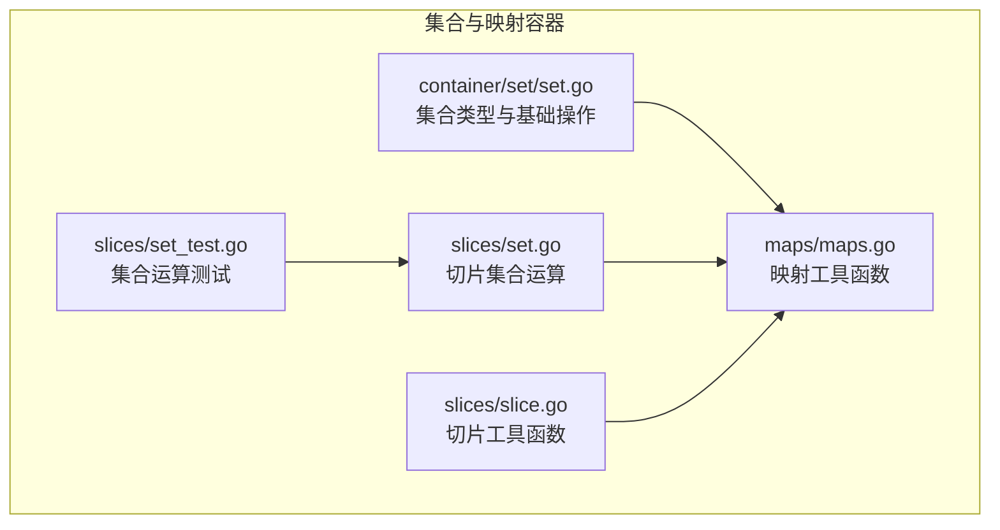
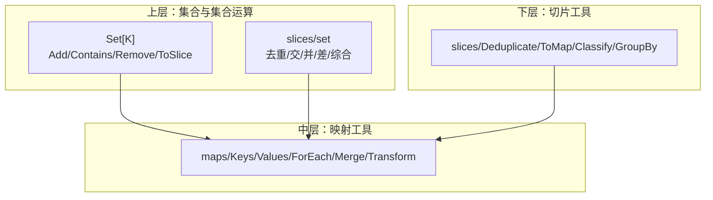
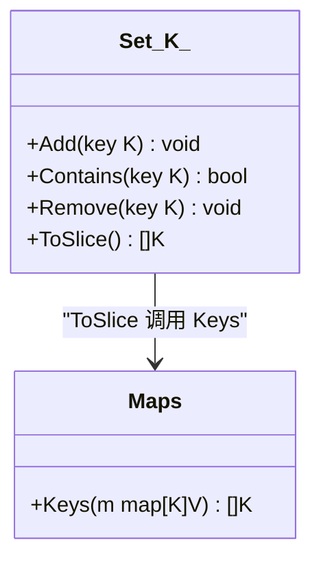
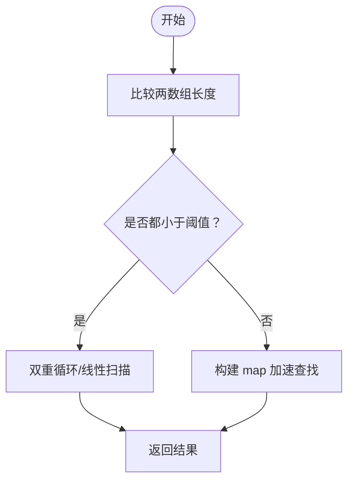
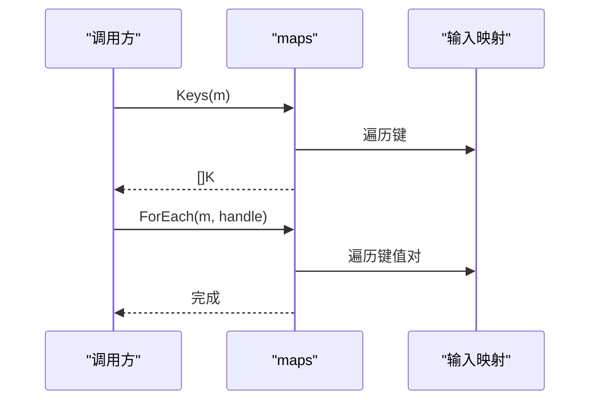
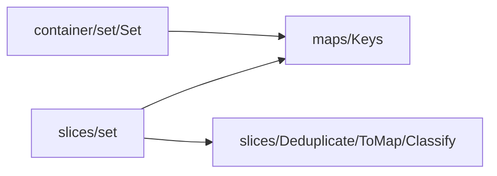

# 集合与映射容器

<cite>
**本文档引用的文件**
- [thirdparty/gox/container/set/set.go](file://thirdparty/gox/container/set/set.go)
- [thirdparty/gox/slices/set.go](file://thirdparty/gox/slices/set.go)
- [thirdparty/gox/maps/maps.go](file://thirdparty/gox/maps/maps.go)
- [thirdparty/gox/slices/slice.go](file://thirdparty/gox/slices/slice.go)
- [thirdparty/gox/slices/set_test.go](file://thirdparty/gox/slices/set_test.go)
</cite>

## 目录
1. [简介](#简介)
2. [项目结构](#项目结构)
3. [核心组件](#核心组件)
4. [架构总览](#架构总览)
5. [详细组件分析](#详细组件分析)
6. [依赖关系分析](#依赖关系分析)
7. [性能考量](#性能考量)
8. [故障排查指南](#故障排查指南)
9. [结论](#结论)
10. [附录](#附录)

## 简介
本文件聚焦于仓库中的集合与映射容器模块，系统性梳理以下能力：
- 集合（Set）：基于 Go 内置 map 的轻量封装，提供添加、删除、包含检查、转切片等基础操作，并支持集合运算（并、交、差）。
- 映射（Map）：提供键值遍历、合并、变换等工具函数，便于在集合运算与数据处理中高效协作。
- 数组集合运算：在 slices 包中提供针对切片的高性能集合运算（去重、交、并、差），并支持按键相等性进行运算。

本模块以“最小依赖、高内聚”的方式组织，既可直接用于业务开发，也可作为上层数据处理的基础构件。

## 项目结构
围绕集合与映射容器的关键文件如下：
- 集合实现：thirdparty/gox/container/set/set.go
- 切片集合运算：thirdparty/gox/slices/set.go
- 映射工具：thirdparty/gox/maps/maps.go
- 切片工具：thirdparty/gox/slices/slice.go
- 集合运算测试：thirdparty/gox/slices/set_test.go

图表来源
- [thirdparty/gox/container/set/set.go:1-33](file://thirdparty/gox/container/set/set.go#L1-L33)
- [thirdparty/gox/slices/set.go:1-521](file://thirdparty/gox/slices/set.go#L1-L521)
- [thirdparty/gox/maps/maps.go:1-107](file://thirdparty/gox/maps/maps.go#L1-L107)
- [thirdparty/gox/slices/slice.go:1-268](file://thirdparty/gox/slices/slice.go#L1-L268)
- [thirdparty/gox/slices/set_test.go:1-64](file://thirdparty/gox/slices/set_test.go#L1-L64)

章节来源
- [thirdparty/gox/container/set/set.go:1-33](file://thirdparty/gox/container/set/set.go#L1-L33)
- [thirdparty/gox/slices/set.go:1-521](file://thirdparty/gox/slices/set.go#L1-L521)
- [thirdparty/gox/maps/maps.go:1-107](file://thirdparty/gox/maps/maps.go#L1-L107)
- [thirdparty/gox/slices/slice.go:1-268](file://thirdparty/gox/slices/slice.go#L1-L268)
- [thirdparty/gox/slices/set_test.go:1-64](file://thirdparty/gox/slices/set_test.go#L1-L64)

## 核心组件
- 集合 Set[K comparable]
  - 类型定义：基于 map[K]struct{} 实现，键为元素，值使用空结构体节省空间。
  - 基础操作：Add、Contains、Remove、ToSlice。
  - 依赖：内部调用 maps.Keys 将集合转为切片。
- 切片集合运算（slices/set）
  - 去重：RemoveDuplicates、RemoveDuplicatesByKey、RemoveDuplicatesByKeyRetainBehind。
  - 交集：Intersection、IntersectionMap、IntersectionByKey、OrderedArrayIntersection。
  - 并集：Union、UnionByKey。
  - 差集：DifferenceSet、DifferenceSetByKey；以及双向差集 Difference。
  - 综合：UnionAndIntersectionAndDifference。
  - 辅助：HasCoincide、HasCoincideByKey。
- 映射工具（maps）
  - 键值遍历：Keys、Values、ForEach、ForEachKey、ForEachValue。
  - 转换与合并：KeysMap、ValuesMap、Merge、Transform。
- 切片工具（slices）
  - 基础遍历与转换：ForEach、Map、Filter、Reduce、GroupBy、ToPtrs、Copy。
  - 结构化切片：TwoDimensionalSlice、ThreeDimensionalSlice。
  - 其他：Deduplicate、ToMap、Classify、GuardSlice、PtrToSlicePtr、Convert、Remove、Zip、ReverseForEach、Sum。

章节来源
- [thirdparty/gox/container/set/set.go:11-32](file://thirdparty/gox/container/set/set.go#L11-L32)
- [thirdparty/gox/slices/set.go:85-520](file://thirdparty/gox/slices/set.go#L85-L520)
- [thirdparty/gox/maps/maps.go:11-107](file://thirdparty/gox/maps/maps.go#L11-L107)
- [thirdparty/gox/slices/slice.go:19-268](file://thirdparty/gox/slices/slice.go#L19-L268)

## 架构总览
集合与映射容器采用“分层工具库”设计：
- 上层：集合 Set 与切片集合运算，面向业务场景的集合操作。
- 中层：映射工具 maps，提供键值遍历与转换，支撑集合运算的中间步骤。
- 下层：切片工具 slices，提供通用的切片处理能力，辅助集合运算与数据准备。

图表来源
- [thirdparty/gox/container/set/set.go:11-32](file://thirdparty/gox/container/set/set.go#L11-L32)
- [thirdparty/gox/slices/set.go:85-520](file://thirdparty/gox/slices/set.go#L85-L520)
- [thirdparty/gox/maps/maps.go:11-107](file://thirdparty/gox/maps/maps.go#L11-L107)
- [thirdparty/gox/slices/slice.go:46-90](file://thirdparty/gox/slices/slice.go#L46-L90)

## 详细组件分析

### 集合 Set[K comparable]
- 设计要点
  - 使用 map[K]struct{} 表示集合，键唯一，值为空结构体，内存占用低。
  - 提供 Add、Contains、Remove、ToSlice 等常用接口。
  - ToSlice 内部委托 maps.Keys 获取所有键。
- 性能特征
  - 添加/删除/包含检查均为平均 O(1)。
  - ToSlice 遍历 map，时间复杂度 O(n)。
- 适用场景
  - 快速去重、存在性检查、集合运算预处理。

图表来源
- [thirdparty/gox/container/set/set.go:11-32](file://thirdparty/gox/container/set/set.go#L11-L32)
- [thirdparty/gox/maps/maps.go:19-25](file://thirdparty/gox/maps/maps.go#L19-L25)

章节来源
- [thirdparty/gox/container/set/set.go:11-32](file://thirdparty/gox/container/set/set.go#L11-L32)
- [thirdparty/gox/maps/maps.go:19-25](file://thirdparty/gox/maps/maps.go#L19-L25)

### 切片集合运算（slices/set）
- 去重
  - RemoveDuplicates：基于 map[T]struct{} 去重，保留首次出现顺序。
  - RemoveDuplicatesByKey：按 EqualKey 返回的键去重，保留首次或最后一次出现。
- 交集
  - Intersection/IntersectionMap：短数组直接比较，长数组使用 map 加速。
  - IntersectionByKey：按 EqualKey 计算交集，保留来自 a 的元素优先。
  - OrderedArrayIntersection：两个有序数组的交集，利用有序特性减少比较次数。
- 并集
  - Union：使用 map[T]struct{} 合并，去重后转键列表。
  - UnionByKey：按 EqualKey 合并，保留来自 a 的元素优先。
- 差集
  - DifferenceSet/differenceSet：根据数组规模选择布尔标记或直接查找两种策略。
  - DifferenceSetByKey：按 EqualKey 计算差集。
  - Difference：返回 A-B 与 B-A 的双元组。
- 综合
  - UnionAndIntersectionAndDifference：一次性计算并集、交集与双向差集。
- 辅助
  - HasCoincide/HasCoincideByKey：判断是否存在重合元素，支持普通键与 EqualKey。

图表来源
- [thirdparty/gox/slices/set.go:124-170](file://thirdparty/gox/slices/set.go#L124-L170)
- [thirdparty/gox/slices/set.go:286-338](file://thirdparty/gox/slices/set.go#L286-L338)

章节来源
- [thirdparty/gox/slices/set.go:85-520](file://thirdparty/gox/slices/set.go#L85-L520)

### 映射工具（maps）
- 键值遍历与转换
  - Keys/Values：分别提取键与值的切片。
  - ForEach/ForEachKey/ForEachValue：遍历键、值或键值对。
  - KeysMap/ValuesMap：对键或值应用转换函数。
- 合并与变换
  - Merge：合并多个映射，后者覆盖前者。
  - Transform：将映射按转换函数映射为新映射。

图表来源
- [thirdparty/gox/maps/maps.go:11-67](file://thirdparty/gox/maps/maps.go#L11-L67)

章节来源
- [thirdparty/gox/maps/maps.go:11-107](file://thirdparty/gox/maps/maps.go#L11-L107)

### 切片工具（slices）
- 基础能力
  - ForEach/Map/Filter/Reduce/GroupBy/ToPtrs/Copy：通用切片处理。
  - Deduplicate：小数组使用 Contains，大数组使用 map 去重。
  - ToMap/Classify：将切片转换为映射或按键分类。
- 辅助
  - GuardSlice/PtrToSlicePtr/Convert/Remove/Zip/ReverseForEach/Sum：内存与类型转换、切片操作与统计。

章节来源
- [thirdparty/gox/slices/slice.go:19-268](file://thirdparty/gox/slices/slice.go#L19-L268)

### 测试与示例
- 测试用例展示了：
  - HasCoincideByKey 在对象按 ID 相等时的正确行为。
  - Difference 与 UnionAndIntersectionAndDifference 的断言结果。
- 示例思路（不展示代码）
  - 使用 Set 进行快速去重与存在性检查。
  - 使用 slices/set 的 Intersection/Union/Difference 对业务数据进行集合运算。
  - 使用 maps/keys/values 进行键值遍历与统计。

章节来源
- [thirdparty/gox/slices/set_test.go:36-63](file://thirdparty/gox/slices/set_test.go#L36-L63)

## 依赖关系分析
- 集合 Set 依赖映射工具 maps 的 Keys。
- 切片集合运算大量依赖 maps 的 Keys/Values 与合并能力。
- 切片工具 slices 为集合运算提供基础数据结构与转换能力。

图表来源
- [thirdparty/gox/container/set/set.go:30-32](file://thirdparty/gox/container/set/set.go#L30-L32)
- [thirdparty/gox/slices/set.go:85-520](file://thirdparty/gox/slices/set.go#L85-L520)
- [thirdparty/gox/slices/slice.go:46-90](file://thirdparty/gox/slices/slice.go#L46-L90)

章节来源
- [thirdparty/gox/container/set/set.go:30-32](file://thirdparty/gox/container/set/set.go#L30-L32)
- [thirdparty/gox/slices/set.go:85-520](file://thirdparty/gox/slices/set.go#L85-L520)
- [thirdparty/gox/slices/slice.go:46-90](file://thirdparty/gox/slices/slice.go#L46-L90)

## 性能考量
- 集合 Set
  - Add/Contains/Remove 平均 O(1)，适合高频去重与存在性检查。
  - ToSlice 遍历 map，O(n)。
- 切片集合运算
  - 小数组（小于阈值）：使用双重循环或线性扫描，避免额外 map 分配。
  - 大数组：使用 map 加速查找，交集/并集/差集的时间复杂度接近 O(n+m)。
  - OrderedArrayIntersection：利用有序特性减少比较次数，适合已排序数据。
- 去重
  - Deduplicate：小数组 O(n^2)，大数组 O(n)。
  - RemoveDuplicatesByKey：按 EqualKey 去重，保留顺序与优先级由具体函数决定。
- 映射工具
  - Merge/Transform 为 O(n) 遍历，注意键相等性与覆盖策略。

[本节为通用性能讨论，无需列出章节来源]

## 故障排查指南
- 键不可比较
  - 若使用不可比较类型作为集合键或映射键，将触发运行时错误。请确保键满足 comparable 约束。
- 键相等性问题
  - 使用 EqualKey 的运算时，确保 EqualKey 返回稳定的可比较键，并与 EqualKey 的语义一致。
- 性能瓶颈定位
  - 当数据量较大时，优先使用 map 加速的运算（如 IntersectionMap、differenceSet）。
  - 对于有序数组，优先使用 OrderedArrayIntersection。
- 内存与容量
  - 使用 GuardSlice 控制底层数组容量增长，避免频繁扩容。

章节来源
- [thirdparty/gox/slices/slice.go:172-184](file://thirdparty/gox/slices/slice.go#L172-L184)
- [thirdparty/gox/slices/set.go:124-170](file://thirdparty/gox/slices/set.go#L124-L170)
- [thirdparty/gox/slices/set.go:286-338](file://thirdparty/gox/slices/set.go#L286-L338)

## 结论
本模块通过“集合 Set + 切片集合运算 + 映射工具”的组合，提供了从基础去重、存在性检查到复杂集合运算的完整能力。其设计遵循“最小依赖、高内聚”，在保证易用性的同时兼顾性能。推荐在需要高性能集合操作与键值遍历的场景中优先使用本模块提供的函数族。

[本节为总结性内容，无需列出章节来源]

## 附录

### API 参考（按功能分组）
- 集合 Set[K comparable]
  - New：构造空集合。
  - Add(key)：添加元素。
  - Contains(key)：检查元素是否存在。
  - Remove(key)：移除元素。
  - ToSlice()：导出为切片。
- 切片集合运算（slices/set）
  - RemoveDuplicates、RemoveDuplicatesByKey、RemoveDuplicatesByKeyRetainBehind：去重。
  - Intersection、IntersectionMap、IntersectionByKey、OrderedArrayIntersection：交集。
  - Union、UnionByKey：并集。
  - DifferenceSet、DifferenceSetByKey、Difference：差集与双向差集。
  - UnionAndIntersectionAndDifference：并集、交集与双向差集一次性计算。
  - HasCoincide、HasCoincideByKey：判断是否存在重合元素。
- 映射工具（maps）
  - Keys、Values、ForEach、ForEachKey、ForEachValue：键值遍历。
  - KeysMap、ValuesMap：键/值转换。
  - Merge、Transform：映射合并与变换。
- 切片工具（slices）
  - Deduplicate、ToMap、Classify、GroupBy、ToPtrs、Copy、GuardSlice、PtrToSlicePtr、Convert、Remove、Zip、ReverseForEach、Sum：通用切片处理与统计。

章节来源
- [thirdparty/gox/container/set/set.go:13-32](file://thirdparty/gox/container/set/set.go#L13-L32)
- [thirdparty/gox/slices/set.go:85-520](file://thirdparty/gox/slices/set.go#L85-L520)
- [thirdparty/gox/maps/maps.go:11-107](file://thirdparty/gox/maps/maps.go#L11-L107)
- [thirdparty/gox/slices/slice.go:46-268](file://thirdparty/gox/slices/slice.go#L46-L268)