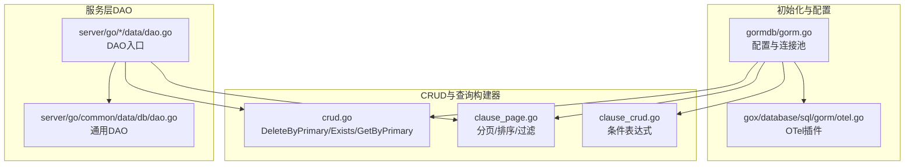
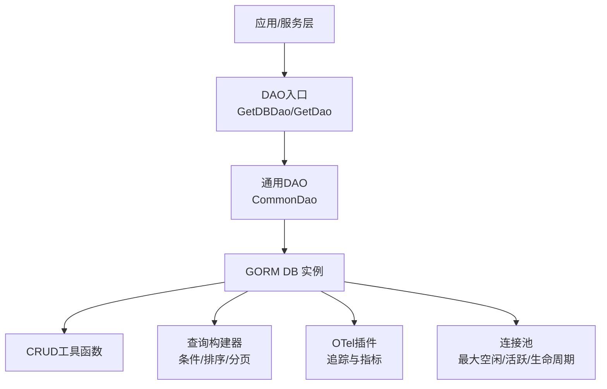
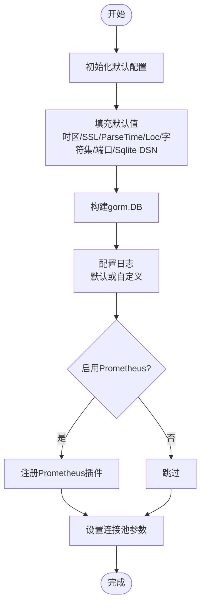
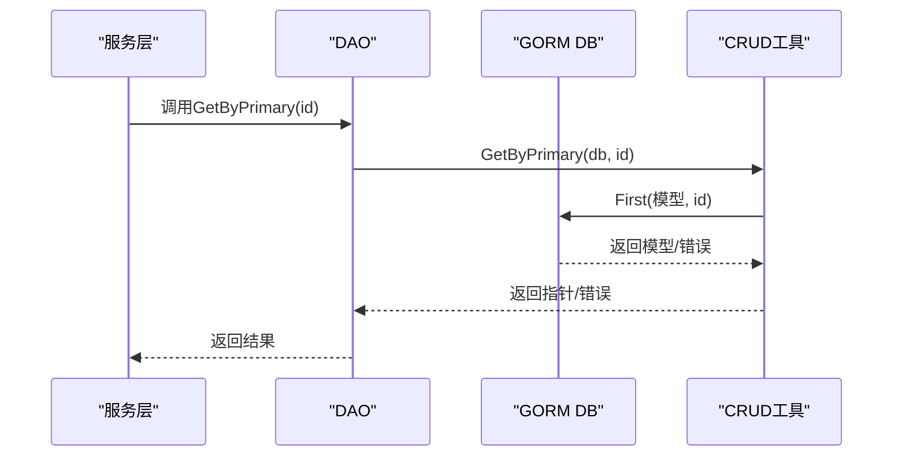
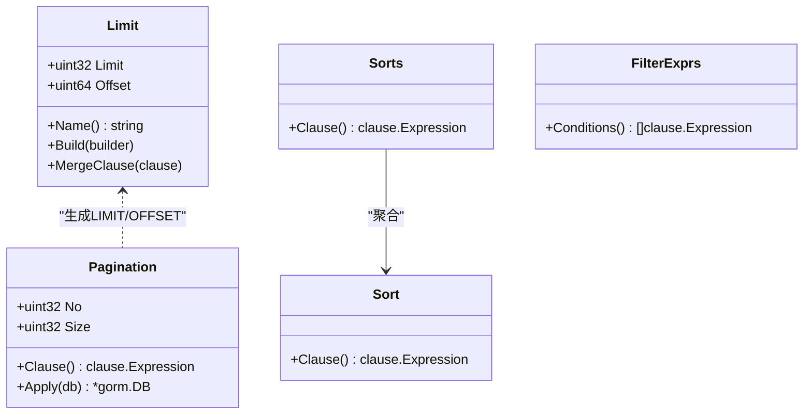
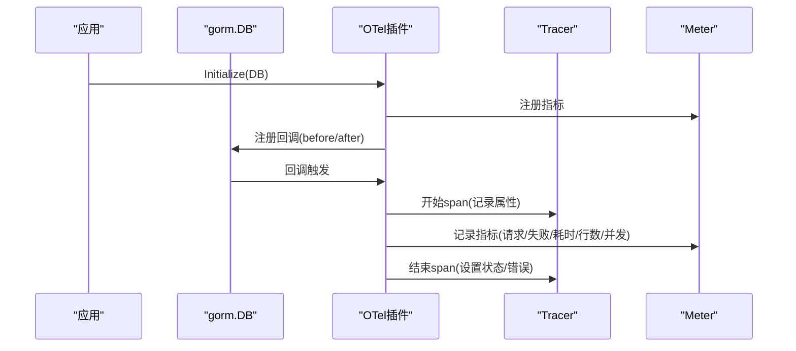
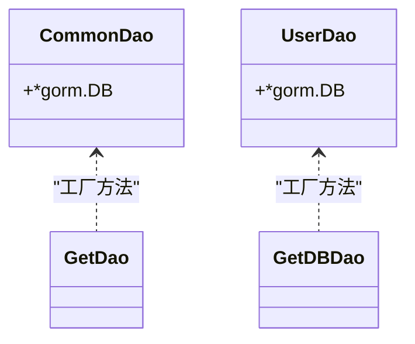
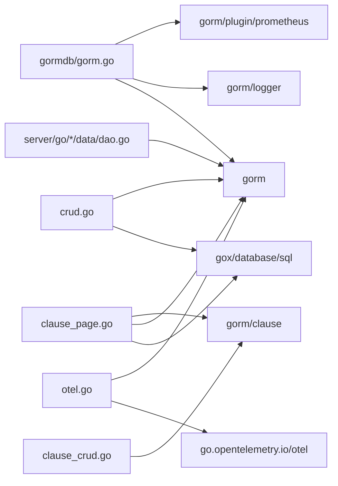

# GORM集成

<cite>
**本文档引用的文件**
- [thirdparty/initialize/dao/gormdb/gorm.go](file://thirdparty/initialize/dao/gormdb/gorm.go)
- [thirdparty/gox/database/sql/gorm/crud.go](file://thirdparty/gox/database/sql/gorm/crud.go)
- [thirdparty/gox/database/sql/gorm/clause_page.go](file://thirdparty/gox/database/sql/gorm/clause_page.go)
- [thirdparty/gox/database/sql/gorm/clause_crud.go](file://thirdparty/gox/database/sql/gorm/clause_crud.go)
- [thirdparty/gox/database/sql/gorm/otel.go](file://thirdparty/gox/database/sql/gorm/otel.go)
- [server/go/common/data/db/dao.go](file://server/go/common/data/db/dao.go)
- [server/go/user/data/dao.go](file://server/go/user/data/dao.go)
- [thirdparty/initialize/dao/dao_field.go](file://thirdparty/initialize/dao/dao_field.go)
</cite>

## 目录
1. [简介](#简介)
2. [项目结构](#项目结构)
3. [核心组件](#核心组件)
4. [架构总览](#架构总览)
5. [详细组件分析](#详细组件分析)
6. [依赖关系分析](#依赖关系分析)
7. [性能考量](#性能考量)
8. [故障排查指南](#故障排查指南)
9. [结论](#结论)
10. [附录](#附录)

## 简介
本文件面向GORM集成模块，提供从配置到高级特性（软删除、批量操作、分页查询）的完整API文档与最佳实践指南。重点覆盖以下方面：
- GORM封装与扩展：连接池、日志、命名策略、Prometheus指标、OpenTelemetry可观测性
- CRUD工具函数：DeleteByPrimary、ExistsByColumn、GetByPrimary等常用方法的实现原理与使用方式
- 查询构建器：条件表达式、排序、分页
- 事务处理：基于GORM回调的事务集成与可观测性
- 高级特性：软删除、批量操作、分页查询

## 项目结构
该模块主要分布在以下位置：
- 初始化与配置：thirdparty/initialize/dao/gormdb/gorm.go
- CRUD与查询构建器：thirdparty/gox/database/sql/gorm/*.go
- 服务层DAO入口：server/go/*/data/dao.go
- DAO接口抽象：thirdparty/initialize/dao/dao_field.go

**图表来源**
- [thirdparty/initialize/dao/gormdb/gorm.go:25-171](file://thirdparty/initialize/dao/gormdb/gorm.go#L25-L171)
- [thirdparty/gox/database/sql/gorm/crud.go:14-69](file://thirdparty/gox/database/sql/gorm/crud.go#L14-L69)
- [thirdparty/gox/database/sql/gorm/clause_page.go:21-158](file://thirdparty/gox/database/sql/gorm/clause_page.go#L21-L158)
- [thirdparty/gox/database/sql/gorm/clause_crud.go:15-21](file://thirdparty/gox/database/sql/gorm/clause_crud.go#L15-L21)
- [thirdparty/gox/database/sql/gorm/otel.go:102-168](file://thirdparty/gox/database/sql/gorm/otel.go#L102-L168)
- [server/go/common/data/db/dao.go:7-16](file://server/go/common/data/db/dao.go#L7-L16)
- [server/go/user/data/dao.go:10-17](file://server/go/user/data/dao.go#L10-L17)

**章节来源**
- [thirdparty/initialize/dao/gormdb/gorm.go:25-171](file://thirdparty/initialize/dao/gormdb/gorm.go#L25-L171)
- [thirdparty/gox/database/sql/gorm/crud.go:14-69](file://thirdparty/gox/database/sql/gorm/crud.go#L14-L69)
- [thirdparty/gox/database/sql/gorm/clause_page.go:21-158](file://thirdparty/gox/database/sql/gorm/clause_page.go#L21-L158)
- [thirdparty/gox/database/sql/gorm/clause_crud.go:15-21](file://thirdparty/gox/database/sql/gorm/clause_crud.go#L15-L21)
- [thirdparty/gox/database/sql/gorm/otel.go:102-168](file://thirdparty/gox/database/sql/gorm/otel.go#L102-L168)
- [server/go/common/data/db/dao.go:7-16](file://server/go/common/data/db/dao.go#L7-L16)
- [server/go/user/data/dao.go:10-17](file://server/go/user/data/dao.go#L10-L17)

## 核心组件
- 数据库配置与连接池：统一配置结构、命名策略、日志、Prometheus指标与连接池参数
- CRUD工具函数：通用删除、存在性检查、主键查询
- 查询构建器：条件表达式、排序、分页
- OpenTelemetry插件：对CRUD操作进行追踪与指标采集
- 服务层DAO入口：提供GetDBDao等工厂方法，便于注入与复用

**章节来源**
- [thirdparty/initialize/dao/gormdb/gorm.go:25-171](file://thirdparty/initialize/dao/gormdb/gorm.go#L25-L171)
- [thirdparty/gox/database/sql/gorm/crud.go:14-69](file://thirdparty/gox/database/sql/gorm/crud.go#L14-L69)
- [thirdparty/gox/database/sql/gorm/clause_page.go:21-158](file://thirdparty/gox/database/sql/gorm/clause_page.go#L21-L158)
- [thirdparty/gox/database/sql/gorm/otel.go:102-168](file://thirdparty/gox/database/sql/gorm/otel.go#L102-L168)
- [server/go/common/data/db/dao.go:7-16](file://server/go/common/data/db/dao.go#L7-L16)
- [server/go/user/data/dao.go:10-17](file://server/go/user/data/dao.go#L10-L17)

## 架构总览
下图展示GORM集成的整体架构：配置层负责数据库连接与监控插件注册；服务层通过DAO入口获取具体DAO实例；CRUD与查询构建器提供通用能力。

**图表来源**
- [server/go/common/data/db/dao.go:7-16](file://server/go/common/data/db/dao.go#L7-L16)
- [server/go/user/data/dao.go:10-17](file://server/go/user/data/dao.go#L10-L17)
- [thirdparty/initialize/dao/gormdb/gorm.go:124-158](file://thirdparty/initialize/dao/gormdb/gorm.go#L124-L158)
- [thirdparty/gox/database/sql/gorm/crud.go:14-69](file://thirdparty/gox/database/sql/gorm/crud.go#L14-L69)
- [thirdparty/gox/database/sql/gorm/clause_page.go:104-158](file://thirdparty/gox/database/sql/gorm/clause_page.go#L104-L158)
- [thirdparty/gox/database/sql/gorm/otel.go:102-168](file://thirdparty/gox/database/sql/gorm/otel.go#L102-L168)

## 详细组件分析

### 数据库配置与连接池
- 配置项涵盖类型、字符集、时区、主机端口、用户密码、方言特定参数（Postgres/MySQL/Sqlite）、命名策略、日志配置、Prometheus配置以及连接池参数
- 初始化流程：默认值填充、时区与SSL/ParseTime/Loc默认值设置、字符集与端口推断、Sqlite DSN默认值
- 连接池：通过gorm.DB.DB()获取原生连接池并设置最大空闲连接数、最大打开连接数、连接最大生命周期、连接最大空闲时间
- 日志：支持使用GORM默认logger或自定义logger（结合内部日志库），并可按慢查询阈值告警

**图表来源**
- [thirdparty/initialize/dao/gormdb/gorm.go:72-122](file://thirdparty/initialize/dao/gormdb/gorm.go#L72-L122)
- [thirdparty/initialize/dao/gormdb/gorm.go:124-158](file://thirdparty/initialize/dao/gormdb/gorm.go#L124-L158)

**章节来源**
- [thirdparty/initialize/dao/gormdb/gorm.go:25-171](file://thirdparty/initialize/dao/gormdb/gorm.go#L25-L171)

### CRUD工具函数
- DeleteByPrimary：根据表名与主键执行删除
- Delete：根据表名与列值执行删除
- ExistsByColumn / ExistsByColumnWithDeletedAt：检查某列值是否存在（可包含软删除）
- ExistsBySQL / ExistsByQuery / Exists：基于SQL或过滤表达式检查存在性
- GetByPrimary：按主键查询单条记录

**图表来源**
- [thirdparty/gox/database/sql/gorm/crud.go:64-69](file://thirdparty/gox/database/sql/gorm/crud.go#L64-L69)

**章节来源**
- [thirdparty/gox/database/sql/gorm/crud.go:14-69](file://thirdparty/gox/database/sql/gorm/crud.go#L14-L69)

### 查询构建器
- 条件表达式：ByPrimary、ByName等基础条件
- 排序：单字段与多字段排序表达式
- 分页：页码与大小转换为LIMIT/OFFSET，支持合并重复子句
- 列表查询：组合过滤、计数、排序与分页后执行查询

**图表来源**
- [thirdparty/gox/database/sql/gorm/clause_page.go:21-127](file://thirdparty/gox/database/sql/gorm/clause_page.go#L21-L127)
- [thirdparty/gox/database/sql/gorm/clause_crud.go:15-21](file://thirdparty/gox/database/sql/gorm/clause_crud.go#L15-L21)

**章节来源**
- [thirdparty/gox/database/sql/gorm/clause_page.go:21-158](file://thirdparty/gox/database/sql/gorm/clause_page.go#L21-L158)
- [thirdparty/gox/database/sql/gorm/clause_crud.go:15-21](file://thirdparty/gox/database/sql/gorm/clause_crud.go#L15-L21)

### OpenTelemetry可观测性
- 插件注册：在Create/Query/Update/Delete/Row/Raw回调前后注册钩子
- 追踪：为每个操作创建span，记录开始时间、上下文、表名、系统类型等属性
- 指标：请求总量、失败次数、耗时直方图、影响行数直方图、并发请求数
- 关闭：释放底层统计资源

**图表来源**
- [thirdparty/gox/database/sql/gorm/otel.go:102-168](file://thirdparty/gox/database/sql/gorm/otel.go#L102-L168)
- [thirdparty/gox/database/sql/gorm/otel.go:246-294](file://thirdparty/gox/database/sql/gorm/otel.go#L246-L294)

**章节来源**
- [thirdparty/gox/database/sql/gorm/otel.go:102-168](file://thirdparty/gox/database/sql/gorm/otel.go#L102-L168)
- [thirdparty/gox/database/sql/gorm/otel.go:246-294](file://thirdparty/gox/database/sql/gorm/otel.go#L246-L294)

### 服务层DAO入口
- 通用DAO：CommonDao包装*gorm.DB，提供GetDao工厂方法
- 用户服务DAO：GetDBDao/GetRedisDao工厂方法，分别返回数据库与Redis DAO实例

**图表来源**
- [server/go/common/data/db/dao.go:7-16](file://server/go/common/data/db/dao.go#L7-L16)
- [server/go/user/data/dao.go:10-17](file://server/go/user/data/dao.go#L10-L17)

**章节来源**
- [server/go/common/data/db/dao.go:7-16](file://server/go/common/data/db/dao.go#L7-L16)
- [server/go/user/data/dao.go:10-17](file://server/go/user/data/dao.go#L10-L17)

### DAO接口抽象
- DaoField接口：定义Config()、Init()与io.Closer，作为DAO注入与生命周期管理的基础契约

**章节来源**
- [thirdparty/initialize/dao/dao_field.go:16-21](file://thirdparty/initialize/dao/dao_field.go#L16-L21)

## 依赖关系分析
- 配置层依赖：gorm、gorm/clause、gorm/logger、gorm/plugin/prometheus
- CRUD与查询构建器依赖：sqlx（SQL构造与过滤表达式）、gorm、gorm/clause
- OTel插件依赖：go.opentelemetry.io/otel、metric、trace、gorm
- 服务层DAO依赖：gorm、redis客户端（用于Redis DAO）

**图表来源**
- [thirdparty/initialize/dao/gormdb/gorm.go:9-23](file://thirdparty/initialize/dao/gormdb/gorm.go#L9-L23)
- [thirdparty/gox/database/sql/gorm/crud.go:9-12](file://thirdparty/gox/database/sql/gorm/crud.go#L9-L12)
- [thirdparty/gox/database/sql/gorm/clause_page.go:11-19](file://thirdparty/gox/database/sql/gorm/clause_page.go#L11-L19)
- [thirdparty/gox/database/sql/gorm/clause_crud.go:9-12](file://thirdparty/gox/database/sql/gorm/clause_crud.go#L9-L12)
- [thirdparty/gox/database/sql/gorm/otel.go:3-17](file://thirdparty/gox/database/sql/gorm/otel.go#L3-L17)
- [server/go/user/data/dao.go:3-8](file://server/go/user/data/dao.go#L3-L8)

**章节来源**
- [thirdparty/initialize/dao/gormdb/gorm.go:9-23](file://thirdparty/initialize/dao/gormdb/gorm.go#L9-L23)
- [thirdparty/gox/database/sql/gorm/crud.go:9-12](file://thirdparty/gox/database/sql/gorm/crud.go#L9-L12)
- [thirdparty/gox/database/sql/gorm/clause_page.go:11-19](file://thirdparty/gox/database/sql/gorm/clause_page.go#L11-L19)
- [thirdparty/gox/database/sql/gorm/clause_crud.go:9-12](file://thirdparty/gox/database/sql/gorm/clause_crud.go#L9-L12)
- [thirdparty/gox/database/sql/gorm/otel.go:3-17](file://thirdparty/gox/database/sql/gorm/otel.go#L3-L17)
- [server/go/user/data/dao.go:3-8](file://server/go/user/data/dao.go#L3-L8)

## 性能考量
- 连接池参数：合理设置最大空闲连接数与最大打开连接数，避免过度创建连接；设置连接最大生命周期与空闲时间，防止连接泄漏与老化
- 日志与慢查询：通过日志配置与慢查询阈值，定位性能瓶颈
- 指标监控：启用Prometheus插件与OTel指标，关注耗时直方图、失败率与并发请求数
- 查询优化：优先使用索引列进行过滤与排序；分页查询避免大偏移量，必要时采用游标分页
- 批量操作：批量插入/更新/删除时控制批次大小，减少单次事务压力

[本节为通用性能建议，不直接分析具体文件]

## 故障排查指南
- 连接失败：检查数据库类型、主机、端口、用户、密码与方言特定参数（如Postgres SSL Mode、MySQL ParseTime/Loc）
- 连接池异常：确认最大空闲/打开连接数与生命周期设置是否合理
- 慢查询：查看慢查询阈值与日志输出，定位热点SQL
- 指标缺失：确认OTel插件已正确注册回调与指标
- 存在性检查异常：区分是否包含软删除（ExistsByColumnWithDeletedAt）

**章节来源**
- [thirdparty/initialize/dao/gormdb/gorm.go:72-122](file://thirdparty/initialize/dao/gormdb/gorm.go#L72-L122)
- [thirdparty/gox/database/sql/gorm/otel.go:102-168](file://thirdparty/gox/database/sql/gorm/otel.go#L102-L168)

## 结论
本GORM集成模块提供了从配置、连接池、日志、指标到CRUD与查询构建器的完整能力，并通过OTel插件实现可观测性闭环。配合服务层DAO入口与DAO接口抽象，能够快速构建稳定、可观察、高性能的数据访问层。

[本节为总结性内容，不直接分析具体文件]

## 附录

### 常用方法与最佳实践速查
- DeleteByPrimary：按主键删除，适合强一致场景
- ExistsByColumn / ExistsByColumnWithDeletedAt：存在性检查，后者包含软删除
- GetByPrimary：主键查询，注意错误处理（记录不存在时的ErrRecordNotFound）
- 分页查询：优先使用PaginationExpr与排序表达式，避免大偏移量
- 批量操作：控制批次大小，必要时拆分为多次事务
- 软删除：结合过滤表达式与存在性检查，确保业务一致性

**章节来源**
- [thirdparty/gox/database/sql/gorm/crud.go:14-69](file://thirdparty/gox/database/sql/gorm/crud.go#L14-L69)
- [thirdparty/gox/database/sql/gorm/clause_page.go:104-158](file://thirdparty/gox/database/sql/gorm/clause_page.go#L104-L158)