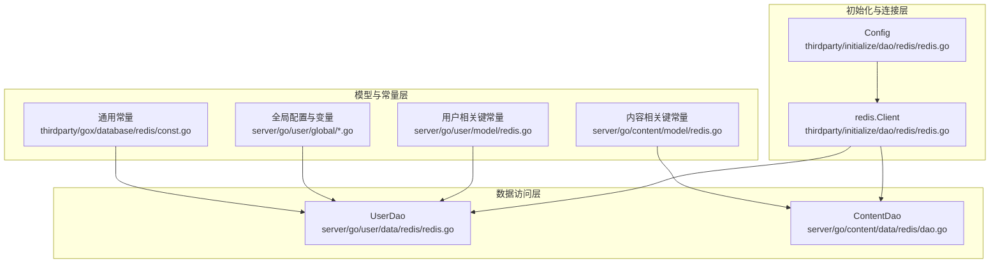
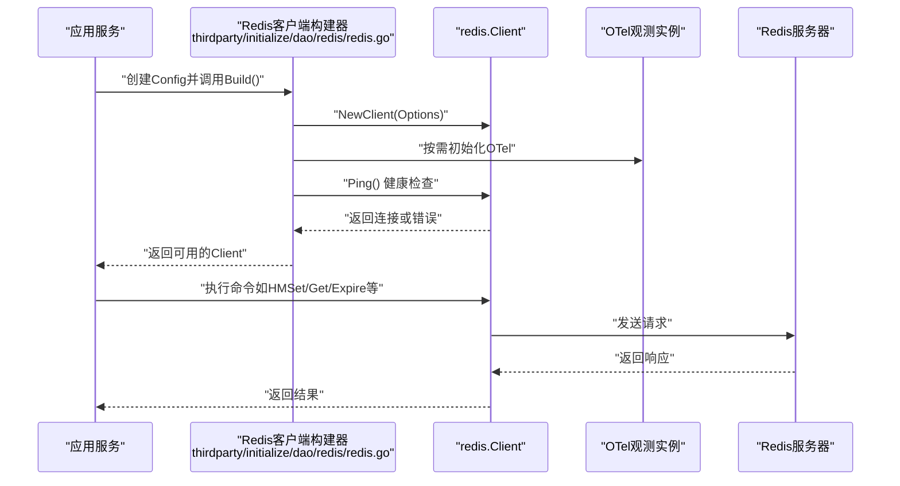
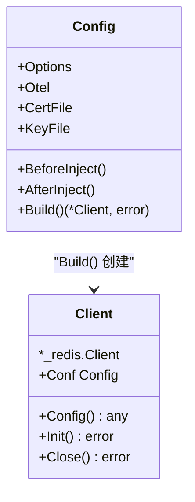
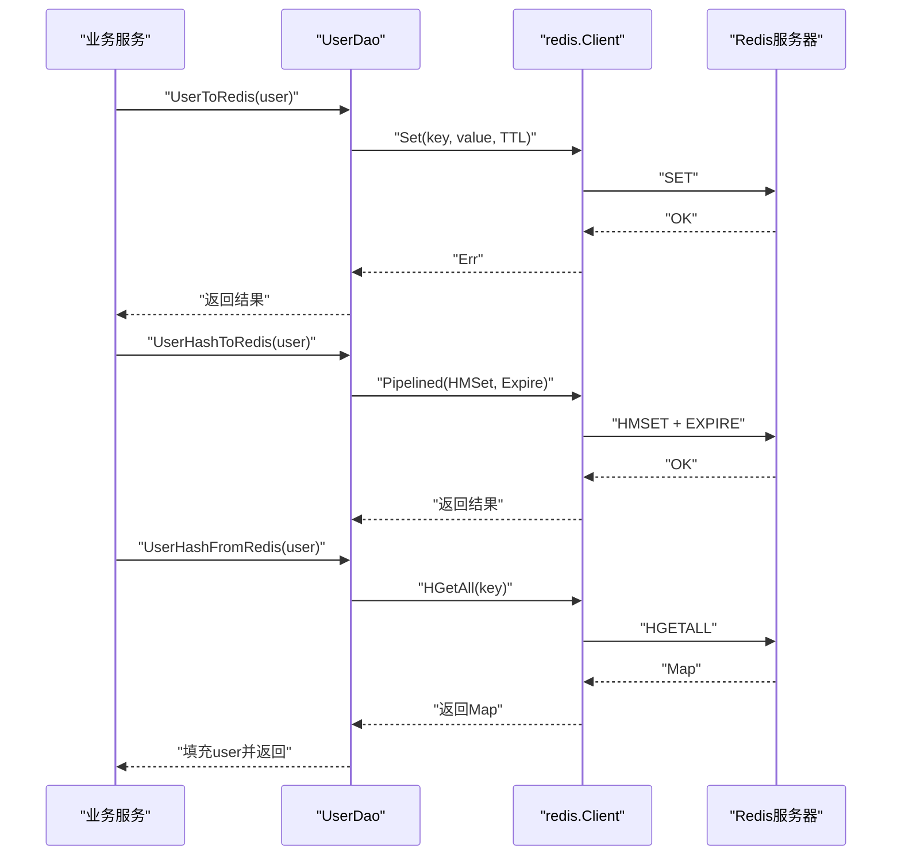
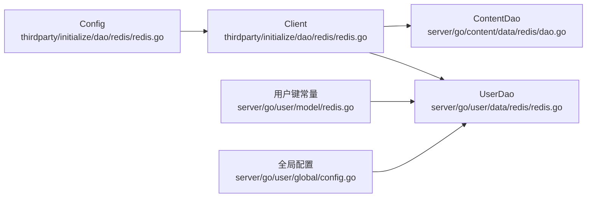

# Redis客户端

<cite>
**本文档引用的文件**
- [thirdparty/initialize/dao/redis/redis.go](file://thirdparty/initialize/dao/redis/redis.go)
- [server/go/user/data/redis/redis.go](file://server/go/user/data/redis/redis.go)
- [server/go/user/model/redis.go](file://server/go/user/model/redis.go)
- [server/go/content/model/redis.go](file://server/go/content/model/redis.go)
- [server/go/user/global/config.go](file://server/go/user/global/config.go)
- [server/go/user/global/var.go](file://server/go/user/global/var.go)
- [server/go/content/data/redis/dao.go](file://server/go/content/data/redis/dao.go)
- [thirdparty/gox/database/redis/const.go](file://thirdparty/gox/database/redis/const.go)
</cite>

## 目录
1. [简介](#简介)
2. [项目结构](#项目结构)
3. [核心组件](#核心组件)
4. [架构总览](#架构总览)
5. [详细组件分析](#详细组件分析)
6. [依赖关系分析](#依赖关系分析)
7. [性能考虑](#性能考虑)
8. [故障排查指南](#故障排查指南)
9. [结论](#结论)
10. [附录](#附录)

## 简介
本文件为Redis客户端模块的详细API文档，覆盖连接管理、命令执行、数据结构操作（Hash、字符串、列表等）、集群与哨兵配置建议、持久化与内存优化、缓存策略与过期时间管理等内容。基于仓库中的实际实现，重点展示如何通过go-redis v9客户端进行高效的数据访问与运维。

## 项目结构
Redis客户端在本项目中主要分布在三层：
- 初始化与连接层：负责构建Redis客户端、OTel可观测性集成、TLS配置与Ping健康检查
- 数据访问层：面向业务的DAO封装，提供用户信息、限流、活跃度等Redis操作
- 模型与常量层：集中定义Redis键前缀与命名规范

**图表来源**
- [thirdparty/initialize/dao/redis/redis.go:39-48](file://thirdparty/initialize/dao/redis/redis.go#L39-L48)
- [server/go/user/data/redis/redis.go:21-27](file://server/go/user/data/redis/redis.go#L21-L27)
- [server/go/content/data/redis/dao.go:7-13](file://server/go/content/data/redis/dao.go#L7-L13)
- [server/go/user/model/redis.go:3-34](file://server/go/user/model/redis.go#L3-L34)
- [server/go/content/model/redis.go:3-12](file://server/go/content/model/redis.go#L3-L12)
- [server/go/user/global/config.go:14-27](file://server/go/user/global/config.go#L14-L27)
- [thirdparty/gox/database/redis/const.go:9-11](file://thirdparty/gox/database/redis/const.go#L9-L11)

**章节来源**
- [thirdparty/initialize/dao/redis/redis.go:19-48](file://thirdparty/initialize/dao/redis/redis.go#L19-L48)
- [server/go/user/data/redis/redis.go:21-27](file://server/go/user/data/redis/redis.go#L21-L27)
- [server/go/content/data/redis/dao.go:7-13](file://server/go/content/data/redis/dao.go#L7-L13)
- [server/go/user/model/redis.go:3-34](file://server/go/user/model/redis.go#L3-L34)
- [server/go/content/model/redis.go:3-12](file://server/go/content/model/redis.go#L3-L12)
- [server/go/user/global/config.go:14-27](file://server/go/user/global/config.go#L14-L27)
- [thirdparty/gox/database/redis/const.go:9-11](file://thirdparty/gox/database/redis/const.go#L9-L11)

## 核心组件
- 连接客户端构建器
  - 支持标准Options配置、可选TLS证书、OTel可观测性初始化、Ping健康检查
  - 提供Close时优雅关闭与OTel实例清理
- 用户数据访问对象（UserDao）
  - 字符串存储与读取、Hash存储与读取、高效Hash读写、活跃时间维护、字段级更新
  - 使用管道（Pipelined）减少RTT，Expire设置过期时间
- 内容数据访问对象（ContentDao）
  - 基于Redis客户端的轻量封装，便于扩展内容相关操作
- 键空间常量
  - 用户登录态、限流、验证码、扩展信息等键前缀统一管理
- 全局配置与变量
  - Token有效期、密钥等全局参数在注入阶段完成标准化

**章节来源**
- [thirdparty/initialize/dao/redis/redis.go:39-48](file://thirdparty/initialize/dao/redis/redis.go#L39-L48)
- [server/go/user/data/redis/redis.go:29-184](file://server/go/user/data/redis/redis.go#L29-L184)
- [server/go/content/data/redis/dao.go:7-13](file://server/go/content/data/redis/dao.go#L7-L13)
- [server/go/user/model/redis.go:3-34](file://server/go/user/model/redis.go#L3-L34)
- [server/go/user/global/config.go:20-27](file://server/go/user/global/config.go#L20-L27)

## 架构总览
下图展示了Redis客户端在系统中的位置与交互流程：

**图表来源**
- [thirdparty/initialize/dao/redis/redis.go:39-48](file://thirdparty/initialize/dao/redis/redis.go#L39-L48)
- [server/go/user/data/redis/redis.go:86-94](file://server/go/user/data/redis/redis.go#L86-L94)

## 详细组件分析

### 组件一：连接管理与客户端生命周期
- 职责
  - 构建Redis客户端，支持TLS与OTel可观测性
  - Ping健康检查确保连接可用
  - 关闭时优雅释放资源
- 关键点
  - Options透传给go-redis客户端
  - TLS证书文件配置后自动注入TLSConfig
  - OTel仅在启用且未初始化时进行初始化
  - Close时若OTel已启用则进行Shutdown

**图表来源**
- [thirdparty/initialize/dao/redis/redis.go:19-48](file://thirdparty/initialize/dao/redis/redis.go#L19-L48)
- [thirdparty/initialize/dao/redis/redis.go:50-78](file://thirdparty/initialize/dao/redis/redis.go#L50-L78)

**章节来源**
- [thirdparty/initialize/dao/redis/redis.go:19-48](file://thirdparty/initialize/dao/redis/redis.go#L19-L48)
- [thirdparty/initialize/dao/redis/redis.go:50-78](file://thirdparty/initialize/dao/redis/redis.go#L50-L78)

### 组件二：用户数据访问（UserDao）
- 职责
  - 用户登录态存储与读取（字符串/Hash两种方式）
  - 高效Hash读写（仅写入必要字段）
  - 活跃时间维护（有序集合+Hash）
  - 字段级更新与扩展信息读取
- 命令封装要点
  - 字符串：Set/Get
  - Hash：HMSet/HGetAll/HSet
  - 管道：Pipelined减少往返
  - 过期：Expire设置TTL
  - 有序集合：ZAdd用于活跃用户扫描

**图表来源**
- [server/go/user/data/redis/redis.go:29-44](file://server/go/user/data/redis/redis.go#L29-L44)
- [server/go/user/data/redis/redis.go:83-95](file://server/go/user/data/redis/redis.go#L83-L95)
- [server/go/user/data/redis/redis.go:98-113](file://server/go/user/data/redis/redis.go#L98-L113)

**章节来源**
- [server/go/user/data/redis/redis.go:29-184](file://server/go/user/data/redis/redis.go#L29-L184)

### 组件三：内容数据访问（ContentDao）
- 职责
  - 基于Redis客户端的轻量封装，便于后续扩展内容相关操作（如计数、限流、缓存等）
- 设计
  - 直接持有redis.Client指针，遵循“组合优于继承”的原则

**章节来源**
- [server/go/content/data/redis/dao.go:7-13](file://server/go/content/data/redis/dao.go#L7-L13)

### 组件四：键空间与命名规范
- 用户相关键前缀
  - 登录态、验证码、扩展信息、限流等统一前缀管理
- 内容相关键前缀
  - 用于内容维度的限流与统计
- 通用常量
  - 如有序集合后缀等

**章节来源**
- [server/go/user/model/redis.go:3-34](file://server/go/user/model/redis.go#L3-L34)
- [server/go/content/model/redis.go:3-12](file://server/go/content/model/redis.go#L3-L12)
- [thirdparty/gox/database/redis/const.go:9-11](file://thirdparty/gox/database/redis/const.go#L9-L11)

### 组件五：全局配置与变量
- 注入阶段完成参数标准化（如Token有效期）
- 通过全局变量共享配置与DAO实例

**章节来源**
- [server/go/user/global/config.go:20-27](file://server/go/user/global/config.go#L20-L27)
- [server/go/user/global/var.go:7-10](file://server/go/user/global/var.go#L7-L10)

## 依赖关系分析
- 外部依赖
  - go-redis v9：核心Redis客户端
  - redisotel-native：OTel可观测性集成
  - gox/crypto/tls：TLS证书加载
- 内部依赖
  - UserDao/ContentDao依赖redis.Client
  - UserDao依赖键空间常量与全局配置
  - 初始化层提供Config/Client并负责生命周期

**图表来源**
- [thirdparty/initialize/dao/redis/redis.go:39-48](file://thirdparty/initialize/dao/redis/redis.go#L39-L48)
- [server/go/user/data/redis/redis.go:21-27](file://server/go/user/data/redis/redis.go#L21-L27)
- [server/go/content/data/redis/dao.go:7-13](file://server/go/content/data/redis/dao.go#L7-L13)
- [server/go/user/model/redis.go:3-34](file://server/go/user/model/redis.go#L3-L34)
- [server/go/user/global/config.go:20-27](file://server/go/user/global/config.go#L20-L27)

**章节来源**
- [thirdparty/initialize/dao/redis/redis.go:39-48](file://thirdparty/initialize/dao/redis/redis.go#L39-L48)
- [server/go/user/data/redis/redis.go:21-27](file://server/go/user/data/redis/redis.go#L21-L27)
- [server/go/content/data/redis/dao.go:7-13](file://server/go/content/data/redis/dao.go#L7-L13)
- [server/go/user/model/redis.go:3-34](file://server/go/user/model/redis.go#L3-L34)
- [server/go/user/global/config.go:20-27](file://server/go/user/global/config.go#L20-L27)

## 性能考虑
- 管道化（Pipelined）
  - 将多个命令打包发送，显著降低RTT开销
  - 示例：Hash写入与过期设置同时执行
- 哈希编码优化
  - 空白Hash默认ziplist编码；当条目数或值长度超过阈值时切换HT编码
  - 通过只写入必要字段（高效Hash写入）控制内存占用
- TTL与过期策略
  - 登录态使用TokenMaxAge作为TTL，避免无界增长
  - 定期清理失效键，结合有序集合维护活跃用户
- 命令选择
  - 字符串vs Hash：根据读写模式选择合适的数据结构
  - HGetAll vs 单字段读取：按需读取，减少网络与CPU开销

**章节来源**
- [server/go/user/data/redis/redis.go:86-94](file://server/go/user/data/redis/redis.go#L86-L94)
- [server/go/user/data/redis/redis.go:117-127](file://server/go/user/data/redis/redis.go#L117-L127)
- [server/go/user/data/redis/redis.go:136-155](file://server/go/user/data/redis/redis.go#L136-L155)
- [server/go/user/global/config.go:20-27](file://server/go/user/global/config.go#L20-L27)

## 故障排查指南
- 连接失败
  - 检查Config.Build()返回的错误
  - 确认TLS证书路径正确，或禁用TLS以定位问题
  - Ping失败通常表示网络或认证问题
- 命令执行错误
  - UserDao各方法均包裹errcode.RedisErr，便于上层识别
  - 日志记录包含具体上下文，便于定位
- OTel集成问题
  - 确认Otel.Enabled配置与实例状态
  - 关闭时若OTel启用需调用Shutdown

**章节来源**
- [thirdparty/initialize/dao/redis/redis.go:39-48](file://thirdparty/initialize/dao/redis/redis.go#L39-L48)
- [thirdparty/initialize/dao/redis/redis.go:65-78](file://thirdparty/initialize/dao/redis/redis.go#L65-L78)
- [server/go/user/data/redis/redis.go:30-44](file://server/go/user/data/redis/redis.go#L30-L44)

## 结论
本Redis客户端模块通过清晰的分层设计与实用的封装，提供了稳定高效的键值数据访问能力。结合管道化、合理的数据结构选择与TTL策略，可在保证性能的同时降低内存与网络开销。OTel与TLS的可插拔集成进一步提升了可观测性与安全性。

## 附录

### 常用命令与封装映射
- 字符串操作
  - Set/Get：用户登录态的字符串存储与读取
- Hash操作
  - HMSet/HGetAll/HSet：用户信息的Hash存储与读取
  - 高效写入：仅写入必要字段
- 管道化
  - Pipelined：将HMSet与Expire合并发送
- 有序集合
  - ZAdd：活跃用户时间戳登记

**章节来源**
- [server/go/user/data/redis/redis.go:29-44](file://server/go/user/data/redis/redis.go#L29-L44)
- [server/go/user/data/redis/redis.go:83-95](file://server/go/user/data/redis/redis.go#L83-L95)
- [server/go/user/data/redis/redis.go:117-127](file://server/go/user/data/redis/redis.go#L117-L127)
- [server/go/user/data/redis/redis.go:160-171](file://server/go/user/data/redis/redis.go#L160-L171)

### 高级功能与配置建议
- 集群与哨兵
  - 通过go-redis v9的Options配置集群/哨兵参数
  - 建议在Config中统一管理连接参数
- 持久化
  - 生产环境建议开启RDB/AOF并监控快照与AOF重写
  - 避免在持久化失败时禁写（仅作临时应急）
- 内存优化
  - 合理设置maxmemory与淘汰策略
  - 控制Hash条目数与值长度，避免编码切换带来的额外开销

[本节为通用指导，不直接分析具体文件]