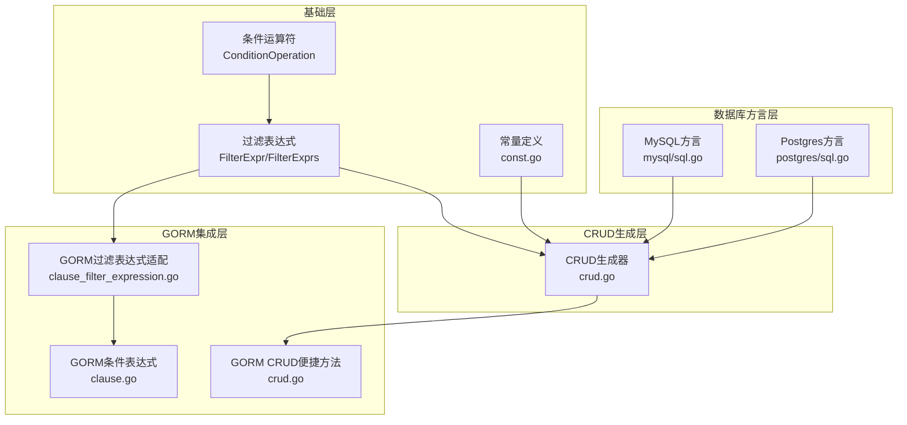
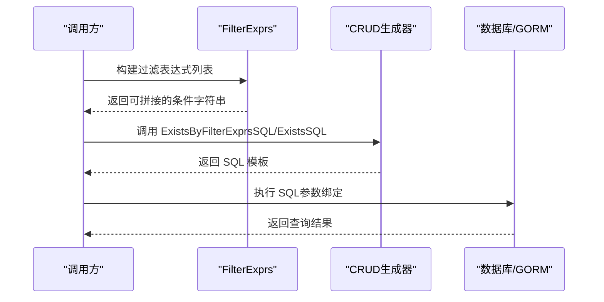
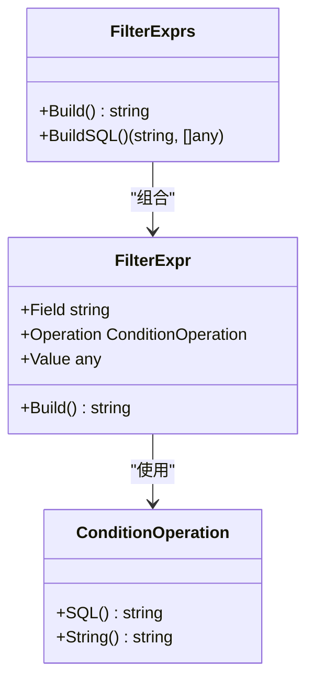
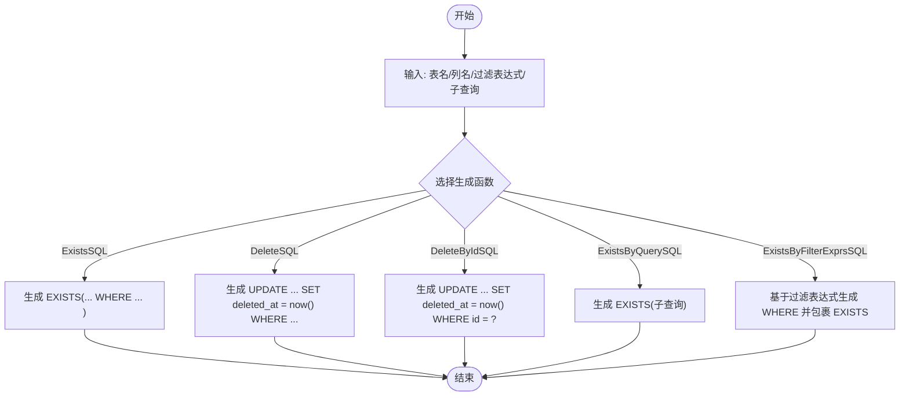
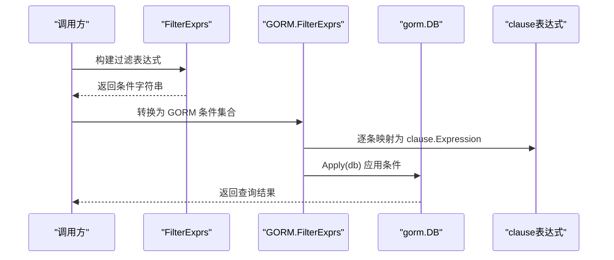
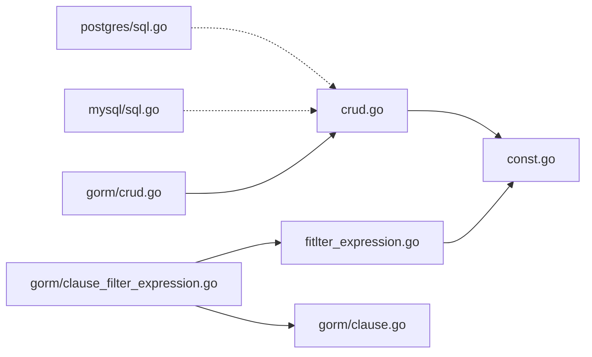

# SQL构建器

<cite>
**本文档引用的文件**
- [thirdparty/gox/database/sql/fitlter_expression.go](file://thirdparty/gox/database/sql/fitlter_expression.go)
- [thirdparty/gox/database/sql/crud.go](file://thirdparty/gox/database/sql/crud.go)
- [thirdparty/gox/database/sql/const.go](file://thirdparty/gox/database/sql/const.go)
- [thirdparty/gox/database/sql/filter_struct.go](file://thirdparty/gox/database/sql/filter_struct.go)
- [thirdparty/gox/database/sql/gorm/clause.go](file://thirdparty/gox/database/sql/gorm/clause.go)
- [thirdparty/gox/database/sql/gorm/clause_filter_expression.go](file://thirdparty/gox/database/sql/gorm/clause_filter_expression.go)
- [thirdparty/gox/database/sql/gorm/crud.go](file://thirdparty/gox/database/sql/gorm/crud.go)
- [thirdparty/gox/database/sql/mysql/sql.go](file://thirdparty/gox/database/sql/mysql/sql.go)
- [thirdparty/gox/database/sql/postgres/sql.go](file://thirdparty/gox/database/sql/postgres/sql.go)
</cite>

## 目录
1. [简介](#简介)
2. [项目结构](#项目结构)
3. [核心组件](#核心组件)
4. [架构总览](#架构总览)
5. [详细组件分析](#详细组件分析)
6. [依赖关系分析](#依赖关系分析)
7. [性能考虑](#性能考虑)
8. [故障排查指南](#故障排查指南)
9. [结论](#结论)
10. [附录](#附录)

## 简介
本文件为 SQL 构建器模块的详细 API 文档，覆盖以下主题：
- SQL 语句生成器：包括 EXISTS、DELETE（软删除）等常用 SQL 的生成与使用
- 查询条件构建：支持多种比较运算符、IN/NOT IN、BETWEEN、LIKE/NOT LIKE、IS NULL/IS NOT NULL
- 过滤表达式处理：FilterExpr/FilterExprs 的构建与参数绑定
- GORM 集成：将过滤表达式转换为 GORM clause 表达式，并在 GORM 中应用
- 安全性：SQL 注入防护、参数化绑定、字段名与值的安全处理
- 性能：查询优化建议、执行计划分析与索引利用策略

## 项目结构
SQL 构建器位于 thirdparty/gox/database/sql 及其子包中，主要由以下层次组成：
- 基础表达式与常量层：条件运算符、过滤表达式、常量定义
- CRUD 生成层：EXISTS、DELETE（软删除）、ExistsByFilterExprs 等 SQL 生成
- GORM 集成层：将过滤表达式映射到 GORM clause 表达式，并提供 Exists/Get 等便捷方法
- 数据库方言层：MySQL、Postgres 特定 SQL 片段

**图表来源**
- [thirdparty/gox/database/sql/fitlter_expression.go:137-191](file://thirdparty/gox/database/sql/fitlter_expression.go#L137-L191)
- [thirdparty/gox/database/sql/crud.go:11-40](file://thirdparty/gox/database/sql/crud.go#L11-L40)
- [thirdparty/gox/database/sql/const.go:9-54](file://thirdparty/gox/database/sql/const.go#L9-L54)
- [thirdparty/gox/database/sql/gorm/clause.go:36-113](file://thirdparty/gox/database/sql/gorm/clause.go#L36-L113)
- [thirdparty/gox/database/sql/gorm/clause_filter_expression.go:11-56](file://thirdparty/gox/database/sql/gorm/clause_filter_expression.go#L11-L56)
- [thirdparty/gox/database/sql/gorm/crud.go:14-62](file://thirdparty/gox/database/sql/gorm/crud.go#L14-L62)
- [thirdparty/gox/database/sql/mysql/sql.go:1-8](file://thirdparty/gox/database/sql/mysql/sql.go#L1-L8)
- [thirdparty/gox/database/sql/postgres/sql.go:1-37](file://thirdparty/gox/database/sql/postgres/sql.go#L1-L37)

**章节来源**
- [thirdparty/gox/database/sql/fitlter_expression.go:1-302](file://thirdparty/gox/database/sql/fitlter_expression.go#L1-L302)
- [thirdparty/gox/database/sql/crud.go:1-54](file://thirdparty/gox/database/sql/crud.go#L1-L54)
- [thirdparty/gox/database/sql/const.go:1-54](file://thirdparty/gox/database/sql/const.go#L1-L54)
- [thirdparty/gox/database/sql/gorm/clause.go:1-184](file://thirdparty/gox/database/sql/gorm/clause.go#L1-L184)
- [thirdparty/gox/database/sql/gorm/clause_filter_expression.go:1-56](file://thirdparty/gox/database/sql/gorm/clause_filter_expression.go#L1-L56)
- [thirdparty/gox/database/sql/gorm/crud.go:1-69](file://thirdparty/gox/database/sql/gorm/crud.go#L1-L69)
- [thirdparty/gox/database/sql/mysql/sql.go:1-8](file://thirdparty/gox/database/sql/mysql/sql.go#L1-L8)
- [thirdparty/gox/database/sql/postgres/sql.go:1-37](file://thirdparty/gox/database/sql/postgres/sql.go#L1-L37)

## 核心组件
- 条件运算符（ConditionOperation）
  - 支持：等于、不等于、大于、小于、大于等于、小于等于、BETWEEN、IN、NOT IN、LIKE、NOT LIKE、IS NULL、IS NOT NULL
  - 提供 SQL 片段输出与字符串表示，便于拼接与显示
- 过滤表达式（FilterExpr/FilterExprs）
  - 单个表达式：字段、运算符、值
  - 表达式集合：自动拼接 AND 条件，支持空值与非法输入过滤
- CRUD 生成器（crud.go）
  - ExistsSQL/DeleteSQL/DeleteByIdSQL/ExistsByQuerySQL/ExistsByFilterExprsSQL
  - 提供数据库无关的 SQL 模板，结合 WithNotDeleted 实现软删除过滤
- GORM 集成（gorm 子包）
  - 将 FilterExpr/FilterExprs 映射为 GORM clause 表达式
  - 提供 Exists/GetByPrimary 等便捷方法，支持 Raw SQL 执行与参数绑定

**章节来源**
- [thirdparty/gox/database/sql/fitlter_expression.go:21-102](file://thirdparty/gox/database/sql/fitlter_expression.go#L21-L102)
- [thirdparty/gox/database/sql/fitlter_expression.go:137-191](file://thirdparty/gox/database/sql/fitlter_expression.go#L137-L191)
- [thirdparty/gox/database/sql/crud.go:11-40](file://thirdparty/gox/database/sql/crud.go#L11-L40)
- [thirdparty/gox/database/sql/const.go:9-54](file://thirdparty/gox/database/sql/const.go#L9-L54)
- [thirdparty/gox/database/sql/gorm/clause.go:36-113](file://thirdparty/gox/database/sql/gorm/clause.go#L36-L113)
- [thirdparty/gox/database/sql/gorm/clause_filter_expression.go:11-56](file://thirdparty/gox/database/sql/gorm/clause_filter_expression.go#L11-L56)
- [thirdparty/gox/database/sql/gorm/crud.go:14-62](file://thirdparty/gox/database/sql/gorm/crud.go#L14-L62)

## 架构总览
SQL 构建器采用“表达式 -> SQL 模板 -> 参数绑定”的分层设计：
- 表达式层：FilterExpr/FilterExprs 负责描述查询条件
- 生成层：crud.go 提供 SQL 模板，结合常量定义（如 WithNotDeleted）实现软删除
- 绑定层：GORM 集成通过 clause 表达式完成参数绑定与 SQL 构建
- 方言层：MySQL、Postgres 提供特定 SQL 片段

**图表来源**
- [thirdparty/gox/database/sql/fitlter_expression.go:175-191](file://thirdparty/gox/database/sql/fitlter_expression.go#L175-L191)
- [thirdparty/gox/database/sql/crud.go:34-40](file://thirdparty/gox/database/sql/crud.go#L34-L40)
- [thirdparty/gox/database/sql/gorm/crud.go:51-62](file://thirdparty/gox/database/sql/gorm/crud.go#L51-L62)

## 详细组件分析

### 条件运算符与过滤表达式
- 条件运算符（ConditionOperation）
  - 提供 SQL() 与 String() 方法，分别用于生成 SQL 片段与人类可读字符串
  - 支持所有常见比较与集合操作
- 过滤表达式（FilterExpr）
  - Build() 根据运算符类型生成对应 SQL 片段，自动处理字符串转义、时间格式化、空值等
  - 支持 IN/NOT IN 的数组参数展开，BETWEEN 的区间参数校验
- 过滤表达式集合（FilterExprs）
  - Build() 自动拼接多个条件，忽略无效项
  - 提供 BuildSQL()（当前实现返回空占位，建议使用 Build() 或 GORM 适配）

**图表来源**
- [thirdparty/gox/database/sql/fitlter_expression.go:21-102](file://thirdparty/gox/database/sql/fitlter_expression.go#L21-L102)
- [thirdparty/gox/database/sql/fitlter_expression.go:137-191](file://thirdparty/gox/database/sql/fitlter_expression.go#L137-L191)
- [thirdparty/gox/database/sql/fitlter_expression.go:263-283](file://thirdparty/gox/database/sql/fitlter_expression.go#L263-L283)

**章节来源**
- [thirdparty/gox/database/sql/fitlter_expression.go:21-102](file://thirdparty/gox/database/sql/fitlter_expression.go#L21-L102)
- [thirdparty/gox/database/sql/fitlter_expression.go:137-191](file://thirdparty/gox/database/sql/fitlter_expression.go#L137-L191)
- [thirdparty/gox/database/sql/fitlter_expression.go:263-283](file://thirdparty/gox/database/sql/fitlter_expression.go#L263-L283)

### CRUD 生成函数与 DeleteByIdSQL、ExistsSQL、ExistsByFilterExprsSQL
- ExistsSQL(tableName, column, withDeletedAt)
  - 生成 EXISTS 查询，支持是否包含软删除过滤（WithNotDeleted）
- DeleteSQL(tableName, column)
  - 生成软删除 UPDATE 语句，设置 deleted_at 为当前时间
- DeleteByIdSQL(tableName)
  - 以 id 为主键进行软删除
- ExistsByQuerySQL(qsql)
  - 对任意子查询进行 EXISTS 包装
- ExistsByFilterExprsSQL(tableName, filters)
  - 基于过滤表达式集合生成 WHERE 条件并包裹 EXISTS

**图表来源**
- [thirdparty/gox/database/sql/crud.go:17-40](file://thirdparty/gox/database/sql/crud.go#L17-L40)

**章节来源**
- [thirdparty/gox/database/sql/crud.go:11-40](file://thirdparty/gox/database/sql/crud.go#L11-L40)

### GORM 集成：条件表达式与 CRUD 便捷方法
- 条件表达式映射（clause.go）
  - NewCondition 将字段、运算符、参数映射为 GORM clause 表达式
  - 支持 Between、Not、IsNull、IsNotNull、NotLike 等复合表达式
- 过滤表达式适配（clause_filter_expression.go）
  - FilterExpr.Condition()/FilterExprs.Conditions()/FilterExprs.Condition()
  - FilterExprs.Apply(db) 直接将过滤条件应用于 GORM DB
- CRUD 便捷方法（gorm/crud.go）
  - DeleteByPrimary/Delete/ExistsByColumn/ExistsBySQL/ExistsByQuery/Exists/ExistsByFilterExprs/GetByPrimary

**图表来源**
- [thirdparty/gox/database/sql/gorm/clause.go:36-113](file://thirdparty/gox/database/sql/gorm/clause.go#L36-L113)
- [thirdparty/gox/database/sql/gorm/clause_filter_expression.go:11-56](file://thirdparty/gox/database/sql/gorm/clause_filter_expression.go#L11-L56)
- [thirdparty/gox/database/sql/gorm/crud.go:45-62](file://thirdparty/gox/database/sql/gorm/crud.go#L45-L62)

**章节来源**
- [thirdparty/gox/database/sql/gorm/clause.go:36-113](file://thirdparty/gox/database/sql/gorm/clause.go#L36-L113)
- [thirdparty/gox/database/sql/gorm/clause_filter_expression.go:11-56](file://thirdparty/gox/database/sql/gorm/clause_filter_expression.go#L11-L56)
- [thirdparty/gox/database/sql/gorm/crud.go:14-62](file://thirdparty/gox/database/sql/gorm/crud.go#L14-L62)

### 复杂查询构建、参数绑定与 SQL 注入防护
- 复杂查询构建
  - 使用 FilterExprs.Build() 拼接多条件 AND
  - 结合 ExistsByFilterExprsSQL/ExistsByQuerySQL 构建 EXISTS 查询
- 参数绑定
  - GORM 侧通过 clause 表达式自动绑定参数
  - 原生 SQL 侧通过 CRUD 生成器返回模板，由调用方传入参数
- SQL 注入防护
  - 所有条件均通过占位符与参数绑定，避免字符串拼接
  - 字符串值进行转义处理，二进制数据以安全形式呈现
  - 字段名与运算符来自受控枚举，降低注入风险

**章节来源**
- [thirdparty/gox/database/sql/fitlter_expression.go:193-250](file://thirdparty/gox/database/sql/fitlter_expression.go#L193-L250)
- [thirdparty/gox/database/sql/gorm/clause.go:36-113](file://thirdparty/gox/database/sql/gorm/clause.go#L36-L113)
- [thirdparty/gox/database/sql/crud.go:17-40](file://thirdparty/gox/database/sql/crud.go#L17-L40)

## 依赖关系分析
- 内部依赖
  - fitlter_expression.go 依赖字符串工具与反射能力，提供条件运算符与表达式构建
  - crud.go 依赖 const.go 中的常量（如 WithNotDeleted），生成数据库无关的 SQL 模板
  - gorm 子包依赖第三方 gorm.io/gorm 与 gorm.io/gorm/clause
- 外部依赖
  - MySQL/Postgres 方言提供特定 SQL 片段，供上层生成器或直接使用

**图表来源**
- [thirdparty/gox/database/sql/fitlter_expression.go:1-30](file://thirdparty/gox/database/sql/fitlter_expression.go#L1-L30)
- [thirdparty/gox/database/sql/crud.go:9-15](file://thirdparty/gox/database/sql/crud.go#L9-L15)
- [thirdparty/gox/database/sql/const.go:9-18](file://thirdparty/gox/database/sql/const.go#L9-L18)
- [thirdparty/gox/database/sql/gorm/clause_filter_expression.go:3-9](file://thirdparty/gox/database/sql/gorm/clause_filter_expression.go#L3-L9)
- [thirdparty/gox/database/sql/gorm/clause.go:11-16](file://thirdparty/gox/database/sql/gorm/clause.go#L11-L16)
- [thirdparty/gox/database/sql/gorm/crud.go:9-12](file://thirdparty/gox/database/sql/gorm/crud.go#L9-L12)
- [thirdparty/gox/database/sql/mysql/sql.go:1-8](file://thirdparty/gox/database/sql/mysql/sql.go#L1-L8)
- [thirdparty/gox/database/sql/postgres/sql.go:1-37](file://thirdparty/gox/database/sql/postgres/sql.go#L1-L37)

**章节来源**
- [thirdparty/gox/database/sql/const.go:9-54](file://thirdparty/gox/database/sql/const.go#L9-L54)
- [thirdparty/gox/database/sql/gorm/clause_filter_expression.go:1-56](file://thirdparty/gox/database/sql/gorm/clause_filter_expression.go#L1-L56)
- [thirdparty/gox/database/sql/gorm/clause.go:1-184](file://thirdparty/gox/database/sql/gorm/clause.go#L1-L184)
- [thirdparty/gox/database/sql/gorm/crud.go:1-69](file://thirdparty/gox/database/sql/gorm/crud.go#L1-L69)
- [thirdparty/gox/database/sql/mysql/sql.go:1-8](file://thirdparty/gox/database/sql/mysql/sql.go#L1-L8)
- [thirdparty/gox/database/sql/postgres/sql.go:1-37](file://thirdparty/gox/database/sql/postgres/sql.go#L1-L37)

## 性能考虑
- 索引与查询优化
  - EXISTS 查询适合检查存在性，通常比 COUNT 更高效
  - 在频繁过滤的列上建立索引，特别是软删除列 deleted_at
  - 使用 BETWEEN/LIKE 时注意前缀索引与通配符位置
- 参数化与绑定
  - 优先使用参数化查询，避免字符串拼接引发的计划缓存碎片化
  - 合理使用 IN 列表长度，避免过长导致计划不稳定
- 执行计划分析
  - 使用 EXPLAIN/EXPLAIN ANALYZE 分析查询计划，关注索引使用、扫描行数与排序
  - 对高选择性列优先出现在 WHERE 前部
- 软删除与过滤
  - WithNotDeleted 会在查询中强制加入未删除条件，确保默认安全但可能影响某些场景的计划选择

[本节为通用性能指导，无需列出具体文件来源]

## 故障排查指南
- 过滤表达式为空或无效
  - 检查字段名是否为空，运算符是否有效，值是否为 nil
  - FilterExprs.Build() 会忽略无效项，确认最终条件是否符合预期
- 参数绑定异常
  - 确认传入参数顺序与数量与占位符一致
  - 对 IN/NOT IN，确保传入切片或数组
- EXISTS 查询结果不符合预期
  - 核对子查询是否正确，必要时使用 ExistsByQuerySQL 包裹自定义子查询
- 软删除未生效
  - 确认是否启用 WithNotDeleted；DeleteSQL/DeleteByIdSQL 默认已包含软删除过滤

**章节来源**
- [thirdparty/gox/database/sql/fitlter_expression.go:175-191](file://thirdparty/gox/database/sql/fitlter_expression.go#L175-L191)
- [thirdparty/gox/database/sql/crud.go:17-40](file://thirdparty/gox/database/sql/crud.go#L17-L40)
- [thirdparty/gox/database/sql/gorm/crud.go:51-62](file://thirdparty/gox/database/sql/gorm/crud.go#L51-L62)

## 结论
SQL 构建器模块提供了从表达式到 SQL 的完整链路，具备：
- 丰富的条件运算符与表达式构建能力
- 数据库无关的 SQL 模板与软删除支持
- 与 GORM 的无缝集成，简化参数绑定与查询流程
- 安全的参数化绑定与字符串转义，有效防范 SQL 注入
配合合理的索引与执行计划分析，可在保证安全性的同时获得良好的查询性能。

[本节为总结性内容，无需列出具体文件来源]

## 附录

### API 一览（按功能分类）
- 条件运算符
  - ParseConditionOperation(op)：解析字符串为运算符
  - ConditionOperation.SQL()/String()：生成 SQL 片段与人类可读字符串
- 过滤表达式
  - FilterExpr.Build()：单个条件构建
  - FilterExprs.Build()：多条件 AND 拼接
  - FilterExprs.BuildSQL()：当前实现返回空占位，建议使用 Build() 或 GORM 适配
- CRUD 生成
  - ExistsSQL/ExistsByQuerySQL/ExistsByFilterExprsSQL/DeleteSQL/DeleteByIdSQL：生成常用 SQL
- GORM 集成
  - FilterExpr.Condition()/FilterExprs.Conditions()/FilterExprs.Condition()/FilterExprs.Apply(db)
  - ExistsBySQL/ExistsByQuery/Exists/ExistsByFilterExprs/GetByPrimary：便捷方法

**章节来源**
- [thirdparty/gox/database/sql/fitlter_expression.go:40-102](file://thirdparty/gox/database/sql/fitlter_expression.go#L40-L102)
- [thirdparty/gox/database/sql/fitlter_expression.go:143-191](file://thirdparty/gox/database/sql/fitlter_expression.go#L143-L191)
- [thirdparty/gox/database/sql/fitlter_expression.go:263-283](file://thirdparty/gox/database/sql/fitlter_expression.go#L263-L283)
- [thirdparty/gox/database/sql/crud.go:17-40](file://thirdparty/gox/database/sql/crud.go#L17-L40)
- [thirdparty/gox/database/sql/gorm/clause_filter_expression.go:11-56](file://thirdparty/gox/database/sql/gorm/clause_filter_expression.go#L11-L56)
- [thirdparty/gox/database/sql/gorm/crud.go:24-62](file://thirdparty/gox/database/sql/gorm/crud.go#L24-L62)