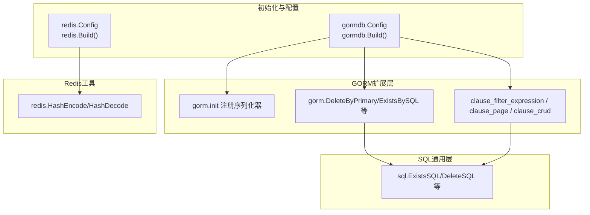
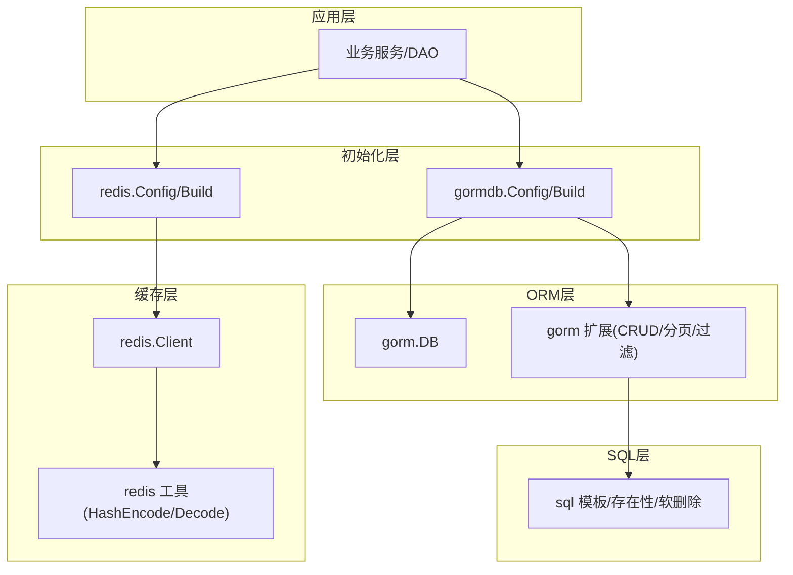
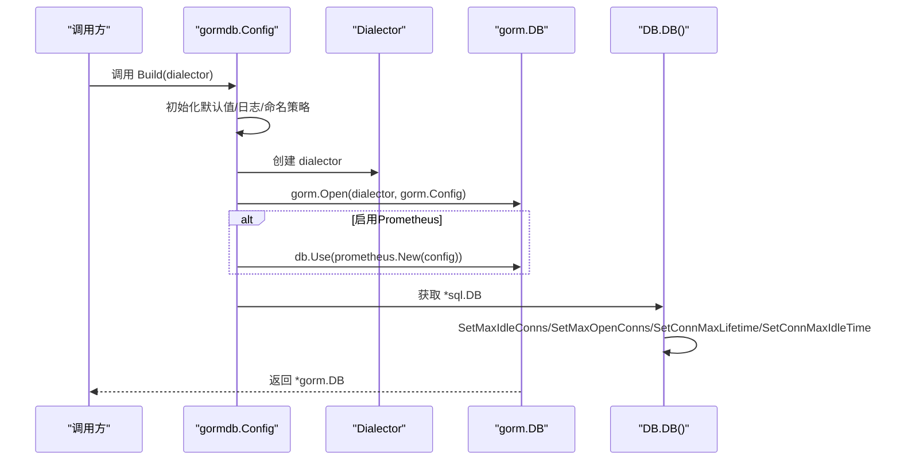
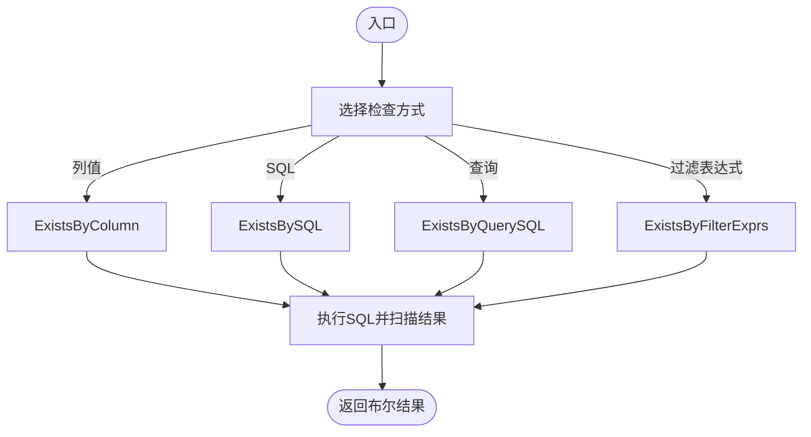
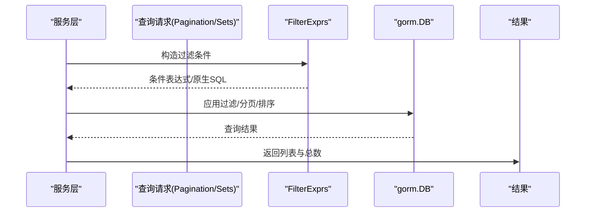
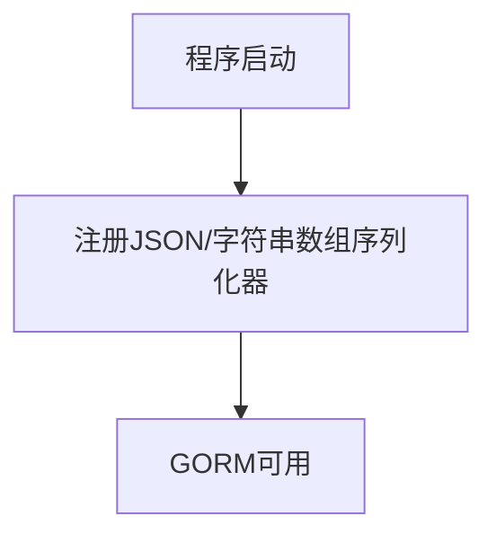
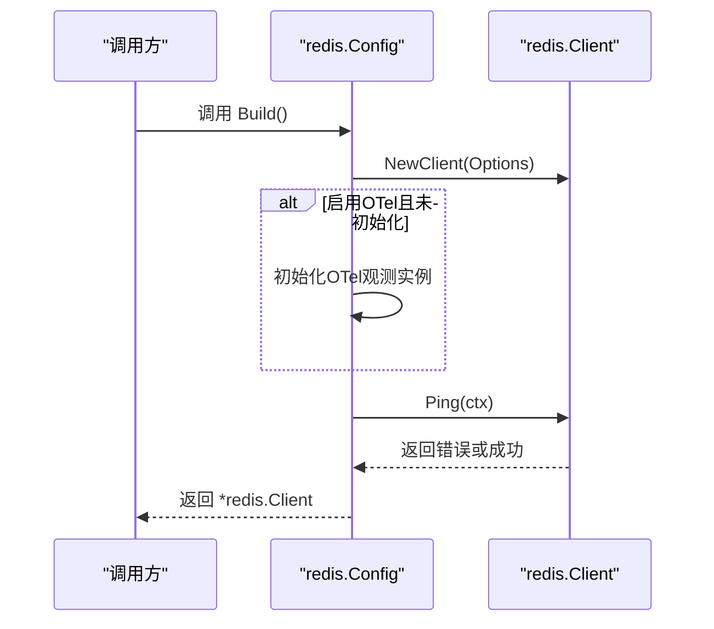
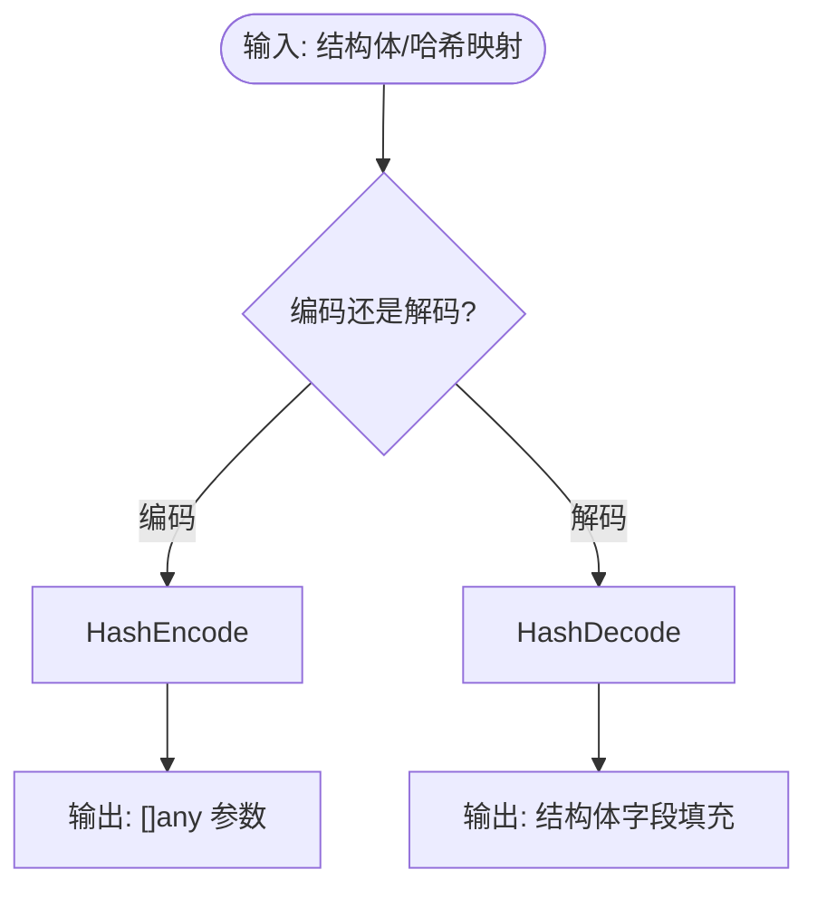
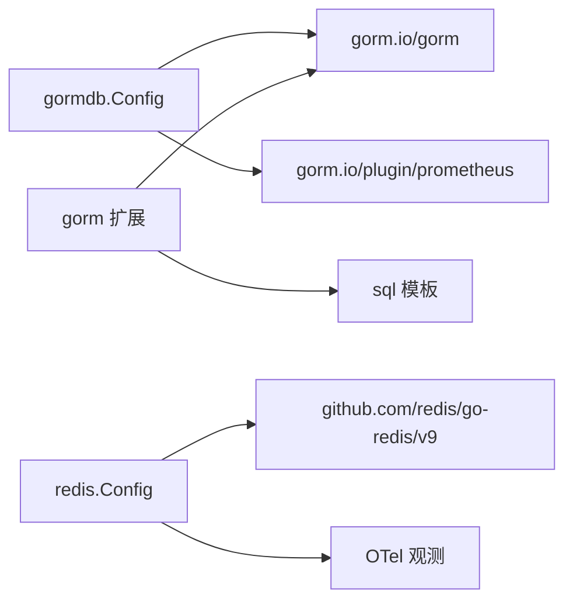

# 数据库工具

<cite>
**本文档引用的文件**
- [thirdparty/initialize/dao/gormdb/gorm.go](file://thirdparty/initialize/dao/gormdb/gorm.go)
- [thirdparty/gox/database/sql/gorm/init.go](file://thirdparty/gox/database/sql/gorm/init.go)
- [thirdparty/gox/database/sql/gorm/crud.go](file://thirdparty/gox/database/sql/gorm/crud.go)
- [thirdparty/gox/database/sql/crud.go](file://thirdparty/gox/database/sql/crud.go)
- [thirdparty/gox/database/sql/gorm/clause_crud.go](file://thirdparty/gox/database/sql/gorm/clause_crud.go)
- [thirdparty/gox/database/sql/gorm/clause_page.go](file://thirdparty/gox/database/sql/gorm/clause_page.go)
- [thirdparty/gox/database/sql/gorm/clause_filter_expression.go](file://thirdparty/gox/database/sql/gorm/clause_filter_expression.go)
- [thirdparty/initialize/dao/redis/redis.go](file://thirdparty/initialize/dao/redis/redis.go)
- [thirdparty/gox/database/redis/hash.go](file://thirdparty/gox/database/redis/hash.go)
</cite>

## 目录
1. [简介](#简介)
2. [项目结构](#项目结构)
3. [核心组件](#核心组件)
4. [架构总览](#架构总览)
5. [详细组件分析](#详细组件分析)
6. [依赖分析](#依赖分析)
7. [性能考虑](#性能考虑)
8. [故障排查指南](#故障排查指南)
9. [结论](#结论)
10. [附录](#附录)

## 简介
本文件为数据库工具模块的详细API文档，覆盖以下能力：
- SQL操作封装：提供基于GORM的CRUD、条件表达式、分页排序、软删除存在性检查等通用方法。
- ORM集成：统一配置GORM日志、命名策略、连接池、Prometheus指标采集，并扩展JSON/数组序列化器。
- Redis客户端：提供连接配置、OTel埋点初始化、Ping校验、TLS证书加载与优雅关闭。
- 统一抽象接口：通过配置对象集中管理MySQL、PostgreSQL、SQLite与Redis的连接参数与行为。
- 高级功能：查询构建器（过滤表达式、排序、分页）、事务处理建议、连接池管理、索引与查询优化建议、数据验证与批量操作建议、分页查询工具。

## 项目结构
数据库工具主要分布在以下位置：
- 初始化与配置：thirdparty/initialize/dao 下的 gormdb 与 redis 子包，负责按配置构建数据库/缓存客户端并进行基础校验。
- SQL通用层：thirdparty/gox/database/sql 提供SQL常量、存在性检查、软删除等底层SQL模板与工具函数。
- GORM扩展层：thirdparty/gox/database/sql/gorm 提供GORM的CRUD、过滤表达式、分页排序、序列化器注册等扩展能力。
- Redis工具：thirdparty/gox/database/redis 提供哈希编码/解码等辅助工具。

**图表来源**
- [thirdparty/initialize/dao/gormdb/gorm.go:25-158](file://thirdparty/initialize/dao/gormdb/gorm.go#L25-L158)
- [thirdparty/gox/database/sql/gorm/init.go:11-14](file://thirdparty/gox/database/sql/gorm/init.go#L11-L14)
- [thirdparty/gox/database/sql/gorm/crud.go:14-69](file://thirdparty/gox/database/sql/gorm/crud.go#L14-L69)
- [thirdparty/gox/database/sql/crud.go:17-40](file://thirdparty/gox/database/sql/crud.go#L17-L40)
- [thirdparty/gox/database/sql/gorm/clause_filter_expression.go:11-57](file://thirdparty/gox/database/sql/gorm/clause_filter_expression.go#L11-L57)
- [thirdparty/gox/database/sql/gorm/clause_page.go:21-158](file://thirdparty/gox/database/sql/gorm/clause_page.go#L21-L158)
- [thirdparty/gox/database/sql/gorm/clause_crud.go:15-22](file://thirdparty/gox/database/sql/gorm/clause_crud.go#L15-L22)
- [thirdparty/initialize/dao/redis/redis.go:19-79](file://thirdparty/initialize/dao/redis/redis.go#L19-L79)
- [thirdparty/gox/database/redis/hash.go:14-48](file://thirdparty/gox/database/redis/hash.go#L14-L48)

**章节来源**
- [thirdparty/initialize/dao/gormdb/gorm.go:1-171](file://thirdparty/initialize/dao/gormdb/gorm.go#L1-L171)
- [thirdparty/initialize/dao/redis/redis.go:1-79](file://thirdparty/initialize/dao/redis/redis.go#L1-L79)

## 核心组件
- GORM配置与构建
  - Config：统一管理数据库类型、字符集、时区、连接池、GORM日志、命名策略、Prometheus指标等。
  - Build：根据dialector打开数据库，设置日志、Prometheus插件、连接池参数，返回gorm.DB。
  - DB：在gorm.DB基础上附加Config，提供自定义Table方法。
- SQL通用工具
  - ExistsSQL/DeleteSQL/DeleteByIdSQL：生成存在性检查与软删除更新SQL。
  - ExistsBySQL/ExistsByQuerySQL/ExistsByFilterExprs：执行存在性检查。
- GORM扩展CRUD
  - DeleteByPrimary/Delete/ExistsByColumn/ExistsBySQL：基于GORM与SQL模板的常用操作。
  - GetByPrimary：按主键查询单条记录。
- 查询构建器
  - FilterExprs/FilterExpr：将字段、操作符、值转换为GORM条件或原生SQL。
  - Pagination/Limit/Sort：分页、偏移、排序子句的GORM表达式实现。
- Redis客户端
  - Config：封装redis.Options与OTel配置，支持TLS证书加载。
  - Build：创建client并执行Ping校验。
  - Client：封装Close以优雅关闭并可选地停止OTel观测。

**章节来源**
- [thirdparty/initialize/dao/gormdb/gorm.go:25-171](file://thirdparty/initialize/dao/gormdb/gorm.go#L25-L171)
- [thirdparty/gox/database/sql/crud.go:17-40](file://thirdparty/gox/database/sql/crud.go#L17-L40)
- [thirdparty/gox/database/sql/gorm/crud.go:14-69](file://thirdparty/gox/database/sql/gorm/crud.go#L14-L69)
- [thirdparty/gox/database/sql/gorm/clause_filter_expression.go:11-57](file://thirdparty/gox/database/sql/gorm/clause_filter_expression.go#L11-L57)
- [thirdparty/gox/database/sql/gorm/clause_page.go:21-158](file://thirdparty/gox/database/sql/gorm/clause_page.go#L21-L158)
- [thirdparty/initialize/dao/redis/redis.go:19-79](file://thirdparty/initialize/dao/redis/redis.go#L19-L79)

## 架构总览
下图展示数据库工具的整体架构与交互关系：

**图表来源**
- [thirdparty/initialize/dao/gormdb/gorm.go:124-158](file://thirdparty/initialize/dao/gormdb/gorm.go#L124-L158)
- [thirdparty/gox/database/sql/gorm/crud.go:14-69](file://thirdparty/gox/database/sql/gorm/crud.go#L14-L69)
- [thirdparty/gox/database/sql/crud.go:17-40](file://thirdparty/gox/database/sql/crud.go#L17-L40)
- [thirdparty/initialize/dao/redis/redis.go:39-48](file://thirdparty/initialize/dao/redis/redis.go#L39-L48)
- [thirdparty/gox/database/redis/hash.go:14-48](file://thirdparty/gox/database/redis/hash.go#L14-L48)

## 详细组件分析

### GORM配置与构建（gormdb）
- 职责
  - 统一数据库配置（类型、字符集、时区、端口、默认参数）。
  - 设置GORM日志与命名策略。
  - 注入Prometheus监控插件。
  - 配置连接池参数并返回gorm.DB。
  - 提供DB包装器与自定义Table方法。
- 关键流程（构建数据库连接）

**图表来源**
- [thirdparty/initialize/dao/gormdb/gorm.go:124-158](file://thirdparty/initialize/dao/gormdb/gorm.go#L124-L158)

**章节来源**
- [thirdparty/initialize/dao/gormdb/gorm.go:25-171](file://thirdparty/initialize/dao/gormdb/gorm.go#L25-L171)

### GORM扩展CRUD与存在性检查
- DeleteByPrimary/Delete：基于SQL模板执行软删除或直接删除。
- ExistsByColumn/ExistsBySQL/ExistsByQuerySQL/ExistsByFilterExprs：提供多种存在性检查方式。
- GetByPrimary：按主键获取实体。

**图表来源**
- [thirdparty/gox/database/sql/gorm/crud.go:24-62](file://thirdparty/gox/database/sql/gorm/crud.go#L24-L62)
- [thirdparty/gox/database/sql/crud.go:17-40](file://thirdparty/gox/database/sql/crud.go#L17-L40)

**章节来源**
- [thirdparty/gox/database/sql/gorm/crud.go:14-69](file://thirdparty/gox/database/sql/gorm/crud.go#L14-L69)
- [thirdparty/gox/database/sql/crud.go:17-40](file://thirdparty/gox/database/sql/crud.go#L17-L40)

### 查询构建器（过滤表达式、分页、排序）
- 过滤表达式
  - FilterExpr/FilterExprs：将字段、操作符、值转换为GORM条件表达式或原生SQL片段。
  - Apply：直接对gorm.DB应用where条件。
- 分页与排序
  - Limit/Pagination：生成LIMIT/OFFSET子句。
  - Sort/Sorts：生成ORDER BY子句。
  - FindList：组合过滤、计数、分页、排序并返回列表与总数。

**图表来源**
- [thirdparty/gox/database/sql/gorm/clause_filter_expression.go:11-57](file://thirdparty/gox/database/sql/gorm/clause_filter_expression.go#L11-L57)
- [thirdparty/gox/database/sql/gorm/clause_page.go:106-151](file://thirdparty/gox/database/sql/gorm/clause_page.go#L106-L151)

**章节来源**
- [thirdparty/gox/database/sql/gorm/clause_filter_expression.go:11-57](file://thirdparty/gox/database/sql/gorm/clause_filter_expression.go#L11-L57)
- [thirdparty/gox/database/sql/gorm/clause_page.go:21-158](file://thirdparty/gox/database/sql/gorm/clause_page.go#L21-L158)
- [thirdparty/gox/database/sql/gorm/clause_crud.go:15-22](file://thirdparty/gox/database/sql/gorm/clause_crud.go#L15-L22)

### GORM序列化器注册
- 在初始化阶段注册JSON与字符串数组序列化器，使GORM能够正确处理对应字段类型。

**图表来源**
- [thirdparty/gox/database/sql/gorm/init.go:11-14](file://thirdparty/gox/database/sql/gorm/init.go#L11-L14)

**章节来源**
- [thirdparty/gox/database/sql/gorm/init.go:11-14](file://thirdparty/gox/database/sql/gorm/init.go#L11-L14)

### Redis客户端（初始化与使用）
- Config：封装Options与OTel配置，支持TLS证书加载。
- Build：创建redis.Client并执行Ping校验。
- Client：封装Close以优雅关闭并可选地停止OTel观测。

**图表来源**
- [thirdparty/initialize/dao/redis/redis.go:39-48](file://thirdparty/initialize/dao/redis/redis.go#L39-L48)

**章节来源**
- [thirdparty/initialize/dao/redis/redis.go:19-79](file://thirdparty/initialize/dao/redis/redis.go#L19-L79)

### Redis哈希工具（HashEncode/HashDecode）
- HashEncode：将结构体字段编码为Redis HMSET参数。
- HashDecode：将Redis哈希映射解码到结构体字段（支持整数、浮点、布尔、字符串）。

**图表来源**
- [thirdparty/gox/database/redis/hash.go:14-48](file://thirdparty/gox/database/redis/hash.go#L14-L48)

**章节来源**
- [thirdparty/gox/database/redis/hash.go:14-48](file://thirdparty/gox/database/redis/hash.go#L14-L48)

## 依赖分析
- 组件耦合
  - gormdb.Config依赖GORM、Prometheus插件、日志与命名策略。
  - GORM扩展依赖sql模板与GORM库。
  - redis.Config依赖redis-go与OTel观测实例。
- 外部依赖
  - GORM、gorm.io/plugin/prometheus、redis/go-redis、OTel观测扩展。
- 循环依赖
  - 当前模块采用单向依赖，无明显循环。

**图表来源**
- [thirdparty/initialize/dao/gormdb/gorm.go:9-23](file://thirdparty/initialize/dao/gormdb/gorm.go#L9-L23)
- [thirdparty/initialize/dao/redis/redis.go:9-17](file://thirdparty/initialize/dao/redis/redis.go#L9-L17)

**章节来源**
- [thirdparty/initialize/dao/gormdb/gorm.go:9-23](file://thirdparty/initialize/dao/gormdb/gorm.go#L9-L23)
- [thirdparty/initialize/dao/redis/redis.go:9-17](file://thirdparty/initialize/dao/redis/redis.go#L9-L17)

## 性能考虑
- 连接池
  - 通过SetMaxIdleConns、SetMaxOpenConns、SetConnMaxLifetime、SetConnMaxIdleTime控制连接生命周期与并发上限，避免连接泄漏与抖动。
- 查询与索引
  - 使用过滤表达式与排序子句时，确保相关字段建立合适索引；避免在大表上进行全表扫描。
- 指标监控
  - 启用Prometheus插件以收集慢查询与执行统计，结合日志阈值定位性能瓶颈。
- 批量与分页
  - 分页查询应限制最大页号与每页大小，避免超大数据集一次性加载。
- 缓存
  - 对热点数据使用Redis缓存，注意键空间设计与过期策略，避免内存膨胀。

## 故障排查指南
- GORM连接失败
  - 检查数据库类型、主机、端口、用户名、密码、字符集与时区配置。
  - 查看日志输出与错误信息，确认Prometheus插件初始化是否成功。
- 连接池异常
  - 核对MaxOpenConns、MaxIdleConns、ConnMaxLifetime、ConnMaxIdleTime设置是否合理。
- Redis连接失败
  - 确认TLS证书路径正确，OTel配置启用状态与初始化结果。
  - 使用Ping校验网络连通性与认证信息。
- 查询性能问题
  - 使用Prometheus指标与慢查询日志定位热点SQL。
  - 审视过滤表达式与排序字段是否命中索引。

**章节来源**
- [thirdparty/initialize/dao/gormdb/gorm.go:124-158](file://thirdparty/initialize/dao/gormdb/gorm.go#L124-L158)
- [thirdparty/initialize/dao/redis/redis.go:39-48](file://thirdparty/initialize/dao/redis/redis.go#L39-L48)

## 结论
该数据库工具模块提供了统一的GORM与Redis接入方式，配合查询构建器、连接池与监控能力，满足多数据库场景下的常见需求。通过配置驱动与扩展CRUD、过滤表达式、分页排序等工具，开发者可以快速实现稳定、可观测的数据访问层。

## 附录
- 事务处理建议
  - 使用gorm.DB.Transaction进行事务包裹，确保回滚与提交的一致性。
- 数据验证与批量操作
  - 在DAO层对输入参数进行合法性校验；批量插入/更新时分批处理并记录批次统计。
- 查询性能分析
  - 结合EXPLAIN/ANALYZE查看执行计划，识别全表扫描与索引缺失；利用Prometheus与慢查询日志持续优化。