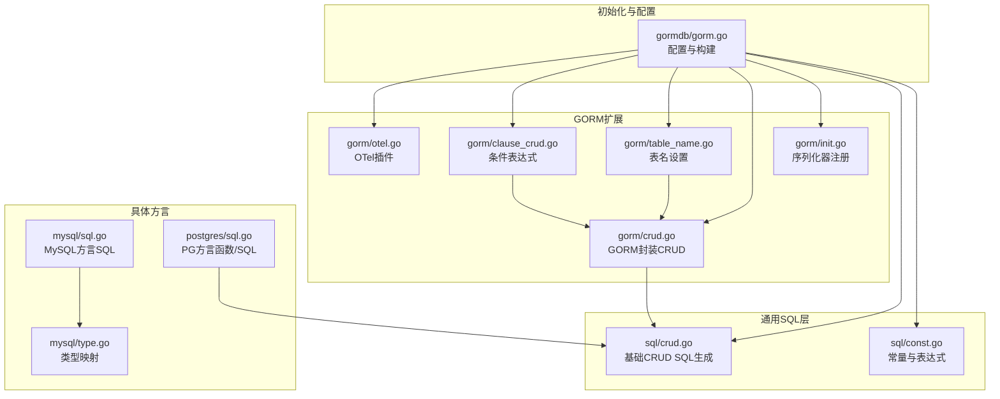
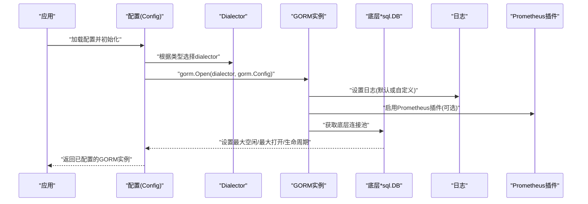
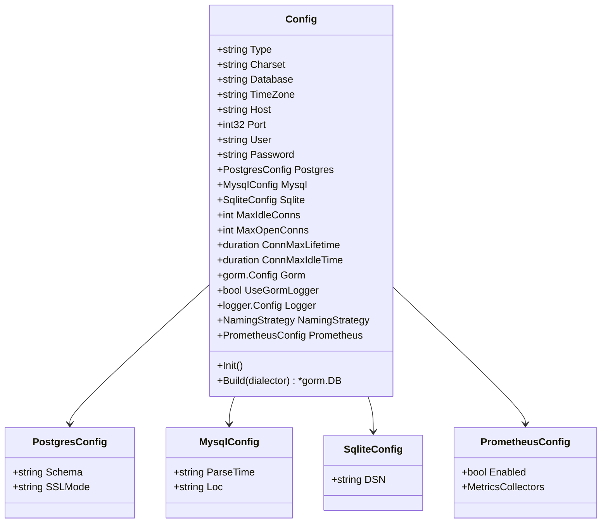
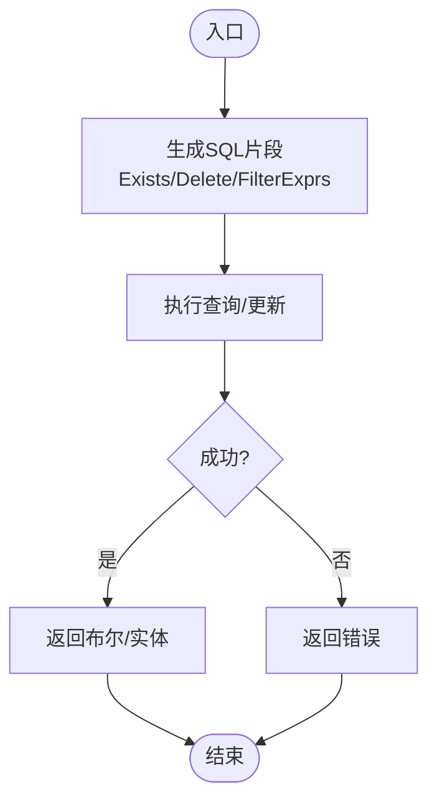
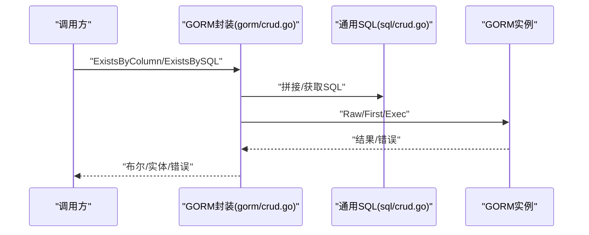
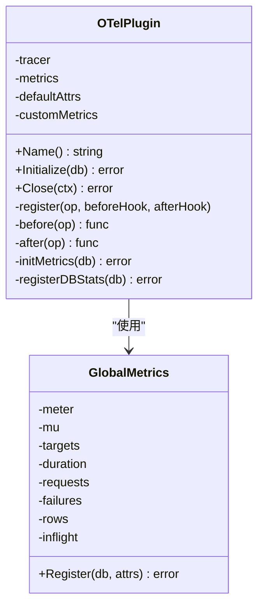
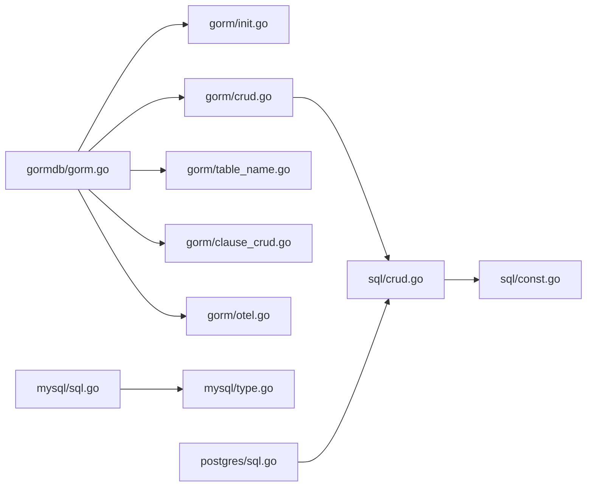

# 数据库驱动

<cite>
**本文档引用的文件**
- [thirdparty/initialize/dao/gormdb/gorm.go](file://thirdparty/initialize/dao/gormdb/gorm.go)
- [thirdparty/gox/database/sql/const.go](file://thirdparty/gox/database/sql/const.go)
- [thirdparty/gox/database/sql/crud.go](file://thirdparty/gox/database/sql/crud.go)
- [thirdparty/gox/database/sql/gorm/crud.go](file://thirdparty/gox/database/sql/gorm/crud.go)
- [thirdparty/gox/database/sql/gorm/table_name.go](file://thirdparty/gox/database/sql/gorm/table_name.go)
- [thirdparty/gox/database/sql/gorm/clause_crud.go](file://thirdparty/gox/database/sql/gorm/clause_crud.go)
- [thirdparty/gox/database/sql/gorm/otel.go](file://thirdparty/gox/database/sql/gorm/otel.go)
- [thirdparty/gox/database/sql/mysql/sql.go](file://thirdparty/gox/database/sql/mysql/sql.go)
- [thirdparty/gox/database/sql/mysql/type.go](file://thirdparty/gox/database/sql/mysql/type.go)
- [thirdparty/gox/database/sql/postgres/sql.go](file://thirdparty/gox/database/sql/postgres/sql.go)
- [thirdparty/gox/database/sql/gorm/init.go](file://thirdparty/gox/database/sql/gorm/init.go)
</cite>

## 目录
1. [简介](#简介)
2. [项目结构](#项目结构)
3. [核心组件](#核心组件)
4. [架构总览](#架构总览)
5. [详细组件分析](#详细组件分析)
6. [依赖关系分析](#依赖关系分析)
7. [性能考量](#性能考量)
8. [故障排查指南](#故障排查指南)
9. [结论](#结论)
10. [附录](#附录)

## 简介
本文件面向数据库驱动模块，聚焦于 MySQL、PostgreSQL、SQLite 的统一抽象与使用方法，涵盖连接管理、连接池配置、事务处理、指标与可观测性、以及迁移与运维要点。该模块以 GORM 为核心 ORM，并通过统一的 SQL 常量与 CRUD 辅助函数，提供跨数据库的一致体验；同时内置 OpenTelemetry 插件，用于追踪与指标采集。

## 项目结构
数据库驱动相关代码主要分布在以下位置：
- 初始化与配置：thirdparty/initialize/dao/gormdb/gorm.go
- 统一 SQL 常量与 CRUD：thirdparty/gox/database/sql/*
- GORM 扩展与工具：thirdparty/gox/database/sql/gorm/*
- 具体数据库方言辅助：thirdparty/gox/database/sql/mysql/*、thirdparty/gox/database/sql/postgres/*

图表来源
- [thirdparty/initialize/dao/gormdb/gorm.go:1-171](file://thirdparty/initialize/dao/gormdb/gorm.go#L1-L171)
- [thirdparty/gox/database/sql/const.go:1-54](file://thirdparty/gox/database/sql/const.go#L1-L54)
- [thirdparty/gox/database/sql/crud.go:1-54](file://thirdparty/gox/database/sql/crud.go#L1-L54)
- [thirdparty/gox/database/sql/gorm/init.go:1-15](file://thirdparty/gox/database/sql/gorm/init.go#L1-L15)
- [thirdparty/gox/database/sql/gorm/crud.go:1-69](file://thirdparty/gox/database/sql/gorm/crud.go#L1-L69)
- [thirdparty/gox/database/sql/gorm/table_name.go:1-13](file://thirdparty/gox/database/sql/gorm/table_name.go#L1-L13)
- [thirdparty/gox/database/sql/gorm/clause_crud.go:1-22](file://thirdparty/gox/database/sql/gorm/clause_crud.go#L1-L22)
- [thirdparty/gox/database/sql/gorm/otel.go:1-380](file://thirdparty/gox/database/sql/gorm/otel.go#L1-L380)
- [thirdparty/gox/database/sql/mysql/sql.go:1-8](file://thirdparty/gox/database/sql/mysql/sql.go#L1-L8)
- [thirdparty/gox/database/sql/mysql/type.go:1-26](file://thirdparty/gox/database/sql/mysql/type.go#L1-L26)
- [thirdparty/gox/database/sql/postgres/sql.go:1-37](file://thirdparty/gox/database/sql/postgres/sql.go#L1-L37)

章节来源
- [thirdparty/initialize/dao/gormdb/gorm.go:1-171](file://thirdparty/initialize/dao/gormdb/gorm.go#L1-L171)
- [thirdparty/gox/database/sql/const.go:1-54](file://thirdparty/gox/database/sql/const.go#L1-L54)
- [thirdparty/gox/database/sql/crud.go:1-54](file://thirdparty/gox/database/sql/crud.go#L1-L54)
- [thirdparty/gox/database/sql/gorm/init.go:1-15](file://thirdparty/gox/database/sql/gorm/init.go#L1-L15)

## 核心组件
- 配置与构建器
  - 统一配置结构，支持 MySQL、PostgreSQL、SQLite 三类数据库，包含连接参数、字符集、时区、命名策略、日志与 Prometheus 指标等。
  - 提供默认值推断（如端口、字符集、时区）与连接池参数设置。
  - 构建 GORM 实例并应用日志、Prometheus 插件与连接池参数。
- 通用 SQL 常量与表达式
  - 定义数据库无关的关键字、表达式、常用 SQL 片段，便于在多数据库间复用。
- GORM 封装
  - 提供 Exists/Delete/GetByPrimary 等常用操作的封装，统一软删除与过滤表达式。
  - 表名设置与条件表达式工具，简化复杂查询构造。
- OpenTelemetry 插件
  - 通过回调钩子记录各操作的追踪与指标（耗时、请求量、失败数、影响行数、并发请求数），并可扩展自定义指标。
- 方言辅助
  - MySQL：提供 SHOW TABLES/SHOW COLUMNS 等方言 SQL 常量与类型映射工具。
  - PostgreSQL：提供清理/清空表的函数定义与调用 SQL，便于迁移与测试场景。

章节来源
- [thirdparty/initialize/dao/gormdb/gorm.go:25-158](file://thirdparty/initialize/dao/gormdb/gorm.go#L25-L158)
- [thirdparty/gox/database/sql/const.go:9-54](file://thirdparty/gox/database/sql/const.go#L9-L54)
- [thirdparty/gox/database/sql/gorm/crud.go:14-69](file://thirdparty/gox/database/sql/gorm/crud.go#L14-L69)
- [thirdparty/gox/database/sql/gorm/table_name.go:8-12](file://thirdparty/gox/database/sql/gorm/table_name.go#L8-L12)
- [thirdparty/gox/database/sql/gorm/clause_crud.go:15-21](file://thirdparty/gox/database/sql/gorm/clause_crud.go#L15-L21)
- [thirdparty/gox/database/sql/gorm/otel.go:28-380](file://thirdparty/gox/database/sql/gorm/otel.go#L28-L380)
- [thirdparty/gox/database/sql/mysql/sql.go:3-7](file://thirdparty/gox/database/sql/mysql/sql.go#L3-L7)
- [thirdparty/gox/database/sql/mysql/type.go:11-25](file://thirdparty/gox/database/sql/mysql/type.go#L11-L25)
- [thirdparty/gox/database/sql/postgres/sql.go:11-36](file://thirdparty/gox/database/sql/postgres/sql.go#L11-L36)

## 架构总览
下图展示从配置到连接、日志、插件与连接池的整体流程，以及与通用 SQL 层和 GORM 封装的关系。

图表来源
- [thirdparty/initialize/dao/gormdb/gorm.go:72-158](file://thirdparty/initialize/dao/gormdb/gorm.go#L72-L158)
- [thirdparty/gox/database/sql/gorm/otel.go:102-168](file://thirdparty/gox/database/sql/gorm/otel.go#L102-L168)

## 详细组件分析

### 组件A：统一配置与连接构建
- 职责
  - 推断默认值（类型、端口、字符集、时区、SQLite DSN）。
  - 设置 GORM 日志与命名策略。
  - 应用 Prometheus 插件与连接池参数。
- 关键点
  - 支持 MySQL、PostgreSQL、SQLite 三类数据库的差异化配置项。
  - 连接池参数包括最大空闲连接、最大打开连接、最大生命周期、最大空闲时间。
  - 可按环境开关使用内置日志或自定义日志。

图表来源
- [thirdparty/initialize/dao/gormdb/gorm.go:25-71](file://thirdparty/initialize/dao/gormdb/gorm.go#L25-L71)

章节来源
- [thirdparty/initialize/dao/gormdb/gorm.go:72-158](file://thirdparty/initialize/dao/gormdb/gorm.go#L72-L158)

### 组件B：通用 SQL 常量与 CRUD
- 职责
  - 定义数据库无关的关键字与表达式，如 INSERT/SELECT/JOIN/LIMIT/OFFSET 等。
  - 提供软删除、存在性检查、删除等 SQL 片段生成与执行辅助。
- 关键点
  - 支持带 deleted_at 条件的存在性检查与删除。
  - 提供基于原生 SQL 的 ExistsByFilterExprs 辅助。

图表来源
- [thirdparty/gox/database/sql/crud.go:17-53](file://thirdparty/gox/database/sql/crud.go#L17-L53)

章节来源
- [thirdparty/gox/database/sql/const.go:9-54](file://thirdparty/gox/database/sql/const.go#L9-L54)
- [thirdparty/gox/database/sql/crud.go:17-53](file://thirdparty/gox/database/sql/crud.go#L17-L53)

### 组件C：GORM 封装与工具
- 职责
  - 对 GORM 原生能力进行轻量封装，提供 Exists/Delete/GetByPrimary 等常用操作。
  - 提供表名设置与条件表达式工具，简化复杂查询。
- 关键点
  - DeleteByPrimary/Delete 采用软删除策略。
  - ExistsBySQL/ExistsByQuery/ExistsByFilterExprs 支持灵活存在性检查。

图表来源
- [thirdparty/gox/database/sql/gorm/crud.go:24-69](file://thirdparty/gox/database/sql/gorm/crud.go#L24-L69)
- [thirdparty/gox/database/sql/crud.go:17-53](file://thirdparty/gox/database/sql/crud.go#L17-L53)

章节来源
- [thirdparty/gox/database/sql/gorm/crud.go:14-69](file://thirdparty/gox/database/sql/gorm/crud.go#L14-L69)
- [thirdparty/gox/database/sql/gorm/table_name.go:8-12](file://thirdparty/gox/database/sql/gorm/table_name.go#L8-L12)
- [thirdparty/gox/database/sql/gorm/clause_crud.go:15-21](file://thirdparty/gox/database/sql/gorm/clause_crud.go#L15-L21)

### 组件D：OpenTelemetry 插件
- 职责
  - 通过 GORM 回调钩子记录各操作的追踪与指标，包括耗时、请求量、失败数、影响行数、并发请求数。
  - 支持自定义指标记录器与默认属性。
- 关键点
  - 在 Create/Query/Update/Delete/Row/Raw 各阶段注册 Before/After 钩子。
  - 自动提取 db.system、db.table、db.operation、db.success、db.error_type 等属性。

图表来源
- [thirdparty/gox/database/sql/gorm/otel.go:28-380](file://thirdparty/gox/database/sql/gorm/otel.go#L28-L380)

章节来源
- [thirdparty/gox/database/sql/gorm/otel.go:102-168](file://thirdparty/gox/database/sql/gorm/otel.go#L102-L168)
- [thirdparty/gox/database/sql/gorm/otel.go:178-233](file://thirdparty/gox/database/sql/gorm/otel.go#L178-L233)
- [thirdparty/gox/database/sql/gorm/otel.go:246-294](file://thirdparty/gox/database/sql/gorm/otel.go#L246-L294)

### 组件E：MySQL 方言辅助
- 职责
  - 提供 MySQL 方言的 SQL 片段常量（如 SHOW TABLES、SHOW COLUMNS）。
  - 提供数据库类型到 Go 类型的映射工具，便于代码生成或反射场景。
- 关键点
  - 类型映射覆盖整数、字符串、时间、浮点与布尔等常见类型。

章节来源
- [thirdparty/gox/database/sql/mysql/sql.go:3-7](file://thirdparty/gox/database/sql/mysql/sql.go#L3-L7)
- [thirdparty/gox/database/sql/mysql/type.go:11-25](file://thirdparty/gox/database/sql/mysql/type.go#L11-L25)

### 组件F：PostgreSQL 方言辅助
- 职责
  - 提供 PL/pgSQL 函数定义与调用 SQL，用于批量删除/清空指定用户模式下的表，便于迁移与测试。
- 关键点
  - 使用 quote_ident 保证标识符安全。
  - 通过游标逐条执行 DROP/TRUNCATE，确保级联删除/清空。

章节来源
- [thirdparty/gox/database/sql/postgres/sql.go:11-36](file://thirdparty/gox/database/sql/postgres/sql.go#L11-L36)

## 依赖关系分析
- 组件耦合
  - gormdb/gorm.go 作为统一入口，依赖 sql/const.go、sql/crud.go 与 gorm/* 工具。
  - gorm/crud.go 依赖 sql/crud.go 的 SQL 片段生成。
  - otel.go 依赖 gorm 回调机制与全局指标注册。
- 外部依赖
  - gorm.io/gorm、gorm.io/plugin/prometheus、go.opentelemetry.io/otel。
- 循环依赖
  - 未发现直接循环依赖；模块边界清晰，职责分离良好。

图表来源
- [thirdparty/initialize/dao/gormdb/gorm.go:9-23](file://thirdparty/initialize/dao/gormdb/gorm.go#L9-L23)
- [thirdparty/gox/database/sql/gorm/crud.go:9-12](file://thirdparty/gox/database/sql/gorm/crud.go#L9-L12)
- [thirdparty/gox/database/sql/crud.go:9](file://thirdparty/gox/database/sql/crud.go#L9)

章节来源
- [thirdparty/initialize/dao/gormdb/gorm.go:9-23](file://thirdparty/initialize/dao/gormdb/gorm.go#L9-L23)
- [thirdparty/gox/database/sql/gorm/crud.go:9-12](file://thirdparty/gox/database/sql/gorm/crud.go#L9-L12)

## 性能考量
- 连接池
  - 合理设置 MaxIdleConns 与 MaxOpenConns，避免过高导致资源争用，过低导致频繁创建销毁。
  - 合理设置 ConnMaxLifetime 与 ConnMaxIdleTime，防止连接老化与泄漏。
- 日志与指标
  - 生产环境建议关闭内置日志，使用自定义日志以降低开销。
  - Prometheus 插件与 OTel 插件会带来额外开销，应按需启用并评估采样策略。
- 查询优化
  - 使用 ExistsBySQL/ExistsByFilterExprs 等封装减少不必要的扫描。
  - 通过 clause 表达式与 TableName 工具减少 SQL 拼接错误与重复逻辑。

## 故障排查指南
- 连接失败
  - 检查 Type、Host、Port、User、Password、Database、Charset、TimeZone 等配置项是否正确。
  - 确认默认值推断逻辑（如端口、字符集、时区）是否符合预期。
- 连接池异常
  - 观察 MaxIdleConns、MaxOpenConns、ConnMaxLifetime、ConnMaxIdleTime 是否合理。
  - 通过 Prometheus 或 OTel 指标观察连接池状态与慢查询。
- 日志与可观测性
  - 若使用内置日志，确认 SlowThreshold 是否过低导致大量慢日志。
  - OTel 插件启用后，检查追踪与指标是否正常上报，必要时添加自定义指标记录器。
- 软删除与存在性检查
  - 存在性检查时注意 deleted_at 条件，确保与业务一致。
  - 删除操作采用软删除策略，需在查询时过滤 deleted_at。

章节来源
- [thirdparty/initialize/dao/gormdb/gorm.go:72-111](file://thirdparty/initialize/dao/gormdb/gorm.go#L72-L111)
- [thirdparty/gox/database/sql/gorm/otel.go:102-168](file://thirdparty/gox/database/sql/gorm/otel.go#L102-L168)
- [thirdparty/gox/database/sql/crud.go:17-28](file://thirdparty/gox/database/sql/crud.go#L17-L28)

## 结论
该数据库驱动模块通过统一配置、通用 SQL 常量与 GORM 封装，实现了对 MySQL、PostgreSQL、SQLite 的一致抽象；结合 OTel 插件与连接池配置，提供了可观测性与性能保障。在实际使用中，应根据业务场景合理配置连接池与日志策略，并利用软删除与存在性检查等封装提升开发效率与数据一致性。

## 附录

### A. 数据库特性与选型建议
- MySQL
  - 适合高并发写入与成熟生态，字符集 utf8mb4 更利于国际化。
  - 注意时区与时钟同步，ParseTime 与 Loc 配置影响时间字段解析。
- PostgreSQL
  - 适合复杂查询与强一致性场景，支持丰富的数据类型与函数。
  - 通过 PL/pgSQL 函数可实现批量删除/清空，便于迁移与测试。
- SQLite
  - 适合嵌入式与单机场景，无需独立服务进程。
  - 注意并发写入限制与 WAL 模式配置。

章节来源
- [thirdparty/initialize/dao/gormdb/gorm.go:52-64](file://thirdparty/initialize/dao/gormdb/gorm.go#L52-L64)
- [thirdparty/gox/database/sql/mysql/type.go:11-25](file://thirdparty/gox/database/sql/mysql/type.go#L11-L25)
- [thirdparty/gox/database/sql/postgres/sql.go:11-36](file://thirdparty/gox/database/sql/postgres/sql.go#L11-L36)

### B. 运维操作指南
- 迁移
  - 使用 PostgreSQL 的函数批量删除/清空表，便于在迁移前清理数据。
  - 通过软删除策略与存在性检查，确保迁移过程的数据一致性。
- 版本兼容性
  - 根据数据库类型调整字符集与时间解析配置，避免历史数据解析异常。
- 备份与恢复
  - 建议使用数据库官方工具进行备份与恢复，配合连接池参数与只读副本策略，降低维护窗口。

章节来源
- [thirdparty/gox/database/sql/postgres/sql.go:11-36](file://thirdparty/gox/database/sql/postgres/sql.go#L11-L36)
- [thirdparty/gox/database/sql/gorm/crud.go:14-30](file://thirdparty/gox/database/sql/gorm/crud.go#L14-L30)