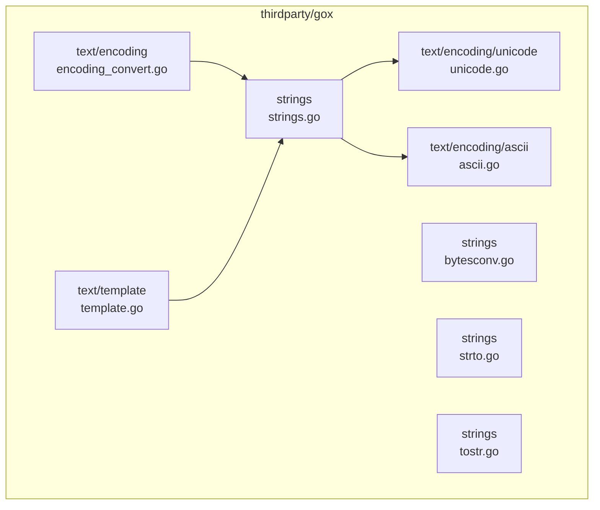
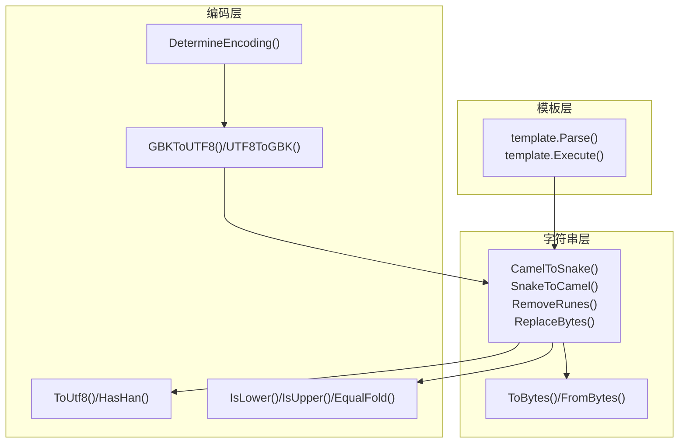
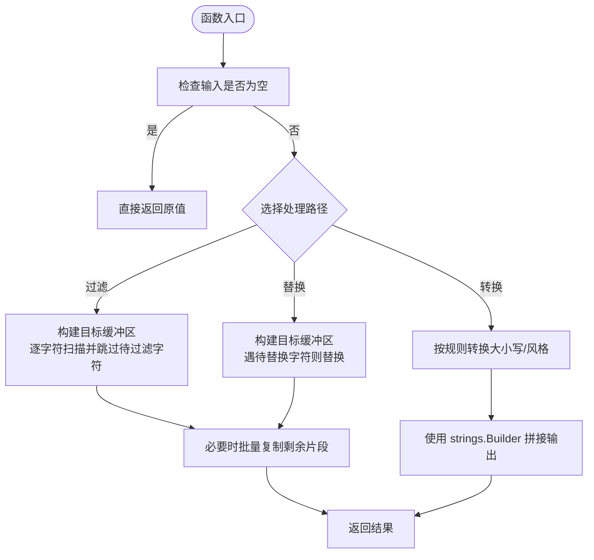
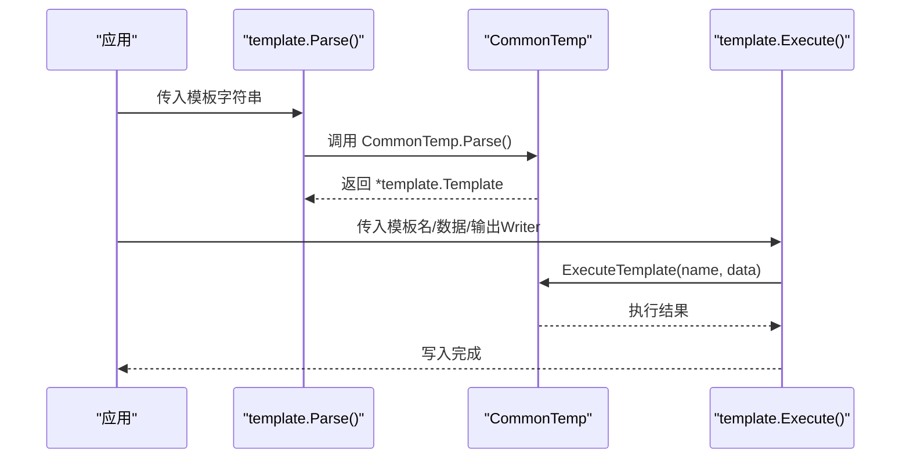
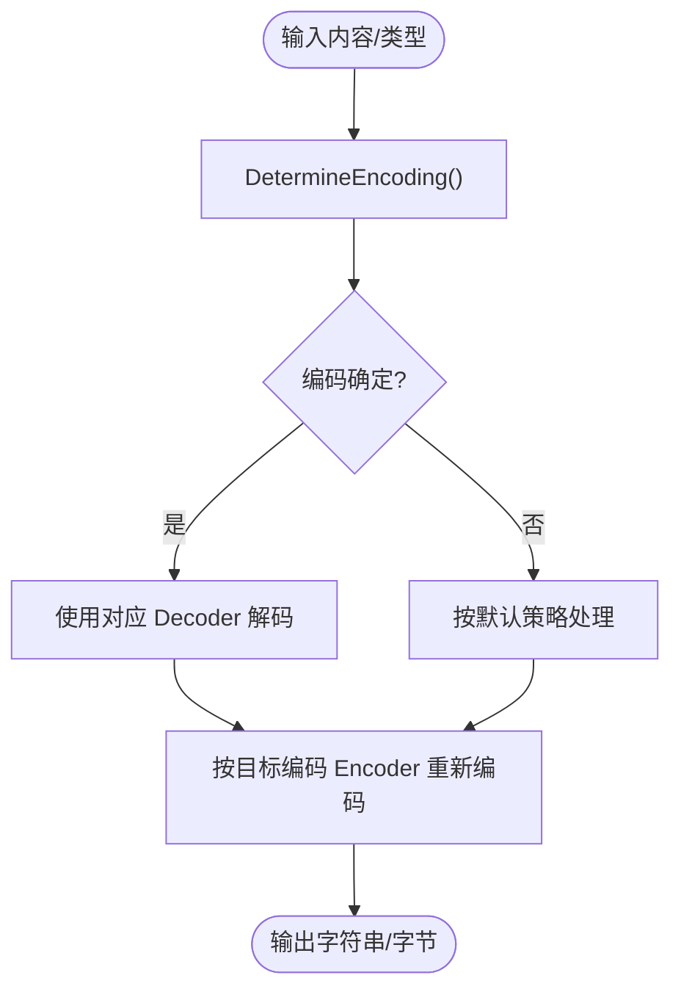
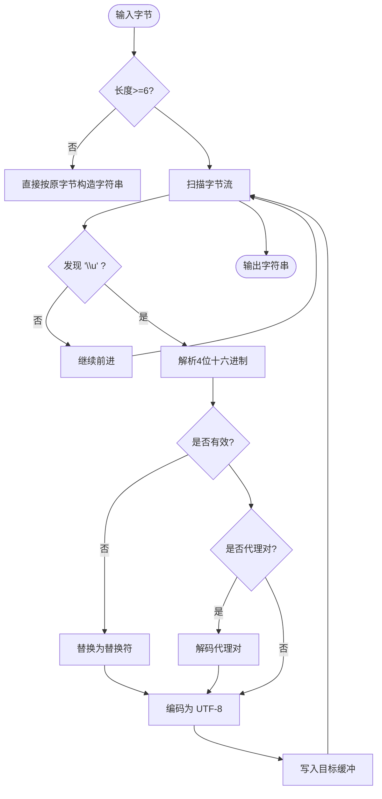
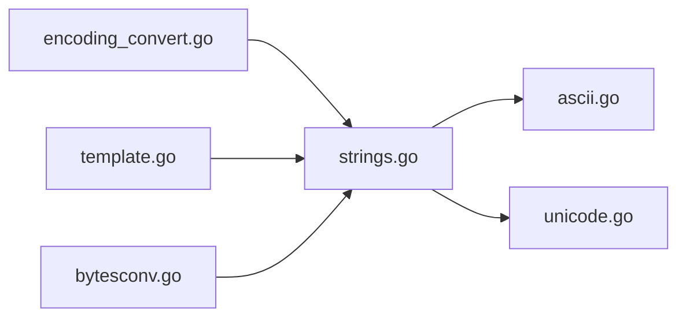

# 文本处理

<cite>
**本文档引用的文件**
- [strings.go](file://thirdparty/gox/strings/strings.go)
- [bytesconv.go](file://thirdparty/gox/strings/bytesconv.go)
- [strto.go](file://thirdparty/gox/strings/strto.go)
- [tostr.go](file://thirdparty/gox/strings/tostr.go)
- [encoding_convert.go](file://thirdparty/gox/text/encoding/encoding_convert.go)
- [unicode.go](file://thirdparty/gox/text/encoding/unicode/unicode.go)
- [ascii.go](file://thirdparty/gox/text/encoding/ascii/ascii.go)
- [template.go](file://thirdparty/gox/text/template/template.go)
- [strings_test.go](file://thirdparty/gox/strings/strings_test.go)
- [unicode_test.go](file://thirdparty/gox/text/encoding/unicode/unicode_test.go)
</cite>

## 目录
1. [简介](#简介)
2. [项目结构](#项目结构)
3. [核心组件](#核心组件)
4. [架构总览](#架构总览)
5. [详细组件分析](#详细组件分析)
6. [依赖关系分析](#依赖关系分析)
7. [性能考量](#性能考量)
8. [故障排查指南](#故障排查指南)
9. [结论](#结论)
10. [附录](#附录)

## 简介
本文件面向文本处理模块的使用者与维护者，系统性梳理字符串处理函数、模板引擎、字符编码转换、Unicode 规范化与跨语言处理能力。文档覆盖以下主题：
- 字符串处理：大小写转换、命名风格互转、截断与分割、括号区间提取、数字识别、哈希与去重、字符过滤与替换、连接与拼接等。
- 模板引擎：基于标准库 text/template 的封装，提供常用函数与执行入口。
- 编码转换：GBK 与 UTF-8 的双向转换，以及基于 x/text 的自动编码检测。
- Unicode 处理：中日韩汉字与标点识别、Unicode 转义解析、大小写处理等。
- 正则表达式与文本搜索：结合内置函数与正则库进行高效检索与替换。

## 项目结构
文本处理模块主要位于 thirdparty/gox 下，按功能划分为：
- strings：字符串处理与工具函数
- text/encoding：编码转换与 Unicode 工具
- text/template：模板引擎封装

**图表来源**
- [strings.go:1-753](file://thirdparty/gox/strings/strings.go#L1-L753)
- [bytesconv.go:1-20](file://thirdparty/gox/strings/bytesconv.go#L1-L20)
- [strto.go](file://thirdparty/gox/strings/strto.go)
- [tostr.go](file://thirdparty/gox/strings/tostr.go)
- [encoding_convert.go:1-55](file://thirdparty/gox/text/encoding/encoding_convert.go#L1-L55)
- [unicode.go:1-96](file://thirdparty/gox/text/encoding/unicode/unicode.go#L1-L96)
- [ascii.go:1-79](file://thirdparty/gox/text/encoding/ascii/ascii.go#L1-L79)
- [template.go:1-34](file://thirdparty/gox/text/template/template.go#L1-L34)

**章节来源**
- [strings.go:1-753](file://thirdparty/gox/strings/strings.go#L1-L753)
- [encoding_convert.go:1-55](file://thirdparty/gox/text/encoding/encoding_convert.go#L1-L55)
- [unicode.go:1-96](file://thirdparty/gox/text/encoding/unicode/unicode.go#L1-L96)
- [ascii.go:1-79](file://thirdparty/gox/text/encoding/ascii/ascii.go#L1-L79)
- [template.go:1-34](file://thirdparty/gox/text/template/template.go#L1-L34)

## 核心组件
- 字符串处理包（strings）：提供命名风格转换、大小写处理、截断与分割、括号区间提取、数字识别、字符过滤与替换、连接与拼接、哈希等。
- 编码转换包（text/encoding）：提供 GBK/UTF-8 转换、自动编码检测、Unicode 转义解析、ASCII 工具。
- 模板引擎（text/template）：基于标准库封装，注册常用函数并提供统一解析与执行入口。

**章节来源**
- [strings.go:1-753](file://thirdparty/gox/strings/strings.go#L1-L753)
- [encoding_convert.go:1-55](file://thirdparty/gox/text/encoding/encoding_convert.go#L1-L55)
- [unicode.go:1-96](file://thirdparty/gox/text/encoding/unicode/unicode.go#L1-L96)
- [ascii.go:1-79](file://thirdparty/gox/text/encoding/ascii/ascii.go#L1-L79)
- [template.go:1-34](file://thirdparty/gox/text/template/template.go#L1-L34)

## 架构总览
文本处理模块采用分层设计：
- 底层：bytesconv 提供零拷贝的 string/[]byte 转换，减少分配与复制。
- 字符串层：strings 提供丰富的字符串操作与工具函数，内部复用 ASCII 与 Unicode 工具。
- 编码层：encoding_convert 基于 x/text 实现编码检测与转换；unicode/ascii 提供底层字符分类与处理。
- 模板层：template 基于标准库 text/template，注册 join 等常用函数，简化模板渲染。

**图表来源**
- [template.go:1-34](file://thirdparty/gox/text/template/template.go#L1-L34)
- [strings.go:1-753](file://thirdparty/gox/strings/strings.go#L1-L753)
- [bytesconv.go:1-20](file://thirdparty/gox/strings/bytesconv.go#L1-L20)
- [encoding_convert.go:1-55](file://thirdparty/gox/text/encoding/encoding_convert.go#L1-L55)
- [unicode.go:1-96](file://thirdparty/gox/text/encoding/unicode/unicode.go#L1-L96)
- [ascii.go:1-79](file://thirdparty/gox/text/encoding/ascii/ascii.go#L1-L79)

## 详细组件分析

### 字符串处理函数
- 命名风格转换
  - CamelToSnake：驼峰转蛇形，支持多大写字母序列与数字处理。
  - SnakeToCamel：蛇形转驼峰，支持下划线与数字。
  - CamelCase：Protobuf 风格驼峰生成。
  - LowerCaseFirst/UpperCaseFirst：首字符大小写转换。
- 截断与分割
  - Cut/CutPart/ReverseCut/CutPartContain：按分隔符前后截断。
  - ReverseCutPart：从末尾开始查找分隔符并截断。
  - BracketsIntervals：按嵌套层级提取括号区间。
- 字符过滤与替换
  - RemoveRunes：移除指定 Unicode 码点。
  - ReplaceBytes/ReplaceBytesEmpty：按字节替换或删除。
  - CommonRuneHandler/CommonRuneReplace：通用的 Unicode 级处理与替换。
  - RemoveSymbol/RemoveEmoji/Rotate HanAndASCII：按类别保留或剔除字符。
- 数字与标识识别
  - IsNumber：判断字符串是否为整数/浮点/十六进制/科学计数法。
  - HasPrefixes：快速前缀匹配。
- 连接与拼接
  - Join/JoinValueFunc/JoinIndexFunc/JoinFunc：高性能字符串拼接，预估容量并使用 strings.Builder。
- 哈希与去重
  - DJB33：DJB 哈希算法。
- 其他工具
  - FormatLen：固定长度填充。
  - IsQuoted：判断是否被引号包裹。
  - SplitCamelCase：按 Unicode 类别拆分驼峰。

**图表来源**
- [strings.go:125-155](file://thirdparty/gox/strings/strings.go#L125-L155)
- [strings.go:207-229](file://thirdparty/gox/strings/strings.go#L207-L229)
- [strings.go:611-641](file://thirdparty/gox/strings/strings.go#L611-L641)
- [strings.go:643-654](file://thirdparty/gox/strings/strings.go#L643-L654)

**章节来源**
- [strings.go:22-79](file://thirdparty/gox/strings/strings.go#L22-L79)
- [strings.go:82-114](file://thirdparty/gox/strings/strings.go#L82-L114)
- [strings.go:159-196](file://thirdparty/gox/strings/strings.go#L159-L196)
- [strings.go:207-267](file://thirdparty/gox/strings/strings.go#L207-L267)
- [strings.go:289-347](file://thirdparty/gox/strings/strings.go#L289-L347)
- [strings.go:362-381](file://thirdparty/gox/strings/strings.go#L362-L381)
- [strings.go:508-556](file://thirdparty/gox/strings/strings.go#L508-L556)
- [strings.go:611-654](file://thirdparty/gox/strings/strings.go#L611-L654)
- [strings.go:656-752](file://thirdparty/gox/strings/strings.go#L656-L752)

### 模板引擎
- 组件职责
  - CommonTemp：全局模板实例，初始化时注册 join 等常用函数。
  - Parse：解析模板字符串。
  - Execute：执行模板并写入 io.Writer。
- 使用建议
  - 在应用启动时预解析常用模板，避免运行时重复解析。
  - 通过 FuncMap 注册业务函数，保持模板逻辑简洁。

**图表来源**
- [template.go:19-33](file://thirdparty/gox/text/template/template.go#L19-L33)

**章节来源**
- [template.go:1-34](file://thirdparty/gox/text/template/template.go#L1-L34)

### 字符编码转换
- 自动编码检测
  - DetermineEncoding：基于 golang.org/x/net/html/charset，根据内容与 Content-Type 推断编码。
- GBK 与 UTF-8 转换
  - GBKToUTF8/GBKBytesToUTF8：GBK 解码为 UTF-8。
  - UTF8ToGBK/UTF8BytesToGBK：UTF-8 编码为 GBK。
- 使用建议
  - 对外部输入优先调用 DetermineEncoding 获取确定性编码。
  - 转换前确保输入为有效 UTF-8，避免错误替换字符影响后续处理。

**图表来源**
- [encoding_convert.go:21-54](file://thirdparty/gox/text/encoding/encoding_convert.go#L21-L54)

**章节来源**
- [encoding_convert.go:1-55](file://thirdparty/gox/text/encoding/encoding_convert.go#L1-L55)

### Unicode 处理与跨语言支持
- Unicode 工具
  - HanPunctuation：中日韩常见标点集合。
  - HasHan：判断字符串是否包含中日韩文字或指定标点。
  - Getu4/ToUtf8：解析 \uXXXX 转义序列，支持代理对与错误回退。
  - ToLowerFirst：首字符小写。
- ASCII 工具
  - IsLower/IsUpper/IsDigit/IsAllLower/IsAllUpper/IsAllLetter/EqualFold/Lower/Upper：ASCII 字符分类与大小写转换。
- 使用建议
  - 处理用户输入时优先使用 Unicode 工具，保证多语言一致性。
  - 对于 JSON/URL 等场景，使用 ToUtf8 解析转义序列。

**图表来源**
- [unicode.go:34-88](file://thirdparty/gox/text/encoding/unicode/unicode.go#L34-L88)

**章节来源**
- [unicode.go:1-96](file://thirdparty/gox/text/encoding/unicode/unicode.go#L1-L96)
- [ascii.go:1-79](file://thirdparty/gox/text/encoding/ascii/ascii.go#L1-L79)

### 正则表达式与文本搜索
- 内置函数与正则
  - strings 包未直接定义正则函数，但可与标准库 regexp 配合使用，如 RemoveSymbol/RemoveEmoji 内部使用正则进行替换。
- 建议实践
  - 对高频正则使用 MustCompile 并缓存对象。
  - 使用非贪婪量词与锚点优化匹配性能。
  - 对复杂替换使用命名分组，提高可读性与可维护性。

**章节来源**
- [strings.go:594-598](file://thirdparty/gox/strings/strings.go#L594-L598)
- [strings.go:605-609](file://thirdparty/gox/strings/strings.go#L605-L609)

## 依赖关系分析
- 字符串层依赖 ASCII 与 Unicode 工具，用于字符分类与大小写处理。
- 编码层依赖 x/text 与 x/net/html/charset，实现编码检测与转换。
- 模板层依赖标准库 text/template，并注册常用函数。
- bytesconv 提供零开销的 string/[]byte 转换，降低内存分配。

**图表来源**
- [strings.go:1-753](file://thirdparty/gox/strings/strings.go#L1-L753)
- [ascii.go:1-79](file://thirdparty/gox/text/encoding/ascii/ascii.go#L1-L79)
- [unicode.go:1-96](file://thirdparty/gox/text/encoding/unicode/unicode.go#L1-L96)
- [encoding_convert.go:1-55](file://thirdparty/gox/text/encoding/encoding_convert.go#L1-L55)
- [template.go:1-34](file://thirdparty/gox/text/template/template.go#L1-L34)
- [bytesconv.go:1-20](file://thirdparty/gox/strings/bytesconv.go#L1-L20)

**章节来源**
- [strings.go:1-753](file://thirdparty/gox/strings/strings.go#L1-L753)
- [encoding_convert.go:1-55](file://thirdparty/gox/text/encoding/encoding_convert.go#L1-L55)
- [unicode.go:1-96](file://thirdparty/gox/text/encoding/unicode/unicode.go#L1-L96)
- [ascii.go:1-79](file://thirdparty/gox/text/encoding/ascii/ascii.go#L1-L79)
- [template.go:1-34](file://thirdparty/gox/text/template/template.go#L1-L34)
- [bytesconv.go:1-20](file://thirdparty/gox/strings/bytesconv.go#L1-L20)

## 性能考量
- 零拷贝转换
  - ToBytes/FromBytes 使用 unsafe 操作，避免额外分配，适合高频路径。
- 预估容量与 Builder
  - Join/JoinValueFunc/JoinIndexFunc/JoinFunc 使用 strings.Builder 并提前估算容量，显著降低扩容次数。
- 字节级替换
  - ReplaceBytes 使用布尔表快速判定，避免逐字符比较，适合大规模 ASCII 替换。
- Unicode 处理
  - CommonRuneHandler 采用单次扫描与批量复制策略，减少内存拷贝。
- 模板执行
  - 预解析模板，避免重复解析；在高并发场景下复用模板实例。

**章节来源**
- [bytesconv.go:11-19](file://thirdparty/gox/strings/bytesconv.go#L11-L19)
- [strings.go:660-704](file://thirdparty/gox/strings/strings.go#L660-L704)
- [strings.go:207-229](file://thirdparty/gox/strings/strings.go#L207-L229)
- [strings.go:611-641](file://thirdparty/gox/strings/strings.go#L611-L641)

## 故障排查指南
- 模板解析失败
  - 症状：Parse 抛出错误。
  - 排查：确认模板语法正确，检查 FuncMap 注册的函数是否存在。
  - 参考：template.Parse 的错误处理逻辑。
- 编码转换异常
  - 症状：转换后出现乱码或替换符。
  - 排查：先调用 DetermineEncoding 获取编码，确保输入为有效 UTF-8；必要时启用容错策略。
- Unicode 转义解析失败
  - 症状：ToUtf8 返回原样或替换符。
  - 排查：确认输入为合法 \uXXXX 序列；检查代理对是否完整。
- 字符过滤效果异常
  - 症状：过滤后仍有非预期字符。
  - 排查：确认使用的字符类别（如 Han、ASCII）与预期一致；检查是否需要同时保留标点。

**章节来源**
- [template.go:23-29](file://thirdparty/gox/text/template/template.go#L23-L29)
- [encoding_convert.go:21-54](file://thirdparty/gox/text/encoding/encoding_convert.go#L21-L54)
- [unicode.go:55-88](file://thirdparty/gox/text/encoding/unicode/unicode.go#L55-L88)
- [strings.go:588-641](file://thirdparty/gox/strings/strings.go#L588-L641)

## 结论
文本处理模块围绕高性能与易用性展开：通过 bytesconv 实现零拷贝转换，借助 strings.Builder 与预估容量实现高效拼接，利用 ASCII/Unicode 工具保障多语言一致性，并提供 GBK/UTF-8 编码转换与模板引擎封装。建议在生产环境中：
- 预解析模板并缓存；
- 对外部输入优先进行编码检测；
- 使用零拷贝与批量处理函数优化热点路径；
- 明确字符类别与 Unicode 处理策略，确保跨语言一致性。

## 附录
- 测试参考
  - strings 包含多种边界与混合场景测试，可作为使用示例与回归验证依据。
  - unicode 包含转义序列解析测试，便于验证复杂输入。

**章节来源**
- [strings_test.go:1-142](file://thirdparty/gox/strings/strings_test.go#L1-L142)
- [unicode_test.go:1-22](file://thirdparty/gox/text/encoding/unicode/unicode_test.go#L1-L22)