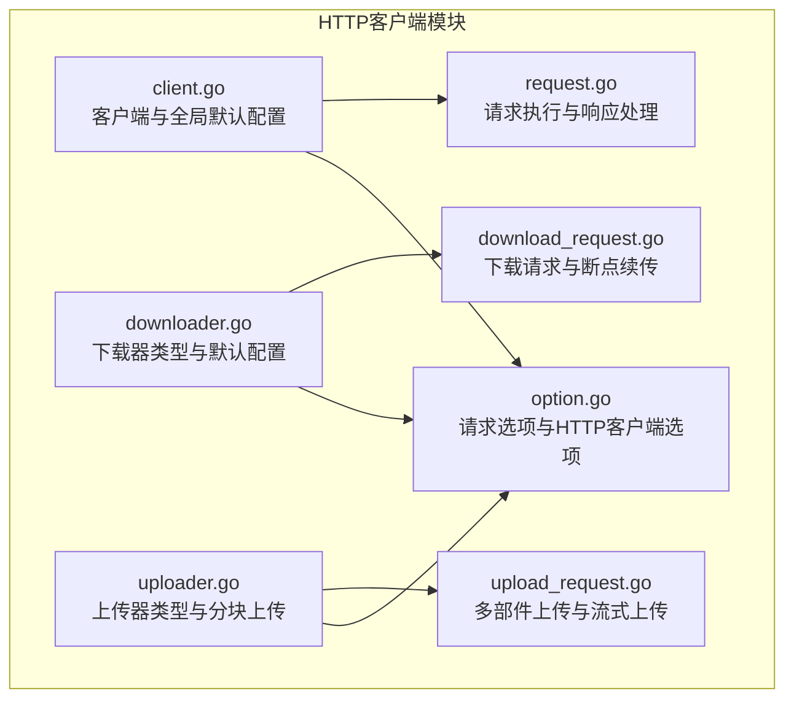
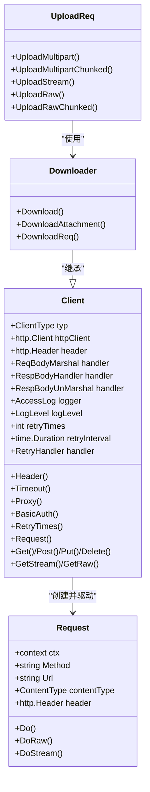
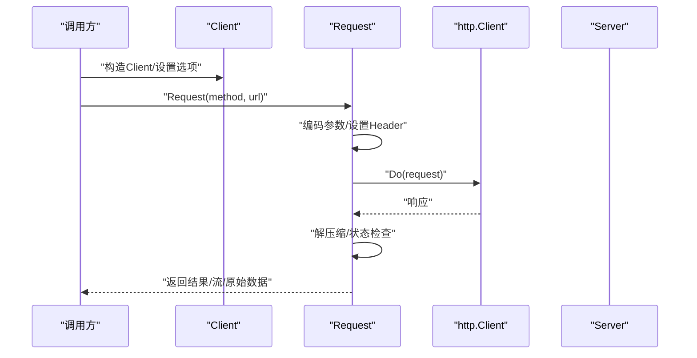
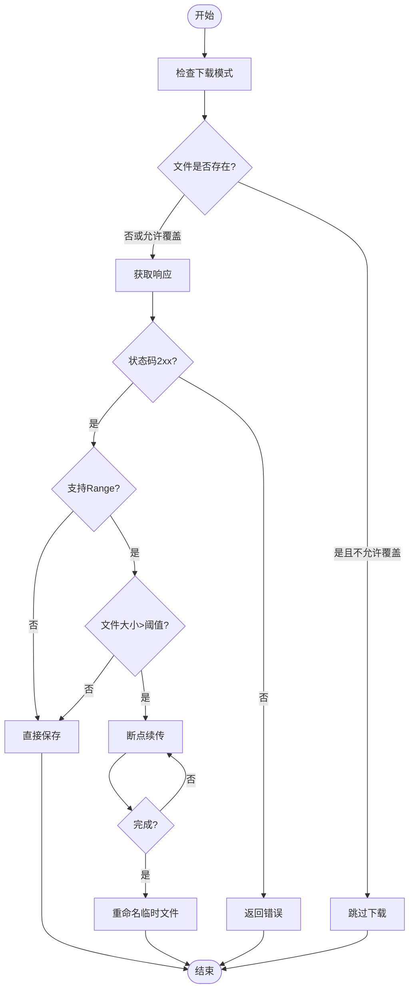
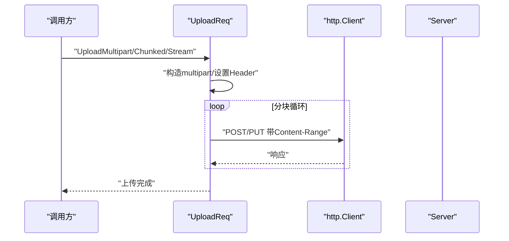

# HTTP客户端

<cite>
**本文档引用的文件**
- [client.go](file://thirdparty/gox/net/http/client/client.go)
- [request.go](file://thirdparty/gox/net/http/client/request.go)
- [downloader.go](file://thirdparty/gox/net/http/client/downloader.go)
- [download_request.go](file://thirdparty/gox/net/http/client/download_request.go)
- [uploader.go](file://thirdparty/gox/net/http/client/uploader.go)
- [upload_request.go](file://thirdparty/gox/net/http/client/upload_request.go)
- [option.go](file://thirdparty/gox/net/http/client/option.go)
</cite>

## 目录
1. [简介](#简介)
2. [项目结构](#项目结构)
3. [核心组件](#核心组件)
4. [架构总览](#架构总览)
5. [详细组件分析](#详细组件分析)
6. [依赖分析](#依赖分析)
7. [性能考虑](#性能考虑)
8. [故障排查指南](#故障排查指南)
9. [结论](#结论)
10. [附录](#附录)

## 简介
本文件为HTTP客户端模块的详细API文档，涵盖以下主题：
- 客户端初始化与配置
- 客户端类型（API、下载、上传）的区别与适用场景
- 请求构建器模式：GET、POST、PUT、DELETE等HTTP方法的使用
- 请求选项配置、头部设置、认证方式、代理配置
- 响应处理、错误处理、重试机制
- 高级特性：流式数据处理、分块上传、断点续传
- 典型使用场景：RESTful API调用、文件上传下载

## 项目结构
HTTP客户端模块位于 thirdparty/gox/net/http/client 目录下，采用“客户端 + 请求”分层设计，并针对不同用途拆分为API、下载、上传三类客户端。

图表来源
- [client.go:1-290](file://thirdparty/gox/net/http/client/client.go#L1-L290)
- [request.go:1-366](file://thirdparty/gox/net/http/client/request.go#L1-L366)
- [downloader.go:1-52](file://thirdparty/gox/net/http/client/downloader.go#L1-L52)
- [download_request.go:1-366](file://thirdparty/gox/net/http/client/download_request.go#L1-L366)
- [uploader.go:1-184](file://thirdparty/gox/net/http/client/uploader.go#L1-L184)
- [upload_request.go:1-388](file://thirdparty/gox/net/http/client/upload_request.go#L1-L388)
- [option.go:1-58](file://thirdparty/gox/net/http/client/option.go#L1-L58)

章节来源
- [client.go:1-290](file://thirdparty/gox/net/http/client/client.go#L1-L290)
- [request.go:1-366](file://thirdparty/gox/net/http/client/request.go#L1-L366)
- [downloader.go:1-52](file://thirdparty/gox/net/http/client/downloader.go#L1-L52)
- [download_request.go:1-366](file://thirdparty/gox/net/http/client/download_request.go#L1-L366)
- [uploader.go:1-184](file://thirdparty/gox/net/http/client/uploader.go#L1-L184)
- [upload_request.go:1-388](file://thirdparty/gox/net/http/client/upload_request.go#L1-L388)
- [option.go:1-58](file://thirdparty/gox/net/http/client/option.go#L1-L58)

## 核心组件
- 客户端（Client）
  - 支持API、下载、上传三类客户端类型
  - 提供公共请求头、请求体序列化、响应处理器、日志与重试配置
  - 支持超时、代理、认证、HTTP客户端自定义
- 请求（Request）
  - 构建HTTP请求，支持GET/POST/PUT/DELETE等方法
  - 自动处理查询参数、JSON或表单编码、压缩解码
  - 内置重试逻辑与访问日志
- 下载器（Downloader）
  - 面向大文件下载，支持断点续传、批量下载、附件名提取
- 上传器（Uploader）
  - 支持多部件上传、分块上传、流式上传
- 请求选项（Option）
  - 提供HTTP请求级与HTTP客户端级选项

章节来源
- [client.go:56-290](file://thirdparty/gox/net/http/client/client.go#L56-L290)
- [request.go:36-366](file://thirdparty/gox/net/http/client/request.go#L36-L366)
- [downloader.go:15-52](file://thirdparty/gox/net/http/client/downloader.go#L15-L52)
- [download_request.go:39-366](file://thirdparty/gox/net/http/client/download_request.go#L39-L366)
- [uploader.go:22-184](file://thirdparty/gox/net/http/client/uploader.go#L22-L184)
- [upload_request.go:41-388](file://thirdparty/gox/net/http/client/upload_request.go#L41-L388)
- [option.go:15-58](file://thirdparty/gox/net/http/client/option.go#L15-L58)

## 架构总览
HTTP客户端采用“客户端 + 请求”的组合模式：
- 客户端负责全局配置与重试策略
- 请求负责具体一次HTTP调用的参数与流程控制
- 下载/上传客户端在API客户端基础上扩展专用能力

图表来源
- [client.go:56-290](file://thirdparty/gox/net/http/client/client.go#L56-L290)
- [request.go:36-111](file://thirdparty/gox/net/http/client/request.go#L36-L111)
- [downloader.go:22-52](file://thirdparty/gox/net/http/client/downloader.go#L22-L52)
- [upload_request.go:103-388](file://thirdparty/gox/net/http/client/upload_request.go#L103-L388)

## 详细组件分析

### 客户端（Client）与请求（Request）
- 初始化与默认配置
  - 默认HTTP客户端与日志级别
  - 支持根据类型创建不同配置的http.Client
- 请求构建器模式
  - 支持链式设置Header、AddHeader、HeaderX
  - 支持设置Content-Type、Context、超时、代理、认证
  - 支持自定义请求体序列化、响应处理器、响应体反序列化
- 请求执行流程
  - 参数编码：GET拼接到URL；非GET按JSON或表单编码
  - 自动处理gzip/br/deflate/zstd压缩响应
  - 状态码校验与错误封装
  - 支持responseHandler与retryHandler二次处理与重试
- 流式与原始数据
  - GetStream获取io.ReadCloser
  - GetRaw获取字节数组

图表来源
- [client.go:222-290](file://thirdparty/gox/net/http/client/client.go#L222-L290)
- [request.go:115-366](file://thirdparty/gox/net/http/client/request.go#L115-L366)

章节来源
- [client.go:22-290](file://thirdparty/gox/net/http/client/client.go#L22-L290)
- [request.go:95-366](file://thirdparty/gox/net/http/client/request.go#L95-L366)

### 客户端类型与适用场景
- API客户端
  - 适用于RESTful API调用，内置压缩解码与重试
  - 默认启用HTTP/2与Keep-Alive
- 下载客户端
  - 适用于大文件下载，支持断点续传、附件名提取、批量下载
  - 默认重试策略更偏向稳定下载
- 上传客户端
  - 适用于文件上传，支持多部件、分块、流式上传
  - 提供多种上传模式（普通、流式、分块、并发分块）

章节来源
- [client.go:29-54](file://thirdparty/gox/net/http/client/client.go#L29-L54)
- [downloader.go:15-52](file://thirdparty/gox/net/http/client/downloader.go#L15-L52)
- [uploader.go:22-35](file://thirdparty/gox/net/http/client/uploader.go#L22-L35)

### 请求选项与认证
- 请求选项（HttpRequestOption）
  - 支持添加/设置Header、Referer、Accept、Cookie
  - 可转换为客户端选项应用到后续请求
- 客户端选项（HttpClientOption）
  - 支持设置超时、代理、自定义http.Client
- 认证
  - BasicAuth直接设置请求Basic认证
  - 可通过HttpRequestOption设置Authorization头

章节来源
- [option.go:15-58](file://thirdparty/gox/net/http/client/option.go#L15-L58)
- [client.go:195-220](file://thirdparty/gox/net/http/client/client.go#L195-L220)

### 下载器（Downloader）与断点续传
- 下载流程
  - 获取响应后根据Content-Length与Accept-Ranges决定是否断点续传
  - 支持覆盖模式与强制续传模式
- 断点续传
  - 使用Range头部与临时文件实现续传
  - 成功后重命名临时文件为最终文件
- 附件下载
  - 从Content-Disposition解析文件名，避免重复下载

图表来源
- [download_request.go:194-317](file://thirdparty/gox/net/http/client/download_request.go#L194-L317)

章节来源
- [downloader.go:24-52](file://thirdparty/gox/net/http/client/downloader.go#L24-L52)
- [download_request.go:97-317](file://thirdparty/gox/net/http/client/download_request.go#L97-L317)

### 上传器（Uploader）与多模式上传
- 多部件上传（UploadMultipart）
  - 支持表单字段与文件部件混合
  - 自动检测文件Content-Type与Content-Disposition
- 分块上传（UploadMultipartChunked）
  - 流式读取文件，按固定块大小分块发送
  - 使用Content-Range头部标识分块范围
- 流式上传（UploadStream）
  - 使用Transfer-Encoding: chunked进行流式传输
- 原始数据上传
  - UploadRaw与UploadRawChunked支持任意Reader上传

图表来源
- [upload_request.go:134-388](file://thirdparty/gox/net/http/client/upload_request.go#L134-L388)
- [uploader.go:46-184](file://thirdparty/gox/net/http/client/uploader.go#L46-L184)

章节来源
- [upload_request.go:41-388](file://thirdparty/gox/net/http/client/upload_request.go#L41-L388)
- [uploader.go:22-184](file://thirdparty/gox/net/http/client/uploader.go#L22-L184)

### 错误处理与重试机制
- 状态码错误
  - 非2xx状态码统一封装为错误，包含状态行与响应体
- 连接与DNS错误
  - DNS解析失败等直接返回错误
- 重试策略
  - 支持重试次数与间隔
  - 支持retryHandler在每次重试前回调
  - responseHandler可返回retry=true触发重试
- 日志
  - 支持Info/Error级别日志输出，包含请求/响应摘要

章节来源
- [request.go:244-243](file://thirdparty/gox/net/http/client/request.go#L244-L243)
- [request.go:211-242](file://thirdparty/gox/net/http/client/request.go#L211-L242)
- [client.go:179-193](file://thirdparty/gox/net/http/client/client.go#L179-L193)

## 依赖分析
- 组件耦合
  - Client与Request强关联，Client持有http.Client与全局配置
  - Downloader/Uploader继承自Client，复用其配置与重试能力
  - Request依赖第三方压缩库（gzip/brotli/zstd/flate）
- 外部依赖
  - 标准库：net/http、net/url、compress/*、context、time
  - 第三方库：brotli、zstd

图表来源
- [request.go:9-29](file://thirdparty/gox/net/http/client/request.go#L9-L29)
- [client.go:9-17](file://thirdparty/gox/net/http/client/client.go#L9-L17)

章节来源
- [request.go:9-29](file://thirdparty/gox/net/http/client/request.go#L9-L29)
- [client.go:9-17](file://thirdparty/gox/net/http/client/client.go#L9-L17)

## 性能考虑
- HTTP/2与Keep-Alive
  - API客户端默认启用HTTP/2与Keep-Alive，减少连接开销
- 压缩解码
  - 自动识别gzip/br/deflate/zstd并解码，降低带宽占用
- 缓冲池
  - 使用sync.Pool复用bytes.Buffer，降低GC压力
- 分块上传
  - UploadMultipartChunked与UploadRawChunked支持流式分块，适合大文件与内存受限场景
- 断点续传
  - 下载端基于Range实现续传，避免全量重传

章节来源
- [client.go:37-54](file://thirdparty/gox/net/http/client/client.go#L37-L54)
- [request.go:31-34](file://thirdparty/gox/net/http/client/request.go#L31-L34)
- [upload_request.go:217-285](file://thirdparty/gox/net/http/client/upload_request.go#L217-L285)
- [download_request.go:279-317](file://thirdparty/gox/net/http/client/download_request.go#L279-L317)

## 故障排查指南
- 常见错误
  - 未设置Method或URL：返回明确错误提示
  - 非2xx状态码：返回包含状态行与响应体的错误
  - DNS解析失败：直接返回错误
- 重试无效
  - 检查retryTimes与retryInterval是否正确设置
  - 确认responseHandler未返回err或retry=false
- 下载失败
  - 检查Accept-Ranges与Content-Length
  - 断点续传失败时确认Range格式与服务端支持
- 上传失败
  - 确认Content-Range格式与服务端期望一致
  - 分块大小建议≥512字节

章节来源
- [request.go:115-257](file://thirdparty/gox/net/http/client/request.go#L115-L257)
- [download_request.go:156-165](file://thirdparty/gox/net/http/client/download_request.go#L156-L165)
- [upload_request.go:26-388](file://thirdparty/gox/net/http/client/upload_request.go#L26-L388)

## 结论
该HTTP客户端模块提供了：
- 清晰的客户端类型划分与职责边界
- 完整的请求构建器模式与灵活的选项体系
- 强大的下载与上传能力（断点续传、分块、流式）
- 友好的错误处理与重试机制
- 良好的性能特性（HTTP/2、压缩、缓冲池）

## 附录

### API使用示例（路径引用）
- RESTful API调用
  - [client.go:237-267](file://thirdparty/gox/net/http/client/client.go#L237-L267)
  - [request.go:233-366](file://thirdparty/gox/net/http/client/request.go#L233-L366)
- 文件上传
  - [upload_request.go:134-214](file://thirdparty/gox/net/http/client/upload_request.go#L134-L214)
  - [upload_request.go:287-319](file://thirdparty/gox/net/http/client/upload_request.go#L287-L319)
- 文件下载
  - [download_request.go:194-229](file://thirdparty/gox/net/http/client/download_request.go#L194-L229)
  - [download_request.go:231-277](file://thirdparty/gox/net/http/client/download_request.go#L231-L277)
- 流式数据处理
  - [request.go:104-111](file://thirdparty/gox/net/http/client/request.go#L104-L111)
  - [upload_request.go:287-319](file://thirdparty/gox/net/http/client/upload_request.go#L287-L319)