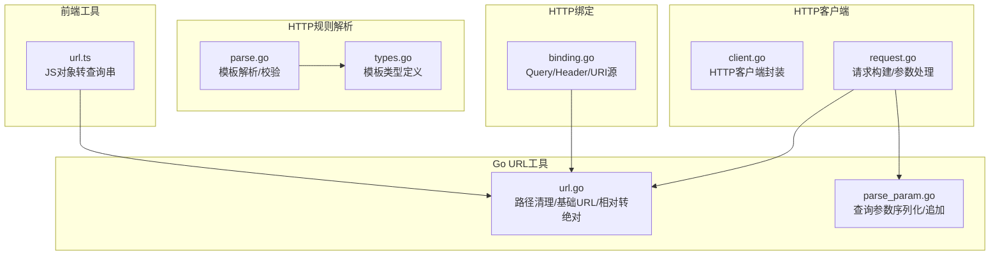
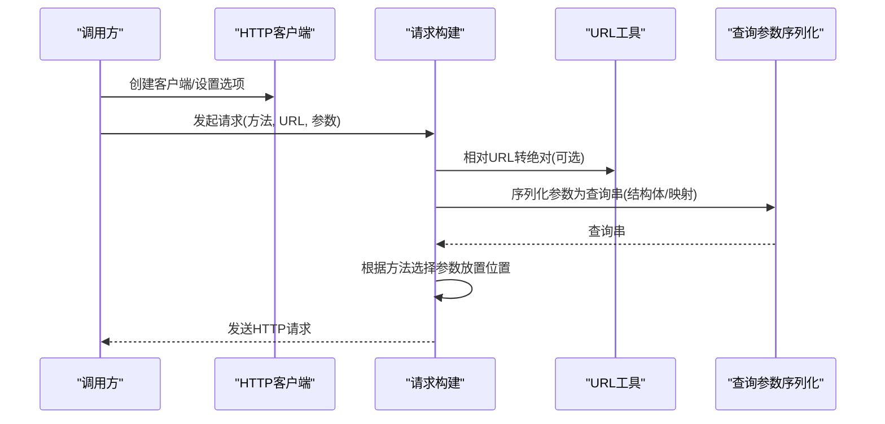
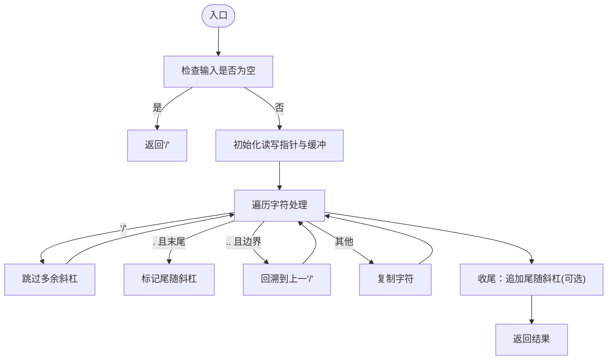
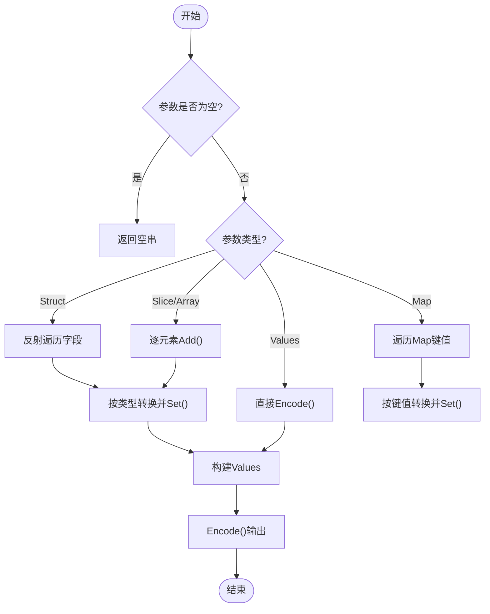
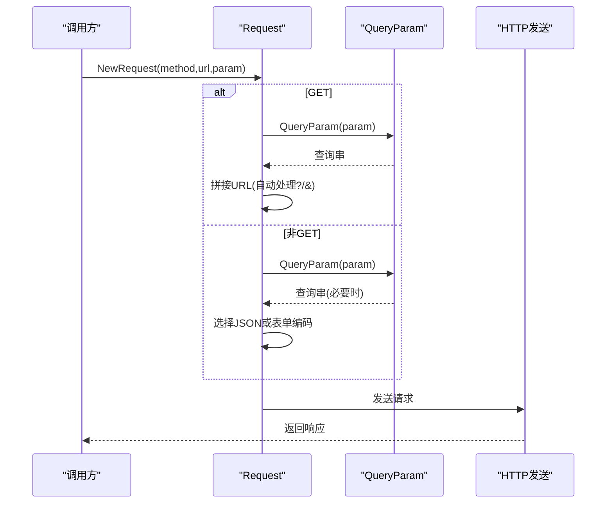
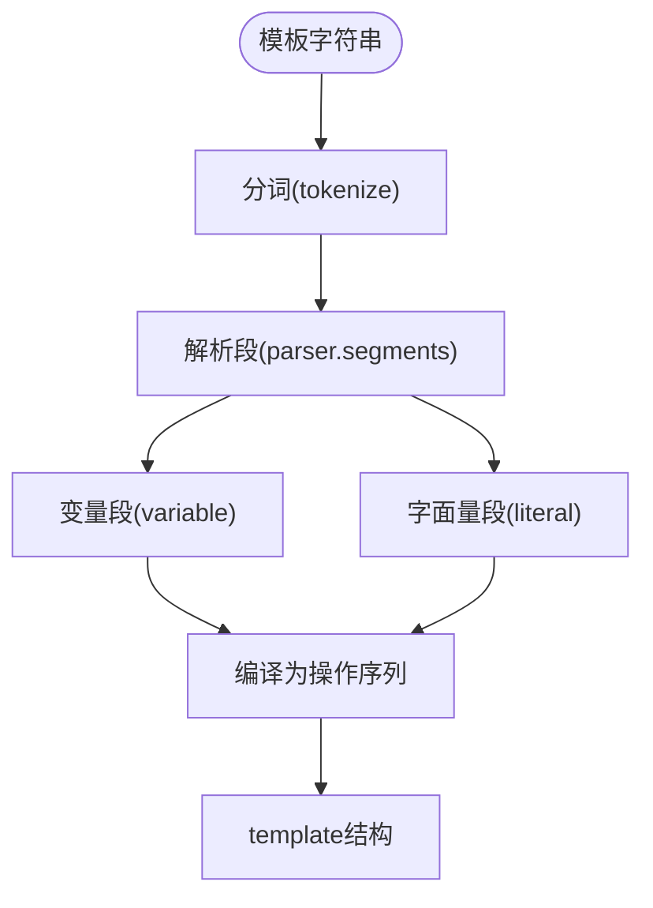
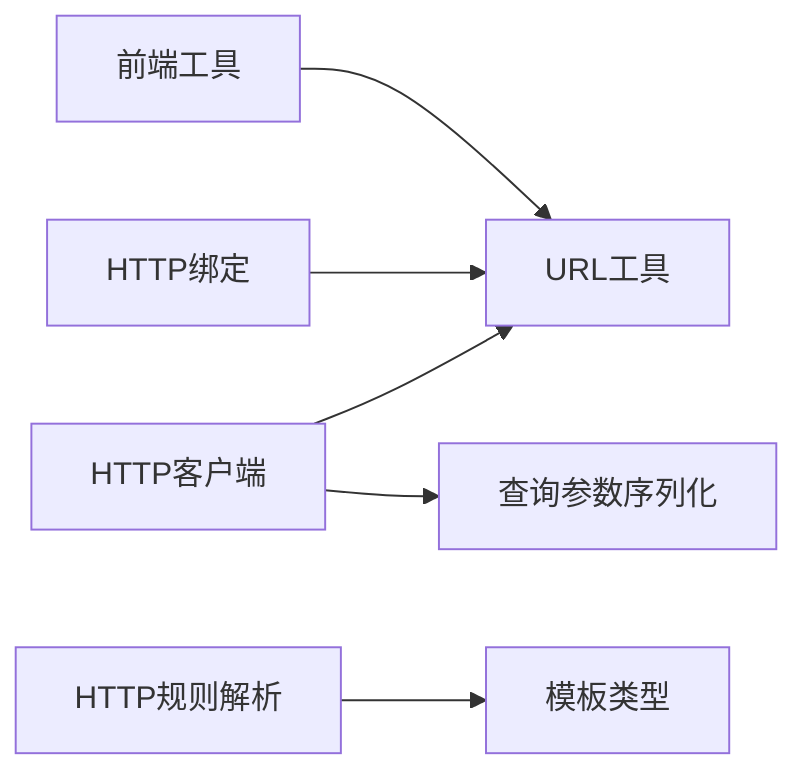

# URL处理

<cite>
**本文档引用的文件**
- [thirdparty/gox/net/url/url.go](file://thirdparty/gox/net/url/url.go)
- [thirdparty/gox/net/url/parse_param.go](file://thirdparty/gox/net/url/parse_param.go)
- [thirdparty/gox/net/http/client/request.go](file://thirdparty/gox/net/http/client/request.go)
- [thirdparty/gox/net/http/client/client.go](file://thirdparty/gox/net/http/client/client.go)
- [thirdparty/gox/net/http/binding.go](file://thirdparty/gox/net/http/binding.go)
- [thirdparty/protobuf/tools/protoc-gen-grpc-gin/httprule/parse.go](file://thirdparty/protobuf/tools/protoc-gen-grpc-gin/httprule/parse.go)
- [thirdparty/protobuf/tools/protoc-gen-grpc-gin/httprule/types.go](file://thirdparty/protobuf/tools/protoc-gen-grpc-gin/httprule/types.go)
- [thirdparty/diamond/src/utils/compatible/url.ts](file://thirdparty/diamond/src/utils/compatible/url.ts)
</cite>

## 目录
1. [简介](#简介)
2. [项目结构](#项目结构)
3. [核心组件](#核心组件)
4. [架构总览](#架构总览)
5. [详细组件分析](#详细组件分析)
6. [依赖关系分析](#依赖关系分析)
7. [性能考虑](#性能考虑)
8. [故障排查指南](#故障排查指南)
9. [结论](#结论)
10. [附录：实际应用示例](#附录实际应用示例)

## 简介
本文件为URL处理模块的详细API文档，覆盖以下能力：
- URL解析与规范化（路径清理、相对到绝对解析）
- 查询参数的序列化与反序列化（含数组、嵌套结构、类型转换）
- URL模板匹配与路径参数提取（基于Google HTTP规则）
- 安全处理与最佳实践（路径遍历防护、特殊字符转义、RFC3986 pchar校验）
- 实际应用场景（API路由处理、表单数据传递、链接生成）

## 项目结构
URL处理相关代码主要分布在以下模块：
- Go语言URL工具：路径清理、基础URL提取、相对到绝对URL解析
- 查询参数序列化：反射解析结构体/映射，生成标准查询字符串
- HTTP客户端：在请求构建阶段自动拼接查询参数
- HTTP绑定层：从URL、Header、Body中提取并解码参数
- gRPC-Gateway HTTP规则解析：URL模板解析与校验
- 前端兼容工具：将JS对象转换为URL查询字符串

**图表来源**
- [thirdparty/gox/net/url/url.go:1-202](file://thirdparty/gox/net/url/url.go#L1-L202)
- [thirdparty/gox/net/url/parse_param.go:1-147](file://thirdparty/gox/net/url/parse_param.go#L1-L147)
- [thirdparty/gox/net/http/client/client.go:1-290](file://thirdparty/gox/net/http/client/client.go#L1-L290)
- [thirdparty/gox/net/http/client/request.go:1-366](file://thirdparty/gox/net/http/client/request.go#L1-L366)
- [thirdparty/gox/net/http/binding.go:268-327](file://thirdparty/gox/net/http/binding.go#L268-L327)
- [thirdparty/protobuf/tools/protoc-gen-grpc-gin/httprule/parse.go:1-347](file://thirdparty/protobuf/tools/protoc-gen-grpc-gin/httprule/parse.go#L1-L347)
- [thirdparty/protobuf/tools/protoc-gen-grpc-gin/httprule/types.go:1-61](file://thirdparty/protobuf/tools/protoc-gen-grpc-gin/httprule/types.go#L1-L61)
- [thirdparty/diamond/src/utils/compatible/url.ts:1-13](file://thirdparty/diamond/src/utils/compatible/url.ts#L1-L13)

**章节来源**
- [thirdparty/gox/net/url/url.go:1-202](file://thirdparty/gox/net/url/url.go#L1-L202)
- [thirdparty/gox/net/url/parse_param.go:1-147](file://thirdparty/gox/net/url/parse_param.go#L1-L147)
- [thirdparty/gox/net/http/client/client.go:1-290](file://thirdparty/gox/net/http/client/client.go#L1-L290)
- [thirdparty/gox/net/http/client/request.go:1-366](file://thirdparty/gox/net/http/client/request.go#L1-L366)
- [thirdparty/gox/net/http/binding.go:268-327](file://thirdparty/gox/net/http/binding.go#L268-L327)
- [thirdparty/protobuf/tools/protoc-gen-grpc-gin/httprule/parse.go:1-347](file://thirdparty/protobuf/tools/protoc-gen-grpc-gin/httprule/parse.go#L1-L347)
- [thirdparty/protobuf/tools/protoc-gen-grpc-gin/httprule/types.go:1-61](file://thirdparty/protobuf/tools/protoc-gen-grpc-gin/httprule/types.go#L1-L61)
- [thirdparty/diamond/src/utils/compatible/url.ts:1-13](file://thirdparty/diamond/src/utils/compatible/url.ts#L1-L13)

## 核心组件
- 路径清理与基础URL
  - 清理函数：消除多余斜杠、处理.与..、保证以/开头
  - 基础URL：去除片段与查询部分
  - 相对转绝对：基于当前URL与基础URL解析
- 查询参数序列化
  - 支持结构体/映射/切片/数组，按标签键生成键值
  - 类型转换：布尔/整数/浮点/字符串；数组按索引展开
  - 追加查询参数：自动处理?与&分隔符
- HTTP客户端集成
  - GET请求自动拼接查询参数
  - 其他方法根据内容类型选择JSON或表单编码
- HTTP绑定层
  - Query/Header/URI参数源，统一解码与获取
- HTTP规则解析
  - 模板语法解析、变量段校验、pchar合法性检查
- 前端兼容
  - JS对象转查询串，数组键名带索引

**章节来源**
- [thirdparty/gox/net/url/url.go:13-202](file://thirdparty/gox/net/url/url.go#L13-L202)
- [thirdparty/gox/net/url/parse_param.go:39-146](file://thirdparty/gox/net/url/parse_param.go#L39-L146)
- [thirdparty/gox/net/http/client/request.go:115-209](file://thirdparty/gox/net/http/client/request.go#L115-L209)
- [thirdparty/gox/net/http/binding.go:268-327](file://thirdparty/gox/net/http/binding.go#L268-L327)
- [thirdparty/protobuf/tools/protoc-gen-grpc-gin/httprule/parse.go:18-347](file://thirdparty/protobuf/tools/protoc-gen-grpc-gin/httprule/parse.go#L18-L347)
- [thirdparty/diamond/src/utils/compatible/url.ts:1-13](file://thirdparty/diamond/src/utils/compatible/url.ts#L1-L13)

## 架构总览
URL处理在系统中的位置与交互如下：

**图表来源**
- [thirdparty/gox/net/http/client/client.go:226-235](file://thirdparty/gox/net/http/client/client.go#L226-L235)
- [thirdparty/gox/net/http/client/request.go:115-209](file://thirdparty/gox/net/http/client/request.go#L115-L209)
- [thirdparty/gox/net/url/url.go:167-179](file://thirdparty/gox/net/url/url.go#L167-L179)
- [thirdparty/gox/net/url/parse_param.go:39-53](file://thirdparty/gox/net/url/parse_param.go#L39-L53)

## 详细组件分析

### 组件A：URL路径清理与基础URL
- 功能要点
  - 路径清理：多斜杠合并、.与..处理、根路径修正
  - 基础URL：移除片段与查询
  - 文件名提取：从基础URL提取最后一段
  - 相对到绝对：使用标准库ResolveReference
- 复杂度与性能
  - 时间复杂度近似O(n)，空间按需分配
  - 内部缓冲策略减少常见情况下的堆分配
- 错误处理
  - 解析失败返回错误
  - 空输入返回"/"

**图表来源**
- [thirdparty/gox/net/url/url.go:26-129](file://thirdparty/gox/net/url/url.go#L26-L129)

**章节来源**
- [thirdparty/gox/net/url/url.go:13-202](file://thirdparty/gox/net/url/url.go#L13-L202)

### 组件B：查询参数序列化与追加
- 功能要点
  - 结构体/映射/切片/数组解析
  - 标签键生成与值转换
  - 数组按索引展开为多个同名键
  - 追加查询参数自动处理分隔符
- 类型转换
  - 整数：十进制字符串
  - 浮点：格式化字符串
  - 字符串：QueryEscape
  - 不支持接口/指针/结构体直接作为值
- 安全性
  - 使用标准库QueryEscape避免注入
  - 对数组键名进行URL编码

**图表来源**
- [thirdparty/gox/net/url/parse_param.go:43-146](file://thirdparty/gox/net/url/parse_param.go#L43-L146)

**章节来源**
- [thirdparty/gox/net/url/parse_param.go:1-147](file://thirdparty/gox/net/url/parse_param.go#L1-L147)

### 组件C：HTTP客户端中的URL处理
- 功能要点
  - GET：自动将参数序列化并拼接到URL
  - 非GET：根据内容类型选择JSON或表单编码
  - 自动设置Content-Type与Header
- 集成点
  - 在Do方法内调用查询参数序列化
  - 使用URL清理与相对转绝对能力

**图表来源**
- [thirdparty/gox/net/http/client/request.go:115-209](file://thirdparty/gox/net/http/client/request.go#L115-L209)
- [thirdparty/gox/net/url/parse_param.go:39-53](file://thirdparty/gox/net/url/parse_param.go#L39-L53)

**章节来源**
- [thirdparty/gox/net/http/client/request.go:115-209](file://thirdparty/gox/net/http/client/request.go#L115-L209)

### 组件D：HTTP绑定层（参数提取）
- 功能要点
  - Query：从URL查询中取值并解码
  - Header：从请求头取值并解码
  - URI：从路径模板变量取值
- 解码行为
  - 对取到的值执行QueryUnescape，确保原始值一致性

**章节来源**
- [thirdparty/gox/net/http/binding.go:268-327](file://thirdparty/gox/net/http/binding.go#L268-L327)

### 组件E：gRPC-Gateway HTTP规则解析
- 功能要点
  - 解析路径模板，支持通配与深通配
  - 校验标识符与pchar合法性
  - 生成编译后的模板结构
- 安全性
  - pchar校验防止非法字符进入路径段

**图表来源**
- [thirdparty/protobuf/tools/protoc-gen-grpc-gin/httprule/parse.go:18-37](file://thirdparty/protobuf/tools/protoc-gen-grpc-gin/httprule/parse.go#L18-L37)
- [thirdparty/protobuf/tools/protoc-gen-grpc-gin/httprule/types.go:8-60](file://thirdparty/protobuf/tools/protoc-gen-grpc-gin/httprule/types.go#L8-L60)

**章节来源**
- [thirdparty/protobuf/tools/protoc-gen-grpc-gin/httprule/parse.go:1-347](file://thirdparty/protobuf/tools/protoc-gen-grpc-gin/httprule/parse.go#L1-L347)
- [thirdparty/protobuf/tools/protoc-gen-grpc-gin/httprule/types.go:1-61](file://thirdparty/protobuf/tools/protoc-gen-grpc-gin/httprule/types.go#L1-L61)

### 组件F：前端兼容工具（JS对象转查询串）
- 功能要点
  - 将对象数组转换为带索引的键值对
  - 使用encodeURIComponent进行转义
- 适用场景
  - 前端表单/查询参数构造

**章节来源**
- [thirdparty/diamond/src/utils/compatible/url.ts:1-13](file://thirdparty/diamond/src/utils/compatible/url.ts#L1-L13)

## 依赖关系分析
- 组件耦合
  - HTTP客户端依赖URL工具与查询参数序列化
  - HTTP绑定层依赖URL工具进行解码
  - gRPC-Gateway规则解析独立，但与HTTP语义一致
- 外部依赖
  - 标准库net/url、reflect、strings
  - 第三方压缩库（与URL处理无直接关系）

**图表来源**
- [thirdparty/gox/net/http/client/client.go:226-235](file://thirdparty/gox/net/http/client/client.go#L226-L235)
- [thirdparty/gox/net/http/client/request.go:115-209](file://thirdparty/gox/net/http/client/request.go#L115-L209)
- [thirdparty/gox/net/url/url.go:13-202](file://thirdparty/gox/net/url/url.go#L13-L202)
- [thirdparty/gox/net/url/parse_param.go:39-53](file://thirdparty/gox/net/url/parse_param.go#L39-L53)
- [thirdparty/gox/net/http/binding.go:268-327](file://thirdparty/gox/net/http/binding.go#L268-L327)
- [thirdparty/protobuf/tools/protoc-gen-grpc-gin/httprule/parse.go:18-37](file://thirdparty/protobuf/tools/protoc-gen-grpc-gin/httprule/parse.go#L18-L37)
- [thirdparty/protobuf/tools/protoc-gen-grpc-gin/httprule/types.go:8-60](file://thirdparty/protobuf/tools/protoc-gen-grpc-gin/httprule/types.go#L8-L60)
- [thirdparty/diamond/src/utils/compatible/url.ts:1-13](file://thirdparty/diamond/src/utils/compatible/url.ts#L1-L13)

**章节来源**
- [thirdparty/gox/net/http/client/client.go:1-290](file://thirdparty/gox/net/http/client/client.go#L1-L290)
- [thirdparty/gox/net/http/client/request.go:1-366](file://thirdparty/gox/net/http/client/request.go#L1-L366)
- [thirdparty/gox/net/url/url.go:1-202](file://thirdparty/gox/net/url/url.go#L1-L202)
- [thirdparty/gox/net/url/parse_param.go:1-147](file://thirdparty/gox/net/url/parse_param.go#L1-L147)
- [thirdparty/gox/net/http/binding.go:268-327](file://thirdparty/gox/net/http/binding.go#L268-L327)
- [thirdparty/protobuf/tools/protoc-gen-grpc-gin/httprule/parse.go:1-347](file://thirdparty/protobuf/tools/protoc-gen-grpc-gin/httprule/parse.go#L1-L347)
- [thirdparty/protobuf/tools/protoc-gen-grpc-gin/httprule/types.go:1-61](file://thirdparty/protobuf/tools/protoc-gen-grpc-gin/httprule/types.go#L1-L61)
- [thirdparty/diamond/src/utils/compatible/url.ts:1-13](file://thirdparty/diamond/src/utils/compatible/url.ts#L1-L13)

## 性能考虑
- 路径清理
  - 使用栈上缓冲减少分配，仅在必要时扩容
  - 单次线性扫描，避免多次字符串复制
- 查询参数序列化
  - 反射遍历结构体时尽量复用Values，避免重复分配
  - 数组/切片按需Add，减少中间结构
- HTTP客户端
  - GET请求直接拼接查询串，避免额外编码开销
  - 非GET请求优先使用表单编码以减少JSON体积

## 故障排查指南
- 相对URL转绝对失败
  - 检查基础URL与当前URL格式是否合法
  - 确认URL解析错误返回值
- 查询参数异常
  - 确认传入参数类型是否受支持
  - 检查标签键是否正确设置
- HTTP规则解析报错
  - 检查模板是否以/开头
  - 校验pchar与标识符合法性
- 编码问题
  - 确保字符串值已正确QueryEscape
  - 注意数组键名的索引编码

**章节来源**
- [thirdparty/gox/net/url/url.go:167-179](file://thirdparty/gox/net/url/url.go#L167-L179)
- [thirdparty/gox/net/url/parse_param.go:104-120](file://thirdparty/gox/net/url/parse_param.go#L104-L120)
- [thirdparty/protobuf/tools/protoc-gen-grpc-gin/httprule/parse.go:252-309](file://thirdparty/protobuf/tools/protoc-gen-grpc-gin/httprule/parse.go#L252-L309)

## 结论
该URL处理模块提供了从路径清理、查询参数序列化到HTTP集成与规则解析的完整能力，具备良好的安全性与性能表现。通过清晰的组件划分与严格的类型/字符校验，能够满足API路由、表单传递与链接生成等常见场景。

## 附录：实际应用示例
- API路由处理
  - 使用HTTP规则解析模板，结合路径参数提取，完成RESTful路由匹配
- 表单数据传递
  - 在HTTP客户端中将结构体参数序列化为查询串或表单编码，自动处理编码与分隔符
- 链接生成
  - 对相对URL进行解析，生成绝对URL，并附加查询参数

**章节来源**
- [thirdparty/protobuf/tools/protoc-gen-grpc-gin/httprule/parse.go:18-37](file://thirdparty/protobuf/tools/protoc-gen-grpc-gin/httprule/parse.go#L18-L37)
- [thirdparty/gox/net/http/client/request.go:115-209](file://thirdparty/gox/net/http/client/request.go#L115-L209)
- [thirdparty/gox/net/url/url.go:167-179](file://thirdparty/gox/net/url/url.go#L167-L179)
- [thirdparty/gox/net/url/parse_param.go:122-146](file://thirdparty/gox/net/url/parse_param.go#L122-L146)