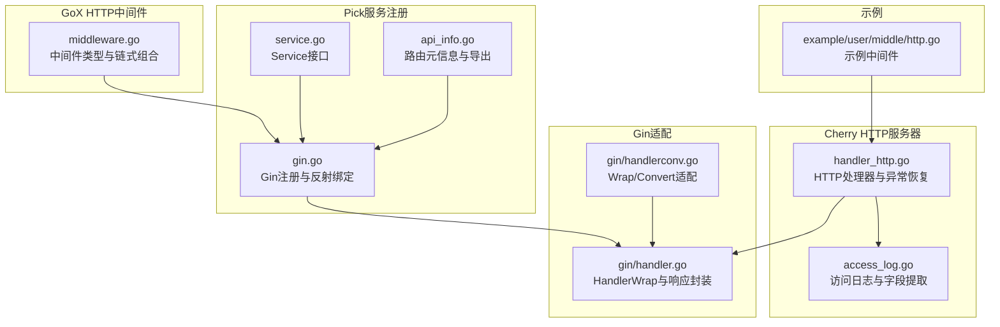
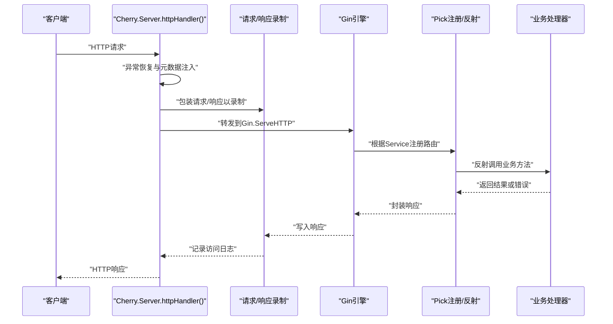
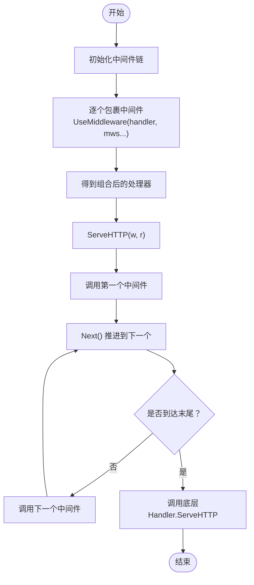
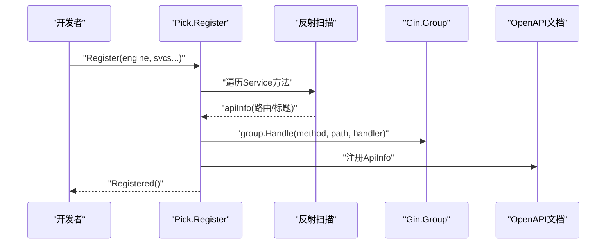
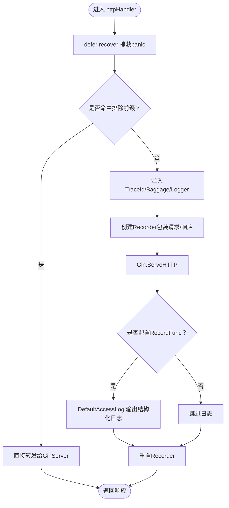
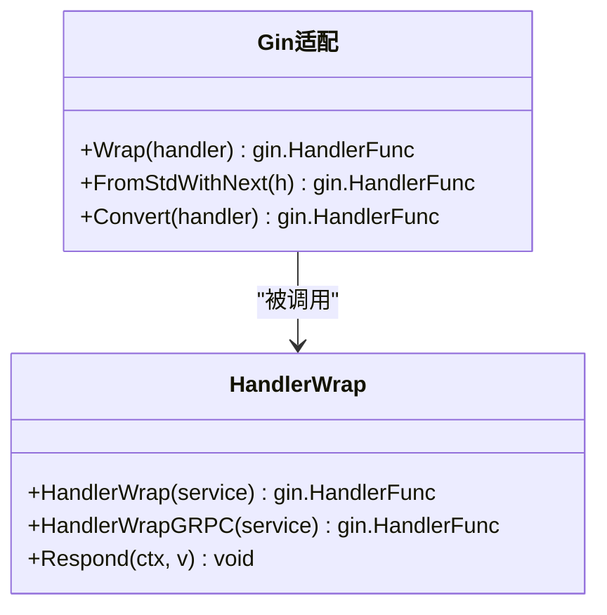
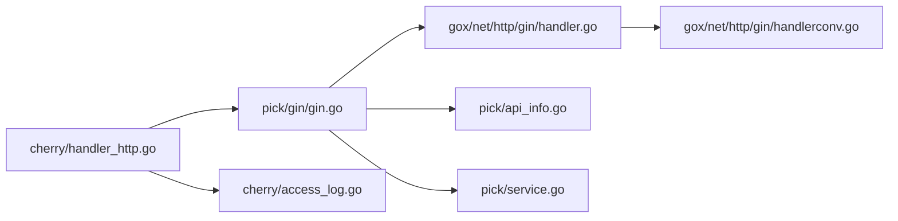

# 中间件机制

<cite>
**本文档引用的文件**
- [thirdparty/gox/net/http/middleware.go](file://thirdparty/gox/net/http/middleware.go)
- [thirdparty/pick/std/middleware.go](file://thirdparty/pick/std/middleware.go)
- [thirdparty/pick/gin/gin.go](file://thirdparty/pick/gin/gin.go)
- [thirdparty/cherry/handler_http.go](file://thirdparty/cherry/handler_http.go)
- [thirdparty/cherry/access_log.go](file://thirdparty/cherry/access_log.go)
- [thirdparty/gox/net/http/gin/handler.go](file://thirdparty/gox/net/http/gin/handler.go)
- [thirdparty/gox/net/http/gin/handlerconv.go](file://thirdparty/gox/net/http/gin/handlerconv.go)
- [thirdparty/pick/service.go](file://thirdparty/pick/service.go)
- [thirdparty/pick/api_info.go](file://thirdparty/pick/api_info.go)
- [thirdparty/cherry/_example/user/middle/http.go](file://thirdparty/cherry/_example/user/middle/http.go)
</cite>

## 目录
1. [引言](#引言)
2. [项目结构](#项目结构)
3. [核心组件](#核心组件)
4. [架构总览](#架构总览)
5. [详细组件分析](#详细组件分析)
6. [依赖关系分析](#依赖关系分析)
7. [性能考量](#性能考量)
8. [故障排查指南](#故障排查指南)
9. [结论](#结论)
10. [附录](#附录)

## 引言
本文件系统性梳理并文档化仓库中的HTTP中间件机制，覆盖以下主题：
- 中间件的设计模式与执行流程
- 中间件的注册、配置与生命周期管理
- 内置中间件能力（日志记录、异常恢复、可观测性等）
- 自定义中间件的开发指南（接口定义、上下文传递、错误处理）
- 集成Gin框架的中间件方案与最佳实践
- 实际开发示例与常见问题排查

## 项目结构
围绕HTTP中间件的关键模块分布如下：
- 核心中间件抽象与执行模型：thirdparty/gox/net/http/middleware.go
- Pick服务注册与路由元信息：thirdparty/pick/*.go
- Cherry HTTP服务器与访问日志：thirdparty/cherry/*.go
- Gin适配层与处理器封装：thirdparty/gox/net/http/gin/*.go
- 示例中间件：thirdparty/cherry/_example/user/middle/http.go

图表来源
- [thirdparty/gox/net/http/middleware.go:13-64](file://thirdparty/gox/net/http/middleware.go#L13-L64)
- [thirdparty/pick/service.go:20-31](file://thirdparty/pick/service.go#L20-L31)
- [thirdparty/pick/api_info.go:40-269](file://thirdparty/pick/api_info.go#L40-L269)
- [thirdparty/pick/gin/gin.go:27-74](file://thirdparty/pick/gin/gin.go#L27-L74)
- [thirdparty/gox/net/http/gin/handler.go:18-84](file://thirdparty/gox/net/http/gin/handler.go#L18-L84)
- [thirdparty/gox/net/http/gin/handlerconv.go:16-64](file://thirdparty/gox/net/http/gin/handlerconv.go#L16-L64)
- [thirdparty/cherry/handler_http.go:36-83](file://thirdparty/cherry/handler_http.go#L36-L83)
- [thirdparty/cherry/access_log.go:22-106](file://thirdparty/cherry/access_log.go#L22-L106)
- [thirdparty/cherry/_example/user/middle/http.go:16-23](file://thirdparty/cherry/_example/user/middle/http.go#L16-L23)

章节来源
- [thirdparty/gox/net/http/middleware.go:13-64](file://thirdparty/gox/net/http/middleware.go#L13-L64)
- [thirdparty/pick/service.go:20-31](file://thirdparty/pick/service.go#L20-L31)
- [thirdparty/pick/api_info.go:40-269](file://thirdparty/pick/api_info.go#L40-L269)
- [thirdparty/pick/gin/gin.go:27-74](file://thirdparty/pick/gin/gin.go#L27-L74)
- [thirdparty/cherry/handler_http.go:36-83](file://thirdparty/cherry/handler_http.go#L36-L83)
- [thirdparty/cherry/access_log.go:22-106](file://thirdparty/cherry/access_log.go#L22-L106)
- [thirdparty/gox/net/http/gin/handler.go:18-84](file://thirdparty/gox/net/http/gin/handler.go#L18-L84)
- [thirdparty/gox/net/http/gin/handlerconv.go:16-64](file://thirdparty/gox/net/http/gin/handlerconv.go#L16-L64)
- [thirdparty/cherry/_example/user/middle/http.go:16-23](file://thirdparty/cherry/_example/user/middle/http.go#L16-L23)

## 核心组件
- 中间件类型与链式组合
  - 定义了标准中间件签名，并提供将多个中间件按序包裹到处理器上的工具函数，形成洋葱模型的调用链。
- Pick服务注册与路由元信息
  - 通过Service接口返回描述、URL前缀与中间件列表；利用反射扫描方法，生成路由元信息并注册到OpenAPI文档。
- Cherry HTTP服务器
  - 统一入口在内部处理器中完成异常恢复、请求/响应录制、访问日志记录与可选的OpenTelemetry埋点。
- Gin适配层
  - 提供HandlerWrap与HandlerWrapGRPC，统一错误与成功响应；Wrap/Convert用于将标准HTTP处理器适配为Gin处理器。

章节来源
- [thirdparty/gox/net/http/middleware.go:13-23](file://thirdparty/gox/net/http/middleware.go#L13-L23)
- [thirdparty/pick/service.go:20-31](file://thirdparty/pick/service.go#L20-L31)
- [thirdparty/pick/api_info.go:40-269](file://thirdparty/pick/api_info.go#L40-L269)
- [thirdparty/cherry/handler_http.go:36-83](file://thirdparty/cherry/handler_http.go#L36-L83)
- [thirdparty/gox/net/http/gin/handler.go:18-84](file://thirdparty/gox/net/http/gin/handler.go#L18-L84)
- [thirdparty/gox/net/http/gin/handlerconv.go:16-64](file://thirdparty/gox/net/http/gin/handlerconv.go#L16-L64)

## 架构总览
下图展示从请求进入Cherry服务器到最终响应返回的完整链路，以及Pick/Gin如何参与注册与处理：

图表来源
- [thirdparty/cherry/handler_http.go:36-83](file://thirdparty/cherry/handler_http.go#L36-L83)
- [thirdparty/pick/gin/gin.go:27-74](file://thirdparty/pick/gin/gin.go#L27-L74)
- [thirdparty/gox/net/http/gin/handler.go:18-84](file://thirdparty/gox/net/http/gin/handler.go#L18-L84)

## 详细组件分析

### 中间件执行模型与链式组合
- 设计要点
  - 中间件采用函数式组合，每个中间件接收并返回一个http.Handler，形成洋葱模型。
  - 支持两种上下文风格：基于http.Handler的链式包裹，以及基于MiddlewareContext的显式Next调用。
- 执行流程
  - UseMiddleware按顺序将中间件包裹到处理器上。
  - MiddlewareContext维护handlers数组与index，Next负责推进到下一个处理器，支持在末尾回退至底层Handler。
- 复杂度与性能
  - 链式包裹的时间复杂度为O(n)，空间复杂度为O(n)（中间件数量）。
  - Next调用避免了递归栈溢出风险，适合长链。

图表来源
- [thirdparty/gox/net/http/middleware.go:15-64](file://thirdparty/gox/net/http/middleware.go#L15-L64)

章节来源
- [thirdparty/gox/net/http/middleware.go:13-64](file://thirdparty/gox/net/http/middleware.go#L13-L64)

### Pick服务注册与路由元信息
- Service接口
  - 返回描述、URL前缀与中间件切片，作为路由注册的基础。
- 路由元信息
  - 通过一系列Get/Put/Delete等方法构建路由集合，支持标题与备注。
  - 使用panic携带元信息并在defer中捕获，完成路径前缀拼接与导出。
- 注册流程
  - Register遍历Service的所有方法，反射校验签名，生成路由并挂载到Gin Group。
  - 将方法导出的ApiInfo注册到OpenAPI文档。

图表来源
- [thirdparty/pick/service.go:20-31](file://thirdparty/pick/service.go#L20-L31)
- [thirdparty/pick/api_info.go:40-269](file://thirdparty/pick/api_info.go#L40-L269)
- [thirdparty/pick/gin/gin.go:27-74](file://thirdparty/pick/gin/gin.go#L27-L74)

章节来源
- [thirdparty/pick/service.go:20-31](file://thirdparty/pick/service.go#L20-L31)
- [thirdparty/pick/api_info.go:40-269](file://thirdparty/pick/api_info.go#L40-L269)
- [thirdparty/pick/gin/gin.go:27-74](file://thirdparty/pick/gin/gin.go#L27-L74)

### Cherry HTTP服务器与访问日志
- 异常恢复
  - 在内部处理器中使用defer recover，捕获panic并返回统一错误格式。
- 请求/响应录制
  - 使用Recorder包装原始请求与响应，便于后续日志记录。
- 访问日志
  - 默认日志函数对JSON与Protobuf内容进行结构化输出，支持自定义RecordFunc。
- 可观测性
  - 可选启用OpenTelemetry，对HTTP请求进行追踪与指标采集。

图表来源
- [thirdparty/cherry/handler_http.go:36-83](file://thirdparty/cherry/handler_http.go#L36-L83)
- [thirdparty/cherry/access_log.go:36-74](file://thirdparty/cherry/access_log.go#L36-L74)

章节来源
- [thirdparty/cherry/handler_http.go:36-83](file://thirdparty/cherry/handler_http.go#L36-L83)
- [thirdparty/cherry/access_log.go:22-106](file://thirdparty/cherry/access_log.go#L22-L106)

### Gin适配层与处理器封装
- HandlerWrap与HandlerWrapGRPC
  - 统一绑定请求体、处理错误与成功响应，支持返回http.Handler或Responder接口。
- Wrap/Convert
  - 将标准http.Handler/func转换为gin.HandlerFunc，支持带next回调的适配。

图表来源
- [thirdparty/gox/net/http/gin/handler.go:18-84](file://thirdparty/gox/net/http/gin/handler.go#L18-L84)
- [thirdparty/gox/net/http/gin/handlerconv.go:16-64](file://thirdparty/gox/net/http/gin/handlerconv.go#L16-L64)

章节来源
- [thirdparty/gox/net/http/gin/handler.go:18-84](file://thirdparty/gox/net/http/gin/handler.go#L18-L84)
- [thirdparty/gox/net/http/gin/handlerconv.go:16-64](file://thirdparty/gox/net/http/gin/handlerconv.go#L16-L64)

### 示例：自定义中间件
- 示例中间件
  - 提供基于net/http与Fiber的简单日志中间件示例，展示如何在中间件中记录请求信息并继续调用下一个处理器。
- 开发指南
  - 接口定义：遵循http.Handler签名，接收http.ResponseWriter与*http.Request。
  - 上下文传递：在Cherry中可通过Context注入TraceId、Baggage、Logger等。
  - 错误处理：建议在中间件内尽早返回错误并终止链路，避免污染后续处理。

章节来源
- [thirdparty/cherry/_example/user/middle/http.go:16-23](file://thirdparty/cherry/_example/user/middle/http.go#L16-L23)
- [thirdparty/cherry/handler_http.go:58-64](file://thirdparty/cherry/handler_http.go#L58-L64)

## 依赖关系分析
- 组件耦合
  - Cherry依赖Pick/Gin进行路由注册与处理器封装；Pick依赖反射生成路由元信息；Gin适配层依赖GoX HTTP工具。
- 外部依赖
  - Gin、OpenTelemetry、Zap等第三方库在Cherry与Gin适配层中被使用。
- 循环依赖
  - 当前结构未见循环导入，各模块职责清晰。

图表来源
- [thirdparty/cherry/handler_http.go:36-83](file://thirdparty/cherry/handler_http.go#L36-L83)
- [thirdparty/pick/gin/gin.go:27-74](file://thirdparty/pick/gin/gin.go#L27-L74)
- [thirdparty/gox/net/http/gin/handler.go:18-84](file://thirdparty/gox/net/http/gin/handler.go#L18-L84)
- [thirdparty/gox/net/http/gin/handlerconv.go:16-64](file://thirdparty/gox/net/http/gin/handlerconv.go#L16-L64)
- [thirdparty/cherry/access_log.go:36-74](file://thirdparty/cherry/access_log.go#L36-L74)
- [thirdparty/pick/service.go:20-31](file://thirdparty/pick/service.go#L20-L31)
- [thirdparty/pick/api_info.go:40-269](file://thirdparty/pick/api_info.go#L40-L269)

章节来源
- [thirdparty/cherry/handler_http.go:36-83](file://thirdparty/cherry/handler_http.go#L36-L83)
- [thirdparty/pick/gin/gin.go:27-74](file://thirdparty/pick/gin/gin.go#L27-L74)
- [thirdparty/gox/net/http/gin/handler.go:18-84](file://thirdparty/gox/net/http/gin/handler.go#L18-L84)
- [thirdparty/gox/net/http/gin/handlerconv.go:16-64](file://thirdparty/gox/net/http/gin/handlerconv.go#L16-L64)
- [thirdparty/cherry/access_log.go:36-74](file://thirdparty/cherry/access_log.go#L36-L74)
- [thirdparty/pick/service.go:20-31](file://thirdparty/pick/service.go#L20-L31)
- [thirdparty/pick/api_info.go:40-269](file://thirdparty/pick/api_info.go#L40-L269)

## 性能考量
- 中间件链长度
  - 链越长，每次请求的开销越大；建议按需启用中间件，避免冗余。
- 录制与日志
  - Recorder会复制请求/响应，注意大体积Body带来的内存压力；默认日志仅在必要时输出结构化字段。
- 可观测性
  - OTel开启会引入额外开销，建议在生产环境按需启用采样策略。

## 故障排查指南
- 常见问题
  - 中间件未生效：检查是否正确传入中间件链与顺序；确认UseMiddleware包裹顺序。
  - 路由未注册：核对Service方法签名与返回值类型，确保符合Pick要求。
  - 日志缺失：确认ExcludePrefixes与IncludePrefixes配置，以及RecordFunc是否为空。
  - Panic导致崩溃：Cherry已内置recover，若仍出现异常，检查自定义中间件是否吞掉错误或中断链路。
- 定位手段
  - 使用默认访问日志输出请求/响应摘要，结合TraceId定位问题。
  - 在中间件中打印关键上下文（如TraceId、Baggage），辅助排障。

章节来源
- [thirdparty/cherry/handler_http.go:38-49](file://thirdparty/cherry/handler_http.go#L38-L49)
- [thirdparty/cherry/access_log.go:36-74](file://thirdparty/cherry/access_log.go#L36-L74)
- [thirdparty/pick/api_info.go:184-189](file://thirdparty/pick/api_info.go#L184-L189)

## 结论
本中间件体系以GoX为核心抽象，结合Pick的反射注册与Gin适配，实现了从路由元信息到处理器封装的完整链路。Cherry服务器在该链路上提供了异常恢复、请求/响应录制与访问日志能力，并可选接入OpenTelemetry。通过明确的接口与清晰的职责划分，开发者可以快速扩展自定义中间件并安全地集成到现有服务中。

## 附录
- 最佳实践
  - 中间件应保持单一职责，避免在中间件中做重逻辑。
  - 对关键中间件（如鉴权、限流）置于链路前端，减少后续处理成本。
  - 使用Context传递跨层信息，避免全局状态。
  - 对大Body的录制与日志输出要谨慎，避免内存与IO瓶颈。
- 开发步骤
  - 定义中间件函数签名，遵循http.Handler。
  - 通过UseMiddleware或Pick的Service接口注册。
  - 在Cherry中配置AccessLog与OTel，确保可观测性。
  - 编写单元测试覆盖正常与异常分支。