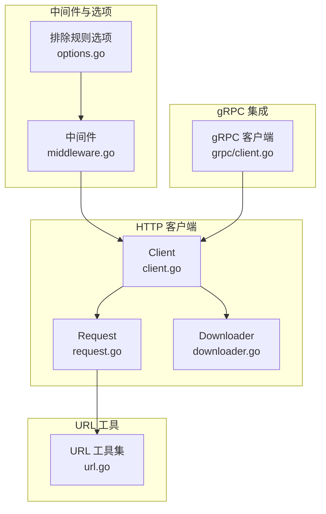
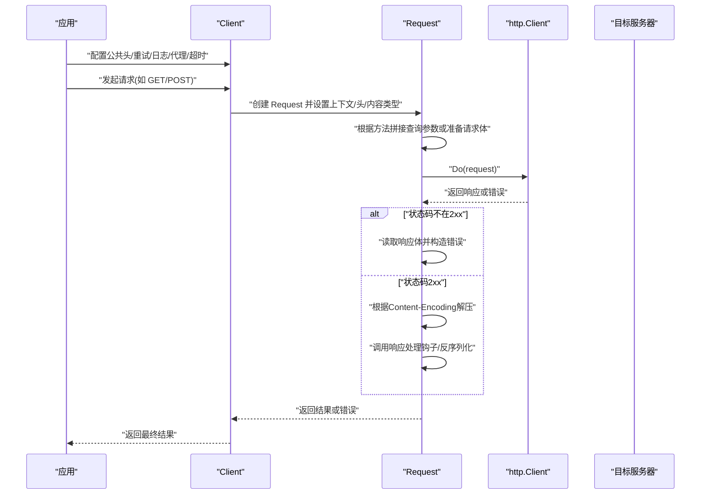
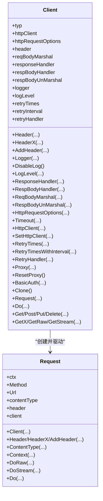
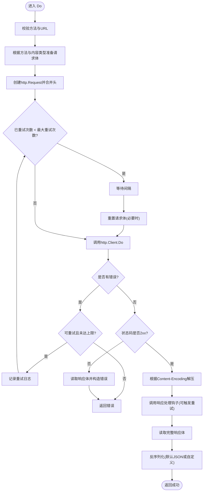
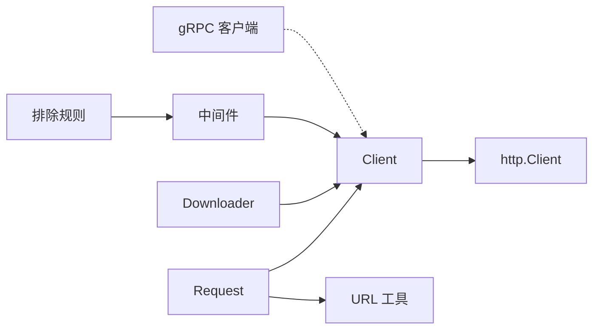

# 网络工具

<cite>
**本文档引用的文件**
- [client.go](file://thirdparty/gox/net/http/client/client.go)
- [request.go](file://thirdparty/gox/net/http/client/request.go)
- [downloader.go](file://thirdparty/gox/net/http/client/downloader.go)
- [url.go](file://thirdparty/gox/net/url/url.go)
- [middleware.go](file://thirdparty/gox/net/http/middleware.go)
- [options.go](file://thirdparty/gox/net/http/options.go)
- [client.go](file://thirdparty/gox/net/http/grpc/client.go)
</cite>

## 目录
1. [简介](#简介)
2. [项目结构](#项目结构)
3. [核心组件](#核心组件)
4. [架构总览](#架构总览)
5. [详细组件分析](#详细组件分析)
6. [依赖分析](#依赖分析)
7. [性能考虑](#性能考虑)
8. [故障排查指南](#故障排查指南)
9. [结论](#结论)
10. [附录](#附录)

## 简介
本文件为“网络工具”模块的详细API文档，覆盖HTTP客户端封装、URL处理、网络工具函数、gRPC集成、中间件机制、代理支持、连接池与超时控制、重试机制、压缩解码、错误处理与访问日志等能力。文档以循序渐进的方式呈现，既适合快速上手，也能满足深入定制的需求。

## 项目结构
网络工具主要位于 thirdparty/gox/net 子目录下，按功能划分为：
- http 客户端与请求封装：client、request、downloader、upload、content_type、utils 等
- URL 工具：url
- 中间件与路由：middleware、options
- gRPC 集成：grpc/client

图表来源
- [client.go:1-290](file://thirdparty/gox/net/http/client/client.go#L1-L290)
- [request.go:1-366](file://thirdparty/gox/net/http/client/request.go#L1-L366)
- [downloader.go:1-52](file://thirdparty/gox/net/http/client/downloader.go#L1-L52)
- [url.go:1-202](file://thirdparty/gox/net/url/url.go#L1-L202)
- [middleware.go:1-65](file://thirdparty/gox/net/http/middleware.go#L1-L65)
- [options.go:1-63](file://thirdparty/gox/net/http/options.go#L1-L63)
- [client.go:1-42](file://thirdparty/gox/net/http/grpc/client.go#L1-L42)

章节来源
- [client.go:1-290](file://thirdparty/gox/net/http/client/client.go#L1-L290)
- [request.go:1-366](file://thirdparty/gox/net/http/client/request.go#L1-L366)
- [downloader.go:1-52](file://thirdparty/gox/net/http/client/downloader.go#L1-L52)
- [url.go:1-202](file://thirdparty/gox/net/url/url.go#L1-L202)
- [middleware.go:1-65](file://thirdparty/gox/net/http/middleware.go#L1-L65)
- [options.go:1-63](file://thirdparty/gox/net/http/options.go#L1-L63)
- [client.go:1-42](file://thirdparty/gox/net/http/grpc/client.go#L1-L42)

## 核心组件
- HTTP 客户端 Client：提供统一的HTTP请求入口，支持公共请求头、请求体编解码钩子、响应处理钩子、重试策略、日志与访问控制（Basic Auth）、代理设置、超时与自定义 http.Client。
- 请求 Request：封装单次HTTP请求的上下文、方法、URL、内容类型、请求头、上下文、以及 Do/DoRaw/DoStream 等执行方法。
- 下载器 Downloader：基于 Client 的下载专用封装，内置默认重试与静默日志策略。
- URL 工具：提供 URL 清理、基础路径提取、相对到绝对URL解析等实用函数。
- 中间件：提供标准 http.Handler 中间件链与上下文中间件链（可串行处理请求）。
- gRPC 客户端：提供不安全与TLS两种gRPC连接工厂方法，便于在HTTP网关或服务间调用。

章节来源
- [client.go:56-290](file://thirdparty/gox/net/http/client/client.go#L56-L290)
- [request.go:36-366](file://thirdparty/gox/net/http/client/request.go#L36-L366)
- [downloader.go:15-52](file://thirdparty/gox/net/http/client/downloader.go#L15-L52)
- [url.go:13-202](file://thirdparty/gox/net/url/url.go#L13-L202)
- [middleware.go:13-65](file://thirdparty/gox/net/http/middleware.go#L13-L65)
- [client.go:22-42](file://thirdparty/gox/net/http/grpc/client.go#L22-L42)

## 架构总览
HTTP 客户端通过 Client 统一管理底层 http.Client、公共头、编解码钩子、重试与日志；Request 负责构建单次请求并执行；Downloader 作为 Client 的特化实例用于下载场景；URL 工具为请求参数拼接与URL规范化提供支撑；中间件与选项为服务端路由与过滤提供扩展点；gRPC 客户端提供与HTTP互通的RPC能力。

图表来源
- [client.go:82-235](file://thirdparty/gox/net/http/client/client.go#L82-L235)
- [request.go:113-366](file://thirdparty/gox/net/http/client/request.go#L113-L366)

## 详细组件分析

### HTTP 客户端 Client
- 角色与职责
  - 统一封装 http.Client，支持公共请求头、请求体/响应体编解码钩子、响应处理钩子、重试策略、日志与访问控制、代理设置、超时与自定义 http.Client。
  - 提供便捷的 GET/POST/PUT/DELETE 等方法，以及原始字节与流式读取接口。
- 关键配置项
  - 公共请求头：Header/HeaderX/AddHeader
  - 编解码钩子：ReqBodyMarshal/RespBodyHandler/RespBodyUnMarshal
  - 响应处理钩子：ResponseHandler
  - 重试：RetryTimes/RetryTimesWithInterval/RetryHandler
  - 日志：Logger/LogLevel/DisableLog
  - 代理与超时：Proxy/ResetProxy/Timeout/HttpClient/SetHttpClient
- 使用建议
  - 对于高并发或长连接场景，建议传入自定义 http.Client 并启用连接复用与合理的超时。
  - 对于下载场景，优先使用 Downloader 实例以获得默认重试与静默日志策略。

图表来源
- [client.go:56-290](file://thirdparty/gox/net/http/client/client.go#L56-L290)
- [request.go:36-112](file://thirdparty/gox/net/http/client/request.go#L36-L112)

章节来源
- [client.go:22-290](file://thirdparty/gox/net/http/client/client.go#L22-L290)
- [request.go:113-366](file://thirdparty/gox/net/http/client/request.go#L113-L366)

### 请求 Request
- 角色与职责
  - 封装一次HTTP请求的上下文、方法、URL、内容类型、请求头、上下文，并负责参数编码、请求体准备、发送请求、响应解码与错误处理。
- 执行流程
  - 参数编码：GET 使用查询参数拼接；非GET根据内容类型或自定义钩子准备请求体。
  - 发送请求：使用 Client 内部 http.Client 执行。
  - 错误处理：状态码不在2xx时读取响应体并构造错误；支持响应处理钩子触发重试。
  - 压缩解码：根据 Content-Encoding 自动解压 gzip/br/deflate/zstd。
  - 结果反序列化：默认JSON反序列化，支持自定义 Unmarshal 钩子。
- 流程图

图表来源
- [request.go:113-366](file://thirdparty/gox/net/http/client/request.go#L113-L366)

章节来源
- [request.go:113-366](file://thirdparty/gox/net/http/client/request.go#L113-L366)

### 下载器 Downloader
- 角色与职责
  - 基于 Client 的下载专用封装，默认开启重试与静默日志，适用于断点续传、附件下载等场景。
- 关键能力
  - Download(filepath, req)：直接下载到文件
  - DownloadAttachment(dir, req)：从响应头解析并下载附件
  - DownloadReq(url)：便捷创建下载请求
- 使用建议
  - 对大文件下载建议结合 Range 请求与断点续传策略（当前注释提示支持206状态）。

章节来源
- [downloader.go:15-52](file://thirdparty/gox/net/http/client/downloader.go#L15-L52)

### URL 工具
- 角色与职责
  - 提供URL清理、基础路径提取、相对URL转绝对URL等实用函数，辅助请求参数拼接与URL规范化。
- 主要函数
  - Clean：规范化路径，消除 . 与 ..
  - Base/URIBase：获取URL非参数部分与文件名
  - RelativeURLToAbsoluteURL：相对URL转绝对URL

章节来源
- [url.go:13-202](file://thirdparty/gox/net/url/url.go#L13-L202)

### 中间件与选项
- 中间件
  - Middleware：标准 http.Handler 中间件链
  - MiddlewareContext/MiddlewareContextHandler：上下文中间件链，支持 Next 串行处理
- 排除规则选项
  - ExcludedExtensions/ExcludedPaths/ExcludedPathsRegex：基于扩展名、路径前缀、正则表达式的排除集合

章节来源
- [middleware.go:13-65](file://thirdparty/gox/net/http/middleware.go#L13-L65)
- [options.go:14-63](file://thirdparty/gox/net/http/options.go#L14-L63)

### gRPC 集成
- 角色与职责
  - 提供不安全与TLS两种gRPC连接工厂方法，便于在HTTP网关或服务间调用。
- 关键点
  - 默认内部元数据标记，便于服务内识别
  - TLS配置支持跳过校验（开发环境可用）

章节来源
- [client.go:22-42](file://thirdparty/gox/net/http/grpc/client.go#L22-L42)

## 依赖分析
- 组件耦合
  - Client 依赖 http.Client 与各类钩子；Request 依赖 Client 并组合 URL 工具与编码工具。
  - Downloader 为 Client 的别名特化，共享所有能力。
  - 中间件与选项为横切关注点，可独立使用。
  - gRPC 客户端与HTTP客户端解耦，通过统一的元数据与头部常量进行协作。
- 外部依赖
  - 标准库 net/http、compress/*、crypto/tls
  - 第三方库：brotli、zstd、unicode 编解码

图表来源
- [client.go:56-290](file://thirdparty/gox/net/http/client/client.go#L56-L290)
- [request.go:36-112](file://thirdparty/gox/net/http/client/request.go#L36-L112)
- [downloader.go:22-52](file://thirdparty/gox/net/http/client/downloader.go#L22-L52)
- [middleware.go:13-65](file://thirdparty/gox/net/http/middleware.go#L13-L65)
- [options.go:14-63](file://thirdparty/gox/net/http/options.go#L14-L63)
- [client.go:22-42](file://thirdparty/gox/net/http/grpc/client.go#L22-L42)

## 性能考虑
- 连接池与复用
  - 使用自定义 http.Client 并保持长连接，合理设置 KeepAlive 与最大空闲连接数，避免频繁建连。
- 超时控制
  - 为不同场景设置合适的超时：连接超时、TLS握手超时、请求整体超时；避免阻塞。
- 压缩解码
  - 合理利用 gzip/br/deflate/zstd 自动解压，减少CPU开销；注意 Content-Length 与 Uncompressed 标记变化。
- 重试策略
  - 对瞬时性错误启用有限重试，设置退避间隔；避免对幂等性不足的请求盲目重试。
- 日志与监控
  - 在高并发场景降低日志级别或关闭日志，避免I/O成为瓶颈；结合访问日志统计耗时与错误率。

## 故障排查指南
- 常见问题定位
  - 状态码非2xx：检查响应体与错误信息，确认业务层错误码处理。
  - 超时/连接失败：检查代理、DNS、防火墙与超时配置。
  - 响应体乱码：确认字符集转换与Content-Type一致性。
  - 重试无效：确认重试次数与间隔设置，以及响应处理钩子是否返回重试。
- 建议步骤
  - 开启错误级别日志，记录请求/响应关键字段与耗时。
  - 使用 Downloader 的默认重试策略验证是否为瞬时性问题。
  - 对敏感接口启用 Basic Auth 与 TLS，确保传输安全。

章节来源
- [request.go:244-257](file://thirdparty/gox/net/http/client/request.go#L244-L257)
- [client.go:179-213](file://thirdparty/gox/net/http/client/client.go#L179-L213)

## 结论
网络工具模块提供了从HTTP请求到URL处理、从中间件到gRPC集成的完整能力矩阵。通过统一的 Client/Request 设计与灵活的钩子机制，既能满足简单场景的一键调用，也能支持复杂场景的深度定制。建议在生产环境中结合连接池、超时、重试与压缩策略，配合日志与监控，持续优化性能与稳定性。

## 附录
- 快速上手
  - 创建 Client 并设置公共头与日志
  - 使用 Request/Client 的便捷方法发起请求
  - 对下载场景使用 Downloader
  - 对RPC场景使用 gRPC 客户端工厂
- 最佳实践
  - 传输安全：优先使用TLS；服务端启用证书校验
  - 连接复用：自定义 http.Client 并复用
  - 错误处理：区分业务错误与网络错误；对幂等请求谨慎重试
  - 参数与URL：使用URL工具进行规范化与拼接