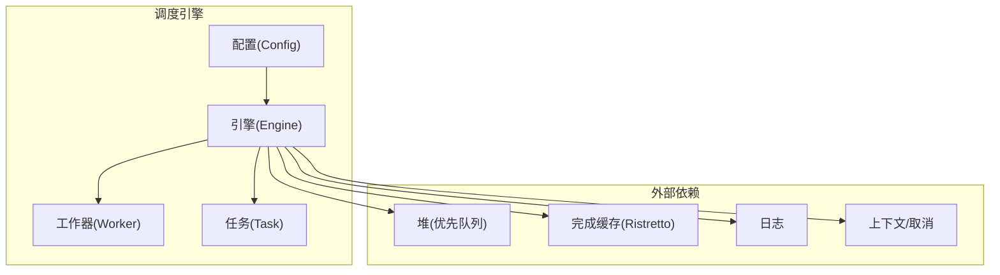
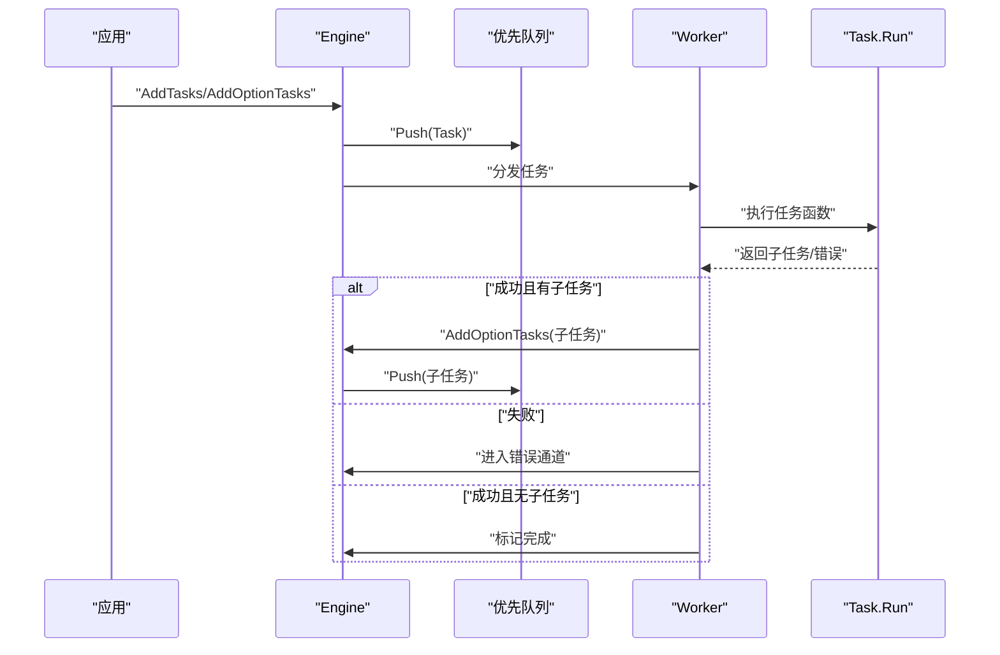
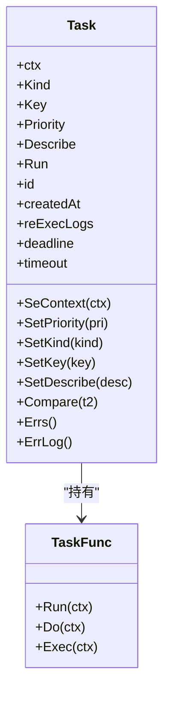
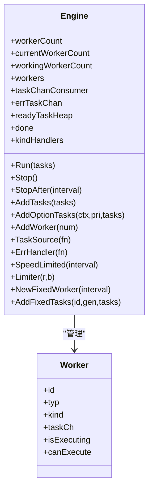
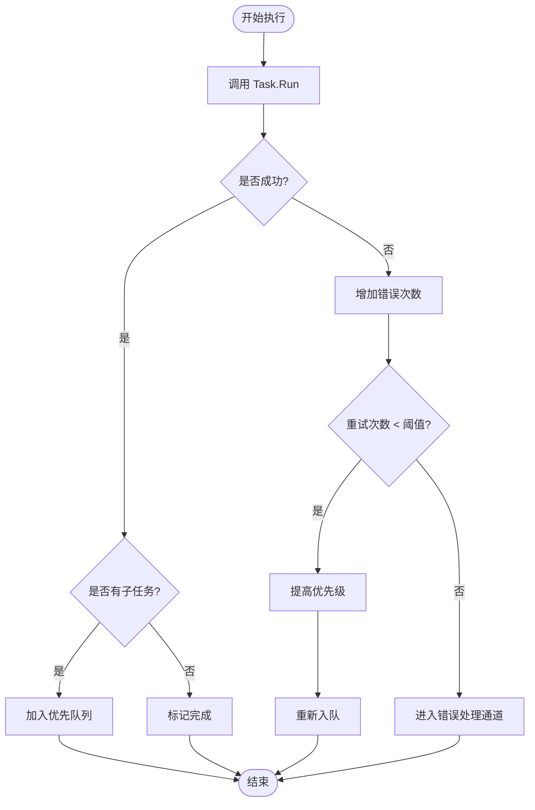
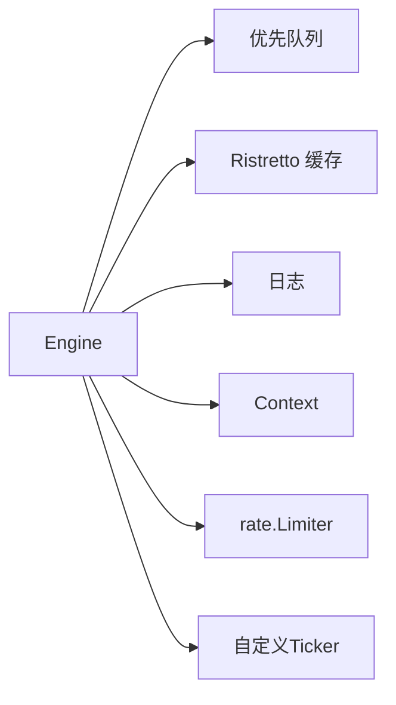

# 任务调度

<cite>
**本文档引用的文件**
- [engine.go](file://thirdparty/gox/scheduler/engine/engine.go)
- [task.go](file://thirdparty/gox/scheduler/engine/task.go)
- [conctrl.go](file://thirdparty/gox/scheduler/engine/conctrl.go)
- [config.go](file://thirdparty/gox/scheduler/engine/config.go)
- [woker.go](file://thirdparty/gox/scheduler/engine/woker.go)
- [task.go](file://thirdparty/gox/scheduler/task.go)
- [duration.go](file://thirdparty/gox/time/duration.go)
- [关于任务调度Task的三种实现.md](file://thirdparty/gox/scheduler/关于任务调度Task的三种实现.md)
</cite>

## 目录
1. [简介](#简介)
2. [项目结构](#项目结构)
3. [核心组件](#核心组件)
4. [架构总览](#架构总览)
5. [详细组件分析](#详细组件分析)
6. [依赖分析](#依赖分析)
7. [性能考量](#性能考量)
8. [故障排查指南](#故障排查指南)
9. [结论](#结论)
10. [附录：API参考与示例](#附录api参考与示例)

## 简介
本文件面向任务调度功能，提供从架构到API的完整文档。重点覆盖以下方面：
- 任务模型与生命周期：Task 结构体设计、优先级、重试、错误处理、超时与统计
- 调度引擎：Engine 的创建、配置、运行、停止与监控
- 核心API：AddTask、TaskSource、ErrHandler 等
- 不同类型任务：同步、异步、定时的创建与调度方式
- 生命周期管理：入队、执行、重试、完成、错误处理、停止与清理

## 项目结构
任务调度位于 thirdparty/gox/scheduler 引擎子模块，核心代码分布在 engine 子包中，包含配置、控制流、任务模型与工作器定义。

图表来源
- [config.go:23-49](file://thirdparty/gox/scheduler/engine/config.go#L23-L49)
- [engine.go:30-56](file://thirdparty/gox/scheduler/engine/engine.go#L30-L56)
- [woker.go:20-28](file://thirdparty/gox/scheduler/engine/woker.go#L20-L28)
- [task.go:46-60](file://thirdparty/gox/scheduler/engine/task.go#L46-L60)

章节来源
- [config.go:1-89](file://thirdparty/gox/scheduler/engine/config.go#L1-L89)
- [engine.go:1-242](file://thirdparty/gox/scheduler/engine/engine.go#L1-L242)
- [woker.go:1-41](file://thirdparty/gox/scheduler/engine/woker.go#L1-L41)
- [task.go:1-166](file://thirdparty/gox/scheduler/engine/task.go#L1-L166)

## 核心组件
- 配置(Config)：定义 Worker 数量、监控周期、完成缓存参数、遥测开关等
- 引擎(Engine)：任务入队、执行、限速、速率限制、错误处理、停止与统计
- 任务(Task)：任务元数据、优先级、描述、执行函数、执行日志、重试次数与错误统计
- 工作器(Worker)：执行任务的协程实体，支持普通与固定间隔两类
- 任务源(TaskSource)：批量添加任务的入口，保证任务源函数退出后才进行结束检测

章节来源
- [config.go:16-21](file://thirdparty/gox/scheduler/engine/config.go#L16-L21)
- [engine.go:30-56](file://thirdparty/gox/scheduler/engine/engine.go#L30-L56)
- [task.go:46-60](file://thirdparty/gox/scheduler/engine/task.go#L46-L60)
- [woker.go:20-28](file://thirdparty/gox/scheduler/engine/woker.go#L20-L28)
- [engine.go:234-241](file://thirdparty/gox/scheduler/engine/engine.go#L234-L241)

## 架构总览
调度采用“优先队列 + 多工作器并发”的模式。任务按优先级出队，工作器并发执行；支持全局与按任务类型（Kind）的限速/限流；支持完成去重缓存与错误处理回调。

图表来源
- [conctrl.go:174-207](file://thirdparty/gox/scheduler/engine/conctrl.go#L174-L207)
- [conctrl.go:283-380](file://thirdparty/gox/scheduler/engine/conctrl.go#L283-L380)
- [engine.go:232-241](file://thirdparty/gox/scheduler/engine/engine.go#L232-L241)

## 详细组件分析

### 任务模型 Task
- 字段与职责
  - 上下文与键：用于取消与去重
  - 类型与优先级：区分任务类型与调度顺序
  - 描述：便于可观测性
  - 统计：重试次数、错误次数
  - 执行函数：实际业务逻辑
  - 执行日志：首次与重试的日志记录
  - 截止时间与超时：可选的时限控制
- 方法族
  - 设置上下文、优先级、类型、键、描述
  - 比较与错误收集、错误日志输出
  - 接口适配：TaskFunc 实现 Run/Do/Exec

图表来源
- [task.go:46-60](file://thirdparty/gox/scheduler/engine/task.go#L46-L60)
- [task.go:129-165](file://thirdparty/gox/scheduler/engine/task.go#L129-L165)

章节来源
- [task.go:46-165](file://thirdparty/gox/scheduler/engine/task.go#L46-L165)
- [关于任务调度Task的三种实现.md:4-55](file://thirdparty/gox/scheduler/关于任务调度Task的三种实现.md#L4-L55)

### 引擎 Engine
- 负责
  - 任务入队与优先级管理
  - 工作器创建与分发
  - 错误处理与重试策略
  - 限速/限流（全局与按类型）
  - 完成去重缓存
  - 停止与资源回收
- 关键配置
  - WorkerCount、MonitorInterval、DoneCache、EnableTelemetry
- 关键方法
  - Run、Stop、StopAfter
  - AddTasks、AddOptionTasks、AddWorker
  - TaskSource、ErrHandler 系列、速度限制与限流系列
  - NewFixedWorker、AddFixedTasks（固定间隔工作器）

图表来源
- [engine.go:30-56](file://thirdparty/gox/scheduler/engine/engine.go#L30-L56)
- [woker.go:20-28](file://thirdparty/gox/scheduler/engine/woker.go#L20-L28)

章节来源
- [engine.go:30-241](file://thirdparty/gox/scheduler/engine/engine.go#L30-L241)
- [conctrl.go:21-108](file://thirdparty/gox/scheduler/engine/conctrl.go#L21-L108)
- [conctrl.go:144-172](file://thirdparty/gox/scheduler/engine/conctrl.go#L144-L172)
- [conctrl.go:197-207](file://thirdparty/gox/scheduler/engine/conctrl.go#L197-L207)
- [conctrl.go:214-276](file://thirdparty/gox/scheduler/engine/conctrl.go#L214-L276)

### 配置 Config
- 默认值与初始化
  - WorkerCount 默认 10
  - MonitorInterval 默认 5s
  - DoneCache 默认参数
- NewEngine/NewEngineWithContext 构造引擎实例

章节来源
- [config.go:51-68](file://thirdparty/gox/scheduler/engine/config.go#L51-L68)
- [config.go:23-49](file://thirdparty/gox/scheduler/engine/config.go#L23-L49)

### 错误处理与重试
- 内置错误处理
  - 默认：输出错误日志
  - ErrHandlerUtilSuccess：清空历史错误并重试
  - ErrHandlerRetryTimes：限定重试次数
  - ErrHandlerWriteToFile：将任务序列化写入文件
- 重试机制
  - 执行失败时累计错误次数与重试次数
  - 当错误次数超过阈值，进入错误通道交由处理器处理
  - 重试时提高优先级，加速再次执行

图表来源
- [conctrl.go:349-380](file://thirdparty/gox/scheduler/engine/conctrl.go#L349-L380)
- [engine.go:114-147](file://thirdparty/gox/scheduler/engine/engine.go#L114-L147)

章节来源
- [engine.go:109-147](file://thirdparty/gox/scheduler/engine/engine.go#L109-L147)
- [conctrl.go:349-380](file://thirdparty/gox/scheduler/engine/conctrl.go#L349-L380)

### 任务源 TaskSource
- 通过 TaskSource 注册任务生产者，引擎等待该函数结束后再进行结束判定
- 适用于批量/持续生成任务的场景

章节来源
- [engine.go:234-241](file://thirdparty/gox/scheduler/engine/engine.go#L234-L241)

### 固定间隔工作器
- 支持以固定时间间隔拉取任务执行，适合定时类任务
- 提供 AddFixedTasks 将任务推送到指定固定工作器

章节来源
- [conctrl.go:214-276](file://thirdparty/gox/scheduler/engine/conctrl.go#L214-L276)

## 依赖分析
- 内部依赖
  - 优先队列：基于堆实现的优先队列，保证高优先级先出队
  - 完成缓存：基于 Ristretto 的键去重缓存
  - 日志：统一日志输出
  - 上下文：支持取消与超时
- 外部依赖
  - 速率限制：golang.org/x/time/rate
  - 时间工具：自定义 ticker 封装

图表来源
- [engine.go:30-56](file://thirdparty/gox/scheduler/engine/engine.go#L30-L56)
- [conctrl.go:302-333](file://thirdparty/gox/scheduler/engine/conctrl.go#L302-L333)

章节来源
- [engine.go:9-23](file://thirdparty/gox/scheduler/engine/engine.go#L9-L23)
- [conctrl.go:302-333](file://thirdparty/gox/scheduler/engine/conctrl.go#L302-L333)

## 性能考量
- 并发度：通过 WorkerCount 控制并发，建议根据 CPU 与 IO 特性调整
- 限速与限流：全局与按类型限速/限流，避免过载
- 优先队列：按优先级调度，减少低优先级任务长时间等待
- 去重缓存：对已完成任务键进行缓存，避免重复执行
- 监控周期：MonitorInterval 控制检测频率，平衡开销与可观测性

## 故障排查指南
- 任务未执行
  - 检查是否已调用 Run 或 TaskSource 是否仍在运行
  - 查看 Worker 数量与是否达到上限
- 任务频繁重试
  - 检查 ErrHandler 配置与错误次数阈值
  - 关注优先级提升是否导致过早再次执行
- 资源泄漏
  - 确保调用 Stop 或 StopAfter，释放限速器与缓存
  - 检查 OnStop 回调是否正确注册

章节来源
- [engine.go:382-403](file://thirdparty/gox/scheduler/engine/engine.go#L382-L403)
- [conctrl.go:382-403](file://thirdparty/gox/scheduler/engine/conctrl.go#L382-L403)

## 结论
该任务调度引擎提供了完善的任务生命周期管理、优先级调度、限速限流、错误处理与定时执行能力。通过配置化与接口化设计，既满足通用场景，又允许灵活扩展。

## 附录：API参考与示例

### API 参考
- 引擎创建与配置
  - New/ NewEngine/ NewEngineWithContext：创建引擎实例
  - Config：设置 WorkerCount、MonitorInterval、DoneCache、EnableTelemetry
- 任务管理
  - AddTasks/AddOptionTasks：添加任务（可指定上下文与优先级）
  - TaskSource：注册任务生产者
  - Run/RunSingleWorker：启动执行
  - Stop/StopAfter：停止执行
- 错误处理
  - ErrHandler：自定义错误处理
  - ErrHandlerUtilSuccess：重试直至成功
  - ErrHandlerRetryTimes：限定重试次数
  - ErrHandlerWriteToFile：将任务写入文件
- 限速与限流
  - SpeedLimited/RandSpeedLimited：全局速度限制
  - KindSpeedLimit/KindRandSpeedLimit/KindGroupSpeedLimit：按类型速度限制
  - Limiter/KindLimiter：全局/按类型速率限制
- 固定间隔工作器
  - NewFixedWorker：创建固定间隔工作器
  - AddFixedTasks：向固定工作器推送任务

章节来源
- [config.go:23-88](file://thirdparty/gox/scheduler/engine/config.go#L23-L88)
- [engine.go:66-79](file://thirdparty/gox/scheduler/engine/engine.go#L66-L79)
- [engine.go:109-147](file://thirdparty/gox/scheduler/engine/engine.go#L109-L147)
- [engine.go:154-230](file://thirdparty/gox/scheduler/engine/engine.go#L154-L230)
- [engine.go:214-241](file://thirdparty/gox/scheduler/engine/engine.go#L214-L241)
- [conctrl.go:197-207](file://thirdparty/gox/scheduler/engine/conctrl.go#L197-L207)
- [conctrl.go:214-276](file://thirdparty/gox/scheduler/engine/conctrl.go#L214-L276)

### 示例：创建与调度不同类型任务
- 同步任务
  - 使用 TaskFunc 返回空子任务，仅执行一次
  - 通过 AddTasks/AddOptionTasks 入队
- 异步任务
  - 在 TaskFunc 中返回若干子任务，形成流水线
  - 子任务优先级可基于父任务调整
- 定时任务
  - 使用 NewFixedWorker 创建固定间隔工作器
  - 使用 AddFixedTasks 推送任务，按间隔执行

章节来源
- [task.go:151-165](file://thirdparty/gox/scheduler/engine/task.go#L151-L165)
- [conctrl.go:214-276](file://thirdparty/gox/scheduler/engine/conctrl.go#L214-L276)

### 超时处理
- 任务函数应在 ctx 超时或取消时及时返回
- 可结合 time.Duration 的 Shrink 方法在调用链中传递更短的超时

章节来源
- [duration.go:32-43](file://thirdparty/gox/time/duration.go#L32-L43)