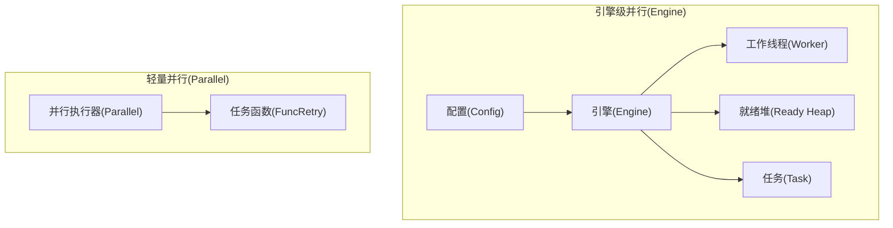
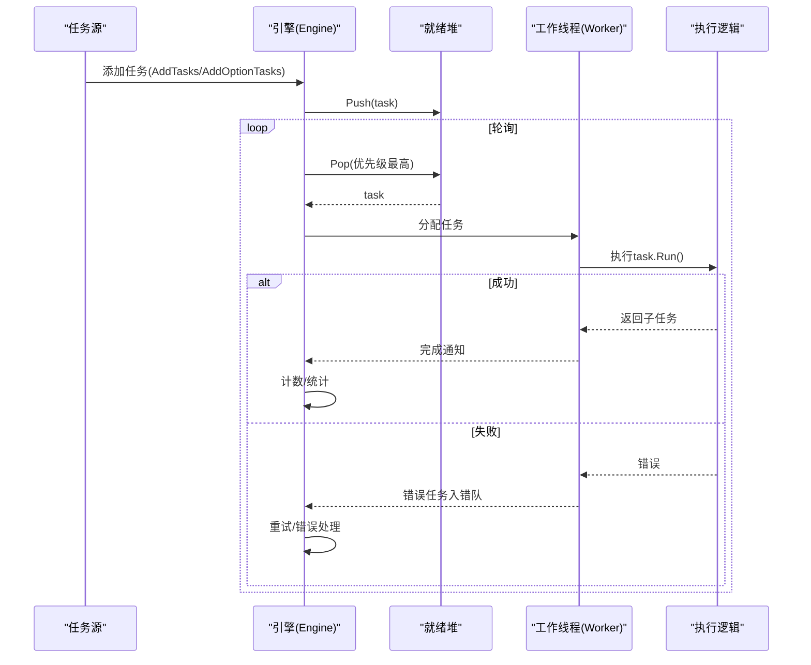
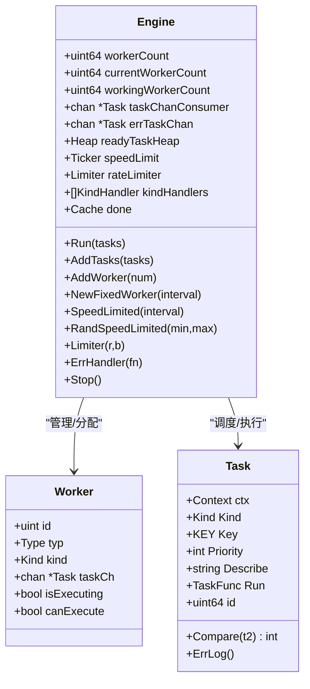
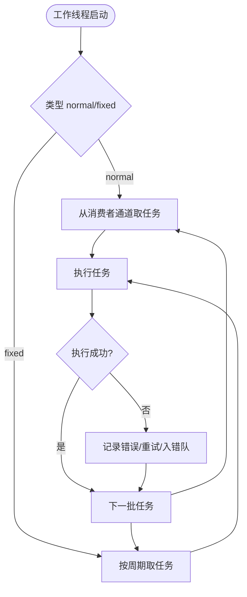
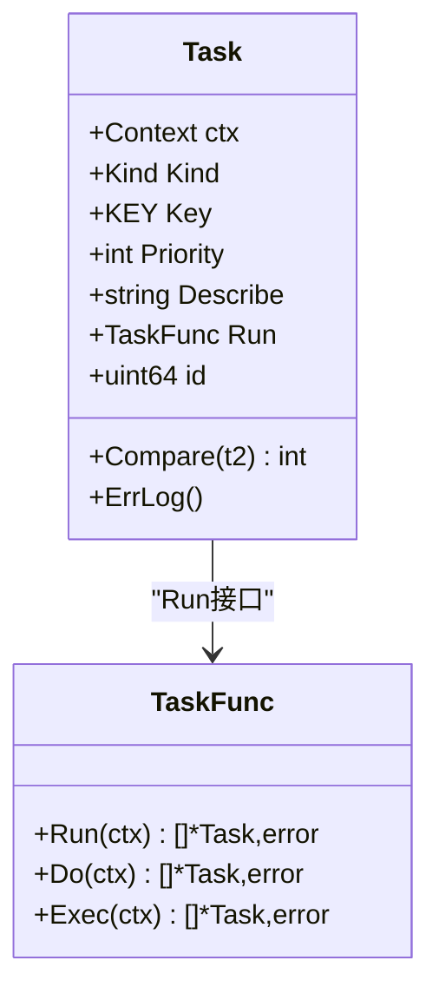
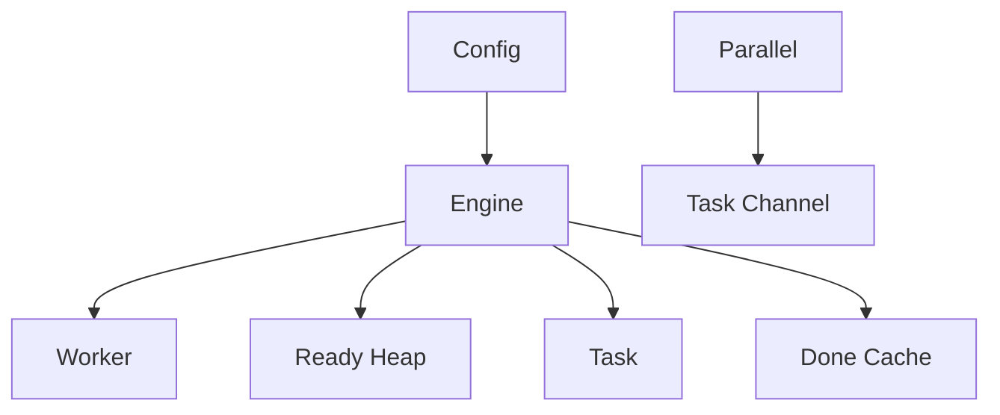

# 并行执行

<cite>
**本文档引用的文件**
- [engine.go](file://thirdparty/gox/scheduler/engine/engine.go)
- [conctrl.go](file://thirdparty/gox/scheduler/engine/conctrl.go)
- [woker.go](file://thirdparty/gox/scheduler/engine/woker.go)
- [task.go](file://thirdparty/gox/scheduler/engine/task.go)
- [config.go](file://thirdparty/gox/scheduler/engine/config.go)
- [parallel.go](file://thirdparty/gox/scheduler/parallel/parallel.go)
- [engine_test.go](file://thirdparty/gox/scheduler/engine/engine_test.go)
- [retry.go](file://thirdparty/gox/scheduler/retry/retry.go)
- [channel.go](file://awesome/lang/go/lang/runtime/goroutine/channel.go)
- [orderprint.go](file://awesome/lang/go/interview/orderprint.go)
</cite>

## 目录
1. [简介](#简介)
2. [项目结构](#项目结构)
3. [核心组件](#核心组件)
4. [架构总览](#架构总览)
5. [详细组件分析](#详细组件分析)
6. [依赖分析](#依赖分析)
7. [性能考量](#性能考量)
8. [故障排查指南](#故障排查指南)
9. [结论](#结论)
10. [附录](#附录)

## 简介
本文件面向并行执行能力，系统性梳理多工作线程的任务分配与执行机制，深入解析 Worker 的工作原理、任务分发策略与负载均衡算法，并文档化并行度控制、资源限制与性能调优配置。同时提供并发安全与数据竞争防护的关键技术点说明，以及最佳实践与优化建议。

## 项目结构
并行执行能力主要由两部分构成：
- 引擎级并行（Engine）：基于优先队列与工作线程池的通用任务执行引擎，支持动态扩缩容、速率限制、限流、错误处理与监控。
- 轻量并行（Parallel）：基于固定工作线程数的简单并行执行器，适用于轻量场景下的任务分发与回收。



**图表来源**
- [engine.go:30-56](file://thirdparty/gox/scheduler/engine/engine.go#L30-L56)
- [config.go:16-48](file://thirdparty/gox/scheduler/engine/config.go#L16-L48)
- [woker.go:20-28](file://thirdparty/gox/scheduler/engine/woker.go#L20-L28)
- [task.go:46-60](file://thirdparty/gox/scheduler/engine/task.go#L46-L60)
- [parallel.go:17-20](file://thirdparty/gox/scheduler/parallel/parallel.go#L17-L20)

**章节来源**
- [engine.go:30-56](file://thirdparty/gox/scheduler/engine/engine.go#L30-L56)
- [config.go:16-48](file://thirdparty/gox/scheduler/engine/config.go#L16-L48)
- [parallel.go:17-20](file://thirdparty/gox/scheduler/parallel/parallel.go#L17-L20)

## 核心组件
- 引擎（Engine）：负责任务调度、工作线程管理、错误处理、限速与限流、监控与统计。
- 工作线程（Worker）：执行具体任务的协程抽象，支持普通与固定间隔两类。
- 任务（Task）：可执行单元，支持优先级、键去重、超时与重试日志。
- 配置（Config）：并行度、监控间隔、完成缓存等默认与可选参数。
- 轻量并行（Parallel）：固定工作线程数的并行执行器，适合简单场景。

**章节来源**
- [engine.go:30-56](file://thirdparty/gox/scheduler/engine/engine.go#L30-L56)
- [woker.go:20-28](file://thirdparty/gox/scheduler/engine/woker.go#L20-L28)
- [task.go:46-60](file://thirdparty/gox/scheduler/engine/task.go#L46-L60)
- [config.go:16-48](file://thirdparty/gox/scheduler/engine/config.go#L16-L48)
- [parallel.go:17-20](file://thirdparty/gox/scheduler/parallel/parallel.go#L17-L20)

## 架构总览
引擎采用“优先队列 + 工作线程池”的架构。任务进入就绪堆，按优先级出队；工作线程从消费者通道拉取任务执行；支持动态创建工作线程以应对积压；支持速率限制与限流；错误任务进入错误处理通道；支持固定间隔工作线程。



**图表来源**
- [engine.go:174-194](file://thirdparty/gox/scheduler/engine/engine.go#L174-L194)
- [conctrl.go:110-140](file://thirdparty/gox/scheduler/engine/conctrl.go#L110-L140)
- [conctrl.go:283-292](file://thirdparty/gox/scheduler/engine/conctrl.go#L283-L292)
- [conctrl.go:342-380](file://thirdparty/gox/scheduler/engine/conctrl.go#L342-L380)

**章节来源**
- [engine.go:174-194](file://thirdparty/gox/scheduler/engine/engine.go#L174-L194)
- [conctrl.go:110-140](file://thirdparty/gox/scheduler/engine/conctrl.go#L110-L140)
- [conctrl.go:283-292](file://thirdparty/gox/scheduler/engine/conctrl.go#L283-L292)
- [conctrl.go:342-380](file://thirdparty/gox/scheduler/engine/conctrl.go#L342-L380)

## 详细组件分析

### 引擎（Engine）
- 角色与职责
  - 维护工作线程池与消费者通道，协调任务入队与出队。
  - 提供限速（全局/按类型）、限流（全局/按类型）、错误处理策略。
  - 支持动态扩缩容：当积压任务超过当前工作线程数时创建新工作线程；工作线程异常恢复。
  - 提供监控与统计：执行计数、跳过计数、失败计数、错误次数等。
- 关键字段
  - workerCount/currentWorkerCount/workingWorkerCount：目标/当前/正在执行工作线程数。
  - taskChanConsumer/errTaskChan：任务与错误任务通道。
  - readyTaskHeap：按优先级组织的就绪任务堆。
  - speedLimit/rateLimiter：全局限速与限流。
  - kindHandlers：按任务类型定制的限速/限流/跳过策略。
  - done：已完成任务键缓存，避免重复执行。
- 关键方法
  - Run/TaskSource：启动执行与任务源注册。
  - AddTasks/AddOptionTasks：添加任务（带上下文与优先级）。
  - AddWorker/NewFixedWorker：动态增减工作线程与固定间隔工作线程。
  - SpeedLimited/RandSpeedLimited/KindSpeedLimit/KindRandSpeedLimit：限速配置。
  - Limiter/KindLimiter：限流配置。
  - ErrHandler/ErrHandlerUtilSuccess/ErrHandlerRetryTimes/ErrHandlerWriteToFile：错误处理策略。
  - Stop/StopAfter：停止执行与延时停止。



**图表来源**
- [engine.go:30-56](file://thirdparty/gox/scheduler/engine/engine.go#L30-L56)
- [woker.go:20-28](file://thirdparty/gox/scheduler/engine/woker.go#L20-L28)
- [task.go:46-60](file://thirdparty/gox/scheduler/engine/task.go#L46-L60)

**章节来源**
- [engine.go:30-56](file://thirdparty/gox/scheduler/engine/engine.go#L30-L56)
- [engine.go:109-162](file://thirdparty/gox/scheduler/engine/engine.go#L109-L162)
- [engine.go:208-230](file://thirdparty/gox/scheduler/engine/engine.go#L208-L230)
- [engine.go:235-242](file://thirdparty/gox/scheduler/engine/engine.go#L235-L242)

### 工作线程（Worker）
- 类型
  - normalType：普通工作线程，从消费者通道取任务。
  - fixedType：固定间隔工作线程，按设定周期取任务执行。
- 字段
  - id/typ/kind：标识与类型。
  - taskCh：固定工作线程专用任务通道。
  - isExecuting/canExecute：执行状态与可执行标志。
- 行为
  - 普通工作线程：在生命周期内持续从消费者通道取任务，异常时自恢复并创建新工作线程。
  - 固定间隔工作线程：按周期等待后执行任务，异常时自恢复并重建定时器。



**图表来源**
- [conctrl.go:110-140](file://thirdparty/gox/scheduler/engine/conctrl.go#L110-L140)
- [conctrl.go:222-247](file://thirdparty/gox/scheduler/engine/conctrl.go#L222-L247)

**章节来源**
- [woker.go:13-28](file://thirdparty/gox/scheduler/engine/woker.go#L13-L28)
- [conctrl.go:110-140](file://thirdparty/gox/scheduler/engine/conctrl.go#L110-L140)
- [conctrl.go:222-247](file://thirdparty/gox/scheduler/engine/conctrl.go#L222-L247)

### 任务（Task）
- 字段
  - ctx/Kind/Key/Priority/Describe：上下文、类型、键、优先级、描述。
  - Run：执行函数，返回子任务与错误。
  - id/createdAt/execLog/deadline/timeout：唯一标识、创建时间、执行日志、截止时间与超时常量。
  - reExecLogs/reExecTimes/errTimes：重试日志、重试次数、错误次数。
- 方法
  - SetContext/SetPriority/SetKind/SetKey/SetDescribe：配置任务属性。
  - Compare：按优先级比较。
  - ErrLog：输出错误日志。
  - TaskRun/TasDo/TasExec 接口适配：统一执行入口。



**图表来源**
- [task.go:46-60](file://thirdparty/gox/scheduler/engine/task.go#L46-L60)
- [task.go:129-162](file://thirdparty/gox/scheduler/engine/task.go#L129-L162)

**章节来源**
- [task.go:46-60](file://thirdparty/gox/scheduler/engine/task.go#L46-L60)
- [task.go:68-95](file://thirdparty/gox/scheduler/engine/task.go#L68-L95)
- [task.go:97-110](file://thirdparty/gox/scheduler/engine/task.go#L97-L110)
- [task.go:129-162](file://thirdparty/gox/scheduler/engine/task.go#L129-L162)

### 配置（Config）
- 默认参数
  - WorkerCount：默认10。
  - MonitorInterval：默认5秒。
  - DoneCache：完成键缓存配置（NumCounters/MaxCost/BufferItems/Metrics/IgnoreInternalCost）。
- 初始化
  - NewEngine/NewEngineWithContext：创建引擎实例并初始化内部结构。
  - Init：补齐默认值。

**章节来源**
- [config.go:16-21](file://thirdparty/gox/scheduler/engine/config.go#L16-L21)
- [config.go:27-48](file://thirdparty/gox/scheduler/engine/config.go#L27-L48)
- [config.go:51-67](file://thirdparty/gox/scheduler/engine/config.go#L51-L67)
- [config.go:70-86](file://thirdparty/gox/scheduler/engine/config.go#L70-L86)

### 轻量并行（Parallel）
- 设计目标
  - 固定工作线程数，使用带缓冲通道承载任务，简化并发模型。
- 关键点
  - New：创建固定数量的工作协程，每个协程从任务通道消费并执行。
  - AddFunc/AddTask：增加任务并等待完成。
  - Wait/Stop：等待全部任务完成并关闭通道。
  - TaskChain：支持任务链式执行与失败回滚。

```mermaid
sequenceDiagram
participant APP as "应用"
participant PAR as "Parallel"
participant G as "工作协程"
participant CH as "任务通道"
APP->>PAR : New(workNum)
PAR->>G : 启动workNum个工作协程
APP->>PAR : AddFunc/AddTask
PAR->>CH : 发送任务
loop 消费
G->>CH : 取任务
G->>G : 执行任务.Do(times)
G-->>PAR : wg.Done()
end
APP->>PAR : Wait/Stop
```

**图表来源**
- [parallel.go:22-43](file://thirdparty/gox/scheduler/parallel/parallel.go#L22-L43)
- [parallel.go:45-62](file://thirdparty/gox/scheduler/parallel/parallel.go#L45-L62)
- [parallel.go:68-78](file://thirdparty/gox/scheduler/parallel/parallel.go#L68-L78)

**章节来源**
- [parallel.go:17-20](file://thirdparty/gox/scheduler/parallel/parallel.go#L17-L20)
- [parallel.go:22-43](file://thirdparty/gox/scheduler/parallel/parallel.go#L22-L43)
- [parallel.go:45-62](file://thirdparty/gox/scheduler/parallel/parallel.go#L45-L62)
- [parallel.go:68-78](file://thirdparty/gox/scheduler/parallel/parallel.go#L68-L78)

## 依赖分析
- 组件耦合
  - Engine 与 Worker：引擎管理与调度工作线程，二者强耦合。
  - Engine 与 Task：引擎负责任务入队、执行与错误处理。
  - Engine 与 Config：引擎由配置初始化，配置决定默认行为。
  - Parallel 与 Channel：并行器依赖通道进行任务分发。
- 外部依赖
  - 优先队列：基于堆实现的优先级调度。
  - 限速/限流：基于时间轮与令牌桶。
  - 缓存：基于 ristretto 的完成键缓存。



**图表来源**
- [config.go:27-48](file://thirdparty/gox/scheduler/engine/config.go#L27-L48)
- [engine.go:30-56](file://thirdparty/gox/scheduler/engine/engine.go#L30-L56)
- [parallel.go:18-19](file://thirdparty/gox/scheduler/parallel/parallel.go#L18-L19)

**章节来源**
- [engine.go:30-56](file://thirdparty/gox/scheduler/engine/engine.go#L30-L56)
- [config.go:27-48](file://thirdparty/gox/scheduler/engine/config.go#L27-L48)
- [parallel.go:18-19](file://thirdparty/gox/scheduler/parallel/parallel.go#L18-L19)

## 性能考量
- 并行度控制
  - 使用 AddWorker 动态调整工作线程数，结合 Ready Heap 积压判断，避免过度创建。
  - NewFixedWorker 与固定间隔可平滑吞吐，降低突发压力。
- 资源限制
  - 限速：SpeedLimited/RandSpeedLimited/KindSpeedLimit/KindRandSpeedLimit 控制执行频率。
  - 限流：Limiter/KindLimiter 控制并发速率，避免下游过载。
  - 完成键缓存：Done Cache 避免重复执行，减少无效开销。
- 负载均衡
  - 优先队列：按优先级出队，兼顾紧急任务。
  - 任务链回滚：TaskChain 在失败时回退到未执行阶段，提高稳定性。
- 并发安全
  - 通道：任务与错误通道均为无阻塞/带缓冲设计，配合 WaitGroup 控制生命周期。
  - 原子计数：工作线程数、执行中线程数等使用原子操作。
  - 互斥保护：关键路径使用 RWMutex 保护共享状态。
- 性能优化建议
  - 合理设置 WorkerCount：根据 CPU 核心数与 I/O 特性调整。
  - 优先级策略：将紧急任务设置更高优先级，缩短等待时间。
  - 限速/限流：结合下游能力设置合理上限，避免拥塞。
  - 错误处理：使用 ErrHandlerRetryTimes 与 ErrHandlerUtilSuccess 减少失败重试成本。
  - 固定间隔：对周期性任务使用 NewFixedWorker，降低抖动。

**章节来源**
- [engine.go:154-206](file://thirdparty/gox/scheduler/engine/engine.go#L154-L206)
- [engine.go:208-230](file://thirdparty/gox/scheduler/engine/engine.go#L208-L230)
- [conctrl.go:144-172](file://thirdparty/gox/scheduler/engine/conctrl.go#L144-L172)
- [conctrl.go:283-292](file://thirdparty/gox/scheduler/engine/conctrl.go#L283-L292)
- [parallel.go:45-62](file://thirdparty/gox/scheduler/parallel/parallel.go#L45-L62)

## 故障排查指南
- 常见问题
  - 任务长时间未执行：检查 Ready Heap 是否积压、工作线程是否达到上限、是否存在限速/限流。
  - 任务重复执行：确认 Done Cache 是否生效、Key 是否正确、是否被清理。
  - 错误处理未触发：检查 ErrHandler 设置、错误通道是否阻塞。
  - 工作线程异常退出：引擎会自动创建新工作线程，但需关注错误日志。
- 排查步骤
  - 查看统计：执行计数、跳过计数、失败计数、错误次数。
  - 检查通道：任务通道与错误通道是否阻塞。
  - 核对配置：WorkerCount、MonitorInterval、限速/限流参数。
  - 复现最小用例：参考测试用例，逐步缩小问题范围。

**章节来源**
- [engine.go:109-162](file://thirdparty/gox/scheduler/engine/engine.go#L109-L162)
- [engine.go:149-152](file://thirdparty/gox/scheduler/engine/engine.go#L149-L152)
- [conctrl.go:382-408](file://thirdparty/gox/scheduler/engine/conctrl.go#L382-L408)
- [engine_test.go:20-25](file://thirdparty/gox/scheduler/engine/engine_test.go#L20-L25)

## 结论
该并行执行体系通过“引擎 + 工作线程 + 优先队列”的组合，提供了高可用、可扩展、可配置的并行执行能力。引擎支持动态扩缩容、限速/限流、错误处理与监控，适合复杂业务场景；轻量并行器则满足简单场景下的快速并行需求。通过合理的配置与最佳实践，可在保证稳定性的同时最大化吞吐与效率。

## 附录
- 并发基础
  - 通道与 CSP：协程间通过通道通信，避免共享内存带来的数据竞争。
  - 顺序执行与并发：通过通道与 WaitGroup 协调生命周期，确保有序与并发并存。
- 示例参考
  - 测试用例展示了任务源、限速与并发运行的基本用法。

**章节来源**
- [channel.go:8-15](file://awesome/lang/go/lang/runtime/goroutine/channel.go#L8-L15)
- [orderprint.go:8-19](file://awesome/lang/go/interview/orderprint.go#L8-L19)
- [engine_test.go:20-25](file://thirdparty/gox/scheduler/engine/engine_test.go#L20-L25)
- [engine_test.go:59-73](file://thirdparty/gox/scheduler/engine/engine_test.go#L59-L73)
- [engine_test.go:89-95](file://thirdparty/gox/scheduler/engine/engine_test.go#L89-L95)