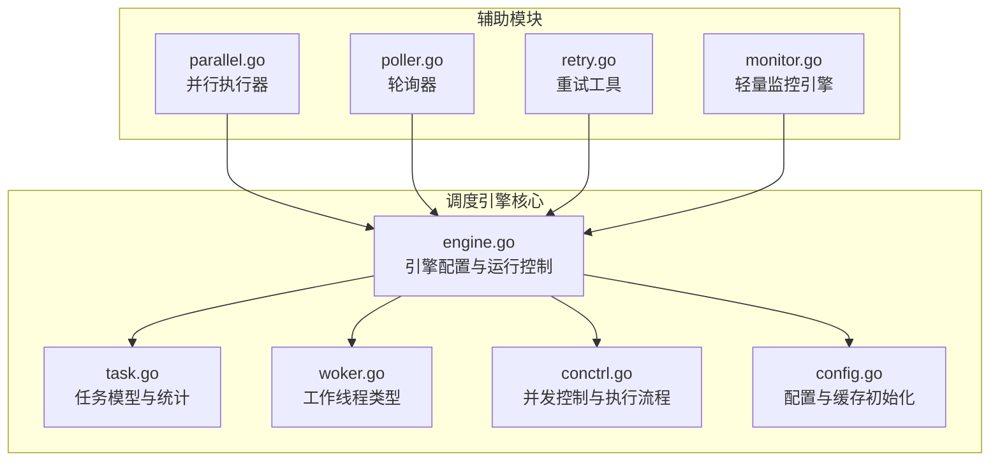
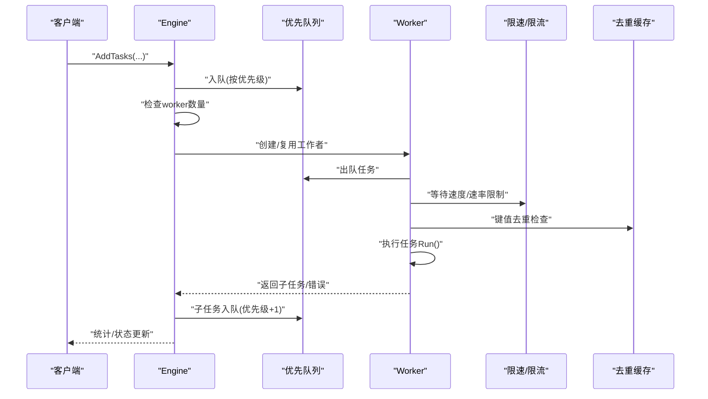
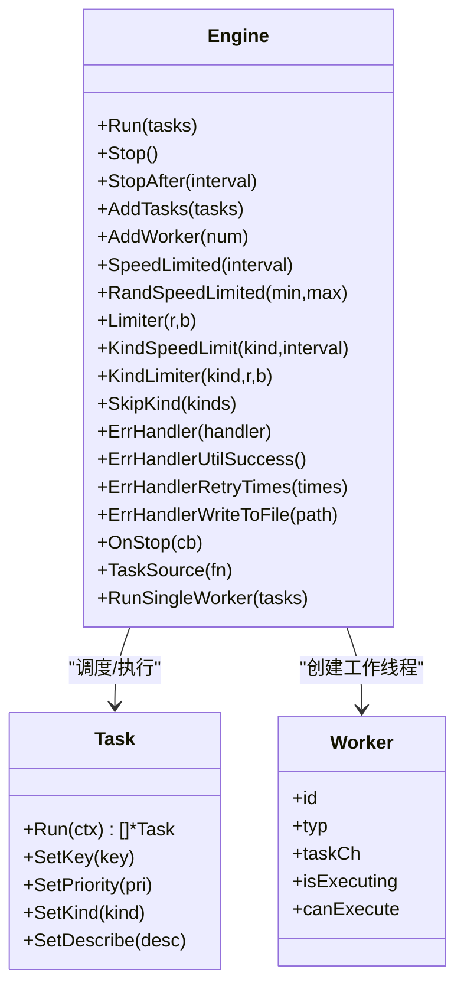
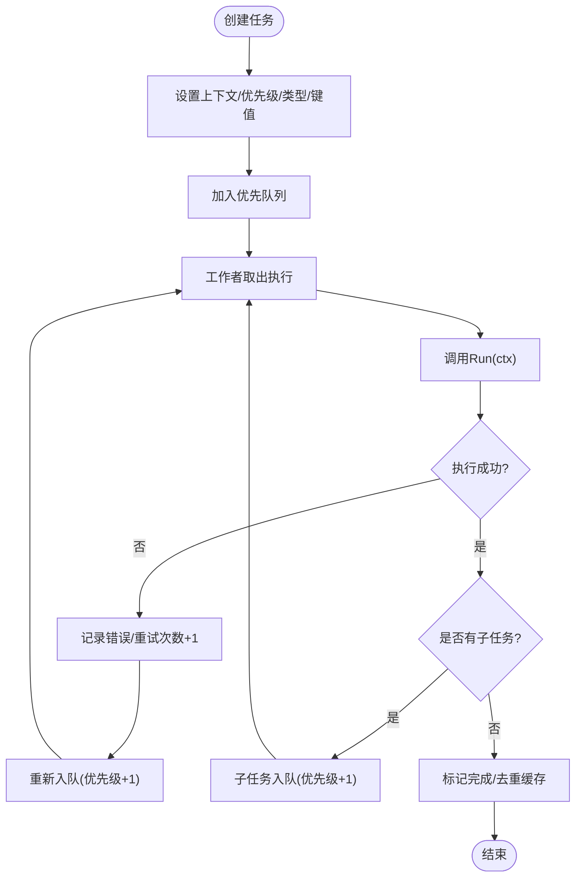
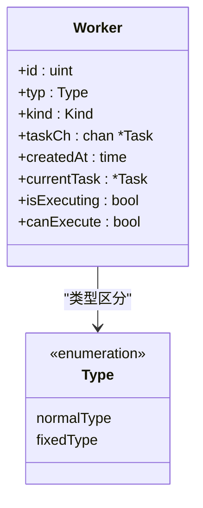
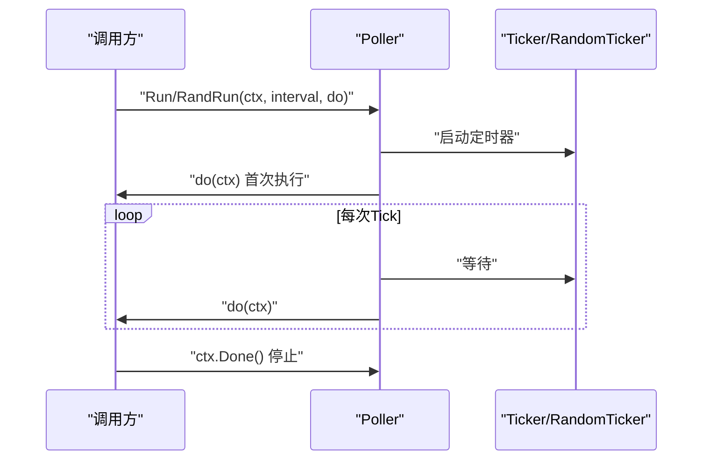
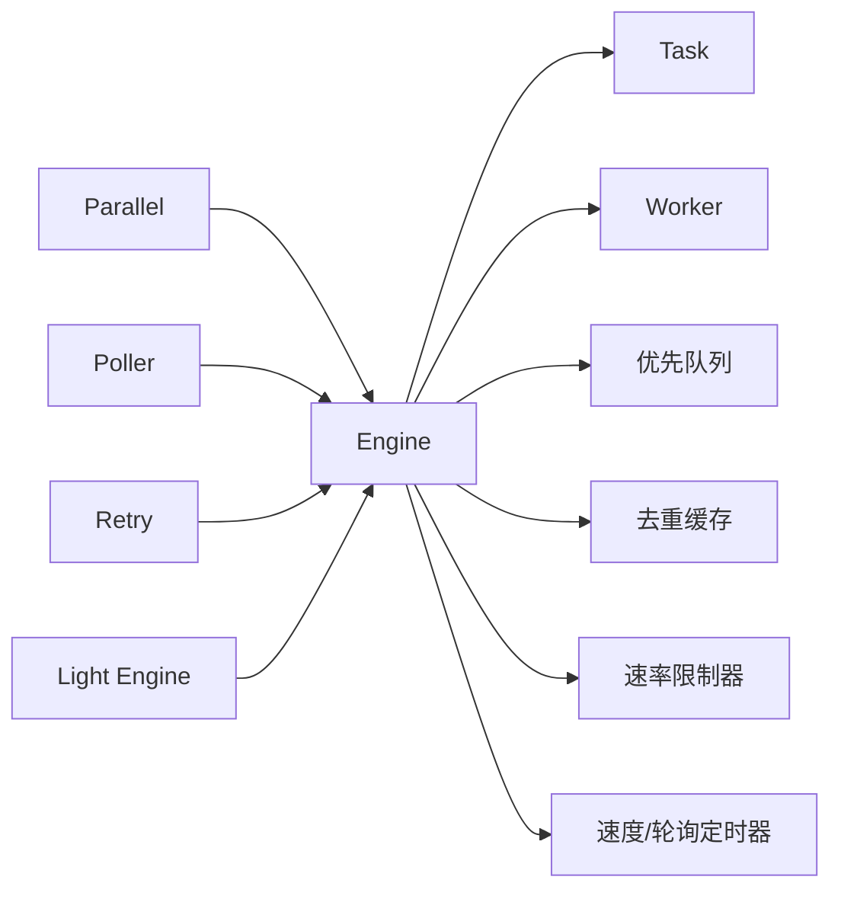

# 调度引擎

<cite>
**本文引用的文件**
- [engine.go](file://thirdparty/gox/scheduler/engine/engine.go)
- [task.go](file://thirdparty/gox/scheduler/engine/task.go)
- [woker.go](file://thirdparty/gox/scheduler/engine/woker.go)
- [conctrl.go](file://thirdparty/gox/scheduler/engine/conctrl.go)
- [config.go](file://thirdparty/gox/scheduler/engine/config.go)
- [parallel.go](file://thirdparty/gox/scheduler/parallel/parallel.go)
- [poller.go](file://thirdparty/gox/scheduler/poller/poller.go)
- [retry.go](file://thirdparty/gox/scheduler/retry/retry.go)
- [monitor.go](file://thirdparty/gox/scheduler/light/monitor.go)
- [engine_test.go](file://thirdparty/gox/scheduler/engine/engine_test.go)
- [关于任务调度Task的三种实现.md](file://thirdparty/gox/scheduler/关于任务调度Task的三种实现.md)
</cite>

## 目录
1. [简介](#简介)
2. [项目结构](#项目结构)
3. [核心组件](#核心组件)
4. [架构总览](#架构总览)
5. [详细组件分析](#详细组件分析)
6. [依赖分析](#依赖分析)
7. [性能考量](#性能考量)
8. [故障排查指南](#故障排查指南)
9. [结论](#结论)
10. [附录](#附录)

## 简介
本文件为调度引擎模块的详细API文档，覆盖任务调度、并发执行、轮询机制、任务队列管理、负载均衡策略、并行执行与任务池管理、资源限制、定时/周期性/异步任务处理、性能监控、故障恢复与优雅停机等主题。内容基于仓库中第三方库 gox/scheduler 下的引擎实现进行整理与说明，帮助开发者正确使用与扩展调度能力。

## 项目结构
调度引擎位于 thirdparty/gox/scheduler 目录下，核心代码集中在 engine 子包，同时提供 parallel（并行）、poller（轮询）、retry（重试）与 light（轻量引擎）等辅助模块。



**图表来源**
- [engine.go:1-242](file://thirdparty/gox/scheduler/engine/engine.go#L1-L242)
- [task.go:1-166](file://thirdparty/gox/scheduler/engine/task.go#L1-L166)
- [woker.go:1-41](file://thirdparty/gox/scheduler/engine/woker.go#L1-L41)
- [conctrl.go:1-409](file://thirdparty/gox/scheduler/engine/conctrl.go#L1-L409)
- [config.go:1-89](file://thirdparty/gox/scheduler/engine/config.go#L1-L89)
- [parallel.go:1-79](file://thirdparty/gox/scheduler/parallel/parallel.go#L1-L79)
- [poller.go:1-93](file://thirdparty/gox/scheduler/poller/poller.go#L1-L93)
- [retry.go:1-31](file://thirdparty/gox/scheduler/retry/retry.go#L1-L31)
- [monitor.go:1-77](file://thirdparty/gox/scheduler/light/monitor.go#L1-L77)

**章节来源**
- [engine.go:1-242](file://thirdparty/gox/scheduler/engine/engine.go#L1-L242)
- [config.go:1-89](file://thirdparty/gox/scheduler/engine/config.go#L1-L89)

## 核心组件
- 引擎 Engine：负责任务调度、并发控制、限速与限流、错误处理、优雅停机、统计与监控。
- 任务 Task：封装执行函数、优先级、键值去重、超时与重试记录等。
- 工作者 Worker：普通工作者与固定间隔工作者两类，承载任务执行。
- 并行执行器 Parallel：面向函数级的并行执行器，支持重试接口。
- 轮询器 Poller：周期性触发任务执行，支持固定与随机间隔。
- 重试工具 Retry：提供按次数或条件的重试执行。
- 轻量监控引擎 Light Engine：轻量的任务链式执行与停止回调。

**章节来源**
- [engine.go:30-56](file://thirdparty/gox/scheduler/engine/engine.go#L30-L56)
- [task.go:46-60](file://thirdparty/gox/scheduler/engine/task.go#L46-L60)
- [woker.go:20-28](file://thirdparty/gox/scheduler/engine/woker.go#L20-L28)
- [parallel.go:17-43](file://thirdparty/gox/scheduler/parallel/parallel.go#L17-L43)
- [poller.go:18-60](file://thirdparty/gox/scheduler/poller/poller.go#L18-L60)
- [retry.go:11-30](file://thirdparty/gox/scheduler/retry/retry.go#L11-L30)
- [monitor.go:14-31](file://thirdparty/gox/scheduler/light/monitor.go#L14-L31)

## 架构总览
调度引擎采用“生产者-消费者”模型：外部通过 AddTasks/AddOptionTasks 添加任务到优先队列；引擎内部根据 workerCount 动态创建工作者，从队列取出任务执行；执行过程中支持速率限制、速度限制、键值去重、错误重试与错误处理通道。



**图表来源**
- [conctrl.go:21-108](file://thirdparty/gox/scheduler/engine/conctrl.go#L21-L108)
- [conctrl.go:283-380](file://thirdparty/gox/scheduler/engine/conctrl.go#L283-L380)
- [engine.go:30-56](file://thirdparty/gox/scheduler/engine/engine.go#L30-L56)

## 详细组件分析

### 引擎 Engine API
- 构造与配置
  - New/ NewEngine/ NewEngineWithContext：创建带默认配置的引擎实例。
  - 配置项：WorkerCount、MonitorInterval、DoneCache、EnableTelemetry。
- 运行与停止
  - Run(tasks...)：启动引擎并消费任务；内部启动错误处理协程、工作线程工厂与监控循环。
  - Stop()/ StopAfter(interval)：优雅停机，关闭限速器、缓存与回调。
- 任务管理
  - AddTasks/AddOptionTasks：批量添加任务，自动分配ID、上下文与优先级。
  - TaskSource：注册任务源函数，直到该函数退出才判定任务源结束。
  - RunSingleWorker：单线程模式运行。
- 并发与限速
  - AddWorker：动态增加工作者上限。
  - SpeedLimited/RandSpeedLimited：全局速度限制。
  - Limiter：全局令牌桶限流。
  - KindSpeedLimit/KindRandSpeedLimit/KindLimiter：按任务类型维度的限速与限流。
  - KindGroupSpeedLimit/KindGroupRandSpeedLimit：一组类型的统一限速。
  - SkipKind：跳过特定类型任务。
- 错误处理
  - ErrHandler：自定义错误处理回调。
  - ErrHandlerUtilSuccess：错误时清空历史日志并重试。
  - ErrHandlerRetryTimes：限定最大重试次数。
  - ErrHandlerWriteToFile：将失败任务写入文件。
  - OnStop：注册停机回调。
- 统计与监控
  - MonitorInterval：设置监控周期（最小1秒）。
  - 内置统计：任务总数、完成数、跳过数、错误处理数、失败数、错误次数等。



**图表来源**
- [engine.go:66-242](file://thirdparty/gox/scheduler/engine/engine.go#L66-L242)
- [task.go:46-95](file://thirdparty/gox/scheduler/engine/task.go#L46-L95)
- [woker.go:20-28](file://thirdparty/gox/scheduler/engine/woker.go#L20-L28)

**章节来源**
- [engine.go:66-242](file://thirdparty/gox/scheduler/engine/engine.go#L66-L242)
- [config.go:16-89](file://thirdparty/gox/scheduler/engine/config.go#L16-L89)

### 任务 Task API
- 结构字段：上下文、类型、键值、优先级、描述、统计、执行函数、ID、创建时间、执行日志、截止时间与超时。
- 辅助方法：设置上下文、优先级、类型、键值、描述；获取ID；比较优先级；收集错误日志；错误输出。
- 接口族：TaskRun/Do/Exec 均委托到 Run 函数，便于兼容不同风格的执行器。



**图表来源**
- [task.go:46-166](file://thirdparty/gox/scheduler/engine/task.go#L46-L166)
- [conctrl.go:294-380](file://thirdparty/gox/scheduler/engine/conctrl.go#L294-L380)

**章节来源**
- [task.go:46-166](file://thirdparty/gox/scheduler/engine/task.go#L46-L166)

### 工作者 Worker 类型
- 普通工作者：从共享消费者通道接收任务，动态创建以达到上限。
- 固定间隔工作者：通过固定间隔定时器拉取任务，适合周期性任务。
- 统一统计：执行中计数、当前任务指针、可否执行标志。



**图表来源**
- [woker.go:13-28](file://thirdparty/gox/scheduler/engine/woker.go#L13-L28)

**章节来源**
- [woker.go:13-28](file://thirdparty/gox/scheduler/engine/woker.go#L13-L28)
- [conctrl.go:214-276](file://thirdparty/gox/scheduler/engine/conctrl.go#L214-L276)

### 并行执行器 Parallel
- 支持将实现了 Retrier 接口的任务或函数放入通道，由多个工作协程并发执行。
- 提供 AddFunc/AddTask、Wait、Stop 等方法，便于在任务执行器中集成。

```mermaid
sequenceDiagram
participant Caller as "调用方"
participant Par as "Parallel"
participant W1 as "Worker#1"
participant Wn as "Worker#N"
Caller->>Par : "AddTask/ AddFunc"
Par->>W1 : "投递任务"
Par->>Wn : "投递任务"
W1-->>Par : "执行完成/继续重试"
Wn-->>Par : "执行完成/继续重试"
Caller->>Par : "Wait/Stop"
```

**图表来源**
- [parallel.go:22-62](file://thirdparty/gox/scheduler/parallel/parallel.go#L22-L62)

**章节来源**
- [parallel.go:17-79](file://thirdparty/gox/scheduler/parallel/parallel.go#L17-L79)

### 轮询器 Poller
- 提供固定间隔与随机间隔的周期性执行，支持上下文取消。
- 适用于定时任务、心跳、周期性扫描等场景。



**图表来源**
- [poller.go:30-92](file://thirdparty/gox/scheduler/poller/poller.go#L30-L92)

**章节来源**
- [poller.go:18-93](file://thirdparty/gox/scheduler/poller/poller.go#L18-L93)

### 重试工具 Retry
- RunTimes：按固定次数尝试，聚合错误。
- Run：按条件持续尝试，直到返回false。

**章节来源**
- [retry.go:11-31](file://thirdparty/gox/scheduler/retry/retry.go#L11-L31)

### 轻量监控引擎 Light Engine
- 轻量级任务链式执行，原子计数保证全部完成后触发 onStop。
- 适合短生命周期、无复杂队列的场景。

**章节来源**
- [monitor.go:14-77](file://thirdparty/gox/scheduler/light/monitor.go#L14-L77)

## 依赖分析
- 引擎依赖
  - 优先队列：用于任务排序与出队。
  - ristretto 缓存：键值去重，避免重复执行。
  - 速率限制器：全局与按类型限流。
  - 时间轮/随机定时器：速度限制与轮询。
  - 日志与堆栈捕获：错误恢复与诊断。
- 模块耦合
  - engine 与 task/woker 高内聚，通过通道与优先队列解耦。
  - parallel/poller/retry 作为独立工具模块，可被引擎或业务直接使用。



**图表来源**
- [engine.go:30-56](file://thirdparty/gox/scheduler/engine/engine.go#L30-L56)
- [conctrl.go:21-108](file://thirdparty/gox/scheduler/engine/conctrl.go#L21-L108)
- [parallel.go:17-43](file://thirdparty/gox/scheduler/parallel/parallel.go#L17-L43)
- [poller.go:18-60](file://thirdparty/gox/scheduler/poller/poller.go#L18-L60)
- [retry.go:11-31](file://thirdparty/gox/scheduler/retry/retry.go#L11-L31)
- [monitor.go:14-31](file://thirdparty/gox/scheduler/light/monitor.go#L14-L31)

**章节来源**
- [engine.go:9-23](file://thirdparty/gox/scheduler/engine/engine.go#L9-L23)
- [config.go:9-14](file://thirdparty/gox/scheduler/engine/config.go#L9-L14)

## 性能考量
- 任务队列与优先级
  - 使用优先队列确保高优先级任务优先执行，降低尾延迟。
- 并发与限速
  - 通过 workerCount 控制并发度；结合速度限制与令牌桶限流，避免资源过载。
- 去重缓存
  - 使用 ristretto 缓存对 Key 去重，减少重复执行开销。
- 错误重试与退避
  - 失败任务自动重试并提高优先级，配合错误处理回调与持久化，提升稳定性。
- 监控与可观测性
  - 定期打印运行状态，便于观察任务积压、执行耗时与失败率。

[本节为通用指导，无需具体文件引用]

## 故障排查指南
- 任务长时间未执行
  - 检查 workerCount 是否过低；确认速度限制/限流是否阻塞。
  - 查看监控日志中的“about to end”提示与空闲检测逻辑。
- 任务重复执行
  - 检查键值 Key 设置是否合理；确认去重缓存 TTL 与命中情况。
- 错误处理未生效
  - 确认 ErrHandler/ErrHandlerRetryTimes/ErrHandlerWriteToFile 的注册顺序与回调逻辑。
- 优雅停机异常
  - 确保 Stop/StopAfter 在合适时机调用；检查 OnStop 回调是否阻塞。
- 单元测试参考
  - 测试用例展示了任务源、并发运行、限流与重试的基本行为，可对照定位问题。

**章节来源**
- [engine_test.go:20-96](file://thirdparty/gox/scheduler/engine/engine_test.go#L20-L96)
- [conctrl.go:382-409](file://thirdparty/gox/scheduler/engine/conctrl.go#L382-L409)

## 结论
调度引擎提供了完善的任务调度、并发控制、限速限流、错误处理与优雅停机能力。通过优先队列、键值去重、类型化限速与统一错误处理，能够稳定支撑多种任务类型与高并发场景。并行执行器、轮询器与重试工具进一步增强了扩展性与易用性。建议在生产环境中结合监控与告警，合理配置并发度与限流参数，并通过单元测试验证关键路径。

[本节为总结，无需具体文件引用]

## 附录

### API 快速索引
- 引擎构造与配置
  - New/ NewEngine/ NewEngineWithContext
  - 配置项：WorkerCount、MonitorInterval、DoneCache、EnableTelemetry
- 运行与停止
  - Run/ Stop/ StopAfter/ RunSingleWorker
- 任务管理
  - AddTasks/ AddOptionTasks/ TaskSource
- 并发与限速
  - AddWorker/ SpeedLimited/ RandSpeedLimited/ Limiter
  - KindSpeedLimit/ KindRandSpeedLimit/ KindLimiter
  - KindGroupSpeedLimit/ KindGroupRandSpeedLimit/ SkipKind
- 错误处理
  - ErrHandler/ ErrHandlerUtilSuccess/ ErrHandlerRetryTimes/ ErrHandlerWriteToFile/ OnStop
- 统计与监控
  - MonitorInterval

**章节来源**
- [engine.go:66-242](file://thirdparty/gox/scheduler/engine/engine.go#L66-L242)
- [config.go:16-89](file://thirdparty/gox/scheduler/engine/config.go#L16-L89)

### 任务模型设计说明
- 仓库提供了三种任务模型设计思路的对比，最终采用泛型方式以获得更好的类型安全与可维护性。

**章节来源**
- [关于任务调度Task的三种实现.md:1-55](file://thirdparty/gox/scheduler/关于任务调度Task的三种实现.md#L1-L55)