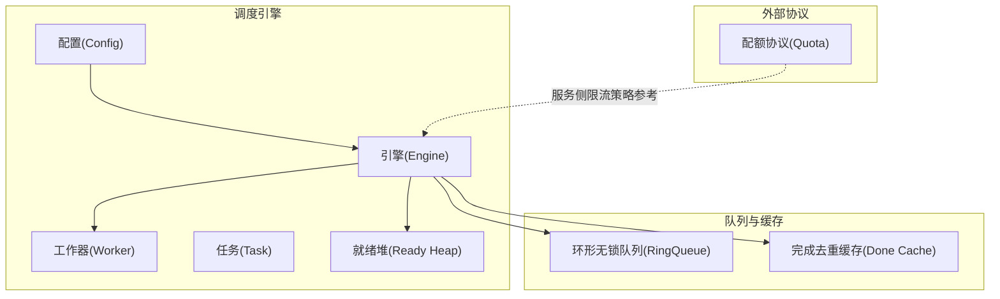
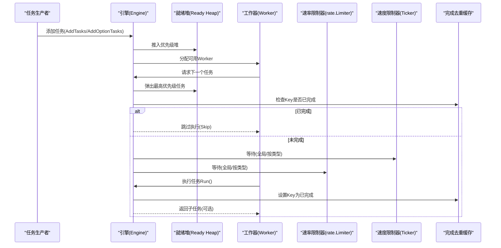
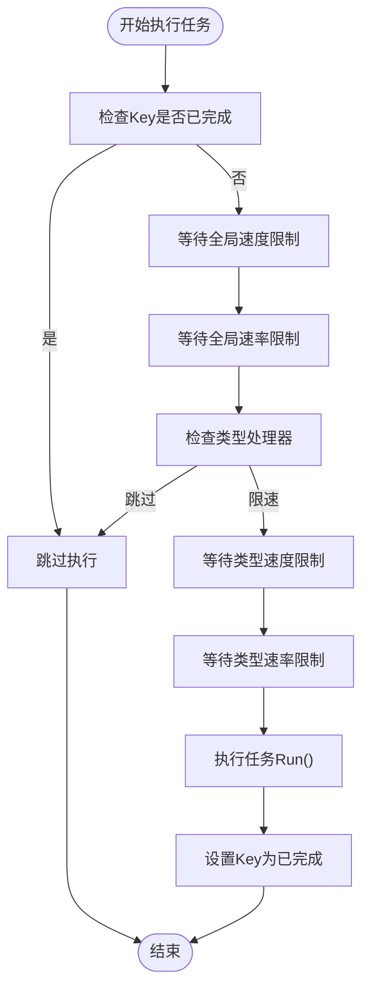
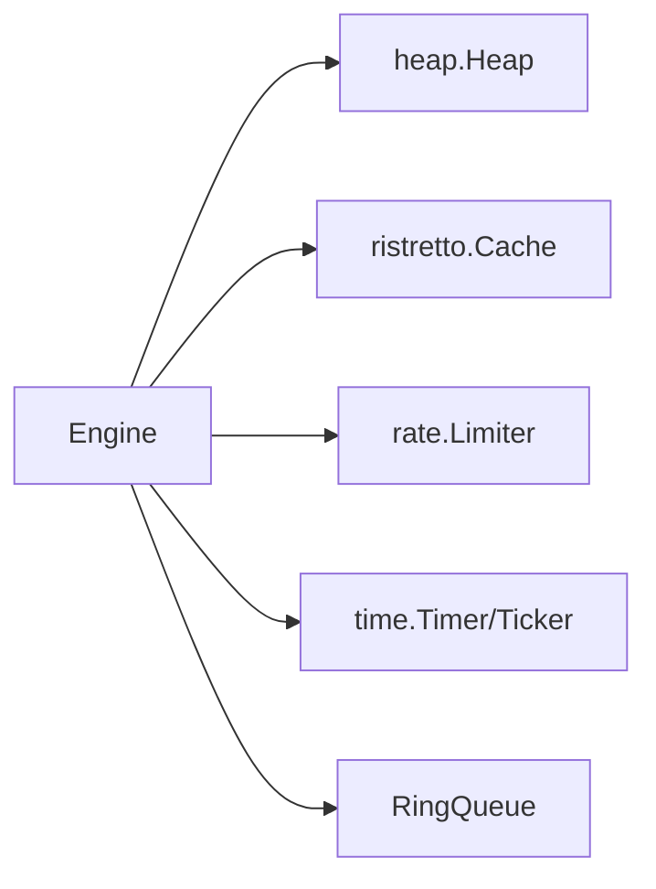

# 资源管理

<cite>
**本文档引用的文件**
- [engine.go](file://thirdparty/gox/scheduler/engine/engine.go)
- [config.go](file://thirdparty/gox/scheduler/engine/config.go)
- [conctrl.go](file://thirdparty/gox/scheduler/engine/conctrl.go)
- [task.go](file://thirdparty/gox/scheduler/engine/task.go)
- [woker.go](file://thirdparty/gox/scheduler/engine/woker.go)
- [ring_queue.go](file://thirdparty/gox/sync/queue/ringqueue/ring_queue.go)
- [quota.proto](file://thirdparty/protobuf/_proto/google/api/quota.proto)
- [config.toml](file://server/go/config/config.toml)
</cite>

## 目录
1. [简介](#简介)
2. [项目结构](#项目结构)
3. [核心组件](#核心组件)
4. [架构总览](#架构总览)
5. [详细组件分析](#详细组件分析)
6. [依赖关系分析](#依赖关系分析)
7. [性能考量](#性能考量)
8. [故障排查指南](#故障排查指南)
9. [结论](#结论)
10. [附录](#附录)

## 简介
本文件面向资源管理功能，围绕调度器的资源配置、内存管理、性能监控等机制进行系统化文档化。重点覆盖以下方面：
- Worker 数量控制、任务队列大小、缓存策略等关键参数
- 速率限制、流量控制、资源隔离等保护机制
- 资源使用监控、性能调优、容量规划等运维指南
- 优雅停机、故障恢复、系统保护等可靠性保障措施

## 项目结构
资源管理相关代码主要位于第三方库模块中，采用分层设计：
- 引擎层：负责任务调度、Worker 管理、监控与保护
- 配置层：提供默认配置与可选参数
- 队列层：提供高性能环形无锁队列
- 协议层：定义配额与限流相关协议（用于服务侧策略）



**图表来源**
- [engine.go:30-56](file://thirdparty/gox/scheduler/engine/engine.go#L30-L56)
- [config.go:16-49](file://thirdparty/gox/scheduler/engine/config.go#L16-L49)
- [ring_queue.go:18-43](file://thirdparty/gox/sync/queue/ringqueue/ring_queue.go#L18-L43)
- [quota.proto:25-61](file://thirdparty/protobuf/_proto/google/api/quota.proto#L25-L61)

**章节来源**
- [engine.go:1-242](file://thirdparty/gox/scheduler/engine/engine.go#L1-L242)
- [config.go:1-89](file://thirdparty/gox/scheduler/engine/config.go#L1-L89)
- [ring_queue.go:1-267](file://thirdparty/gox/sync/queue/ringqueue/ring_queue.go#L1-L267)
- [quota.proto:25-184](file://thirdparty/protobuf/_proto/google/api/quota.proto#L25-L184)

## 核心组件
- 引擎 Engine：统一的任务调度、Worker 管理、监控与保护中心
- 配置 Config：提供 Worker 数量、监控周期、完成去重缓存等初始化参数
- 任务 Task：封装执行函数、优先级、键值、描述等元信息
- 工作器 Worker：承载具体任务执行的 goroutine 角色
- 环形无锁队列 RingQueue：高并发下的高效任务通道
- 完成去重缓存 Done Cache：基于 ristretto 的键去重缓存

**章节来源**
- [engine.go:30-69](file://thirdparty/gox/scheduler/engine/engine.go#L30-L69)
- [config.go:16-89](file://thirdparty/gox/scheduler/engine/config.go#L16-L89)
- [task.go:46-60](file://thirdparty/gox/scheduler/engine/task.go#L46-L60)
- [woker.go:20-28](file://thirdparty/gox/scheduler/engine/woker.go#L20-L28)
- [ring_queue.go:18-43](file://thirdparty/gox/sync/queue/ringqueue/ring_queue.go#L18-L43)

## 架构总览
调度器采用“生产者-消费者”模型，结合优先级堆与环形队列，实现高吞吐与低延迟的任务执行；通过速率限制器与速度限制器实现流量控制与资源隔离；通过完成去重缓存避免重复执行。



**图表来源**
- [conctrl.go:283-380](file://thirdparty/gox/scheduler/engine/conctrl.go#L283-L380)
- [engine.go:208-230](file://thirdparty/gox/scheduler/engine/engine.go#L208-L230)
- [task.go:46-60](file://thirdparty/gox/scheduler/engine/task.go#L46-L60)

**章节来源**
- [conctrl.go:21-108](file://thirdparty/gox/scheduler/engine/conctrl.go#L21-L108)
- [engine.go:208-230](file://thirdparty/gox/scheduler/engine/engine.go#L208-L230)

## 详细组件分析

### 引擎 Engine 组件
- 职责
  - 统一调度：接收任务、分配 Worker、执行与回收
  - 保护机制：异常恢复、优雅停机、监控周期
  - 流量控制：全局与按类型的速率限制、速度限制
  - 资源隔离：按类型分组的限速与限流
- 关键字段
  - Worker 数量与当前/工作中 Worker 计数
  - 就绪任务堆、消费者通道、错误任务通道
  - 速率限制器、速度限制器、监控周期
  - 完成去重缓存、停止回调、统计计数
- 关键方法
  - Run/TaskSource：启动与任务源注册
  - AddTasks/AddOptionTasks：任务入队
  - Limiter/KindLimiter：全局与按类型限流
  - SpeedLimited/KindSpeedLimit：全局与按类型限速
  - Stop/StopAfter：优雅停机
  - SkipKind：按类型跳过执行

```mermaid
classDiagram
class Engine {
+uint64 workerCount
+uint64 currentWorkerCount
+uint64 workingWorkerCount
+chan Task taskChanConsumer
+chan Task errTaskChan
+Heap readyTaskHeap
+time.Duration monitorInterval
+Cache done
+Limiter rateLimiter
+Ticker speedLimit
+onStop callbacks
+Run(tasks)
+AddTasks(tasks)
+Limiter(r, b)
+KindLimiter(kind, r, b)
+SpeedLimited(interval)
+KindSpeedLimit(kind, interval)
+Stop()
}
class Worker {
+uint id
+Type typ
+Kind kind
+chan Task taskCh
+bool isExecuting
+bool canExecute
}
class Task {
+Kind Kind
+KEY Key
+int Priority
+string Describe
+TaskFunc Run
+uint64 id
+time.Time createdAt
+ErrLog()
}
Engine --> Worker : "管理/分配"
Engine --> Task : "调度执行"
Engine --> "Cache" : "完成去重"
```

**图表来源**
- [engine.go:30-69](file://thirdparty/gox/scheduler/engine/engine.go#L30-L69)
- [woker.go:20-28](file://thirdparty/gox/scheduler/engine/woker.go#L20-L28)
- [task.go:46-60](file://thirdparty/gox/scheduler/engine/task.go#L46-L60)

**章节来源**
- [engine.go:30-242](file://thirdparty/gox/scheduler/engine/engine.go#L30-L242)

### 配置 Config 组件
- 默认参数
  - WorkerCount：默认 10
  - MonitorInterval：默认 5 秒
  - DoneCache：NumCounters=1e4, MaxCost=1e3, BufferItems=64, Metrics=false
- 初始化流程
  - Init：对零值参数赋予默认值
  - NewEngine/NewEngineWithContext：构建引擎实例，初始化完成去重缓存

**章节来源**
- [config.go:51-89](file://thirdparty/gox/scheduler/engine/config.go#L51-L89)

### 任务 Task 组件
- 字段
  - 上下文、类型、键、优先级、描述、执行函数、统计信息、执行日志、截止时间与超时
- 方法
  - 设置上下文、优先级、类型、键、描述
  - 错误日志输出、错误次数统计、优先级比较

**章节来源**
- [task.go:46-166](file://thirdparty/gox/scheduler/engine/task.go#L46-L166)

### 工作器 Worker 组件
- 类型区分：普通与固定频率两类
- 字段
  - ID、类型、任务通道、创建时间、当前任务、执行状态
- 固定频率 Worker：通过定时器控制执行节奏

**章节来源**
- [woker.go:13-41](file://thirdparty/gox/scheduler/engine/woker.go#L13-L41)

### 环形无锁队列 RingQueue
- 特性
  - 基于位运算的容量对齐，支持原子 CAS 操作
  - 提供单个/批量 Put/Get 与 Puts/Gets
  - 通过缓存行对齐减少伪共享
- 并发安全
  - 使用原子变量与缓存行标记，降低锁竞争
- 适用场景
  - 作为引擎内部任务通道，承载高并发任务传递

**章节来源**
- [ring_queue.go:18-267](file://thirdparty/gox/sync/queue/ringqueue/ring_queue.go#L18-L267)

### 速率限制与流量控制
- 全局限速
  - Limiter(r, b)：基于令牌桶的全局速率限制
  - SpeedLimited/RandSpeedLimited：全局速度限制（固定/随机区间）
- 按类型限速
  - KindLimiter/KindSpeedLimit/KindRandSpeedLimit：针对特定任务类型设置限速/限流
- 执行路径
  - 在执行前检查并等待全局与类型级的限速/限流



**图表来源**
- [conctrl.go:294-380](file://thirdparty/gox/scheduler/engine/conctrl.go#L294-L380)
- [engine.go:208-230](file://thirdparty/gox/scheduler/engine/engine.go#L208-L230)

**章节来源**
- [engine.go:208-230](file://thirdparty/gox/scheduler/engine/engine.go#L208-L230)
- [conctrl.go:294-380](file://thirdparty/gox/scheduler/engine/conctrl.go#L294-L380)

### 完成去重与缓存策略
- 缓存实现
  - 使用 ristretto 缓存，键为任务 Key，值为空结构体
  - TTL 1 小时，避免重复执行
- 去重逻辑
  - 执行前检查缓存，命中则直接跳过
  - 执行成功后写入缓存，失败交由错误处理流程

**章节来源**
- [config.go:30-47](file://thirdparty/gox/scheduler/engine/config.go#L30-L47)
- [conctrl.go:294-380](file://thirdparty/gox/scheduler/engine/conctrl.go#L294-L380)

### 监控与统计
- 引擎统计
  - 总任务数、完成数、跳过数、错误处理数、失败数、错误次数、超时次数
- 监控周期
  - MonitorInterval：默认 5 秒，最小 1 秒
  - 定时器用于检测空闲状态与打印运行状态

**章节来源**
- [engine.go:38-50](file://thirdparty/gox/scheduler/engine/engine.go#L38-L50)
- [engine.go:100-107](file://thirdparty/gox/scheduler/engine/engine.go#L100-L107)

### 优雅停机与故障恢复
- 优雅停机
  - Stop：取消上下文、停止速度限制器、关闭完成缓存、清理类型级限速/限流、执行 onStop 回调
  - StopAfter：延时停机
- 故障恢复
  - Worker 内部 recover：捕获 panic，递增失败计数，创建新 Worker 替代
  - 错误处理：错误任务进入错误通道，可配置自定义处理逻辑

**章节来源**
- [conctrl.go:382-409](file://thirdparty/gox/scheduler/engine/conctrl.go#L382-L409)
- [conctrl.go:110-142](file://thirdparty/gox/scheduler/engine/conctrl.go#L110-L142)

### 服务侧配额与限流参考
- 配额协议
  - 基于指标的配额配置，支持按项目/用户维度的速率限制
  - 支持标准/分组配额，定义限额、单位与显示名
- 应用建议
  - 服务侧可参考该协议进行 API 级别的配额与限流策略落地

**章节来源**
- [quota.proto:25-184](file://thirdparty/protobuf/_proto/google/api/quota.proto#L25-L184)

## 依赖关系分析
- 引擎依赖
  - heap：优先级堆用于任务排序
  - ristretto：完成去重缓存
  - rate：令牌桶限流
  - time：定时器与监控周期
- 队列依赖
  - 原子操作与缓存行优化，保证高并发下的稳定性



**图表来源**
- [engine.go:9-23](file://thirdparty/gox/scheduler/engine/engine.go#L9-L23)
- [config.go:9-14](file://thirdparty/gox/scheduler/engine/config.go#L9-L14)
- [ring_queue.go:3-7](file://thirdparty/gox/sync/queue/ringqueue/ring_queue.go#L3-L7)

**章节来源**
- [engine.go:9-23](file://thirdparty/gox/scheduler/engine/engine.go#L9-L23)
- [config.go:9-14](file://thirdparty/gox/scheduler/engine/config.go#L9-L14)

## 性能考量
- Worker 数量
  - 建议根据 CPU 核心数与任务特性设置，避免过多导致上下文切换开销
  - 可通过动态调整 workerCount 或使用固定频率 Worker 适配周期性任务
- 任务队列
  - RingQueue 采用无锁设计，Put/Get 成本低；注意容量对齐与批量操作以提升吞吐
- 速率限制
  - 全局与类型级限速/限流可有效防止突发流量冲击，建议结合业务峰值进行调优
- 缓存策略
  - 完成去重缓存命中率高时可显著降低重复执行成本；合理设置 TTL 与容量
- 监控周期
  - MonitorInterval 过短会增加 CPU 开销，建议在可观测性与性能间权衡

[本节为通用性能指导，无需特定文件引用]

## 故障排查指南
- 常见问题
  - 任务长时间不执行：检查 worker 是否达到上限、是否存在阻塞或死锁
  - 重复执行：确认完成去重缓存是否正常工作，Key 是否正确
  - 限流导致积压：评估 Limiter/KindLimiter 参数，必要时分类型限流
- 排查步骤
  - 查看监控输出与统计计数
  - 检查错误通道处理逻辑与日志
  - 验证优雅停机流程是否正确触发
- 参考实现
  - 错误处理与日志输出：Task.ErrLog
  - 停止回调：OnStop

**章节来源**
- [task.go:112-127](file://thirdparty/gox/scheduler/engine/task.go#L112-L127)
- [engine.go:149-152](file://thirdparty/gox/scheduler/engine/engine.go#L149-L152)
- [conctrl.go:382-409](file://thirdparty/gox/scheduler/engine/conctrl.go#L382-L409)

## 结论
本资源管理方案通过“引擎 + 配置 + 队列 + 缓存”的组合，提供了高并发、可扩展且具备保护机制的任务调度能力。通过 Worker 数量控制、任务队列优化、速率限制与流量控制、完成去重缓存以及完善的监控与停机机制，能够满足多样化的业务需求，并为运维与容量规划提供清晰的抓手。

[本节为总结性内容，无需特定文件引用]

## 附录

### 关键参数与默认值
- WorkerCount：默认 10
- MonitorInterval：默认 5 秒（最小 1 秒）
- DoneCache：NumCounters=1e4, MaxCost=1e3, BufferItems=64, Metrics=false
- 速度限制器：可配置固定或随机区间
- 速率限制器：令牌桶，支持全局与按类型配置

**章节来源**
- [config.go:51-89](file://thirdparty/gox/scheduler/engine/config.go#L51-L89)
- [engine.go:100-230](file://thirdparty/gox/scheduler/engine/engine.go#L100-L230)

### 运维指南
- 资源使用监控
  - 通过监控周期输出运行状态，关注任务堆积、Worker 利用率与错误率
- 性能调优
  - 调整 Worker 数量、限速/限流参数与缓存容量，观察效果
- 容量规划
  - 基于峰值 QPS 与任务复杂度估算所需 Worker 数量与缓存容量
- 配置示例
  - 服务器环境配置模板可用于加载本地或远端配置

**章节来源**
- [engine.go:100-107](file://thirdparty/gox/scheduler/engine/engine.go#L100-L107)
- [config.toml:1-41](file://server/go/config/config.toml#L1-L41)