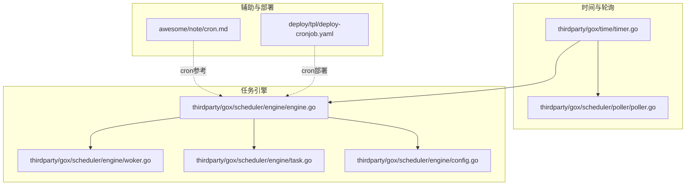
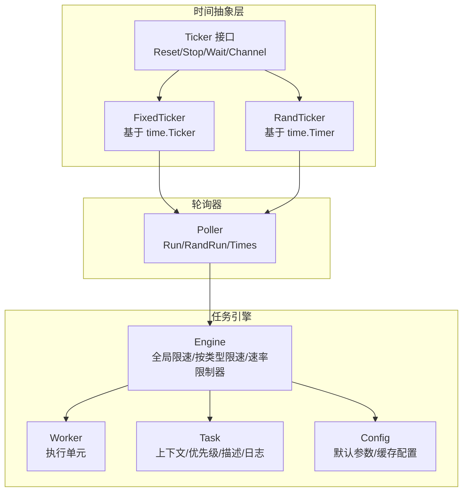
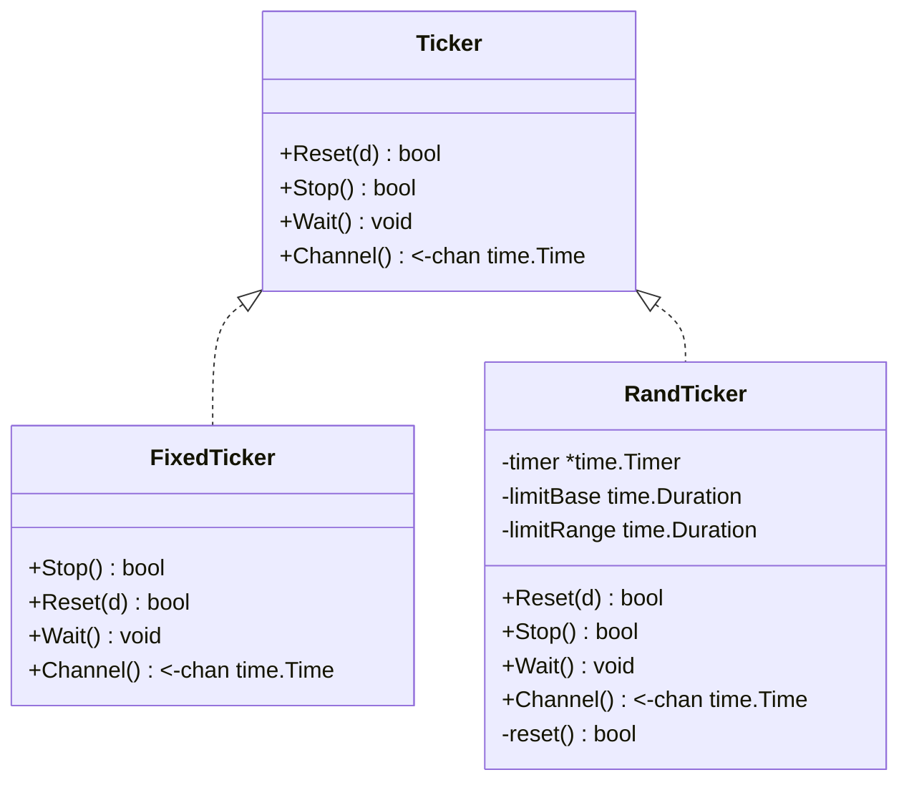
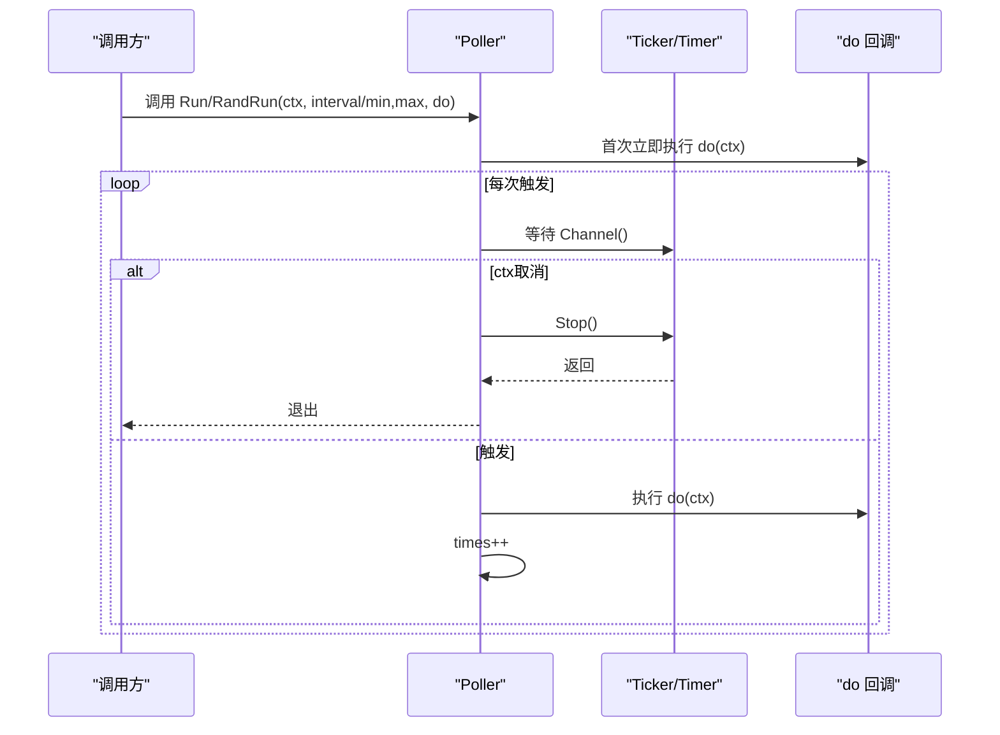
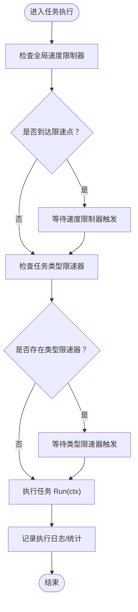
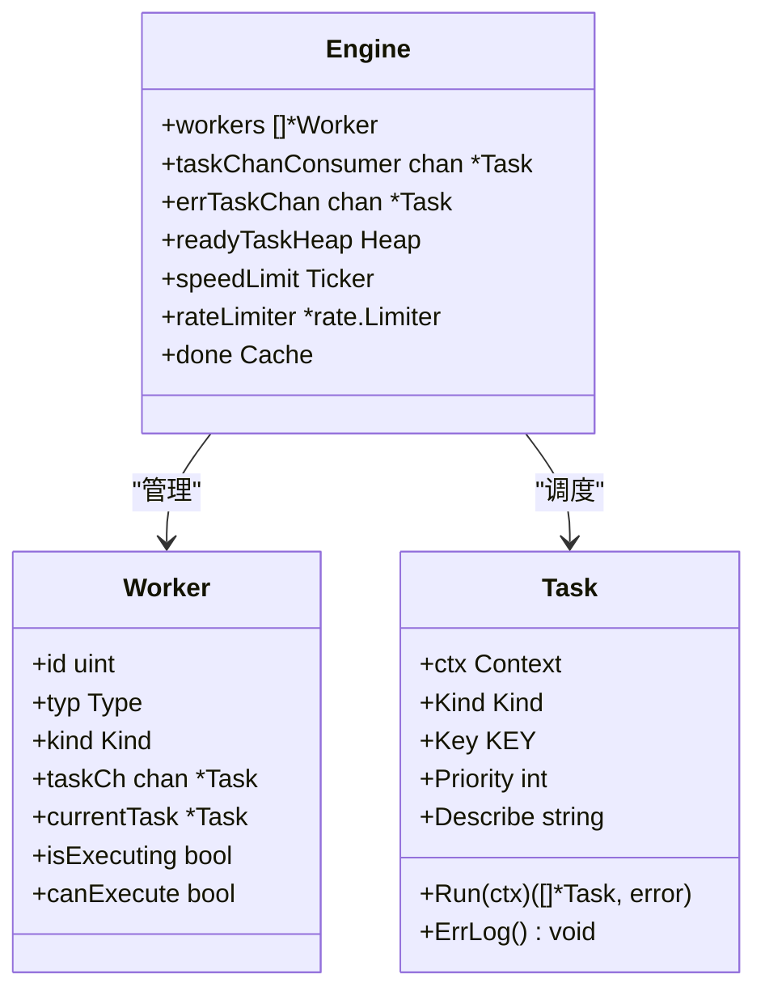
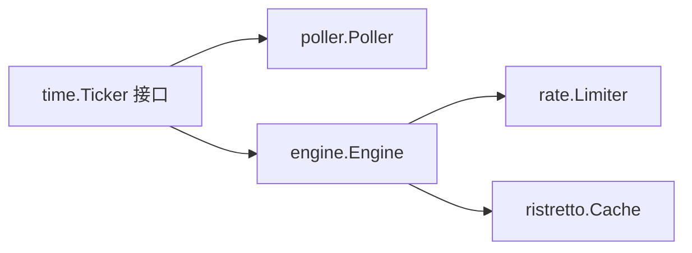

# 轮询机制

<cite>
**本文档引用的文件**
- [thirdparty/gox/time/timer.go](file://thirdparty/gox/time/timer.go)
- [thirdparty/gox/scheduler/poller/poller.go](file://thirdparty/gox/scheduler/poller/poller.go)
- [thirdparty/gox/scheduler/engine/engine.go](file://thirdparty/gox/scheduler/engine/engine.go)
- [thirdparty/gox/scheduler/engine/woker.go](file://thirdparty/gox/scheduler/engine/woker.go)
- [thirdparty/gox/scheduler/engine/task.go](file://thirdparty/gox/scheduler/engine/task.go)
- [thirdparty/gox/scheduler/engine/config.go](file://thirdparty/gox/scheduler/engine/config.go)
- [thirdparty/gox/scheduler/poller/poller_test.go](file://thirdparty/gox/scheduler/poller/poller_test.go)
- [awesome/note/cron.md](file://awesome/note/cron.md)
- [deploy/tpl/deploy-cronjob.yaml](file://deploy/tpl/deploy-cronjob.yaml)
</cite>

## 目录
1. [简介](#简介)
2. [项目结构](#项目结构)
3. [核心组件](#核心组件)
4. [架构总览](#架构总览)
5. [详细组件分析](#详细组件分析)
6. [依赖分析](#依赖分析)
7. [性能考量](#性能考量)
8. [故障排查指南](#故障排查指南)
9. [结论](#结论)
10. [附录](#附录)

## 简介
本文件围绕轮询机制功能，系统化地文档化定时任务与周期性任务的实现原理与使用方法。重点覆盖以下方面：
- Ticker 与 Timer 的封装与使用：固定间隔与随机间隔两种模式
- 轮询器 Poller 的接口与行为：同步与异步运行、计数统计
- 任务引擎 Engine 的集成：全局限速、按类型限速、速率限制器
- 配置项与关键参数：监控间隔、缓存配置、性能影响
- 实际应用场景：定时调度、周期性检查、延迟执行等

## 项目结构
与轮询机制相关的核心代码位于 thirdparty/gox 下的 time、scheduler 子模块，并在 scheduler/engine 中与任务引擎集成；cron 相关知识与部署模板位于 awesome 与 deploy 目录。

**图表来源**
- [thirdparty/gox/time/timer.go:1-95](file://thirdparty/gox/time/timer.go#L1-L95)
- [thirdparty/gox/scheduler/poller/poller.go:1-93](file://thirdparty/gox/scheduler/poller/poller.go#L1-L93)
- [thirdparty/gox/scheduler/engine/engine.go:1-242](file://thirdparty/gox/scheduler/engine/engine.go#L1-L242)
- [thirdparty/gox/scheduler/engine/woker.go:1-41](file://thirdparty/gox/scheduler/engine/woker.go#L1-L41)
- [thirdparty/gox/scheduler/engine/task.go:1-166](file://thirdparty/gox/scheduler/engine/task.go#L1-L166)
- [thirdparty/gox/scheduler/engine/config.go:1-89](file://thirdparty/gox/scheduler/engine/config.go#L1-L89)
- [awesome/note/cron.md:1-59](file://awesome/note/cron.md#L1-L59)
- [deploy/tpl/deploy-cronjob.yaml:1-44](file://deploy/tpl/deploy-cronjob.yaml#L1-L44)

**章节来源**
- [thirdparty/gox/time/timer.go:1-95](file://thirdparty/gox/time/timer.go#L1-L95)
- [thirdparty/gox/scheduler/poller/poller.go:1-93](file://thirdparty/gox/scheduler/poller/poller.go#L1-L93)
- [thirdparty/gox/scheduler/engine/engine.go:1-242](file://thirdparty/gox/scheduler/engine/engine.go#L1-L242)
- [thirdparty/gox/scheduler/engine/woker.go:1-41](file://thirdparty/gox/scheduler/engine/woker.go#L1-L41)
- [thirdparty/gox/scheduler/engine/task.go:1-166](file://thirdparty/gox/scheduler/engine/task.go#L1-L166)
- [thirdparty/gox/scheduler/engine/config.go:1-89](file://thirdparty/gox/scheduler/engine/config.go#L1-L89)
- [awesome/note/cron.md:1-59](file://awesome/note/cron.md#L1-L59)
- [deploy/tpl/deploy-cronjob.yaml:1-44](file://deploy/tpl/deploy-cronjob.yaml#L1-L44)

## 核心组件
- 时间轮询接口与实现
  - Ticker 接口：统一 Reset、Stop、Wait、Channel 方法，屏蔽底层差异
  - 固定间隔 Ticker：基于标准库 time.Ticker 的适配
  - 随机间隔 Ticker：基于 time.Timer，支持最小/最大间隔范围
- 轮询器 Poller
  - 支持固定间隔与随机间隔的 Run/RandRun
  - 内部计数 times，便于统计执行次数
  - 通过 context 控制生命周期，优雅退出
- 任务引擎 Engine
  - 全局速度限制：NewTicker/NewRandTicker
  - 按类型限速：KindSpeedLimit/KindRandSpeedLimit
  - 速率限制器：golang.org/x/time/rate.Limiter
  - 监控间隔：MonitorInterval 最小 1 秒约束
- 任务模型与工作单元
  - Task 结构体：上下文、优先级、描述、执行日志、超时等
  - Worker：执行单元，负责消费任务通道
  - Config：默认工作协数量、监控间隔、完成缓存配置

**章节来源**
- [thirdparty/gox/time/timer.go:14-94](file://thirdparty/gox/time/timer.go#L14-L94)
- [thirdparty/gox/scheduler/poller/poller.go:16-92](file://thirdparty/gox/scheduler/poller/poller.go#L16-L92)
- [thirdparty/gox/scheduler/engine/engine.go:30-230](file://thirdparty/gox/scheduler/engine/engine.go#L30-L230)
- [thirdparty/gox/scheduler/engine/task.go:46-166](file://thirdparty/gox/scheduler/engine/task.go#L46-L166)
- [thirdparty/gox/scheduler/engine/woker.go:20-41](file://thirdparty/gox/scheduler/engine/woker.go#L20-L41)
- [thirdparty/gox/scheduler/engine/config.go:16-89](file://thirdparty/gox/scheduler/engine/config.go#L16-L89)

## 架构总览
轮询机制由“时间抽象层 → 轮询器 → 任务引擎”的层次化结构组成。时间抽象层提供统一的 Ticker 接口；轮询器在上下文中按固定或随机间隔触发回调；任务引擎在更高层提供限速、限流、按类型限速等能力。

**图表来源**
- [thirdparty/gox/time/timer.go:14-94](file://thirdparty/gox/time/timer.go#L14-L94)
- [thirdparty/gox/scheduler/poller/poller.go:18-92](file://thirdparty/gox/scheduler/poller/poller.go#L18-L92)
- [thirdparty/gox/scheduler/engine/engine.go:30-230](file://thirdparty/gox/scheduler/engine/engine.go#L30-L230)
- [thirdparty/gox/scheduler/engine/woker.go:20-41](file://thirdparty/gox/scheduler/engine/woker.go#L20-L41)
- [thirdparty/gox/scheduler/engine/task.go:46-166](file://thirdparty/gox/scheduler/engine/task.go#L46-L166)
- [thirdparty/gox/scheduler/engine/config.go:16-89](file://thirdparty/gox/scheduler/engine/config.go#L16-L89)

## 详细组件分析

### 时间轮询接口与实现
- 接口设计
  - 统一方法：Reset(d)、Stop()、Wait()、Channel()
  - 用途：屏蔽固定与随机两种模式的差异，便于上层复用
- 固定间隔 Ticker
  - 基于标准库 time.Ticker，适配为 Ticker 接口
  - Reset 与 Stop 直接委托底层实现
- 随机间隔 Ticker
  - 使用 time.Timer 实现，内部维护最小基线与范围
  - Reset 更新最小基线，reset() 在范围内随机生成新间隔
  - Wait() 后自动重置，形成“触发-重置-再触发”的循环

**图表来源**
- [thirdparty/gox/time/timer.go:14-94](file://thirdparty/gox/time/timer.go#L14-L94)

**章节来源**
- [thirdparty/gox/time/timer.go:14-94](file://thirdparty/gox/time/timer.go#L14-L94)

### 轮询器 Poller
- 功能
  - Run：固定间隔轮询，首次立即执行，随后按间隔触发
  - RandRun：随机间隔轮询，首次立即执行，随后按[min,max]内随机间隔触发
  - Times：统计已执行次数
- 生命周期
  - 通过 context.Done() 优雅退出
  - Stop 调用底层 Ticker/Timer 的 Stop
- 使用建议
  - 将耗时逻辑放入 do 回调，避免阻塞轮询主循环
  - 对外暴露 Times 便于监控与可观测性

**图表来源**
- [thirdparty/gox/scheduler/poller/poller.go:30-92](file://thirdparty/gox/scheduler/poller/poller.go#L30-L92)

**章节来源**
- [thirdparty/gox/scheduler/poller/poller.go:16-92](file://thirdparty/gox/scheduler/poller/poller.go#L16-L92)
- [thirdparty/gox/scheduler/poller/poller_test.go:15-31](file://thirdparty/gox/scheduler/poller/poller_test.go#L15-L31)

### 任务引擎 Engine 的轮询集成
- 全局限速
  - SpeedLimited(interval)：固定间隔
  - RandSpeedLimited(min,max)：随机间隔
- 按类型限速
  - KindSpeedLimit/KindRandSpeedLimit：针对特定 Kind 的限速
  - KindGroupSpeedLimit/KindGroupRandSpeedLimit：多 Kind 共享同一限速器
- 速率限制器
  - Limiter(r,b)：全局速率限制
  - KindLimiter：按类型限速
- 监控与配置
  - MonitorInterval(interval)：最小 1 秒约束
  - Config 默认工作协数量、监控间隔、完成缓存配置

**图表来源**
- [thirdparty/gox/scheduler/engine/engine.go:154-230](file://thirdparty/gox/scheduler/engine/engine.go#L154-L230)

**章节来源**
- [thirdparty/gox/scheduler/engine/engine.go:154-230](file://thirdparty/gox/scheduler/engine/engine.go#L154-L230)
- [thirdparty/gox/scheduler/engine/config.go:16-89](file://thirdparty/gox/scheduler/engine/config.go#L16-L89)

### 任务模型与工作单元
- Task
  - 字段：上下文、类型、键、优先级、描述、统计、执行函数、创建时间、执行日志、超时等
  - 方法：设置上下文、优先级、类型、键、描述；错误日志输出
- Worker
  - 字段：ID、类型、当前任务、执行状态、任务通道
  - 职责：从通道取出任务并执行
- Config
  - 默认参数：工作协数量、监控间隔、完成缓存配置
  - 初始化：若未设置则赋予默认值

**图表来源**
- [thirdparty/gox/scheduler/engine/task.go:46-166](file://thirdparty/gox/scheduler/engine/task.go#L46-L166)
- [thirdparty/gox/scheduler/engine/woker.go:20-41](file://thirdparty/gox/scheduler/engine/woker.go#L20-L41)
- [thirdparty/gox/scheduler/engine/engine.go:30-56](file://thirdparty/gox/scheduler/engine/engine.go#L30-L56)

**章节来源**
- [thirdparty/gox/scheduler/engine/task.go:46-166](file://thirdparty/gox/scheduler/engine/task.go#L46-L166)
- [thirdparty/gox/scheduler/engine/woker.go:20-41](file://thirdparty/gox/scheduler/engine/woker.go#L20-L41)
- [thirdparty/gox/scheduler/engine/engine.go:30-56](file://thirdparty/gox/scheduler/engine/engine.go#L30-L56)

## 依赖分析
- 组件耦合
  - time.Ticker 接口被 poller 与 engine 广泛使用，降低对具体实现的耦合
  - engine 通过 timex.Ticker 统一接入固定/随机间隔
- 外部依赖
  - 标准库 time、sync、context
  - 第三方：golang.org/x/time/rate、ristretto 缓存
- 循环依赖
  - 未发现循环导入；各模块职责清晰

**图表来源**
- [thirdparty/gox/time/timer.go:14-94](file://thirdparty/gox/time/timer.go#L14-L94)
- [thirdparty/gox/scheduler/poller/poller.go:13-14](file://thirdparty/gox/scheduler/poller/poller.go#L13-L14)
- [thirdparty/gox/scheduler/engine/engine.go:21-22](file://thirdparty/gox/scheduler/engine/engine.go#L21-L22)

**章节来源**
- [thirdparty/gox/time/timer.go:14-94](file://thirdparty/gox/time/timer.go#L14-L94)
- [thirdparty/gox/scheduler/poller/poller.go:13-14](file://thirdparty/gox/scheduler/poller/poller.go#L13-L14)
- [thirdparty/gox/scheduler/engine/engine.go:21-22](file://thirdparty/gox/scheduler/engine/engine.go#L21-L22)

## 性能考量
- Go 定时器演进
  - Go1.14 引入每 P 自维护的 timer 堆，减少锁竞争，提升 Ticker 性能
- 轮询性能建议
  - 优先使用固定间隔 Ticker，减少随机数生成开销
  - 合理设置间隔，避免过短导致 CPU 占用过高
  - 使用 context 控制生命周期，及时 Stop，释放资源
- 任务引擎限速
  - 全局与按类型限速可有效削峰填谷，避免瞬时压力过大
  - 速率限制器与缓存配置需结合业务峰值与可用资源调优

[本节为通用性能指导，无需特定文件引用]

## 故障排查指南
- 轮询器未退出
  - 确认传入的 context 是否正确取消
  - 检查 do 回调是否阻塞，导致无法响应 ctx.Done()
- 随机间隔异常
  - min/max 参数合法性：min ≤ max；若传入非法，内部会交换参数
  - 首次触发可能落在 [min, min+range) 区间内，符合预期
- 任务引擎限速不生效
  - 检查 MonitorInterval 是否小于 1 秒（会被强制修正）
  - 确认全局/类型限速器是否正确设置
- 测试验证
  - 参考单元测试，验证固定与随机间隔的轮询行为

**章节来源**
- [thirdparty/gox/scheduler/poller/poller.go:30-92](file://thirdparty/gox/scheduler/poller/poller.go#L30-L92)
- [thirdparty/gox/scheduler/poller/poller_test.go:15-31](file://thirdparty/gox/scheduler/poller/poller_test.go#L15-L31)
- [thirdparty/gox/scheduler/engine/engine.go:100-107](file://thirdparty/gox/scheduler/engine/engine.go#L100-L107)

## 结论
- 通过统一的 Ticker 接口，轮询机制在固定与随机间隔之间保持一致的使用体验
- Poller 提供简洁的 Run/RandRun 能力，适合大多数定时/周期性任务场景
- 任务引擎在更高层提供了全局与按类型限速、速率限制器等能力，满足复杂系统的稳定性需求
- 合理配置与监控，可在保证性能的同时提升系统的可靠性

[本节为总结性内容，无需特定文件引用]

## 附录

### API 一览与使用要点
- 时间轮询接口
  - NewTicker(interval)：创建固定间隔 Ticker
  - NewRandTicker(min, max)：创建随机间隔 Ticker
  - Ticker.Reset(d)/Stop()/Wait()/Channel()：统一操作
- 轮询器
  - NewPoller()：创建轮询器
  - Run(ctx, interval, do)/RandRun(ctx, min, max, do)：启动轮询
  - Times()：获取执行次数
- 任务引擎
  - SpeedLimited/RandSpeedLimited：全局限速
  - KindSpeedLimit/KindRandSpeedLimit：按类型限速
  - Limiter/KindLimiter：速率限制器
  - MonitorInterval：监控间隔（最小 1 秒）

**章节来源**
- [thirdparty/gox/time/timer.go:41-94](file://thirdparty/gox/time/timer.go#L41-L94)
- [thirdparty/gox/scheduler/poller/poller.go:22-92](file://thirdparty/gox/scheduler/poller/poller.go#L22-L92)
- [thirdparty/gox/scheduler/engine/engine.go:154-230](file://thirdparty/gox/scheduler/engine/engine.go#L154-L230)

### 应用场景示例（步骤说明）
- 定时任务调度
  - 使用 Poller.Run 或 engine.SpeedLimited 配合固定间隔
  - 示例路径：[示例-定时任务:24-31](file://thirdparty/gox/scheduler/poller/poller_test.go#L24-L31)
- 周期性检查
  - 使用 Poller.RandRun 或 engine.RandSpeedLimited 配合随机间隔
  - 示例路径：[示例-随机间隔轮询:15-22](file://thirdparty/gox/scheduler/poller/poller_test.go#L15-L22)
- 延迟执行
  - 使用 time.After 或 Timer 的 Channel 进行一次性延迟
  - 参考：[延迟执行示例:154-162](file://thirdparty/gox/scheduler/engine/engine.go#L154-L162)
- Cron 集成（部署层）
  - 使用 CronJob 模板定义周期性任务
  - 参考：[Cron 配置说明:1-59](file://awesome/note/cron.md#L1-L59)、[CronJob 模板:1-44](file://deploy/tpl/deploy-cronjob.yaml#L1-L44)

**章节来源**
- [thirdparty/gox/scheduler/poller/poller_test.go:15-31](file://thirdparty/gox/scheduler/poller/poller_test.go#L15-L31)
- [thirdparty/gox/scheduler/engine/engine.go:154-162](file://thirdparty/gox/scheduler/engine/engine.go#L154-L162)
- [awesome/note/cron.md:1-59](file://awesome/note/cron.md#L1-L59)
- [deploy/tpl/deploy-cronjob.yaml:1-44](file://deploy/tpl/deploy-cronjob.yaml#L1-L44)