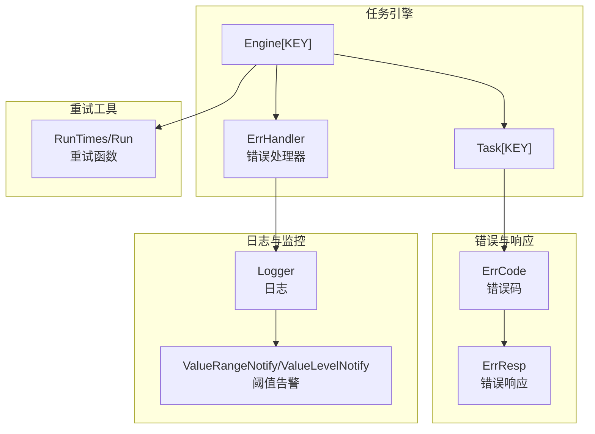
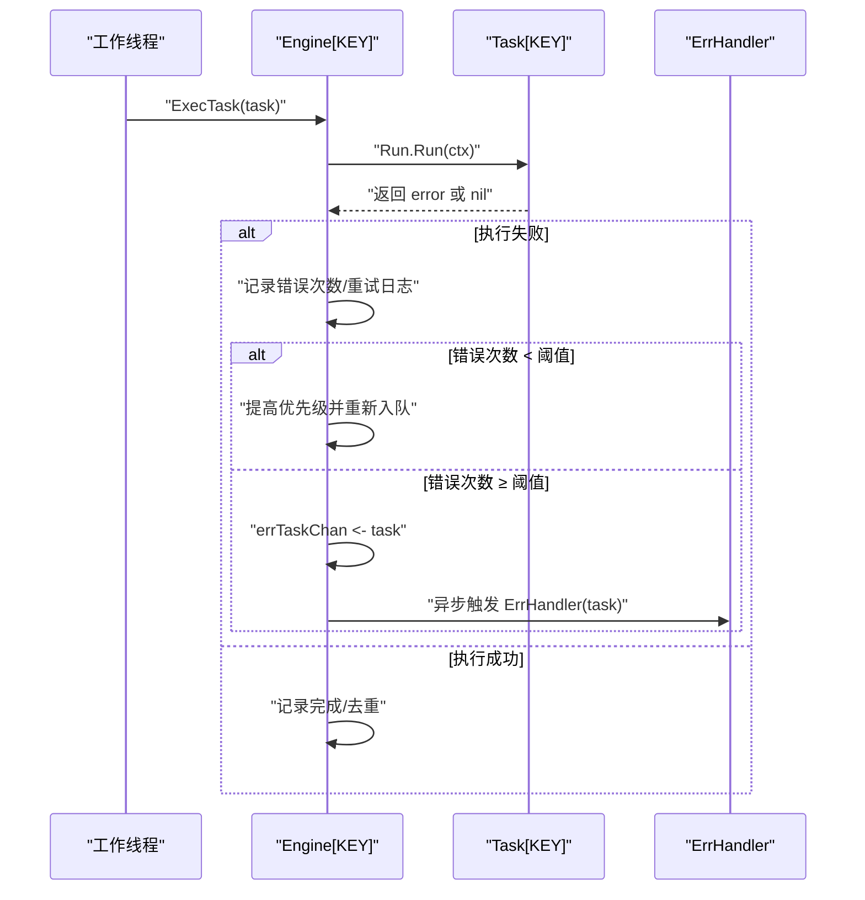
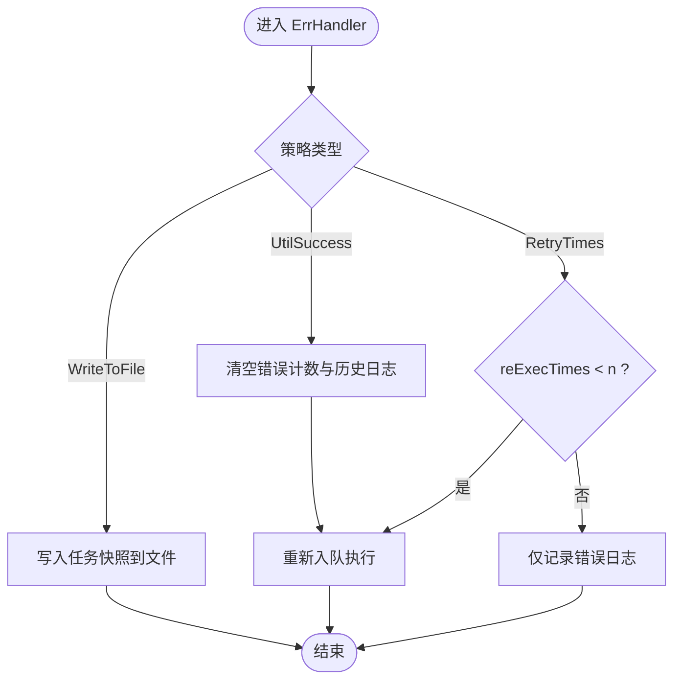
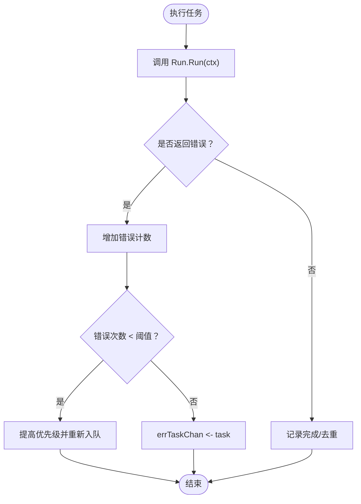
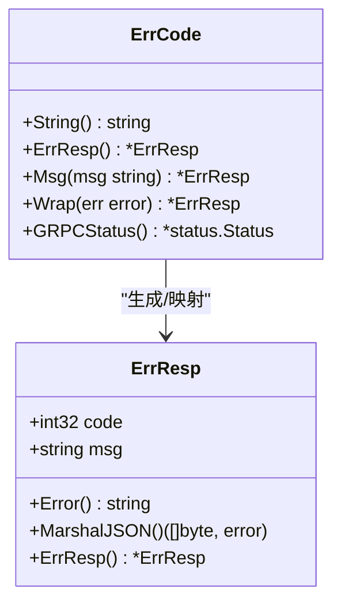
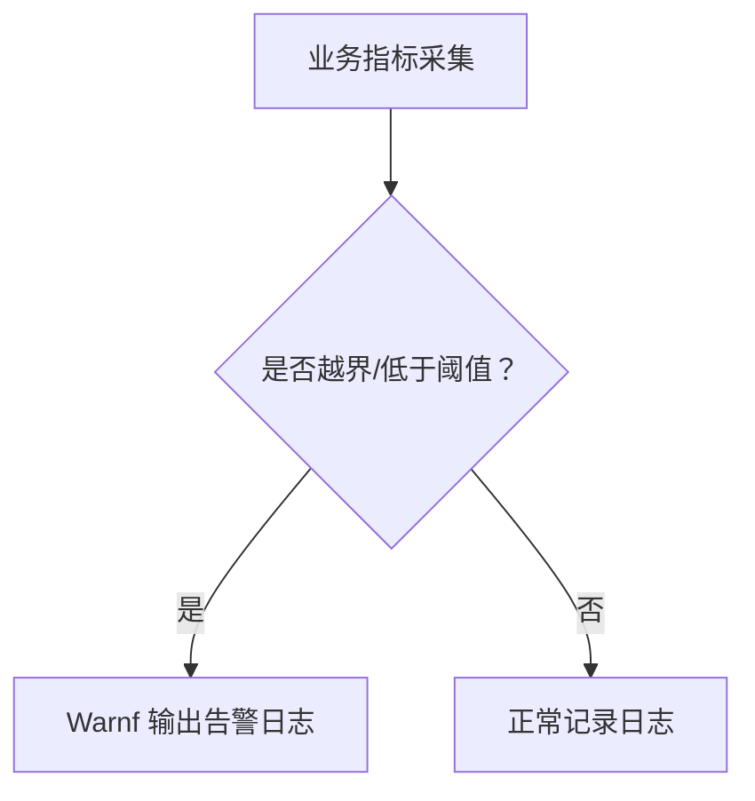
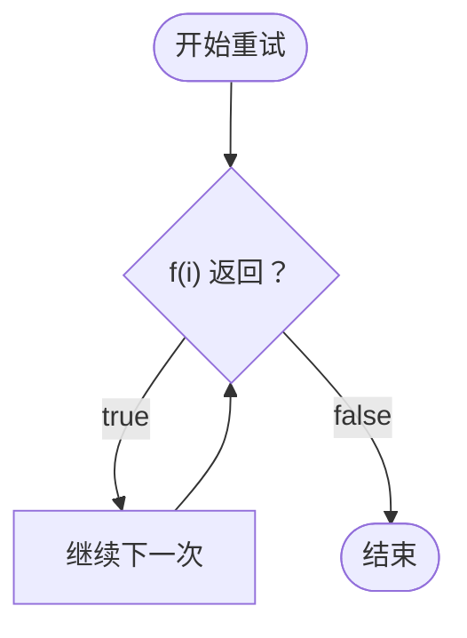
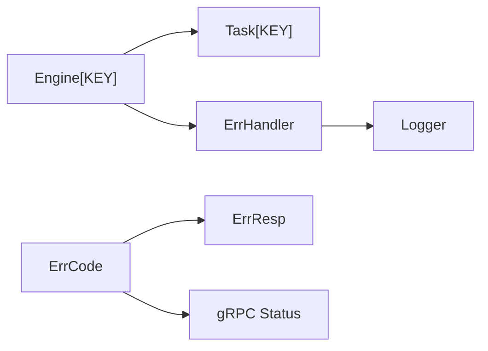

# 错误处理

<cite>
**本文档引用的文件**
- [engine.go](file://thirdparty/gox/scheduler/engine/engine.go)
- [task.go](file://thirdparty/gox/scheduler/engine/task.go)
- [conctrl.go](file://thirdparty/gox/scheduler/engine/conctrl.go)
- [retry.go](file://thirdparty/gox/scheduler/retry/retry.go)
- [code.go](file://thirdparty/gox/errors/code.go)
- [errrep.go](file://thirdparty/gox/errors/errrep.go)
- [errcode.go](file://thirdparty/gox/net/http/grpc/errcode.go)
- [errcode.pb.go](file://thirdparty/scaffold/errcode/errcode.pb.go)
- [logger.go](file://thirdparty/gox/log/logger.go)
- [conf_warn.go](file://thirdparty/gox/log/conf_warn.go)
- [engine_test.go](file://thirdparty/gox/scheduler/engine/engine_test.go)
</cite>

## 目录
1. [简介](#简介)
2. [项目结构](#项目结构)
3. [核心组件](#核心组件)
4. [架构总览](#架构总览)
5. [详细组件分析](#详细组件分析)
6. [依赖分析](#依赖分析)
7. [性能考量](#性能考量)
8. [故障排查指南](#故障排查指南)
9. [结论](#结论)
10. [附录](#附录)

## 简介
本文件面向“任务执行失败”的错误处理与重试机制，系统性梳理了基于任务引擎的错误分类、异常捕获、恢复策略与扩展能力。重点覆盖以下方面：
- 任务执行失败的捕获与统计
- 内置错误处理器（立即重试、条件重试、文件记录）
- 错误码体系与响应封装
- 日志记录、告警通知、故障转移等高级能力的集成建议
- 自定义错误处理器的开发指南与最佳实践

## 项目结构
围绕错误处理的关键模块分布如下：
- 任务引擎与控制：engine.go、task.go、conctrl.go
- 重试工具：retry.go
- 错误码与响应：code.go、errrep.go、errcode.go、errcode.pb.go
- 日志与告警：logger.go、conf_warn.go
- 示例与验证：engine_test.go

**图表来源**
- [engine.go:109-147](file://thirdparty/gox/scheduler/engine/engine.go#L109-L147)
- [task.go:46-60](file://thirdparty/gox/scheduler/engine/task.go#L46-L60)
- [code.go:9-28](file://thirdparty/gox/errors/code.go#L9-L28)
- [errrep.go:20-42](file://thirdparty/gox/errors/errrep.go#L20-L42)
- [logger.go:18-293](file://thirdparty/gox/log/logger.go#L18-L293)
- [conf_warn.go:15-25](file://thirdparty/gox/log/conf_warn.go#L15-L25)
- [retry.go:11-30](file://thirdparty/gox/scheduler/retry/retry.go#L11-L30)

**章节来源**
- [engine.go:1-242](file://thirdparty/gox/scheduler/engine/engine.go#L1-L242)
- [task.go:1-166](file://thirdparty/gox/scheduler/engine/task.go#L1-L166)
- [code.go:1-54](file://thirdparty/gox/errors/code.go#L1-L54)
- [errrep.go:1-65](file://thirdparty/gox/errors/errrep.go#L1-L65)
- [logger.go:1-293](file://thirdparty/gox/log/logger.go#L1-L293)
- [conf_warn.go:1-25](file://thirdparty/gox/log/conf_warn.go#L1-L25)
- [retry.go:1-31](file://thirdparty/gox/scheduler/retry/retry.go#L1-L31)

## 核心组件
- 任务引擎 Engine[KEY]
  - 提供错误处理器注册、任务执行、重试与限速、速率限制、种类级限流/限速等能力
  - 错误处理通道 errTaskChan 与后台 goroutine 负责触发用户自定义 ErrHandler
- 任务 Task[KEY]
  - 封装执行上下文、优先级、描述、错误次数、重试次数、执行日志等
  - 提供 Errs() 与 ErrLog() 辅助收集与输出历史错误
- 错误码与响应
  - ErrCode：统一错误码枚举
  - ErrResp：统一错误响应结构，支持 JSON 序列化与 gRPC Status 映射
- 日志与告警
  - Logger：基于 zap 的封装，支持结构化字段、上下文追踪、级别筛选
  - ValueRangeNotify/ValueLevelNotify：阈值范围与等级告警
- 重试工具
  - RunTimes/Run：按次数或条件进行重试，累积错误

**章节来源**
- [engine.go:30-56](file://thirdparty/gox/scheduler/engine/engine.go#L30-L56)
- [engine.go:109-147](file://thirdparty/gox/scheduler/engine/engine.go#L109-L147)
- [task.go:46-60](file://thirdparty/gox/scheduler/engine/task.go#L46-L60)
- [task.go:101-127](file://thirdparty/gox/scheduler/engine/task.go#L101-L127)
- [code.go:9-28](file://thirdparty/gox/errors/code.go#L9-L28)
- [errrep.go:20-42](file://thirdparty/gox/errors/errrep.go#L20-L42)
- [logger.go:18-293](file://thirdparty/gox/log/logger.go#L18-L293)
- [conf_warn.go:15-25](file://thirdparty/gox/log/conf_warn.go#L15-L25)
- [retry.go:11-30](file://thirdparty/gox/scheduler/retry/retry.go#L11-L30)

## 架构总览
任务执行失败的处理流程由引擎驱动，核心步骤如下：
- 任务执行后若返回错误，引擎记录错误并增加错误计数
- 若错误次数小于阈值，引擎将任务重新入队（提高优先级），并记录重试日志
- 当错误次数达到阈值，引擎将任务投递到错误处理通道，交由 ErrHandler 处理
- ErrHandler 可实现“立即重试”、“条件重试”、“文件记录”等策略，并可结合日志与告警

**图表来源**
- [conctrl.go:294-380](file://thirdparty/gox/scheduler/engine/conctrl.go#L294-L380)
- [engine.go:109-147](file://thirdparty/gox/scheduler/engine/engine.go#L109-L147)

**章节来源**
- [conctrl.go:294-380](file://thirdparty/gox/scheduler/engine/conctrl.go#L294-L380)
- [engine.go:109-147](file://thirdparty/gox/scheduler/engine/engine.go#L109-L147)

## 详细组件分析

### 任务引擎与错误处理器
- 注册错误处理器
  - ErrHandler(handler)：注册自定义错误处理器
  - ErrHandlerUtilSuccess()：清理历史错误并重试，适合“快速修复”场景
  - ErrHandlerRetryTimes(n)：仅在重试次数小于 n 时重试，否则记录错误日志
  - ErrHandlerWriteToFile(path)：将失败任务持久化到文件，便于离线分析
- 错误处理通道与后台协程
  - 引擎启动后，后台协程从 errTaskChan 消费任务并调用 ErrHandler
  - 支持 OnStop 回调，用于资源清理（如关闭文件）

**图表来源**
- [engine.go:114-147](file://thirdparty/gox/scheduler/engine/engine.go#L114-L147)

**章节来源**
- [engine.go:109-147](file://thirdparty/gox/scheduler/engine/engine.go#L109-L147)

### 任务执行与错误统计
- 执行阶段
  - 记录每次执行的开始/结束时间与错误
  - 若为重试执行，追加到 reExecLogs；否则记录到 err 字段
- 失败判定与重试
  - 错误次数小于阈值时，提高优先级并重新入队
  - 达到阈值后，投递到错误处理通道
- 完成与去重
  - 成功执行后，对 Key 去重缓存，避免重复执行

**图表来源**
- [conctrl.go:335-380](file://thirdparty/gox/scheduler/engine/conctrl.go#L335-L380)

**章节来源**
- [conctrl.go:335-380](file://thirdparty/gox/scheduler/engine/conctrl.go#L335-L380)

### 错误码与响应
- 错误码
  - ErrCode：标准错误码集合（如 Success、Canceled、Unknown、InvalidArgument、DeadlineExceeded、NotFound、AlreadyExists、PermissionDenied、ResourceExhausted、FailedPrecondition、Aborted、OutOfRange、Unimplemented、Internal、Unavailable、DataLoss、Unauthenticated）
  - 支持通过 Register 动态注册自定义错误码消息
- 错误响应
  - ErrResp：包含 code 与 msg，支持 JSON 序列化与 gRPC Status 映射
  - ErrRespFrom：从 error 或实现了 ErrResp() 接口的对象提取 ErrResp
- gRPC 映射
  - ErrCode 实现 GRPCStatus()，便于在 gRPC 层面传递统一错误语义

**图表来源**
- [code.go:13-38](file://thirdparty/gox/errors/code.go#L13-L38)
- [errrep.go:20-64](file://thirdparty/gox/errors/errrep.go#L20-L64)
- [errcode.go:51-94](file://thirdparty/gox/net/http/grpc/errcode.go#L51-L94)

**章节来源**
- [code.go:9-54](file://thirdparty/gox/errors/code.go#L9-L54)
- [errrep.go:16-65](file://thirdparty/gox/errors/errrep.go#L16-L65)
- [errcode.go:51-94](file://thirdparty/gox/net/http/grpc/errcode.go#L51-L94)
- [errcode.pb.go:30-119](file://thirdparty/scaffold/errcode/errcode.pb.go#L30-L119)

### 日志与告警
- 日志
  - Logger 提供 Debug/Info/Warn/Error 等级别方法，支持结构化字段、上下文追踪（TraceId/SpanId）、延迟字段等
- 告警
  - ValueRangeNotify/ValueLevelNotify：当数值越界或低于阈值时发出警告日志，便于监控异常

**图表来源**
- [logger.go:18-293](file://thirdparty/gox/log/logger.go#L18-L293)
- [conf_warn.go:15-25](file://thirdparty/gox/log/conf_warn.go#L15-L25)

**章节来源**
- [logger.go:18-293](file://thirdparty/gox/log/logger.go#L18-L293)
- [conf_warn.go:15-25](file://thirdparty/gox/log/conf_warn.go#L15-L25)

### 重试机制
- RunTimes(n, f)：最多尝试 n 次，若某次 f 返回 nil 则成功；否则累积错误
- Run(f)：以布尔条件驱动无限重试，直到 f 返回 false

**图表来源**
- [retry.go:11-30](file://thirdparty/gox/scheduler/retry/retry.go#L11-L30)

**章节来源**
- [retry.go:11-30](file://thirdparty/gox/scheduler/retry/retry.go#L11-L30)

### 使用示例与验证
- 测试用例展示了如何注册 ErrHandlerUtilSuccess 并运行引擎
- 可参考示例在真实场景中替换为 ErrHandlerRetryTimes 或 ErrHandlerWriteToFile

**章节来源**
- [engine_test.go:20-25](file://thirdparty/gox/scheduler/engine/engine_test.go#L20-L25)
- [engine_test.go:89-95](file://thirdparty/gox/scheduler/engine/engine_test.go#L89-L95)

## 依赖分析
- 组件耦合
  - Engine 依赖 Task 的执行接口与统计字段
  - ErrHandler 依赖日志模块进行错误记录
  - 错误码与响应模块独立，可被 gRPC 层直接使用
- 外部依赖
  - 日志：zap
  - 并发与堆：go-spew、ristretto、container/heap
  - 时间与速率：timex、rate

**图表来源**
- [engine.go:30-56](file://thirdparty/gox/scheduler/engine/engine.go#L30-L56)
- [task.go:46-60](file://thirdparty/gox/scheduler/engine/task.go#L46-L60)
- [code.go:9-28](file://thirdparty/gox/errors/code.go#L9-L28)
- [errrep.go:20-42](file://thirdparty/gox/errors/errrep.go#L20-L42)
- [errcode.go:63-82](file://thirdparty/gox/net/http/grpc/errcode.go#L63-L82)

**章节来源**
- [engine.go:30-56](file://thirdparty/gox/scheduler/engine/engine.go#L30-L56)
- [task.go:46-60](file://thirdparty/gox/scheduler/engine/task.go#L46-L60)
- [code.go:9-28](file://thirdparty/gox/errors/code.go#L9-L28)
- [errrep.go:20-42](file://thirdparty/gox/errors/errrep.go#L20-L42)
- [errcode.go:63-82](file://thirdparty/gox/net/http/grpc/errcode.go#L63-L82)

## 性能考量
- 重试与优先级
  - 多次失败的任务提高优先级，有助于快速收敛问题
- 限速与限流
  - 支持全局与种类级速度限制、令牌桶限流，避免对下游造成冲击
- 去重缓存
  - 对已完成任务 Key 去重，减少重复执行
- 日志级别与开销
  - 建议在生产环境使用 Warn/Error 级别，避免高频 Debug 日志影响性能

[本节为通用指导，无需特定文件引用]

## 故障排查指南
- 快速定位失败任务
  - 使用 ErrHandlerWriteToFile 将失败任务快照落盘，结合 ErrLog 输出的历史错误进行分析
- 分析执行日志
  - 通过 Task.Errs() 获取历史错误列表，ErrLog() 输出格式化的错误串
- 触发重试策略
  - 若为瞬时错误，使用 ErrHandlerUtilSuccess 清理历史并重试
  - 若需限制重试次数，使用 ErrHandlerRetryTimes(n)
- 监控与告警
  - 结合 ValueRangeNotify/ValueLevelNotify 对关键指标进行阈值告警
- 日志增强
  - 在 ErrHandler 中使用 Logger.WithContext(ctx) 自动附加 TraceId/SpanId，便于链路追踪

**章节来源**
- [engine.go:114-147](file://thirdparty/gox/scheduler/engine/engine.go#L114-L147)
- [task.go:101-127](file://thirdparty/gox/scheduler/engine/task.go#L101-L127)
- [logger.go:48-57](file://thirdparty/gox/log/logger.go#L48-L57)
- [conf_warn.go:15-25](file://thirdparty/gox/log/conf_warn.go#L15-L25)

## 结论
本错误处理体系以任务引擎为核心，提供了完善的失败捕获、统计、重试与恢复能力。通过内置的多种 ErrHandler 策略与统一的错误码/响应模型，能够满足大多数任务执行失败的处理需求。配合日志与告警机制，可进一步提升系统的可观测性与稳定性。

[本节为总结，无需特定文件引用]

## 附录

### 自定义错误处理器开发指南与最佳实践
- 设计原则
  - 明确失败类型：区分瞬时错误与永久错误，采用不同策略
  - 限制重试：避免无限重试导致雪崩
  - 记录与审计：保留失败现场（任务快照、错误链）以便回溯
- 开发步骤
  - 注册 ErrHandler：在引擎初始化阶段设置
  - 实现策略：
    - 条件重试：根据错误类型与上下文决定是否重试
    - 指数退避：结合 RunTimes 或自定义指数退避逻辑
    - 降级与旁路：对非关键任务进行降级或旁路
  - 输出与上报：使用 Logger 记录错误，必要时接入告警系统
- 最佳实践
  - 将 ErrHandler 与配置中心解耦，支持热更新
  - 对外部依赖失败进行隔离（熔断/舱壁模式）
  - 对重试失败的任务进行隔离队列或死信处理

[本节为通用指导，无需特定文件引用]