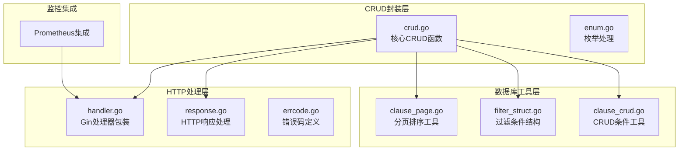
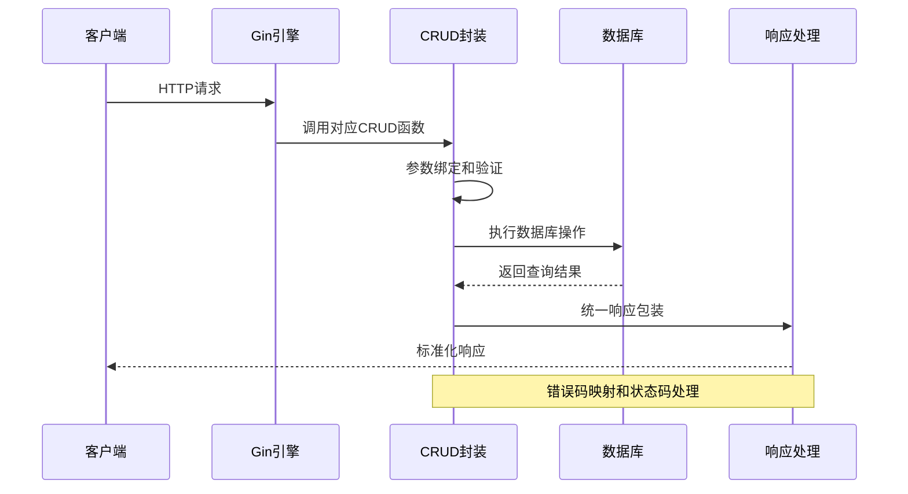
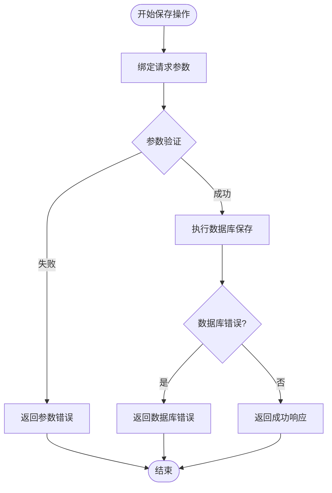
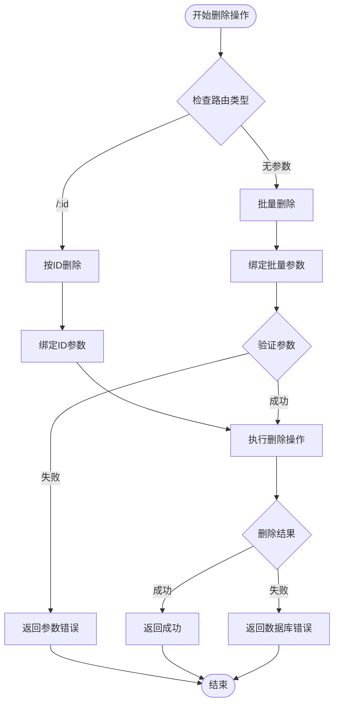
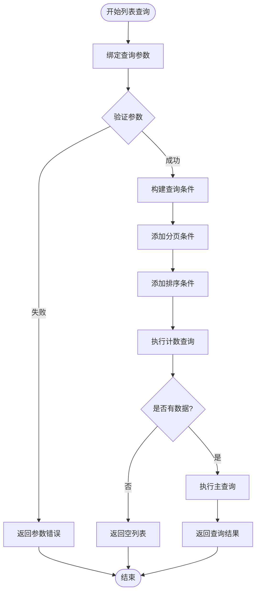
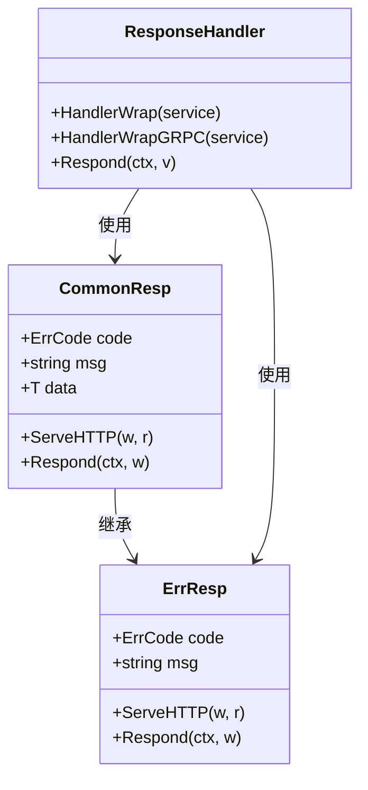
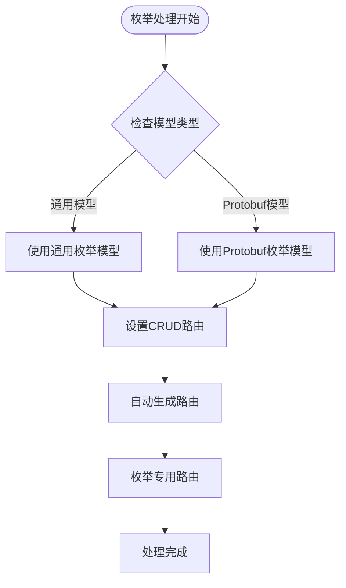
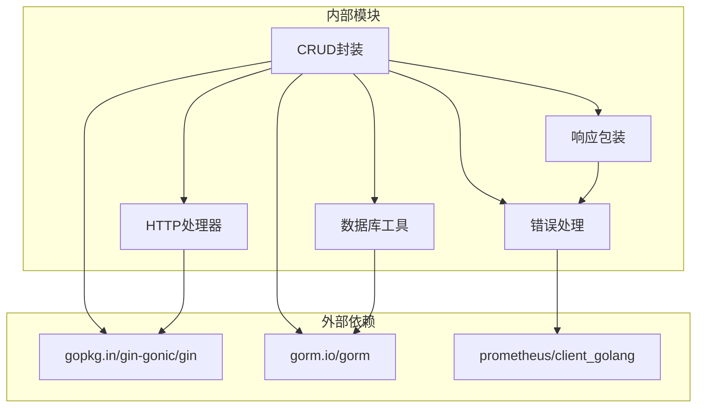

# CRUD操作封装

<cite>
**本文档引用的文件**
- [crud.go](file://thirdparty/scaffold/gin/crud/crud.go)
- [enum.go](file://thirdparty/scaffold/gin/crud/enum.go)
- [prometheus.go](file://thirdparty/scaffold/gin/prometheus.go)
- [handler.go](file://thirdparty/gox/net/http/gin/handler.go)
- [response.go](file://thirdparty/gox/net/http/response.go)
- [errcode.go](file://thirdparty/gox/errors/errcode.go)
- [clause_page.go](file://thirdparty/gox/database/sql/gorm/clause_page.go)
- [filter_struct.go](file://thirdparty/gox/database/sql/filter_struct.go)
- [clause_crud.go](file://thirdparty/gox/database/sql/gorm/clause_crud.go)
- [gin.go](file://thirdparty/pick/gin/gin.go)
</cite>

## 目录
1. [简介](#简介)
2. [项目结构](#项目结构)
3. [核心组件](#核心组件)
4. [架构概览](#架构概览)
5. [详细组件分析](#详细组件分析)
6. [依赖关系分析](#依赖关系分析)
7. [性能考虑](#性能考虑)
8. [故障排除指南](#故障排除指南)
9. [结论](#结论)
10. [附录](#附录)

## 简介
本文件详细介绍基于Gin框架的CRUD操作封装功能，涵盖增删改查操作、枚举值处理、统一响应包装、Prometheus监控集成等核心能力。通过泛型封装，开发者可以快速实现RESTful API，支持自动路由生成、参数绑定、数据库操作、错误处理和性能监控。

## 项目结构
CRUD封装功能主要位于`scaffold/gin/crud`目录，配合通用HTTP处理、响应包装和数据库查询工具：



**图表来源**
- [crud.go:1-161](file://thirdparty/scaffold/gin/crud/crud.go#L1-L161)
- [handler.go:1-84](file://thirdparty/gox/net/http/gin/handler.go#L1-L84)
- [response.go:1-397](file://thirdparty/gox/net/http/response.go#L1-L397)

**章节来源**
- [crud.go:1-161](file://thirdparty/scaffold/gin/crud/crud.go#L1-L161)
- [enum.go:1-19](file://thirdparty/scaffold/gin/crud/enum.go#L1-L19)

## 核心组件
CRUD封装由以下核心组件构成：

### 1. 泛型CRUD函数
- **Save[T]**: 支持创建和更新操作，自动生成POST/PUT路由
- **Delete[T]**: 支持单个删除和批量删除操作
- **Query[T]**: 支持按ID查询单条记录
- **List[T]**: 支持分页、排序、过滤的列表查询

### 2. 枚举处理
- **Enum**: 处理通用枚举模型
- **EnumPB**: 处理Protobuf枚举模型

### 3. 统一响应处理
- 标准化的错误码映射
- 统一的响应格式
- 错误状态码处理

### 4. 监控集成
- Prometheus指标暴露
- 自动路由日志记录

**章节来源**
- [crud.go:24-153](file://thirdparty/scaffold/gin/crud/crud.go#L24-L153)
- [enum.go:10-18](file://thirdparty/scaffold/gin/crud/enum.go#L10-L18)

## 架构概览
CRUD封装采用分层架构设计，确保各组件职责清晰、耦合度低：



**图表来源**
- [crud.go:30-118](file://thirdparty/scaffold/gin/crud/crud.go#L30-L118)
- [handler.go:20-46](file://thirdparty/gox/net/http/gin/handler.go#L20-L46)

## 详细组件分析

### CRUD核心函数分析

#### Save函数实现
Save函数提供完整的创建和更新功能：



**图表来源**
- [crud.go:30-70](file://thirdparty/scaffold/gin/crud/crud.go#L30-L70)

#### Delete函数实现
Delete函数支持多种删除方式：



**图表来源**
- [crud.go:72-103](file://thirdparty/scaffold/gin/crud/crud.go#L72-L103)

#### List函数实现
List函数提供高级查询功能：



**图表来源**
- [crud.go:120-153](file://thirdparty/scaffold/gin/crud/crud.go#L120-L153)

**章节来源**
- [crud.go:30-153](file://thirdparty/scaffold/gin/crud/crud.go#L30-L153)

### 响应处理机制

#### 统一响应格式
系统采用统一的响应格式，确保API一致性：



**图表来源**
- [response.go:58-100](file://thirdparty/gox/net/http/response.go#L58-L100)
- [handler.go:18-46](file://thirdparty/gox/net/http/gin/handler.go#L18-L46)

#### 错误码管理
错误码系统提供标准化的错误处理：

| 错误码类别 | 描述 | HTTP状态码 |
|-----------|------|------------|
| Success | 成功 | 200 |
| InvalidArgument | 参数无效 | 400 |
| DBError | 数据库错误 | 500 |

**章节来源**
- [response.go:58-100](file://thirdparty/gox/net/http/response.go#L58-L100)
- [errcode.go:13-38](file://thirdparty/gox/errors/errcode.go#L13-L38)

### 枚举处理机制

#### 枚举模型支持
系统提供专门的枚举处理函数：



**图表来源**
- [enum.go:10-18](file://thirdparty/scaffold/gin/crud/enum.go#L10-L18)

**章节来源**
- [enum.go:10-18](file://thirdparty/scaffold/gin/crud/enum.go#L10-L18)

### 监控集成

#### Prometheus指标集成
系统集成了Prometheus监控指标：

```mermaid
graph LR
subgraph "监控集成"
PROM_HANDLER[Prometheus处理器]
METRICS_ROUTE[/metrics路由]
PROM_CLIENT[Prometheus客户端]
end
subgraph "Gin应用"
APP[Gin Engine]
ROUTES[业务路由]
end
PROM_HANDLER --> METRICS_ROUTE
METRICS_ROUTE --> PROM_CLIENT
APP --> ROUTES
APP --> PROM_HANDLER
```

**图表来源**
- [prometheus.go:9-12](file://thirdparty/scaffold/gin/prometheus.go#L9-L12)

**章节来源**
- [prometheus.go:9-12](file://thirdparty/scaffold/gin/prometheus.go#L9-L12)

## 依赖关系分析

### 组件依赖图
CRUD封装功能的依赖关系如下：



**图表来源**
- [crud.go:3-20](file://thirdparty/scaffold/gin/crud/crud.go#L3-L20)
- [prometheus.go:3-7](file://thirdparty/scaffold/gin/prometheus.go#L3-L7)

### 关键依赖说明

#### 数据库查询工具
- **分页工具**: 提供标准的分页查询接口
- **排序工具**: 支持多字段排序
- **过滤工具**: 支持复杂条件过滤

#### HTTP处理工具
- **参数绑定**: 自动解析请求参数
- **响应包装**: 统一响应格式
- **错误处理**: 标准化错误响应

**章节来源**
- [clause_page.go:63-157](file://thirdparty/gox/database/sql/gorm/clause_page.go#L63-L157)
- [filter_struct.go:85-91](file://thirdparty/gox/database/sql/filter_struct.go#L85-L91)

## 性能考虑

### 查询优化策略
1. **分页查询**: 避免一次性加载大量数据
2. **索引优化**: 在常用查询字段上建立索引
3. **批量操作**: 支持批量删除和更新操作
4. **缓存策略**: 结合Redis等缓存技术

### 监控指标
系统提供以下监控指标：
- 请求量统计
- 响应时间分布
- 错误率监控
- 数据库连接池状态

## 故障排除指南

### 常见问题及解决方案

#### 1. 参数绑定失败
**症状**: 返回参数无效错误
**解决方案**: 
- 检查请求体格式是否正确
- 验证字段命名是否匹配
- 确认数据类型转换

#### 2. 数据库操作异常
**症状**: 返回数据库错误
**解决方案**:
- 检查数据库连接配置
- 验证SQL语句正确性
- 查看数据库日志

#### 3. 路由注册失败
**症状**: API无法访问
**解决方案**:
- 确认路由前缀配置
- 检查中间件链路
- 验证权限配置

**章节来源**
- [crud.go:35-42](file://thirdparty/scaffold/gin/crud/crud.go#L35-L42)
- [crud.go:87-93](file://thirdparty/scaffold/gin/crud/crud.go#L87-L93)

## 结论
CRUD操作封装提供了完整的一站式解决方案，具有以下优势：

1. **开发效率**: 通过泛型封装，大幅减少重复代码
2. **一致性**: 统一的响应格式和错误处理
3. **可扩展性**: 支持自定义中间件和扩展功能
4. **可观测性**: 内置监控和日志功能
5. **易维护性**: 清晰的分层架构和依赖关系

该封装适合快速构建企业级RESTful API服务，支持从简单CRUD到复杂业务场景的各种需求。

## 附录

### API接口定义

#### 基础CRUD接口
| 方法 | 路径 | 功能 | 参数 |
|------|------|------|------|
| POST | /api/{model} | 创建记录 | JSON请求体 |
| PUT | /api/{model} | 更新记录 | JSON请求体 |
| PUT | /api/{model}/:id | 按ID更新 | JSON请求体 |
| GET | /api/{model}/:id | 获取记录 | 路径参数 |
| DELETE | /api/{model}/:id | 删除记录 | 路径参数 |
| DELETE | /api/{model} | 批量删除 | JSON请求体 |

#### 高级查询接口
| 方法 | 路径 | 功能 | 参数 |
|------|------|------|------|
| GET | /api/{model} | 列表查询 | 分页、排序、过滤参数 |

#### 监控接口
| 方法 | 路径 | 功能 |
|------|------|------|
| ANY | /metrics | Prometheus指标 |

### 使用示例
1. **基础CRUD**: 直接调用`CRUD[Model](engine, db)`
2. **枚举处理**: 调用`Enum(engine, db)`或`EnumPB(engine, db)`
3. **监控集成**: 调用`Prom(engine)`注册监控路由
4. **自定义中间件**: 通过可变参数传入自定义中间件

### 最佳实践建议
1. **模型设计**: 合理设计数据模型结构
2. **参数验证**: 在业务逻辑层添加参数验证
3. **错误处理**: 统一错误码和响应格式
4. **性能优化**: 合理使用分页和索引
5. **安全考虑**: 添加必要的权限控制和输入过滤