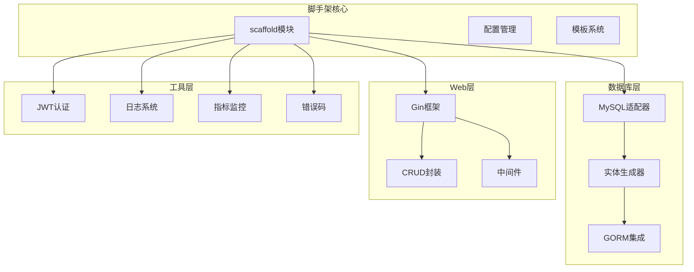
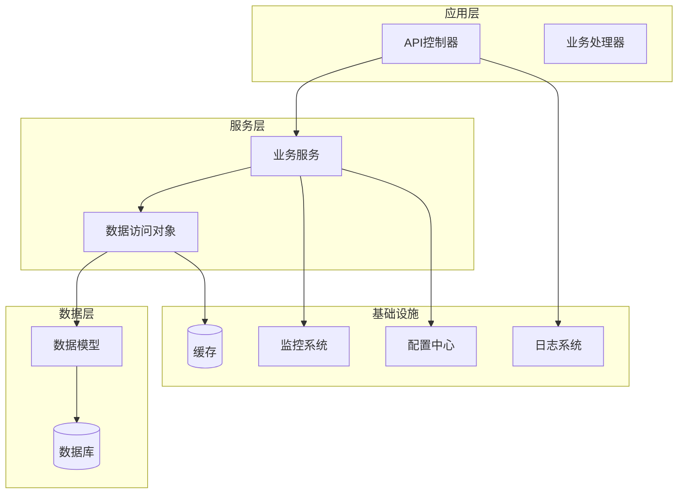
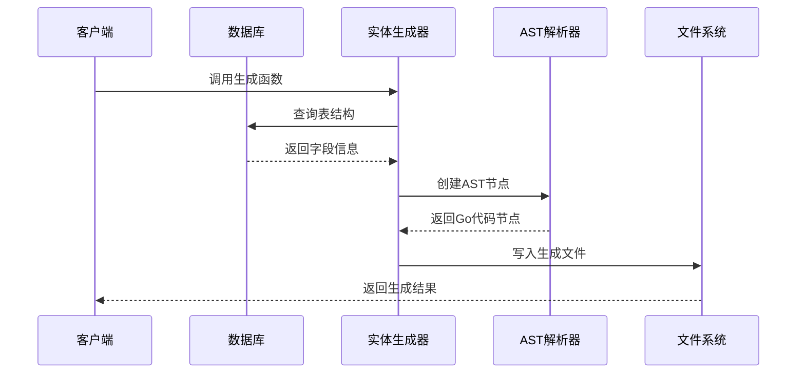
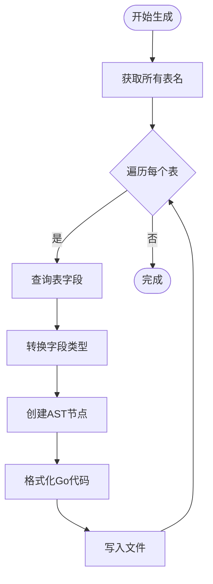
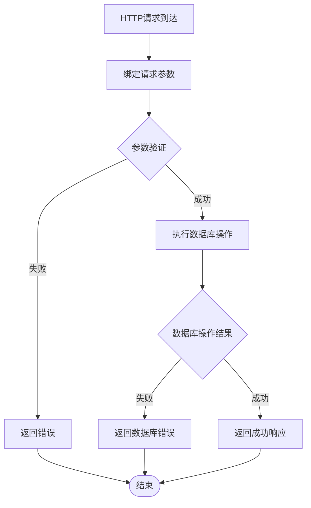
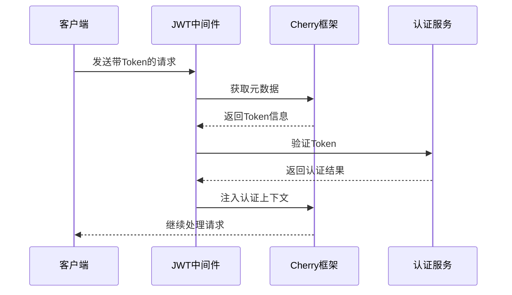
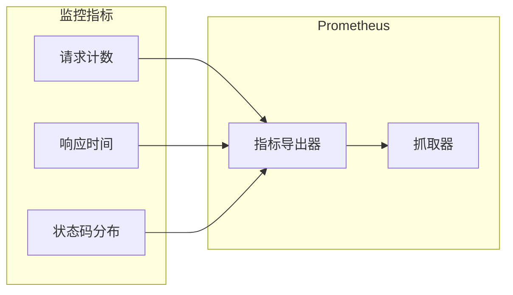
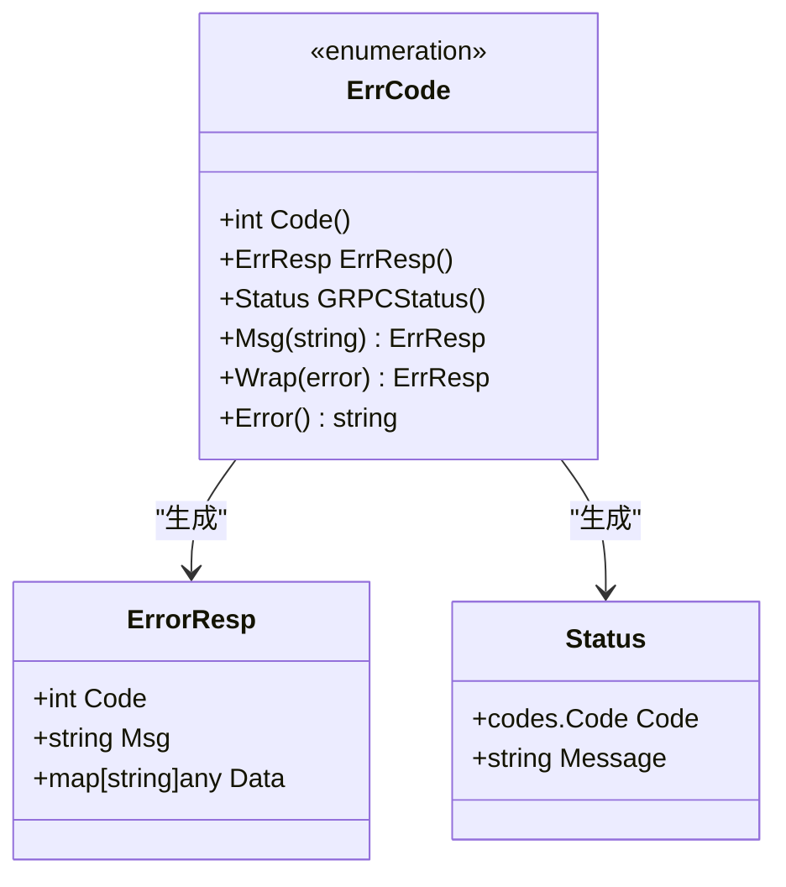
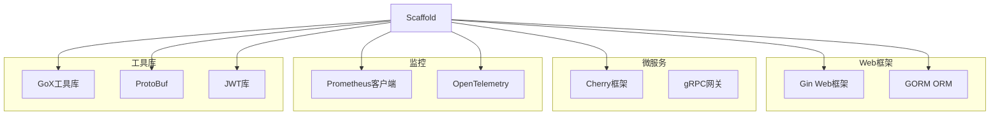
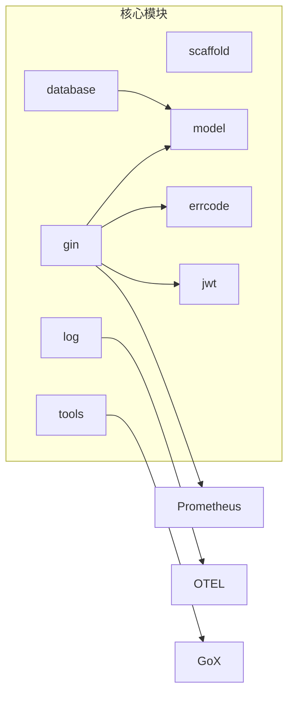

# scaffold开发脚手架

<cite>
**本文档引用的文件**
- [README.md](file://thirdparty/scaffold/README.md)
- [go.mod](file://thirdparty/scaffold/go.mod)
- [toentity.go](file://thirdparty/scaffold/database/toentity/toentity.go)
- [dbtoentity.go](file://thirdparty/scaffold/database/mysql/dbtoentity/dbtoentity.go)
- [crud.go](file://thirdparty/scaffold/gin/crud/crud.go)
- [wrap.go](file://thirdparty/scaffold/gin/wrap/wrap.go)
- [prometheus.go](file://thirdparty/scaffold/gin/prometheus.go)
- [jwt.go](file://thirdparty/scaffold/jwt/jwt.go)
- [model.go](file://thirdparty/scaffold/model/model.go)
- [errorcode.custom.go](file://thirdparty/scaffold/errcode/errorcode.custom.go)
- [device_info.go](file://thirdparty/scaffold/context/device_info.go)
- [core.go](file://thirdparty/scaffold/log/elasticsearch/core.go)
</cite>

## 目录
1. [简介](#简介)
2. [项目结构](#项目结构)
3. [核心组件](#核心组件)
4. [架构总览](#架构总览)
5. [详细组件分析](#详细组件分析)
6. [依赖分析](#依赖分析)
7. [性能考虑](#性能考虑)
8. [故障排除指南](#故障排除指南)
9. [结论](#结论)
10. [附录](#附录)

## 简介
本项目是一个基于Go语言的开发脚手架工具，旨在快速生成后端服务所需的代码骨架，包括：
- 数据库实体生成：从MySQL数据库表结构自动生成Go实体模型
- CRUD操作封装：为任意GORM模型自动注册标准REST接口
- API路由生成：基于约定的URL模式和中间件体系
- 中间件模板：提供认证、指标监控、日志等常用中间件
- 错误码体系：统一的错误码定义与响应格式
- Cherry框架集成：与Cherry微服务框架无缝协作

该脚手架通过模板系统和AST生成技术，将数据库元数据转换为高质量的Go代码，显著提升开发效率并保证代码风格一致性。

## 项目结构
脚手架采用模块化设计，按功能域划分目录结构：



**图表来源**
- [go.mod:1-155](file://thirdparty/scaffold/go.mod#L1-L155)
- [toentity.go:1-150](file://thirdparty/scaffold/database/toentity/toentity.go#L1-L150)
- [crud.go:1-161](file://thirdparty/scaffold/gin/crud/crud.go#L1-L161)

**章节来源**
- [README.md:1-3](file://thirdparty/scaffold/README.md#L1-L3)
- [go.mod:1-155](file://thirdparty/scaffold/go.mod#L1-L155)

## 核心组件
脚手架由以下核心组件构成：

### 数据库实体生成器
- 支持MySQL数据库表到Go实体的双向转换
- 自动识别字段类型并映射为Go类型
- 生成符合GORM注解规范的结构体

### CRUD操作封装
- 自动生成标准的REST接口（GET/POST/PUT/DELETE）
- 支持分页查询、排序、条件过滤
- 内置参数绑定和错误处理机制

### 中间件体系
- JWT认证中间件
- Prometheus指标监控
- 日志记录中间件
- 请求设备信息解析

### 错误码系统
- 统一的错误码枚举定义
- 支持HTTP和gRPC错误格式
- 自动注册错误消息

**章节来源**
- [toentity.go:103-150](file://thirdparty/scaffold/database/toentity/toentity.go#L103-L150)
- [crud.go:24-161](file://thirdparty/scaffold/gin/crud/crud.go#L24-L161)
- [errorcode.custom.go:15-51](file://thirdparty/scaffold/errcode/errorcode.custom.go#L15-L51)

## 架构总览
脚手架的整体架构采用分层设计，各层职责清晰：



**图表来源**
- [crud.go:30-103](file://thirdparty/scaffold/gin/crud/crud.go#L30-L103)
- [model.go:16-38](file://thirdparty/scaffold/model/model.go#L16-L38)

## 详细组件分析

### 数据库实体生成系统

#### 工作原理
实体生成系统通过以下流程实现数据库到Go代码的转换：



**图表来源**
- [dbtoentity.go:16-55](file://thirdparty/scaffold/database/mysql/dbtoentity/dbtoentity.go#L16-L55)
- [toentity.go:109-149](file://thirdparty/scaffold/database/toentity/toentity.go#L109-L149)

#### 核心算法流程


**图表来源**
- [toentity.go:131-149](file://thirdparty/scaffold/database/toentity/toentity.go#L131-L149)

**章节来源**
- [dbtoentity.go:16-55](file://thirdparty/scaffold/database/mysql/dbtoentity/dbtoentity.go#L16-L55)
- [toentity.go:103-150](file://thirdparty/scaffold/database/toentity/toentity.go#L103-L150)

### CRUD操作封装系统

#### 接口生成规则
CRUD系统遵循约定优于配置的原则，自动生成标准REST接口：

| HTTP方法 | 路径模式 | 功能描述 | 参数类型 |
|---------|----------|----------|----------|
| GET | /api/{model}/{id} | 获取单个记录 | 路径参数 |
| POST | /api/{model} | 创建新记录 | JSON请求体 |
| PUT | /api/{model} | 更新完整记录 | JSON请求体 |
| PUT | /api/{model}/edit | 更新部分记录 | JSON请求体 |
| DELETE | /api/{model}/{id} | 删除记录 | 路径参数 |
| DELETE | /api/{model} | 批量删除 | JSON请求体 |

#### 处理流程图


**图表来源**
- [crud.go:30-103](file://thirdparty/scaffold/gin/crud/crud.go#L30-L103)

**章节来源**
- [crud.go:24-161](file://thirdparty/scaffold/gin/crud/crud.go#L24-L161)

### 中间件模板系统

#### JWT认证中间件
JWT中间件提供完整的身份认证能力：



**图表来源**
- [jwt.go:41-55](file://thirdparty/scaffold/jwt/jwt.go#L41-L55)

#### Prometheus监控中间件
监控中间件提供实时的性能指标收集：



**图表来源**
- [prometheus.go:9-13](file://thirdparty/scaffold/gin/prometheus.go#L9-L13)

**章节来源**
- [jwt.go:12-55](file://thirdparty/scaffold/jwt/jwt.go#L12-L55)
- [prometheus.go:1-13](file://thirdparty/scaffold/gin/prometheus.go#L1-L13)

### 错误码系统

#### 错误码设计原则
错误码系统采用统一的错误分类和处理机制：



**图表来源**
- [errorcode.custom.go:15-51](file://thirdparty/scaffold/errcode/errorcode.custom.go#L15-L51)

**章节来源**
- [errorcode.custom.go:15-51](file://thirdparty/scaffold/errcode/errorcode.custom.go#L15-L51)

### 数据模型基类

#### 基础模型设计
提供通用的数据模型基类，支持软删除和时间戳管理：

| 字段名 | 类型 | 注释 | GORM标签 |
|--------|------|------|----------|
| ID | uint | 主键 | primarykey |
| CreatedAt | time.Time | 创建时间 | default:now() |
| UpdatedAt | time.Time | 更新时间 |  |
| DeletedAt | gorm.DeletedAt | 软删除标记 | index |

**章节来源**
- [model.go:16-38](file://thirdparty/scaffold/model/model.go#L16-L38)

## 依赖分析

### 外部依赖关系
脚手架依赖以下核心库：



**图表来源**
- [go.mod:5-35](file://thirdparty/scaffold/go.mod#L5-L35)

### 内部模块依赖


**图表来源**
- [go.mod:1-155](file://thirdparty/scaffold/go.mod#L1-L155)

**章节来源**
- [go.mod:1-155](file://thirdparty/scaffold/go.mod#L1-L155)

## 性能考虑
脚手架在设计时充分考虑了性能因素：

### 代码生成优化
- 使用AST直接生成Go代码，避免字符串拼接的性能损耗
- 批量处理多个表的生成任务，减少I/O开销
- 缓存类型映射关系，提高转换效率

### 运行时性能
- 中间件采用链式调用，最小化额外开销
- Prometheus指标收集采用异步方式
- JWT验证使用内存缓存提高验证速度

### 数据库性能
- CRUD操作使用GORM的预编译语句
- 分页查询使用LIMIT和OFFSET优化
- 索引字段自动添加数据库索引

## 故障排除指南

### 常见问题及解决方案

#### 数据库连接问题
- 检查数据库连接字符串格式
- 确认数据库服务正常运行
- 验证用户权限配置

#### 代码生成失败
- 确认数据库表结构完整
- 检查字段类型是否被正确识别
- 验证目标目录写权限

#### API接口异常
- 检查路由注册是否正确
- 验证中间件顺序配置
- 确认参数绑定规则

#### JWT认证失败
- 验证Token签名密钥
- 检查Token过期时间
- 确认Token格式正确性

**章节来源**
- [crud.go:35-44](file://thirdparty/scaffold/gin/crud/crud.go#L35-L44)
- [jwt.go:41-55](file://thirdparty/scaffold/jwt/jwt.go#L41-L55)

## 结论
本脚手架工具通过模块化设计和自动化代码生成功能，显著提升了Go语言后端开发的效率。其主要优势包括：

1. **高度自动化**：从数据库到API的全链路代码生成
2. **标准化输出**：统一的代码风格和错误处理机制
3. **可扩展性强**：模块化架构便于功能扩展和定制
4. **性能优化**：针对生产环境的性能考量和优化

建议在实际项目中结合具体需求进行定制化开发，充分利用脚手架的扩展点来满足特定的业务场景。

## 附录

### 安装配置指南
1. 克隆项目到本地
2. 安装Go 1.25+环境
3. 配置数据库连接信息
4. 运行代码生成命令
5. 启动服务进行测试

### 使用示例
```go
// 生成数据库实体
scaffold.GenerateEntity("config.toml")

// 注册CRUD接口
scaffold.RegisterCRUD(router, db, User{})

// 添加中间件
router.Use(scaffold.JWTMiddleware(secret))
```

### 自定义扩展方法
1. 扩展新的数据库适配器
2. 添加自定义中间件
3. 定制错误码定义
4. 集成新的监控系统