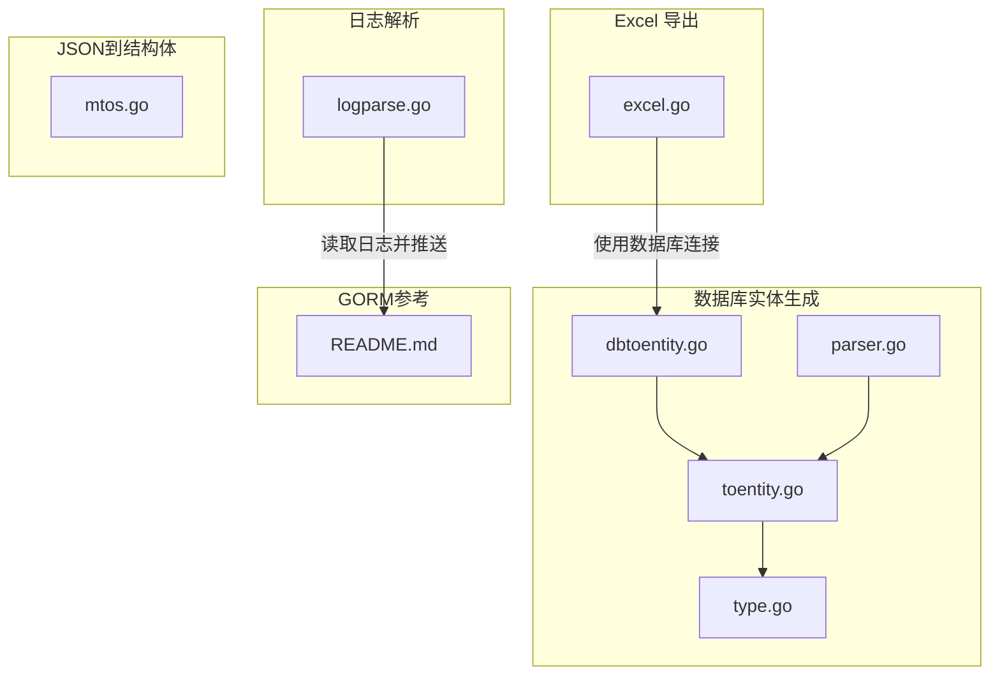
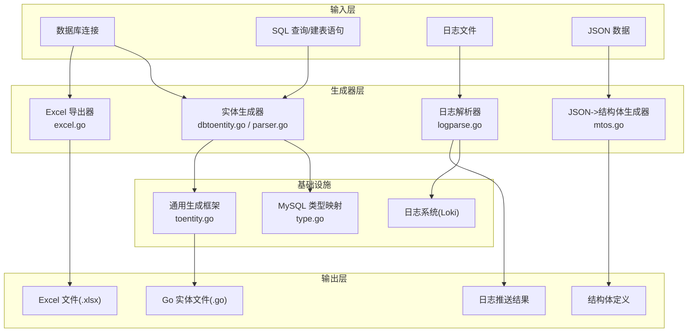
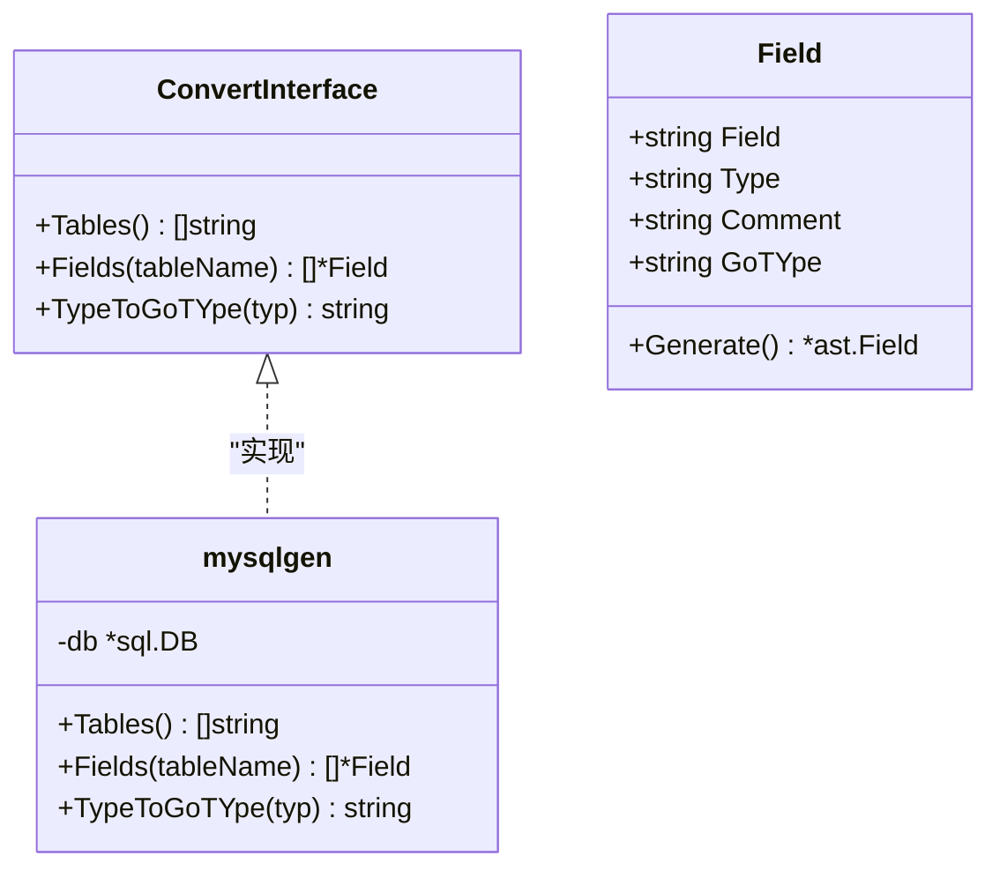
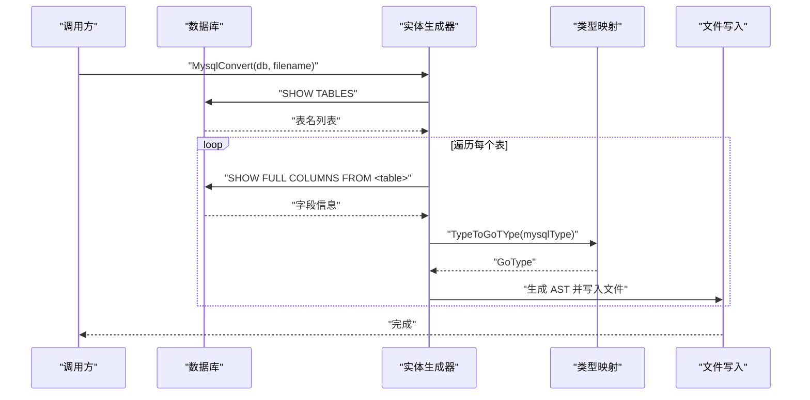
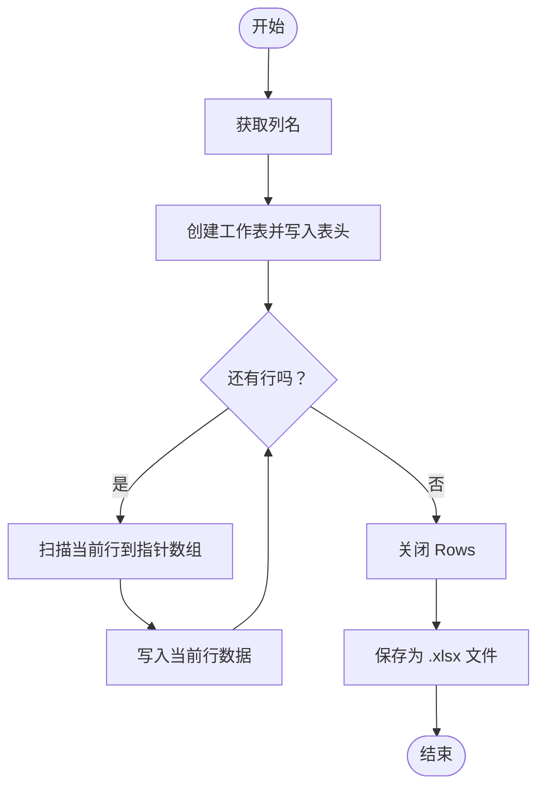
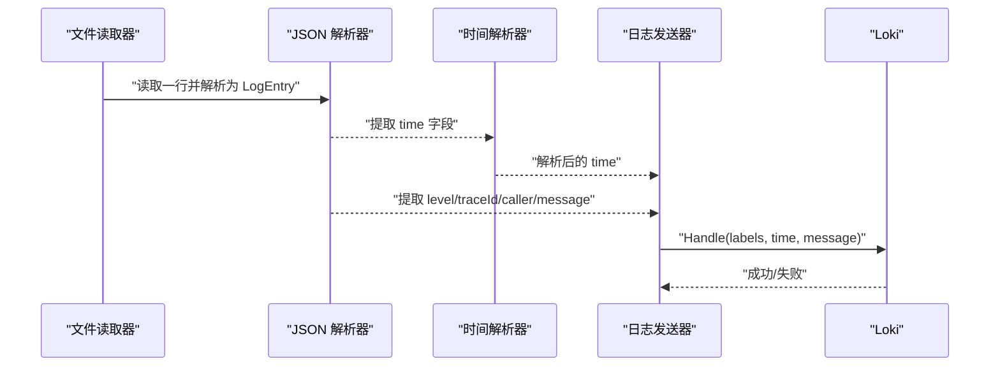
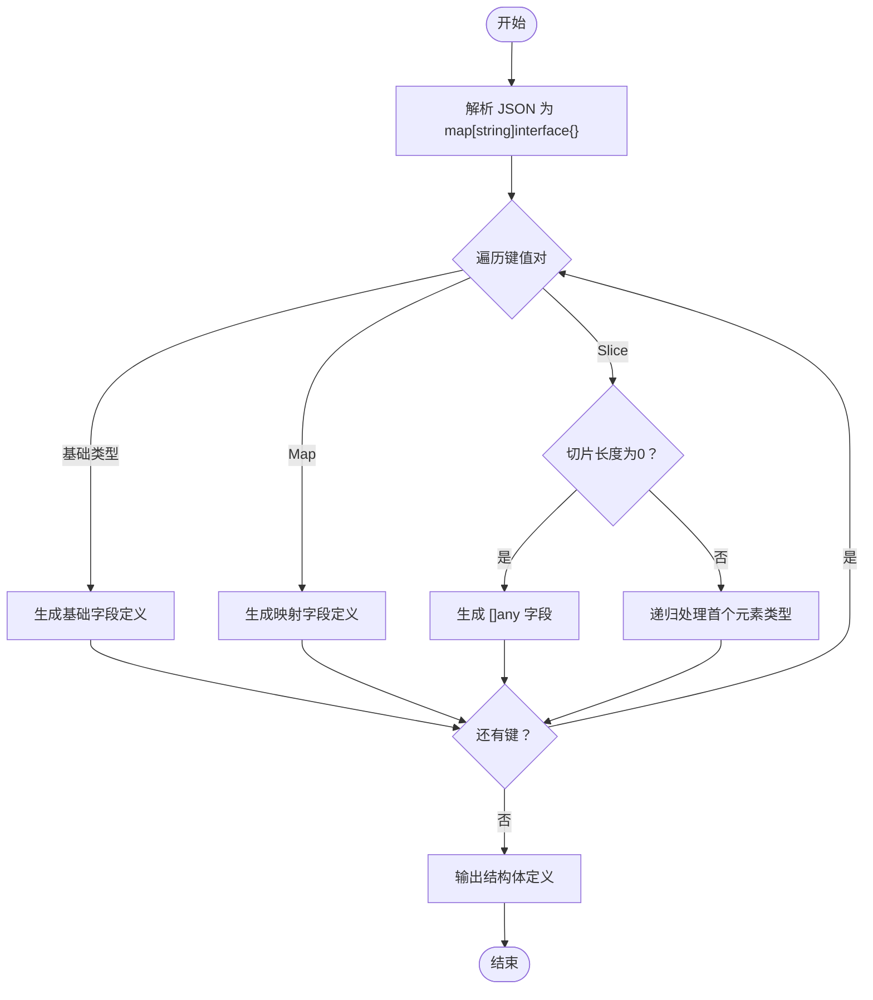
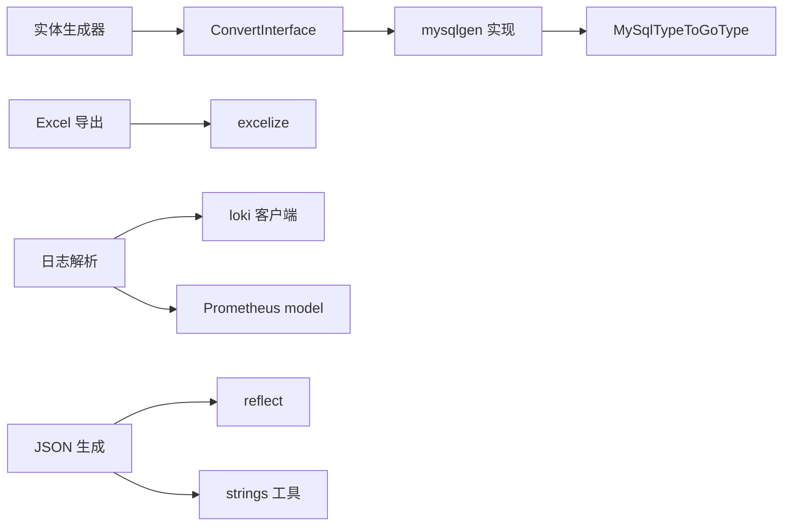

# 代码生成器

<cite>
**本文档引用的文件**
- [dbtoentity.go](file://thirdparty/scaffold/database/mysql/dbtoentity/dbtoentity.go)
- [parser.go](file://thirdparty/scaffold/database/mysql/dbtoentity/parser/parser.go)
- [toentity.go](file://thirdparty/scaffold/database/toentity/toentity.go)
- [type.go](file://thirdparty/gox/database/sql/mysql/type.go)
- [excel.go](file://thirdparty/scaffold/export/excel/excel.go)
- [logparse.go](file://thirdparty/scaffold/tools/logparse/logparse.go)
- [mtos.go](file://thirdparty/gox/tools/codegen/mtos/mtos.go)
- [README.md](file://thirdparty/gox/tools/codegen/gorm/README.md)
</cite>

## 目录
1. [简介](#简介)
2. [项目结构](#项目结构)
3. [核心组件](#核心组件)
4. [架构总览](#架构总览)
5. [详细组件分析](#详细组件分析)
6. [依赖关系分析](#依赖关系分析)
7. [性能考虑](#性能考虑)
8. [故障排除指南](#故障排除指南)
9. [结论](#结论)
10. [附录](#附录)

## 简介
本文件面向“代码生成器”功能，系统性介绍以下三类工具的使用方法与实现原理：
- 数据库实体生成器：从数据库表结构自动生成 Go 实体模型代码，支持按库或按表生成。
- Excel 导出工具：基于 SQL 查询结果批量导出为 Excel 文件。
- 日志解析器：解析结构化日志并推送至日志系统（以 Loki 为例）。

文档涵盖配置参数、使用示例、输出结果说明，并总结生成代码的结构特点、命名规范与扩展方法，帮助开发者快速上手与二次开发。

## 项目结构
围绕代码生成器的相关模块主要分布在以下路径：
- 数据库实体生成：thirdparty/scaffold/database/mysql/dbtoentity、thirdparty/scaffold/database/toentity、thirdparty/gox/database/sql/mysql
- Excel 导出：thirdparty/scaffold/export/excel
- 日志解析：thirdparty/scaffold/tools/logparse
- JSON 到结构体生成：thirdparty/gox/tools/codegen/mtos
- GORM 代码生成参考：thirdparty/gox/tools/codegen/gorm

**图表来源**
- [dbtoentity.go:1-55](file://thirdparty/scaffold/database/mysql/dbtoentity/dbtoentity.go#L1-L55)
- [parser.go:1-55](file://thirdparty/scaffold/database/mysql/dbtoentity/parser/parser.go#L1-L55)
- [toentity.go:1-150](file://thirdparty/scaffold/database/toentity/toentity.go#L1-L150)
- [type.go:1-26](file://thirdparty/gox/database/sql/mysql/type.go#L1-L26)
- [excel.go:1-59](file://thirdparty/scaffold/export/excel/excel.go#L1-L59)
- [logparse.go:1-75](file://thirdparty/scaffold/tools/logparse/logparse.go#L1-L75)
- [mtos.go:1-78](file://thirdparty/gox/tools/codegen/mtos/mtos.go#L1-L78)
- [README.md:1-2](file://thirdparty/gox/tools/codegen/gorm/README.md#L1-L2)

**章节来源**
- [dbtoentity.go:1-55](file://thirdparty/scaffold/database/mysql/dbtoentity/dbtoentity.go#L1-L55)
- [parser.go:1-55](file://thirdparty/scaffold/database/mysql/dbtoentity/parser/parser.go#L1-L55)
- [toentity.go:1-150](file://thirdparty/scaffold/database/toentity/toentity.go#L1-L150)
- [type.go:1-26](file://thirdparty/gox/database/sql/mysql/type.go#L1-L26)
- [excel.go:1-59](file://thirdparty/scaffold/export/excel/excel.go#L1-L59)
- [logparse.go:1-75](file://thirdparty/scaffold/tools/logparse/logparse.go#L1-L75)
- [mtos.go:1-78](file://thirdparty/gox/tools/codegen/mtos/mtos.go#L1-L78)
- [README.md:1-2](file://thirdparty/gox/tools/codegen/gorm/README.md#L1-L2)

## 核心组件
- 数据库实体生成器
  - 支持两种入口：按库生成所有表实体；按表生成单个实体。
  - 通过接口抽象数据库访问，内置 MySQL 类型映射。
- Excel 导出工具
  - 基于数据库查询结果集导出为 Excel 文件，自动处理列名与空值。
- 日志解析器
  - 逐行解析结构化日志，提取时间、级别、追踪 ID、调用者与消息，推送至日志系统。
- JSON 到结构体生成器
  - 将 JSON 结构递归解析为 Go 结构体定义，支持嵌套对象与切片。

**章节来源**
- [dbtoentity.go:16-24](file://thirdparty/scaffold/database/mysql/dbtoentity/dbtoentity.go#L16-L24)
- [toentity.go:103-129](file://thirdparty/scaffold/database/toentity/toentity.go#L103-L129)
- [excel.go:18-58](file://thirdparty/scaffold/export/excel/excel.go#L18-L58)
- [logparse.go:28-74](file://thirdparty/scaffold/tools/logparse/logparse.go#L28-L74)
- [mtos.go:20-49](file://thirdparty/gox/tools/codegen/mtos/mtos.go#L20-L49)

## 架构总览
下图展示代码生成器各模块之间的交互关系与数据流向：

**图表来源**
- [dbtoentity.go:16-24](file://thirdparty/scaffold/database/mysql/dbtoentity/dbtoentity.go#L16-L24)
- [parser.go:15-18](file://thirdparty/scaffold/database/mysql/dbtoentity/parser/parser.go#L15-L18)
- [toentity.go:109-129](file://thirdparty/scaffold/database/toentity/toentity.go#L109-L129)
- [type.go:11-25](file://thirdparty/gox/database/sql/mysql/type.go#L11-L25)
- [excel.go:18-58](file://thirdparty/scaffold/export/excel/excel.go#L18-L58)
- [logparse.go:28-74](file://thirdparty/scaffold/tools/logparse/logparse.go#L28-L74)
- [mtos.go:20-49](file://thirdparty/gox/tools/codegen/mtos/mtos.go#L20-L49)

## 详细组件分析

### 数据库实体生成器
- 功能概述
  - 从数据库表结构生成 Go 实体模型，支持按库或按表生成。
  - 自动将 MySQL 字段类型映射为 Go 类型。
- 接口与流程
  - ConvertInterface 定义了获取表名列表、字段信息与类型映射的方法。
  - Convert/ConvertByTable 负责遍历表、生成 AST 并落盘。
- 关键实现要点
  - 表名与字段名采用蛇形转驼峰策略。
  - 字段标签包含 json 与 comment 两部分。
  - 类型映射由 mysql.MySqlTypeToGoType 提供。

**图表来源**
- [toentity.go:103-107](file://thirdparty/scaffold/database/toentity/toentity.go#L103-L107)
- [dbtoentity.go:26-54](file://thirdparty/scaffold/database/mysql/dbtoentity/dbtoentity.go#L26-L54)
- [toentity.go:54-75](file://thirdparty/scaffold/database/toentity/toentity.go#L54-L75)

**图表来源**
- [dbtoentity.go:16-24](file://thirdparty/scaffold/database/mysql/dbtoentity/dbtoentity.go#L16-L24)
- [toentity.go:109-129](file://thirdparty/scaffold/database/toentity/toentity.go#L109-L129)
- [type.go:11-25](file://thirdparty/gox/database/sql/mysql/type.go#L11-L25)

**章节来源**
- [dbtoentity.go:16-24](file://thirdparty/scaffold/database/mysql/dbtoentity/dbtoentity.go#L16-L24)
- [toentity.go:109-149](file://thirdparty/scaffold/database/toentity/toentity.go#L109-L149)
- [type.go:11-25](file://thirdparty/gox/database/sql/mysql/type.go#L11-L25)

### Excel 导出工具
- 功能概述
  - 将 sql.Rows 的查询结果导出为 Excel 文件，首行为列名，后续为数据行。
- 使用流程
  - 获取列名 -> 创建工作簿 -> 写入表头 -> 循环扫描行并写入 -> 保存文件。

**图表来源**
- [excel.go:18-58](file://thirdparty/scaffold/export/excel/excel.go#L18-L58)

**章节来源**
- [excel.go:18-58](file://thirdparty/scaffold/export/excel/excel.go#L18-L58)

### 日志解析器
- 功能概述
  - 逐行读取日志文件，解析 JSON，提取时间、级别、追踪 ID、调用者与消息，推送到日志系统。
- 关键点
  - 时间解析遵循固定格式。
  - 标签集合包含 level、traceId、caller。
  - 使用客户端发送后确保 Stop() 清理资源。

**图表来源**
- [logparse.go:28-74](file://thirdparty/scaffold/tools/logparse/logparse.go#L28-L74)

**章节来源**
- [logparse.go:28-74](file://thirdparty/scaffold/tools/logparse/logparse.go#L28-L74)

### JSON 到结构体生成器
- 功能概述
  - 将任意 JSON 数据递归解析为 Go 结构体定义，支持字符串、整数、浮点、布尔、接口、映射与切片。
- 命名与标签
  - 字段名采用蛇形转驼峰。
  - 标签类型由传入 tag 参数决定（如 json）。
- 扩展建议
  - 当切片元素类型不一致时，可扩展类型推断逻辑。
  - 支持更多基础类型与复杂类型的组合。

**图表来源**
- [mtos.go:20-77](file://thirdparty/gox/tools/codegen/mtos/mtos.go#L20-L77)

**章节来源**
- [mtos.go:20-77](file://thirdparty/gox/tools/codegen/mtos/mtos.go#L20-L77)

## 依赖关系分析
- 组件耦合
  - 实体生成器通过 ConvertInterface 与具体数据库实现解耦，便于扩展其他数据库。
  - 类型映射集中于 mysql.MySqlTypeToGoType，避免重复逻辑。
- 外部依赖
  - Excel 导出依赖 excelize 库。
  - 日志解析依赖 loki 客户端与 Prometheus 模型。
  - JSON 生成依赖反射与字符串工具库。

**图表来源**
- [toentity.go:103-107](file://thirdparty/scaffold/database/toentity/toentity.go#L103-L107)
- [dbtoentity.go:26-54](file://thirdparty/scaffold/database/mysql/dbtoentity/dbtoentity.go#L26-L54)
- [type.go:11-25](file://thirdparty/gox/database/sql/mysql/type.go#L11-L25)
- [excel.go:3-7](file://thirdparty/scaffold/export/excel/excel.go#L3-L7)
- [logparse.go:9-18](file://thirdparty/scaffold/tools/logparse/logparse.go#L9-L18)
- [mtos.go:9-18](file://thirdparty/gox/tools/codegen/mtos/mtos.go#L9-L18)

**章节来源**
- [toentity.go:103-107](file://thirdparty/scaffold/database/toentity/toentity.go#L103-L107)
- [dbtoentity.go:26-54](file://thirdparty/scaffold/database/mysql/dbtoentity/dbtoentity.go#L26-L54)
- [type.go:11-25](file://thirdparty/gox/database/sql/mysql/type.go#L11-L25)
- [excel.go:3-7](file://thirdparty/scaffold/export/excel/excel.go#L3-L7)
- [logparse.go:9-18](file://thirdparty/scaffold/tools/logparse/logparse.go#L9-L18)
- [mtos.go:9-18](file://thirdparty/gox/tools/codegen/mtos/mtos.go#L9-L18)

## 性能考虑
- 实体生成
  - 使用 AST 一次性构建结构体，避免字符串拼接带来的格式化开销。
  - 类型映射为常量时间查找，整体复杂度近似 O(N×M)，N 为表数量，M 为字段数量。
- Excel 导出
  - 每行扫描使用指针数组减少拷贝，适合大批量数据导出。
  - 建议在内存允许的情况下分批处理，避免一次性加载过多行。
- 日志解析
  - 逐行读取，内存占用稳定；注意大文件时的磁盘 IO 与网络发送速率。
  - 可调整批次等待时间以平衡延迟与吞吐。

[本节为通用指导，无需特定文件来源]

## 故障排除指南
- 实体生成无输出或输出为空
  - 检查数据库连接与权限，确认 Tables() 能正确返回表名。
  - 确认 TypeToGoTYpe 返回有效 Go 类型。
- Excel 导出列名缺失或乱码
  - 确认 sql.Rows.Columns() 正常返回列名。
  - 检查编码与 excelize 版本兼容性。
- 日志解析报错
  - 校验日志时间格式与 JSON 结构一致性。
  - 检查 Loki 地址与网络连通性。

**章节来源**
- [toentity.go:109-129](file://thirdparty/scaffold/database/toentity/toentity.go#L109-L129)
- [excel.go:18-58](file://thirdparty/scaffold/export/excel/excel.go#L18-L58)
- [logparse.go:28-74](file://thirdparty/scaffold/tools/logparse/logparse.go#L28-L74)

## 结论
本代码生成器体系提供了从数据库、日志到结构体定义的多维生成能力。通过接口抽象与类型映射，具备良好的可扩展性；通过 AST 与第三方库集成，兼顾性能与易用性。建议在实际项目中结合业务需求扩展类型映射、标签策略与错误处理机制。

[本节为总结性内容，无需特定文件来源]

## 附录

### 配置参数与使用示例

- 数据库实体生成器
  - 入口函数
    - 按库生成：调用 MysqlConvert(db, filename)
    - 按表生成：调用 MysqlConvertByTable(db, tableName)
  - 关键参数
    - db：数据库连接对象
    - filename/tableName：目标文件名或表名
  - 输出
    - 生成对应 Go 实体文件，字段标签包含 json 与 comment
  - 示例路径
    - [dbtoentity.go:16-24](file://thirdparty/scaffold/database/mysql/dbtoentity/dbtoentity.go#L16-L24)
    - [toentity.go:109-129](file://thirdparty/scaffold/database/toentity/toentity.go#L109-L129)

- Excel 导出工具
  - 入口函数
    - Export(rows, filename)
  - 关键参数
    - rows：数据库查询结果集
    - filename：输出文件路径（.xlsx）
  - 输出
    - 生成 Excel 文件，首行为列名，后续为数据行
  - 示例路径
    - [excel.go:18-58](file://thirdparty/scaffold/export/excel/excel.go#L18-L58)

- 日志解析器
  - 入口函数
    - main() 作为示例程序
  - 关键参数
    - 日志文件路径、Loki 推送地址
  - 输出
    - 成功推送日志并打印提示
  - 示例路径
    - [logparse.go:28-74](file://thirdparty/scaffold/tools/logparse/logparse.go#L28-L74)

- JSON 到结构体生成器
  - 入口函数
    - ParseJson(data []byte)：解析字节流
    - Gen(writer, name, m, tag)：递归生成结构体
  - 关键参数
    - data：JSON 字节流
    - name：结构体名称
    - m：map[string]interface{} 解析结果
    - tag：标签类型（如 json）
  - 输出
    - 返回结构体定义字符串或写入到 writer
  - 示例路径
    - [mtos.go:20-49](file://thirdparty/gox/tools/codegen/mtos/mtos.go#L20-L49)

### 生成代码的结构特点与命名规范
- 结构体命名
  - 表名与字段名采用蛇形转驼峰策略，首字母大写用于导出。
- 字段标签
  - 默认包含 json 与 comment 两部分，便于序列化与注释保留。
- 类型映射
  - MySQL 类型到 Go 类型的映射集中在 mysql.MySqlTypeToGoType，覆盖常见类型。
- 扩展方法
  - 新增数据库支持：实现 ConvertInterface 接口并注册类型映射。
  - 自定义标签：修改 toentity.TagTmpl 或 Gen 函数的标签生成逻辑。
  - 支持更多复杂类型：在 mtos.generateFieldCode 中扩展分支逻辑。

**章节来源**
- [toentity.go:21-36](file://thirdparty/scaffold/database/toentity/toentity.go#L21-L36)
- [toentity.go:61-75](file://thirdparty/scaffold/database/toentity/toentity.go#L61-L75)
- [type.go:11-25](file://thirdparty/gox/database/sql/mysql/type.go#L11-L25)
- [mtos.go:56-77](file://thirdparty/gox/tools/codegen/mtos/mtos.go#L56-L77)