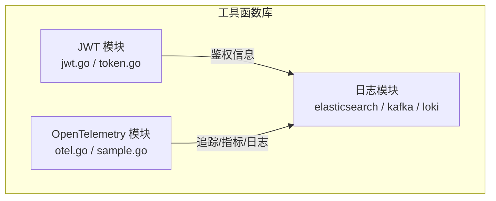
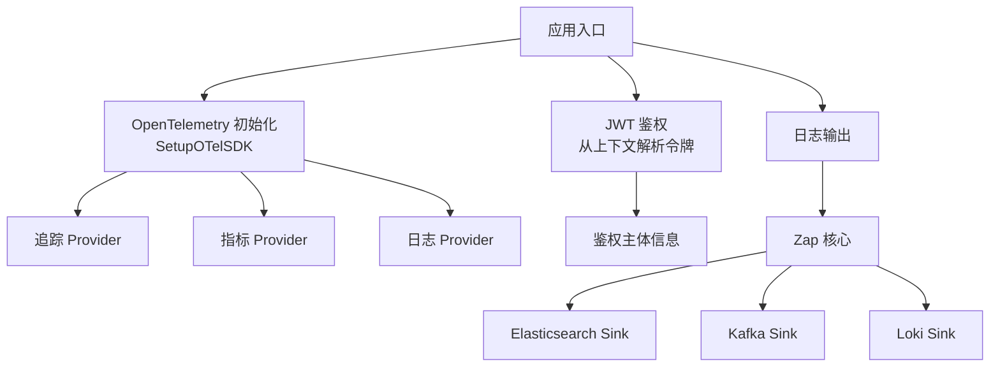
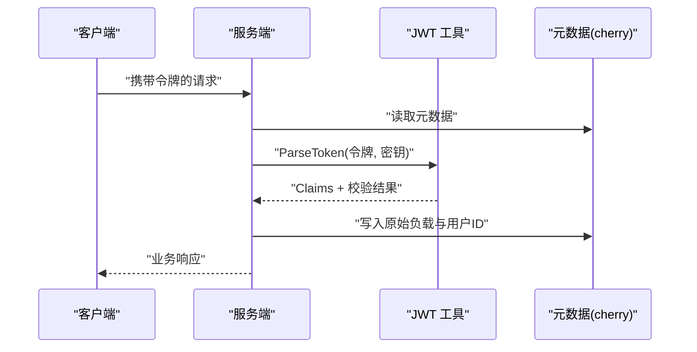
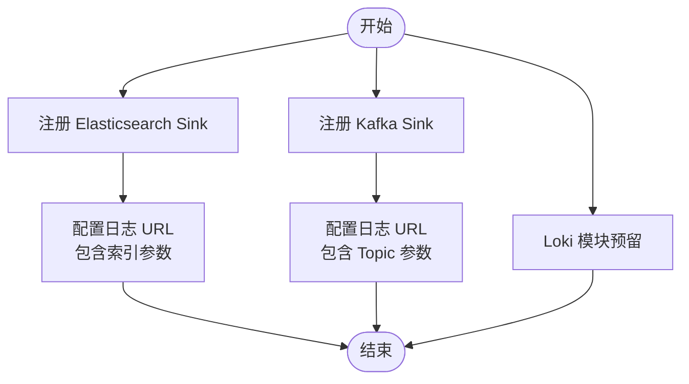
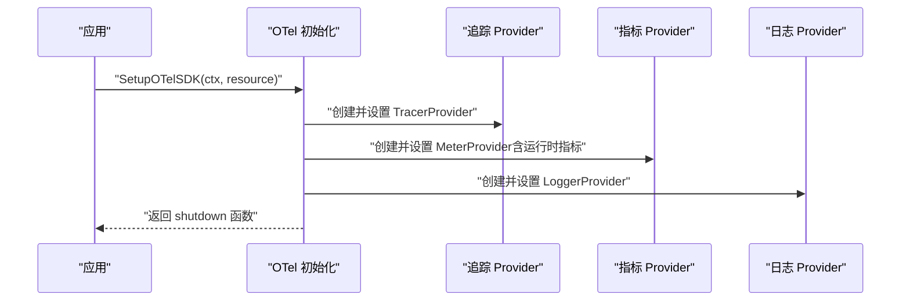
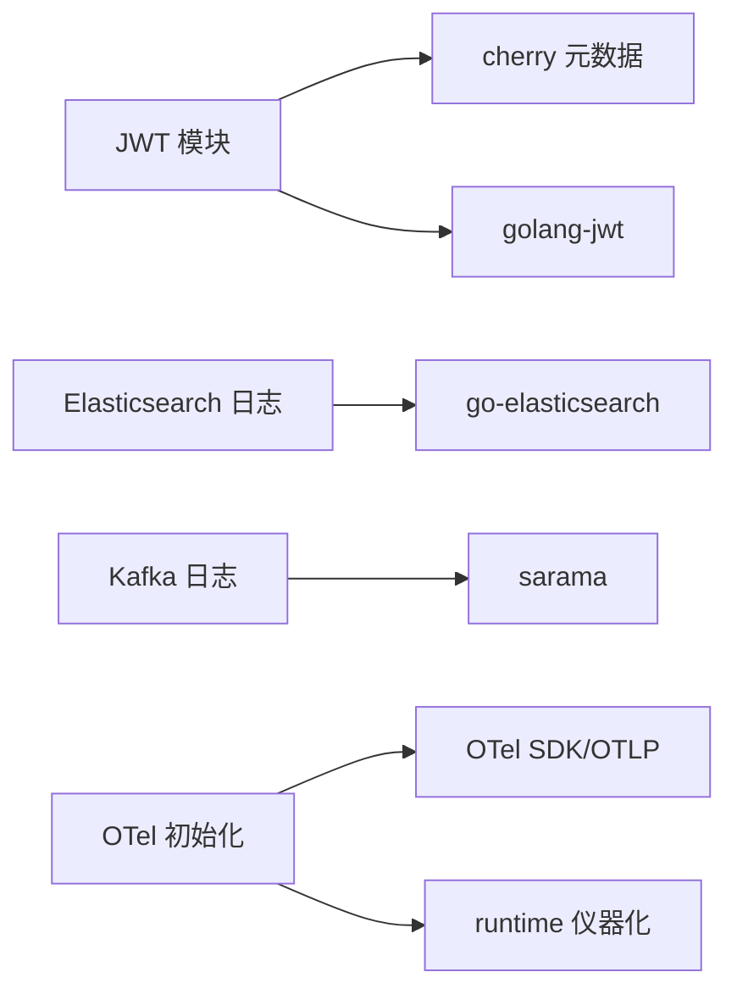

# 工具函数库

<cite>
**本文档引用的文件**
- [thirdparty/scaffold/jwt/jwt.go](file://thirdparty/scaffold/jwt/jwt.go)
- [thirdparty/scaffold/jwt/token.go](file://thirdparty/scaffold/jwt/token.go)
- [thirdparty/scaffold/log/elasticsearch/core.go](file://thirdparty/scaffold/log/elasticsearch/core.go)
- [thirdparty/scaffold/log/elasticsearch/sink.go](file://thirdparty/scaffold/log/elasticsearch/sink.go)
- [thirdparty/scaffold/log/kafka/core.go](file://thirdparty/scaffold/log/kafka/core.go)
- [thirdparty/scaffold/log/kafka/sink.go](file://thirdparty/scaffold/log/kafka/sink.go)
- [thirdparty/scaffold/log/loki/core.go](file://thirdparty/scaffold/log/loki/core.go)
- [thirdparty/scaffold/log/loki/sink.go](file://thirdparty/scaffold/log/loki/sink.go)
- [thirdparty/scaffold/otel/otel.go](file://thirdparty/scaffold/otel/otel.go)
- [thirdparty/scaffold/otel/sample.go](file://thirdparty/scaffold/otel/sample.go)
</cite>

## 目录
1. [简介](#简介)
2. [项目结构](#项目结构)
3. [核心组件](#核心组件)
4. [架构总览](#架构总览)
5. [详细组件分析](#详细组件分析)
6. [依赖分析](#依赖分析)
7. [性能考虑](#性能考虑)
8. [故障排查指南](#故障排查指南)
9. [结论](#结论)
10. [附录](#附录)

## 简介
本文件面向工具函数库的使用者与维护者，系统性介绍以下能力：
- JWT认证工具：令牌生成、解析与上下文鉴权提取
- 日志系统集成：Elasticsearch、Kafka、Loki 的写入与查询入口
- OpenTelemetry监控集成：追踪、指标与日志导出的初始化与配置
并提供配置参数、使用示例与集成指南，以及性能监控最佳实践与故障排查方法。

## 项目结构
工具函数库位于 thirdparty/scaffold 目录下，按功能域划分：
- jwt：JWT 令牌生成与解析、上下文鉴权提取
- log：日志系统集成（elasticsearch、kafka、loki）
- otel：OpenTelemetry 初始化与采样策略

**图表来源**
- [thirdparty/scaffold/jwt/jwt.go:1-55](file://thirdparty/scaffold/jwt/jwt.go#L1-L55)
- [thirdparty/scaffold/jwt/token.go:1-68](file://thirdparty/scaffold/jwt/token.go#L1-L68)
- [thirdparty/scaffold/log/elasticsearch/sink.go:1-46](file://thirdparty/scaffold/log/elasticsearch/sink.go#L1-L46)
- [thirdparty/scaffold/log/kafka/sink.go:1-57](file://thirdparty/scaffold/log/kafka/sink.go#L1-L57)
- [thirdparty/scaffold/log/loki/sink.go:1-8](file://thirdparty/scaffold/log/loki/sink.go#L1-L8)
- [thirdparty/scaffold/otel/otel.go:1-135](file://thirdparty/scaffold/otel/otel.go#L1-L135)

**章节来源**
- [thirdparty/scaffold/jwt/jwt.go:1-55](file://thirdparty/scaffold/jwt/jwt.go#L1-L55)
- [thirdparty/scaffold/jwt/token.go:1-68](file://thirdparty/scaffold/jwt/token.go#L1-L68)
- [thirdparty/scaffold/log/elasticsearch/core.go:1-24](file://thirdparty/scaffold/log/elasticsearch/core.go#L1-L24)
- [thirdparty/scaffold/log/elasticsearch/sink.go:1-46](file://thirdparty/scaffold/log/elasticsearch/sink.go#L1-L46)
- [thirdparty/scaffold/log/kafka/core.go:1-24](file://thirdparty/scaffold/log/kafka/core.go#L1-L24)
- [thirdparty/scaffold/log/kafka/sink.go:1-57](file://thirdparty/scaffold/log/kafka/sink.go#L1-L57)
- [thirdparty/scaffold/log/loki/core.go:1-8](file://thirdparty/scaffold/log/loki/core.go#L1-L8)
- [thirdparty/scaffold/log/loki/sink.go:1-8](file://thirdparty/scaffold/log/loki/sink.go#L1-L8)
- [thirdparty/scaffold/otel/otel.go:1-135](file://thirdparty/scaffold/otel/otel.go#L1-L135)
- [thirdparty/scaffold/otel/sample.go:1-36](file://thirdparty/scaffold/otel/sample.go#L1-L36)

## 核心组件
- JWT 认证工具
  - Claims 泛型承载鉴权主体与标准声明
  - 生成与解析接口，支持自定义解析选项
  - 从上下文提取令牌并校验，填充原始负载与用户ID
- 日志系统集成
  - Elasticsearch：注册自定义 sink，支持通过 URL 参数配置索引
  - Kafka：注册自定义 sink，支持同步生产消息到指定 Topic
  - Loki：预留模块入口（当前为空实现）
- OpenTelemetry 监控集成
  - 初始化追踪、指标与日志导出器
  - 支持自定义采样策略（如基于状态码的错误全采样）

**章节来源**
- [thirdparty/scaffold/jwt/token.go:31-68](file://thirdparty/scaffold/jwt/token.go#L31-L68)
- [thirdparty/scaffold/jwt/jwt.go:12-55](file://thirdparty/scaffold/jwt/jwt.go#L12-L55)
- [thirdparty/scaffold/log/elasticsearch/sink.go:33-46](file://thirdparty/scaffold/log/elasticsearch/sink.go#L33-L46)
- [thirdparty/scaffold/log/kafka/sink.go:15-57](file://thirdparty/scaffold/log/kafka/sink.go#L15-L57)
- [thirdparty/scaffold/log/loki/sink.go:1-8](file://thirdparty/scaffold/log/loki/sink.go#L1-L8)
- [thirdparty/scaffold/otel/otel.go:26-135](file://thirdparty/scaffold/otel/otel.go#L26-L135)
- [thirdparty/scaffold/otel/sample.go:9-36](file://thirdparty/scaffold/otel/sample.go#L9-L36)

## 架构总览
工具函数库通过统一的初始化流程接入 OpenTelemetry，并在日志模块中以 Zap Sink 的形式对接外部系统；JWT 模块为服务端鉴权提供基础能力。

**图表来源**
- [thirdparty/scaffold/otel/otel.go:26-135](file://thirdparty/scaffold/otel/otel.go#L26-L135)
- [thirdparty/scaffold/jwt/jwt.go:41-55](file://thirdparty/scaffold/jwt/jwt.go#L41-L55)
- [thirdparty/scaffold/log/elasticsearch/sink.go:33-46](file://thirdparty/scaffold/log/elasticsearch/sink.go#L33-L46)
- [thirdparty/scaffold/log/kafka/sink.go:15-57](file://thirdparty/scaffold/log/kafka/sink.go#L15-L57)
- [thirdparty/scaffold/log/loki/sink.go:1-8](file://thirdparty/scaffold/log/loki/sink.go#L1-L8)

## 详细组件分析

### JWT 认证工具
- 设计要点
  - 使用泛型 Claims[T] 承载鉴权主体数据与标准声明
  - 提供生成与解析接口，支持 HS256 签名与自定义解析选项
  - 从上下文提取令牌，解析后回填原始负载与用户ID，便于后续中间件使用
- 关键流程
  - 生成：构造 Claims 并签名得到字符串令牌
  - 解析：使用密钥解析令牌，校验过期与签发方等
  - 上下文鉴权：从 cherry 元数据中读取令牌，解析并填充元数据字段

**图表来源**
- [thirdparty/scaffold/jwt/jwt.go:41-55](file://thirdparty/scaffold/jwt/jwt.go#L41-L55)
- [thirdparty/scaffold/jwt/token.go:53-68](file://thirdparty/scaffold/jwt/token.go#L53-L68)

**章节来源**
- [thirdparty/scaffold/jwt/token.go:31-68](file://thirdparty/scaffold/jwt/token.go#L31-L68)
- [thirdparty/scaffold/jwt/jwt.go:12-55](file://thirdparty/scaffold/jwt/jwt.go#L12-L55)

### 日志系统集成（Elasticsearch/Kafka/Loki）
- 设计要点
  - 通过 Zap 注册自定义 Sink，实现对 Elasticsearch、Kafka、Loki 的写入桥接
  - Elasticsearch 与 Kafka 的 Sink 已实现注册与写入逻辑
  - Loki 模块已预留入口，当前未实现具体写入逻辑
- 配置与使用
  - Elasticsearch
    - 注册方式：调用注册函数
    - 日志目标：使用自定义 scheme 的 URL，通过查询参数传递索引
  - Kafka
    - 注册方式：调用注册函数
    - 日志目标：使用自定义 scheme 的 URL，通过查询参数传递 Topic
  - Loki
    - 当前为空实现，需后续完善

**图表来源**
- [thirdparty/scaffold/log/elasticsearch/sink.go:33-46](file://thirdparty/scaffold/log/elasticsearch/sink.go#L33-L46)
- [thirdparty/scaffold/log/kafka/sink.go:15-57](file://thirdparty/scaffold/log/kafka/sink.go#L15-L57)
- [thirdparty/scaffold/log/loki/sink.go:1-8](file://thirdparty/scaffold/log/loki/sink.go#L1-L8)

**章节来源**
- [thirdparty/scaffold/log/elasticsearch/core.go:1-24](file://thirdparty/scaffold/log/elasticsearch/core.go#L1-L24)
- [thirdparty/scaffold/log/elasticsearch/sink.go:1-46](file://thirdparty/scaffold/log/elasticsearch/sink.go#L1-L46)
- [thirdparty/scaffold/log/kafka/core.go:1-24](file://thirdparty/scaffold/log/kafka/core.go#L1-L24)
- [thirdparty/scaffold/log/kafka/sink.go:1-57](file://thirdparty/scaffold/log/kafka/sink.go#L1-L57)
- [thirdparty/scaffold/log/loki/core.go:1-8](file://thirdparty/scaffold/log/loki/core.go#L1-L8)
- [thirdparty/scaffold/log/loki/sink.go:1-8](file://thirdparty/scaffold/log/loki/sink.go#L1-L8)

### OpenTelemetry 监控集成
- 设计要点
  - 初始化追踪、指标与日志导出器，支持 OTLP HTTP 协议
  - 设置传播器（TraceContext、Baggage）
  - 启动运行时指标采集（GC、内存等），并设置采集周期
  - 提供自定义采样器示例：错误请求全采样，其余按比例采样
- 关键流程
  - 初始化：创建资源、导出器与 Provider，设置全局 Provider
  - 采样：可替换默认采样策略，按需扩展

**图表来源**
- [thirdparty/scaffold/otel/otel.go:26-135](file://thirdparty/scaffold/otel/otel.go#L26-L135)

**章节来源**
- [thirdparty/scaffold/otel/otel.go:26-135](file://thirdparty/scaffold/otel/otel.go#L26-L135)
- [thirdparty/scaffold/otel/sample.go:9-36](file://thirdparty/scaffold/otel/sample.go#L9-L36)

## 依赖分析
- 组件耦合
  - JWT 模块依赖 cherry 元数据读取能力，用于从上下文中提取令牌
  - 日志模块依赖 Zap 的 Sink 注册机制，分别对接 Elasticsearch 与 Kafka
  - OTel 模块独立初始化，不直接依赖日志模块，但可通过全局 Provider 影响日志输出
- 外部依赖
  - JWT：golang-jwt
  - Elasticsearch：go-elasticsearch
  - Kafka：sarama
  - OpenTelemetry：otel SDK、OTLP 导出器、runtime 仪器化

**图表来源**
- [thirdparty/scaffold/jwt/jwt.go:3-10](file://thirdparty/scaffold/jwt/jwt.go#L3-L10)
- [thirdparty/scaffold/jwt/token.go:9-14](file://thirdparty/scaffold/jwt/token.go#L9-L14)
- [thirdparty/scaffold/log/elasticsearch/sink.go:9-13](file://thirdparty/scaffold/log/elasticsearch/sink.go#L9-L13)
- [thirdparty/scaffold/log/kafka/sink.go:9-13](file://thirdparty/scaffold/log/kafka/sink.go#L9-L13)
- [thirdparty/scaffold/otel/otel.go:3-22](file://thirdparty/scaffold/otel/otel.go#L3-L22)

**章节来源**
- [thirdparty/scaffold/jwt/jwt.go:3-10](file://thirdparty/scaffold/jwt/jwt.go#L3-L10)
- [thirdparty/scaffold/jwt/token.go:9-14](file://thirdparty/scaffold/jwt/token.go#L9-L14)
- [thirdparty/scaffold/log/elasticsearch/sink.go:9-13](file://thirdparty/scaffold/log/elasticsearch/sink.go#L9-L13)
- [thirdparty/scaffold/log/kafka/sink.go:9-13](file://thirdparty/scaffold/log/kafka/sink.go#L9-L13)
- [thirdparty/scaffold/otel/otel.go:3-22](file://thirdparty/scaffold/otel/otel.go#L3-L22)

## 性能考虑
- 采样策略
  - 对高错误率请求进行全采样，降低漏报风险
  - 其余请求按固定比例采样，平衡开销与可观测性
- 指标采集周期
  - 指标周期与运行时指标采集间隔可调，建议结合业务峰值与资源占用评估
- 日志写入
  - Kafka 生产者采用同步发送，保证可靠性但可能影响延迟；可根据场景切换异步或批量发送
  - Elasticsearch 写入接口预留，建议实现批量化与重试机制

[本节为通用指导，无需列出章节来源]

## 故障排查指南
- JWT 相关
  - 令牌无效：检查密钥一致性、签名算法与过期时间
  - 上下文无元数据：确认请求头或上下文是否正确注入令牌
- 日志相关
  - Elasticsearch：确认索引参数与连接配置
  - Kafka：确认 Topic 存在、Broker 地址与权限
  - Loki：当前模块未实现，需补充写入逻辑
- OTel 相关
  - 导出器连接失败：检查 OTLP 端点与网络连通性
  - 采样异常：确认自定义采样器是否正确注册

**章节来源**
- [thirdparty/scaffold/jwt/token.go:16-19](file://thirdparty/scaffold/jwt/token.go#L16-L19)
- [thirdparty/scaffold/jwt/jwt.go:41-55](file://thirdparty/scaffold/jwt/jwt.go#L41-L55)
- [thirdparty/scaffold/log/elasticsearch/sink.go:33-46](file://thirdparty/scaffold/log/elasticsearch/sink.go#L33-L46)
- [thirdparty/scaffold/log/kafka/sink.go:15-57](file://thirdparty/scaffold/log/kafka/sink.go#L15-L57)
- [thirdparty/scaffold/log/loki/sink.go:1-8](file://thirdparty/scaffold/log/loki/sink.go#L1-L8)
- [thirdparty/scaffold/otel/otel.go:26-80](file://thirdparty/scaffold/otel/otel.go#L26-L80)

## 结论
该工具函数库提供了从鉴权到可观测性的完整基础设施：
- JWT 工具简洁可靠，适配泛型与上下文提取
- 日志模块已覆盖主流存储系统，Loki 待完善
- OTel 初始化标准化，采样策略可扩展
建议在生产环境结合业务特征调整采样与采集周期，并完善 Loki 写入逻辑与错误处理。

[本节为总结性内容，无需列出章节来源]

## 附录

### 配置参数与使用示例（路径指引）
- JWT
  - 生成令牌：参考 [GenerateToken/ NewClaims:36-51](file://thirdparty/scaffold/jwt/token.go#L36-L51)
  - 解析令牌：参考 [ParseToken:59-63](file://thirdparty/scaffold/jwt/token.go#L59-L63)
  - 上下文鉴权：参考 [Auth:41-54](file://thirdparty/scaffold/jwt/jwt.go#L41-L54)
- 日志（Elasticsearch）
  - 注册 Sink：参考 [RegisterSink:33-41](file://thirdparty/scaffold/log/elasticsearch/sink.go#L33-L41)
  - 目标 URL 参数：索引通过查询参数传递
- 日志（Kafka）
  - 注册 Sink：参考 [RegisterSink:15-32](file://thirdparty/scaffold/log/kafka/sink.go#L15-L32)
  - 目标 URL 参数：Topic 通过查询参数传递
- 日志（Loki）
  - 模块入口：参考 [loki/sink.go:1-8](file://thirdparty/scaffold/log/loki/sink.go#L1-L8)
- OpenTelemetry
  - 初始化：参考 [SetupOTelSDK:26-80](file://thirdparty/scaffold/otel/otel.go#L26-L80)
  - 自定义采样：参考 [CustomSampler:9-36](file://thirdparty/scaffold/otel/sample.go#L9-L36)

**章节来源**
- [thirdparty/scaffold/jwt/token.go:36-68](file://thirdparty/scaffold/jwt/token.go#L36-L68)
- [thirdparty/scaffold/jwt/jwt.go:41-55](file://thirdparty/scaffold/jwt/jwt.go#L41-L55)
- [thirdparty/scaffold/log/elasticsearch/sink.go:33-46](file://thirdparty/scaffold/log/elasticsearch/sink.go#L33-L46)
- [thirdparty/scaffold/log/kafka/sink.go:15-57](file://thirdparty/scaffold/log/kafka/sink.go#L15-L57)
- [thirdparty/scaffold/log/loki/sink.go:1-8](file://thirdparty/scaffold/log/loki/sink.go#L1-L8)
- [thirdparty/scaffold/otel/otel.go:26-135](file://thirdparty/scaffold/otel/otel.go#L26-L135)
- [thirdparty/scaffold/otel/sample.go:9-36](file://thirdparty/scaffold/otel/sample.go#L9-L36)