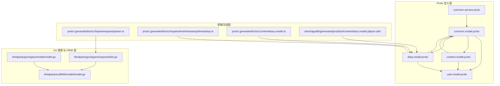
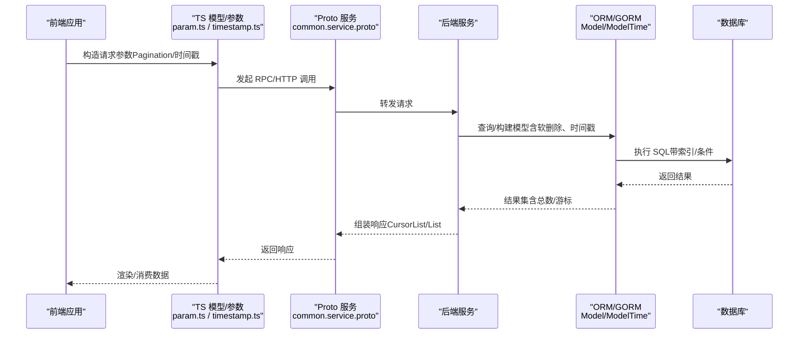
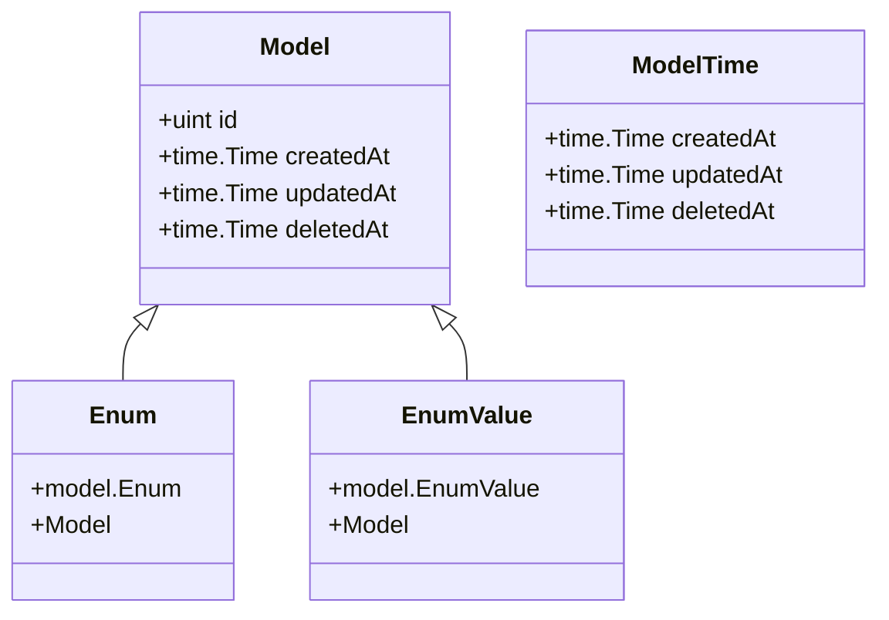
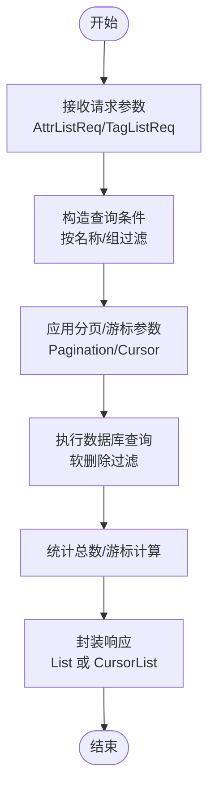
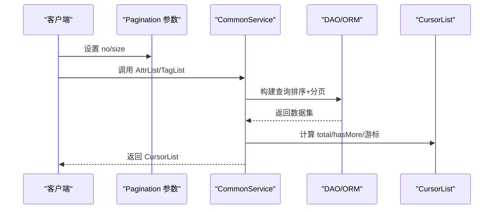
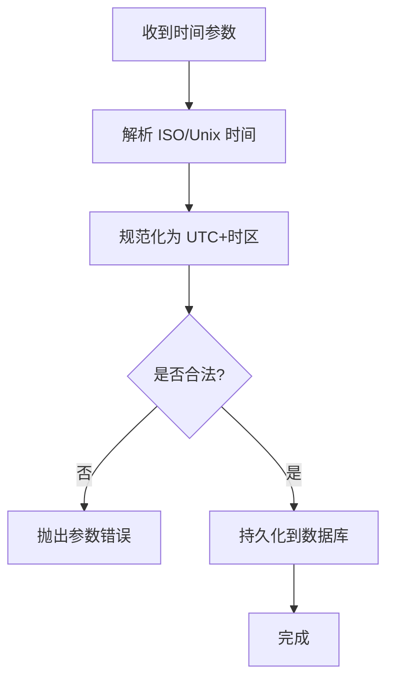
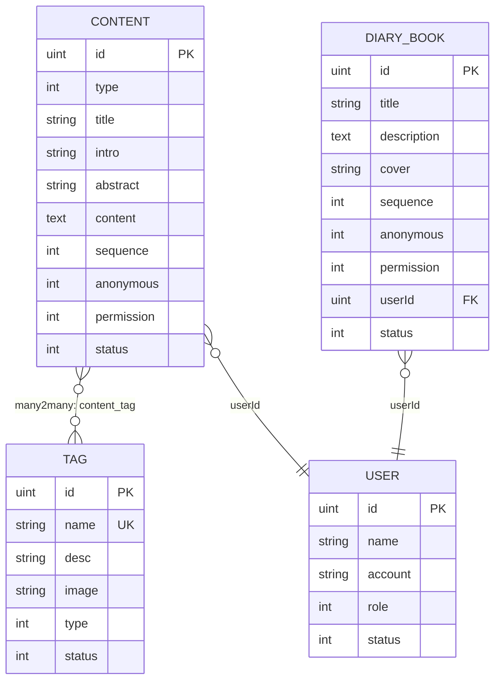
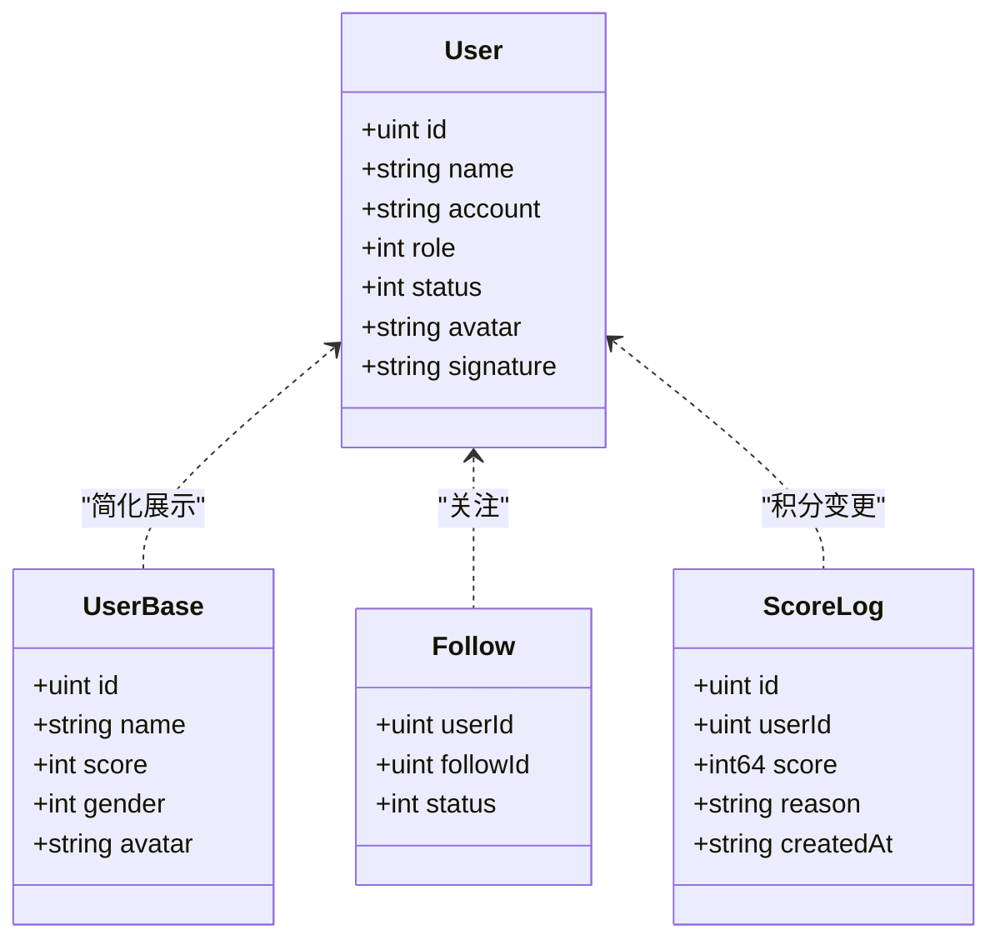
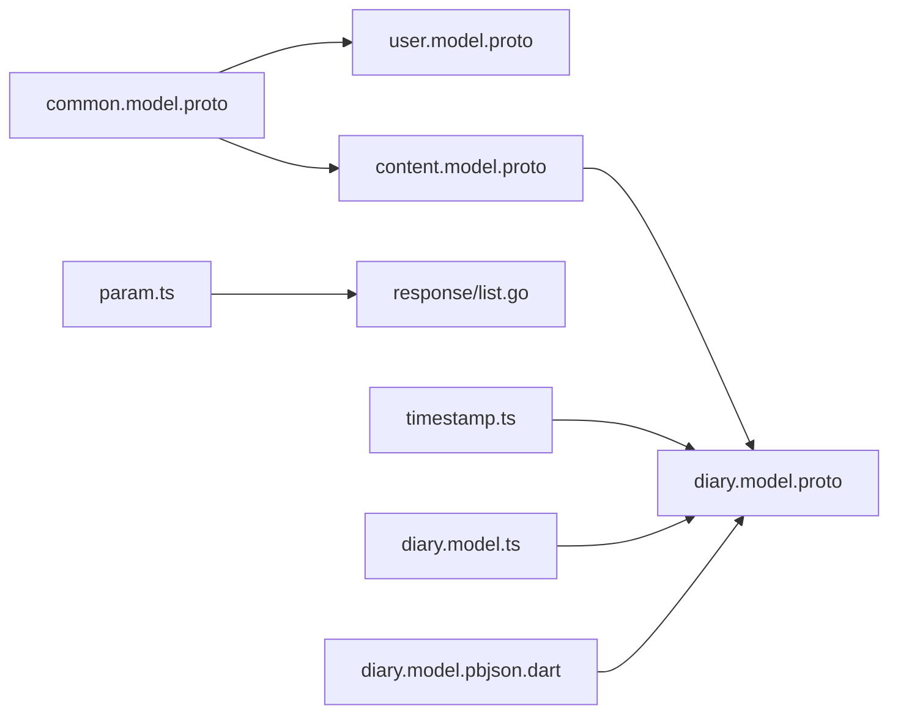

# 模型管理

<cite>
**本文引用的文件**
- [proto/common/common.model.proto](file://proto/common/common.model.proto)
- [proto/common/common.service.proto](file://proto/common/common.service.proto)
- [proto/content/content.model.proto](file://proto/content/content.model.proto)
- [proto/content/diary.model.proto](file://proto/content/diary.model.proto)
- [proto/user/user.model.proto](file://proto/user/user.model.proto)
- [thirdparty/gox/types/model/model.go](file://thirdparty/gox/types/model/model.go)
- [thirdparty/scaffold/model/model.go](file://thirdparty/scaffold/model/model.go)
- [thirdparty/gox/types/response/list.go](file://thirdparty/gox/types/response/list.go)
- [proto/.generated/ts/src/hopeio/request/param.ts](file://proto/.generated/ts/src/hopeio/request/param.ts)
- [proto/.generated/ts/src/hopeio/time/timestamp/timestamp.ts](file://proto/.generated/ts/src/hopeio/time/timestamp/timestamp.ts)
- [proto/.generated/ts/src/content/diary.model.ts](file://proto/.generated/ts/src/content/diary.model.ts)
- [client/app/lib/generated/protobuf/content/diary.model.pbjson.dart](file://client/app/lib/generated/protobuf/content/diary.model.pbjson.dart)
</cite>

## 目录
1. [简介](#简介)
2. [项目结构](#项目结构)
3. [核心组件](#核心组件)
4. [架构总览](#架构总览)
5. [详细组件分析](#详细组件分析)
6. [依赖分析](#依赖分析)
7. [性能考虑](#性能考虑)
8. [故障排查指南](#故障排查指南)
9. [结论](#结论)
10. [附录](#附录)

## 简介
本文件聚焦“模型管理”能力，系统性阐述数据模型的统一管理机制，涵盖以下主题：
- 统一的基础模型结构（含软删除、时间戳）
- 字典与枚举的统一管理
- 分页查询的游标机制与响应结构
- 日期/时间参数的标准化处理
- 模型定义最佳实践、字段约束规则与扩展方法
- 与数据库 ORM 的集成使用与性能优化建议

目标是帮助开发者在多语言（Go、TS、Dart）与多层（Proto 定义、服务、DAO、前端）之间建立一致、可维护、高性能的模型体系。

## 项目结构
围绕模型管理的关键文件分布如下：
- Proto 定义层：统一的领域模型与服务契约
- Go 类型与 ORM 层：基础模型、时间模型与响应结构
- 前端生成层：基于 Proto 的 TS/Dart 模型与请求参数

**图表来源**
- [proto/common/common.model.proto:1-213](file://proto/common/common.model.proto#L1-L213)
- [proto/common/common.service.proto:1-223](file://proto/common/common.service.proto#L1-L223)
- [proto/user/user.model.proto:1-269](file://proto/user/user.model.proto#L1-L269)
- [proto/content/content.model.proto:1-187](file://proto/content/content.model.proto#L1-L187)
- [proto/content/diary.model.proto:1-59](file://proto/content/diary.model.proto#L1-L59)
- [thirdparty/gox/types/model/model.go:1-17](file://thirdparty/gox/types/model/model.go#L1-L17)
- [thirdparty/scaffold/model/model.go:1-38](file://thirdparty/scaffold/model/model.go#L1-L38)
- [thirdparty/gox/types/response/list.go:1-13](file://thirdparty/gox/types/response/list.go#L1-L13)
- [proto/.generated/ts/src/hopeio/request/param.ts:75-128](file://proto/.generated/ts/src/hopeio/request/param.ts#L75-L128)
- [proto/.generated/ts/src/hopeio/time/timestamp/timestamp.ts:100-117](file://proto/.generated/ts/src/hopeio/time/timestamp/timestamp.ts#L100-L117)
- [proto/.generated/ts/src/content/diary.model.ts:365-374](file://proto/.generated/ts/src/content/diary.model.ts#L365-L374)
- [client/app/lib/generated/protobuf/content/diary.model.pbjson.dart:76-148](file://client/app/lib/generated/protobuf/content/diary.model.pbjson.dart#L76-L148)

**章节来源**
- [proto/common/common.model.proto:1-213](file://proto/common/common.model.proto#L1-L213)
- [proto/common/common.service.proto:1-223](file://proto/common/common.service.proto#L1-L223)
- [proto/user/user.model.proto:1-269](file://proto/user/user.model.proto#L1-L269)
- [proto/content/content.model.proto:1-187](file://proto/content/content.model.proto#L1-L187)
- [proto/content/diary.model.proto:1-59](file://proto/content/diary.model.proto#L1-L59)
- [thirdparty/gox/types/model/model.go:1-17](file://thirdparty/gox/types/model/model.go#L1-L17)
- [thirdparty/scaffold/model/model.go:1-38](file://thirdparty/scaffold/model/model.go#L1-L38)
- [thirdparty/gox/types/response/list.go:1-13](file://thirdparty/gox/types/response/list.go#L1-L13)
- [proto/.generated/ts/src/hopeio/request/param.ts:75-128](file://proto/.generated/ts/src/hopeio/request/param.ts#L75-L128)
- [proto/.generated/ts/src/hopeio/time/timestamp/timestamp.ts:100-117](file://proto/.generated/ts/src/hopeio/time/timestamp/timestamp.ts#L100-L117)
- [proto/.generated/ts/src/content/diary.model.ts:365-374](file://proto/.generated/ts/src/content/diary.model.ts#L365-L374)
- [client/app/lib/generated/protobuf/content/diary.model.pbjson.dart:76-148](file://client/app/lib/generated/protobuf/content/diary.model.pbjson.dart#L76-L148)

## 核心组件
- 基础模型与时间模型
  - 统一主键、创建/更新/删除时间字段，支持软删除索引
  - 提供嵌入式时间模型以复用 createdAt/updatedAt/deletedAt
- 字典与枚举
  - Dict：统一字典表，按 type+key 唯一定位，支持顺序、状态与用户维度
  - Enum：自描述枚举，支持类型、索引、值与描述
- 内容模型族
  - Content、Container、Favorite 等，统一视图权限、排序、匿名、状态与时间模型
- 用户模型族
  - User、UserBase、Follow、ScoreLog、BannedLog 等，统一用户标识、角色、状态与行为日志
- 分页与游标
  - Pagination 请求参数（页码/大小）
  - CursorList 响应结构（列表、总数、游标、是否有更多）

**章节来源**
- [thirdparty/gox/types/model/model.go:7-12](file://thirdparty/gox/types/model/model.go#L7-L12)
- [thirdparty/scaffold/model/model.go:16-27](file://thirdparty/scaffold/model/model.go#L16-L27)
- [proto/common/common.model.proto:49-59](file://proto/common/common.model.proto#L49-L59)
- [proto/common/common.model.proto:111-122](file://proto/common/common.model.proto#L111-L122)
- [proto/content/content.model.proto:43-88](file://proto/content/content.model.proto#L43-L88)
- [proto/user/user.model.proto:20-50](file://proto/user/user.model.proto#L20-L50)
- [proto/.generated/ts/src/hopeio/request/param.ts:75-128](file://proto/.generated/ts/src/hopeio/request/param.ts#L75-L128)
- [thirdparty/gox/types/response/list.go:8-13](file://thirdparty/gox/types/response/list.go#L8-L13)

## 架构总览
下图展示从 Proto 定义到前端生成模型与服务调用的整体流程，以及与 ORM 的映射关系。

**图表来源**
- [proto/common/common.service.proto:18-136](file://proto/common/common.service.proto#L18-L136)
- [proto/.generated/ts/src/hopeio/request/param.ts:75-128](file://proto/.generated/ts/src/hopeio/request/param.ts#L75-L128)
- [proto/.generated/ts/src/hopeio/time/timestamp/timestamp.ts:100-117](file://proto/.generated/ts/src/hopeio/time/timestamp/timestamp.ts#L100-L117)
- [thirdparty/scaffold/model/model.go:16-27](file://thirdparty/scaffold/model/model.go#L16-L27)
- [thirdparty/gox/types/response/list.go:8-13](file://thirdparty/gox/types/response/list.go#L8-L13)

## 详细组件分析

### 基础模型与时间模型
- 统一结构
  - 主键：uint 类型
  - 时间：CreatedAt/UpdatedAt；DeletedAt 支持软删除并建立索引
- 扩展
  - 可嵌入 ModelTime 实现“内联”时间字段
  - 可通过结构体组合引入操作者标识等扩展字段

**图表来源**
- [thirdparty/gox/types/model/model.go:7-12](file://thirdparty/gox/types/model/model.go#L7-L12)
- [thirdparty/scaffold/model/model.go:16-37](file://thirdparty/scaffold/model/model.go#L16-L37)

**章节来源**
- [thirdparty/gox/types/model/model.go:7-12](file://thirdparty/gox/types/model/model.go#L7-L12)
- [thirdparty/scaffold/model/model.go:16-27](file://thirdparty/scaffold/model/model.go#L16-L27)

### 字典与枚举管理
- 字典 Dict
  - 唯一键：type + key
  - 字段：值、顺序、用户维度、状态、时间模型
- 枚举 Enum
  - 自描述：类型、索引、值、描述、用户维度、状态、时间模型
- 服务接口
  - 提供新增、详情、编辑、列表等 RPC 接口，支持分页参数

**图表来源**
- [proto/common/common.service.proto:155-162](file://proto/common/common.service.proto#L155-L162)
- [proto/common/common.service.proto:182-192](file://proto/common/common.service.proto#L182-L192)
- [proto/.generated/ts/src/hopeio/request/param.ts:75-128](file://proto/.generated/ts/src/hopeio/request/param.ts#L75-L128)
- [thirdparty/gox/types/response/list.go:8-13](file://thirdparty/gox/types/response/list.go#L8-L13)

**章节来源**
- [proto/common/common.model.proto:49-59](file://proto/common/common.model.proto#L49-L59)
- [proto/common/common.model.proto:111-122](file://proto/common/common.model.proto#L111-L122)
- [proto/common/common.service.proto:18-136](file://proto/common/common.service.proto#L18-L136)
- [proto/common/common.service.proto:155-162](file://proto/common/common.service.proto#L155-L162)
- [proto/common/common.service.proto:182-192](file://proto/common/common.service.proto#L182-L192)

### 分页与游标机制
- 请求参数
  - Pagination：页码 no、页大小 size
- 响应结构
  - List：list + total
  - CursorList：list + total + cursor + hasMore
- 使用建议
  - 列表查询优先使用 CursorList，避免跳页丢失/重复
  - 游标基于稳定排序字段（如时间戳、主键）生成

**图表来源**
- [proto/.generated/ts/src/hopeio/request/param.ts:75-128](file://proto/.generated/ts/src/hopeio/request/param.ts#L75-L128)
- [thirdparty/gox/types/response/list.go:8-13](file://thirdparty/gox/types/response/list.go#L8-L13)
- [proto/common/common.service.proto:60-68](file://proto/common/common.service.proto#L60-L68)

**章节来源**
- [proto/.generated/ts/src/hopeio/request/param.ts:75-128](file://proto/.generated/ts/src/hopeio/request/param.ts#L75-L128)
- [thirdparty/gox/types/response/list.go:8-13](file://thirdparty/gox/types/response/list.go#L8-L13)
- [proto/common/common.service.proto:60-68](file://proto/common/common.service.proto#L60-L68)

### 日期/时间参数标准化
- 时间戳模型
  - Timestamp：seconds + nanos
  - 用于跨语言一致的时间表达
- 生成模型示例
  - TS/Dart 生成模型对时间字段进行转换与校验
- 建议
  - 存储统一使用带时区的时间类型
  - 前端展示前进行本地化转换

**图表来源**
- [proto/.generated/ts/src/hopeio/time/timestamp/timestamp.ts:100-117](file://proto/.generated/ts/src/hopeio/time/timestamp/timestamp.ts#L100-L117)
- [proto/.generated/ts/src/content/diary.model.ts:365-374](file://proto/.generated/ts/src/content/diary.model.ts#L365-L374)
- [client/app/lib/generated/protobuf/content/diary.model.pbjson.dart:76-148](file://client/app/lib/generated/protobuf/content/diary.model.pbjson.dart#L76-L148)

**章节来源**
- [proto/.generated/ts/src/hopeio/time/timestamp/timestamp.ts:100-117](file://proto/.generated/ts/src/hopeio/time/timestamp/timestamp.ts#L100-L117)
- [proto/.generated/ts/src/content/diary.model.ts:365-374](file://proto/.generated/ts/src/content/diary.model.ts#L365-L374)
- [client/app/lib/generated/protobuf/content/diary.model.pbjson.dart:76-148](file://client/app/lib/generated/protobuf/content/diary.model.pbjson.dart#L76-L148)

### 内容模型族（统一字段与权限）
- Content/Container/Favorite 等
  - 统一字段：类型、标题、摘要、内容、图片数组、容器/用户关联、排序、匿名、权限、状态、时间模型
- 视图权限
  - 通过 ViewPermission 控制可见范围
- 标签/属性
  - 通过 Many2Many 关系与公共模型关联

**图表来源**
- [proto/content/content.model.proto:43-88](file://proto/content/content.model.proto#L43-L88)
- [proto/content/diary.model.proto:46-59](file://proto/content/diary.model.proto#L46-L59)
- [proto/user/user.model.proto:20-50](file://proto/user/user.model.proto#L20-L50)

**章节来源**
- [proto/content/content.model.proto:43-88](file://proto/content/content.model.proto#L43-L88)
- [proto/content/diary.model.proto:19-59](file://proto/content/diary.model.proto#L19-L59)
- [proto/user/user.model.proto:20-50](file://proto/user/user.model.proto#L20-L50)

### 用户模型族（认证与行为）
- User/UserBase：统一标识、角色、状态、头像、签名等
- Follow：关注关系
- ScoreLog/BannedLog：行为与封禁日志
- 设备信息：AccessDevice/Device

**图表来源**
- [proto/user/user.model.proto:20-50](file://proto/user/user.model.proto#L20-L50)
- [proto/user/user.model.proto:64-71](file://proto/user/user.model.proto#L64-L71)
- [proto/user/user.model.proto:74-82](file://proto/user/user.model.proto#L74-L82)

**章节来源**
- [proto/user/user.model.proto:20-50](file://proto/user/user.model.proto#L20-L50)
- [proto/user/user.model.proto:64-71](file://proto/user/user.model.proto#L64-L71)
- [proto/user/user.model.proto:74-82](file://proto/user/user.model.proto#L74-L82)

## 依赖分析
- Proto 依赖
  - common.model.proto 被 user、content 等模块复用
  - content.model.proto 引入 common 与 user
- 生成层依赖
  - TS/Dart 生成模型依赖基础时间与参数模型
- ORM 依赖
  - GORM 注解统一映射到数据库列、索引与默认值
  - 软删除通过 DeletedAt 字段与索引实现

**图表来源**
- [proto/common/common.model.proto:1-213](file://proto/common/common.model.proto#L1-L213)
- [proto/user/user.model.proto:1-269](file://proto/user/user.model.proto#L1-L269)
- [proto/content/content.model.proto:1-187](file://proto/content/content.model.proto#L1-L187)
- [proto/content/diary.model.proto:1-59](file://proto/content/diary.model.proto#L1-L59)
- [proto/.generated/ts/src/hopeio/request/param.ts:75-128](file://proto/.generated/ts/src/hopeio/request/param.ts#L75-L128)
- [thirdparty/gox/types/response/list.go:8-13](file://thirdparty/gox/types/response/list.go#L8-L13)
- [proto/.generated/ts/src/hopeio/time/timestamp/timestamp.ts:100-117](file://proto/.generated/ts/src/hopeio/time/timestamp/timestamp.ts#L100-L117)
- [proto/.generated/ts/src/content/diary.model.ts:365-374](file://proto/.generated/ts/src/content/diary.model.ts#L365-L374)
- [client/app/lib/generated/protobuf/content/diary.model.pbjson.dart:76-148](file://client/app/lib/generated/protobuf/content/diary.model.pbjson.dart#L76-L148)

**章节来源**
- [proto/common/common.model.proto:1-213](file://proto/common/common.model.proto#L1-L213)
- [proto/user/user.model.proto:1-269](file://proto/user/user.model.proto#L1-L269)
- [proto/content/content.model.proto:1-187](file://proto/content/content.model.proto#L1-L187)
- [proto/content/diary.model.proto:1-59](file://proto/content/diary.model.proto#L1-L59)
- [proto/.generated/ts/src/hopeio/request/param.ts:75-128](file://proto/.generated/ts/src/hopeio/request/param.ts#L75-L128)
- [thirdparty/gox/types/response/list.go:8-13](file://thirdparty/gox/types/response/list.go#L8-L13)
- [proto/.generated/ts/src/hopeio/time/timestamp/timestamp.ts:100-117](file://proto/.generated/ts/src/hopeio/time/timestamp/timestamp.ts#L100-L117)
- [proto/.generated/ts/src/content/diary.model.ts:365-374](file://proto/.generated/ts/src/content/diary.model.ts#L365-L374)
- [client/app/lib/generated/protobuf/content/diary.model.pbjson.dart:76-148](file://client/app/lib/generated/protobuf/content/diary.model.pbjson.dart#L76-L148)

## 性能考虑
- 索引策略
  - 软删除字段建立索引，减少全表扫描
  - 高频查询字段（如 userId、状态、时间戳）建立复合索引
- 查询优化
  - 使用 CursorList 替代传统分页，降低偏移量带来的性能损耗
  - 限定返回字段，避免 SELECT *
- 序列化与传输
  - 前端生成模型对时间与数组字段进行轻量校验，减少运行期开销
- ORM 映射
  - 通过 gorm 注解精确控制列类型、默认值与索引，避免 ORM 层过度抽象

[本节为通用指导，不直接分析具体文件]

## 故障排查指南
- 字段校验失败
  - 检查 Proto 中的验证注解与前端生成模型的 fromJSON 行为
  - 参考：字段校验与 JSON 转换逻辑
- 分页/游标异常
  - 确认请求参数 no/size 与服务端分页逻辑一致
  - 检查 CursorList 的 hasMore 与游标生成规则
- 时间字段问题
  - 确保前后端时间戳格式一致（seconds + nanos）
  - 注意时区转换与本地化展示

**章节来源**
- [proto/.generated/ts/src/hopeio/request/param.ts:75-128](file://proto/.generated/ts/src/hopeio/request/param.ts#L75-L128)
- [proto/.generated/ts/src/hopeio/time/timestamp/timestamp.ts:100-117](file://proto/.generated/ts/src/hopeio/time/timestamp/timestamp.ts#L100-L117)
- [proto/.generated/ts/src/content/diary.model.ts:365-374](file://proto/.generated/ts/src/content/diary.model.ts#L365-L374)

## 结论
通过统一的 Proto 模型、嵌入式时间模型与标准化的分页/游标机制，项目实现了跨语言、跨层的一致性与可维护性。配合 GORM 注解与前端生成模型，既保证了开发效率，也为性能优化提供了清晰的落地路径。建议在新功能开发中遵循本文的最佳实践与约束规则，确保模型演进的稳定性与一致性。

[本节为总结性内容，不直接分析具体文件]

## 附录
- 最佳实践清单
  - 所有实体继承统一基础模型，启用软删除并建立索引
  - 字典与枚举通过 Dict/Enum 统一管理，避免散落常量
  - 列表查询优先使用 CursorList，明确游标生成规则
  - 时间字段统一使用 Timestamp，前后端保持一致的时区与精度
  - 字段约束通过 Proto 注解与前端生成模型共同保障
- 扩展方法
  - 新增模型时，优先复用 common 与 content 的通用字段
  - 对需要复杂权限控制的实体，引入 ViewPermission 并在服务层严格校验
  - 对高频查询场景，评估添加复合索引与物化视图

[本节为概念性内容，不直接分析具体文件]