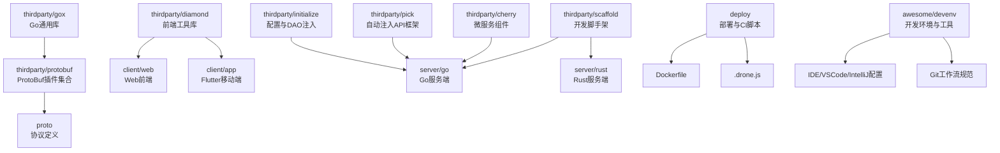
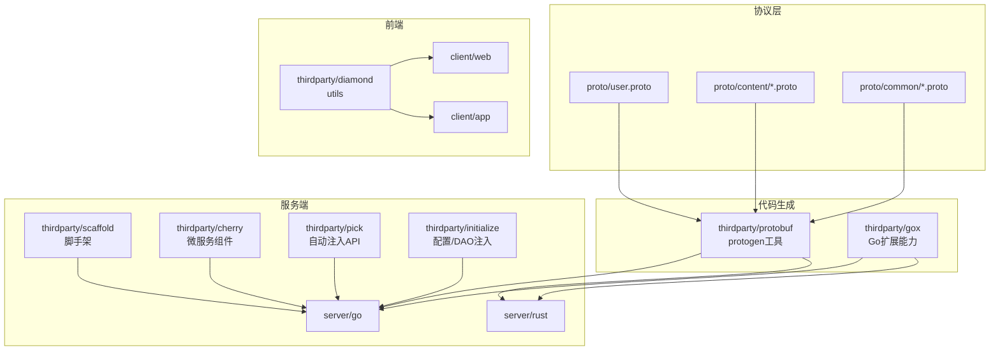
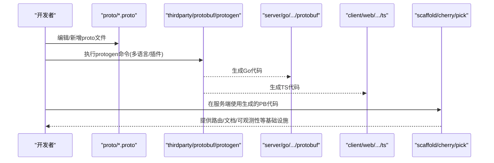
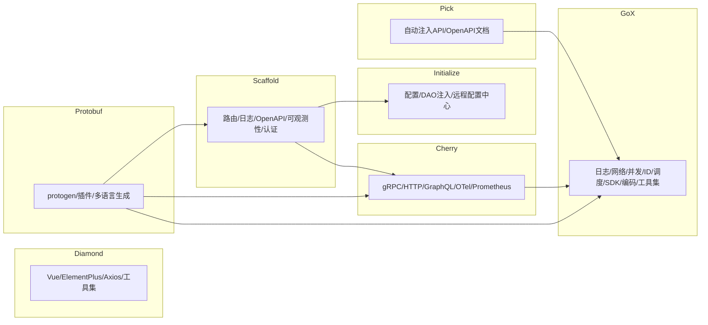

# 开发工具

<cite>
**本文引用的文件**
- [thirdparty/gox/README.md](file://thirdparty/gox/README.md)
- [thirdparty/gox/go.mod](file://thirdparty/gox/go.mod)
- [thirdparty/diamond/README.md](file://thirdparty/diamond/README.md)
- [thirdparty/diamond/package.json](file://thirdparty/diamond/package.json)
- [thirdparty/scaffold/README.md](file://thirdparty/scaffold/README.md)
- [thirdparty/scaffold/go.mod](file://thirdparty/scaffold/go.mod)
- [thirdparty/cherry/README.md](file://thirdparty/cherry/README.md)
- [thirdparty/cherry/go.mod](file://thirdparty/cherry/go.mod)
- [thirdparty/protobuf/README.md](file://thirdparty/protobuf/README.md)
- [thirdparty/protobuf/go.mod](file://thirdparty/protobuf/go.mod)
- [thirdparty/pick/README.md](file://thirdparty/pick/README.md)
- [thirdparty/pick/go.mod](file://thirdparty/pick/go.mod)
- [thirdparty/initialize/README.md](file://thirdparty/initialize/README.md)
- [thirdparty/initialize/go.mod](file://thirdparty/initialize/go.mod)
- [thirdparty/applib/README.md](file://thirdparty/applib/README.md)
- [thirdparty/applib/pubspec.yaml](file://thirdparty/applib/pubspec.yaml)
- [proto/README.md](file://proto/README.md)
- [.drone.js](file://.drone.js)
- [deploy/shell/drone/deploy.sh](file://deploy/shell/drone/deploy.sh)
- [deploy/shell/build.md](file://deploy/shell/build.md)
- [deploy/Dockerfile](file://deploy/Dockerfile)
- [awesome/devenv/devenv.md](file://awesome/devenv/devenv.md)
- [awesome/devenv/config/cargo.toml](file://awesome/devenv/config/cargo.toml)
- [awesome/devenv/devtool/ide.md](file://awesome/devenv/devtool/ide.md)
- [awesome/devenv/devtool/vscode.md](file://awesome/devenv/devtool/vscode.md)
- [awesome/devenv/devtool/idea.md](file://awesome/devenv/devtool/idea.md)
- [awesome/lang/go/go.md](file://awesome/lang/go/go.md)
- [awesome/lang/go/config.toml](file://awesome/lang/go/config.toml)
- [awesome/lang/go/config.dev.toml](file://awesome/lang/go/config.dev.toml)
- [awesome/note/git提交规范.md](file://awesome/note/git提交规范.md)
- [awesome/note/IEEE754.md](file://awesome/note/IEEE754.md)
- [awesome/note/ASCII.md](file://awesome/note/ASCII.md)
- [awesome/note/regexp.md](file://awesome/note/regexp.md)
- [awesome/note/位操作技巧.md](file://awesome/note/位操作技巧.md)
- [awesome/note/折腾flutter小记.md](file://awesome/note/折腾flutter小记.md)
</cite>

## 目录
1. [简介](#简介)
2. [项目结构](#项目结构)
3. [核心组件](#核心组件)
4. [架构总览](#架构总览)
5. [详细组件分析](#详细组件分析)
6. [依赖分析](#依赖分析)
7. [性能考虑](#性能考虑)
8. [故障排除指南](#故障排除指南)
9. [结论](#结论)
10. [附录](#附录)

## 简介
本文件面向Hoper开发团队，提供一套完整的工具链文档，覆盖thirdparty目录下的核心工具库（gox通用库、diamond前端库、scaffold脚手架）、ProtoBuf代码生成工具（多语言与自定义模板）、IDE配置、Git工作流、代码质量工具、自动化测试与CI/CD、部署工具，以及开发环境快速搭建与故障排除指引。目标是帮助新成员快速上手，规范化日常开发流程，提升协作效率与交付质量。

## 项目结构
仓库采用多模块组织方式，核心开发工具集中在thirdparty目录，配套proto协议定义、Go/Rust服务端示例、前端客户端工程、部署与CI脚本。下图给出与工具链相关的关键目录关系概览：

图表来源
- [thirdparty/gox/README.md:1-23](file://thirdparty/gox/README.md#L1-L23)
- [thirdparty/diamond/README.md:1-6](file://thirdparty/diamond/README.md#L1-L6)
- [thirdparty/scaffold/README.md:1-3](file://thirdparty/scaffold/README.md#L1-L3)
- [thirdparty/cherry/README.md:1-58](file://thirdparty/cherry/README.md#L1-L58)
- [thirdparty/protobuf/README.md:1-111](file://thirdparty/protobuf/README.md#L1-L111)
- [proto/README.md](file://proto/README.md)

章节来源
- [thirdparty/gox/README.md:1-23](file://thirdparty/gox/README.md#L1-L23)
- [thirdparty/diamond/README.md:1-6](file://thirdparty/diamond/README.md#L1-L6)
- [thirdparty/scaffold/README.md:1-3](file://thirdparty/scaffold/README.md#L1-L3)
- [thirdparty/cherry/README.md:1-58](file://thirdparty/cherry/README.md#L1-L58)
- [thirdparty/protobuf/README.md:1-111](file://thirdparty/protobuf/README.md#L1-L111)
- [proto/README.md](file://proto/README.md)

## 核心组件
本节概述thirdparty目录下三大类工具库及其职责与定位：
- gox：Go标准库扩展与常用能力封装，覆盖日志、网络、并发、编码、定时器、ID生成、任务调度、SDK集成、工具集等，是服务端与CLI的基础工具库。
- diamond：JavaScript/TypeScript工具库，提供UI、状态管理、HTTP、加密、时间处理、事件总线等能力，服务于Web与UniApp前端。
- scaffold：开发脚手架，提供统一的路由、日志、OpenAPI文档、可观测性、认证鉴权、导出Excel、Prometheus指标等基础设施，加速业务服务构建。

章节来源
- [thirdparty/gox/README.md:1-23](file://thirdparty/gox/README.md#L1-L23)
- [thirdparty/diamond/README.md:1-6](file://thirdparty/diamond/README.md#L1-L6)
- [thirdparty/scaffold/README.md:1-3](file://thirdparty/scaffold/README.md#L1-L3)

## 架构总览
下图展示工具链在整体项目中的位置与交互关系，突出ProtoBuf生成链路、前端工具库与服务端脚手架的协同：

图表来源
- [thirdparty/protobuf/README.md:1-111](file://thirdparty/protobuf/README.md#L1-L111)
- [thirdparty/gox/README.md:1-23](file://thirdparty/gox/README.md#L1-L23)
- [thirdparty/diamond/README.md:1-6](file://thirdparty/diamond/README.md#L1-L6)
- [thirdparty/scaffold/README.md:1-3](file://thirdparty/scaffold/README.md#L1-L3)
- [thirdparty/cherry/README.md:1-58](file://thirdparty/cherry/README.md#L1-L58)
- [thirdparty/pick/README.md:1-97](file://thirdparty/pick/README.md#L1-L97)
- [thirdparty/initialize/README.md:1-147](file://thirdparty/initialize/README.md#L1-L147)
- [proto/README.md](file://proto/README.md)

## 详细组件分析

### gox通用库
- 能力范围：日志、网络、并发、容器、ID生成、任务调度、SDK集成、编码解码、数学工具、字符串处理、类型系统、验证器、终端、文本模板、时间处理、工具集等。
- 设计要点：模块化、高内聚低耦合；广泛复用第三方库，统一入口与配置；提供开箱即用的封装与扩展点。
- 使用建议：优先使用内置能力，避免重复造轮子；结合initialize与scaffold统一日志、配置与可观测性。

章节来源
- [thirdparty/gox/README.md:1-23](file://thirdparty/gox/README.md#L1-L23)
- [thirdparty/gox/go.mod:1-144](file://thirdparty/gox/go.mod#L1-L144)

### diamond前端库
- 能力范围：Vue生态集成、UI组件、状态管理、HTTP客户端、加密、时间处理、事件总线、本地存储、SparkMD5等。
- 设计要点：以模块化导出为主，支持ESM/CJS与类型声明；与UniApp/Element Plus/VueUse等主流生态良好兼容。
- 使用建议：通过包管理器发布与引入；在前端工程中按需导入模块，保持版本一致。

章节来源
- [thirdparty/diamond/README.md:1-6](file://thirdparty/diamond/README.md#L1-L6)
- [thirdparty/diamond/package.json:1-93](file://thirdparty/diamond/package.json#L1-L93)

### scaffold开发脚手架
- 能力范围：统一路由、日志、OpenAPI文档、认证鉴权、Prometheus指标、导出Excel、GraphQL网关、gRPC-Gateway、可观测性等。
- 设计要点：与cherry/pick/initialize形成组合拳，提供“即插即用”的服务端基础设施。
- 使用建议：新建服务时优先基于scaffold初始化，减少样板代码与配置成本。

章节来源
- [thirdparty/scaffold/README.md:1-3](file://thirdparty/scaffold/README.md#L1-L3)
- [thirdparty/scaffold/go.mod:1-155](file://thirdparty/scaffold/go.mod#L1-L155)

### cherry微服务组件
- 能力范围：集成gRPC/HTTP/GraphQL、OpenTelemetry链路追踪、Prometheus/pprof监控、gRPC-Gateway、HTTP/3(QUIc)、可观测性。
- 使用建议：配合protobuf与scaffold，快速搭建云原生微服务；注意插件安装与protogen参数配置。

章节来源
- [thirdparty/cherry/README.md:1-58](file://thirdparty/cherry/README.md#L1-L58)
- [thirdparty/cherry/go.mod:1-90](file://thirdparty/cherry/go.mod#L1-L90)

### protobuf代码生成工具
- 功能：支持Go/TS等多语言生成，集成OpenAPI、枚举增强、校验代码、GraphQL、gRPC-Gateway等插件。
- 使用：安装工具后，通过protogen命令批量生成；支持Docker运行与自定义模板。
- 自定义模板：可通过插件与选项扩展生成内容，满足特定业务需求。

章节来源
- [thirdparty/protobuf/README.md:1-111](file://thirdparty/protobuf/README.md#L1-L111)
- [thirdparty/protobuf/go.mod:1-97](file://thirdparty/protobuf/go.mod#L1-L97)

### pick自动注入API框架
- 功能：基于反射的自动注入API开发框架，默认基于gin，兼容fiber；提供OpenAPI文档与Markdown文档生成。
- 使用：通过Register注册服务，定义请求/响应结构体与注释，自动生成路由与文档。

章节来源
- [thirdparty/pick/README.md:1-97](file://thirdparty/pick/README.md#L1-L97)
- [thirdparty/pick/go.mod:1-80](file://thirdparty/pick/go.mod#L1-L80)

### initialize配置与DAO注入
- 功能：基于反射的自动注入，支持本地配置、环境变量、命令行、远程配置中心（Nacos/Apollo/Etcd/HTTP），支持DAO注入与生命周期回调。
- 使用：定义配置结构体与DAO结构体，实现Before/After注入回调，统一初始化顺序与资源清理。

章节来源
- [thirdparty/initialize/README.md:1-147](file://thirdparty/initialize/README.md#L1-L147)
- [thirdparty/initialize/go.mod:1-262](file://thirdparty/initialize/go.mod#L1-L262)

### ProtoBuf代码生成流程（序列图）

图表来源
- [thirdparty/protobuf/README.md:1-111](file://thirdparty/protobuf/README.md#L1-L111)
- [proto/README.md](file://proto/README.md)

## 依赖分析
- gox依赖众多第三方库，涵盖日志、网络、并发、数据库、SDK、OpenTelemetry等，体现其“通用库”定位。
- diamond依赖Vue/Element Plus/Axios等前端生态，提供实用工具与UI能力。
- scaffold依赖cherry/protobuf/gox等上游工具，形成服务端基础设施闭环。
- cherry依赖protobuf与gox，强调可观测性与多协议支持。
- initialize依赖大量数据库/缓存/消息队列/配置中心SDK，提供强大的注入能力。
- pick依赖gin与gox，强调自动注入API与OpenAPI文档。

图表来源
- [thirdparty/gox/go.mod:1-144](file://thirdparty/gox/go.mod#L1-L144)
- [thirdparty/diamond/package.json:1-93](file://thirdparty/diamond/package.json#L1-L93)
- [thirdparty/scaffold/go.mod:1-155](file://thirdparty/scaffold/go.mod#L1-L155)
- [thirdparty/cherry/go.mod:1-90](file://thirdparty/cherry/go.mod#L1-L90)
- [thirdparty/initialize/go.mod:1-262](file://thirdparty/initialize/go.mod#L1-L262)
- [thirdparty/pick/go.mod:1-80](file://thirdparty/pick/go.mod#L1-L80)
- [thirdparty/protobuf/go.mod:1-97](file://thirdparty/protobuf/go.mod#L1-L97)

章节来源
- [thirdparty/gox/go.mod:1-144](file://thirdparty/gox/go.mod#L1-L144)
- [thirdparty/diamond/package.json:1-93](file://thirdparty/diamond/package.json#L1-L93)
- [thirdparty/scaffold/go.mod:1-155](file://thirdparty/scaffold/go.mod#L1-L155)
- [thirdparty/cherry/go.mod:1-90](file://thirdparty/cherry/go.mod#L1-L90)
- [thirdparty/initialize/go.mod:1-262](file://thirdparty/initialize/go.mod#L1-L262)
- [thirdparty/pick/go.mod:1-80](file://thirdparty/pick/go.mod#L1-L80)
- [thirdparty/protobuf/go.mod:1-97](file://thirdparty/protobuf/go.mod#L1-L97)

## 性能考虑
- 任务调度与并发：优先使用gox提供的并发与调度能力，合理设置goroutine上限与重试策略，避免资源争用。
- 日志与可观测性：统一使用zap与OpenTelemetry，减少日志噪声，聚焦关键指标与链路追踪。
- 网络与HTTP：利用gin与cherry的中间件能力，启用压缩、限流与超时控制，降低延迟与提高吞吐。
- 数据库与缓存：通过initialize注入DAO，结合连接池与索引优化，避免热点与慢查询。
- 前端性能：diamond工具库提供本地存储与事件总线，减少不必要的渲染与请求。

## 故障排除指南
- Protobuf生成失败
  - 确认已安装protoc与相关插件，参考protobuf工具安装与使用说明。
  - 检查proto文件语法与导入路径，确保include目录正确。
  - 使用Docker运行生成器，避免本地环境差异。
- 前端依赖问题
  - 使用diamond的包管理脚本与构建脚本，确保依赖版本一致。
  - 如遇链接问题，参考diamond的全局链接说明。
- 服务端启动异常
  - 检查initialize的配置文件与环境变量，确认远程配置中心可用。
  - 核对scaffold与cherry的中间件与路由配置，避免冲突。
- CI/CD失败
  - 查看.drone.js与deploy脚本，确认构建步骤与镜像标签。
  - 使用deploy/shell/build.md中的构建流程，确保Dockerfile与制品一致。

章节来源
- [thirdparty/protobuf/README.md:1-111](file://thirdparty/protobuf/README.md#L1-L111)
- [thirdparty/diamond/README.md:1-6](file://thirdparty/diamond/README.md#L1-L6)
- [thirdparty/initialize/README.md:1-147](file://thirdparty/initialize/README.md#L1-L147)
- [.drone.js](file://.drone.js)
- [deploy/shell/build.md](file://deploy/shell/build.md)
- [deploy/Dockerfile](file://deploy/Dockerfile)

## 结论
通过thirdparty目录下的gox、diamond、scaffold、cherry、protobuf、pick、initialize等工具库，Hoper实现了从前端到服务端、从协议到可观测性的完整工具链。遵循本文档的配置与使用规范，可显著提升开发效率、保证代码质量，并简化CI/CD与部署流程。

## 附录

### IDE配置指南
- VSCode：安装Go、TypeScript、Vue等扩展，启用格式化与Lint；参考awesome/devenv/devtool/vscode.md中的配置要点。
- IntelliJ IDEA：配置Go与Rust插件，启用代码检查与自动格式化；参考awesome/devenv/devtool/idea.md。
- Cargo工具链：参考awesome/devenv/config/cargo.toml进行镜像源与工具链配置。

章节来源
- [awesome/devenv/devtool/vscode.md](file://awesome/devenv/devtool/vscode.md)
- [awesome/devenv/devtool/idea.md](file://awesome/devenv/devtool/idea.md)
- [awesome/devenv/config/cargo.toml](file://awesome/devenv/config/cargo.toml)

### Git工作流规范
- 提交规范：参考awesome/note/git提交规范.md，统一提交信息风格与类型。
- 分支策略：主分支保护、特性分支开发、Pull Request审查与合并。
- 冲突解决：遵循三方合并策略，必要时进行rebase或squash。

章节来源
- [awesome/note/git提交规范.md](file://awesome/note/git提交规范.md)

### 代码质量工具
- Go：参考awesome/lang/go/go.md与配置文件，启用静态检查、格式化与测试覆盖率。
- JavaScript/TypeScript：Vitest用于单元测试，Vite构建与类型检查。
- Rust：Cargo工具链与配置参考awesome/devenv/config/cargo.toml。

章节来源
- [awesome/lang/go/go.md](file://awesome/lang/go/go.md)
- [awesome/lang/go/config.toml](file://awesome/lang/go/config.toml)
- [awesome/lang/go/config.dev.toml](file://awesome/lang/go/config.dev.toml)
- [thirdparty/diamond/package.json:1-93](file://thirdparty/diamond/package.json#L1-L93)

### 自动化测试框架
- Go：使用go test与testify，结合mock与gox的测试工具。
- TypeScript：Vitest提供高性能测试运行器，支持DOM模拟与类型检查。
- Flutter：applib作为Flutter工具库，配合测试框架进行组件与业务逻辑测试。

章节来源
- [thirdparty/gox/README.md:1-23](file://thirdparty/gox/README.md#L1-L23)
- [thirdparty/diamond/package.json:1-93](file://thirdparty/diamond/package.json#L1-L93)
- [thirdparty/applib/README.md:1-3](file://thirdparty/applib/README.md#L1-L3)
- [thirdparty/applib/pubspec.yaml:1-70](file://thirdparty/applib/pubspec.yaml#L1-L70)

### 持续集成与部署
- CI配置：参考.drone.js，定义构建、测试、打包与发布流水线。
- 部署脚本：使用deploy/shell中的脚本完成Docker镜像构建与Kubernetes部署。
- Docker：参考deploy/Dockerfile，确保多阶段构建与最小化镜像体积。

章节来源
- [.drone.js](file://.drone.js)
- [deploy/shell/drone/deploy.sh](file://deploy/shell/drone/deploy.sh)
- [deploy/shell/build.md](file://deploy/shell/build.md)
- [deploy/Dockerfile](file://deploy/Dockerfile)

### 开发环境快速搭建
- 安装Go、Node.js、Flutter、Rust工具链与IDE。
- 初始化thirdparty子模块，安装protobuf插件与diamond依赖。
- 配置Git钩子与IDE格式化规则，确保一致性。

章节来源
- [awesome/devenv/devenv.md](file://awesome/devenv/devenv.md)
- [thirdparty/protobuf/README.md:1-111](file://thirdparty/protobuf/README.md#L1-L111)
- [thirdparty/diamond/README.md:1-6](file://thirdparty/diamond/README.md#L1-L6)

### 常用参考主题
- IEEE754、ASCII、正则表达式、位运算技巧等基础主题，便于查阅与复用。

章节来源
- [awesome/note/IEEE754.md](file://awesome/note/IEEE754.md)
- [awesome/note/ASCII.md](file://awesome/note/ASCII.md)
- [awesome/note/regexp.md](file://awesome/note/regexp.md)
- [awesome/note/位操作技巧.md](file://awesome/note/位操作技巧.md)
- [awesome/note/折腾flutter小记.md](file://awesome/note/折腾flutter小记.md)