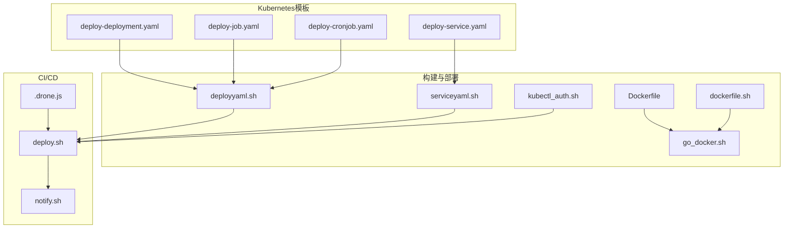
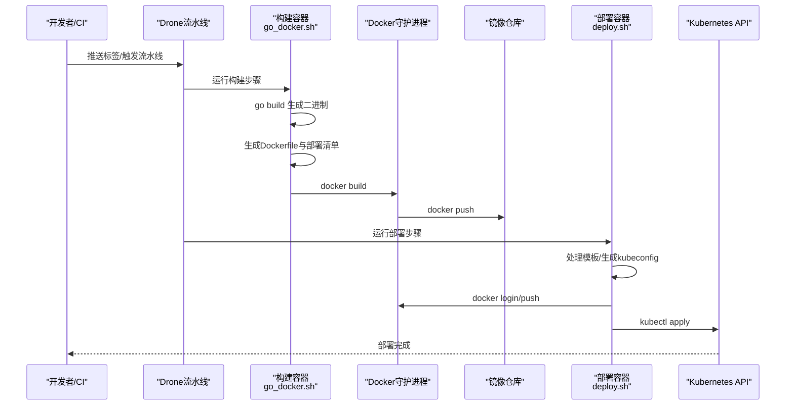
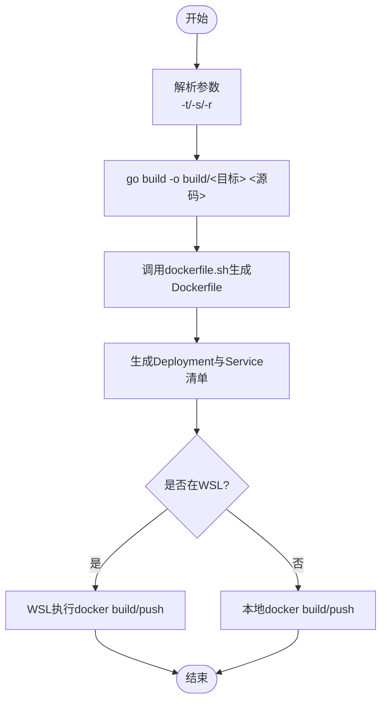
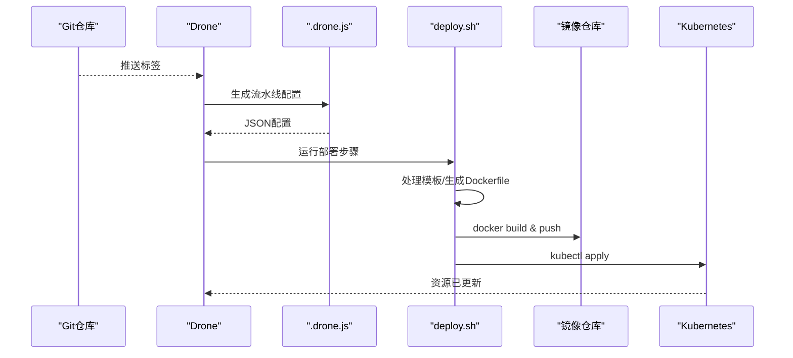
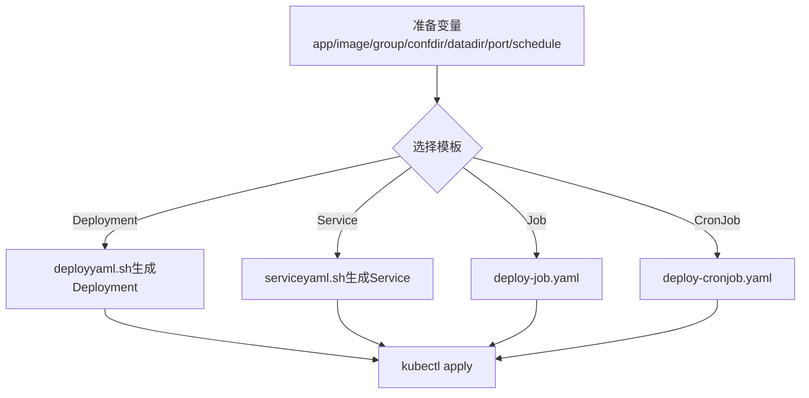
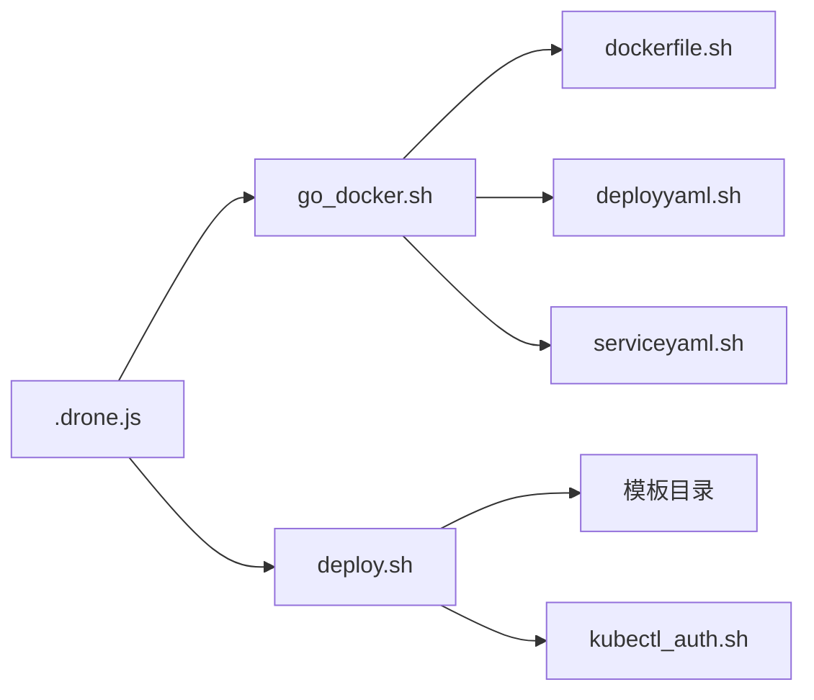

# 构建自动化工具

<cite>
**本文引用的文件**
- [Dockerfile](file://deploy/Dockerfile)
- [dockerfile.sh](file://deploy/shell/dockerfile.sh)
- [go_docker.sh](file://deploy/shell/go_docker.sh)
- [build.md](file://deploy/shell/build.md)
- [deploy-deployment.yaml](file://deploy/tpl/deploy-deployment.yaml)
- [deployyaml.sh](file://deploy/shell/deployyaml.sh)
- [serviceyaml.sh](file://deploy/shell/serviceyaml.sh)
- [deploy.sh](file://deploy/shell/drone/deploy.sh)
- [notify.sh](file://deploy/shell/drone/notify.sh)
- [.drone.js](file://.drone.js)
- [kubectl_auth.sh](file://deploy/shell/kubectl_auth.sh)
- [deploy-cronjob.yaml](file://deploy/tpl/deploy-cronjob.yaml)
- [deploy-job.yaml](file://deploy/tpl/deploy-job.yaml)
- [deploy-service.yaml](file://deploy/tpl/deploy-service.yaml)
</cite>

## 目录
1. [简介](#简介)
2. [项目结构](#项目结构)
3. [核心组件](#核心组件)
4. [架构总览](#架构总览)
5. [详细组件分析](#详细组件分析)
6. [依赖关系分析](#依赖关系分析)
7. [性能考虑](#性能考虑)
8. [故障排除指南](#故障排除指南)
9. [结论](#结论)
10. [附录](#附录)

## 简介
本指南面向需要在本地与CI/CD环境中实现“容器化构建 + Kubernetes部署 + Drone流水线”的工程团队，帮助你快速掌握以下能力：
- 使用Shell脚本进行多平台、多组件的容器构建与镜像推送
- 基于模板的Kubernetes部署清单生成与应用
- 基于Drone的CI/CD流水线配置与发布通知
- 构建环境的配置管理、版本控制与发布策略
- 部署流程优化与常见问题排查

## 项目结构
围绕构建与部署的核心目录与文件如下：
- deploy/Dockerfile：用于构建“部署工具镜像”，内置kubectl与基础工具
- deploy/shell：构建与部署脚本集合
  - dockerfile.sh：按参数生成Dockerfile
  - go_docker.sh：Go服务一键打包、生成Dockerfile与部署清单、构建并推送镜像
  - deployyaml.sh：根据参数生成Deployment模板
  - serviceyaml.sh：生成Service模板
  - build.md：常用构建与kubectl命令参考
  - drone/：Drone插件化部署与通知脚本
    - deploy.sh：Drone流水线中执行的部署步骤
    - notify.sh：发布通知到钉钉机器人
  - kubectl_auth.sh：生成kubeconfig并切换上下文
- deploy/tpl：Kubernetes部署模板
  - deploy-deployment.yaml、deploy-service.yaml、deploy-job.yaml、deploy-cronjob.yaml
- .drone.js：Drone流水线JSON配置生成器（JavaScript）

**图表来源**
- [Dockerfile](file://deploy/Dockerfile)
- [go_docker.sh](file://deploy/shell/go_docker.sh)
- [dockerfile.sh](file://deploy/shell/dockerfile.sh)
- [deployyaml.sh](file://deploy/shell/deployyaml.sh)
- [serviceyaml.sh](file://deploy/shell/serviceyaml.sh)
- [kubectl_auth.sh](file://deploy/shell/kubectl_auth.sh)
- [deploy-deployment.yaml](file://deploy/tpl/deploy-deployment.yaml)
- [deploy-service.yaml](file://deploy/tpl/deploy-service.yaml)
- [deploy-job.yaml](file://deploy/tpl/deploy-job.yaml)
- [deploy-cronjob.yaml](file://deploy/tpl/deploy-cronjob.yaml)
- [.drone.js](file://.drone.js)
- [deploy.sh](file://deploy/shell/drone/deploy.sh)
- [notify.sh](file://deploy/shell/drone/notify.sh)

**章节来源**
- [Dockerfile](file://deploy/Dockerfile)
- [go_docker.sh](file://deploy/shell/go_docker.sh)
- [deployyaml.sh](file://deploy/shell/deployyaml.sh)
- [serviceyaml.sh](file://deploy/shell/serviceyaml.sh)
- [deploy.sh](file://deploy/shell/drone/deploy.sh)
- [.drone.js](file://.drone.js)

## 核心组件
- 容器构建与打包
  - 通过go_docker.sh统一执行Go二进制构建、Dockerfile生成、镜像构建与推送
  - 支持注册表前缀、目标应用名、命令行参数注入等
- 清单生成与部署
  - deployyaml.sh与serviceyaml.sh分别生成Deployment与Service
  - 模板来自deploy/tpl，支持挂载配置与数据卷
- CI/CD流水线
  - .drone.js生成Drone JSON配置，触发构建与部署步骤
  - deploy.sh在流水线中拉起部署容器，处理模板、构建镜像、推送、应用K8s资源
  - notify.sh在完成后向钉钉发送发布通知
- K8s认证与上下文
  - kubectl_auth.sh基于传入的CA与客户端证书生成kubeconfig并切换上下文

**章节来源**
- [go_docker.sh](file://deploy/shell/go_docker.sh)
- [deployyaml.sh](file://deploy/shell/deployyaml.sh)
- [serviceyaml.sh](file://deploy/shell/serviceyaml.sh)
- [deploy.sh](file://deploy/shell/drone/deploy.sh)
- [notify.sh](file://deploy/shell/drone/notify.sh)
- [kubectl_auth.sh](file://deploy/shell/kubectl_auth.sh)

## 架构总览
下图展示了从代码到镜像再到Kubernetes部署的整体流程。

**图表来源**
- [.drone.js](file://.drone.js)
- [go_docker.sh](file://deploy/shell/go_docker.sh)
- [deploy.sh](file://deploy/shell/drone/deploy.sh)

## 详细组件分析

### 组件A：Go服务一键构建与打包（go_docker.sh）
- 功能要点
  - 自动创建build目录并执行Linux二进制构建
  - 通过dockerfile.sh生成目标应用的Dockerfile
  - 生成Deployment与Service清单并调用kubectl应用
  - 支持Windows子系统（WSL）下的构建与推送
- 关键参数
  - -t：目标二进制名
  - -s：源码路径
  - -r：镜像仓库前缀（如registry/namespace）
- 输出产物
  - build/目标二进制
  - build/Dockerfile
  - build/目标_deployment.yaml
  - build/目标_service.yaml

**图表来源**
- [go_docker.sh](file://deploy/shell/go_docker.sh)
- [dockerfile.sh](file://deploy/shell/dockerfile.sh)
- [deployyaml.sh](file://deploy/shell/deployyaml.sh)
- [serviceyaml.sh](file://deploy/shell/serviceyaml.sh)

**章节来源**
- [go_docker.sh](file://deploy/shell/go_docker.sh)
- [dockerfile.sh](file://deploy/shell/dockerfile.sh)
- [deployyaml.sh](file://deploy/shell/deployyaml.sh)
- [serviceyaml.sh](file://deploy/shell/serviceyaml.sh)

### 组件B：Drone流水线（.drone.js 与 deploy.sh）
- .drone.js
  - 定义编译主机与目标主机的目录映射
  - 生成流水线：克隆代码、可选生成protobuf、构建二进制、部署步骤
  - 触发条件：匹配以“组名-名称-v版本号”命名的标签
- deploy.sh（部署步骤）
  - 从模板目录加载Dockerfile与K8s部署模板
  - 依据环境变量与参数生成最终Dockerfile与部署清单
  - 登录镜像仓库、构建并推送镜像
  - 生成kubeconfig并应用K8s资源（支持删除旧资源如Job/CronJob）
  - 可选：根据集群设置API Server地址

**图表来源**
- [.drone.js](file://.drone.js)
- [deploy.sh](file://deploy/shell/drone/deploy.sh)

**章节来源**
- [.drone.js](file://.drone.js)
- [deploy.sh](file://deploy/shell/drone/deploy.sh)

### 组件C：Kubernetes部署模板与清单生成
- 模板类型
  - Deployment、Service、Job、CronJob
- 生成方式
  - deployyaml.sh：生成Deployment，支持挂载配置与数据卷
  - serviceyaml.sh：生成Service，映射端口
  - 模板变量：app、image、group、confdir、datadir、port、schedule
- 使用场景
  - 普通应用使用Deployment + Service
  - 一次性任务使用Job
  - 定时任务使用CronJob

**图表来源**
- [deployyaml.sh](file://deploy/shell/deployyaml.sh)
- [serviceyaml.sh](file://deploy/shell/serviceyaml.sh)
- [deploy-deployment.yaml](file://deploy/tpl/deploy-deployment.yaml)
- [deploy-service.yaml](file://deploy/tpl/deploy-service.yaml)
- [deploy-job.yaml](file://deploy/tpl/deploy-job.yaml)
- [deploy-cronjob.yaml](file://deploy/tpl/deploy-cronjob.yaml)

**章节来源**
- [deployyaml.sh](file://deploy/shell/deployyaml.sh)
- [serviceyaml.sh](file://deploy/shell/serviceyaml.sh)
- [deploy-deployment.yaml](file://deploy/tpl/deploy-deployment.yaml)
- [deploy-service.yaml](file://deploy/tpl/deploy-service.yaml)
- [deploy-job.yaml](file://deploy/tpl/deploy-job.yaml)
- [deploy-cronjob.yaml](file://deploy/tpl/deploy-cronjob.yaml)

### 组件D：K8s认证与上下文切换（kubectl_auth.sh）
- 输入
  - server：集群API Server地址
  - cluster：集群标识
  - CACRT、DEVCRT、DEVKEY：通过环境变量传入的证书与密钥
- 行为
  - 生成证书文件
  - 使用kubectl config设置集群、用户与上下文
  - 切换到目标上下文

**章节来源**
- [kubectl_auth.sh](file://deploy/shell/kubectl_auth.sh)

### 组件E：发布通知（notify.sh）
- 功能
  - 从Drone环境变量获取构建元信息
  - 可选使用签名参数生成带签名的钉钉URL
  - 发送Markdown格式通知
- 使用前提
  - 配置钉钉机器人的Token与可选Secret

**章节来源**
- [notify.sh](file://deploy/shell/drone/notify.sh)

## 依赖关系分析
- go_docker.sh依赖
  - dockerfile.sh：生成Dockerfile
  - deployyaml.sh/serviceyaml.sh：生成K8s清单
  - docker守护进程：执行build/push
- deploy.sh依赖
  - 模板目录：Dockerfile与K8s模板
  - kubectl_auth.sh：生成kubeconfig
  - 镜像仓库凭据：登录与推送
- .drone.js依赖
  - 代码与依赖的宿主机目录映射
  - Docker与KubeConfig卷挂载
  - Secret：镜像仓库与证书、钉钉通知

**图表来源**
- [go_docker.sh](file://deploy/shell/go_docker.sh)
- [dockerfile.sh](file://deploy/shell/dockerfile.sh)
- [deployyaml.sh](file://deploy/shell/deployyaml.sh)
- [serviceyaml.sh](file://deploy/shell/serviceyaml.sh)
- [deploy.sh](file://deploy/shell/drone/deploy.sh)
- [.drone.js](file://.drone.js)

**章节来源**
- [go_docker.sh](file://deploy/shell/go_docker.sh)
- [deploy.sh](file://deploy/shell/drone/deploy.sh)
- [.drone.js](file://.drone.js)

## 性能考虑
- 构建阶段
  - 使用多阶段构建减少镜像体积（当前示例镜像已包含kubectl与时间配置，便于部署）
  - 在CI中缓存依赖（如GOPATH）以缩短构建时间
- 镜像优化
  - 仅拷贝必要文件至镜像根目录，避免将构建中间产物打包
  - 使用最小化基础镜像（如alpine），并按需安装依赖
- 部署阶段
  - 使用滚动更新策略与合理的资源请求/限制，避免资源争抢
  - 对静态资源与配置采用hostPath或持久化存储，确保重启后数据不丢失

## 故障排除指南
- 镜像构建失败
  - 检查go_docker.sh的参数是否正确（-t/-s/-r）
  - 确认Docker守护进程可用且具备网络访问权限
- 镜像推送失败
  - 确认Docker仓库用户名与密码已正确配置为Secret
  - 检查镜像标签是否符合“组名-名称-v版本号”规则
- K8s部署失败
  - 使用kubectl_auth.sh检查kubeconfig是否生成成功
  - 查看deploy.sh中对模板变量的替换是否完整
  - 对于Job/CronJob，确认旧资源已被删除后再应用新资源
- 通知未送达
  - 检查钉钉机器人Token与Secret是否配置
  - 确认网络可达性与签名参数计算逻辑

**章节来源**
- [go_docker.sh](file://deploy/shell/go_docker.sh)
- [deploy.sh](file://deploy/shell/drone/deploy.sh)
- [notify.sh](file://deploy/shell/drone/notify.sh)

## 结论
该工具链通过Shell脚本与Drone流水线实现了从代码到镜像再到Kubernetes的全链路自动化。结合模板化的部署清单与灵活的参数注入，能够快速适配多组件、多环境的发布需求。建议在生产环境中进一步完善：
- 引入制品库与镜像扫描
- 增加灰度发布与回滚策略
- 加强日志与可观测性集成

## 附录

### A. 常用命令速查
- 本地构建与打包：参考[build.md](file://deploy/shell/build.md)
- 生成Dockerfile：参考[dockerfile.sh](file://deploy/shell/dockerfile.sh)
- 一键构建与部署：参考[go_docker.sh](file://deploy/shell/go_docker.sh)
- 生成Deployment与Service：参考[deployyaml.sh](file://deploy/shell/deployyaml.sh)、[serviceyaml.sh](file://deploy/shell/serviceyaml.sh)
- 部署到K8s：参考[deploy.sh](file://deploy/shell/drone/deploy.sh)、[kubectl_auth.sh](file://deploy/shell/kubectl_auth.sh)
- 发布通知：参考[notify.sh](file://deploy/shell/drone/notify.sh)

**章节来源**
- [build.md](file://deploy/shell/build.md)
- [dockerfile.sh](file://deploy/shell/dockerfile.sh)
- [go_docker.sh](file://deploy/shell/go_docker.sh)
- [deployyaml.sh](file://deploy/shell/deployyaml.sh)
- [serviceyaml.sh](file://deploy/shell/serviceyaml.sh)
- [deploy.sh](file://deploy/shell/drone/deploy.sh)
- [kubectl_auth.sh](file://deploy/shell/kubectl_auth.sh)
- [notify.sh](file://deploy/shell/drone/notify.sh)