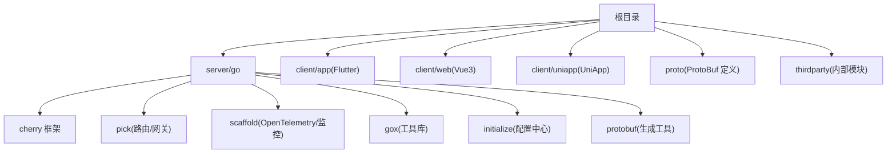
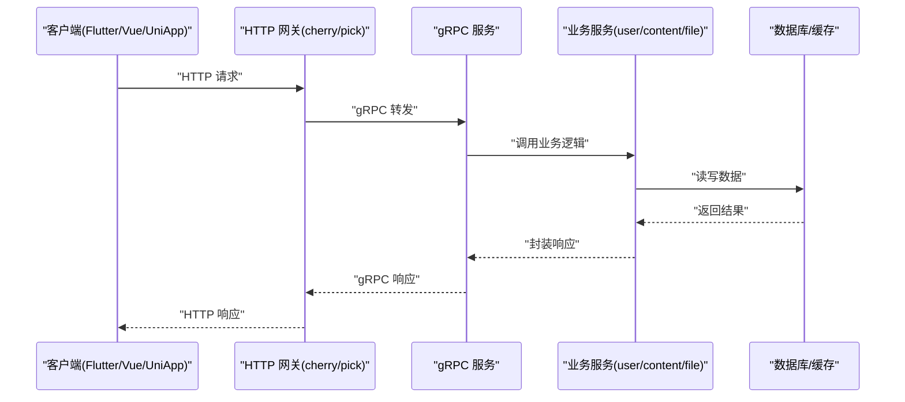
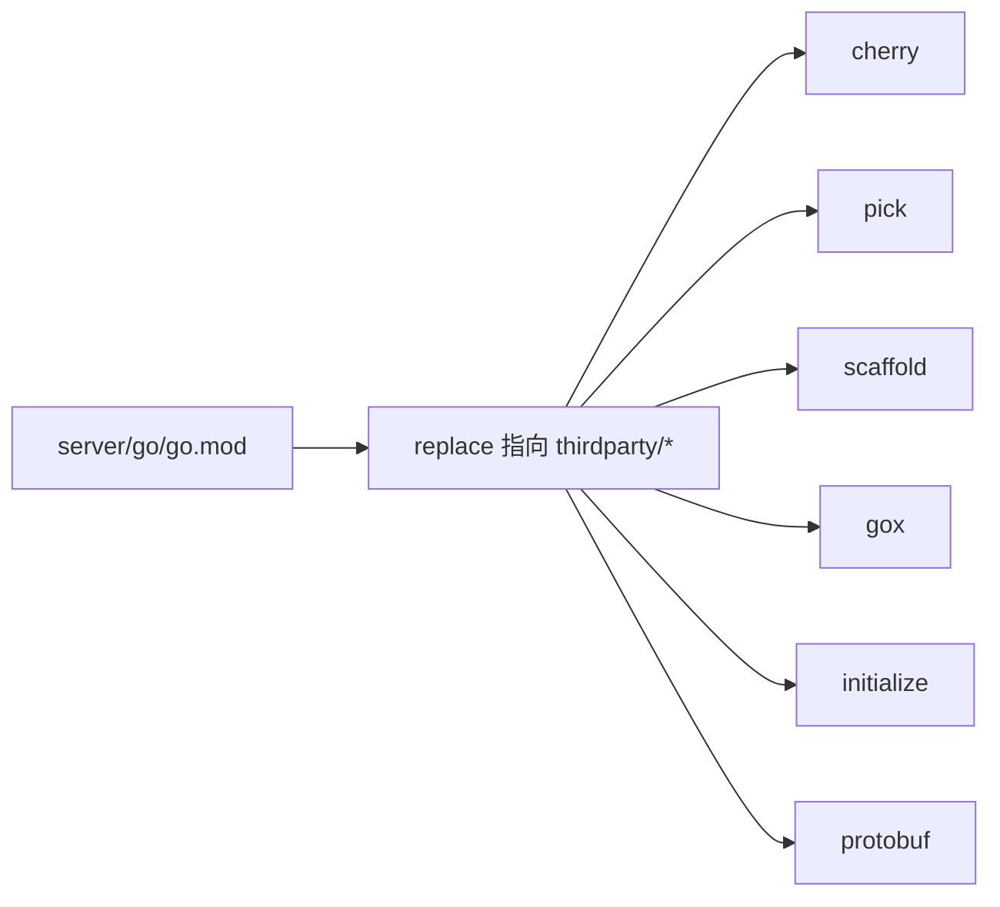

# 快速开始

<cite>
**本文引用的文件**
- [README.md](file://README.md)
- [devenv.md](file://awesome/devenv/devenv.md)
- [node.md](file://awesome/lang/node.md)
- [go.mod](file://server/go/go.mod)
- [main.go](file://server/go/main.go)
- [config.toml](file://server/go/config/config.toml)
- [local.tpl.toml](file://server/go/config/local.tpl.toml)
- [build.sh](file://server/go/build.sh)
- [pubspec.yaml](file://client/app/pubspec.yaml)
- [package.json（web）](file://client/web/package.json)
- [package.json（uniapp）](file://client/uniapp/package.json)
- [proto 说明](file://proto/README.md)
- [用户服务 proto](file://proto/user/user.service.proto)
- [用户模型 proto](file://proto/user/user.model.proto)
</cite>

## 目录
1. [简介](#简介)
2. [项目结构](#项目结构)
3. [核心组件](#核心组件)
4. [架构总览](#架构总览)
5. [详细组件分析](#详细组件分析)
6. [依赖关系分析](#依赖关系分析)
7. [性能考虑](#性能考虑)
8. [故障排除指南](#故障排除指南)
9. [结论](#结论)
10. [附录](#附录)

## 简介
本指南面向首次接触 Hoper 项目的开发者，帮助你在最短时间内完成环境准备、项目克隆、子模块初始化、依赖安装、ProtoBuf 工具配置、服务端与客户端本地运行，并提供常见问题排查建议。项目采用多语言混合架构：后端 Go 主服务，客户端包含 Flutter 移动端、Web（Vue3+Vite）、UniApp 小程序；同时通过 ProtoBuf 定义跨语言的 gRPC 接口。

## 项目结构
- 根目录包含服务端、客户端、ProtoBuf 定义、第三方组件与部署脚本等。
- 服务端 Go 项目位于 server/go，使用 cherry 框架与多个内部模块（initialize、protobuf、pick、scaffold 等）。
- 客户端包含 Flutter 应用、Web 应用与 UniApp 应用。
- ProtoBuf 定义位于 proto，用于生成各语言的 gRPC/HTTP 代码。

图表来源
- [go.mod:1-191](file://server/go/go.mod#L1-L191)
- [main.go:1-69](file://server/go/main.go#L1-L69)

章节来源
- [README.md:1-62](file://README.md#L1-L62)

## 核心组件
- 服务端 Go 主进程负责启动 HTTP 与 gRPC 服务，注册用户、内容、文件、消息等 API，并接入 OpenTelemetry、Prometheus 等可观测性组件。
- 客户端 Flutter 使用 grpc、protobuf、dio、sqlite 等库进行网络通信与本地存储。
- ProtoBuf 定义统一跨语言接口契约，通过 protoc 与自研工具生成各语言代码。

章节来源
- [main.go:1-69](file://server/go/main.go#L1-L69)
- [pubspec.yaml:1-182](file://client/app/pubspec.yaml#L1-L182)

## 架构总览
下图展示从客户端到服务端的典型调用链路：Flutter/UniApp/Web 通过 gRPC 或 HTTP 调用服务端，服务端经 cherry/pick/scaffold 组合框架处理请求，访问数据库与缓存，最终返回响应。

图表来源
- [main.go:55-67](file://server/go/main.go#L55-L67)
- [go.mod:183-190](file://server/go/go.mod#L183-L190)

## 详细组件分析

### 环境准备与工具安装
- Go
  - 参考开发环境文档中的 Go 安装与环境变量配置示例。
  - 章节来源
    - [devenv.md:6-15](file://awesome/devenv/devenv.md#L6-L15)
- Node.js 与包管理器
  - 使用 nvm 安装 Node.js，启用 pnpm 并配置镜像源。
  - 章节来源
    - [node.md:1-20](file://awesome/lang/node.md#L1-L20)
- ProtoBuf 工具
  - 在 README 中明确要求安装 protoc，并通过 protogen 工具生成代码。
  - 章节来源
    - [README.md:10-20](file://README.md#L10-L20)

### ProtoBuf 工具安装与配置
- 安装 protoc（Protocol Buffers Compiler）
  - 参考 releases 页面下载对应平台的二进制包并配置 PATH。
  - 章节来源
    - [README.md:12-12](file://README.md#L12-L12)
- 生成代码
  - 使用内置工具生成 Go 代码，命令行参数包含输入 proto 目录与输出 protobuf 目录。
  - 章节来源
    - [README.md:14-20](file://README.md#L14-L20)
    - [build.sh:2-2](file://server/go/build.sh#L2-L2)
- 特殊说明
  - grpc-gateway 对某些类型的支持需手动替换或自定义 proto 文件。
  - 章节来源
    - [proto 说明:1-7](file://proto/README.md#L1-L7)

### 项目克隆、子模块初始化与依赖安装
- 克隆与初始化
  - 初始化并递归更新子模块，进入 server/go 目录，执行工具安装脚本生成代码，最后以配置文件启动服务。
  - 章节来源
    - [README.md:14-20](file://README.md#L14-L20)
- Go 依赖
  - 使用 go mod tidy 同步依赖，替换指向 thirdparty 内部模块。
  - 章节来源
    - [go.mod:183-190](file://server/go/go.mod#L183-L190)
- 客户端依赖
  - Flutter：pubspec.yaml 声明依赖，使用 pnpm 管理 web/uniapp 的 Node 依赖。
  - 章节来源
    - [pubspec.yaml:23-100](file://client/app/pubspec.yaml#L23-L100)
    - [package.json（web）:1-95](file://client/web/package.json#L1-L95)
    - [package.json（uniapp）:1-174](file://client/uniapp/package.json#L1-L174)

### 服务端本地运行
- 启动流程
  - 初始化子模块 → 进入 server/go → 生成 protobuf 代码 → 编译并运行主程序。
  - 章节来源
    - [README.md:14-20](file://README.md#L14-L20)
    - [build.sh:2-3](file://server/go/build.sh#L2-L3)
- 配置文件
  - 默认使用 config.toml，支持 dev/test/prod 环境；dev 环境可监听本地配置文件。
  - 章节来源
    - [config.toml:1-41](file://server/go/config/config.toml#L1-L41)
    - [local.tpl.toml:1-19](file://server/go/config/local.tpl.toml#L1-L19)
- 依赖与替换
  - go.mod 中 replace 指向 thirdparty 下的内部模块，确保本地开发时能正确解析。
  - 章节来源
    - [go.mod:183-190](file://server/go/go.mod#L183-L190)

### 客户端本地运行
- Flutter
  - 使用 pubspec.yaml 中的依赖与资源配置，按需安装 FFI、SQLite、Protobuf、gRPC 等插件。
  - 章节来源
    - [pubspec.yaml:23-100](file://client/app/pubspec.yaml#L23-L100)
- Web（Vue3 + Vite）
  - 使用 package.json 中的脚本与依赖，支持 dev/build/preview 等模式。
  - 章节来源
    - [package.json（web）:12-24](file://client/web/package.json#L12-L24)
- UniApp
  - 支持多端开发与构建，包含微信小程序、H5 等目标平台。
  - 章节来源
    - [package.json（uniapp）:18-61](file://client/uniapp/package.json#L18-L61)

### ProtoBuf 与接口契约
- 用户服务与模型
  - 用户服务包含注册、登录、认证、关注等接口；模型定义用户、扩展信息、关注、操作日志等实体。
  - 章节来源
    - [用户服务 proto:1-424](file://proto/user/user.service.proto#L1-L424)
    - [用户模型 proto:1-269](file://proto/user/user.model.proto#L1-L269)

## 依赖关系分析
- 服务端依赖
  - cherry/pick/scaffold/gox/initialize/protobuf 等内部模块通过 replace 指向 thirdparty。
  - 章节来源
    - [go.mod:183-190](file://server/go/go.mod#L183-L190)
- 客户端依赖
  - Flutter 依赖 grpc、protobuf、dio、sqlite 等；Web/UniApp 依赖 axios、pinia、vue、uni-app 等。
  - 章节来源
    - [pubspec.yaml:23-100](file://client/app/pubspec.yaml#L23-L100)
    - [package.json（web）:25-47](file://client/web/package.json#L25-L47)
    - [package.json（uniapp）:77-103](file://client/uniapp/package.json#L77-L103)

图表来源
- [go.mod:183-190](file://server/go/go.mod#L183-L190)

## 性能考虑
- 服务端
  - 使用 OpenTelemetry 与 Prometheus 进行可观测性，建议在本地开发时开启调试日志，生产环境调整采样策略。
  - 章节来源
    - [main.go:34-54](file://server/go/main.go#L34-L54)
- 客户端
  - Flutter/UniApp/Web 建议启用缓存与懒加载，减少网络请求与渲染压力。
  - 章节来源
    - [pubspec.yaml:39-98](file://client/app/pubspec.yaml#L39-L98)
    - [package.json（web）:48-89](file://client/web/package.json#L48-L89)
    - [package.json（uniapp）:104-163](file://client/uniapp/package.json#L104-L163)

## 故障排除指南
- 子模块未初始化
  - 症状：找不到 thirdparty 内部模块或 protoc 工具。
  - 处理：执行子模块初始化与更新。
  - 章节来源
    - [README.md:14-14](file://README.md#L14-L14)
- Go 依赖解析失败
  - 症状：go build/import 报错。
  - 处理：确认 go.mod 中 replace 指向正确，thirdparty 子模块已初始化。
  - 章节来源
    - [go.mod:183-190](file://server/go/go.mod#L183-L190)
- ProtoBuf 生成失败
  - 症状：protoc 或 protogen 报错。
  - 处理：检查 protoc 安装与版本，确保输入输出路径正确。
  - 章节来源
    - [README.md:12-20](file://README.md#L12-L20)
    - [build.sh:2-2](file://server/go/build.sh#L2-L2)
- 配置文件缺失或错误
  - 症状：服务无法启动或连接数据库失败。
  - 处理：复制 local.tpl.toml 为 local.toml，填写数据库、Redis、邮件等配置项。
  - 章节来源
    - [config.toml:5-11](file://server/go/config/config.toml#L5-L11)
    - [local.tpl.toml:1-19](file://server/go/config/local.tpl.toml#L1-L19)
- 客户端依赖安装问题
  - 症状：pub install 或 npm/pnpm 安装失败。
  - 处理：检查 Node.js 版本与包管理器配置，必要时切换镜像源。
  - 章节来源
    - [node.md:1-20](file://awesome/lang/node.md#L1-L20)
    - [pubspec.yaml:20-22](file://client/app/pubspec.yaml#L20-L22)
    - [package.json（web）:8-11](file://client/web/package.json#L8-L11)
    - [package.json（uniapp）:14-17](file://client/uniapp/package.json#L14-L17)

## 结论
按照本指南完成环境准备、工具安装、子模块初始化与依赖安装后，你可以在本地成功运行服务端与客户端。若遇到问题，请优先检查子模块与依赖解析、ProtoBuf 生成、配置文件与 Node/Go 版本是否符合要求。

## 附录

### 快速命令清单
- 初始化子模块与生成代码
  - 章节来源
    - [README.md:14-20](file://README.md#L14-L20)
- 服务端构建与运行
  - 章节来源
    - [build.sh:2-3](file://server/go/build.sh#L2-L3)
    - [main.go:29-67](file://server/go/main.go#L29-L67)
- 客户端运行
  - Flutter
    - 章节来源
      - [pubspec.yaml:23-100](file://client/app/pubspec.yaml#L23-L100)
  - Web
    - 章节来源
      - [package.json（web）:12-24](file://client/web/package.json#L12-L24)
  - UniApp
    - 章节来源
      - [package.json（uniapp）:18-61](file://client/uniapp/package.json#L18-L61)