# ProtoBuf数据契约

<cite>
**本文档引用的文件**
- [proto/README.md](file://proto/README.md)
- [common.model.proto](file://proto/common/common.model.proto)
- [common.service.proto](file://proto/common/common.service.proto)
- [user.model.proto](file://proto/user/user.model.proto)
- [user.service.proto](file://proto/user/user.service.proto)
- [content.model.proto](file://proto/content/content.model.proto)
- [content.service.proto](file://proto/content/content.service.proto)
- [moment.model.proto](file://proto/content/moment.model.proto)
- [note.model.proto](file://proto/content/note.model.proto)
- [diary.model.proto](file://proto/content/diary.model.proto)
- [action.model.proto](file://proto/content/action.model.proto)
- [message.proto](file://proto/message/message.proto)
- [file.service.proto](file://proto/file/file.service.proto)
</cite>

## 更新摘要
**变更内容**
- 用户模型重构：支持国际电话号码格式，countryCallingCode和phone字段分离设计
- 认证请求/响应结构重组：LoginReq、SignupReq等消息结构优化
- 验证代码处理优化：增加更多字段验证规则和数据类型约束
- 设备信息增强：AccessDevice和Device模型完善地理位置和设备信息

## 目录
1. [简介](#简介)
2. [项目结构](#项目结构)
3. [核心组件](#核心组件)
4. [架构概览](#架构概览)
5. [详细组件分析](#详细组件分析)
6. [依赖关系分析](#依赖关系分析)
7. [性能考虑](#性能考虑)
8. [故障排除指南](#故障排除指南)
9. [结论](#结论)

## 简介

Hoper项目的ProtoBuf数据契约是一套完整的跨平台通信协议定义，采用Protocol Buffers 3.0语法构建。该系统通过精心设计的消息结构和枚举类型，为用户管理、内容管理、文件服务和消息通信提供了标准化的数据交换格式。

**更新** 本次重大更新重构了用户模型以支持国际电话号码格式，优化了认证流程的请求/响应结构，并增强了字段验证规则和数据类型约束。

本项目的核心设计理念包括：
- **向后兼容性保证**：通过字段标签管理和版本控制确保新旧版本间的无缝兼容
- **类型安全**：利用ProtoBuf的强类型系统防止运行时类型错误
- **跨平台支持**：生成Go、TypeScript等多种语言的客户端代码
- **验证集成**：内置字段验证规则和业务逻辑约束
- **国际化支持**：专门的国际电话号码处理机制

## 项目结构

项目采用按功能域划分的目录结构，每个模块都有独立的ProtoBuf定义文件：

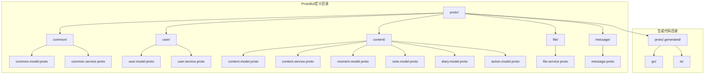

**图表来源**
- [proto/README.md](file://proto/README.md)
- [common.model.proto](file://proto/common/common.model.proto)
- [user.model.proto](file://proto/user/user.model.proto)
- [content.model.proto](file://proto/content/content.model.proto)

**章节来源**
- [proto/README.md](file://proto/README.md)
- [common.model.proto](file://proto/common/common.model.proto)

## 核心组件

### 数据模型层

系统定义了四类核心数据模型：用户模型、内容模型、文件模型和消息模型。

#### 用户模型设计原则

**更新** 用户模型经过重大重构，现在支持国际电话号码格式：

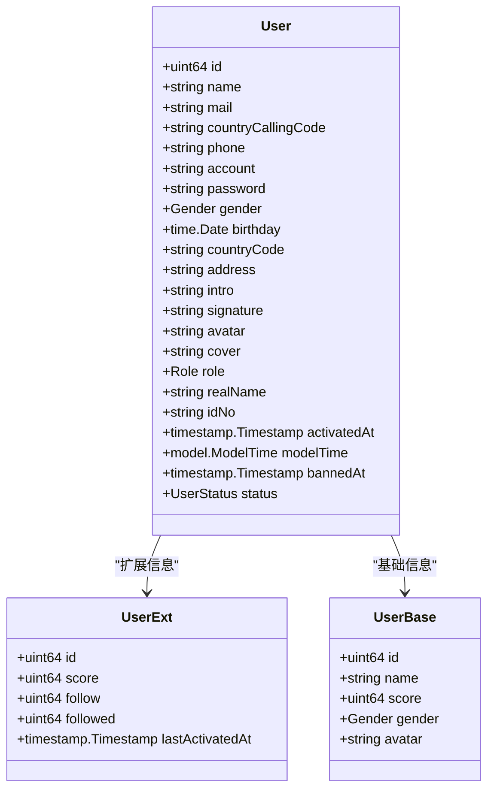

**图表来源**
- [user.model.proto](file://proto/user/user.model.proto)

#### 内容模型架构

内容模型采用多态设计，支持多种内容类型：

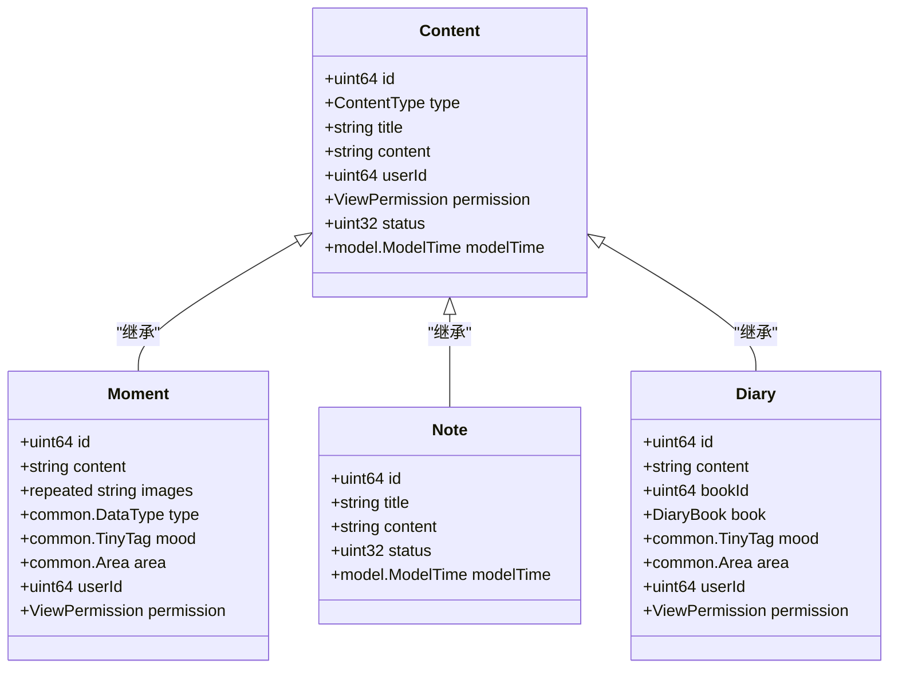

**图表来源**
- [content.model.proto](file://proto/content/content.model.proto)
- [moment.model.proto](file://proto/content/moment.model.proto)
- [note.model.proto](file://proto/content/note.model.proto)
- [diary.model.proto](file://proto/content/diary.model.proto)

**章节来源**
- [user.model.proto](file://proto/user/user.model.proto)
- [content.model.proto](file://proto/content/content.model.proto)

### 服务接口层

服务接口采用gRPC和HTTP/JSON双栈设计，提供RESTful API和高性能RPC两种访问方式。

#### 服务设计模式

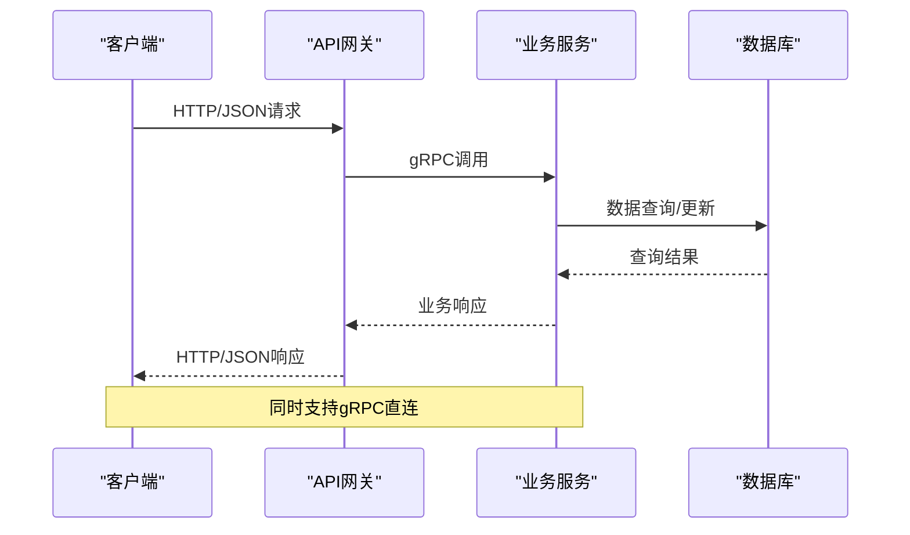

**图表来源**
- [common.service.proto](file://proto/common/common.service.proto)
- [user.service.proto](file://proto/user/user.service.proto)
- [content.service.proto](file://proto/content/content.service.proto)

**章节来源**
- [common.service.proto](file://proto/common/common.service.proto)
- [user.service.proto](file://proto/user/user.service.proto)
- [content.service.proto](file://proto/content/content.service.proto)

## 架构概览

### 数据流架构

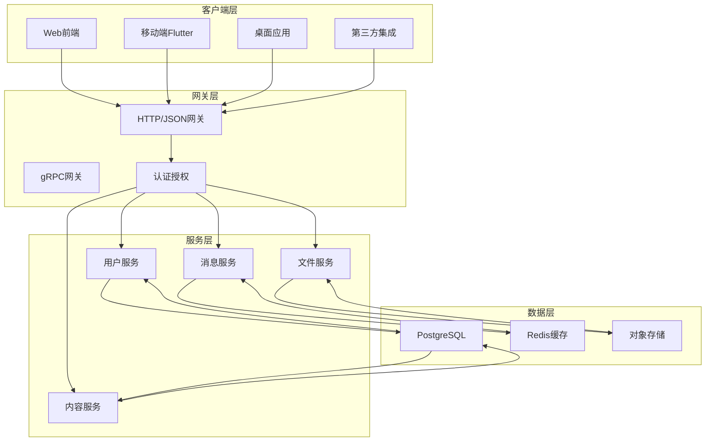

**图表来源**
- [user.service.proto](file://proto/user/user.service.proto)
- [content.service.proto](file://proto/content/content.service.proto)
- [file.service.proto](file://proto/file/file.service.proto)
- [message.proto](file://proto/message/message.proto)

### 字段标签和版本管理

ProtoBuf通过字段标签实现向后兼容性：

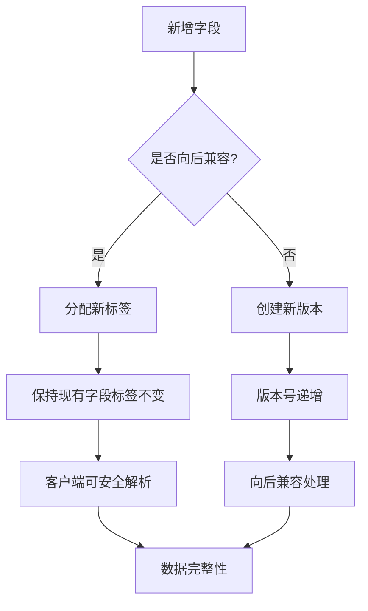

**图表来源**
- [common.model.proto](file://proto/common/common.model.proto)
- [user.model.proto](file://proto/user/user.model.proto)

## 详细组件分析

### 用户管理数据契约

#### 用户状态枚举设计

用户状态通过专用枚举类型实现严格的业务状态控制：

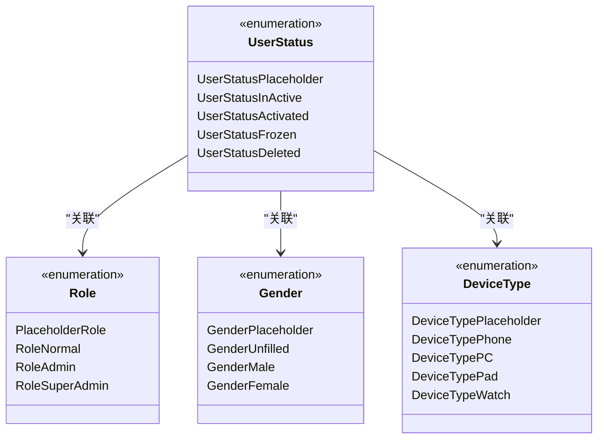

**图表来源**
- [user.model.proto](file://proto/user/user.model.proto)

#### 用户操作日志追踪

系统提供完整的用户行为追踪机制：

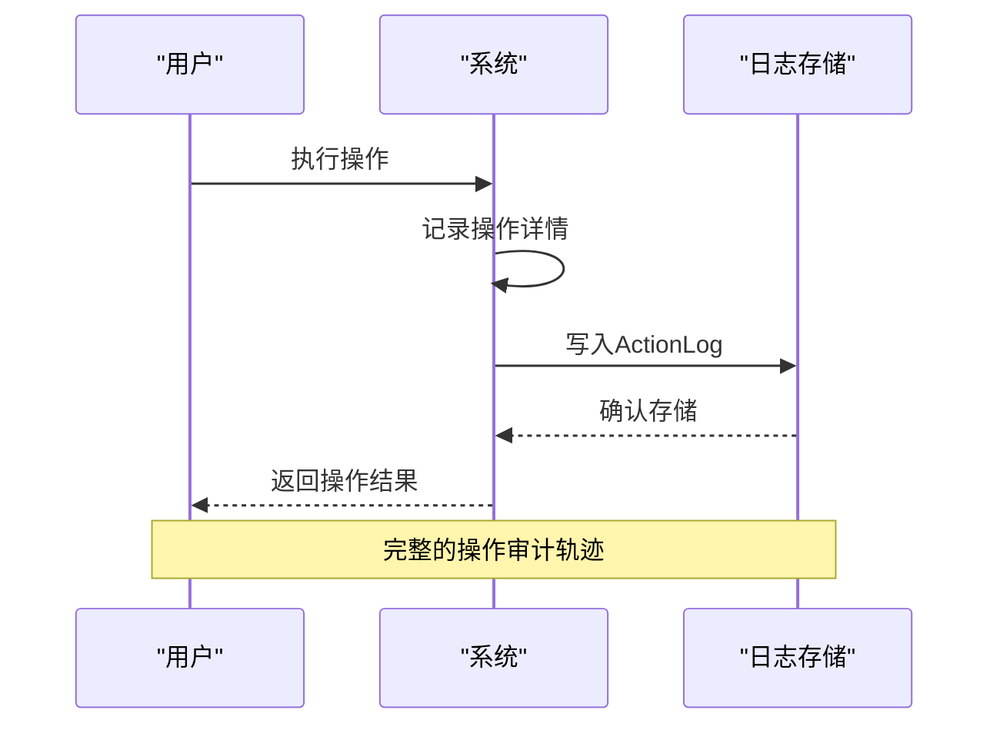

**图表来源**
- [user.model.proto](file://proto/user/user.model.proto)

**章节来源**
- [user.model.proto](file://proto/user/user.model.proto)
- [user.service.proto](file://proto/user/user.service.proto)

### 内容管理数据契约

#### 内容类型体系

内容系统支持多种内容类型，每种类型都有特定的字段组合：

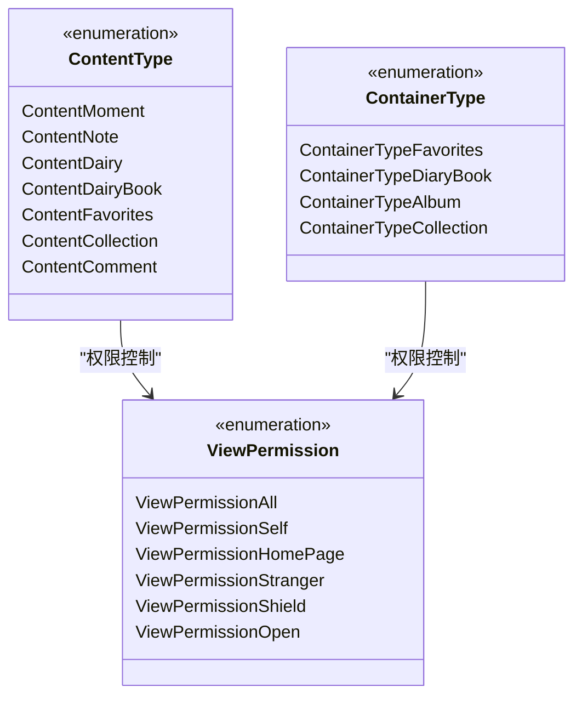

**图表来源**
- [content.model.proto](file://proto/content/content.model.proto)

#### 内容统计和分析

系统提供丰富的内容统计指标：

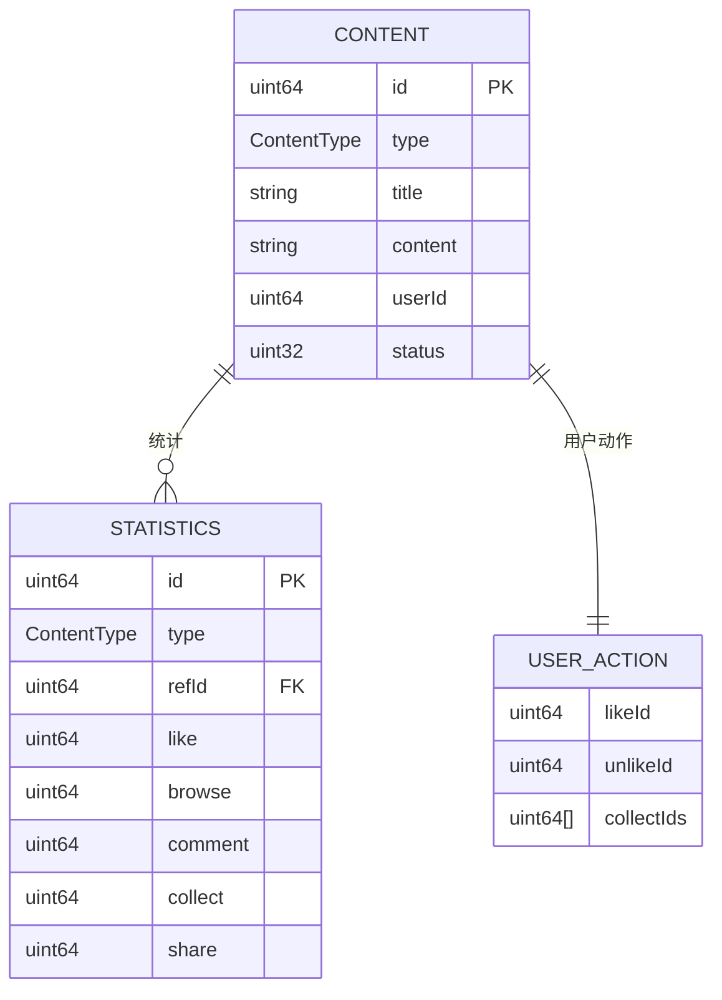

**图表来源**
- [action.model.proto](file://proto/content/action.model.proto)

**章节来源**
- [content.model.proto](file://proto/content/content.model.proto)
- [action.model.proto](file://proto/content/action.model.proto)

### 文件服务数据契约

#### 文件上传流程

文件服务提供完整的文件生命周期管理：

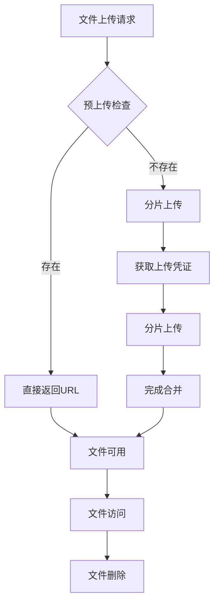

**图表来源**
- [file.service.proto](file://proto/file/file.service.proto)

**章节来源**
- [file.service.proto](file://proto/file/file.service.proto)

### 消息通信数据契约

#### 实时消息架构

消息系统支持多种消息类型和传输模式：

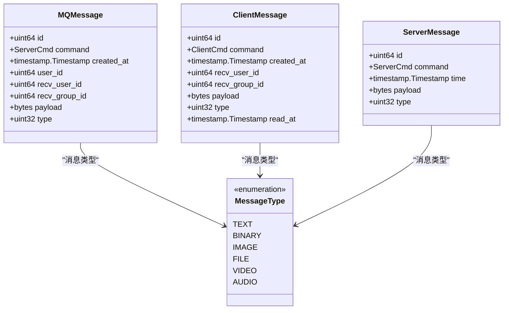

**图表来源**
- [message.proto](file://proto/message/message.proto)

**章节来源**
- [message.proto](file://proto/message/message.proto)

## 依赖关系分析

### ProtoBuf导入依赖

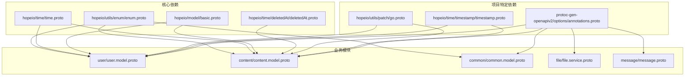

**图表来源**
- [user.model.proto](file://proto/user/user.model.proto)
- [content.model.proto](file://proto/content/content.model.proto)
- [common.model.proto](file://proto/common/common.model.proto)

### 版本兼容性策略

系统采用渐进式版本升级策略：

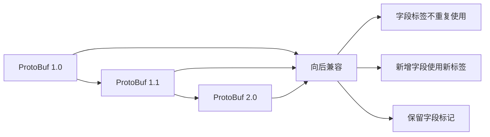

**图表来源**
- [proto/README.md](file://proto/README.md)

**章节来源**
- [proto/README.md](file://proto/README.md)

## 性能考虑

### 序列化性能优化

ProtoBuf相比JSON具有显著的性能优势：

- **二进制序列化**：比JSON更紧凑，网络传输更高效
- **零拷贝支持**：Go语言中支持零拷贝字节切片
- **流式处理**：支持大数据量的流式序列化

### 缓存策略

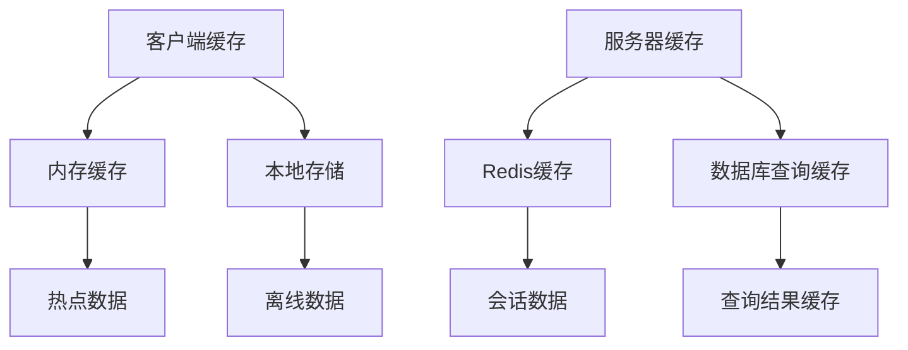

## 故障排除指南

### 常见问题诊断

#### 字段验证失败

当字段验证失败时，系统会返回明确的错误信息：

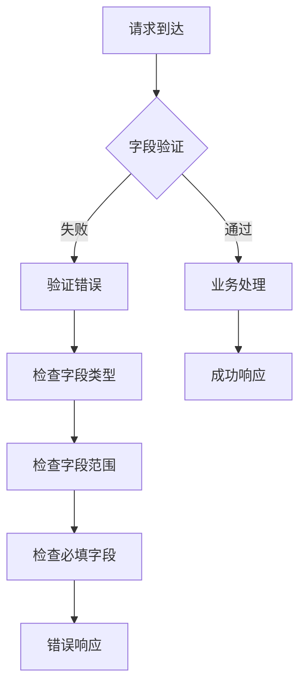

#### 兼容性问题

版本升级可能导致的兼容性问题：

1. **字段标签冲突**：避免重新使用已删除字段的标签
2. **数据类型变更**：确保新旧版本间的数据类型兼容
3. **枚举值扩展**：新增枚举值不影响现有客户端

**章节来源**
- [user.service.proto](file://proto/user/user.service.proto)
- [content.service.proto](file://proto/content/content.service.proto)

## 结论

Hoper项目的ProtoBuf数据契约设计体现了现代微服务架构的最佳实践。通过精心设计的数据模型、完善的枚举体系和严格的服务接口定义，系统实现了：

- **强类型安全**：通过ProtoBuf的静态类型检查防止运行时错误
- **向后兼容**：通过字段标签管理和版本控制确保系统演进的平滑性
- **跨平台支持**：生成多种语言的客户端代码，支持广泛的开发场景
- **性能优化**：采用二进制序列化和缓存策略，确保高并发场景下的性能表现
- **国际化支持**：专门的国际电话号码处理机制，支持全球化业务需求

**更新** 本次重大更新重构了用户模型以支持国际电话号码格式，优化了认证流程的请求/响应结构，并增强了字段验证规则和数据类型约束。这套数据契约不仅满足了当前业务需求，更为未来的功能扩展和技术演进奠定了坚实的基础。通过遵循ProtoBuf的设计原则和最佳实践，开发者可以快速理解和使用这些数据契约，提高开发效率和系统可靠性。