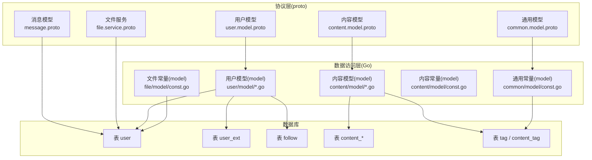
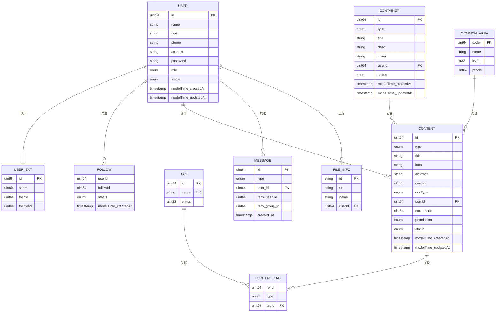
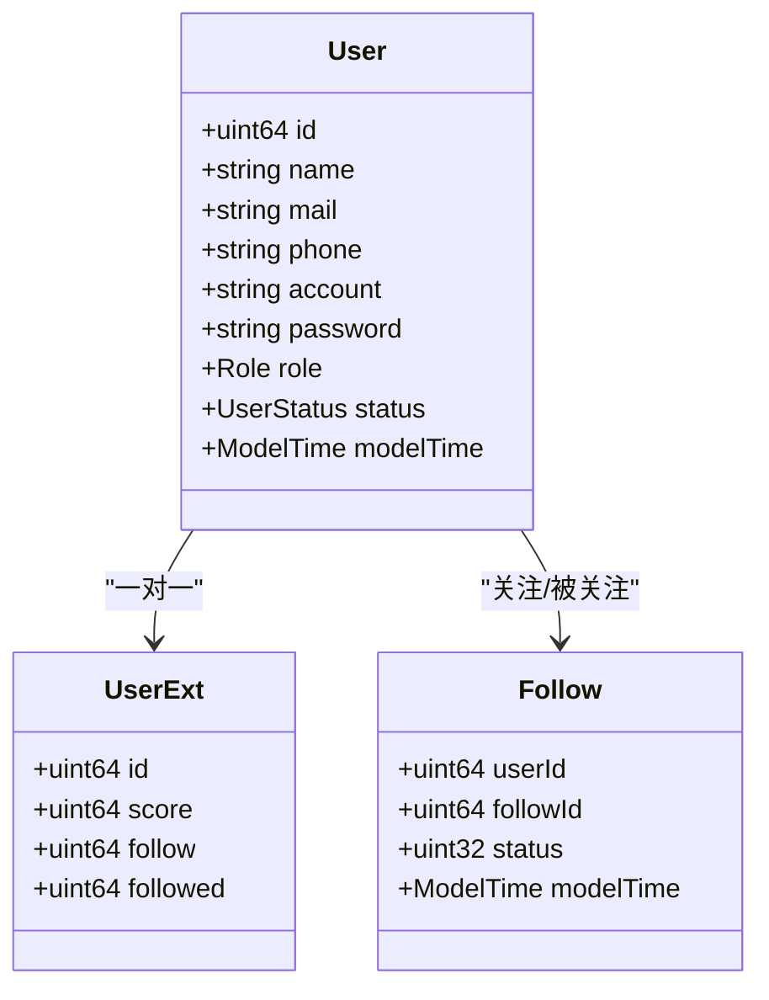
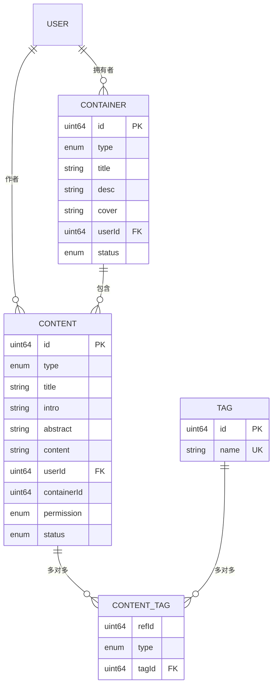
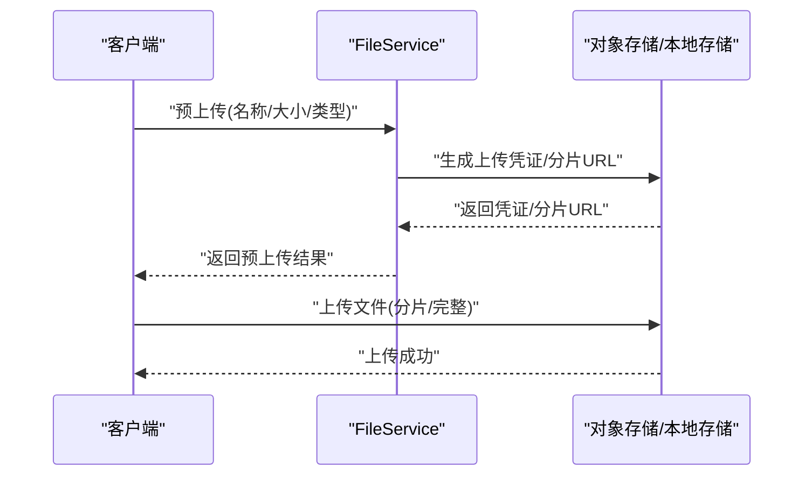
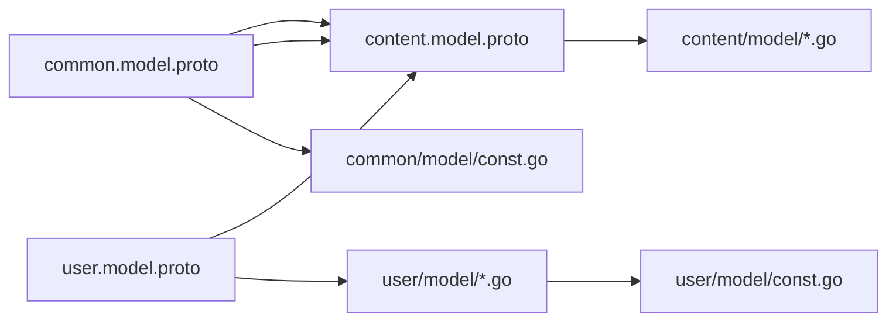

# 实体关系模型

<cite>
**本文引用的文件**
- [proto/user/user.model.proto](file://proto/user/user.model.proto)
- [proto/content/content.model.proto](file://proto/content/content.model.proto)
- [proto/common/common.model.proto](file://proto/common/common.model.proto)
- [proto/message/message.proto](file://proto/message/message.proto)
- [proto/file/file.service.proto](file://proto/file/file.service.proto)
- [server/go/user/database.sql](file://server/go/user/database.sql)
- [server/go/user/model/user.go](file://server/go/user/model/user.go)
- [server/go/user/model/const.go](file://server/go/user/model/const.go)
- [server/go/content/model/model.go](file://server/go/content/model/model.go)
- [server/go/content/model/const.go](file://server/go/content/model/const.go)
- [server/go/common/model/const.go](file://server/go/common/model/const.go)
- [server/go/file/model/const.go](file://server/go/file/model/const.go)
</cite>

## 目录
1. [引言](#引言)
2. [项目结构](#项目结构)
3. [核心组件](#核心组件)
4. [架构总览](#架构总览)
5. [详细组件分析](#详细组件分析)
6. [依赖分析](#依赖分析)
7. [性能考虑](#性能考虑)
8. [故障排查指南](#故障排查指南)
9. [结论](#结论)
10. [附录](#附录)

## 引言
本文件面向Hoper项目的实体关系建模，聚焦用户(User)、内容(Content)、文件(File)、消息(Message)等核心实体及其关系设计。文档从数据模型、关系映射、外键与级联策略、嵌入式字段、实体继承模式、生命周期与事务边界、验证与约束等方面进行系统化梳理，并通过ER图与类图直观呈现。

## 项目结构
Hoper采用“协议定义(proto) + 数据访问层(model/dao)”的分层架构：
- 协议层：以Protocol Buffers定义跨语言的业务模型与服务契约，统一前后端与微服务间的数据结构。
- 数据访问层：在Go侧通过GORM映射到关系数据库，同时结合Redis等缓存层支撑高并发场景。
- 服务层：基于gRPC/HTTP网关提供API能力，配合OpenAPI标注与GraphQL集成。

图表来源
- [proto/user/user.model.proto:1-269](file://proto/user/user.model.proto#L1-L269)
- [proto/content/content.model.proto:1-187](file://proto/content/content.model.proto#L1-L187)
- [proto/common/common.model.proto:1-213](file://proto/common/common.model.proto#L1-L213)
- [proto/message/message.proto:1-74](file://proto/message/message.proto#L1-L74)
- [proto/file/file.service.proto:1-122](file://proto/file/file.service.proto#L1-L122)
- [server/go/user/model/const.go:1-24](file://server/go/user/model/const.go#L1-L24)
- [server/go/content/model/const.go:1-73](file://server/go/content/model/const.go#L1-L73)
- [server/go/common/model/const.go:1-8](file://server/go/common/model/const.go#L1-L8)
- [server/go/file/model/const.go:1-11](file://server/go/file/model/const.go#L1-L11)

章节来源
- [proto/user/user.model.proto:1-269](file://proto/user/user.model.proto#L1-L269)
- [proto/content/content.model.proto:1-187](file://proto/content/content.model.proto#L1-L187)
- [proto/common/common.model.proto:1-213](file://proto/common/common.model.proto#L1-L213)
- [proto/message/message.proto:1-74](file://proto/message/message.proto#L1-L74)
- [proto/file/file.service.proto:1-122](file://proto/file/file.service.proto#L1-L122)

## 核心组件
本节概述关键实体与它们在协议与数据层的对应关系，以及嵌入式字段与继承模式的体现。

- 用户(User)与扩展(UserExt)
  - User：主身份信息、认证凭据、基础资料、状态与时序字段。
  - UserExt：积分、关注/被关注计数等扩展统计。
  - 关系：一对一(扩展表)，通过主键关联。
- 关注(Follow)
  - 多对多中间表，记录用户与被关注者的关系及状态。
- 内容(Content)与容器(Container)
  - Content：内容主体，包含标题、摘要、正文、可见性、标签/属性等。
  - Container：集合容器，如收藏夹、日记本等。
  - 关系：Content.userId → User.id；Content.containerId → Container.id；Content.tags ↔ Tag 的多对多。
- 标签(Tag)与内容标签(ContentTag)
  - Tag：通用标签；ContentTag：内容-标签的多对多关联表。
- 通用模型(Common)
  - Attr/AttrGroup/Dict/Area/Media/Enum/Category 等作为可复用的领域基础设施。
- 文件(File)
  - 通过FileService提供上传、分片、凭证等能力，文件元信息落库。
- 消息(Message)
  - 客户端/服务端消息、群组加入、MQ消息封装，支持多种媒体类型。

章节来源
- [proto/user/user.model.proto:19-111](file://proto/user/user.model.proto#L19-L111)
- [proto/content/content.model.proto:19-122](file://proto/content/content.model.proto#L19-L122)
- [proto/common/common.model.proto:19-153](file://proto/common/common.model.proto#L19-L153)
- [proto/file/file.service.proto:20-122](file://proto/file/file.service.proto#L20-L122)
- [proto/message/message.proto:19-74](file://proto/message/message.proto#L19-L74)

## 架构总览
下图展示核心实体的ER关系与映射要点（含嵌入式字段与多对多）：

图表来源
- [proto/user/user.model.proto:19-111](file://proto/user/user.model.proto#L19-L111)
- [proto/content/content.model.proto:43-101](file://proto/content/content.model.proto#L43-L101)
- [proto/common/common.model.proto:83-93](file://proto/common/common.model.proto#L83-L93)
- [proto/message/message.proto:28-56](file://proto/message/message.proto#L28-L56)
- [proto/file/file.service.proto:72-122](file://proto/file/file.service.proto#L72-L122)

## 详细组件分析

### 用户(User)与扩展(UserExt)、关注(Follow)
- 设计要点
  - User为主身份与认证载体；UserExt承载统计维度，避免User表膨胀。
  - Follow为多对多中间表，包含状态字段与时间戳，便于审计与限流。
  - 嵌入式字段modelTime用于统一创建/更新时间。
- 关系与约束
  - User.id → UserExt.id (一对一)
  - User.id → Follow.userId/Follow.followId (一对多)
  - Follow(userId,followId) 唯一索引建议用于去重与幂等
- 生命周期与事务
  - 注册/激活/封禁/删除等状态切换需在单事务内完成，确保一致性。
  - 关注/取消关注应原子化，防止脏数据。
- 验证与约束
  - 账号/邮箱/手机号唯一性；密码长度与强度校验；性别/角色/状态枚举约束。

图表来源
- [proto/user/user.model.proto:19-111](file://proto/user/user.model.proto#L19-L111)

章节来源
- [proto/user/user.model.proto:19-111](file://proto/user/user.model.proto#L19-L111)
- [server/go/user/model/const.go:9-23](file://server/go/user/model/const.go#L9-L23)

### 内容(Content)、容器(Container)与标签(Tag)/内容标签(ContentTag)
- 设计要点
  - Content统一承载标题、摘要、正文、可见性、地理位置等，通过type区分具体子类。
  - Container用于集合化管理，如收藏夹、日记本。
  - Content与Tag通过ContentTag建立多对多关系，支持按类型/权重筛选。
- 关系与约束
  - Content.userId → User.id
  - Content.containerId → Container.id
  - Content.tags ↔ Tag 多对多，ContentTag(refId,type,tagId)联合索引
- 继承与嵌入
  - 协议层通过嵌入式字段复用ModelTime；数据层通过多态表(Content_* + 中间表)实现继承语义。
- 生命周期与事务
  - 发布/编辑/删除/可见性变更需在事务内完成，必要时同步索引与缓存。
- 验证与约束
  - 标题/简介长度限制；可见性枚举；地理位置与标签唯一性约束。

图表来源
- [proto/content/content.model.proto:43-101](file://proto/content/content.model.proto#L43-L101)
- [proto/common/common.model.proto:83-93](file://proto/common/common.model.proto#L83-L93)

章节来源
- [proto/content/content.model.proto:19-122](file://proto/content/content.model.proto#L19-L122)
- [server/go/content/model/const.go:5-28](file://server/go/content/model/const.go#L5-L28)
- [server/go/content/model/model.go:13-48](file://server/go/content/model/model.go#L13-L48)

### 通用模型(Common)与基础设施
- 设计要点
  - Tag/Attr/AttrGroup/Dict/Area/Media/Enum/Category 等作为跨域可复用实体。
  - 通过嵌入式字段统一时间戳，减少重复定义。
- 关系与约束
  - Area支持父子关系(pcode/pArea)，适合行政区划/分类树。
  - Tag.name全局唯一，利于检索与去重。
- 验证与约束
  - 名称长度、类型枚举、状态字段等统一约束。

章节来源
- [proto/common/common.model.proto:19-153](file://proto/common/common.model.proto#L19-L153)
- [server/go/common/model/const.go:3-8](file://server/go/common/model/const.go#L3-L8)

### 文件(File)与消息(Message)
- 文件(File)
  - FileService提供预上传、分片上传、临时凭证等能力；文件元信息存储在file_info等表。
- 消息(Message)
  - 支持文本/二进制/图片/文件/视频/音频等多种类型；支持用户间与群组消息。
- 关系与约束
  - 文件与用户关联；消息与用户关联；群组加入请求/响应。
- 生命周期与事务
  - 文件上传流程需保证元信息与实际存储一致；消息发送需幂等与去重。

图表来源
- [proto/file/file.service.proto:20-122](file://proto/file/file.service.proto#L20-L122)

章节来源
- [proto/file/file.service.proto:20-122](file://proto/file/file.service.proto#L20-L122)
- [server/go/file/model/const.go:3-6](file://server/go/file/model/const.go#L3-L6)

## 依赖分析
- 协议依赖
  - content.model.proto 依赖 user.model.proto(common) 与 common.model.proto。
  - message.proto 与 file.service.proto 独立，但均依赖公共模型与时间戳。
- 数据层依赖
  - content/model.go 依赖 proto/content 与 proto/common 的枚举与消息。
  - user/model/const.go 定义表名常量，贯穿DAO层。
  - common/model/const.go 定义通用表名常量。
- 外部依赖
  - GORM注解驱动数据库映射；OpenAPI/GraphQL注解驱动接口文档与查询。

图表来源
- [proto/content/content.model.proto:3-10](file://proto/content/content.model.proto#L3-L10)
- [proto/user/user.model.proto:1-10](file://proto/user/user.model.proto#L1-L10)
- [proto/common/common.model.proto:1-10](file://proto/common/common.model.proto#L1-L10)
- [server/go/content/model/model.go:3-6](file://server/go/content/model/model.go#L3-L6)
- [server/go/user/model/const.go:1-24](file://server/go/user/model/const.go#L1-L24)
- [server/go/common/model/const.go:1-8](file://server/go/common/model/const.go#L1-L8)

章节来源
- [proto/content/content.model.proto:3-10](file://proto/content/content.model.proto#L3-L10)
- [proto/user/user.model.proto:1-10](file://proto/user/user.model.proto#L1-L10)
- [proto/common/common.model.proto:1-10](file://proto/common/common.model.proto#L1-L10)
- [server/go/content/model/model.go:3-6](file://server/go/content/model/model.go#L3-L6)
- [server/go/user/model/const.go:1-24](file://server/go/user/model/const.go#L1-L24)
- [server/go/common/model/const.go:1-8](file://server/go/common/model/const.go#L1-L8)

## 性能考虑
- 索引策略
  - 用户：account/mail/phone 唯一索引；生日/激活时间/更新时间建立索引。
  - 内容：userId/type/areaId/status/createdAt 等常用过滤字段建立复合索引。
  - 关注：(userId,followId) 唯一索引；followId 索引。
  - 标签：name 唯一索引；ContentTag(refId,type,tagId) 联合索引。
- 缓存与异步
  - 热点内容/标签/用户信息使用Redis缓存；消息与文件上传采用异步队列。
- 分表与分区
  - 按时间/类型对大表进行分片，降低单表热点。
- 事务边界
  - 所有写路径尽量收敛在单事务；批量写入使用事务批处理。

## 故障排查指南
- 常见问题
  - 唯一性冲突：账号/邮箱/手机号/标签名冲突；检查唯一索引与幂等逻辑。
  - 外键失效：删除用户后未清理关注/内容；检查级联策略与触发器。
  - 时间不一致：modelTime未正确更新；检查嵌入式字段与拦截器。
  - 文件丢失：上传成功但元信息缺失；核对预上传与回调一致性。
- 排查步骤
  - 核对协议与数据层字段映射；确认GORM注解与数据库DDL一致。
  - 检查事务日志与回滚点；定位慢查询与锁竞争。
  - 对照OpenAPI/GraphQL文档核对请求参数与返回结构。

章节来源
- [proto/user/user.model.proto:22-49](file://proto/user/user.model.proto#L22-L49)
- [proto/content/content.model.proto:45-70](file://proto/content/content.model.proto#L45-L70)
- [server/go/user/database.sql:55-89](file://server/go/user/database.sql#L55-L89)

## 结论
Hoper的实体关系模型以协议驱动、数据层落地，围绕用户、内容、标签、文件与消息构建了清晰的一对一、一对多与多对多关系。通过嵌入式字段与枚举约束统一了时间戳与状态管理，借助中间表与多态表实现了灵活的继承与扩展。建议在生产环境中强化事务边界、索引与缓存策略，并持续完善OpenAPI/GraphQL文档与监控告警体系。

## 附录
- 表清单与用途
  - user、user_ext、follow：用户身份与社交关系
  - content_*、container、content_tag：内容与集合、标签关联
  - tag、tag_group、attr、dict、area、media、enum、category：通用基础设施
  - file_info、upload_info：文件元信息
  - message：消息通道
- 关键常量
  - 表名常量位于各模块model/const.go，便于DAO层集中管理。
- 数据库初始化
  - 用户模块包含行政区划表初始化脚本，便于地理信息与统计。

章节来源
- [server/go/user/model/const.go:9-23](file://server/go/user/model/const.go#L9-L23)
- [server/go/content/model/const.go:5-28](file://server/go/content/model/const.go#L5-L28)
- [server/go/common/model/const.go:3-8](file://server/go/common/model/const.go#L3-L8)
- [server/go/file/model/const.go:3-6](file://server/go/file/model/const.go#L3-L6)
- [server/go/user/database.sql:55-89](file://server/go/user/database.sql#L55-L89)