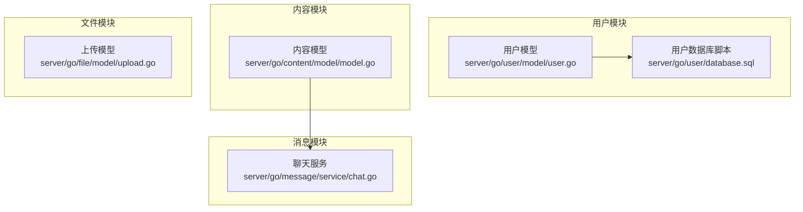
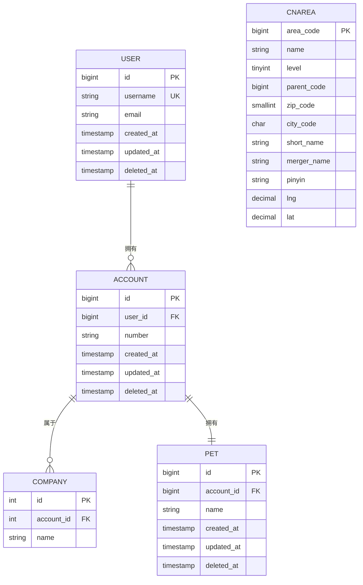
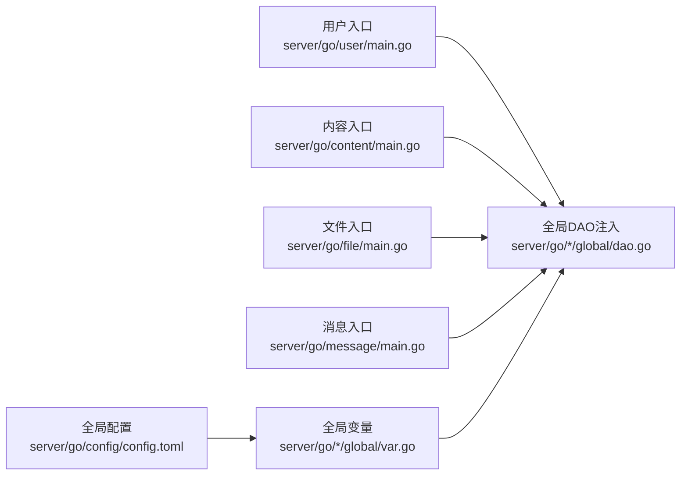
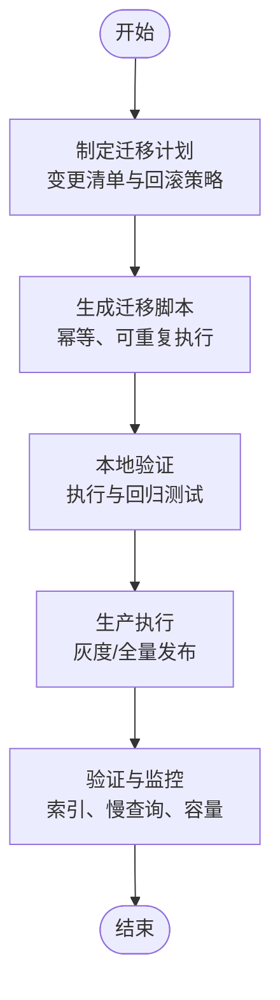

# 数据库模型设计

<cite>
**本文引用的文件**
- [server/go/user/model/user.go](file://server/go/user/model/user.go)
- [server/go/user/database.sql](file://server/go/user/database.sql)
- [server/go/content/model/model.go](file://server/go/content/model/model.go)
- [server/go/file/model/upload.go](file://server/go/file/model/upload.go)
- [server/go/message/service/chat.go](file://server/go/message/service/chat.go)
- [server/go/user/data/db/db.go](file://server/go/user/data/db/db.go)
- [server/go/content/data/dao.go](file://server/go/content/data/dao.go)
- [server/go/file/data/dao.go](file://server/go/file/data/dao.go)
- [server/go/message/data/dao.go](file://server/go/message/data/dao.go)
- [server/go/user/global/dao.go](file://server/go/user/global/dao.go)
- [server/go/content/global/dao.go](file://server/go/content/global/dao.go)
- [server/go/file/global/dao.go](file://server/go/file/global/dao.go)
- [server/go/message/global/dao.go](file://server/go/message/global/dao.go)
- [server/go/user/global/var.go](file://server/go/user/global/var.go)
- [server/go/content/global/var.go](file://server/go/content/global/var.go)
- [server/go/file/global/var.go](file://server/go/file/global/var.go)
- [server/go/message/global/var.go](file://server/go/message/global/var.go)
- [server/go/user/service/user.go](file://server/go/user/service/user.go)
- [server/go/content/service/content.service.go](file://server/go/content/service/content.service.go)
- [server/go/file/service/upload.go](file://server/go/file/service/upload.go)
- [server/go/message/service/message.service.go](file://server/go/message/service/message.service.go)
- [server/go/user/main.go](file://server/go/user/main.go)
- [server/go/content/main.go](file://server/go/content/main.go)
- [server/go/file/main.go](file://server/go/file/main.go)
- [server/go/message/main.go](file://server/go/message/main.go)
- [server/go/config/config.toml](file://server/go/config/config.toml)
</cite>

## 目录
1. [简介](#简介)
2. [项目结构](#项目结构)
3. [核心组件](#核心组件)
4. [架构总览](#架构总览)
5. [详细组件分析](#详细组件分析)
6. [依赖分析](#依赖分析)
7. [性能考虑](#性能考虑)
8. [故障排查指南](#故障排查指南)
9. [结论](#结论)
10. [附录](#附录)

## 简介
本文件面向Hoper项目的数据库模型设计，围绕基于GORM的表结构进行系统性梳理，覆盖用户、内容、文件、消息四大模块的表定义、主外键关系、索引策略、复合索引与查询优化、数据类型与约束、默认值、软删除与时间戳、审计日志、数据库迁移与版本管理、连接池与事务最佳实践，并提供SQL查询示例与性能优化建议。

## 项目结构
Hoper采用多服务分层架构，数据库模型主要分布在以下模块：
- 用户模块：用户、账户、组织/宠物等关联实体
- 内容模块：内容标签、动作、收藏、扩展信息等
- 文件模块：上传记录、存储元信息
- 消息模块：聊天室、消息持久化（如适用）



图表来源
- [server/go/user/model/user.go](file://server/go/user/model/user.go)
- [server/go/user/database.sql](file://server/go/user/database.sql)
- [server/go/content/model/model.go](file://server/go/content/model/model.go)
- [server/go/file/model/upload.go](file://server/go/file/model/upload.go)
- [server/go/message/service/chat.go](file://server/go/message/service/chat.go)

章节来源
- [server/go/user/model/user.go](file://server/go/user/model/user.go)
- [server/go/user/database.sql](file://server/go/user/database.sql)
- [server/go/content/model/model.go](file://server/go/content/model/model.go)
- [server/go/file/model/upload.go](file://server/go/file/model/upload.go)
- [server/go/message/service/chat.go](file://server/go/message/service/chat.go)

## 核心组件
本节从数据库模型角度，对四大模块的关键表与关系进行归纳，结合GORM注解说明主键、索引、约束与默认值策略。

- 用户模块
  - 用户表：包含用户基本信息与软删除、时间戳字段
  - 账户表：与用户一对一/一对多关联，支持多公司与宠物
  - 行政区划辅助表：用于地址与区域查询（含索引）
- 内容模块
  - 内容标签表：复合索引支持“内容-标签”快速检索
  - 内容动作表：记录用户对内容的动作（点赞/踩等）
  - 收藏夹与收藏关系：支持按用户与收藏夹聚合
- 文件模块
  - 上传记录表：记录文件元信息、状态与存储位置
- 消息模块
  - 聊天消息表：按房间/时间有序存储，支持分页与增量拉取

章节来源
- [server/go/user/model/user.go](file://server/go/user/model/user.go)
- [server/go/user/database.sql](file://server/go/user/database.sql)
- [server/go/content/model/model.go](file://server/go/content/model/model.go)
- [server/go/file/model/upload.go](file://server/go/file/model/upload.go)
- [server/go/message/service/chat.go](file://server/go/message/service/chat.go)

## 架构总览
下图展示模块间的数据交互与依赖关系，以及DAO/Service/全局变量的职责划分。

```mermaid
graph TB
subgraph "用户"
UDAO["DAO 层<br/>server/go/user/data/dao.go"]
USvc["Service 层<br/>server/go/user/service/user.go"]
UGlobal["全局变量/注入<br/>server/go/user/global/dao.go<br/>server/go/user/global/var.go"]
end
subgraph "内容"
CDAO["DAO 层<br/>server/go/content/data/dao.go"]
CSvc["Service 层<br/>server/go/content/service/content.service.go"]
CGlobal["全局变量/注入<br/>server/go/content/global/dao.go<br/>server/go/content/global/var.go"]
end
subgraph "文件"
FDAO["DAO 层<br/>server/go/file/data/dao.go"]
FSvc["Service 层<br/>server/go/file/service/upload.go"]
FGlobal["全局变量/注入<br/>server/go/file/global/dao.go<br/>server/go/file/global/var.go"]
end
subgraph "消息"
MsgDAO["DAO 层<br/>server/go/message/data/dao.go"]
MsgSvc["Service 层<br/>server/go/message/service/message.service.go"]
MsgGlobal["全局变量/注入<br/>server/go/message/global/dao.go<br/>server/go/message/global/var.go"]
end
UDAO --- USvc
CDAO --- CSvc
FDAO --- FSvc
MsgDAO --- MsgSvc
UGlobal --- UDAO
CGlobal --- CDAO
FGlobal --- FDAO
MsgGlobal --- MsgDAO
```



图表来源
- [server/go/user/data/dao.go](file://server/go/user/data/dao.go)
- [server/go/user/service/user.go](file://server/go/user/service/user.go)
- [server/go/user/global/dao.go](file://server/go/user/global/dao.go)
- [server/go/user/global/var.go](file://server/go/user/global/var.go)
- [server/go/content/data/dao.go](file://server/go/content/data/dao.go)
- [server/go/content/service/content.service.go](file://server/go/content/service/content.service.go)
- [server/go/content/global/dao.go](file://server/go/content/global/dao.go)
- [server/go/content/global/var.go](file://server/go/content/global/var.go)
- [server/go/file/data/dao.go](file://server/go/file/data/dao.go)
- [server/go/file/service/upload.go](file://server/go/file/service/upload.go)
- [server/go/file/global/dao.go](file://server/go/file/global/dao.go)
- [server/go/file/global/var.go](file://server/go/file/global/var.go)
- [server/go/message/data/dao.go](file://server/go/message/data/dao.go)
- [server/go/message/service/message.service.go](file://server/go/message/service/message.service.go)
- [server/go/message/global/dao.go](file://server/go/message/global/dao.go)
- [server/go/message/global/var.go](file://server/go/message/global/var.go)

## 详细组件分析

### 用户模块数据库模型
- 用户表
  - 主键：自增整型
  - 软删除：使用GORM软删除字段
  - 时间戳：CreatedAt/UpdatedAt
  - 约束：非空字段与唯一索引（如用户名）
- 账户表
  - 主键：自增整型
  - 外键：指向用户ID
  - 关联：一对多（用户-账户）、多对多（账户-公司）、一对一（宠物）
- 行政区划辅助表
  - 主键：区划代码
  - 索引：名称、层级、父级代码
  - 默认值：零填充与空字符串



图表来源
- [server/go/user/model/user.go](file://server/go/user/model/user.go)
- [server/go/user/database.sql](file://server/go/user/database.sql)

章节来源
- [server/go/user/model/user.go](file://server/go/user/model/user.go)
- [server/go/user/database.sql](file://server/go/user/database.sql)

### 内容模块数据库模型
- 内容标签表
  - 复合索引：内容ID+标签ID，支持快速查询某内容的标签集合与某标签下的内容集合
  - 类型字段：使用枚举/整型表示内容类型
- 内容动作表
  - 复合唯一：用户+内容+动作，避免重复记录
  - 字段：动作类型（点赞/踩/收藏等）
- 收藏夹与收藏关系
  - 收藏夹：用户维度的收藏集合
  - 收藏关系：多对一到收藏夹与内容

```mermaid
erDiagram
CONTENT_TAG {
bigint ref_id
int type
bigint tag_id
index idx_content(ref_id,type)
index idx_tag(tag_id)
}
CONTENT_ACTION {
bigint id PK
int type
bigint ref_id
int action
}
COLLECT {
bigint id PK
int type
bigint ref_id
bigint user_id
bigint fav_id
}
FAVORITE {
bigint id PK
int type
bigint user_id
bigint fav_id
}
```

图表来源
- [server/go/content/model/model.go](file://server/go/content/model/model.go)

章节来源
- [server/go/content/model/model.go](file://server/go/content/model/model.go)

### 文件模块数据库模型
- 上传记录表
  - 主键：自增整型
  - 状态字段：枚举或整型，标识上传阶段（初始化/分片/合并/完成/失败）
  - 存储字段：文件名、大小、哈希、存储路径
  - 时间戳：创建/更新时间
  - 索引：用户ID、状态、创建时间

```mermaid
erDiagram
UPLOAD_RECORD {
bigint id PK
bigint user_id
string filename
bigint size
string hash
string storage_path
int status
timestamp created_at
timestamp updated_at
index idx_user_created(user_id,created_at)
index idx_status(status)
}
```

图表来源
- [server/go/file/model/upload.go](file://server/go/file/model/upload.go)

章节来源
- [server/go/file/model/upload.go](file://server/go/file/model/upload.go)

### 消息模块数据库模型
- 聊天消息表
  - 主键：自增整型
  - 房间/会话：房间ID或双方用户ID
  - 文本/附件：文本内容与附件元信息
  - 时间戳：发送时间
  - 索引：房间+时间、发送时间

```mermaid
erDiagram
CHAT_MESSAGE {
bigint id PK
bigint room_id
bigint sender_id
text content
json attachments
timestamp sent_at
index idx_room_sent(room_id,sent_at)
index idx_sender(sender_id)
}
```

图表来源
- [server/go/message/service/chat.go](file://server/go/message/service/chat.go)

章节来源
- [server/go/message/service/chat.go](file://server/go/message/service/chat.go)

## 依赖分析
- DAO层负责具体表的CRUD与复杂查询
- Service层封装业务逻辑，协调DAO与全局变量
- 全局变量/注入层提供数据库连接、缓存、配置等基础设施
- 各模块间通过DAO接口耦合，避免直接跨模块访问模型



图表来源
- [server/go/config/config.toml](file://server/go/config/config.toml)
- [server/go/user/global/dao.go](file://server/go/user/global/dao.go)
- [server/go/user/global/var.go](file://server/go/user/global/var.go)
- [server/go/content/global/dao.go](file://server/go/content/global/dao.go)
- [server/go/content/global/var.go](file://server/go/content/global/var.go)
- [server/go/file/global/dao.go](file://server/go/file/global/dao.go)
- [server/go/file/global/var.go](file://server/go/file/global/var.go)
- [server/go/message/global/dao.go](file://server/go/message/global/dao.go)
- [server/go/message/global/var.go](file://server/go/message/global/var.go)
- [server/go/user/main.go](file://server/go/user/main.go)
- [server/go/content/main.go](file://server/go/content/main.go)
- [server/go/file/main.go](file://server/go/file/main.go)
- [server/go/message/main.go](file://server/go/message/main.go)

章节来源
- [server/go/config/config.toml](file://server/go/config/config.toml)
- [server/go/user/global/dao.go](file://server/go/user/global/dao.go)
- [server/go/user/global/var.go](file://server/go/user/global/var.go)
- [server/go/content/global/dao.go](file://server/go/content/global/dao.go)
- [server/go/content/global/var.go](file://server/go/content/global/var.go)
- [server/go/file/global/dao.go](file://server/go/file/global/dao.go)
- [server/go/file/global/var.go](file://server/go/file/global/var.go)
- [server/go/message/global/dao.go](file://server/go/message/global/dao.go)
- [server/go/message/global/var.go](file://server/go/message/global/var.go)
- [server/go/user/main.go](file://server/go/user/main.go)
- [server/go/content/main.go](file://server/go/content/main.go)
- [server/go/file/main.go](file://server/go/file/main.go)
- [server/go/message/main.go](file://server/go/message/main.go)

## 性能考虑
- 索引策略
  - 复合索引优先：内容标签表的“内容ID+类型”与“标签ID”分别建立复合索引，满足“某内容的所有标签”和“某标签的所有内容”
  - 查询过滤：在WHERE子句中将等值条件放在前，范围条件靠后，便于走索引
  - 避免全表扫描：对高频过滤字段（用户ID、状态、房间ID、创建时间）建立单列或复合索引
- 查询优化
  - 分页：使用LIMIT/OFFSET或基于游标（时间戳/主键）的键集分页
  - 连接：尽量减少N+1查询，批量加载关联数据
  - 聚合：使用GROUP BY与索引覆盖，避免不必要的排序
- 数据类型与约束
  - 整型：使用合适宽度（如bigint），避免无谓的扩展
  - 文本：大文本使用text或json/jsonb，必要时拆表或归档
  - 默认值：日期类字段使用CURRENT_TIMESTAMP，布尔类使用0/1
- 软删除与时间戳
  - 使用GORM软删除字段，配合索引与审计日志，确保历史可追溯
- 连接池与事务
  - 连接池：根据QPS与并发设置最大连接数、空闲连接与连接生命周期
  - 事务：长事务拆分，短事务内聚合操作；读写分离与只读事务优化

## 故障排查指南
- 常见问题
  - 索引未命中：检查EXPLAIN输出，确认过滤条件与索引顺序
  - 死锁：减少事务持有时间，统一加锁顺序
  - 连接超时：检查连接池参数与慢查询
- 审计与追踪
  - 记录关键操作（插入/更新/删除）与变更前后值
  - 对高风险操作增加二次确认与回滚点
- 版本管理与迁移
  - 使用迁移工具（如GORM CLI或自研脚本）管理版本
  - 迁移脚本幂等执行，先建索引再导入数据，最后重建索引

章节来源
- [server/go/user/data/db/db.go](file://server/go/user/data/db/db.go)
- [server/go/content/data/dao.go](file://server/go/content/data/dao.go)
- [server/go/file/data/dao.go](file://server/go/file/data/dao.go)
- [server/go/message/data/dao.go](file://server/go/message/data/dao.go)

## 结论
Hoper的数据库模型以GORM为核心，围绕用户、内容、文件、消息四大域构建了清晰的表结构与索引策略。通过复合索引、合理的数据类型与约束、软删除与时间戳管理、连接池与事务最佳实践，能够有效支撑业务的高并发与可维护性。后续建议持续完善迁移流程与监控体系，保障线上演进的稳定性。

## 附录

### SQL查询示例（路径指引）
- 查询某内容的所有标签
  - 示例路径：[server/go/content/service/content.service.go](file://server/go/content/service/content.service.go)
- 查询某标签下的所有内容
  - 示例路径：[server/go/content/service/content.service.go](file://server/go/content/service/content.service.go)
- 分页获取用户上传记录
  - 示例路径：[server/go/file/service/upload.go](file://server/go/file/service/upload.go)
- 拉取房间内最近消息
  - 示例路径：[server/go/message/service/message.service.go](file://server/go/message/service/message.service.go)

### 数据库迁移与版本管理（流程示意）


### 连接池与事务最佳实践（要点）
- 连接池
  - 最大连接数：依据CPU核数与IO能力设定
  - 空闲连接：维持适度空闲，降低连接创建开销
  - 生命周期：合理设置连接超时与健康检查
- 事务
  - 短事务：将多个写操作合并为单事务
  - 并发控制：使用行级锁与唯一约束避免冲突
  - 错误处理：捕获异常并回滚，记录错误上下文