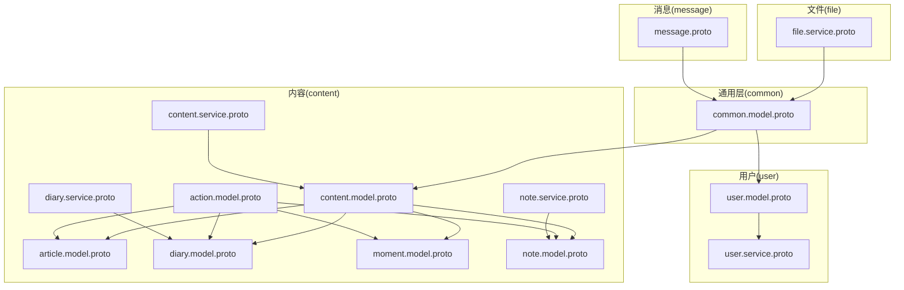
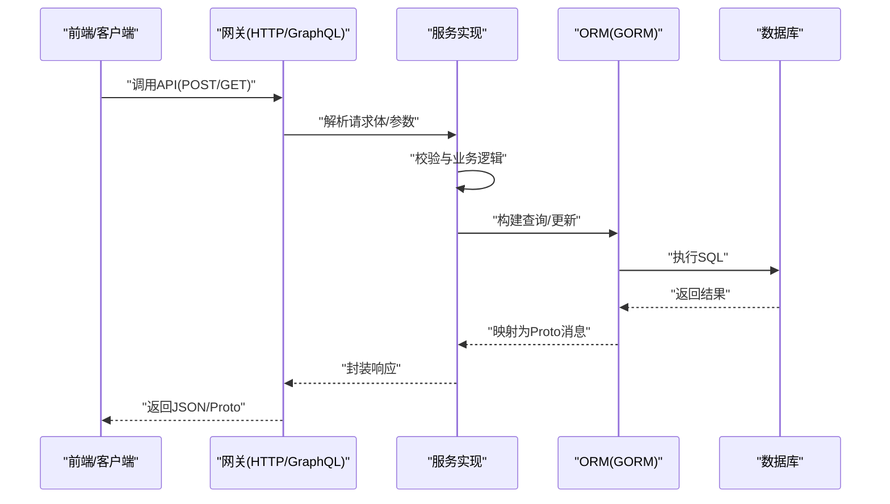
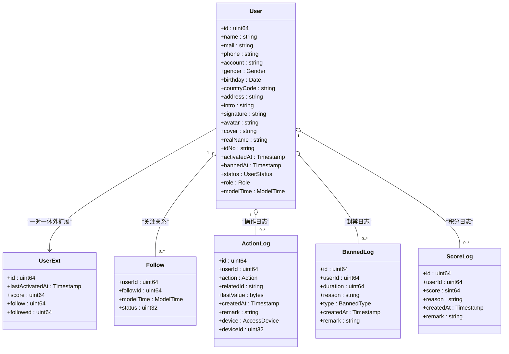
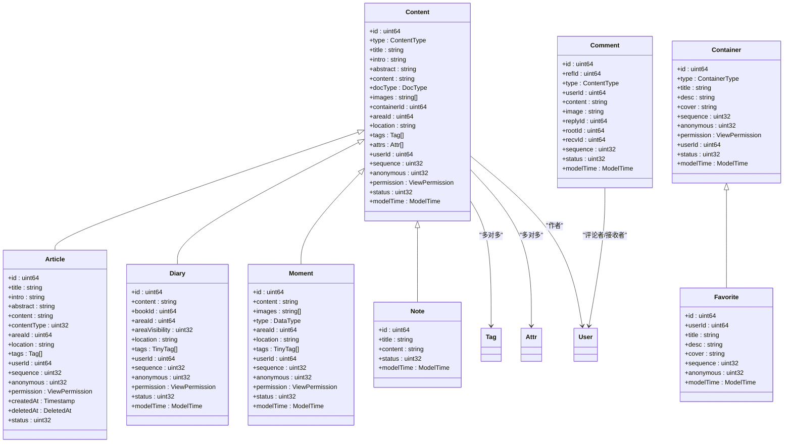
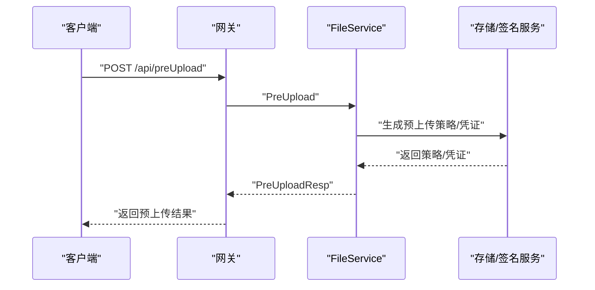
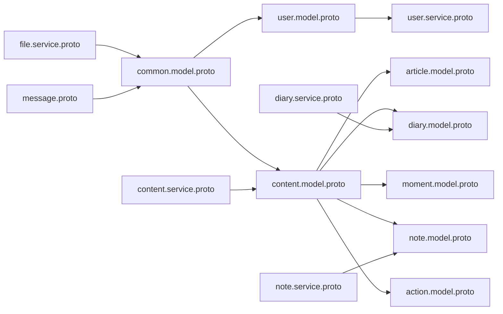

# 数据模型

<cite>
**本文引用的文件**
- [proto/user/user.model.proto](file://proto/user/user.model.proto)
- [proto/user/user.service.proto](file://proto/user/user.service.proto)
- [proto/content/content.model.proto](file://proto/content/content.model.proto)
- [proto/content/action.model.proto](file://proto/content/action.model.proto)
- [proto/content/article.model.proto](file://proto/content/article.model.proto)
- [proto/content/diary.model.proto](file://proto/content/diary.model.proto)
- [proto/content/moment.model.proto](file://proto/content/moment.model.proto)
- [proto/content/note.model.proto](file://proto/content/note.model.proto)
- [proto/content/content.service.proto](file://proto/content/content.service.proto)
- [proto/content/diary.service.proto](file://proto/content/diary.service.proto)
- [proto/content/note.service.proto](file://proto/content/note.service.proto)
- [proto/file/file.service.proto](file://proto/file/file.service.proto)
- [proto/message/message.proto](file://proto/message/message.proto)
- [proto/common/common.model.proto](file://proto/common/common.model.proto)
</cite>

## 目录
1. [简介](#简介)
2. [项目结构](#项目结构)
3. [核心组件](#核心组件)
4. [架构总览](#架构总览)
5. [详细组件分析](#详细组件分析)
6. [依赖分析](#依赖分析)
7. [性能考虑](#性能考虑)
8. [故障排查指南](#故障排查指南)
9. [结论](#结论)
10. [附录](#附录)

## 简介
本文件面向Hoper数据模型，围绕基于ProtoBuf的统一数据契约，系统梳理用户模型、内容模型、文件模型与消息模型的定义与关系，阐释版本管理、向后兼容与迁移策略，给出数据库表结构设计、索引优化与查询性能优化建议，并总结数据验证规则、业务约束与数据完整性保障机制。同时提供使用示例与最佳实践，确保前后端数据一致性。

## 项目结构
Hoper采用“按领域分层”的ProtoBuf组织方式：
- common：跨域通用模型（标签、区域、媒体、字典、枚举等）
- user：用户域模型与服务
- content：内容域模型（文章、日记、瞬间、笔记、容器与收藏夹）与服务
- file：文件服务（预上传、URL获取）
- message：消息与MQ消息模型

图表来源
- [proto/common/common.model.proto:1-213](file://proto/common/common.model.proto#L1-L213)
- [proto/user/user.model.proto:1-269](file://proto/user/user.model.proto#L1-L269)
- [proto/user/user.service.proto:1-424](file://proto/user/user.service.proto#L1-L424)
- [proto/content/content.model.proto:1-187](file://proto/content/content.model.proto#L1-L187)
- [proto/content/action.model.proto:1-171](file://proto/content/action.model.proto#L1-L171)
- [proto/content/article.model.proto:1-45](file://proto/content/article.model.proto#L1-L45)
- [proto/content/diary.model.proto:1-59](file://proto/content/diary.model.proto#L1-L59)
- [proto/content/moment.model.proto:1-47](file://proto/content/moment.model.proto#L1-L47)
- [proto/content/note.model.proto:1-39](file://proto/content/note.model.proto#L1-L39)
- [proto/content/content.service.proto:1-144](file://proto/content/content.service.proto#L1-L144)
- [proto/content/diary.service.proto:1-181](file://proto/content/diary.service.proto#L1-L181)
- [proto/content/note.service.proto:1-47](file://proto/content/note.service.proto#L1-L47)
- [proto/file/file.service.proto:1-122](file://proto/file/file.service.proto#L1-L122)
- [proto/message/message.proto:1-74](file://proto/message/message.proto#L1-L74)

章节来源
- [proto/common/common.model.proto:1-213](file://proto/common/common.model.proto#L1-L213)
- [proto/user/user.model.proto:1-269](file://proto/user/user.model.proto#L1-L269)
- [proto/user/user.service.proto:1-424](file://proto/user/user.service.proto#L1-L424)
- [proto/content/content.model.proto:1-187](file://proto/content/content.model.proto#L1-L187)
- [proto/content/action.model.proto:1-171](file://proto/content/action.model.proto#L1-L171)
- [proto/content/article.model.proto:1-45](file://proto/content/article.model.proto#L1-L45)
- [proto/content/diary.model.proto:1-59](file://proto/content/diary.model.proto#L1-L59)
- [proto/content/moment.model.proto:1-47](file://proto/content/moment.model.proto#L1-L47)
- [proto/content/note.model.proto:1-39](file://proto/content/note.model.proto#L1-L39)
- [proto/content/content.service.proto:1-144](file://proto/content/content.service.proto#L1-L144)
- [proto/content/diary.service.proto:1-181](file://proto/content/diary.service.proto#L1-L181)
- [proto/content/note.service.proto:1-47](file://proto/content/note.service.proto#L1-L47)
- [proto/file/file.service.proto:1-122](file://proto/file/file.service.proto#L1-L122)
- [proto/message/message.proto:1-74](file://proto/message/message.proto#L1-L74)

## 核心组件
- 用户模型：User、UserExt、Follow、ScoreLog、BannedLog、ActionLog、Resume、AccessDevice、Device、Auth等，覆盖用户基本信息、扩展统计、关注关系、行为审计、设备信息与认证状态。
- 内容模型：Content、Container、Favorite、UserStatistics、标签/属性关联、可见性控制、删除软删支持；具体类型如Article、Diary/DiaryBook、Moment、Note在各自模型中细化。
- 通用模型：Tag、Area、Media、Dict、Category、Enum、Attr/AttrGroup、EditLog、Mail/SMS等，支撑跨域复用与元数据管理。
- 文件模型：FileService提供预上传、分片上传、临时凭证与URL获取能力。
- 消息模型：MQMessage、ClientMessage、ServerMessage及JoinGroup等，用于消息路由与传输。

章节来源
- [proto/user/user.model.proto:19-269](file://proto/user/user.model.proto#L19-L269)
- [proto/content/content.model.proto:43-187](file://proto/content/content.model.proto#L43-L187)
- [proto/common/common.model.proto:19-213](file://proto/common/common.model.proto#L19-L213)
- [proto/file/file.service.proto:20-122](file://proto/file/file.service.proto#L20-L122)
- [proto/message/message.proto:28-74](file://proto/message/message.proto#L28-L74)

## 架构总览
统一数据契约通过ProtoBuf定义，结合GORM标签映射到数据库表结构，配合服务层HTTP/GraphQL/Gateway暴露API，形成前后端一致的数据协议与交互模式。

图表来源
- [proto/user/user.service.proto:26-258](file://proto/user/user.service.proto#L26-L258)
- [proto/content/content.service.proto:18-94](file://proto/content/content.service.proto#L18-L94)
- [proto/content/diary.service.proto:19-122](file://proto/content/diary.service.proto#L19-L122)
- [proto/content/note.service.proto:21-40](file://proto/content/note.service.proto#L21-L40)
- [proto/file/file.service.proto:20-62](file://proto/file/file.service.proto#L20-L62)

## 详细组件分析

### 用户模型与服务
- 用户实体与扩展：User包含基础字段与ModelTime嵌入；UserExt提供关注数、被关注数、积分等扩展统计；Follow建立用户与被关注者的关系；ActionLog记录用户关键动作；BannedLog记录封禁历史；ScoreLog记录积分变动。
- 设备与访问：AccessDevice描述设备与地理位置信息；Device描述设备硬件配置；二者均通过GORM标签映射到数据库列。
- 角色与状态：Role、Gender、UserStatus、BannedType、DeviceType等枚举定义了用户域的取值范围与语义。
- 服务接口：UserService提供注册、登录、激活、编辑、鉴权、重置密码、关注/取关、操作日志查询等接口，均以HTTP+OpenAPI标注，便于生成文档与SDK。

图表来源
- [proto/user/user.model.proto:20-111](file://proto/user/user.model.proto#L20-L111)

章节来源
- [proto/user/user.model.proto:19-269](file://proto/user/user.model.proto#L19-L269)
- [proto/user/user.service.proto:26-258](file://proto/user/user.service.proto#L26-L258)

### 内容模型与服务
- 内容与容器：Content承载文章/日记/瞬间等多形态内容，支持标签与属性多对多关联、可见性控制、匿名与排序；Container/Favorite用于收藏夹与合集；UserStatistics统计用户各类内容数量。
- 行为与统计：Action/Collect/Like/UnLike/Report/Share/Comment等模型记录用户行为与统计聚合；Statistics/UserAction提供内容侧的统计与用户当前动作快照。
- 具体类型：Article/Diary/Moment/Note分别细化标题、摘要、正文、标签、用户、权限、时间戳与软删支持；DiaryBook为日记容器。
- 服务接口：ContentService提供收藏夹/合集管理与用户统计；DiaryService提供日记本与日记的增删改查；NoteService提供笔记创建。

图表来源
- [proto/content/content.model.proto:43-187](file://proto/content/content.model.proto#L43-L187)
- [proto/content/article.model.proto:17-45](file://proto/content/article.model.proto#L17-L45)
- [proto/content/diary.model.proto:19-59](file://proto/content/diary.model.proto#L19-L59)
- [proto/content/moment.model.proto:19-47](file://proto/content/moment.model.proto#L19-L47)
- [proto/content/note.model.proto:16-39](file://proto/content/note.model.proto#L16-L39)
- [proto/content/action.model.proto:95-171](file://proto/content/action.model.proto#L95-L171)

章节来源
- [proto/content/content.model.proto:1-187](file://proto/content/content.model.proto#L1-L187)
- [proto/content/action.model.proto:1-171](file://proto/content/action.model.proto#L1-L171)
- [proto/content/article.model.proto:1-45](file://proto/content/article.model.proto#L1-L45)
- [proto/content/diary.model.proto:1-59](file://proto/content/diary.model.proto#L1-L59)
- [proto/content/moment.model.proto:1-47](file://proto/content/moment.model.proto#L1-L47)
- [proto/content/note.model.proto:1-39](file://proto/content/note.model.proto#L1-L39)
- [proto/content/content.service.proto:1-144](file://proto/content/content.service.proto#L1-L144)
- [proto/content/diary.service.proto:1-181](file://proto/content/diary.service.proto#L1-L181)
- [proto/content/note.service.proto:1-47](file://proto/content/note.service.proto#L1-L47)

### 通用模型
- 标签/区域/媒体/字典/分类/枚举：Tag/Area/Media/Dict/Category/Enum等提供跨域复用的元数据能力；支持唯一索引、层级父子关系、状态与时间戳。
- 属性体系：Attr/AttrGroup/AttrAttrGroup构成灵活的属性-分组-归属关系，支持范围与类型约束。
- 编辑日志：EditLog记录表级变更的旧值与新值，便于审计与回溯。

章节来源
- [proto/common/common.model.proto:19-213](file://proto/common/common.model.proto#L19-L213)

### 文件模型
- FileService提供获取URL、按ID批量获取、预上传等能力；预上传类型包括直传、分片上传、临时凭证与存在性检查；返回结构包含文件信息、上传URL、分片上传信息与临时凭证。

图表来源
- [proto/file/file.service.proto:20-122](file://proto/file/file.service.proto#L20-L122)

章节来源
- [proto/file/file.service.proto:1-122](file://proto/file/file.service.proto#L1-L122)

### 消息模型
- MQMessage/ClientMessage/ServerMessage定义消息载体与命令类型；支持文本、二进制、图片、文件、视频、音频等多种类型；ClientMeta携带用户与设备标识；Message服务提供发送与接收接口。

章节来源
- [proto/message/message.proto:1-74](file://proto/message/message.proto#L1-L74)

## 依赖分析
- Proto导入链：各领域模型通过import复用common与user模型；内容模型进一步依赖action与具体类型模型；服务层依赖对应模型与OpenAPI/Gateway注解。
- 服务-模型耦合：服务接口参数/返回均以Proto消息定义，避免手写序列化；GORM标签贯穿模型，确保ORM映射与数据库约束一致。
- 枚举与校验：大量枚举与validate标签共同保证数据合法性与业务一致性。

图表来源
- [proto/common/common.model.proto:1-213](file://proto/common/common.model.proto#L1-L213)
- [proto/user/user.model.proto:1-269](file://proto/user/user.model.proto#L1-L269)
- [proto/content/content.model.proto:1-187](file://proto/content/content.model.proto#L1-L187)
- [proto/content/action.model.proto:1-171](file://proto/content/action.model.proto#L1-L171)
- [proto/content/article.model.proto:1-45](file://proto/content/article.model.proto#L1-L45)
- [proto/content/diary.model.proto:1-59](file://proto/content/diary.model.proto#L1-L59)
- [proto/content/moment.model.proto:1-47](file://proto/content/moment.model.proto#L1-L47)
- [proto/content/note.model.proto:1-39](file://proto/content/note.model.proto#L1-L39)
- [proto/content/content.service.proto:1-144](file://proto/content/content.service.proto#L1-L144)
- [proto/content/diary.service.proto:1-181](file://proto/content/diary.service.proto#L1-L181)
- [proto/content/note.service.proto:1-47](file://proto/content/note.service.proto#L1-L47)
- [proto/file/file.service.proto:1-122](file://proto/file/file.service.proto#L1-L122)
- [proto/message/message.proto:1-74](file://proto/message/message.proto#L1-L74)

## 性能考虑
- 索引与查询
  - 内容类：type、userId、areaId、sequence、anonymous、status、createdAt等字段广泛建立索引，满足按类型、作者、区域、排序、状态与时间的高频查询。
  - 关系类：Follow、Action、Collect、Report、Comment等均在type/refId/userId上建立复合索引，降低多表联结成本。
  - 软删：DeletedAt字段统一参与索引，确保软删除不影响查询性能。
- 索引优化建议
  - 对高并发的组合查询（如“按作者+类型+状态”）优先使用复合索引。
  - 对热点字段（如userId、type）考虑局部性与分区策略（若数据库支持）。
  - JSON/数组字段（如images）建议拆表或物化索引，避免在WHERE中进行复杂匹配。
- 序列化与体积
  - 大字段（content、desc等）建议分表或外部存储，减少主表扫描与网络传输。
  - 多对多中间表（content_tag、content_attr、fav_follow等）需维护一致性与查询效率。
- 缓存与异步
  - 统计类数据（UserStatistics、Statistics）可缓存热点结果，定期异步刷新。
  - 行为日志与审计（ActionLog、EditLog）可异步入队，降低写放大。

[本节为通用性能指导，不直接分析具体文件]

## 故障排查指南
- 数据校验失败
  - 用户注册/登录请求中的长度、格式与必填校验由validate标签驱动；服务端应返回明确的错误码与提示。
- 权限与状态异常
  - UserStatus/BannedType/ViewPermission等枚举控制访问与展示；确认状态流转与权限判定逻辑。
- 关系一致性问题
  - Follow/Collect/Comment等关系表需保证type/refId/userId三元组唯一性；查询时注意软删过滤。
- 文件上传异常
  - 预上传类型与凭证有效期需正确传递；分片上传需校验分片序号与ETag。
- 消息收发异常
  - ClientMeta与消息类型需匹配；群组加入需确认group_id有效性。

章节来源
- [proto/user/user.service.proto:290-424](file://proto/user/user.service.proto#L290-L424)
- [proto/file/file.service.proto:90-122](file://proto/file/file.service.proto#L90-L122)
- [proto/message/message.proto:58-74](file://proto/message/message.proto#L58-L74)

## 结论
Hoper通过ProtoBuf统一数据契约，结合GORM标签与服务层HTTP/GraphQL/Gateway，实现了前后端一致的数据协议与清晰的领域划分。用户、内容、文件与消息四大模型覆盖主要业务场景，配合完善的枚举与校验规则，确保数据完整性与业务一致性。建议在生产环境中持续完善索引策略、缓存与异步处理，以获得更优的查询与写入性能。

[本节为总结性内容，不直接分析具体文件]

## 附录

### 版本管理、向后兼容与迁移策略
- 版本管理
  - 在服务注解中使用版本标记（如OpenAPI注解），区分接口版本，便于灰度与回滚。
- 向后兼容
  - 字段新增遵循“可选且非破坏性”，避免移除已用字段；枚举新增占位项，保持数值稳定。
  - 使用oneof或条件字段表达可选结构，避免默认值歧义。
- 迁移策略
  - 新增索引与表结构采用“在线DDL”或双写+扫描迁移，降低停机风险。
  - 对大表分批迁移，结合Binlog/审计日志回放校验一致性。
  - 引入Schema演进工具与自动化测试，确保迁移质量。

[本节为通用指导，不直接分析具体文件]

### 数据验证规则与业务约束
- 字段约束
  - 长度、唯一性、非空、枚举取值、邮箱/手机号格式等通过validate与GORM标签约束。
- 业务约束
  - 关系唯一性（如收藏夹标题唯一、关注关系唯一）、状态机（激活/冻结/注销）、权限矩阵（公开/私有/好友可见）。
- 完整性保证
  - 外键约束与软删DeletedAt；事务内批量写入；幂等接口设计（如预上传、关注）。

章节来源
- [proto/user/user.model.proto:20-111](file://proto/user/user.model.proto#L20-L111)
- [proto/content/content.model.proto:43-187](file://proto/content/content.model.proto#L43-L187)
- [proto/common/common.model.proto:19-213](file://proto/common/common.model.proto#L19-L213)

### 使用示例与最佳实践
- 用户注册/登录
  - 使用UserService的注册与登录接口，结合验证码校验；登录成功后使用令牌访问受保护资源。
- 发布内容
  - 选择合适的内容类型（文章/日记/瞬间/笔记），填充必要字段与标签；设置可见性与匿名选项。
- 文件上传
  - 先调用预上传接口获取策略，再执行直传或分片上传；上传完成后更新内容引用。
- 消息通信
  - 建立连接后发送加入群组请求，随后按类型发送消息；注意payload与类型匹配。

章节来源
- [proto/user/user.service.proto:26-258](file://proto/user/user.service.proto#L26-L258)
- [proto/content/content.service.proto:18-94](file://proto/content/content.service.proto#L18-L94)
- [proto/content/diary.service.proto:19-122](file://proto/content/diary.service.proto#L19-L122)
- [proto/content/note.service.proto:21-40](file://proto/content/note.service.proto#L21-L40)
- [proto/file/file.service.proto:20-122](file://proto/file/file.service.proto#L20-L122)
- [proto/message/message.proto:71-74](file://proto/message/message.proto#L71-L74)