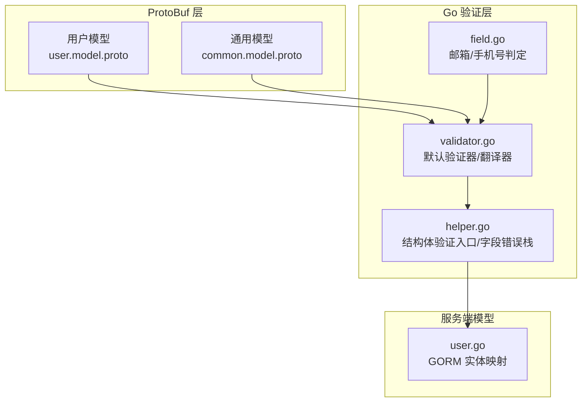
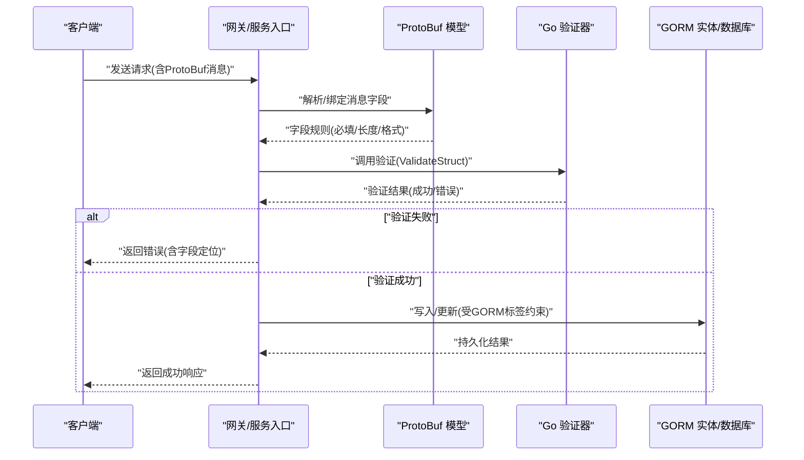
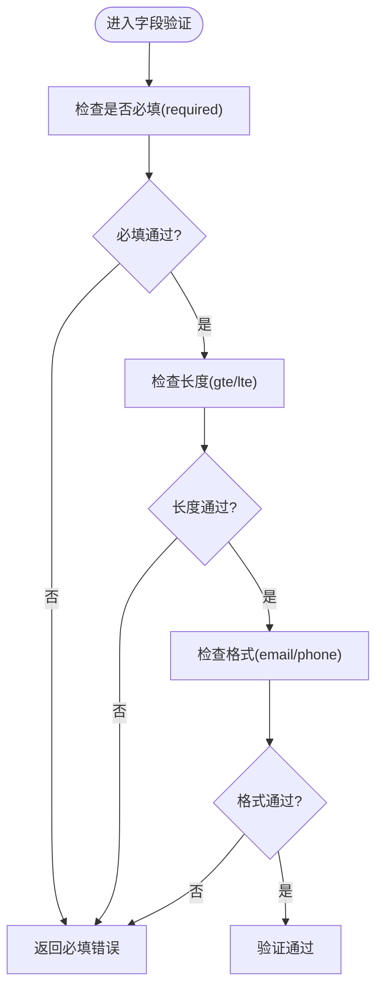
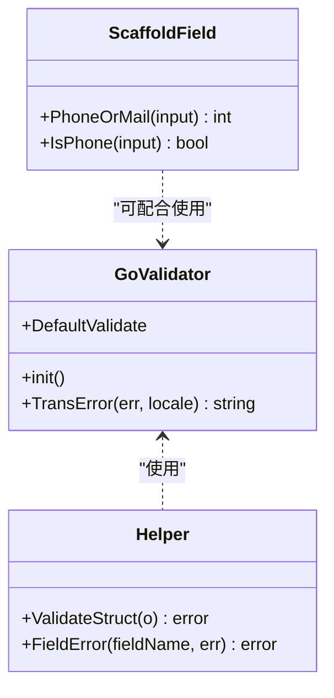
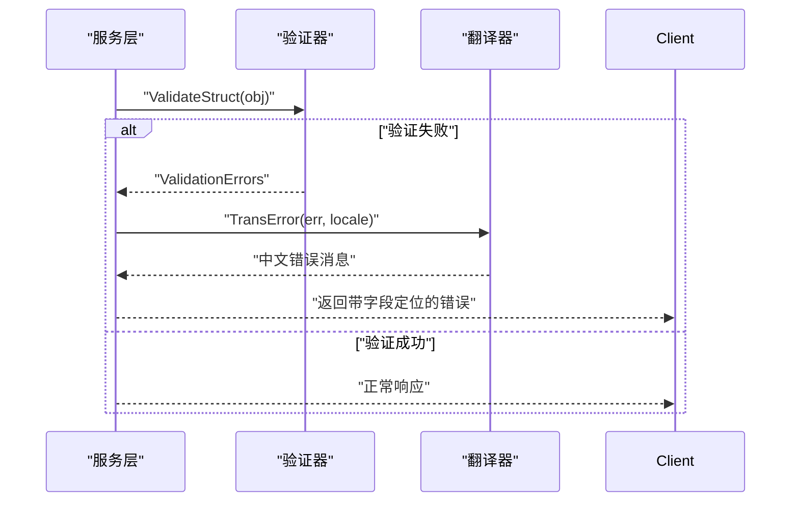
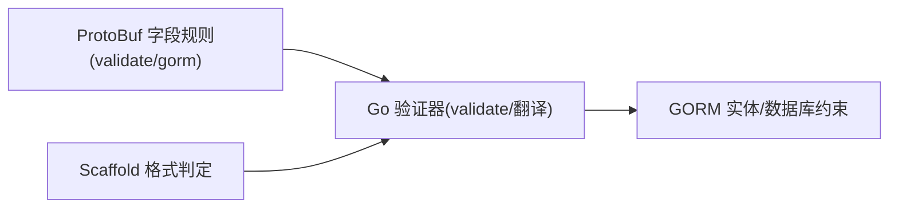

# 数据验证与约束

<cite>
**本文档引用的文件**
- [proto/user/user.model.proto](file://proto/user/user.model.proto)
- [proto/common/common.model.proto](file://proto/common/common.model.proto)
- [thirdparty/gox/validator/validator.go](file://thirdparty/gox/validator/validator.go)
- [thirdparty/gox/validator/helper.go](file://thirdparty/gox/validator/helper.go)
- [thirdparty/scaffold/validator/field.go](file://thirdparty/scaffold/validator/field.go)
- [server/go/user/model/user.go](file://server/go/user/model/user.go)
</cite>

## 目录
1. [简介](#简介)
2. [项目结构](#项目结构)
3. [核心组件](#核心组件)
4. [架构总览](#架构总览)
5. [详细组件分析](#详细组件分析)
6. [依赖分析](#依赖分析)
7. [性能考虑](#性能考虑)
8. [故障排查指南](#故障排查指南)
9. [结论](#结论)
10. [附录](#附录)

## 简介
本文件面向Hoper项目的“数据验证与约束”主题，系统性梳理从ProtoBuf到服务端的多层验证机制，覆盖字段级约束（必填、长度、格式）、GORM标签中的验证注解、自定义验证器、业务规则校验、输入绑定与转换、错误处理与国际化消息，以及扩展与最佳实践。目标是帮助开发者在不深入源码的前提下，快速理解并正确使用验证体系。

## 项目结构
围绕验证的关键位置如下：
- ProtoBuf模型层：在字段上通过validate标签声明规则，并结合GORM标签进行数据库约束映射。
- Go验证库：基于go-playground/validator封装默认验证器、翻译器与错误转译。
- Scaffold工具：提供常用格式（如邮箱、手机号）的辅助判定。
- 服务端模型：承载数据库实体映射，配合GORM标签完成DDL约束。

图表来源
- [proto/user/user.model.proto:19-50](file://proto/user/user.model.proto#L19-L50)
- [proto/common/common.model.proto:19-93](file://proto/common/common.model.proto#L19-L93)
- [thirdparty/gox/validator/validator.go:22-46](file://thirdparty/gox/validator/validator.go#L22-L46)
- [thirdparty/gox/validator/helper.go:20-49](file://thirdparty/gox/validator/helper.go#L20-L49)
- [thirdparty/scaffold/validator/field.go:13-30](file://thirdparty/scaffold/validator/field.go#L13-L30)
- [server/go/user/model/user.go:5-11](file://server/go/user/model/user.go#L5-L11)

章节来源
- [proto/user/user.model.proto:19-50](file://proto/user/user.model.proto#L19-L50)
- [proto/common/common.model.proto:19-93](file://proto/common/common.model.proto#L19-L93)
- [thirdparty/gox/validator/validator.go:22-46](file://thirdparty/gox/validator/validator.go#L22-L46)
- [thirdparty/gox/validator/helper.go:20-49](file://thirdparty/gox/validator/helper.go#L20-L49)
- [thirdparty/scaffold/validator/field.go:13-30](file://thirdparty/scaffold/validator/field.go#L13-L30)
- [server/go/user/model/user.go:5-11](file://server/go/user/model/user.go#L5-L11)

## 核心组件
- ProtoBuf字段验证标签
  - 在字段上使用validate标签声明规则，如必填、长度范围、格式（邮箱、手机号）等。
  - 结合gorm标签实现数据库约束（如size、not null、unique、index等），并在生成代码中生效。
- Go验证器
  - 默认验证器初始化时设置标签名为validate，并注册中文翻译。
  - 提供结构体验证入口与字段错误栈封装，便于定位具体字段问题。
- Scaffold格式判定
  - 提供邮箱/手机号正则判定与“手机号或邮箱”综合判定，辅助前置校验。
- 服务端模型
  - GORM实体映射与标签共同构成数据库约束，确保数据一致性。

章节来源
- [proto/user/user.model.proto:22-27](file://proto/user/user.model.proto#L22-L27)
- [proto/common/common.model.proto:20-22](file://proto/common/common.model.proto#L20-L22)
- [thirdparty/gox/validator/validator.go:27-46](file://thirdparty/gox/validator/validator.go#L27-L46)
- [thirdparty/gox/validator/helper.go:20-49](file://thirdparty/gox/validator/helper.go#L20-L49)
- [thirdparty/scaffold/validator/field.go:13-30](file://thirdparty/scaffold/validator/field.go#L13-L30)
- [server/go/user/model/user.go:5-11](file://server/go/user/model/user.go#L5-L11)

## 架构总览
下图展示从请求进入、ProtoBuf字段规则、Go验证器到GORM约束的整体流程。

图表来源
- [proto/user/user.model.proto:22-27](file://proto/user/user.model.proto#L22-L27)
- [proto/common/common.model.proto:20-22](file://proto/common/common.model.proto#L20-L22)
- [thirdparty/gox/validator/validator.go:34-46](file://thirdparty/gox/validator/validator.go#L34-L46)
- [thirdparty/gox/validator/helper.go:20-28](file://thirdparty/gox/validator/helper.go#L20-L28)
- [server/go/user/model/user.go:5-11](file://server/go/user/model/user.go#L5-L11)

## 详细组件分析

### ProtoBuf 字段验证规则
- 必填字段
  - 使用validate:"required"标记必填；常见于ID、类型、关联ID等关键字段。
  - 示例路径：[proto/common/common.service.proto:147](file://proto/common/common.service.proto#L147)、[proto/content/action.model.proto:22-25](file://proto/content/action.model.proto#L22-L25)
- 长度限制
  - 使用validate:"gte=N,lte=M"对字符串长度进行上下限控制；常与gorm:"size:N"配合。
  - 示例路径：[proto/user/user.model.proto:22-27](file://proto/user/user.model.proto#L22-L27)、[proto/common/common.model.proto:20-22](file://proto/common/common.model.proto#L20-L22)
- 格式验证
  - 邮箱：validate:"email"
  - 手机号：validate:"phone"
  - 示例路径：[proto/user/user.model.proto:23-26](file://proto/user/user.model.proto#L23-L26)

图表来源
- [proto/user/user.model.proto:22-27](file://proto/user/user.model.proto#L22-L27)
- [proto/common/common.model.proto:20-22](file://proto/common/common.model.proto#L20-L22)

章节来源
- [proto/user/user.model.proto:22-27](file://proto/user/user.model.proto#L22-L27)
- [proto/common/common.model.proto:20-22](file://proto/common/common.model.proto#L20-L22)

### GORM 标签中的验证注解与自定义验证器
- GORM标签用于数据库约束映射
  - size/N：限制字段最大长度
  - not null：非空约束
  - unique/uniqueIndex：唯一性约束
  - index/default:索引/默认值
  - 示例路径：[proto/user/user.model.proto:21-27](file://proto/user/user.model.proto#L21-L27)
- 自定义验证器
  - 通过SetTagName("validate")启用validate标签；
  - 注册中文翻译器，支持按字段comment/json标签显示友好名称；
  - 提供TransError统一转译错误消息。
  - 示例路径：[thirdparty/gox/validator/validator.go:27-46](file://thirdparty/gox/validator/validator.go#L27-L46)

图表来源
- [thirdparty/gox/validator/validator.go:22-46](file://thirdparty/gox/validator/validator.go#L22-L46)
- [thirdparty/gox/validator/helper.go:20-49](file://thirdparty/gox/validator/helper.go#L20-L49)
- [thirdparty/scaffold/validator/field.go:13-30](file://thirdparty/scaffold/validator/field.go#L13-L30)

章节来源
- [thirdparty/gox/validator/validator.go:27-46](file://thirdparty/gox/validator/validator.go#L27-L46)
- [thirdparty/gox/validator/helper.go:20-49](file://thirdparty/gox/validator/helper.go#L20-L49)
- [thirdparty/scaffold/validator/field.go:13-30](file://thirdparty/scaffold/validator/field.go#L13-L30)

### 业务逻辑层面的数据验证
- 权限验证
  - 通过角色/状态枚举（如UserStatus、Role）在服务层进行访问控制与操作许可检查。
  - 示例路径：[proto/user/user.model.proto:211-236](file://proto/user/user.model.proto#L211-L236)
- 操作频率限制
  - 可在服务层结合缓存/限流策略对敏感操作（如登录、重置密码）进行频率控制。
- 业务规则检查
  - 如唯一性（unique/uniqueIndex）、索引（index）与默认值（default）等，由GORM标签在数据库层保障。

章节来源
- [proto/user/user.model.proto:211-236](file://proto/user/user.model.proto#L211-L236)

### 输入参数绑定、数据转换与错误处理
- 绑定与转换
  - 请求消息经网关解析后绑定至ProtoBuf消息对象；随后调用ValidateStruct进行验证。
  - 示例路径：[thirdparty/gox/validator/helper.go:20-28](file://thirdparty/gox/validator/helper.go#L20-L28)
- 错误处理
  - TransError将ValidationErrors转为中文可读消息；
  - FieldError提供字段栈追踪，便于定位具体字段问题。
  - 示例路径：[thirdparty/gox/validator/validator.go:48-63](file://thirdparty/gox/validator/validator.go#L48-L63)、[thirdparty/gox/validator/helper.go:30-49](file://thirdparty/gox/validator/helper.go#L30-L49)

图表来源
- [thirdparty/gox/validator/helper.go:20-28](file://thirdparty/gox/validator/helper.go#L20-L28)
- [thirdparty/gox/validator/validator.go:48-63](file://thirdparty/gox/validator/validator.go#L48-L63)

### 错误码定义与国际化错误消息
- 错误码
  - 用户模块错误码通过枚举标注为errcode，便于统一管理与前端/客户端消费。
  - 示例路径：[proto/user/user.model.proto:246-257](file://proto/user/user.model.proto#L246-L257)
- 国际化
  - 默认注册中文翻译器，TransError按locale返回对应语言的错误消息。
  - 示例路径：[thirdparty/gox/validator/validator.go:27-46](file://thirdparty/gox/validator/validator.go#L27-L46)

章节来源
- [proto/user/user.model.proto:246-257](file://proto/user/user.model.proto#L246-L257)
- [thirdparty/gox/validator/validator.go:27-46](file://thirdparty/gox/validator/validator.go#L27-L46)

### 实际验证示例与最佳实践
- 示例场景
  - 用户注册：账号必填且长度6-20；密码必填且长度8-15；邮箱/手机号格式校验。
  - 标签路径参考：[proto/user/user.model.proto:22-27](file://proto/user/user.model.proto#L22-L27)
- 最佳实践
  - 在ProtoBuf层明确声明validate规则，确保前后端一致；
  - 对关键字段同时配置gorm标签，保证数据库约束；
  - 使用ValidateStruct统一入口，结合FieldError定位字段；
  - 对复杂格式（邮箱/手机号）可先用Scaffold判定，再交由验证器做细粒度校验。

章节来源
- [proto/user/user.model.proto:22-27](file://proto/user/user.model.proto#L22-L27)
- [thirdparty/gox/validator/helper.go:20-28](file://thirdparty/gox/validator/helper.go#L20-L28)
- [thirdparty/scaffold/validator/field.go:13-30](file://thirdparty/scaffold/validator/field.go#L13-L30)

### 验证规则扩展与自定义验证器开发
- 扩展验证规则
  - 在go-playground/validator基础上注册自定义标签与翻译；
  - 通过SetTagName("validate")与RegisterTagNameFunc定制字段名显示。
  - 示例路径：[thirdparty/gox/validator/validator.go:27-46](file://thirdparty/gox/validator/validator.go#L27-L46)
- 自定义验证器
  - 可在ValidateStruct分支中增加接口（如ValidateAll）以支持更复杂的校验逻辑；
  - 对嵌套结构体，建议在子结构体实现Validate接口，由ValidateStruct递归调用。

章节来源
- [thirdparty/gox/validator/validator.go:27-46](file://thirdparty/gox/validator/validator.go#L27-L46)
- [thirdparty/gox/validator/helper.go:16-28](file://thirdparty/gox/validator/helper.go#L16-L28)

## 依赖分析
- ProtoBuf字段规则依赖Go验证器的validate标签与翻译器；
- Scaffold工具为邮箱/手机号提供基础判定，可作为前置过滤；
- 服务端模型通过GORM标签承接数据库约束，确保DDL一致性。

图表来源
- [proto/user/user.model.proto:22-27](file://proto/user/user.model.proto#L22-L27)
- [thirdparty/gox/validator/validator.go:34-46](file://thirdparty/gox/validator/validator.go#L34-L46)
- [thirdparty/scaffold/validator/field.go:13-30](file://thirdparty/scaffold/validator/field.go#L13-L30)
- [server/go/user/model/user.go:5-11](file://server/go/user/model/user.go#L5-L11)

章节来源
- [proto/user/user.model.proto:22-27](file://proto/user/user.model.proto#L22-L27)
- [thirdparty/gox/validator/validator.go:34-46](file://thirdparty/gox/validator/validator.go#L34-L46)
- [thirdparty/scaffold/validator/field.go:13-30](file://thirdparty/scaffold/validator/field.go#L13-L30)
- [server/go/user/model/user.go:5-11](file://server/go/user/model/user.go#L5-L11)

## 性能考虑
- 验证器复用：全局DefaultValidate减少重复初始化开销；
- 正则判定：Scaffold提供轻量正则匹配，适合高频前置过滤；
- 错误转译：仅在出现ValidationErrors时进行翻译，避免无谓开销。

## 故障排查指南
- 常见问题
  - 字段未满足required：检查validate:"required"与gorm:"not null"是否一致；
  - 长度越界：核对validate:"gte/lte"与gorm:"size"配置；
  - 格式不符：确认email/phone规则与输入格式一致。
- 排查步骤
  - 使用FieldError查看字段栈，定位具体字段；
  - 通过TransError获取中文错误消息，便于前端展示；
  - 若为自定义规则，检查是否正确注册标签与翻译。

章节来源
- [thirdparty/gox/validator/helper.go:30-49](file://thirdparty/gox/validator/helper.go#L30-L49)
- [thirdparty/gox/validator/validator.go:48-63](file://thirdparty/gox/validator/validator.go#L48-L63)

## 结论
Hoper项目采用“ProtoBuf规则 + Go验证器 + GORM约束”的三层验证体系：在模型层明确规则，在运行时统一验证，并在数据库层落实约束。结合Scaffold的格式判定与国际化错误转译，既保证了易用性，又提升了可维护性。建议在新增字段时同步完善validate与gorm标签，并在服务层补充必要的业务规则与权限校验。

## 附录
- 相关枚举与错误码
  - 用户状态与角色：[proto/user/user.model.proto:211-236](file://proto/user/user.model.proto#L211-L236)
  - 用户错误码：[proto/user/user.model.proto:246-257](file://proto/user/user.model.proto#L246-L257)