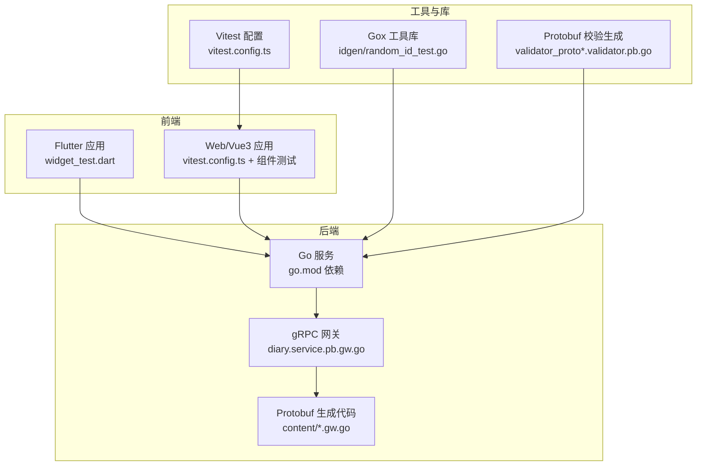
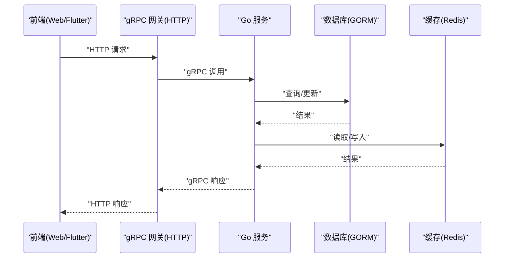
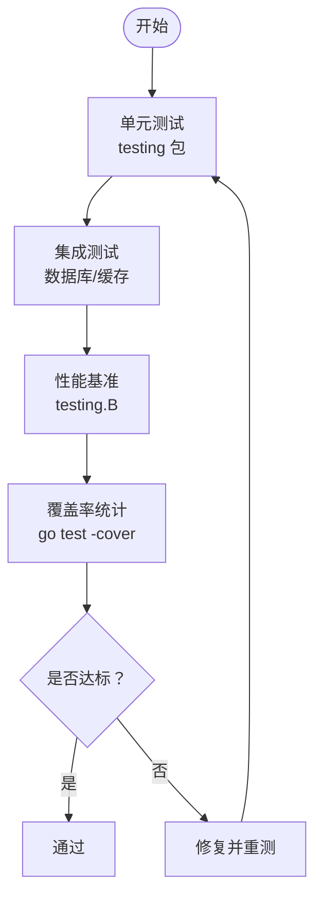
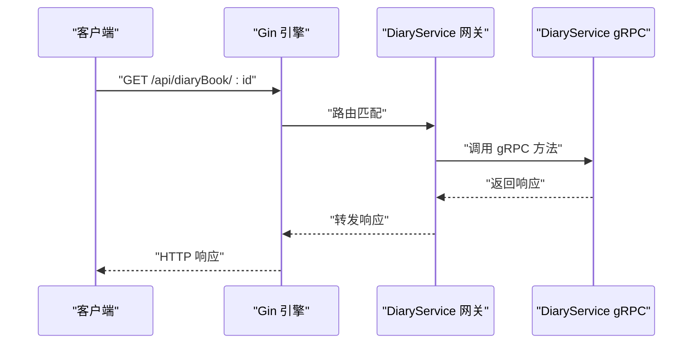
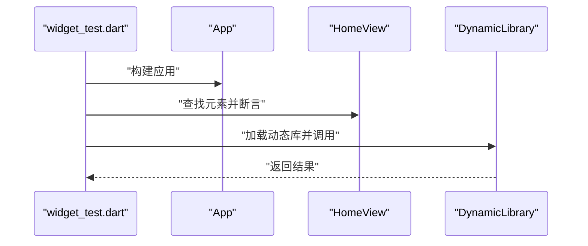
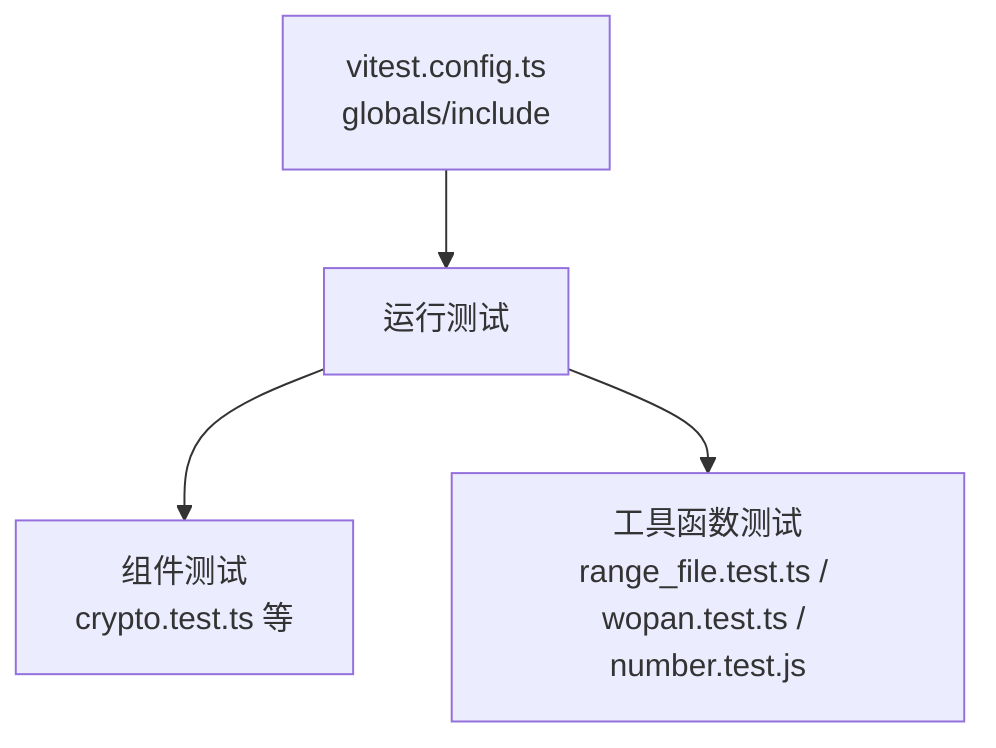
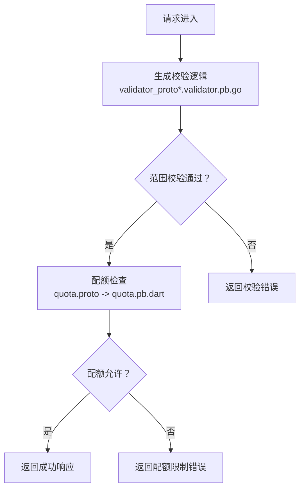
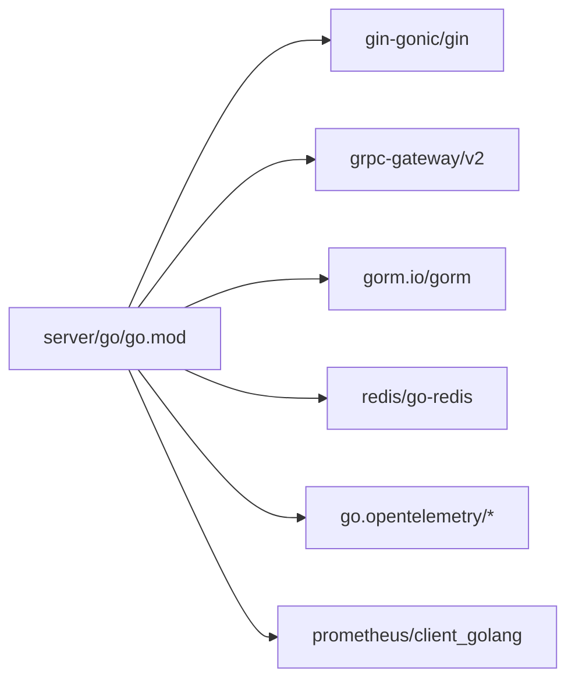

# 测试调试

<cite>
**本文引用的文件**
- [client/app/test/widget_test.dart](file://client/app/test/widget_test.dart)
- [client/app/test/test.dart](file://client/app/test/test.dart)
- [thirdparty/diamond/vitest.config.ts](file://thirdparty/diamond/vitest.config.ts)
- [thirdparty/diamond/src/utils/crypto/crypto.test.ts](file://thirdparty/diamond/src/utils/crypto/crypto.test.ts)
- [server/go/go.mod](file://server/go/go.mod)
- [proto/.generated/go/content/diary.service.pb.gw.go](file://proto/.generated/go/content/diary.service.pb.gw.go)
- [server/go/protobuf/content/diary.service.pb.gw.go](file://server/go/protobuf/content/diary.service.pb.gw.go)
- [awesome/lang/go/bench/map_test.go](file://awesome/lang/go/bench/map_test.go)
- [thirdparty/gox/idgen/random_id_test.go](file://thirdparty/gox/idgen/random_id_test.go)
- [client/web/.eslintrc.js](file://client/web/.eslintrc.js)
- [thirdparty/protobuf/tools/protoc-gen-validator/test/validator_proto2.validator.pb.go](file://thirdparty/protobuf/tools/protoc-gen-validator/test/validator_proto2.validator.pb.go)
- [thirdparty/protobuf/tools/protoc-gen-validator/test/validator_proto3.validator.pb.go](file://thirdparty/protobuf/tools/protoc-gen-validator/test/validator_proto3.validator.pb.go)
- [thirdparty/protobuf/_proto/google/api/quota.proto](file://thirdparty/protobuf/_proto/google/api/quota.proto)
- [client/app/lib/generated/protobuf/google/api/quota.pb.dart](file://client/app/lib/generated/protobuf/google/api/quota.pb.dart)
- [thirdparty/diamond/src/utils/fs/range_file.test.ts](file://thirdparty/diamond/src/utils/fs/range_file.test.ts)
- [thirdparty/diamond/src/utils/wopan/wopan.test.ts](file://thirdparty/diamond/src/utils/wopan/wopan.test.ts)
- [thirdparty/diamond/src/utils/math/number.test.js](file://thirdparty/diamond/src/utils/math/number.test.js)
- [thirdparty/gox/.gitignore](file://thirdparty/gox/.gitignore)
</cite>

## 目录
1. [引言](#引言)
2. [项目结构](#项目结构)
3. [核心组件](#核心组件)
4. [架构总览](#架构总览)
5. [详细组件分析](#详细组件分析)
6. [依赖分析](#依赖分析)
7. [性能考虑](#性能考虑)
8. [故障排查指南](#故障排查指南)
9. [结论](#结论)
10. [附录](#附录)

## 引言
本文件面向Hoper项目的测试与调试质量保障，系统性梳理单元测试、集成测试与端到端测试的实施策略，覆盖Go语言测试框架、Flutter测试、Vue3组件测试、gRPC服务测试、数据库测试与API接口测试的方法与工具，并提供调试技巧、性能分析与问题排查指南，以及测试覆盖率与质量门禁建议。

## 项目结构
Hoper采用多语言混合架构：后端Go服务通过gRPC网关对外提供HTTP接口；前端包含Flutter应用、Web(Vue3+Vite)与UniApp；同时内置大量第三方工具库与生成代码（如Protobuf）。测试相关能力分布如下：
- Go后端：使用标准测试框架与基准测试，结合第三方依赖与网关层进行API测试
- Flutter：基于flutter_test进行组件与交互测试
- Web/Vue3：基于Vitest进行组件与工具函数测试
- Protobuf与gRPC：通过生成的客户端与网关进行接口测试与验证

图表来源
- [server/go/go.mod:1-191](file://server/go/go.mod#L1-L191)
- [proto/.generated/go/content/diary.service.pb.gw.go:493-531](file://proto/.generated/go/content/diary.service.pb.gw.go#L493-L531)
- [server/go/protobuf/content/diary.service.pb.gw.go:493-531](file://server/go/protobuf/content/diary.service.pb.gw.go#L493-L531)
- [thirdparty/diamond/vitest.config.ts:1-8](file://thirdparty/diamond/vitest.config.ts#L1-L8)
- [thirdparty/gox/idgen/random_id_test.go:1-8](file://thirdparty/gox/idgen/random_id_test.go#L1-L8)
- [thirdparty/protobuf/tools/protoc-gen-validator/test/validator_proto2.validator.pb.go:139-188](file://thirdparty/protobuf/tools/protoc-gen-validator/test/validator_proto2.validator.pb.go#L139-L188)
- [thirdparty/protobuf/tools/protoc-gen-validator/test/validator_proto3.validator.pb.go:122-148](file://thirdparty/protobuf/tools/protoc-gen-validator/test/validator_proto3.validator.pb.go#L122-L148)

章节来源
- [server/go/go.mod:1-191](file://server/go/go.mod#L1-L191)
- [proto/.generated/go/content/diary.service.pb.gw.go:493-531](file://proto/.generated/go/content/diary.service.pb.gw.go#L493-L531)
- [server/go/protobuf/content/diary.service.pb.gw.go:493-531](file://server/go/protobuf/content/diary.service.pb.gw.go#L493-L531)
- [thirdparty/diamond/vitest.config.ts:1-8](file://thirdparty/diamond/vitest.config.ts#L1-L8)

## 核心组件
- Go后端测试基础：使用标准testing包进行单元测试与基准测试，结合第三方库（如gorm、redis等）进行集成测试与性能基准
- gRPC网关测试：通过生成的HTTP路由注册与转发逻辑，对gRPC服务进行HTTP接口测试
- Flutter测试：基于flutter_test进行组件渲染、交互与原生库调用测试
- Vue3组件测试：基于Vitest进行组件与工具函数测试，配合ESLint规则控制开发质量
- Protobuf校验与生成：通过生成的校验代码与网关代码，确保请求/响应在传输层的正确性

章节来源
- [awesome/lang/go/bench/map_test.go:1-72](file://awesome/lang/go/bench/map_test.go#L1-L72)
- [thirdparty/gox/idgen/random_id_test.go:1-8](file://thirdparty/gox/idgen/random_id_test.go#L1-L8)
- [client/app/test/widget_test.dart:1-32](file://client/app/test/widget_test.dart#L1-L32)
- [client/app/test/test.dart:1-38](file://client/app/test/test.dart#L1-L38)
- [thirdparty/diamond/src/utils/crypto/crypto.test.ts:1-16](file://thirdparty/diamond/src/utils/crypto/crypto.test.ts#L1-L16)
- [thirdparty/diamond/vitest.config.ts:1-8](file://thirdparty/diamond/vitest.config.ts#L1-L8)

## 架构总览
下图展示从客户端到后端服务的测试路径：前端通过HTTP访问gRPC网关，网关将请求转发至gRPC服务，服务内部依赖ORM与缓存等组件完成业务逻辑。

图表来源
- [proto/.generated/go/content/diary.service.pb.gw.go:493-531](file://proto/.generated/go/content/diary.service.pb.gw.go#L493-L531)
- [server/go/protobuf/content/diary.service.pb.gw.go:493-531](file://server/go/protobuf/content/diary.service.pb.gw.go#L493-L531)
- [server/go/go.mod:1-191](file://server/go/go.mod#L1-L191)

## 详细组件分析

### Go 后端测试策略
- 单元测试：针对独立函数或模块，使用testing包进行断言与模拟
- 集成测试：结合数据库、缓存等外部依赖，验证服务流程
- 性能基准：使用testing.B进行基准测试，评估热点路径性能
- 质量门禁：建议覆盖率阈值不低于80%，关键路径不低于90%

章节来源
- [awesome/lang/go/bench/map_test.go:1-72](file://awesome/lang/go/bench/map_test.go#L1-L72)
- [thirdparty/gox/idgen/random_id_test.go:1-8](file://thirdparty/gox/idgen/random_id_test.go#L1-L8)

### gRPC 服务与网关测试
- 网关注册：通过生成的Register*HandlerClient函数将HTTP路由映射到gRPC服务
- 接口测试：构造HTTP请求，验证错误处理与响应转发
- 建议：对每个服务的增删改查接口进行HTTP层测试，确保网关与gRPC一致性

图表来源
- [proto/.generated/go/content/diary.service.pb.gw.go:493-531](file://proto/.generated/go/content/diary.service.pb.gw.go#L493-L531)
- [server/go/protobuf/content/diary.service.pb.gw.go:493-531](file://server/go/protobuf/content/diary.service.pb.gw.go#L493-L531)

章节来源
- [proto/.generated/go/content/diary.service.pb.gw.go:493-531](file://proto/.generated/go/content/diary.service.pb.gw.go#L493-L531)
- [server/go/protobuf/content/diary.service.pb.gw.go:493-531](file://server/go/protobuf/content/diary.service.pb.gw.go#L493-L531)

### Flutter 组件与原生库测试
- 组件测试：使用flutter_test对UI交互进行断言
- 原生库测试：通过DynamicLibrary加载本地动态库并执行函数，验证跨平台调用

图表来源
- [client/app/test/widget_test.dart:1-32](file://client/app/test/widget_test.dart#L1-L32)
- [client/app/test/test.dart:1-38](file://client/app/test/test.dart#L1-L38)

章节来源
- [client/app/test/widget_test.dart:1-32](file://client/app/test/widget_test.dart#L1-L32)
- [client/app/test/test.dart:1-38](file://client/app/test/test.dart#L1-L38)

### Vue3 组件与工具函数测试
- Vitest配置：启用全局测试环境与包含模式
- 组件测试：对Vue3组件行为与渲染进行断言
- 工具函数测试：对加密、文件范围、数学运算等工具函数进行单元测试

图表来源
- [thirdparty/diamond/vitest.config.ts:1-8](file://thirdparty/diamond/vitest.config.ts#L1-L8)
- [thirdparty/diamond/src/utils/crypto/crypto.test.ts:1-16](file://thirdparty/diamond/src/utils/crypto/crypto.test.ts#L1-L16)
- [thirdparty/diamond/src/utils/fs/range_file.test.ts](file://thirdparty/diamond/src/utils/fs/range_file.test.ts)
- [thirdparty/diamond/src/utils/wopan/wopan.test.ts](file://thirdparty/diamond/src/utils/wopan/wopan.test.ts)
- [thirdparty/diamond/src/utils/math/number.test.js](file://thirdparty/diamond/src/utils/math/number.test.js)

章节来源
- [thirdparty/diamond/vitest.config.ts:1-8](file://thirdparty/diamond/vitest.config.ts#L1-L8)
- [thirdparty/diamond/src/utils/crypto/crypto.test.ts:1-16](file://thirdparty/diamond/src/utils/crypto/crypto.test.ts#L1-L16)
- [thirdparty/diamond/src/utils/fs/range_file.test.ts](file://thirdparty/diamond/src/utils/fs/range_file.test.ts)
- [thirdparty/diamond/src/utils/wopan/wopan.test.ts](file://thirdparty/diamond/src/utils/wopan/wopan.test.ts)
- [thirdparty/diamond/src/utils/math/number.test.js](file://thirdparty/diamond/src/utils/math/number.test.js)

### Protobuf 校验与配额测试
- 校验生成：生成的validator代码对字段范围进行严格校验
- 配额模型：Quota配置用于限流与预算控制，支持按指标与单位定义限额
- 测试建议：对生成的校验逻辑与配额规则进行边界条件测试

图表来源
- [thirdparty/protobuf/tools/protoc-gen-validator/test/validator_proto2.validator.pb.go:139-188](file://thirdparty/protobuf/tools/protoc-gen-validator/test/validator_proto2.validator.pb.go#L139-L188)
- [thirdparty/protobuf/tools/protoc-gen-validator/test/validator_proto3.validator.pb.go:122-148](file://thirdparty/protobuf/tools/protoc-gen-validator/test/validator_proto3.validator.pb.go#L122-L148)
- [thirdparty/protobuf/_proto/google/api/quota.proto:25-61](file://thirdparty/protobuf/_proto/google/api/quota.proto#L25-L61)
- [client/app/lib/generated/protobuf/google/api/quota.pb.dart:20-406](file://client/app/lib/generated/protobuf/google/api/quota.pb.dart#L20-L406)

章节来源
- [thirdparty/protobuf/tools/protoc-gen-validator/test/validator_proto2.validator.pb.go:139-188](file://thirdparty/protobuf/tools/protoc-gen-validator/test/validator_proto2.validator.pb.go#L139-L188)
- [thirdparty/protobuf/tools/protoc-gen-validator/test/validator_proto3.validator.pb.go:122-148](file://thirdparty/protobuf/tools/protoc-gen-validator/test/validator_proto3.validator.pb.go#L122-L148)
- [thirdparty/protobuf/_proto/google/api/quota.proto:25-61](file://thirdparty/protobuf/_proto/google/api/quota.proto#L25-L61)
- [client/app/lib/generated/protobuf/google/api/quota.pb.dart:20-406](file://client/app/lib/generated/protobuf/google/api/quota.pb.dart#L20-L406)

## 依赖分析
后端服务依赖众多第三方库，测试时需关注以下耦合点：
- Web框架与网关：gin与grpc-gateway共同承担HTTP与gRPC的桥接
- 数据库与缓存：GORM与Redis作为主要持久化与缓存层
- 日志与监控：OpenTelemetry与Prometheus用于可观测性

图表来源
- [server/go/go.mod:1-191](file://server/go/go.mod#L1-L191)

章节来源
- [server/go/go.mod:1-191](file://server/go/go.mod#L1-L191)

## 性能考虑
- 基准测试：使用testing.B对热点路径进行基准测试，识别性能瓶颈
- 原生调用开销：CGO与系统调用存在额外开销，应避免在高频路径中频繁切换
- 缓存与数据库：合理使用缓存与批量操作，减少数据库压力
- 监控与采样：结合OpenTelemetry与Prometheus进行性能采样与告警

章节来源
- [awesome/lang/go/bench/map_test.go:1-72](file://awesome/lang/go/bench/map_test.go#L1-L72)

## 故障排查指南
- 单元测试失败
  - 检查测试用例是否覆盖边界条件与异常分支
  - 使用go test -v输出详细日志定位失败点
- 集成测试失败
  - 核对数据库/缓存连接配置与初始化顺序
  - 使用替换依赖（如使用内存数据库）隔离外部因素
- gRPC/网关问题
  - 对比HTTP与gRPC响应，确认网关转发逻辑
  - 检查拦截器与中间件是否影响请求/响应
- 前端测试问题
  - Flutter：使用flutter_test的pumpAndSettle确保渲染稳定
  - Vue3：确保vitest配置包含测试文件，避免遗漏
- Protobuf/校验问题
  - 对照生成的校验逻辑，检查字段范围与默认值
  - 配额限制：核对quota配置与单位表达式

章节来源
- [client/app/test/widget_test.dart:1-32](file://client/app/test/widget_test.dart#L1-L32)
- [thirdparty/diamond/vitest.config.ts:1-8](file://thirdparty/diamond/vitest.config.ts#L1-L8)
- [thirdparty/protobuf/tools/protoc-gen-validator/test/validator_proto2.validator.pb.go:139-188](file://thirdparty/protobuf/tools/protoc-gen-validator/test/validator_proto2.validator.pb.go#L139-L188)
- [thirdparty/protobuf/_proto/google/api/quota.proto:25-61](file://thirdparty/protobuf/_proto/google/api/quota.proto#L25-L61)

## 结论
通过分层测试策略与工具链完善，Hoper可在不同层面保证质量：单元测试覆盖基础逻辑，集成测试验证端到端流程，端到端测试保障用户场景。结合性能基准与可观测性，持续优化系统稳定性与可维护性。

## 附录
- 测试覆盖率与质量门禁建议
  - 单元测试覆盖率：≥80%
  - 关键模块（核心服务、网关、校验逻辑）覆盖率：≥90%
  - 集成测试：至少覆盖主流程与异常路径
  - 覆盖率统计：使用go test -cover与工具导出报告
- ESLint规则与开发质量
  - 生产环境关闭console与debugger警告，避免调试语句进入生产
  - Vue3组件测试需遵循vitest配置的include模式

章节来源
- [client/web/.eslintrc.js:1-37](file://client/web/.eslintrc.js#L1-L37)
- [thirdparty/diamond/vitest.config.ts:1-8](file://thirdparty/diamond/vitest.config.ts#L1-L8)
- [thirdparty/gox/.gitignore:1-5](file://thirdparty/gox/.gitignore#L1-L5)