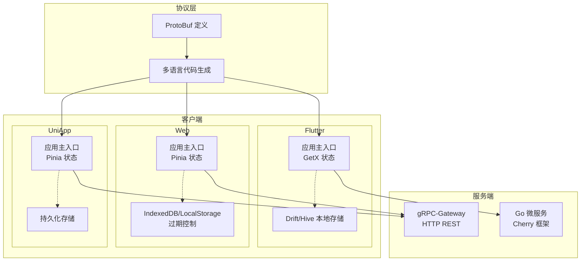
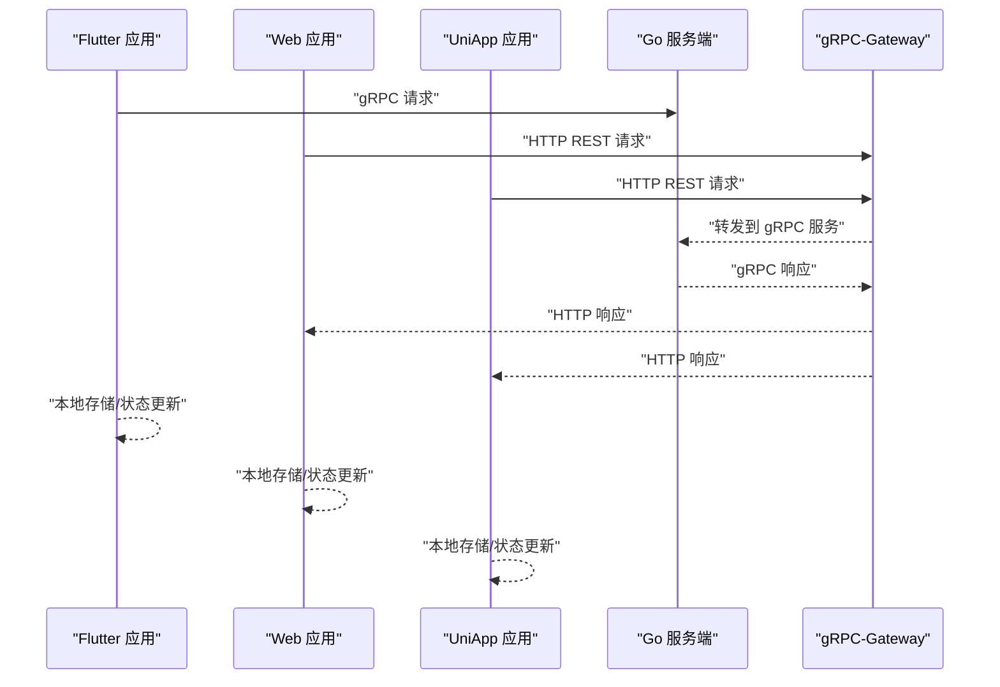
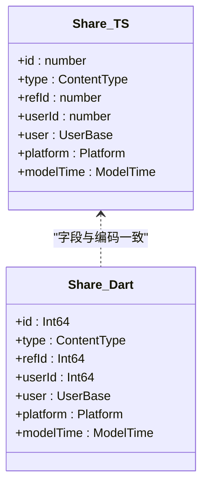
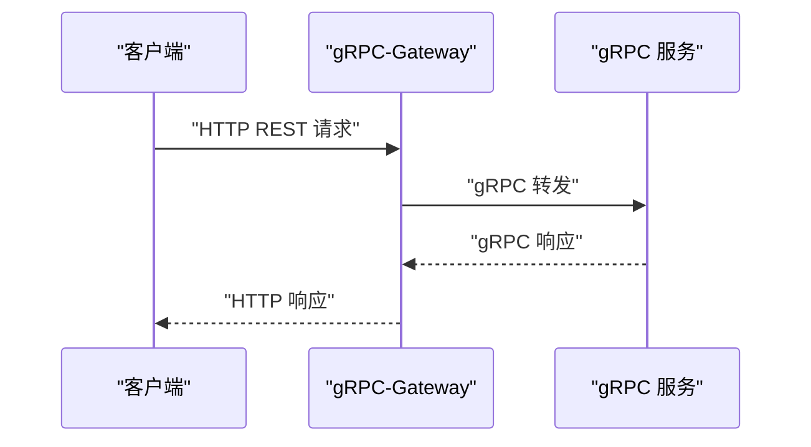
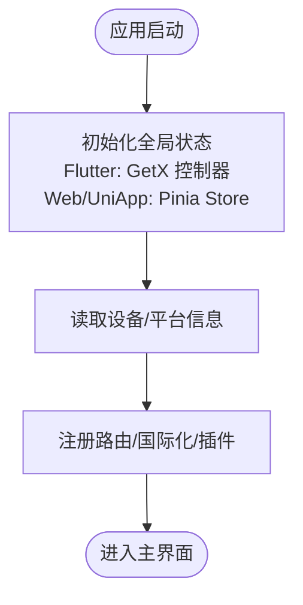
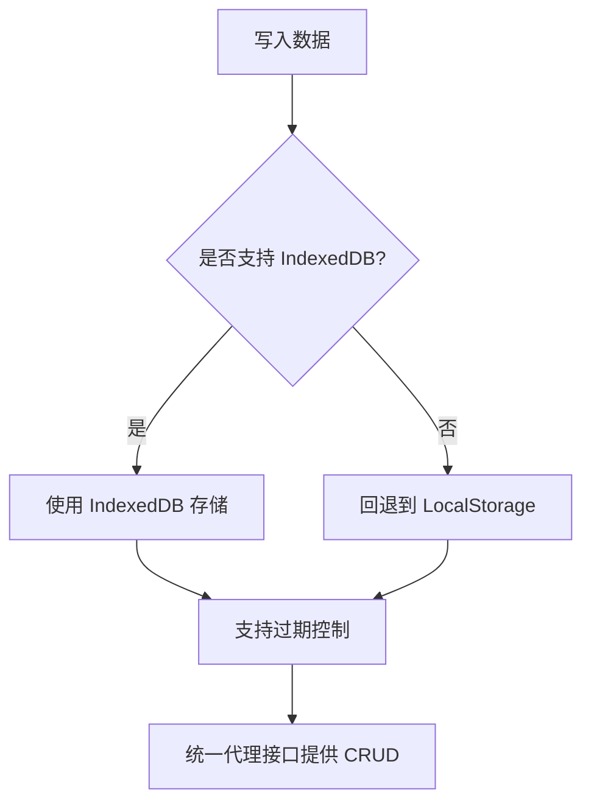
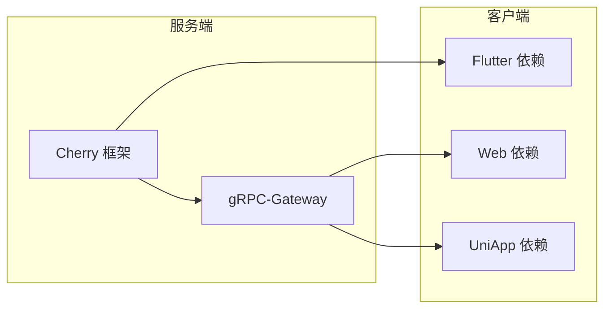

# 多端架构设计

<cite>
**本文引用的文件**
- [README.md](file://README.md)
- [proto/README.md](file://proto/README.md)
- [server/go/main.go](file://server/go/main.go)
- [thirdparty/cherry/README.md](file://thirdparty/cherry/README.md)
- [thirdparty/gox/net/http/grpc/web/DOC.md](file://thirdparty/gox/net/http/grpc/web/DOC.md)
- [client/app/pubspec.yaml](file://client/app/pubspec.yaml)
- [client/app/lib/main.dart](file://client/app/lib/main.dart)
- [client/app/lib/global/state.dart](file://client/app/lib/global/state.dart)
- [client/web/package.json](file://client/web/package.json)
- [client/web/src/main.ts](file://client/web/src/main.ts)
- [client/web/src/utils/stroge.ts](file://client/web/src/utils/stroge.ts)
- [client/uniapp/package.json](file://client/uniapp/package.json)
- [client/uniapp/src/main.ts](file://client/uniapp/src/main.ts)
- [client/uniapp/src/store/global.ts](file://client/uniapp/src/store/global.ts)
- [proto/.generated/ts/src/content/action.model.ts](file://proto/.generated/ts/src/content/action.model.ts)
- [client/app/lib/generated/protobuf/content/action.model.pb.dart](file://client/app/lib/generated/protobuf/content/action.model.pb.dart)
- [thirdparty/diamond/src/utils/localforage/index.ts](file://thirdparty/diamond/src/utils/localforage/index.ts)
- [thirdparty/diamond/src/utils/localforage/types.d.ts](file://thirdparty/diamond/src/utils/localforage/types.d.ts)
</cite>

## 目录
1. [引言](#引言)
2. [项目结构](#项目结构)
3. [核心组件](#核心组件)
4. [架构总览](#架构总览)
5. [详细组件分析](#详细组件分析)
6. [依赖分析](#依赖分析)
7. [性能考虑](#性能考虑)
8. [故障排查指南](#故障排查指南)
9. [结论](#结论)
10. [附录](#附录)

## 引言
本设计文档面向 Hoper 多端架构，围绕统一数据模型在 Flutter 移动端、Vue3 Web 端、UniApp 小程序之间的共享与复用展开，系统阐述以下主题：
- 统一数据模型：以 ProtoBuf 定义为核心，生成多端代码并统一序列化/反序列化逻辑
- 状态管理统一：Flutter 使用 GetX，Web/UniApp 使用 Pinia/Pinia 插件持久化，统一业务状态入口
- API 调用抽象：gRPC 与 gRPC-Web 的统一接入层，结合 Cherry 微服务框架与 gox grpc-web 能力
- 本地存储策略：Web 端 IndexedDB/LocalStorage 降级与过期控制，移动端 SQLite/Hive，小程序持久化
- 平台差异适配：路由、国际化、UI 组件库、运行时能力差异的适配策略
- 性能优化：协议压缩、缓存策略、懒加载、按需打包与 CDN
- 版本兼容与构建：多端构建配置、脚本化生成、版本约束与升级策略
- 联调测试与可观测性：跨端联调流程、OpenTelemetry 链路追踪、性能监控

## 项目结构
Hoper 采用“服务端 + 多端客户端 + 公共协议”的分层组织方式：
- 服务端：Go 微服务，集成 Cherry 框架，统一暴露 gRPC 与 HTTP 接口，并通过 grpc-gateway 提供 REST
- 协议层：ProtoBuf 定义，生成多语言代码，确保前后端一致的数据契约
- 客户端：
  - Flutter 移动端：GetX 状态管理、Drift/Hive 本地存储、WebView/FFI 扩展
  - Vue3 Web 端：Vant UI、Pinia、Element Plus、grpc-web、WASM
  - UniApp 小程序：Pinia + 持久化插件、多平台编译与运行

图表来源
- [server/go/main.go:28-68](file://server/go/main.go#L28-L68)
- [thirdparty/cherry/README.md:26-47](file://thirdparty/cherry/README.md#L26-L47)
- [client/app/lib/main.dart:17-69](file://client/app/lib/main.dart#L17-L69)
- [client/web/src/main.ts:16-60](file://client/web/src/main.ts#L16-L60)
- [client/uniapp/src/main.ts:11-21](file://client/uniapp/src/main.ts#L11-L21)

章节来源
- [README.md:10-62](file://README.md#L10-L62)
- [server/go/main.go:28-68](file://server/go/main.go#L28-L68)
- [client/app/lib/main.dart:17-69](file://client/app/lib/main.dart#L17-L69)
- [client/web/src/main.ts:16-60](file://client/web/src/main.ts#L16-L60)
- [client/uniapp/src/main.ts:11-21](file://client/uniapp/src/main.ts#L11-L21)

## 核心组件
- 统一数据模型
  - 以 ProtoBuf 定义业务实体，生成多端代码，确保字段一致性与序列化/反序列化行为一致
  - 示例：分享模型在 Dart 与 TypeScript 中均具备相同的字段与编码规则
- API 抽象层
  - 服务端：Cherry 框架同时注册 gRPC 与 HTTP 处理器，grpc-gateway 自动生成 REST
  - Web/UniApp：通过 grpc-web 与 gRPC-Web 能力对接 gRPC 服务，降低协议差异
- 状态管理
  - Flutter：GetX 控制器体系，集中初始化与全局状态
  - Web/UniApp：Pinia 管理应用状态，结合持久化插件实现跨会话状态恢复
- 本地存储
  - Web：localforage 封装 IndexedDB/LocalStorage，支持过期控制
  - Flutter：Drift/Hive 与 SQLite 互备，SharedPreferences 存放轻量配置
  - UniApp：持久化插件统一键空间

章节来源
- [proto/.generated/ts/src/content/action.model.ts:1108-1246](file://proto/.generated/ts/src/content/action.model.ts#L1108-L1246)
- [client/app/lib/generated/protobuf/content/action.model.pb.dart:712-741](file://client/app/lib/generated/protobuf/content/action.model.pb.dart#L712-L741)
- [server/go/main.go:55-67](file://server/go/main.go#L55-L67)
- [thirdparty/gox/net/http/grpc/web/DOC.md:1-295](file://thirdparty/gox/net/http/grpc/web/DOC.md#L1-L295)
- [client/app/lib/main.dart:29-65](file://client/app/lib/main.dart#L29-L65)
- [client/web/src/main.ts:16-60](file://client/web/src/main.ts#L16-L60)
- [client/uniapp/src/store/global.ts:1-27](file://client/uniapp/src/store/global.ts#L1-L27)
- [thirdparty/diamond/src/utils/localforage/index.ts:1-109](file://thirdparty/diamond/src/utils/localforage/index.ts#L1-L109)

## 架构总览
下图展示多端与服务端的交互关系，以及协议与状态管理的统一策略。

图表来源
- [server/go/main.go:55-67](file://server/go/main.go#L55-L67)
- [thirdparty/cherry/README.md:49-57](file://thirdparty/cherry/README.md#L49-L57)
- [thirdparty/gox/net/http/grpc/web/DOC.md:1-295](file://thirdparty/gox/net/http/grpc/web/DOC.md#L1-L295)

## 详细组件分析

### 统一数据模型与序列化
- 设计要点
  - 以 ProtoBuf 定义业务实体，避免手写 DTO 的不一致风险
  - 通过生成器在多端保持字段与编码一致，减少跨端差异
- 数据模型示例
  - 分享模型在 Dart 与 TypeScript 中具备相同的字段与编码规则，确保跨端一致
- 复杂度与性能
  - Protobuf 编解码为 O(n) 线性复杂度，序列化体积小，适合网络传输
  - 在 Web 端通过 grpc-web 与 gRPC-Web 适配，避免额外转换成本

图表来源
- [proto/.generated/ts/src/content/action.model.ts:1108-1246](file://proto/.generated/ts/src/content/action.model.ts#L1108-L1246)
- [client/app/lib/generated/protobuf/content/action.model.pb.dart:712-741](file://client/app/lib/generated/protobuf/content/action.model.pb.dart#L712-L741)

章节来源
- [proto/.generated/ts/src/content/action.model.ts:1108-1246](file://proto/.generated/ts/src/content/action.model.ts#L1108-L1246)
- [client/app/lib/generated/protobuf/content/action.model.pb.dart:712-741](file://client/app/lib/generated/protobuf/content/action.model.pb.dart#L712-L741)
- [proto/README.md:1-7](file://proto/README.md#L1-L7)

### API 调用抽象层（gRPC 与 gRPC-Web）
- 服务端注册
  - Cherry 框架同时注册 gRPC 与 HTTP 处理器，grpc-gateway 自动生成 REST
- Web/UniApp 接入
  - 通过 gox 的 gRPC-Web 能力，浏览器端可直接调用 gRPC 服务，简化协议适配
- 跨端一致性
  - 通过统一的 ProtoBuf 与生成代码，确保请求/响应结构一致

图表来源
- [server/go/main.go:55-67](file://server/go/main.go#L55-L67)
- [thirdparty/cherry/README.md:49-57](file://thirdparty/cherry/README.md#L49-L57)
- [thirdparty/gox/net/http/grpc/web/DOC.md:1-295](file://thirdparty/gox/net/http/grpc/web/DOC.md#L1-L295)

章节来源
- [server/go/main.go:28-68](file://server/go/main.go#L28-L68)
- [thirdparty/cherry/README.md:26-58](file://thirdparty/cherry/README.md#L26-L58)
- [thirdparty/gox/net/http/grpc/web/DOC.md:1-295](file://thirdparty/gox/net/http/grpc/web/DOC.md#L1-L295)

### 状态管理统一方案
- Flutter（GetX）
  - 全局状态控制器集中初始化，设备信息读取与主题切换等逻辑统一入口
- Web（Pinia）
  - 应用主入口统一注册状态与插件，路由与国际化在应用层集中配置
- UniApp（Pinia + 持久化）
  - Store 定义全局状态与平台标识，结合持久化插件实现跨会话状态恢复

图表来源
- [client/app/lib/main.dart:17-69](file://client/app/lib/main.dart#L17-L69)
- [client/app/lib/global/state.dart:39-69](file://client/app/lib/global/state.dart#L39-L69)
- [client/web/src/main.ts:16-60](file://client/web/src/main.ts#L16-L60)
- [client/uniapp/src/main.ts:11-21](file://client/uniapp/src/main.ts#L11-L21)
- [client/uniapp/src/store/global.ts:1-27](file://client/uniapp/src/store/global.ts#L1-L27)

章节来源
- [client/app/lib/main.dart:17-69](file://client/app/lib/main.dart#L17-L69)
- [client/app/lib/global/state.dart:19-69](file://client/app/lib/global/state.dart#L19-L69)
- [client/web/src/main.ts:16-60](file://client/web/src/main.ts#L16-L60)
- [client/uniapp/src/main.ts:11-21](file://client/uniapp/src/main.ts#L11-L21)
- [client/uniapp/src/store/global.ts:1-27](file://client/uniapp/src/store/global.ts#L1-L27)

### 本地存储策略
- Web 端
  - localforage 封装 IndexedDB/LocalStorage，自动降级，支持过期时间控制
  - 通过统一代理接口提供 set/get/remove/clear/keys 等能力
- Flutter 端
  - Drift/Hive 与 SQLite 互备，SharedPreferences 存放轻量配置
- UniApp 端
  - 使用 Pinia 持久化插件进行状态持久化

图表来源
- [thirdparty/diamond/src/utils/localforage/index.ts:1-109](file://thirdparty/diamond/src/utils/localforage/index.ts#L1-L109)
- [thirdparty/diamond/src/utils/localforage/types.d.ts:100-166](file://thirdparty/diamond/src/utils/localforage/types.d.ts#L100-L166)
- [client/web/src/utils/stroge.ts:2-22](file://client/web/src/utils/stroge.ts#L2-L22)

章节来源
- [thirdparty/diamond/src/utils/localforage/index.ts:1-109](file://thirdparty/diamond/src/utils/localforage/index.ts#L1-L109)
- [thirdparty/diamond/src/utils/localforage/types.d.ts:100-166](file://thirdparty/diamond/src/utils/localforage/types.d.ts#L100-L166)
- [client/web/src/utils/stroge.ts:2-22](file://client/web/src/utils/stroge.ts#L2-L22)
- [client/app/pubspec.yaml:39-98](file://client/app/pubspec.yaml#L39-L98)

### 平台差异处理与 UI 组件适配
- Flutter
  - Material/Widgets 国际化委托，主题模式切换，设备信息读取
- Web
  - Vant UI 组件库按需引入，国际化与动画插件统一注册
- UniApp
  - 多平台编译与运行，Pinia + 持久化插件，平台标识统一管理

章节来源
- [client/app/lib/main.dart:54-65](file://client/app/lib/main.dart#L54-L65)
- [client/web/src/main.ts:16-60](file://client/web/src/main.ts#L16-L60)
- [client/uniapp/src/main.ts:11-21](file://client/uniapp/src/main.ts#L11-L21)
- [client/uniapp/src/store/global.ts:1-27](file://client/uniapp/src/store/global.ts#L1-L27)

### 性能优化方案
- 协议与传输
  - Protobuf 编解码体积小，gRPC-Web 减少协议转换开销
- 前端优化
  - 懒加载组件、按需引入 UI 库、路由与组件的延迟加载
  - CDN 与产物压缩、可视化分析工具定位性能瓶颈
- 本地存储
  - IndexedDB/LocalStorage 自动降级与过期控制，减少无效数据占用

章节来源
- [client/web/package.json:12-24](file://client/web/package.json#L12-L24)
- [client/web/package.json:78-89](file://client/web/package.json#L78-L89)
- [thirdparty/diamond/src/utils/localforage/index.ts:1-109](file://thirdparty/diamond/src/utils/localforage/index.ts#L1-L109)

### 构建配置与版本兼容
- 多端构建
  - Flutter：pubspec 管理依赖与资源，构建图标与启动页
  - Web：Vite 配置、TypeScript、ESLint、PWA 插件、WASM 构建
  - UniApp：多平台编译脚本、依赖与插件管理
- 版本与升级
  - 通过脚本与生成器统一版本约束，避免多端版本漂移
  - 依赖覆盖与 overrides 管理第三方包版本冲突

章节来源
- [client/app/pubspec.yaml:1-182](file://client/app/pubspec.yaml#L1-L182)
- [client/web/package.json:1-95](file://client/web/package.json#L1-L95)
- [client/uniapp/package.json:1-174](file://client/uniapp/package.json#L1-L174)

### 多端联调测试与可观测性
- 联调测试
  - 通过统一的 ProtoBuf 与 gRPC 接口，确保多端请求/响应一致
  - Web/UniApp 使用 grpc-web 与 gRPC-Web，减少协议差异带来的联调成本
- 可观测性
  - 服务端集成 OpenTelemetry，链路追踪与性能监控
  - 前端错误捕获与日志上报，结合服务端链路定位问题

章节来源
- [server/go/main.go:48-54](file://server/go/main.go#L48-L54)
- [client/app/lib/main.dart:17-28](file://client/app/lib/main.dart#L17-L28)

## 依赖分析
- 服务端依赖
  - Cherry 框架提供 gRPC/HTTP/GraphQL 统一入口，grpc-gateway 自动生成 REST
- 客户端依赖
  - Flutter：GetX、Protobuf、Drift/Hive、SQLite、WebView/FFI
  - Web：grpc-web、Pinia、Vant、Element Plus、localforage
  - UniApp：Pinia、持久化插件、多平台 SDK

图表来源
- [thirdparty/cherry/README.md:26-58](file://thirdparty/cherry/README.md#L26-L58)
- [client/app/pubspec.yaml:23-101](file://client/app/pubspec.yaml#L23-L101)
- [client/web/package.json:25-47](file://client/web/package.json#L25-L47)
- [client/uniapp/package.json:77-104](file://client/uniapp/package.json#L77-L104)

章节来源
- [thirdparty/cherry/README.md:26-58](file://thirdparty/cherry/README.md#L26-L58)
- [client/app/pubspec.yaml:23-101](file://client/app/pubspec.yaml#L23-L101)
- [client/web/package.json:25-47](file://client/web/package.json#L25-L47)
- [client/uniapp/package.json:77-104](file://client/uniapp/package.json#L77-L104)

## 性能考虑
- 协议与序列化
  - Protobuf 编解码与 gRPC-Web 减少协议转换与序列化开销
- 前端性能
  - 按需加载、CDN 与压缩、组件懒加载、路由懒加载
- 存储性能
  - IndexedDB/LocalStorage 自动降级与过期控制，避免无效数据占用
- 服务端可观测性
  - OpenTelemetry 链路追踪与 Prometheus 监控，便于定位性能瓶颈

## 故障排查指南
- 错误捕获
  - Flutter 使用 runZonedGuarded 与 ErrorWidget.builder 捕获未处理异常
- 日志与追踪
  - 服务端集成 OpenTelemetry，前端错误日志与服务端链路关联
- gRPC-Web/CORS
  - 确认允许的请求头与来源，避免跨域导致的调用失败

章节来源
- [client/app/lib/main.dart:17-28](file://client/app/lib/main.dart#L17-L28)
- [server/go/main.go:48-54](file://server/go/main.go#L48-L54)
- [thirdparty/gox/net/http/grpc/web/DOC.md:82-156](file://thirdparty/gox/net/http/grpc/web/DOC.md#L82-L156)

## 结论
Hoper 多端架构通过 ProtoBuf 统一数据模型、Cherry 微服务框架与 gox gRPC-Web 能力，实现了 Flutter、Vue3 Web、UniApp 的高复用与低差异接入。配合统一的状态管理与本地存储策略，以及完善的性能优化与可观测性方案，能够有效支撑跨端业务的一致性与稳定性。建议在后续迭代中持续完善多端联调流程与自动化测试，进一步提升交付质量与效率。

## 附录
- 快速开始与构建
  - 服务端：安装 protoc，初始化子模块，生成 gRPC 代码并运行
  - 客户端：Flutter、Web、UniApp 分别执行各自构建脚本
- 版本与升级
  - 通过脚本与生成器统一版本约束，避免多端版本漂移

章节来源
- [README.md:10-20](file://README.md#L10-L20)
- [client/web/package.json:12-24](file://client/web/package.json#L12-L24)
- [client/uniapp/package.json:18-61](file://client/uniapp/package.json#L18-L61)