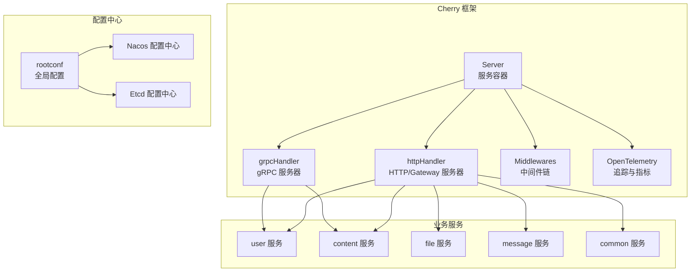
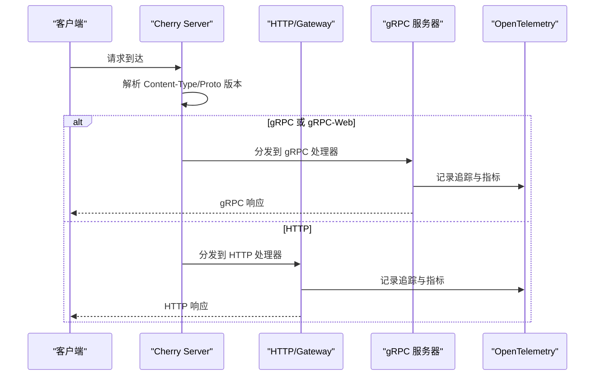
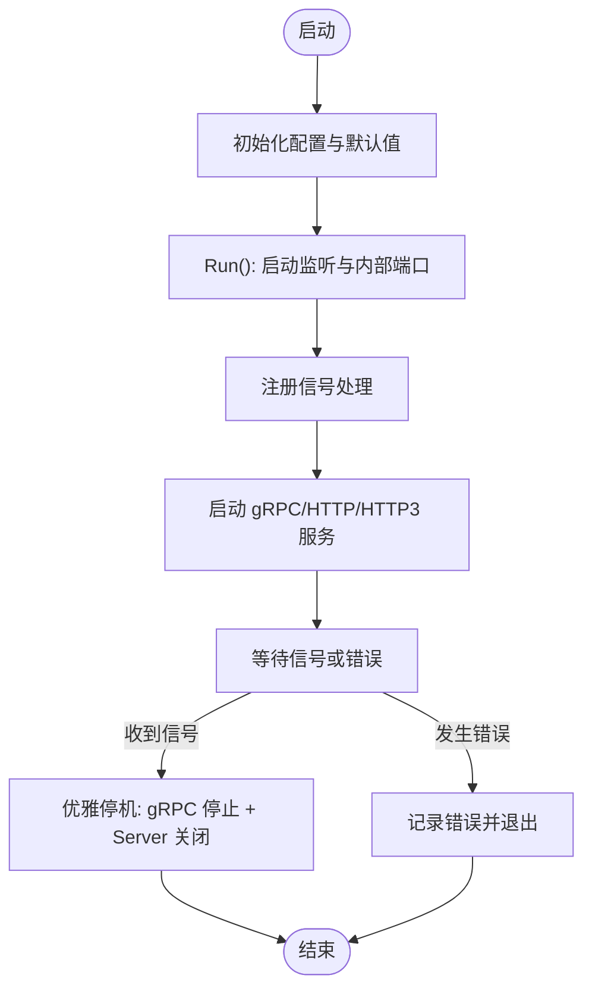
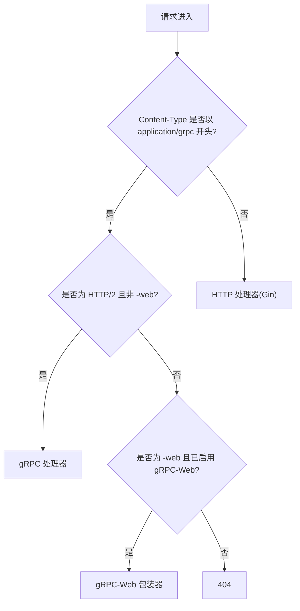
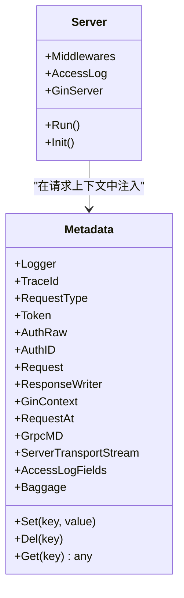
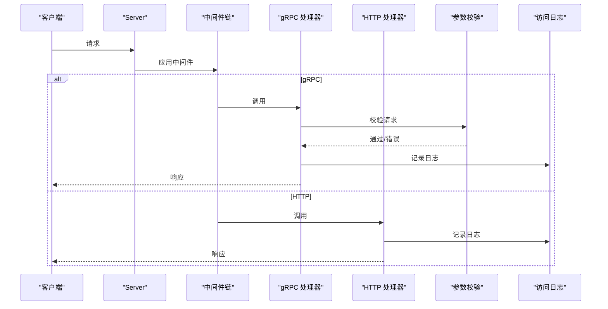
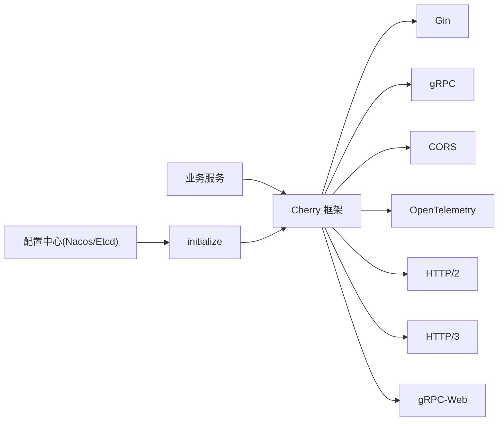

# 微服务架构设计

<cite>
**本文档引用的文件**
- [thirdparty/cherry/README.md](file://thirdparty/cherry/README.md)
- [thirdparty/cherry/server.go](file://thirdparty/cherry/server.go)
- [thirdparty/cherry/handler_grpc.go](file://thirdparty/cherry/handler_grpc.go)
- [thirdparty/cherry/handler_http.go](file://thirdparty/cherry/handler_http.go)
- [thirdparty/cherry/otel.go](file://thirdparty/cherry/otel.go)
- [thirdparty/cherry/options.go](file://thirdparty/cherry/options.go)
- [thirdparty/cherry/config.go](file://thirdparty/cherry/config.go)
- [thirdparty/cherry/matadata.go](file://thirdparty/cherry/matadata.go)
- [server/go/main.go](file://server/go/main.go)
- [server/go/user/main.go](file://server/go/user/main.go)
- [server/go/config/config.toml](file://server/go/config/config.toml)
- [thirdparty/cherry/_example/user/main.go](file://thirdparty/cherry/_example/user/main.go)
- [thirdparty/initialize/rootconf.go](file://thirdparty/initialize/rootconf.go)
- [thirdparty/initialize/conf_center/nacos/nacos.go](file://thirdparty/initialize/conf_center/nacos/nacos.go)
- [thirdparty/initialize/conf_center/etcd/etcd.go](file://thirdparty/initialize/conf_center/etcd/etcd.go)
- [thirdparty/initialize/dao/nacos/nacos.go](file://thirdparty/initialize/dao/nacos/nacos.go)
- [thirdparty/initialize/dao/etcd/etcd.go](file://thirdparty/initialize/dao/etcd/etcd.go)
</cite>

## 目录
1. [简介](#简介)
2. [项目结构](#项目结构)
3. [核心组件](#核心组件)
4. [架构总览](#架构总览)
5. [详细组件分析](#详细组件分析)
6. [依赖分析](#依赖分析)
7. [性能考虑](#性能考虑)
8. [故障排查指南](#故障排查指南)
9. [结论](#结论)
10. [附录](#附录)

## 简介
本项目基于 Cherry 微服务框架，构建了支持 gRPC 与 HTTP 的混合协议微服务，具备中间件链式处理、CORS 跨域、OpenTelemetry 监控、优雅停机与信号处理、HTTP/2、HTTP/3、gRPC-Web 等能力。服务通过统一入口初始化容器，注册各业务模块的 gRPC 与 HTTP 接口，并在运行期根据配置启用可观测性与治理功能。

## 项目结构
- Cherry 框架位于 thirdparty/cherry，提供服务容器、协议适配、中间件、可观测性与生命周期管理。
- 业务服务位于 server/go，包含用户、内容、消息、文件等子服务，统一通过 Cherry 启动。
- 配置中心与注入系统位于 thirdparty/initialize，支持本地模板、Nacos、Etcd 等配置中心。
- 示例与工具位于 thirdparty/cherry/_example 与 thirdparty/protobuf/tools 等目录。

图表来源
- [thirdparty/cherry/server.go:40-200](file://thirdparty/cherry/server.go#L40-L200)
- [thirdparty/cherry/handler_grpc.go:30-58](file://thirdparty/cherry/handler_grpc.go#L30-L58)
- [thirdparty/cherry/handler_http.go:36-83](file://thirdparty/cherry/handler_http.go#L36-L83)
- [thirdparty/initialize/rootconf.go:50-147](file://thirdparty/initialize/rootconf.go#L50-L147)
- [thirdparty/initialize/conf_center/nacos/nacos.go:43-70](file://thirdparty/initialize/conf_center/nacos/nacos.go#L43-L70)
- [thirdparty/initialize/conf_center/etcd/etcd.go:36-62](file://thirdparty/initialize/conf_center/etcd/etcd.go#L36-L62)

章节来源
- [thirdparty/cherry/README.md:1-58](file://thirdparty/cherry/README.md#L1-L58)
- [thirdparty/cherry/server.go:40-200](file://thirdparty/cherry/server.go#L40-L200)
- [thirdparty/cherry/config.go:43-177](file://thirdparty/cherry/config.go#L43-L177)

## 核心组件
- 服务容器 Server：负责监听、路由分发、中间件链、CORS、gRPC-Web、HTTP/2、HTTP/3、OpenTelemetry、内部管理端口等。
- gRPC 处理器 grpcHandler：注册拦截器、反射、OpenTelemetry 统计、访问日志记录、panic 恢复与状态码转换。
- HTTP 处理器 httpHandler：接入 Gin 引擎，统一异常捕获、访问日志、OpenTelemetry Span 名称格式化。
- 中间件与元数据：Metadata 提供请求上下文透传、日志、Baggage、TraceId 等；支持链式中间件。
- 配置与注入：rootconf 支持多环境、模板、本地与配置中心（Nacos/Etcd）注入；支持热更新。
- 生命周期与信号：Run() 内部启动 HTTP/HTTP3/内部端口，监听 SIGINT/SIGTERM，优雅停机并关闭 gRPC 服务器。

章节来源
- [thirdparty/cherry/config.go:43-177](file://thirdparty/cherry/config.go#L43-L177)
- [thirdparty/cherry/handler_grpc.go:30-107](file://thirdparty/cherry/handler_grpc.go#L30-L107)
- [thirdparty/cherry/handler_http.go:36-83](file://thirdparty/cherry/handler_http.go#L36-L83)
- [thirdparty/cherry/matadata.go:25-85](file://thirdparty/cherry/matadata.go#L25-L85)
- [thirdparty/initialize/rootconf.go:50-147](file://thirdparty/initialize/rootconf.go#L50-L147)

## 架构总览
Cherry 将 gRPC 与 HTTP 协议在同一服务容器内统一管理，通过 Content-Type 与协议版本识别请求类型，自动路由至对应处理器。同时内置 CORS、gRPC-Web、HTTP/2、HTTP/3、OpenTelemetry 等能力，形成“一服务多协议”的混合微服务体系。

图表来源
- [thirdparty/cherry/server.go:87-108](file://thirdparty/cherry/server.go#L87-L108)
- [thirdparty/cherry/handler_grpc.go:30-58](file://thirdparty/cherry/handler_grpc.go#L30-L58)
- [thirdparty/cherry/handler_http.go:36-83](file://thirdparty/cherry/handler_http.go#L36-L83)
- [thirdparty/cherry/otel.go:24-71](file://thirdparty/cherry/otel.go#L24-L71)

## 详细组件分析

### 服务容器与生命周期
- 初始化：Init() 设置 Gin 模式、默认地址、内部端口、TLS、CORS 默认值、日志超时等。
- 运行：Run() 注册信号处理，启动 gRPC 与 HTTP 处理器，按需启用 CORS、gRPC-Web、OpenTelemetry、HTTP/3，最后等待信号进行优雅停机。
- 优雅停机：捕获 SIGINT/SIGTERM 后停止接收新信号，调用 gRPC GracefulStop 与 Server Shutdown，确保资源释放。

图表来源
- [thirdparty/cherry/server.go:40-200](file://thirdparty/cherry/server.go#L40-L200)
- [thirdparty/cherry/config.go:112-177](file://thirdparty/cherry/config.go#L112-L177)

章节来源
- [thirdparty/cherry/server.go:40-200](file://thirdparty/cherry/server.go#L40-L200)
- [thirdparty/cherry/config.go:112-177](file://thirdparty/cherry/config.go#L112-L177)

### 协议适配与混合支持
- 协议识别：根据 Content-Type 与 HTTP/2 协商结果，区分 gRPC、gRPC-Web 与 HTTP。
- gRPC-Web：WrapServer 包装 gRPC 服务器以支持浏览器直连 gRPC。
- HTTP/2 与 HTTP/3：在 TLS 或 h2c 条件下启用 HTTP/2；HTTP/3 可独立监听。
- CORS：可选启用，支持默认允许来源、方法与头。

图表来源
- [thirdparty/cherry/server.go:87-108](file://thirdparty/cherry/server.go#L87-L108)
- [thirdparty/cherry/handler_grpc.go:30-58](file://thirdparty/cherry/handler_grpc.go#L30-L58)

章节来源
- [thirdparty/cherry/server.go:55-108](file://thirdparty/cherry/server.go#L55-L108)

### 中间件链与元数据
- 中间件：通过 WithMiddleware 注入，统一包裹在 HTTP 处理器外层，支持链式执行。
- 元数据：Metadata 在请求上下文中携带 Logger、TraceId、Baggage、GinContext、请求时间等，便于日志与追踪。
- 访问日志：HTTP 侧可配置排除/包含前缀，记录请求与响应体摘要；gRPC 侧记录方法、元数据、请求/响应与错误。

图表来源
- [thirdparty/cherry/matadata.go:25-85](file://thirdparty/cherry/matadata.go#L25-L85)
- [thirdparty/cherry/config.go:43-62](file://thirdparty/cherry/config.go#L43-L62)

章节来源
- [thirdparty/cherry/matadata.go:25-85](file://thirdparty/cherry/matadata.go#L25-L85)
- [thirdparty/cherry/handler_http.go:36-83](file://thirdparty/cherry/handler_http.go#L36-L83)
- [thirdparty/cherry/handler_grpc.go:64-107](file://thirdparty/cherry/handler_grpc.go#L64-L107)

### gRPC 与 HTTP 混合协议处理
- gRPC：注册拦截器（Unary/Stream）、OpenTelemetry StatsHandler、反射、panic 恢复、参数校验、访问日志记录、空响应补全。
- HTTP：接入 Gin，统一异常捕获，记录请求/响应摘要，支持 OpenTelemetry Span 名称格式化。

图表来源
- [thirdparty/cherry/handler_grpc.go:64-107](file://thirdparty/cherry/handler_grpc.go#L64-L107)
- [thirdparty/cherry/handler_http.go:36-83](file://thirdparty/cherry/handler_http.go#L36-L83)

章节来源
- [thirdparty/cherry/handler_grpc.go:30-164](file://thirdparty/cherry/handler_grpc.go#L30-L164)
- [thirdparty/cherry/handler_http.go:36-83](file://thirdparty/cherry/handler_http.go#L36-L83)

### CORS 跨域与 gRPC-Web
- CORS：可选启用，若未显式配置 AllowedOrigins/AllowedMethods/AllowedHeaders，则采用默认宽松策略。
- gRPC-Web：当 Content-Type 为 gRPC Web 且启用 gRPC-Web 时，使用 WrapServer 进行处理。

章节来源
- [thirdparty/cherry/config.go:160-175](file://thirdparty/cherry/config.go#L160-L175)
- [thirdparty/cherry/server.go:60-64](file://thirdparty/cherry/server.go#L60-L64)

### OpenTelemetry 监控集成
- Tracer/Meter：按需初始化 TracerProvider 与 MeterProvider，设置 TextMap Propagator。
- gRPC：启用 otelgrpc StatsHandler，传播 TraceContext/Baggage。
- HTTP：使用 otelhttp.NewHandler 包裹，Span 名称可自定义。
- 客户端 Transport：可替换 http.DefaultClient 以对出站 HTTP 请求进行追踪。

章节来源
- [thirdparty/cherry/otel.go:24-92](file://thirdparty/cherry/otel.go#L24-L92)
- [thirdparty/cherry/handler_grpc.go:37-43](file://thirdparty/cherry/handler_grpc.go#L37-L43)
- [thirdparty/cherry/handler_http.go:77-81](file://thirdparty/cherry/handler_http.go#L77-L81)
- [thirdparty/cherry/server.go:66-85](file://thirdparty/cherry/server.go#L66-L85)

### 服务发现、负载均衡与熔断降级
- 服务发现与配置中心：通过 initialize 模块支持 Nacos/Etcd，实现配置的集中管理与热更新。
- 负载均衡与熔断：当前 Cherry 框架未直接内置负载均衡与熔断逻辑；可在上游网关或服务网格中实现，或结合外部 SDK 自行扩展。

章节来源
- [thirdparty/initialize/conf_center/nacos/nacos.go:43-70](file://thirdparty/initialize/conf_center/nacos/nacos.go#L43-L70)
- [thirdparty/initialize/conf_center/etcd/etcd.go:36-62](file://thirdparty/initialize/conf_center/etcd/etcd.go#L36-L62)
- [thirdparty/initialize/dao/nacos/nacos.go:31-47](file://thirdparty/initialize/dao/nacos/nacos.go#L31-L47)
- [thirdparty/initialize/dao/etcd/etcd.go:21-37](file://thirdparty/initialize/dao/etcd/etcd.go#L21-L37)

### 服务间通信模式与错误处理
- 服务间通信：Cherry 通过 gRPC 与 HTTP Gateway 提供统一接口；业务服务在启动时分别注册 gRPC 与 HTTP 路由。
- 错误处理：gRPC 侧对 panic 恢复并返回 Unknown 状态；参数校验失败返回 InvalidArgument；HTTP 侧统一捕获 panic 并返回内部错误码与标准错误响应。

章节来源
- [thirdparty/cherry/handler_grpc.go:64-107](file://thirdparty/cherry/handler_grpc.go#L64-L107)
- [thirdparty/cherry/handler_http.go:36-83](file://thirdparty/cherry/handler_http.go#L36-L83)
- [server/go/main.go:55-67](file://server/go/main.go#L55-L67)

## 依赖分析
- Cherry 作为核心框架，依赖 Gin、gRPC、CORS、OpenTelemetry、HTTP/2、HTTP/3、gRPC-Web 等。
- 业务服务通过 Cherry 注册接口，统一走同一容器与中间件链。
- 配置中心通过 initialize 模块对接 Nacos/Etcd，支持热更新与模板生成。

图表来源
- [thirdparty/cherry/server.go:9-29](file://thirdparty/cherry/server.go#L9-L29)
- [thirdparty/cherry/handler_grpc.go:9-28](file://thirdparty/cherry/handler_grpc.go#L9-L28)
- [thirdparty/cherry/handler_http.go:9-25](file://thirdparty/cherry/handler_http.go#L9-L25)
- [thirdparty/initialize/rootconf.go:116-146](file://thirdparty/initialize/rootconf.go#L116-L146)

章节来源
- [thirdparty/cherry/server.go:9-29](file://thirdparty/cherry/server.go#L9-L29)
- [thirdparty/initialize/rootconf.go:116-146](file://thirdparty/initialize/rootconf.go#L116-L146)

## 性能考虑
- HTTP/2 参数：可通过 WithHttp2/WithHTTP3 调整并发流、帧大小、缓冲限制等，以适配高并发场景。
- 日志与追踪：避免在高频路径上进行昂贵的日志记录；必要时使用采样策略。
- 中间件数量：中间件链越长，延迟越高；建议按需启用并合并功能。
- gRPC-Web：浏览器直连 gRPC 时注意头部与压缩策略，减少不必要的往返。

## 故障排查指南
- 信号处理：确认 SIGINT/SIGTERM 是否正确注册，避免优雅停机失败。
- CORS：若跨域失败，检查 AllowedOrigins/AllowedMethods/AllowedHeaders 是否匹配。
- OpenTelemetry：确认 TracerProvider/MeterProvider 初始化成功，Propagator 是否设置。
- gRPC-Web：确认 Content-Type 与 WrapServer 是否启用。
- 配置中心：Nacos/Etcd 连接参数、命名空间、DataId/Group 是否正确；监听是否生效。

章节来源
- [thirdparty/cherry/server.go:40-200](file://thirdparty/cherry/server.go#L40-L200)
- [thirdparty/cherry/config.go:160-175](file://thirdparty/cherry/config.go#L160-L175)
- [thirdparty/cherry/otel.go:24-92](file://thirdparty/cherry/otel.go#L24-L92)
- [thirdparty/initialize/conf_center/nacos/nacos.go:43-70](file://thirdparty/initialize/conf_center/nacos/nacos.go#L43-L70)
- [thirdparty/initialize/conf_center/etcd/etcd.go:36-62](file://thirdparty/initialize/conf_center/etcd/etcd.go#L36-L62)

## 结论
Cherry 框架提供了“一服务多协议”的微服务基础设施，通过统一容器、中间件链、协议适配与可观测性，简化了 gRPC 与 HTTP 的混合部署与运维。结合 initialize 的配置中心能力，可实现灵活的配置管理与热更新。对于服务发现、负载均衡与熔断降级等高级治理能力，可在网关或服务网格层面扩展，或通过外部 SDK 实现。

## 附录
- 快速开始示例：参考 Cherry 示例与业务服务入口，了解如何注册 gRPC 与 HTTP 接口并启动服务。
- 配置示例：参考 server/go/config/config.toml，了解多环境与配置中心的配置方式。

章节来源
- [thirdparty/cherry/_example/user/main.go:14-16](file://thirdparty/cherry/_example/user/main.go#L14-L16)
- [server/go/user/main.go:10-15](file://server/go/user/main.go#L10-L15)
- [server/go/config/config.toml:1-41](file://server/go/config/config.toml#L1-L41)