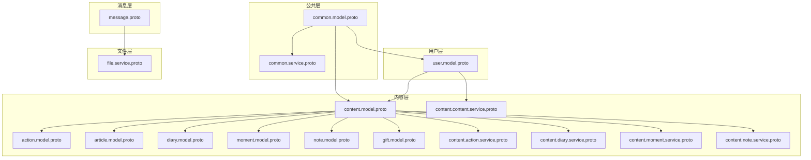
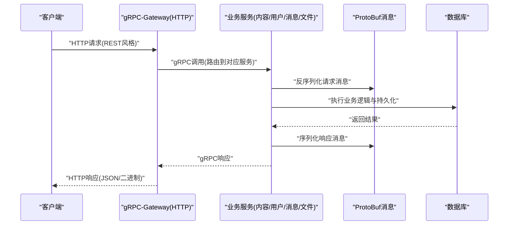
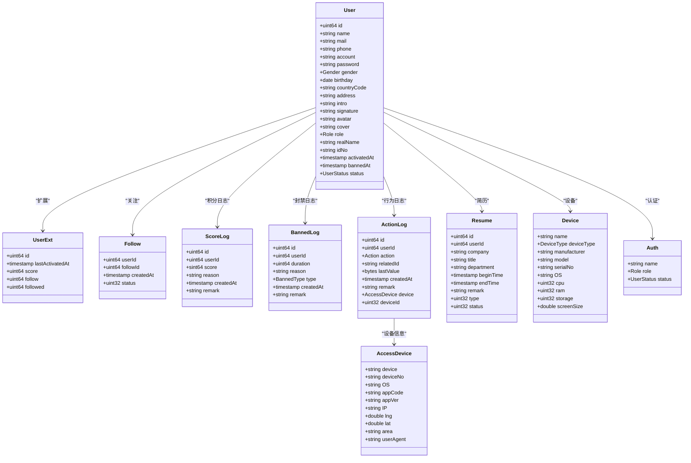
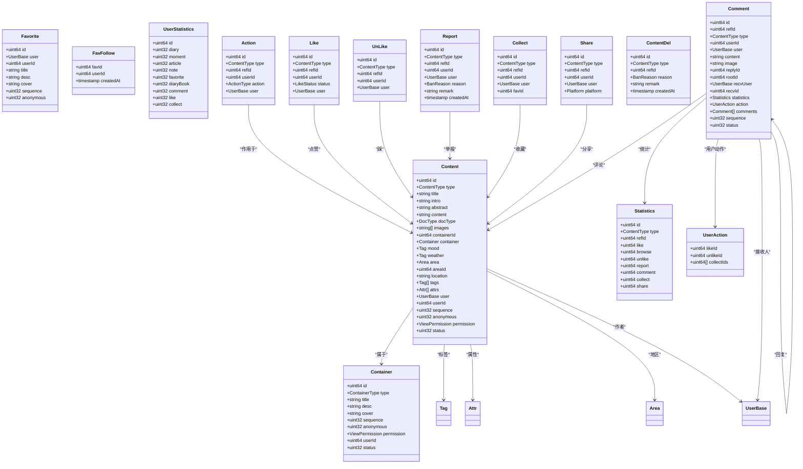
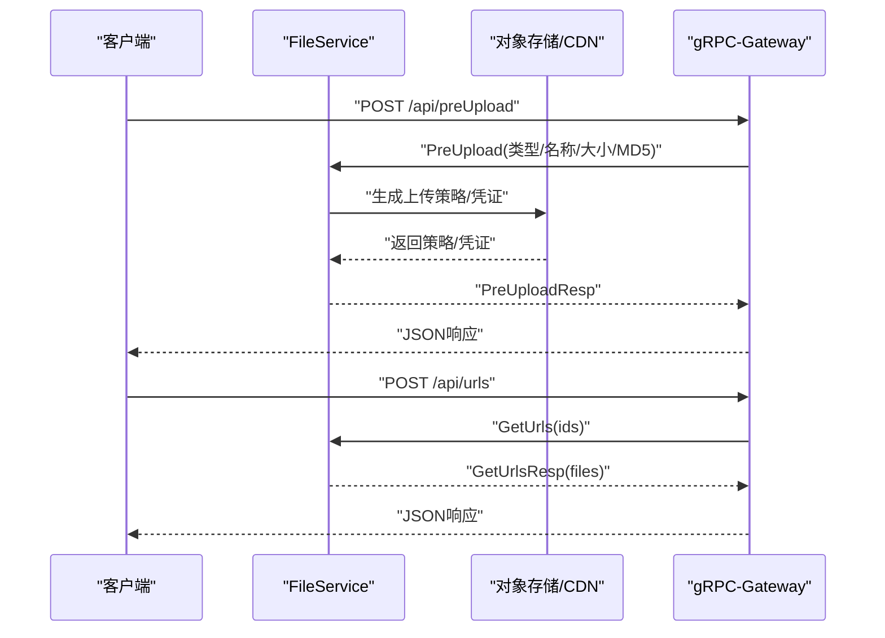
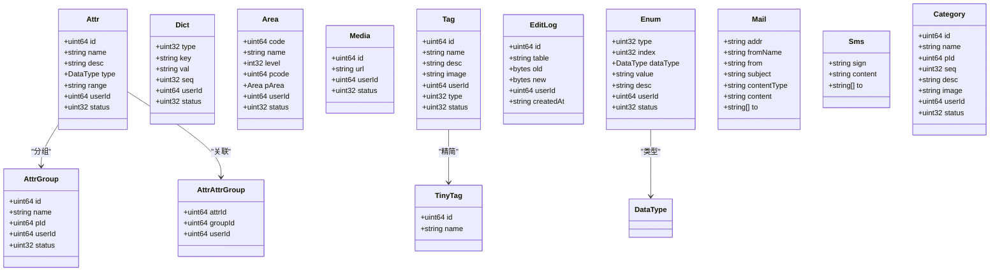
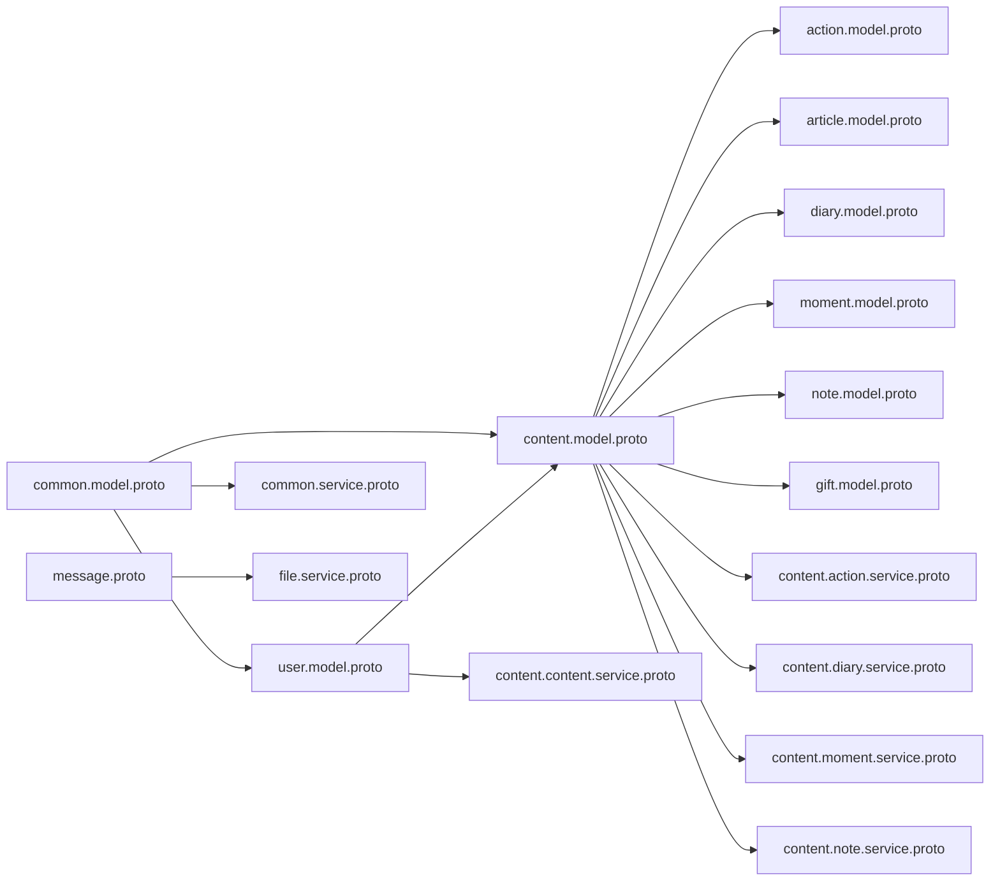

# 数据架构设计

<cite>
**本文档引用的文件**
- [proto/README.md](file://proto/README.md)
- [common.model.proto](file://proto/common/common.model.proto)
- [common.service.proto](file://proto/common/common.service.proto)
- [user.model.proto](file://proto/user/user.model.proto)
- [content.model.proto](file://proto/content/content.model.proto)
- [content.action.model.proto](file://proto/content/action.model.proto)
- [content.article.model.proto](file://proto/content/article.model.proto)
- [content.diary.model.proto](file://proto/content/diary.model.proto)
- [content.moment.model.proto](file://proto/content/moment.model.proto)
- [content.note.model.proto](file://proto/content/note.model.proto)
- [content.gift.model.proto](file://proto/content/gift.model.proto)
- [content.content.service.proto](file://proto/content/content.service.proto)
- [content.action.service.proto](file://proto/content/action.service.proto)
- [content.diary.service.proto](file://proto/content/diary.service.proto)
- [content.moment.service.proto](file://proto/content/moment.service.proto)
- [content.note.service.proto](file://proto/content/note.service.proto)
- [message.proto](file://proto/message/message.proto)
- [file.service.proto](file://proto/file/file.service.proto)
</cite>

## 目录
1. [引言](#引言)
2. [项目结构](#项目结构)
3. [核心组件](#核心组件)
4. [架构总览](#架构总览)
5. [详细组件分析](#详细组件分析)
6. [依赖关系分析](#依赖关系分析)
7. [性能考量](#性能考量)
8. [故障排查指南](#故障排查指南)
9. [结论](#结论)
10. [附录](#附录)

## 引言
本文件面向Hoper数据架构，系统化梳理ProtoBuf在数据契约标准化中的核心作用，明确消息定义、字段约束、版本兼容性管理策略，并给出统一数据模型设计原则（覆盖用户、内容、文件、消息等核心实体）。同时，阐述跨语言数据交换协议、序列化/反序列化机制、数据验证规则、枚举类型定义与时间戳处理策略，并提供数据迁移方案、向后兼容性保证与性能优化建议。

## 项目结构
Hoper采用“按领域分层”的ProtoBuf组织方式，核心目录如下：
- proto/common：通用模型与公共服务（如属性、标签、区域、媒体、字典、枚举等）
- proto/user：用户域模型与服务（用户、角色、状态、设备、操作日志等）
- proto/content：内容域模型与服务（文章、日记、瞬间、笔记、收藏夹、合集、动作与统计等）
- proto/message：消息域模型与服务（聊天消息、命令、元数据等）
- proto/file：文件服务（URL获取、预上传、分片上传、凭证等）

图表来源
- [common.model.proto:1-213](file://proto/common/common.model.proto#L1-L213)
- [common.service.proto:1-223](file://proto/common/common.service.proto#L1-L223)
- [user.model.proto:1-269](file://proto/user/user.model.proto#L1-L269)
- [content.model.proto:1-187](file://proto/content/content.model.proto#L1-L187)
- [content.action.model.proto:1-171](file://proto/content/action.model.proto#L1-L171)
- [content.article.model.proto:1-45](file://proto/content/article.model.proto#L1-L45)
- [content.diary.model.proto:1-59](file://proto/content/diary.model.proto#L1-L59)
- [content.moment.model.proto:1-47](file://proto/content/moment.model.proto#L1-L47)
- [content.note.model.proto:1-39](file://proto/content/note.model.proto#L1-L39)
- [content.gift.model.proto:1-20](file://proto/content/gift.model.proto#L1-L20)
- [content.content.service.proto:1-144](file://proto/content/content.service.proto#L1-L144)
- [content.action.service.proto:1-171](file://proto/content/action.service.proto#L1-L171)
- [content.diary.service.proto:1-181](file://proto/content/diary.service.proto#L1-L181)
- [content.moment.service.proto:1-116](file://proto/content/moment.service.proto#L1-L116)
- [content.note.service.proto:1-47](file://proto/content/note.service.proto#L1-L47)
- [message.proto:1-74](file://proto/message/message.proto#L1-L74)
- [file.service.proto:1-122](file://proto/file/file.service.proto#L1-L122)

章节来源
- [proto/README.md:1-7](file://proto/README.md#L1-L7)

## 核心组件
- ProtoBuf消息与字段约束
  - 字段注解通过扩展选项绑定GORM标签、校验规则、GraphQL/OpenAPI元数据，确保生成代码与数据库映射一致。
  - 示例：用户模型中的邮箱、手机号、账号长度、性别、生日、头像、角色、状态等字段均带有约束与默认值。
- 统一数据模型设计原则
  - 基础模型嵌入：多处模型复用基础模型嵌入，减少重复字段。
  - 时间模型：统一使用时间戳与时区时间模型，保证跨语言一致性。
  - 状态与枚举：以枚举表达业务状态与类型，避免魔法值。
- 版本兼容性管理
  - 采用ProtoBuf的向后兼容规则：新增可选字段、不移除已有字段、保持字段编号稳定。
  - 通过OpenAPI注解与GraphQL注解，确保HTTP/Gateway与GraphQL层的契约一致。
- 序列化/反序列化与跨语言交换
  - ProtoBuf提供跨语言的高效二进制序列化；结合gRPC-Gateway与OpenAPI注解，实现HTTP REST风格调用。
  - 项目中存在对gRPC-Gateway与自定义Empty类型的兼容说明，确保生成代码与运行时一致。

章节来源
- [common.model.proto:1-213](file://proto/common/common.model.proto#L1-L213)
- [user.model.proto:1-269](file://proto/user/user.model.proto#L1-L269)
- [content.model.proto:1-187](file://proto/content/content.model.proto#L1-L187)
- [content.action.model.proto:1-171](file://proto/content/action.model.proto#L1-L171)
- [message.proto:1-74](file://proto/message/message.proto#L1-L74)
- [file.service.proto:1-122](file://proto/file/file.service.proto#L1-L122)
- [proto/README.md:1-7](file://proto/README.md#L1-L7)

## 架构总览
下图展示从客户端到服务端的关键交互路径，以及ProtoBuf消息在各层的流转：

图表来源
- [common.service.proto:18-136](file://proto/common/common.service.proto#L18-L136)
- [content.content.service.proto:18-94](file://proto/content/content.service.proto#L18-L94)
- [content.action.service.proto:23-108](file://proto/content/action.service.proto#L23-L108)
- [content.diary.service.proto:19-122](file://proto/content/diary.service.proto#L19-L122)
- [content.moment.service.proto:23-85](file://proto/content/moment.service.proto#L23-L85)
- [content.note.service.proto:21-40](file://proto/content/note.service.proto#L21-L40)
- [message.proto:71-74](file://proto/message/message.proto#L71-L74)
- [file.service.proto:20-62](file://proto/file/file.service.proto#L20-L62)

## 详细组件分析

### 用户域模型与服务
- 用户模型要点
  - 基本字段：ID、昵称、邮箱、国家码/手机号、账号、密码、性别、生日、国家/地区、地址、简介/签名、头像/封面、角色、实名信息、激活/封禁时间、状态等。
  - 扩展字段：分数、关注/被关注数、最近活跃时间等。
  - 行为日志：注册、激活、改密、重置密码、简历创建/编辑/删除等。
  - 设备信息：设备品牌、型号、OS、屏幕尺寸、CPU/内存/存储等。
- 角色与状态枚举
  - 角色：普通用户、管理员、超级管理员。
  - 用户状态：未激活、已激活、已冻结、已注销。
  - 封禁类型：禁言、禁止登录。
- 服务接口
  - 用户增删改查、登录态校验、设备管理、操作日志查询等。

图表来源
- [user.model.proto:19-269](file://proto/user/user.model.proto#L19-L269)

章节来源
- [user.model.proto:1-269](file://proto/user/user.model.proto#L1-L269)

### 内容域模型与服务
- 内容与容器
  - 内容：文章、日记、瞬间、笔记、收藏夹、合集等，统一通过类型枚举标识。
  - 容器：收藏夹、日记本、专辑、合集等。
  - 关系：内容与标签、属性、地区、用户、容器等多对多/一对多关联。
- 动作与统计
  - 动作：浏览、点赞、踩、评论、收藏、分享、举报、审核、删除、回馈等。
  - 统计：点赞、踩、评论、收藏、分享、浏览、举报等计数。
  - 评论树：支持回复与根节点，形成评论树结构。
- 服务接口
  - 内容：创建、更新、删除、列表、详情、收藏夹/合集管理、用户统计。
  - 动作：点赞/取消、评论、评论列表、收藏、举报、用户动作查询。
  - 日记：日记本管理、日记增删改查、列表。
  - 瞬间：增删改查、列表。
  - 笔记：创建。

图表来源
- [content.model.proto:19-187](file://proto/content/content.model.proto#L19-L187)
- [content.action.model.proto:21-171](file://proto/content/action.model.proto#L21-L171)

章节来源
- [content.model.proto:1-187](file://proto/content/content.model.proto#L1-L187)
- [content.action.model.proto:1-171](file://proto/content/action.model.proto#L1-L171)
- [content.article.model.proto:1-45](file://proto/content/article.model.proto#L1-L45)
- [content.diary.model.proto:1-59](file://proto/content/diary.model.proto#L1-L59)
- [content.moment.model.proto:1-47](file://proto/content/moment.model.proto#L1-L47)
- [content.note.model.proto:1-39](file://proto/content/note.model.proto#L1-L39)
- [content.gift.model.proto:1-20](file://proto/content/gift.model.proto#L1-L20)
- [content.content.service.proto:1-144](file://proto/content/content.service.proto#L1-L144)
- [content.action.service.proto:1-171](file://proto/content/action.service.proto#L1-L171)
- [content.diary.service.proto:1-181](file://proto/content/diary.service.proto#L1-L181)
- [content.moment.service.proto:1-116](file://proto/content/moment.service.proto#L1-L116)
- [content.note.service.proto:1-47](file://proto/content/note.service.proto#L1-L47)

### 文件与消息服务
- 文件服务
  - 提供URL批量查询、按ID字符串查询、预上传（支持直传、分片上传、临时凭证）等能力。
  - 返回结构包含文件信息、上传URL、分片上传信息、临时凭证等。
- 消息服务
  - 客户端/服务端消息模型、群组加入、命令类型、消息体载荷与类型（文本/二进制/图片/文件/视频/音频）。
  - 支持消息发送与接收、客户端元数据（用户ID、服务器ID、设备）。

图表来源
- [file.service.proto:20-122](file://proto/file/file.service.proto#L20-L122)

章节来源
- [file.service.proto:1-122](file://proto/file/file.service.proto#L1-L122)
- [message.proto:1-74](file://proto/message/message.proto#L1-L74)

### 公共模型与服务
- 公共模型
  - 属性/属性组/属性-组关联、字典、区域、媒体、标签、TinyTag、编辑日志、自描述枚举、邮件/SMS模板、分类等。
  - 统一的状态字段与时间模型嵌入，便于审计与追踪。
- 公共服务
  - 属性增删改查、标签增删改查、邮件发送、国际化消息查询等。

图表来源
- [common.model.proto:19-213](file://proto/common/common.model.proto#L19-L213)

章节来源
- [common.model.proto:1-213](file://proto/common/common.model.proto#L1-L213)
- [common.service.proto:1-223](file://proto/common/common.service.proto#L1-L223)

## 依赖关系分析
- 模块内聚与耦合
  - 内容域模型高度复用公共模型（标签、区域、媒体、枚举），降低重复并统一约束。
  - 用户域模型独立但与内容域通过用户ID、用户基础信息建立强关联。
- 外部依赖
  - gRPC-Gateway与OpenAPI注解用于HTTP REST映射。
  - GraphQL注解用于GraphQL查询/变更。
  - 时间与时区处理通过专用时间模型与时间戳模型统一。
- 循环依赖
  - 当前结构未发现直接循环依赖；内容与动作模型双向引用（如评论包含用户与统计）通过消息字段而非数据库外键实现，避免循环。

图表来源
- [common.model.proto:1-213](file://proto/common/common.model.proto#L1-L213)
- [user.model.proto:1-269](file://proto/user/user.model.proto#L1-L269)
- [content.model.proto:1-187](file://proto/content/content.model.proto#L1-L187)
- [content.action.model.proto:1-171](file://proto/content/action.model.proto#L1-L171)
- [content.article.model.proto:1-45](file://proto/content/article.model.proto#L1-L45)
- [content.diary.model.proto:1-59](file://proto/content/diary.model.proto#L1-L59)
- [content.moment.model.proto:1-47](file://proto/content/moment.model.proto#L1-L47)
- [content.note.model.proto:1-39](file://proto/content/note.model.proto#L1-L39)
- [content.gift.model.proto:1-20](file://proto/content/gift.model.proto#L1-L20)
- [common.service.proto:1-223](file://proto/common/common.service.proto#L1-L223)
- [content.content.service.proto:1-144](file://proto/content/content.service.proto#L1-L144)
- [content.action.service.proto:1-171](file://proto/content/action.service.proto#L1-L171)
- [content.diary.service.proto:1-181](file://proto/content/diary.service.proto#L1-L181)
- [content.moment.service.proto:1-116](file://proto/content/moment.service.proto#L1-L116)
- [content.note.service.proto:1-47](file://proto/content/note.service.proto#L1-L47)
- [message.proto:1-74](file://proto/message/message.proto#L1-L74)
- [file.service.proto:1-122](file://proto/file/file.service.proto#L1-L122)

## 性能考量
- 序列化性能
  - ProtoBuf二进制序列化相比JSON更紧凑、解析更快，适合高并发场景。
- 查询与索引
  - 在高频查询字段上建立索引（如用户ID、类型+ID复合索引、时间戳索引），减少扫描成本。
- 缓存策略
  - 对热点内容与用户信息进行缓存，结合版本号或ETag实现缓存失效。
- 分页与批量
  - 列表接口采用分页参数，批量查询URL与标签等资源，减少网络往返。
- 时间处理
  - 统一使用带时区的时间戳，避免跨时区转换误差；对高频时间字段建立索引。

## 故障排查指南
- gRPC-Gateway与Empty类型
  - 若出现空消息类型不匹配问题，需参考项目说明，将生成的空消息类型替换为自定义类型，确保与运行时一致。
- 字段校验失败
  - 检查请求消息中的字段注解（如邮箱、手机号、账号长度、必填项）是否满足约束。
- HTTP映射异常
  - 确认服务方法上的HTTP注解与路径、方法、body映射正确，避免参数丢失。
- 时间字段异常
  - 确保前端传递带时区的时间戳，后端统一解析为UTC存储，避免夏令时与本地时间混淆。

章节来源
- [proto/README.md:1-7](file://proto/README.md#L1-L7)

## 结论
Hoper通过ProtoBuf实现了跨语言、跨系统的数据契约标准化，配合gRPC-Gateway与OpenAPI/GraphQL注解，既保证了高性能的二进制序列化，又提供了REST与GraphQL双栈访问能力。统一的数据模型设计原则（嵌入基础模型、统一时间模型、枚举化状态与类型、严格的字段约束）为后续演进提供了清晰的边界与稳定的基线。建议在演进过程中持续遵循ProtoBuf的向后兼容规则，并完善版本化治理与自动化测试，确保数据一致性与系统稳定性。

## 附录
- 数据验证规则示例
  - 邮箱：符合邮箱格式校验。
  - 手机号：符合手机号格式校验。
  - 账号：长度6-20字符，必填。
  - 密码：长度8-15字符。
  - 标题/标签名：长度2-10字符，必填。
- 枚举类型定义
  - 用户性别、角色、状态、封禁类型、设备类型、内容类型、可见范围、平台、举报原因、文档类型、消息命令等。
- 时间戳处理策略
  - 使用带时区的时间戳模型，统一存储与传输；对历史字段保留本地时间模型以兼容旧数据。