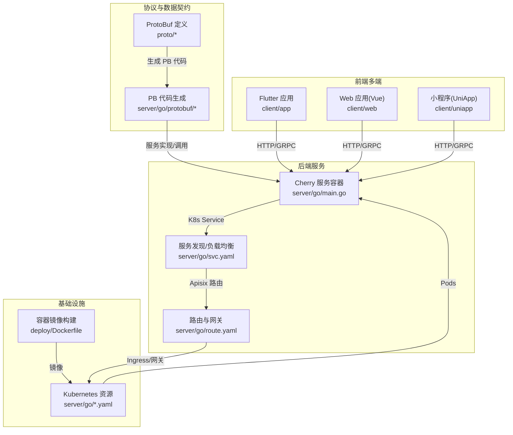
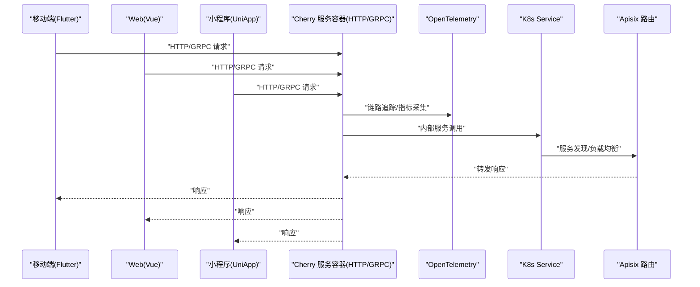
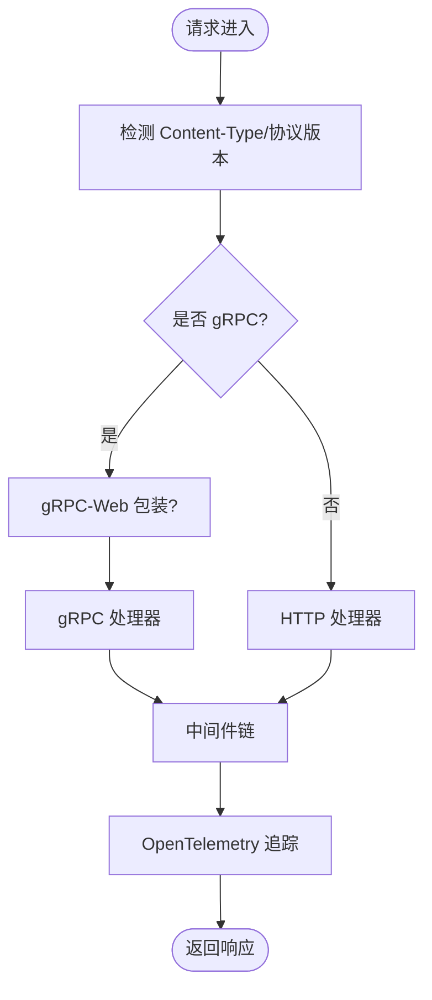
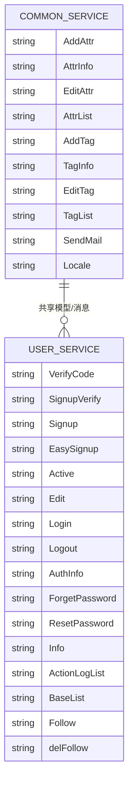
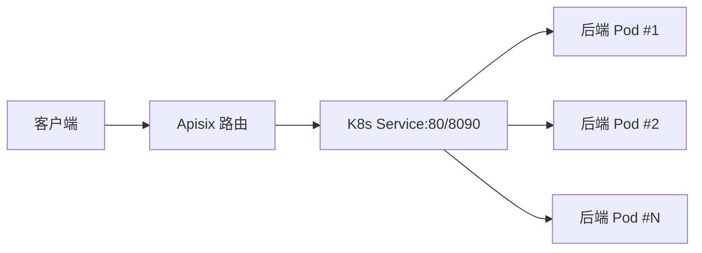
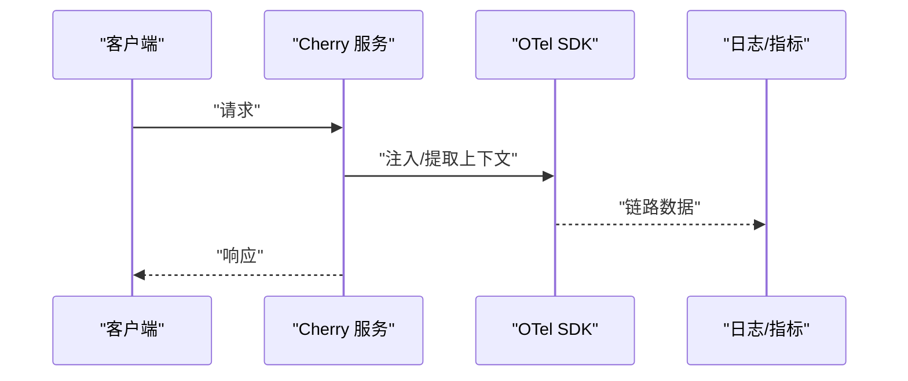
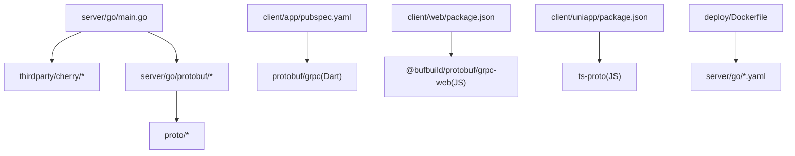

# 系统架构

<cite>
**本文档引用的文件**
- [server/go/main.go](file://server/go/main.go)
- [thirdparty/cherry/README.md](file://thirdparty/cherry/README.md)
- [thirdparty/cherry/server.go](file://thirdparty/cherry/server.go)
- [thirdparty/cherry/options.go](file://thirdparty/cherry/options.go)
- [thirdparty/cherry/otel.go](file://thirdparty/cherry/otel.go)
- [thirdparty/cherry/handler_http.go](file://thirdparty/cherry/handler_http.go)
- [thirdparty/cherry/handler_grpc.go](file://thirdparty/cherry/handler_grpc.go)
- [server/go/route.yaml](file://server/go/route.yaml)
- [server/go/svc.yaml](file://server/go/svc.yaml)
- [proto/common/common.service.proto](file://proto/common/common.service.proto)
- [proto/user/user.service.proto](file://proto/user/user.service.proto)
- [client/app/pubspec.yaml](file://client/app/pubspec.yaml)
- [client/web/package.json](file://client/web/package.json)
- [client/uniapp/package.json](file://client/uniapp/package.json)
- [deploy/Dockerfile](file://deploy/Dockerfile)
</cite>

## 目录
1. [引言](#引言)
2. [项目结构](#项目结构)
3. [核心组件](#核心组件)
4. [架构总览](#架构总览)
5. [详细组件分析](#详细组件分析)
6. [依赖分析](#依赖分析)
7. [性能考虑](#性能考虑)
8. [故障排查指南](#故障排查指南)
9. [结论](#结论)
10. [附录](#附录)

## 引言
本架构文档面向Hoper系统，基于Cherry框架构建的云原生微服务架构，围绕服务容器、中间件机制、协议适配层展开，重点阐述ProtoBuf在数据契约与跨语言通信中的核心地位，以及多端应用（移动端、Web端、小程序）统一数据模型的设计思路。同时覆盖服务发现、负载均衡、分布式追踪等关键特性，并给出系统边界、组件交互关系与数据流向图，最后提供可扩展性设计原则与性能优化策略。

## 项目结构
Hoper采用前后端分离与多端统一的数据契约设计：
- 后端：Go语言实现的微服务，基于Cherry框架提供HTTP/GRPC/HTTP3能力，并集成可观测性与中间件生态。
- 协议与数据契约：以ProtoBuf为核心，生成各语言客户端代码，确保跨端一致性。
- 客户端：Flutter移动端、Vue Web端、UniApp小程序，均通过ProtoBuf/GRPC或HTTP网关访问后端。
- 部署：Kubernetes YAML与Dockerfile支撑容器化与集群部署。

图表来源
- [server/go/main.go:28-68](file://server/go/main.go#L28-L68)
- [server/go/route.yaml:1-48](file://server/go/route.yaml#L1-L48)
- [server/go/svc.yaml:1-34](file://server/go/svc.yaml#L1-L34)
- [deploy/Dockerfile:1-25](file://deploy/Dockerfile#L1-L25)

章节来源
- [server/go/main.go:28-68](file://server/go/main.go#L28-L68)
- [server/go/route.yaml:1-48](file://server/go/route.yaml#L1-L48)
- [server/go/svc.yaml:1-34](file://server/go/svc.yaml#L1-L34)
- [deploy/Dockerfile:1-25](file://deploy/Dockerfile#L1-L25)

## 核心组件
- Cherry服务容器：统一承载HTTP/GRPC/HTTP3，内置CORS、gRPC-Web、OpenTelemetry可观测性、中间件链路与优雅停机。
- 协议适配层：基于ProtoBuf生成的PB代码，结合grpc-gateway与gin提供HTTP接口；同时支持原生grpc-gateway与grpc-web。
- 数据契约与跨语言通信：ProtoBuf作为唯一真相来源，生成Go、TS、Dart等多语言客户端代码，保证多端一致的数据模型与序列化。
- 多端应用：Flutter、Vue、UniApp分别引入对应依赖，通过ProtoBuf/GRPC或HTTP网关进行统一调用。

章节来源
- [thirdparty/cherry/README.md:26-58](file://thirdparty/cherry/README.md#L26-L58)
- [thirdparty/cherry/server.go:40-200](file://thirdparty/cherry/server.go#L40-L200)
- [proto/common/common.service.proto:18-136](file://proto/common/common.service.proto#L18-L136)
- [proto/user/user.service.proto:26-288](file://proto/user/user.service.proto#L26-L288)
- [client/app/pubspec.yaml:49-52](file://client/app/pubspec.yaml#L49-L52)
- [client/web/package.json:25-46](file://client/web/package.json#L25-L46)
- [client/uniapp/package.json:77-103](file://client/uniapp/package.json#L77-L103)

## 架构总览
下图展示从多端到服务容器、再到Kubernetes网关与服务发现的整体交互：

图表来源
- [server/go/main.go:48-67](file://server/go/main.go#L48-L67)
- [thirdparty/cherry/handler_http.go:36-83](file://thirdparty/cherry/handler_http.go#L36-L83)
- [thirdparty/cherry/handler_grpc.go:30-58](file://thirdparty/cherry/handler_grpc.go#L30-L58)
- [server/go/route.yaml:1-48](file://server/go/route.yaml#L1-L48)
- [server/go/svc.yaml:1-34](file://server/go/svc.yaml#L1-L34)

## 详细组件分析

### Cherry服务容器与协议适配
- 服务启动与优雅停机：监听信号量，支持HTTP/HTTP2/h2c/HTTP3，TLS配置，内部管理端口。
- 协议适配：自动识别Content-Type与协议版本，分流至gRPC或HTTP处理器；支持gRPC-Web与CORS。
- 中间件与可观测性：统一中间件链，OpenTelemetry链路追踪与指标采集，日志记录与Baggage传播。
- gRPC拦截器：统一的Unary/Stream拦截器，参数校验、异常转换、访问日志记录。

图表来源
- [thirdparty/cherry/server.go:87-108](file://thirdparty/cherry/server.go#L87-L108)
- [thirdparty/cherry/handler_http.go:36-83](file://thirdparty/cherry/handler_http.go#L36-L83)
- [thirdparty/cherry/handler_grpc.go:30-58](file://thirdparty/cherry/handler_grpc.go#L30-L58)

章节来源
- [thirdparty/cherry/server.go:40-200](file://thirdparty/cherry/server.go#L40-L200)
- [thirdparty/cherry/options.go:19-85](file://thirdparty/cherry/options.go#L19-L85)
- [thirdparty/cherry/handler_http.go:36-83](file://thirdparty/cherry/handler_http.go#L36-L83)
- [thirdparty/cherry/handler_grpc.go:30-164](file://thirdparty/cherry/handler_grpc.go#L30-L164)

### ProtoBuf数据契约与跨语言通信
- 数据契约：以proto文件定义消息与服务，统一命名空间与包结构，便于生成多语言代码。
- 生成与集成：通过protoc插件生成Go/TS/Dart等客户端代码，后端服务同样使用生成的PB类型。
- HTTP网关：结合grpc-gateway与gin，将gRPC映射为RESTful HTTP接口，满足Web端直连需求。
- 多端依赖：Flutter引入protobuf与grpc；Web端引入@bufbuild/protobuf与grpc-web；UniApp通过ts-proto等工具生成类型。

图表来源
- [proto/common/common.service.proto:18-136](file://proto/common/common.service.proto#L18-L136)
- [proto/user/user.service.proto:26-288](file://proto/user/user.service.proto#L26-L288)

章节来源
- [proto/common/common.service.proto:18-136](file://proto/common/common.service.proto#L18-L136)
- [proto/user/user.service.proto:26-288](file://proto/user/user.service.proto#L26-L288)
- [client/app/pubspec.yaml:49-52](file://client/app/pubspec.yaml#L49-L52)
- [client/web/package.json:25-46](file://client/web/package.json#L25-L46)
- [client/uniapp/package.json:77-103](file://client/uniapp/package.json#L77-L103)

### 多端应用与统一数据模型
- Flutter：使用protobuf与grpc依赖，通过生成的PB类型进行网络请求与本地存储。
- Web(Vue)：使用@bufbuild/protobuf与grpc-web，结合Axios等HTTP客户端访问后端。
- UniApp：通过ts-proto等工具生成类型，适配多平台运行时。
- 统一模型：所有端均消费同一份ProtoBuf定义，确保字段语义、序列化格式一致，降低维护成本。

章节来源
- [client/app/pubspec.yaml:49-52](file://client/app/pubspec.yaml#L49-L52)
- [client/web/package.json:25-46](file://client/web/package.json#L25-L46)
- [client/uniapp/package.json:77-103](file://client/uniapp/package.json#L77-L103)

### 服务发现、负载均衡与网关
- Kubernetes Service：ClusterIP暴露HTTP与gRPC端口，统一入口。
- Apisix 路由：按域名与路径匹配，将HTTP/GRPC流量分发至后端服务，支持HTTPS重定向与WebSocket。
- 负载均衡：由K8s Service与上游Apisix共同实现，支持轮询等策略。

图表来源
- [server/go/route.yaml:1-48](file://server/go/route.yaml#L1-L48)
- [server/go/svc.yaml:1-34](file://server/go/svc.yaml#L1-L34)

章节来源
- [server/go/route.yaml:1-48](file://server/go/route.yaml#L1-L48)
- [server/go/svc.yaml:1-34](file://server/go/svc.yaml#L1-L34)

### 分布式追踪与可观测性
- OpenTelemetry：全局初始化TracerProvider/MeterProvider，设置TextMapPropagator，HTTP与gRPC均接入链路追踪。
- 日志与Baggage：在HTTP/gRPC拦截器中提取TraceId与Baggage，统一记录访问日志。
- 内部管理端：可选的OpenAPI文档与调试接口，便于运维与联调。

图表来源
- [thirdparty/cherry/otel.go:24-92](file://thirdparty/cherry/otel.go#L24-L92)
- [thirdparty/cherry/handler_http.go:58-75](file://thirdparty/cherry/handler_http.go#L58-L75)
- [thirdparty/cherry/handler_grpc.go:64-106](file://thirdparty/cherry/handler_grpc.go#L64-L106)

章节来源
- [thirdparty/cherry/otel.go:24-92](file://thirdparty/cherry/otel.go#L24-L92)
- [thirdparty/cherry/handler_http.go:58-75](file://thirdparty/cherry/handler_http.go#L58-L75)
- [thirdparty/cherry/handler_grpc.go:64-106](file://thirdparty/cherry/handler_grpc.go#L64-L106)

## 依赖分析
- 后端依赖：Cherry框架、gin、grpc、OpenTelemetry、gox工具库、protobuf生成代码。
- 前端依赖：各端分别引入protobuf/GRPC相关依赖，确保与后端ProtoBuf契约一致。
- 部署依赖：Kubernetes资源与Dockerfile，用于容器化与集群编排。

图表来源
- [server/go/main.go:28-68](file://server/go/main.go#L28-L68)
- [proto/common/common.service.proto:14-18](file://proto/common/common.service.proto#L14-L18)
- [proto/user/user.service.proto:16-18](file://proto/user/user.service.proto#L16-L18)
- [client/app/pubspec.yaml:49-52](file://client/app/pubspec.yaml#L49-L52)
- [client/web/package.json:25-46](file://client/web/package.json#L25-L46)
- [client/uniapp/package.json:77-103](file://client/uniapp/package.json#L77-L103)
- [deploy/Dockerfile:1-25](file://deploy/Dockerfile#L1-L25)

章节来源
- [server/go/main.go:28-68](file://server/go/main.go#L28-L68)
- [client/app/pubspec.yaml:49-52](file://client/app/pubspec.yaml#L49-L52)
- [client/web/package.json:25-46](file://client/web/package.json#L25-L46)
- [client/uniapp/package.json:77-103](file://client/uniapp/package.json#L77-L103)
- [deploy/Dockerfile:1-25](file://deploy/Dockerfile#L1-L25)

## 性能考虑
- 协议与序列化：ProtoBuf相比JSON具有更小体积与更高吞吐，适合高并发场景。
- HTTP/2与HTTP3：启用HTTP2/h2c与HTTP3，提升连接复用与首包延迟表现。
- 中间件与拦截器：避免在中间件中做重IO操作，尽量轻量化；对日志与追踪进行采样控制。
- gRPC与HTTP网关：对热点接口优先走gRPC；非浏览器环境优先使用gRPC以减少序列化开销。
- 负载均衡与弹性：结合K8s Service与Apisix实现多副本与灰度发布，配合熔断与限流策略。

## 故障排查指南
- 链路追踪：通过TraceId与Baggage定位请求路径，检查OpenTelemetry导出配置。
- 访问日志：确认HTTP/gRPC拦截器中的日志记录是否开启，必要时调整记录级别。
- 参数校验：gRPC拦截器内置参数校验，异常将转换为InvalidArgument状态码，需检查请求体与元数据。
- 优雅停机：确保信号处理与资源清理逻辑正确，避免在优雅停机期间出现请求中断。
- 网关与服务发现：核对K8s Service与Apisix路由配置，确认端口与域名映射无误。

章节来源
- [thirdparty/cherry/handler_grpc.go:64-106](file://thirdparty/cherry/handler_grpc.go#L64-L106)
- [thirdparty/cherry/handler_http.go:58-75](file://thirdparty/cherry/handler_http.go#L58-L75)
- [server/go/route.yaml:1-48](file://server/go/route.yaml#L1-L48)
- [server/go/svc.yaml:1-34](file://server/go/svc.yaml#L1-L34)

## 结论
Hoper系统以Cherry框架为核心，结合ProtoBuf数据契约与多端统一模型，实现了高内聚、低耦合的微服务体系。通过HTTP/GRPC/HTTP3协议适配、OpenTelemetry可观测性、Kubernetes网关与服务发现，系统具备良好的扩展性与稳定性。建议在生产环境中进一步完善限流熔断、缓存策略与异步解耦，持续优化链路与序列化性能。

## 附录
- 快速开始：安装protoc与protogen工具，生成PB代码后运行示例服务。
- 多端集成：确保各端依赖与ProtoBuf版本一致，避免字段不兼容问题。
- 部署参考：使用Kubernetes YAML与Dockerfile完成容器化与集群部署。

章节来源
- [thirdparty/cherry/README.md:11-22](file://thirdparty/cherry/README.md#L11-L22)
- [server/go/main.go:28-68](file://server/go/main.go#L28-L68)