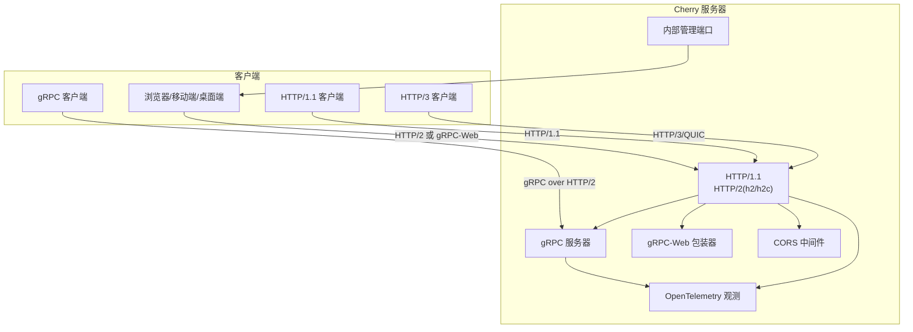
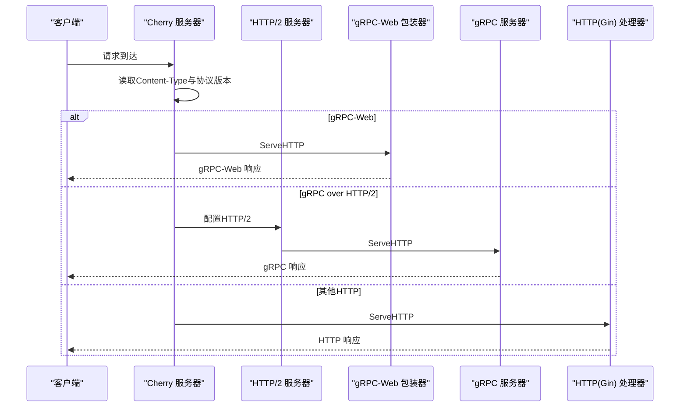
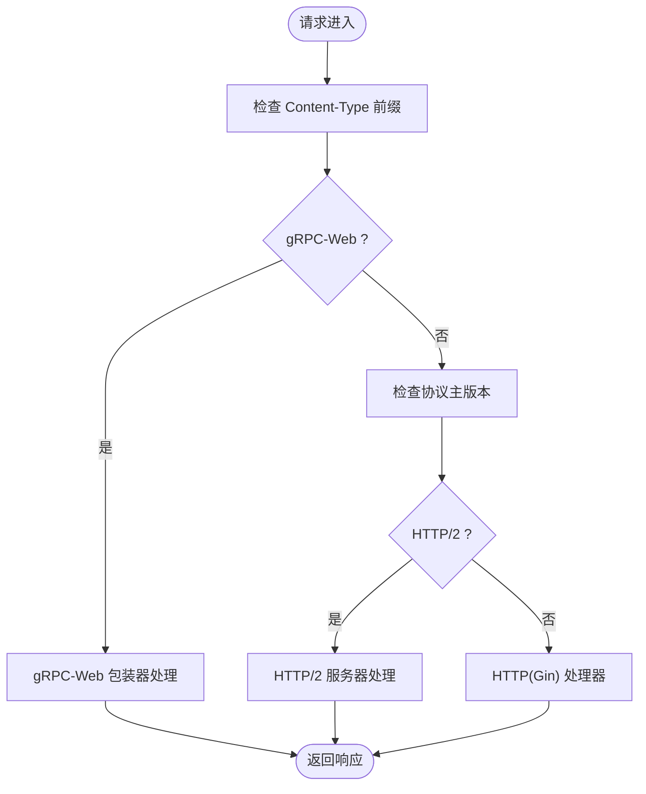
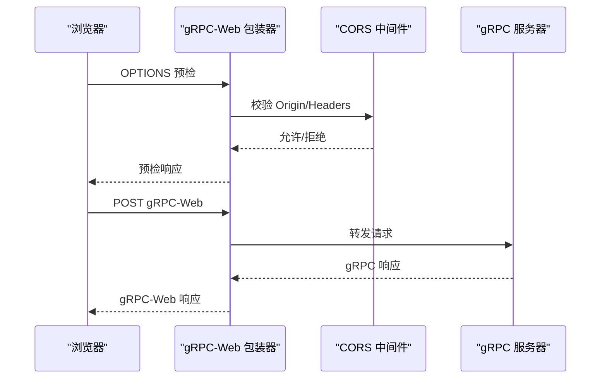
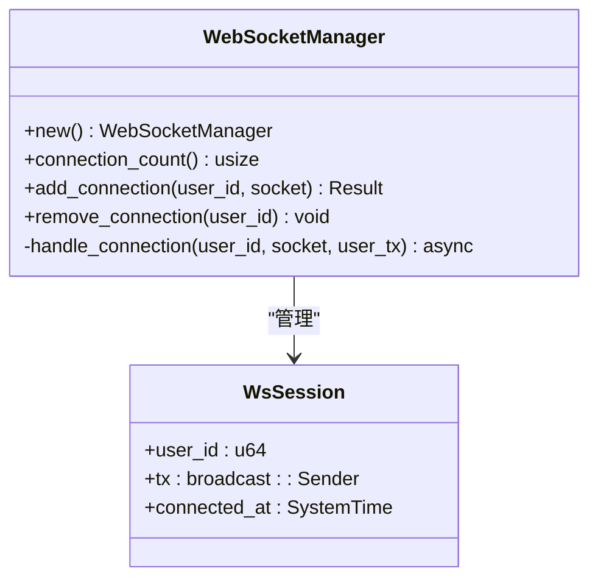
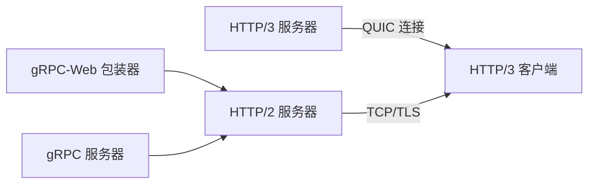
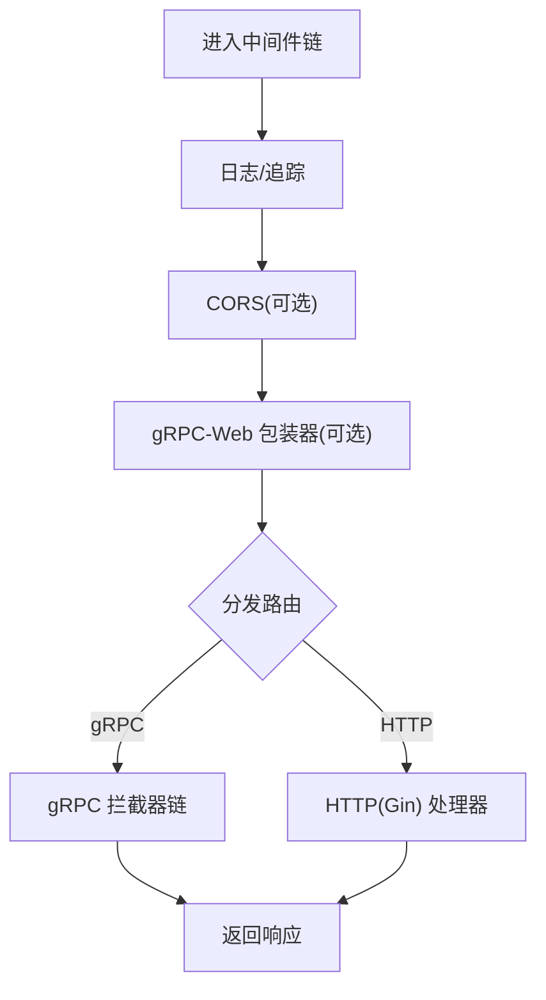
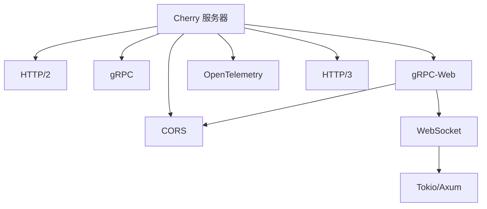

# 网络通信架构

<cite>
**本文档引用的文件**
- [server.go](file://thirdparty/cherry/server.go)
- [handler_grpc.go](file://thirdparty/cherry/handler_grpc.go)
- [handler_http.go](file://thirdparty/cherry/handler_http.go)
- [config.go](file://thirdparty/cherry/config.go)
- [options.go](file://thirdparty/cherry/options.go)
- [access_log.go](file://thirdparty/cherry/access_log.go)
- [middleware.go](file://thirdparty/gox/net/http/middleware.go)
- [grpc_web_response.go](file://thirdparty/gox/net/http/grpc/web/grpc_web_response.go)
- [wrapper.go](file://thirdparty/gox/net/http/grpc/web/wrapper.go)
- [helpers.go](file://thirdparty/gox/net/http/grpc/web/helpers.go)
- [options.go](file://thirdparty/gox/net/http/grpc/web/options.go)
- [client.go](file://thirdparty/gox/net/http/client/http3/client.go)
- [websocket_manager.rs](file://server/rust/message/src/websocket_manager.rs)
- [websocket_handler.rs](file://server/rust/message/src/websocket_handler.rs)
- [lib.rs](file://server/rust/message/src/lib.rs)
- [otel_stats.go](file://thirdparty/gox/database/sql/otel_stats.go)
- [gorm.go](file://thirdparty/initialize/dao/gormdb/gorm.go)
</cite>

## 目录
1. [简介](#简介)
2. [项目结构](#项目结构)
3. [核心组件](#核心组件)
4. [架构总览](#架构总览)
5. [详细组件分析](#详细组件分析)
6. [依赖分析](#依赖分析)
7. [性能考虑](#性能考虑)
8. [故障排查指南](#故障排查指南)
9. [结论](#结论)
10. [附录](#附录)

## 简介
本文件面向Hoper网络通信架构，系统化阐述混合协议支持（gRPC与HTTP/2）、gRPC-Web浏览器兼容、CORS跨域、WebSocket实时通信、QUIC/HTTP/3以及连接复用优化策略；并覆盖网络中间件、请求路由、响应处理的完整流程，最后给出网络性能调优、连接池管理与超时重试的最佳实践。

## 项目结构
Hoper在“cherry”子包中提供统一的网络服务框架，支持：
- HTTP/1.1、HTTP/2（含h2c明文升级）
- QUIC/HTTP/3（可选）
- gRPC与gRPC-Web（浏览器兼容）
- CORS跨域
- OpenTelemetry观测
- 中间件链式处理
- 访问日志与gRPC访问日志
- 内部管理端口（OpenAPI、调试）

图表来源
- [server.go:87-108](file://thirdparty/cherry/server.go#L87-L108)
- [server.go:116-142](file://thirdparty/cherry/server.go#L116-L142)
- [server.go:144-159](file://thirdparty/cherry/server.go#L144-L159)

章节来源
- [server.go:40-200](file://thirdparty/cherry/server.go#L40-L200)
- [config.go:43-177](file://thirdparty/cherry/config.go#L43-L177)

## 核心组件
- Cherry 服务器：统一入口，根据请求内容类型与协议版本分发至HTTP或gRPC处理链，并可选启用CORS、gRPC-Web、OpenTelemetry与HTTP/3。
- gRPC拦截器：统一的Unary/Stream拦截器链，内置参数校验、panic恢复、访问日志与状态码规范化。
- gRPC-Web包装器：将gRPC服务暴露为浏览器友好的gRPC-Web协议，支持文本与二进制格式、CORS预检、WebSocket回退。
- HTTP处理器：基于Gin的HTTP层，支持OpenTelemetry、访问日志、异常恢复与响应封装。
- WebSocket服务（Rust）：提供用户会话管理、广播与定向消息通道。
- HTTP/3客户端：基于quic-go的HTTP/3客户端实现。
- 数据库连接池与指标：基于Prometheus/OpenTelemetry的连接池可观测性。

章节来源
- [handler_grpc.go:30-58](file://thirdparty/cherry/handler_grpc.go#L30-L58)
- [handler_grpc.go:64-106](file://thirdparty/cherry/handler_grpc.go#L64-L106)
- [handler_grpc.go:109-142](file://thirdparty/cherry/handler_grpc.go#L109-L142)
- [handler_http.go:36-83](file://thirdparty/cherry/handler_http.go#L36-L83)
- [wrapper.go:31-106](file://thirdparty/gox/net/http/grpc/web/wrapper.go#L31-L106)
- [grpc_web_response.go:18-59](file://thirdparty/gox/net/http/grpc/web/grpc_web_response.go#L18-L59)
- [websocket_manager.rs:24-96](file://server/rust/message/src/websocket_manager.rs#L24-L96)
- [websocket_handler.rs:46-78](file://server/rust/message/src/websocket_handler.rs#L46-L78)
- [client.go:15-19](file://thirdparty/gox/net/http/client/http3/client.go#L15-L19)
- [otel_stats.go:16-99](file://thirdparty/gox/database/sql/otel_stats.go#L16-L99)
- [gorm.go:137-157](file://thirdparty/initialize/dao/gormdb/gorm.go#L137-L157)

## 架构总览
Cherry服务器在启动时：
- 初始化HTTP/2配置（含写调度器、头表大小、帧大小、空闲超时等）
- 若启用TLS，则配置HTTP/2；否则启用h2c明文升级
- 可选启用HTTP/3监听（QUIC/HTTP3）
- 统一路由：根据Content-Type与协议版本分发到gRPC或HTTP处理链
- 可选启用gRPC-Web包装器与CORS
- 可选启用OpenTelemetry观测

图表来源
- [server.go:87-108](file://thirdparty/cherry/server.go#L87-L108)
- [server.go:116-142](file://thirdparty/cherry/server.go#L116-L142)
- [wrapper.go:67-106](file://thirdparty/gox/net/http/grpc/web/wrapper.go#L67-L106)

章节来源
- [server.go:116-142](file://thirdparty/cherry/server.go#L116-L142)
- [server.go:144-159](file://thirdparty/cherry/server.go#L144-L159)

## 详细组件分析

### gRPC 与 HTTP/2 混合协议支持
- 协议识别：通过Content-Type前缀与协议主版本号区分gRPC、gRPC-Web与普通HTTP。
- HTTP/2配置：支持写调度器、并发流限制、头表大小、帧大小、空闲超时、Ping超时、写字节超时、连接/流接收缓冲上限等。
- h2c明文升级：未启用TLS时自动启用h2c。
- TLS：可配置证书与密钥，启用HTTP/2安全模式。

图表来源
- [server.go:87-108](file://thirdparty/cherry/server.go#L87-L108)
- [server.go:116-142](file://thirdparty/cherry/server.go#L116-L142)

章节来源
- [server.go:87-108](file://thirdparty/cherry/server.go#L87-L108)
- [server.go:116-142](file://thirdparty/cherry/server.go#L116-L142)

### gRPC-Web 浏览器兼容与 CORS
- 内容类型：支持application/grpc-web与application/grpc-web-text两种格式。
- CORS：可配置允许源、方法、头、凭据与预检缓存时长；gRPC-Web包装器内部集成CORS中间件。
- 预检控制：可通过选项限制仅对已注册端点放行OPTIONS请求。
- WebSocket回退：可启用WebSocket作为gRPC-Web的回退通道，支持Origin校验。

图表来源
- [wrapper.go:67-106](file://thirdparty/gox/net/http/grpc/web/wrapper.go#L67-L106)
- [wrapper.go:31-106](file://thirdparty/gox/net/http/grpc/web/wrapper.go#L31-L106)
- [grpc_web_response.go:18-59](file://thirdparty/gox/net/http/grpc/web/grpc_web_response.go#L18-L59)
- [helpers.go:32-41](file://thirdparty/gox/net/http/grpc/web/helpers.go#L32-L41)

章节来源
- [wrapper.go:31-106](file://thirdparty/gox/net/http/grpc/web/wrapper.go#L31-L106)
- [grpc_web_response.go:18-59](file://thirdparty/gox/net/http/grpc/web/grpc_web_response.go#L18-L59)
- [helpers.go:32-41](file://thirdparty/gox/net/http/grpc/web/helpers.go#L32-L41)
- [options.go:41-69](file://thirdparty/gox/net/http/grpc/web/options.go#L41-L69)

### WebSocket 实时通信机制
- Rust侧WebSocket管理器：维护全局广播通道与用户会话映射，支持添加/移除连接、统计连接数。
- 连接处理：每个用户建立独立广播通道，处理消息收发与错误。
- 在线查询：提供在线用户列表接口。

图表来源
- [websocket_manager.rs:24-96](file://server/rust/message/src/websocket_manager.rs#L24-L96)
- [websocket_handler.rs:46-78](file://server/rust/message/src/websocket_handler.rs#L46-L78)
- [lib.rs:1-7](file://server/rust/message/src/lib.rs#L1-L7)

章节来源
- [websocket_manager.rs:24-96](file://server/rust/message/src/websocket_manager.rs#L24-L96)
- [websocket_handler.rs:46-78](file://server/rust/message/src/websocket_handler.rs#L46-L78)
- [lib.rs:1-7](file://server/rust/message/src/lib.rs#L1-L7)

### QUIC/HTTP/3 与连接复用优化
- HTTP/3监听：可独立监听，支持证书配置；与HTTP/2并行运行。
- HTTP/3客户端：基于quic-go的HTTP/3传输层客户端。
- 连接复用：HTTP/3基于QUIC提供更强的连接复用能力，减少握手开销与队头阻塞。

图表来源
- [server.go:144-159](file://thirdparty/cherry/server.go#L144-L159)
- [client.go:15-19](file://thirdparty/gox/net/http/client/http3/client.go#L15-L19)

章节来源
- [server.go:144-159](file://thirdparty/cherry/server.go#L144-L159)
- [client.go:15-19](file://thirdparty/gox/net/http/client/http3/client.go#L15-L19)

### 网络中间件、请求路由与响应处理
- 中间件链：支持链式组合中间件，统一处理请求上下文、日志、追踪等。
- 路由分发：根据Content-Type与协议版本将请求分派到gRPC或HTTP处理链。
- 响应封装：HTTP层对异常进行捕获与统一响应封装；gRPC层对panic进行恢复并标准化状态码。

图表来源
- [middleware.go:15-23](file://thirdparty/gox/net/http/middleware.go#L15-L23)
- [server.go:87-108](file://thirdparty/cherry/server.go#L87-L108)
- [handler_grpc.go:64-106](file://thirdparty/cherry/handler_grpc.go#L64-L106)
- [handler_http.go:36-83](file://thirdparty/cherry/handler_http.go#L36-L83)

章节来源
- [middleware.go:15-23](file://thirdparty/gox/net/http/middleware.go#L15-L23)
- [server.go:87-108](file://thirdparty/cherry/server.go#L87-L108)
- [handler_grpc.go:64-106](file://thirdparty/cherry/handler_grpc.go#L64-L106)
- [handler_http.go:36-83](file://thirdparty/cherry/handler_http.go#L36-L83)

## 依赖分析
- Cherry服务器依赖：
  - HTTP/2与h2c：用于HTTP/2与明文升级
  - gRPC：用于gRPC服务
  - gRPC-Web：用于浏览器兼容
  - CORS：用于跨域
  - OpenTelemetry：用于HTTP与gRPC观测
  - QUIC/HTTP/3：用于HTTP/3
- gRPC-Web包装器依赖：
  - gorilla/websocket：用于WebSocket回退
  - rs/cors：用于CORS
- WebSocket服务依赖：
  - tokio、axum、futures-util：用于异步WebSocket处理
  - tokio_util：用于字节处理

图表来源
- [server.go:19-28](file://thirdparty/cherry/server.go#L19-L28)
- [wrapper.go:6-18](file://thirdparty/gox/net/http/grpc/web/wrapper.go#L6-L18)
- [websocket_manager.rs:4-11](file://server/rust/message/src/websocket_manager.rs#L4-L11)

章节来源
- [server.go:19-28](file://thirdparty/cherry/server.go#L19-L28)
- [wrapper.go:6-18](file://thirdparty/gox/net/http/grpc/web/wrapper.go#L6-L18)
- [websocket_manager.rs:4-11](file://server/rust/message/src/websocket_manager.rs#L4-L11)

## 性能考虑
- HTTP/2优化
  - 并发流限制：根据业务吞吐与资源情况调整最大并发流数量。
  - 头表大小：合理设置解码/编码头表大小，平衡内存与压缩效率。
  - 帧大小与空闲超时：根据网络环境调整最大读取帧大小与空闲超时，降低延迟。
  - 写调度器：自定义WriteScheduler以优化高并发场景下的写入顺序。
- HTTP/3优化
  - QUIC连接复用：利用HTTP/3的连接迁移与多路复用特性，减少握手与队头阻塞。
  - 证书与ALPN：确保正确配置证书与ALPN，避免降级到HTTP/2。
- gRPC-Web优化
  - 文本与二进制格式：在浏览器端按需选择text或binary格式，权衡可读性与体积。
  - WebSocket回退：在网络受限或代理不支持HTTP/2时启用WebSocket回退。
- 连接池与数据库
  - 最大空闲/打开连接数、连接生命周期与空闲时间：结合业务峰值与慢查询进行调优。
  - OpenTelemetry指标：监控连接池等待次数、等待时长、空闲连接数等关键指标。
- 中间件与日志
  - 控制访问日志字段与级别，避免在高并发下产生过多I/O。
  - 使用OpenTelemetry进行端到端追踪，定位瓶颈。

章节来源
- [config.go:64-86](file://thirdparty/cherry/config.go#L64-L86)
- [server.go:116-132](file://thirdparty/cherry/server.go#L116-L132)
- [otel_stats.go:16-99](file://thirdparty/gox/database/sql/otel_stats.go#L16-L99)
- [gorm.go:137-157](file://thirdparty/initialize/dao/gormdb/gorm.go#L137-L157)

## 故障排查指南
- gRPC-Web跨域问题
  - 检查CORS配置的允许源、方法、头与凭据设置。
  - 确认预检请求是否仅对已注册端点放行。
- gRPC panic与状态码
  - 拦截器会将panic转换为内部错误状态码；检查日志定位具体错误。
  - 参数校验失败将返回无效参数状态码。
- HTTP异常恢复
  - HTTP处理器对panic进行捕获并返回统一错误响应；检查响应头中的错误码字段。
- WebSocket连接
  - 检查用户是否重复连接、连接是否被移除、广播通道是否正常工作。
- HTTP/3连接
  - 确认证书配置与ALPN；观察是否成功降级到HTTP/2。

章节来源
- [options.go:41-69](file://thirdparty/gox/net/http/grpc/web/options.go#L41-L69)
- [handler_grpc.go:64-106](file://thirdparty/cherry/handler_grpc.go#L64-L106)
- [handler_grpc.go:109-142](file://thirdparty/cherry/handler_grpc.go#L109-L142)
- [handler_http.go:36-83](file://thirdparty/cherry/handler_http.go#L36-L83)
- [websocket_manager.rs:50-96](file://server/rust/message/src/websocket_manager.rs#L50-L96)

## 结论
Hoper通过Cherry统一网络框架，实现了gRPC与HTTP/2的无缝融合，并提供gRPC-Web浏览器兼容、CORS、WebSocket回退、HTTP/3与QUIC等现代协议支持。配合OpenTelemetry与连接池可观测性，可在生产环境中实现高性能、可观测、易运维的网络通信体系。

## 附录
- 配置要点
  - HTTP/2：并发流、头表、帧大小、空闲/Ping/写字节超时、缓冲上限
  - gRPC-Web：启用开关、CORS策略、WebSocket回退
  - HTTP/3：独立监听、证书配置
  - 访问日志：排除/包含前缀、记录函数
  - OpenTelemetry：HTTP与gRPC观测选项
- 最佳实践
  - 生产环境建议启用TLS与HTTP/2/3
  - 合理设置gRPC-Web与WebSocket回退策略
  - 结合数据库连接池指标进行容量规划
  - 使用OpenTelemetry追踪端到端性能