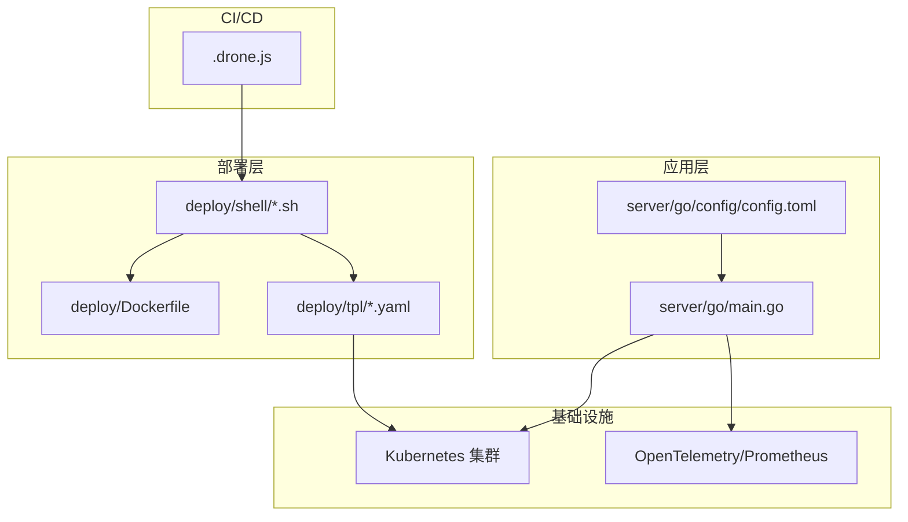
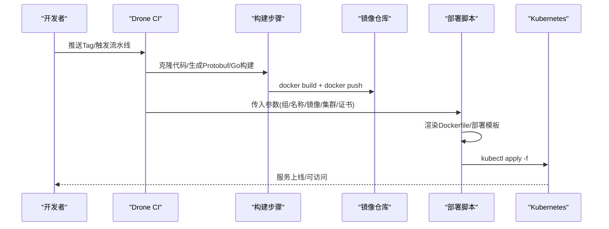
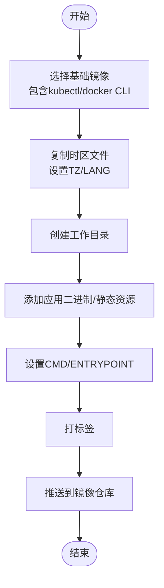
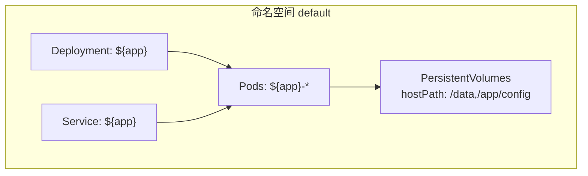
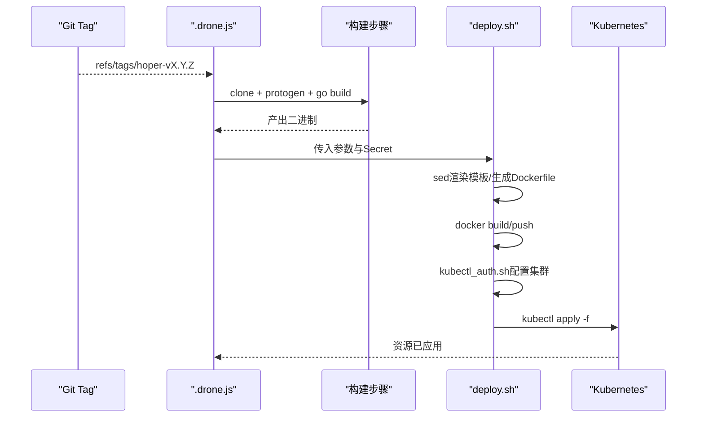
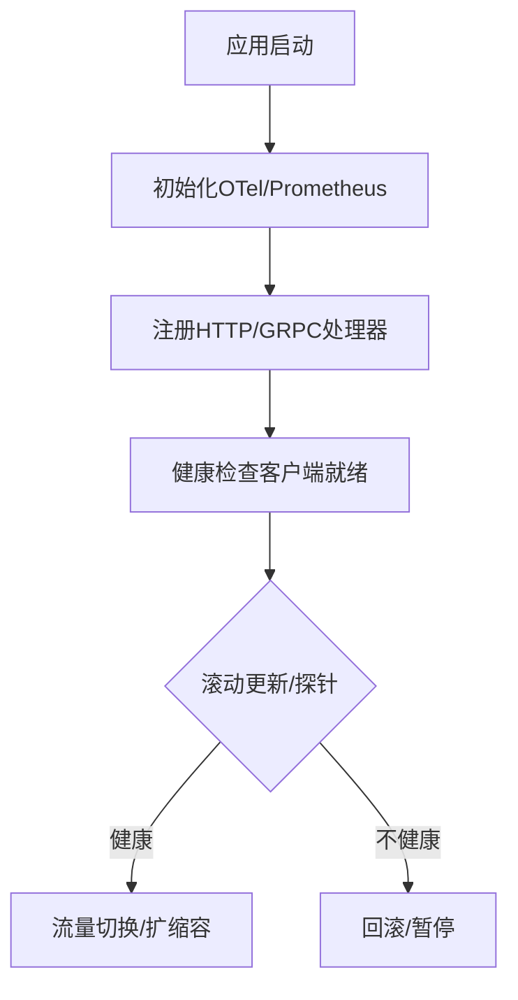
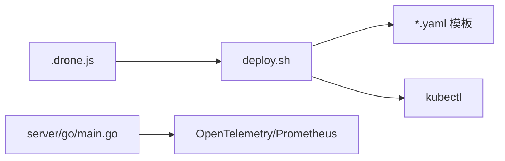

# 部署架构设计

<cite>
**本文引用的文件**
- [Dockerfile](file://deploy/Dockerfile)
- [deploy-deployment.yaml](file://deploy/tpl/deploy-deployment.yaml)
- [deploy-service.yaml](file://deploy/tpl/deploy-service.yaml)
- [deploy-cronjob.yaml](file://deploy/tpl/deploy-cronjob.yaml)
- [deploy-job.yaml](file://deploy/tpl/deploy-job.yaml)
- [deploy.sh](file://deploy/shell/drone/deploy.sh)
- [kubectl_auth.sh](file://deploy/shell/kubectl_auth.sh)
- [build.md](file://deploy/shell/build.md)
- [dockerfile.sh](file://deploy/shell/dockerfile.sh)
- [build.sh](file://server/go/build.sh)
- [.drone.js](file://.drone.js)
- [main.go](file://server/go/main.go)
- [config.toml](file://server/go/config/config.toml)
- [health.go](file://thirdparty/gox/net/http/grpc/web/health.go)
</cite>

## 目录
1. [引言](#引言)
2. [项目结构](#项目结构)
3. [核心组件](#核心组件)
4. [架构总览](#架构总览)
5. [详细组件分析](#详细组件分析)
6. [依赖分析](#依赖分析)
7. [性能考虑](#性能考虑)
8. [故障排查指南](#故障排查指南)
9. [结论](#结论)
10. [附录](#附录)

## 引言
本文件面向Hoper项目的部署架构，提供从容器化到Kubernetes编排、从CI/CD流水线到可观测性的完整部署策略文档。内容覆盖：
- 容器化与镜像构建：含多阶段思路、时区与运行时准备、镜像最小化与安全基线
- Kubernetes编排：Deployment/Service/CronJob/Job模板与参数化
- CI/CD流水线：基于Drone的自动化构建、镜像推送与K8s应用
- 服务网格与负载均衡：通过Service与Ingress实现流量接入与转发
- 健康检查与灰度发布：基于滚动更新与探针的平滑发布
- 高可用与灾备：副本数、持久化、备份与回滚策略
- 性能监控与日志：OpenTelemetry与Prometheus埋点、日志采集与告警

## 项目结构
围绕部署相关的目录与文件组织如下：
- deploy/Dockerfile：基础镜像与工具链准备（kubectl、docker CLI、时区）
- deploy/tpl：Kubernetes资源模板（Deployment/Service/CronJob/Job）
- deploy/shell：部署脚本与辅助工具（Drone部署、kubectl认证、Dockerfile生成）
- server/go：Go后端服务入口与配置
- .drone.js：Drone CI流水线定义
- thirdparty/gox：健康检查等基础设施能力

图表来源
- [Dockerfile:1-25](file://deploy/Dockerfile#L1-L25)
- [deploy-deployment.yaml:1-51](file://deploy/tpl/deploy-deployment.yaml#L1-L51)
- [deploy-service.yaml:1-16](file://deploy/tpl/deploy-service.yaml#L1-L16)
- [deploy-cronjob.yaml:1-44](file://deploy/tpl/deploy-cronjob.yaml#L1-L44)
- [deploy-job.yaml:1-40](file://deploy/tpl/deploy-job.yaml#L1-L40)
- [deploy.sh:1-170](file://deploy/shell/drone/deploy.sh#L1-L170)
- [kubectl_auth.sh:1-15](file://deploy/shell/kubectl_auth.sh#L1-L15)
- [main.go:1-69](file://server/go/main.go#L1-L69)
- [config.toml:1-41](file://server/go/config/config.toml#L1-L41)
- [.drone.js:1-193](file://.drone.js#L1-L193)

章节来源
- [Dockerfile:1-25](file://deploy/Dockerfile#L1-L25)
- [deploy-deployment.yaml:1-51](file://deploy/tpl/deploy-deployment.yaml#L1-L51)
- [deploy-service.yaml:1-16](file://deploy/tpl/deploy-service.yaml#L1-L16)
- [deploy-cronjob.yaml:1-44](file://deploy/tpl/deploy-cronjob.yaml#L1-L44)
- [deploy-job.yaml:1-40](file://deploy/tpl/deploy-job.yaml#L1-L40)
- [deploy.sh:1-170](file://deploy/shell/drone/deploy.sh#L1-L170)
- [kubectl_auth.sh:1-15](file://deploy/shell/kubectl_auth.sh#L1-L15)
- [main.go:1-69](file://server/go/main.go#L1-L69)
- [config.toml:1-41](file://server/go/config/config.toml#L1-L41)
- [.drone.js:1-193](file://.drone.js#L1-L193)

## 核心组件
- 容器镜像构建
  - 基础镜像包含kubectl与docker CLI，便于在容器内执行K8s部署与镜像管理
  - 通过ARG/TZ与时区镜像复制，确保容器内时间与主机一致
  - 提供模板化Dockerfile生成脚本，支持按应用与命令参数定制
- Kubernetes资源模板
  - Deployment：滚动更新、副本数、资源请求/限制、hostPath挂载
  - Service：ClusterIP、端口映射、标签选择器
  - CronJob/Job：定时任务与一次性任务，支持挂载配置与数据卷
- CI/CD流水线
  - Drone流水线：克隆代码、生成Protobuf、Go构建、打包镜像、推送、应用K8s资源
  - 部署脚本：参数化渲染模板、镜像tag策略、kubectl认证与应用
- 健康检查与可观测性
  - 服务启动时初始化OpenTelemetry与Prometheus
  - 提供gRPC健康检查客户端能力，用于连接后端健康状态监测

章节来源
- [Dockerfile:1-25](file://deploy/Dockerfile#L1-L25)
- [deploy-deployment.yaml:1-51](file://deploy/tpl/deploy-deployment.yaml#L1-L51)
- [deploy-service.yaml:1-16](file://deploy/tpl/deploy-service.yaml#L1-L16)
- [deploy-cronjob.yaml:1-44](file://deploy/tpl/deploy-cronjob.yaml#L1-L44)
- [deploy-job.yaml:1-40](file://deploy/tpl/deploy-job.yaml#L1-L40)
- [deploy.sh:1-170](file://deploy/shell/drone/deploy.sh#L1-L170)
- [main.go:1-69](file://server/go/main.go#L1-L69)
- [config.toml:1-41](file://server/go/config/config.toml#L1-L41)
- [health.go:1-65](file://thirdparty/gox/net/http/grpc/web/health.go#L1-L65)

## 架构总览
下图展示从代码到Kubernetes集群的端到端部署流程，包括Drone触发、镜像构建与推送、K8s资源应用。

图表来源
- [.drone.js:31-188](file://.drone.js#L31-L188)
- [deploy.sh:77-127](file://deploy/shell/drone/deploy.sh#L77-L127)
- [Dockerfile:1-25](file://deploy/Dockerfile#L1-L25)
- [deploy-deployment.yaml:1-51](file://deploy/tpl/deploy-deployment.yaml#L1-L51)

## 详细组件分析

### 容器化与镜像构建
- 多阶段思路
  - 当前镜像以工具链为主（kubectl、docker CLI），适合在容器内执行部署
  - 若需进一步减小镜像体积，建议将Go应用二进制与前端产物单独构建，再复制到精简运行时镜像
- 时区与本地化
  - 通过时区镜像复制与软链接设置，保证容器内时区与目标环境一致
- 模板化Dockerfile
  - 提供脚本根据应用名与命令生成Dockerfile，便于复用与标准化

图表来源
- [Dockerfile:1-25](file://deploy/Dockerfile#L1-L25)
- [dockerfile.sh:1-29](file://deploy/shell/dockerfile.sh#L1-L29)

章节来源
- [Dockerfile:1-25](file://deploy/Dockerfile#L1-L25)
- [dockerfile.sh:1-29](file://deploy/shell/dockerfile.sh#L1-L29)

### Kubernetes编排策略
- Deployment
  - 滚动更新：maxSurge/maxUnavailable控制变更节奏
  - 资源配额：requests/limits限定CPU与内存
  - 卷挂载：hostPath挂载配置与数据目录，便于持久化与配置热更新
- Service
  - ClusterIP暴露服务，端口映射至容器端口
  - 标签选择器与Deployment一致，确保流量正确路由
- CronJob/Job
  - 支持定时任务与一次性任务，挂载配置、数据与静态资源卷
  - 重启策略OnFailure，适配批处理场景

图表来源
- [deploy-deployment.yaml:1-51](file://deploy/tpl/deploy-deployment.yaml#L1-L51)
- [deploy-service.yaml:1-16](file://deploy/tpl/deploy-service.yaml#L1-L16)
- [deploy-cronjob.yaml:1-44](file://deploy/tpl/deploy-cronjob.yaml#L1-L44)
- [deploy-job.yaml:1-40](file://deploy/tpl/deploy-job.yaml#L1-L40)

章节来源
- [deploy-deployment.yaml:1-51](file://deploy/tpl/deploy-deployment.yaml#L1-L51)
- [deploy-service.yaml:1-16](file://deploy/tpl/deploy-service.yaml#L1-L16)
- [deploy-cronjob.yaml:1-44](file://deploy/tpl/deploy-cronjob.yaml#L1-L44)
- [deploy-job.yaml:1-40](file://deploy/tpl/deploy-job.yaml#L1-L40)

### CI/CD流水线设计（Drone）
- 触发条件
  - 基于Git Tag匹配规则，仅对特定模式的Tag触发
- 步骤拆分
  - 克隆与构建：生成Protobuf、Go编译、产出二进制
  - 部署：渲染Dockerfile与K8s模板、登录镜像仓库、推送、应用K8s资源
- 参数化
  - 组/名称/镜像/部署类型/构建类型/集群/证书等均通过插件参数传入
- 安全与证书
  - 通过Secret注入CA证书、客户端证书与密钥，自动写入本地并配置kubectl

图表来源
- [.drone.js:31-188](file://.drone.js#L31-L188)
- [deploy.sh:77-127](file://deploy/shell/drone/deploy.sh#L77-L127)
- [kubectl_auth.sh:1-15](file://deploy/shell/kubectl_auth.sh#L1-L15)

章节来源
- [.drone.js:31-188](file://.drone.js#L31-L188)
- [deploy.sh:1-170](file://deploy/shell/drone/deploy.sh#L1-L170)
- [kubectl_auth.sh:1-15](file://deploy/shell/kubectl_auth.sh#L1-L15)

### 健康检查与灰度发布
- 健康检查
  - 服务启动时初始化OpenTelemetry与Prometheus指标
  - 提供gRPC健康检查客户端能力，可用于外部探针或服务网格健康探测
- 灰度发布
  - 基于Deployment滚动更新策略与探针，结合Ingress/Service进行流量切换
  - 建议配合HPA与金丝雀发布策略，逐步扩大流量比例

图表来源
- [main.go:34-54](file://server/go/main.go#L34-L54)
- [health.go:1-65](file://thirdparty/gox/net/http/grpc/web/health.go#L1-L65)

章节来源
- [main.go:1-69](file://server/go/main.go#L1-L69)
- [health.go:1-65](file://thirdparty/gox/net/http/grpc/web/health.go#L1-L65)

### 服务网格与负载均衡
- Service作为K8s内部负载均衡入口，ClusterIP暴露端口
- 结合Ingress实现外部流量接入（建议在生产环境启用TLS与WAF）
- 建议在服务网格中启用mTLS、限流与熔断，配合探针与HPA实现弹性伸缩

[本节为概念性说明，无需文件来源]

### 高可用与灾难恢复
- 副本与拓扑
  - Deployment副本数≥2，跨节点分布，避免单点故障
- 存储与备份
  - hostPath持久化配置与数据目录；建议迁移到PV/PVC并配合快照策略
- 回滚与蓝绿
  - 使用滚动更新的回滚能力；结合Ingress切换实现蓝绿发布
- 监控与告警
  - Prometheus抓取指标，结合告警规则与通知渠道

[本节为概念性说明，无需文件来源]

## 依赖分析
- 组件耦合
  - Drone流水线依赖部署脚本与模板；部署脚本依赖kubectl认证与K8s集群
  - 应用服务依赖OpenTelemetry/Prometheus进行可观测性
- 外部依赖
  - 镜像仓库、K8s集群、证书Secret

图表来源
- [.drone.js:31-188](file://.drone.js#L31-L188)
- [deploy.sh:1-170](file://deploy/shell/drone/deploy.sh#L1-L170)
- [main.go:1-69](file://server/go/main.go#L1-L69)

章节来源
- [.drone.js:31-188](file://.drone.js#L31-L188)
- [deploy.sh:1-170](file://deploy/shell/drone/deploy.sh#L1-L170)
- [main.go:1-69](file://server/go/main.go#L1-L69)

## 性能考虑
- 镜像体积与启动时间
  - 减少镜像层数，合并RUN指令；使用多阶段构建输出精简运行时镜像
- 资源配额
  - 合理设置requests/limits，避免资源争抢；结合HPA实现弹性
- 网络与I/O
  - 使用PVC替代hostPath，提升存储可靠性与性能；开启连接池与超时重试
- 指标与追踪
  - 保留OpenTelemetry与Prometheus配置，持续优化关键路径指标

[本节为通用指导，无需文件来源]

## 故障排查指南
- 镜像构建失败
  - 检查Dockerfile模板渲染与参数传入；确认GOPROXY与网络可达
- 部署应用失败
  - 查看kubectl认证脚本生成的证书与集群配置；核对模板变量替换
- Pod无法就绪
  - 检查探针与健康检查逻辑；确认资源配额与节点资源
- CI流水线中断
  - 查看Drone日志与Secret注入情况；确认Tag匹配规则

章节来源
- [deploy.sh:77-127](file://deploy/shell/drone/deploy.sh#L77-L127)
- [kubectl_auth.sh:1-15](file://deploy/shell/kubectl_auth.sh#L1-L15)
- [.drone.js:116-132](file://.drone.js#L116-L132)

## 结论
本部署策略以Drone为核心，结合模板化的K8s资源与容器镜像，形成可复用、可追溯的自动化交付体系。通过滚动更新、健康检查与HPA，实现平滑发布与弹性伸缩；配合OpenTelemetry与Prometheus，构建完善的可观测性闭环。建议在生产环境中补充Ingress/TLS、服务网格与备份策略，进一步提升安全性与可靠性。

[本节为总结性内容，无需文件来源]

## 附录
- 快速参考
  - 构建与推送：在构建步骤完成后执行镜像构建与推送
  - 应用部署：通过部署脚本渲染模板并应用K8s资源
  - 配置管理：通过ConfigMap/Secret管理配置与证书
  - 日志与监控：确保OTel与Prometheus配置生效，采集关键指标

[本节为通用指导，无需文件来源]