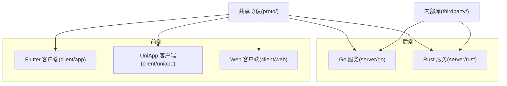
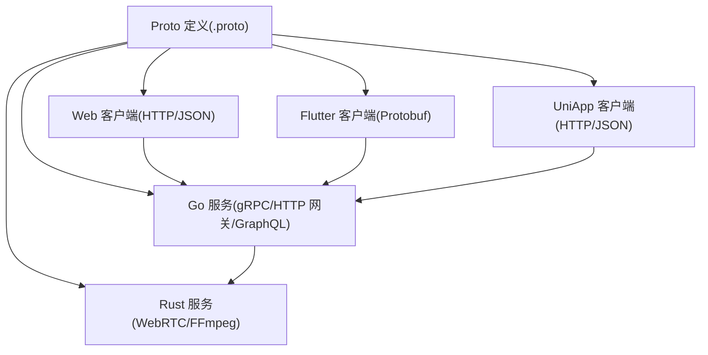
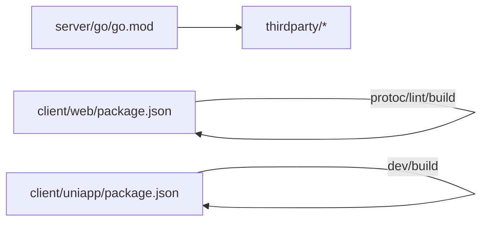

# 贡献指南

<cite>
**本文引用的文件**
- [README.md](file://README.md)
- [CLAUDE.md](file://CLAUDE.md)
- [git提交规范.md](file://awesome/note/git提交规范.md)
- [go.mod](file://server/go/go.mod)
- [package.json（Web 前端）](file://client/web/package.json)
- [.eslintrc.js（Web 前端）](file://client/web/.eslintrc.js)
- [tsconfig.json（Web 前端）](file://client/web/tsconfig.json)
- [package.json（UniApp 前端）](file://client/uniapp/package.json)
- [.eslintrc.cjs（UniApp 前端）](file://client/uniapp/.eslintrc.cjs)
- [tsconfig.json（UniApp 前端）](file://client/uniapp/tsconfig.json)
- [awesome/README.md](file://awesome/README.md)
</cite>

## 目录
1. [简介](#简介)
2. [项目结构](#项目结构)
3. [核心组件](#核心组件)
4. [架构总览](#架构总览)
5. [详细组件分析](#详细组件分析)
6. [依赖分析](#依赖分析)
7. [性能考虑](#性能考虑)
8. [故障排查指南](#故障排查指南)
9. [结论](#结论)
10. [附录](#附录)

## 简介
本贡献指南面向希望参与 Hoper 项目的开发者，覆盖从环境搭建、代码规范、分支与 PR 流程、代码审查、测试与提交规范，到问题报告与功能请求模板、社区行为准则与沟通渠道，以及常见贡献场景的最佳实践。项目采用多语言后端（Go/Rust）、多前端形态（Flutter/UniApp/Web），并通过共享的 proto 定义统一跨端通信协议。

## 项目结构
- 后端服务位于 server/go 与 server/rust，分别承担主业务与视频/消息等专用模块。
- 前端包含 Flutter 客户端、UniApp 小程序/多端与 Web（Vue3+Vite+TS+WASM）。
- 共享协议定义在 proto/，通过 protogen 工具生成各语言客户端和服务端代码。
- 第三方内部库位于 thirdparty/，通过 go.mod 的 replace 指向本地子模块，便于统一开发与联调。
- 开发与部署相关脚本与模板位于 awesome/ 与 deploy/。

图表来源
- [README.md: 42-62:42-62](file://README.md#L42-L62)
- [CLAUDE.md: 47-103:47-103](file://CLAUDE.md#L47-L103)

章节来源
- [README.md: 10-62:10-62](file://README.md#L10-L62)
- [CLAUDE.md: 47-103:47-103](file://CLAUDE.md#L47-L103)

## 核心组件
- 协议与生成
  - 使用 proto 定义服务契约，通过 protogen 生成多语言代码；Go 后端同时启用 OpenAPI、HTTP 网关与校验扩展。
- 后端框架与可观测性
  - Go 后端基于 cherry 框架（gRPC + HTTP 网关 + GraphQL），ORM 使用 GORM，可观测性采用 OpenTelemetry + Prometheus，配置为 TOML。
- 前端生态
  - Web：Vue3 + Vite + TypeScript + WASM；支持单元测试、类型检查与 ESLint/Prettier。
  - UniApp：多端构建（H5/小程序/App），统一 TypeScript 生态与 Lint 规则。
- 内部库与替换
  - thirdparty 下的子模块通过 go.mod replace 指向本地路径，便于本地联调与快速迭代。

章节来源
- [CLAUDE.md: 47-103:47-103](file://CLAUDE.md#L47-L103)
- [go.mod: 183-191:183-191](file://server/go/go.mod#L183-L191)
- [package.json（Web 前端）: 12-24:12-24](file://client/web/package.json#L12-L24)
- [.eslintrc.js（Web 前端）: 8-13:8-13](file://client/web/.eslintrc.js#L8-L13)
- [tsconfig.json（Web 前端）: 1-12:1-12](file://client/web/tsconfig.json#L1-L12)
- [package.json（UniApp 前端）: 18-62:18-62](file://client/uniapp/package.json#L18-L62)
- [.eslintrc.cjs（UniApp 前端）: 7-19:7-19](file://client/uniapp/.eslintrc.cjs#L7-L19)
- [tsconfig.json（UniApp 前端）: 2-32:2-32](file://client/uniapp/tsconfig.json#L2-L32)

## 架构总览
Hoper 采用“协议驱动 + 多端实现”的架构：proto 定义服务契约，服务端通过 gRPC 提供主接口，HTTP 网关与 GraphQL 作为补充；客户端通过 HTTP/JSON 或 gRPC/Protobuf 与服务端交互，Flutter 与 Web 通过各自语言栈对接。

图表来源
- [CLAUDE.md: 94-99:94-99](file://CLAUDE.md#L94-L99)
- [README.md: 42-44:42-44](file://README.md#L42-L44)

章节来源
- [CLAUDE.md: 94-99:94-99](file://CLAUDE.md#L94-L99)
- [README.md: 42-44:42-44](file://README.md#L42-L44)

## 详细组件分析

### 开发环境搭建
- 子模块初始化
  - 使用 git 子模块递归初始化，确保 thirdparty 内部库可用。
- Go 后端
  - 安装 protoc 并执行 protogen 生成代码；运行服务与测试；支持 Docker 构建与推送。
- Rust 后端
  - 在 rfv 与 message 目录分别构建 release。
- 前端
  - Web：Node >= 22，pnpm >= 10；支持 dev/build/test/lint 等常用脚本。
  - UniApp：Node >= 18，pnpm >= 9；支持多端 dev/build 与小程序平台构建。

章节来源
- [README.md: 12-20:12-20](file://README.md#L12-L20)
- [CLAUDE.md: 16-22:16-22](file://CLAUDE.md#L16-L22)
- [CLAUDE.md: 24-45:24-45](file://CLAUDE.md#L24-L45)
- [CLAUDE.md: 49-58:49-58](file://CLAUDE.md#L49-L58)
- [CLAUDE.md: 62-84:62-84](file://CLAUDE.md#L62-L84)
- [CLAUDE.md: 64-74:64-74](file://CLAUDE.md#L64-L74)
- [CLAUDE.md: 76-84:76-84](file://CLAUDE.md#L76-L84)

### 分支管理与 Pull Request 流程
- Fork 与上游同步
  - Fork 仓库后，建议将上游仓库添加为远程并定期同步主分支，保持本地分支与上游一致。
- 分支策略
  - 主分支用于稳定发布；功能开发在特性分支进行；修复紧急问题使用 hotfix 分支。
- 提交与 PR
  - 使用约定式提交（见“提交规范”），PR 描述需清晰说明变更动机、范围与测试要点。
  - PR 需通过 CI 检查与代码审查，至少一名维护者批准后方可合并。

章节来源
- [git提交规范.md: 1-76:1-76](file://awesome/note/git提交规范.md#L1-L76)

### 代码规范与命名约定
- Go 后端
  - 使用 cherry 框架与 GORM；遵循模块化组织（api/data/service/model/global）。
  - 配置采用 TOML，支持本地覆盖。
- 前端（Web）
  - ESLint + Prettier；禁用 console/debugger 在生产环境；TypeScript 严格模式。
- 前端（UniApp）
  - ESLint + Prettier + Stylelint；遵循 standard 与 prettier 规则；路径别名与类型声明明确。

章节来源
- [CLAUDE.md: 47-48:47-48](file://CLAUDE.md#L47-L48)
- [go.mod: 183-191:183-191](file://server/go/go.mod#L183-L191)
- [.eslintrc.js（Web 前端）: 8-13:8-13](file://client/web/.eslintrc.js#L8-L13)
- [.eslintrc.js（Web 前端）: 17-27:17-27](file://client/web/.eslintrc.js#L17-L27)
- [.eslintrc.cjs（UniApp 前端）: 7-19:7-19](file://client/uniapp/.eslintrc.cjs#L7-L19)
- [.eslintrc.cjs（UniApp 前端）: 44-72:44-72](file://client/uniapp/.eslintrc.cjs#L44-L72)
- [tsconfig.json（Web 前端）: 1-12:1-12](file://client/web/tsconfig.json#L1-L12)
- [tsconfig.json（UniApp 前端）: 2-32:2-32](file://client/uniapp/tsconfig.json#L2-L32)

### 测试要求
- Go 后端
  - 提供 go test 覆盖；建议为新增模块补充单元测试与集成测试。
- 前端
  - Web：单元测试与类型检查；支持预览与构建。
  - UniApp：多端构建与类型检查；支持小程序平台构建。

章节来源
- [CLAUDE.md: 38-40:38-40](file://CLAUDE.md#L38-L40)
- [package.json（Web 前端）: 19-21:19-21](file://client/web/package.json#L19-L21)
- [package.json（UniApp 前端）: 58-58:58-58](file://client/uniapp/package.json#L58-L58)

### 提交规范
- 使用约定式提交，包含 type(scope): subject，正文与页脚用于补充上下文与破坏性变更说明。
- 常见类型：feat、fix、perf、refactor、docs、style、test、build、ci、chore、workflow 等。

章节来源
- [git提交规范.md: 1-76:1-76](file://awesome/note/git提交规范.md#L1-L76)

### 问题报告与功能请求模板
- 问题报告
  - 环境信息（操作系统、Node/Go 版本、浏览器/设备）
  - 复现步骤
  - 期望与实际结果
  - 日志与截图（如有）
- 功能请求
  - 背景与动机
  - 预期行为与实现方案
  - 影响范围与兼容性

章节来源
- [git提交规范.md: 42-56:42-56](file://awesome/note/git提交规范.md#L42-L56)

### 社区行为准则与沟通渠道
- 行为准则
  - 尊重与包容，禁止骚扰与歧视；鼓励建设性反馈与协作。
- 沟通渠道
  - GitHub Issues/PR 讨论为主；必要时通过邮件或即时通讯工具沟通。

章节来源
- [awesome/README.md: 1-18:1-18](file://awesome/README.md#L1-L18)

## 依赖分析
- Go 服务依赖内部库通过 replace 指向本地 thirdparty 子模块，便于联调与快速迭代。
- 前端依赖统一通过包管理器管理，脚本中包含 protoc 与 WASM 相关任务。

图表来源
- [go.mod: 183-191:183-191](file://server/go/go.mod#L183-L191)
- [package.json（Web 前端）: 12-24:12-24](file://client/web/package.json#L12-L24)
- [package.json（UniApp 前端）: 18-62:18-62](file://client/uniapp/package.json#L18-L62)

章节来源
- [go.mod: 183-191:183-191](file://server/go/go.mod#L183-L191)
- [package.json（Web 前端）: 12-24:12-24](file://client/web/package.json#L12-L24)
- [package.json（UniApp 前端）: 18-62:18-62](file://client/uniapp/package.json#L18-L62)

## 性能考虑
- 服务端
  - 使用 OpenTelemetry + Prometheus 进行指标采集与追踪，建议在新增模块时完善埋点与告警。
- 前端
  - Web 与 UniApp 均支持构建产物压缩与可视化分析，建议在 PR 中附带性能对比数据。

章节来源
- [CLAUDE.md: 47-48:47-48](file://CLAUDE.md#L47-L48)
- [package.json（Web 前端）: 82-82:82-82](file://client/web/package.json#L82-L82)
- [package.json（UniApp 前端）: 152-152:152-152](file://client/uniapp/package.json#L152-L152)

## 故障排查指南
- 子模块未初始化
  - 执行子模块初始化命令，确保 thirdparty 库可用。
- Go 代码生成失败
  - 检查 protoc 安装与 protogen 参数；确认 proto 文件无语法错误。
- 前端依赖冲突
  - 清理缓存与依赖锁文件，重新安装；检查包管理器版本与 Node 版本要求。
- Lint 报错
  - 根据 ESLint/Stylelint 输出逐项修复；必要时调整规则或忽略特定文件。

章节来源
- [CLAUDE.md: 16-22:16-22](file://CLAUDE.md#L16-L22)
- [CLAUDE.md: 26-45:26-45](file://CLAUDE.md#L26-L45)
- [CLAUDE.md: 76-84:76-84](file://CLAUDE.md#L76-L84)
- [.eslintrc.js（Web 前端）: 8-13:8-13](file://client/web/.eslintrc.js#L8-L13)
- [.eslintrc.cjs（UniApp 前端）: 7-19:7-19](file://client/uniapp/.eslintrc.cjs#L7-L19)

## 结论
本指南提供了从环境搭建到代码贡献全流程的实践建议。请在贡献前完成环境准备与规范学习，遵循分支与 PR 流程，确保测试与 Lint 通过，并在问题报告与功能请求中提供充分上下文。感谢每一位贡献者的努力与协作。

## 附录
- 常见贡献场景
  - 新增服务模块：按后端模块化组织编写 api/data/service/model/global，补充测试与 OpenAPI 文档。
  - 更新 proto：修改 .proto 后执行 protogen 生成代码，前后端同步更新。
  - 前端新增页面/组件：遵循现有 Lint 规则与类型配置，提供单元测试与构建验证。
  - 修复紧急问题：使用 hotfix 分支，最小化变更并附带回归测试。

章节来源
- [CLAUDE.md: 47-48:47-48](file://CLAUDE.md#L47-L48)
- [README.md: 42-44:42-44](file://README.md#L42-L44)
- [package.json（Web 前端）: 19-21:19-21](file://client/web/package.json#L19-L21)
- [package.json（UniApp 前端）: 58-58:58-58](file://client/uniapp/package.json#L58-L58)