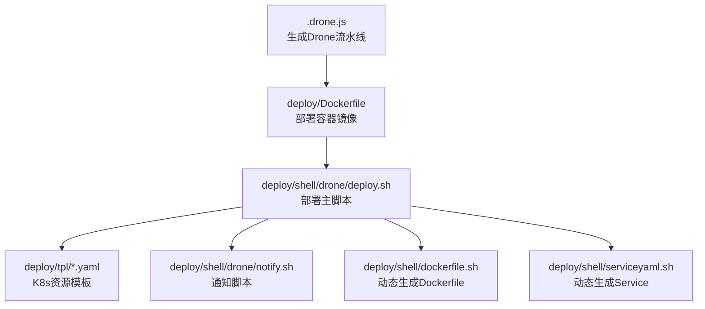
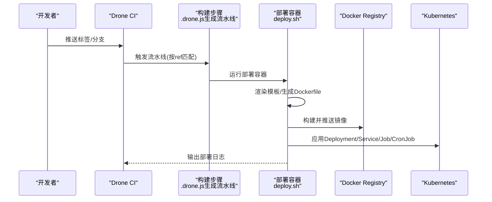
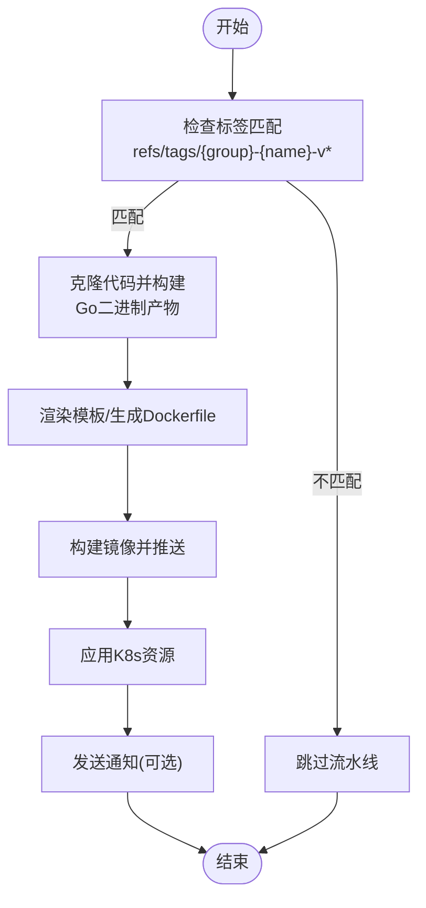
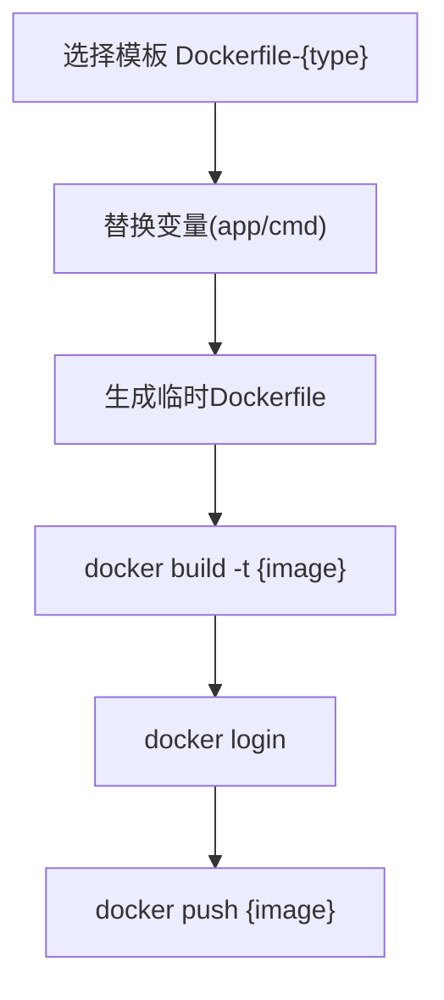
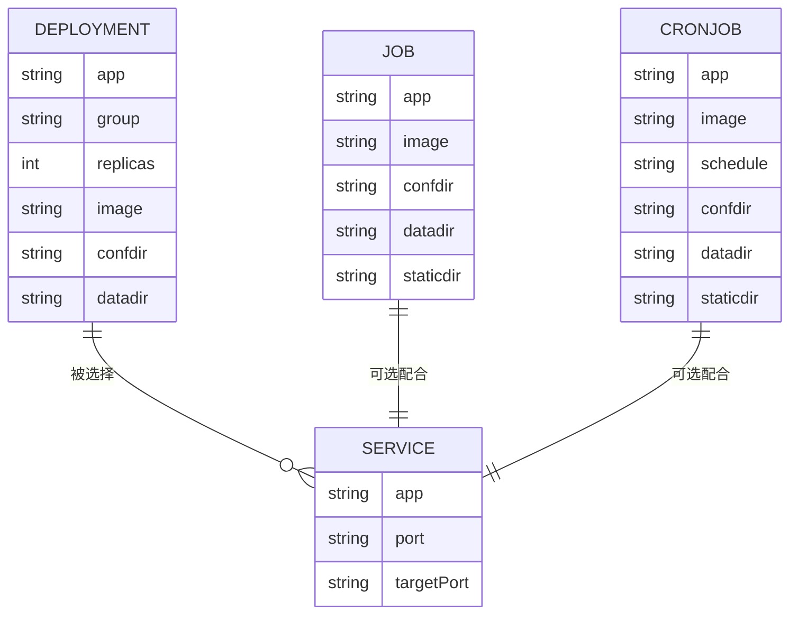
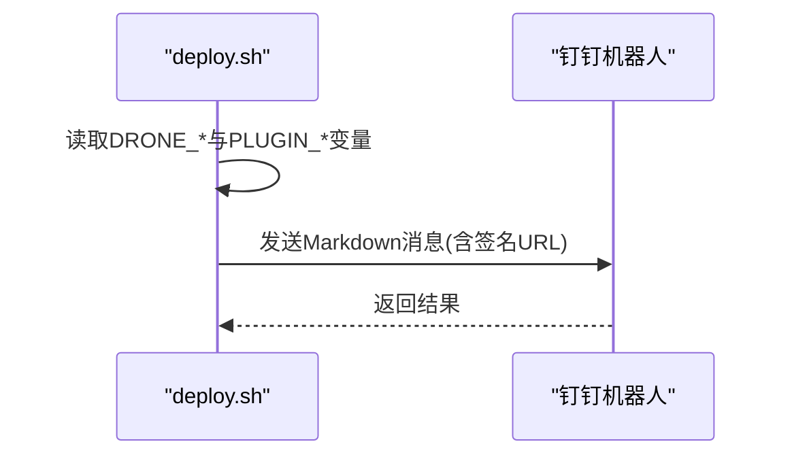
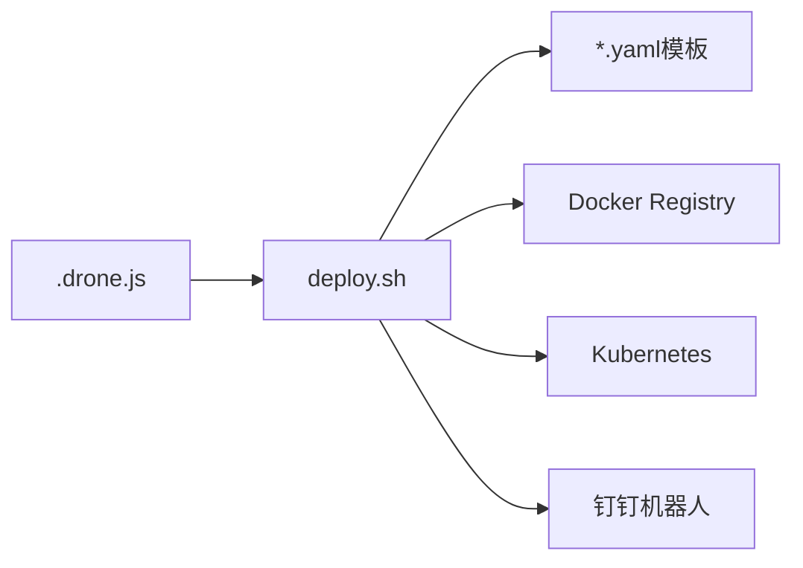

# CI/CD流水线

<cite>
**本文档引用的文件**
- [.drone.js](file://.drone.js)
- [deploy/Dockerfile](file://deploy/Dockerfile)
- [deploy/shell/drone/deploy.sh](file://deploy/shell/drone/deploy.sh)
- [deploy/shell/drone/notify.sh](file://deploy/shell/drone/notify.sh)
- [deploy/tpl/deploy-deployment.yaml](file://deploy/tpl/deploy-deployment.yaml)
- [deploy/tpl/deploy-service.yaml](file://deploy/tpl/deploy-service.yaml)
- [deploy/tpl/deploy-job.yaml](file://deploy/tpl/deploy-job.yaml)
- [deploy/tpl/deploy-cronjob.yaml](file://deploy/tpl/deploy-cronjob.yaml)
- [deploy/shell/dockerfile.sh](file://deploy/shell/dockerfile.sh)
- [deploy/shell/serviceyaml.sh](file://deploy/shell/serviceyaml.sh)
</cite>

## 目录
1. [简介](#简介)
2. [项目结构](#项目结构)
3. [核心组件](#核心组件)
4. [架构总览](#架构总览)
5. [详细组件分析](#详细组件分析)
6. [依赖关系分析](#依赖关系分析)
7. [性能考虑](#性能考虑)
8. [故障排查指南](#故障排查指南)
9. [结论](#结论)
10. [附录](#附录)

## 简介
本文件面向Hoper项目的CI/CD流水线，基于Drone CI与自研部署容器，提供从代码构建、测试执行、镜像构建与推送、到Kubernetes部署触发的完整配置说明。文档覆盖流水线阶段划分、并行任务配置、条件触发机制、环境变量与密钥管理、通知与回滚策略，并给出多环境部署、蓝绿与金丝雀发布的最佳实践建议。

## 项目结构
围绕CI/CD的关键文件组织如下：
- Drone配置：通过脚本生成Drone流水线定义，集中于根目录的配置脚本。
- 部署容器：打包了kubectl与docker CLI，内置模板与脚本，用于在流水线中执行构建、打包与部署。
- 部署模板：Kubernetes资源清单模板，支持Deployment、Service、Job、CronJob等类型。
- 通知脚本：集成钉钉机器人通知，便于发布状态播报。

图表来源
- [.drone.js:31-191](file://.drone.js#L31-L191)
- [deploy/Dockerfile:1-25](file://deploy/Dockerfile#L1-L25)
- [deploy/shell/drone/deploy.sh:1-170](file://deploy/shell/drone/deploy.sh#L1-L170)
- [deploy/tpl/deploy-deployment.yaml:1-51](file://deploy/tpl/deploy-deployment.yaml#L1-L51)
- [deploy/tpl/deploy-service.yaml:1-16](file://deploy/tpl/deploy-service.yaml#L1-L16)
- [deploy/tpl/deploy-job.yaml:1-40](file://deploy/tpl/deploy-job.yaml#L1-L40)
- [deploy/tpl/deploy-cronjob.yaml:1-44](file://deploy/tpl/deploy-cronjob.yaml#L1-L44)
- [deploy/shell/dockerfile.sh:1-29](file://deploy/shell/dockerfile.sh#L1-L29)
- [deploy/shell/serviceyaml.sh:1-42](file://deploy/shell/serviceyaml.sh#L1-L42)

章节来源
- [.drone.js:31-191](file://.drone.js#L31-L191)
- [deploy/Dockerfile:1-25](file://deploy/Dockerfile#L1-L25)

## 核心组件
- 流水线生成器：通过JavaScript脚本集中定义编译主机、目标主机、触发规则、卷挂载、步骤与参数，最终输出Drone可识别的YAML。
- 部署容器：封装docker与kubectl，内置模板与脚本，负责镜像构建、推送与Kubernetes资源应用。
- 资源模板：提供Deployment、Service、Job、CronJob四类模板，支持变量替换与按需渲染。
- 通知模块：通过钉钉机器人发送发布通知，支持签名URL增强安全性。

章节来源
- [.drone.js:31-191](file://.drone.js#L31-L191)
- [deploy/shell/drone/deploy.sh:1-170](file://deploy/shell/drone/deploy.sh#L1-L170)
- [deploy/tpl/deploy-deployment.yaml:1-51](file://deploy/tpl/deploy-deployment.yaml#L1-L51)
- [deploy/tpl/deploy-service.yaml:1-16](file://deploy/tpl/deploy-service.yaml#L1-L16)
- [deploy/tpl/deploy-job.yaml:1-40](file://deploy/tpl/deploy-job.yaml#L1-L40)
- [deploy/tpl/deploy-cronjob.yaml:1-44](file://deploy/tpl/deploy-cronjob.yaml#L1-L44)
- [deploy/shell/drone/notify.sh:1-63](file://deploy/shell/drone/notify.sh#L1-L63)

## 架构总览
下图展示从代码提交到Kubernetes部署的端到端流程，包括镜像构建、推送与资源应用。

图表来源
- [.drone.js:55-59](file://.drone.js#L55-L59)
- [deploy/shell/drone/deploy.sh:77-127](file://deploy/shell/drone/deploy.sh#L77-L127)
- [deploy/shell/drone/deploy.sh:93-103](file://deploy/shell/drone/deploy.sh#L93-L103)
- [deploy/shell/drone/deploy.sh:166-167](file://deploy/shell/drone/deploy.sh#L166-L167)

## 详细组件分析

### 流水线阶段与触发机制
- 阶段划分
  - 代码克隆与构建：在隔离容器中克隆源码、生成协议代码（可选）、执行Go构建，产物输出至构建目录。
  - 部署与发布：在部署容器中渲染模板、构建镜像、推送至仓库、应用Kubernetes资源。
- 条件触发
  - 仅当Git标签满足约定格式时触发（例如：组名-服务名-v版本号）。
  - 支持多编译/部署主机映射，便于本地开发与远端集群分离。
- 并行任务
  - 当前脚本定义为单管道、顺序步骤；如需并行，可在同一管道内拆分为多个独立步骤，并通过Drone的并发策略进行控制。

图表来源
- [.drone.js:55-59](file://.drone.js#L55-L59)
- [deploy/shell/drone/deploy.sh:77-127](file://deploy/shell/drone/deploy.sh#L77-L127)
- [deploy/shell/drone/deploy.sh:93-103](file://deploy/shell/drone/deploy.sh#L93-L103)
- [deploy/shell/drone/deploy.sh:166-167](file://deploy/shell/drone/deploy.sh#L166-L167)

章节来源
- [.drone.js:55-59](file://.drone.js#L55-L59)
- [.drone.js:95-133](file://.drone.js#L95-L133)
- [.drone.js:134-184](file://.drone.js#L134-L184)

### 镜像构建与推送
- 动态模板渲染
  - 根据构建类型选择对应Dockerfile模板，替换应用名与启动命令后生成临时Dockerfile。
- 构建与推送
  - 使用docker build构建镜像，登录仓库后推送，镜像Tag优先从标签中解析，否则使用时间戳作为回退。
- 安全性
  - 用户名与密码通过密钥管理注入，避免硬编码。

图表来源
- [deploy/shell/drone/deploy.sh:69-91](file://deploy/shell/drone/deploy.sh#L69-L91)
- [deploy/shell/drone/deploy.sh:93-103](file://deploy/shell/drone/deploy.sh#L93-L103)

章节来源
- [deploy/shell/drone/deploy.sh:52-67](file://deploy/shell/drone/deploy.sh#L52-L67)
- [deploy/shell/drone/deploy.sh:83-91](file://deploy/shell/drone/deploy.sh#L83-L91)
- [deploy/shell/drone/deploy.sh:93-103](file://deploy/shell/drone/deploy.sh#L93-L103)

### Kubernetes部署与资源管理
- 资源类型
  - Deployment：滚动更新策略，最小就绪时间与并发参数已配置。
  - Service：ClusterIP，端口映射到容器端口。
  - Job：一次性任务，支持静态资源挂载。
  - CronJob：定时任务，支持schedule变量替换。
- 卷挂载
  - 配置卷与数据卷分别挂载到宿主机路径，便于共享配置与持久化数据。
- 应用策略
  - 对于Job/CronJob，先删除旧资源再应用新资源，确保幂等。

图表来源
- [deploy/tpl/deploy-deployment.yaml:1-51](file://deploy/tpl/deploy-deployment.yaml#L1-L51)
- [deploy/tpl/deploy-service.yaml:1-16](file://deploy/tpl/deploy-service.yaml#L1-L16)
- [deploy/tpl/deploy-job.yaml:1-40](file://deploy/tpl/deploy-job.yaml#L1-L40)
- [deploy/tpl/deploy-cronjob.yaml:1-44](file://deploy/tpl/deploy-cronjob.yaml#L1-L44)

章节来源
- [deploy/tpl/deploy-deployment.yaml:10-20](file://deploy/tpl/deploy-deployment.yaml#L10-L20)
- [deploy/tpl/deploy-deployment.yaml:36-49](file://deploy/tpl/deploy-deployment.yaml#L36-L49)
- [deploy/tpl/deploy-job.yaml:20-39](file://deploy/tpl/deploy-job.yaml#L20-L39)
- [deploy/tpl/deploy-cronjob.yaml:7-44](file://deploy/tpl/deploy-cronjob.yaml#L7-L44)

### 通知机制与回滚策略
- 通知
  - 通过钉钉机器人发送Markdown消息，支持签名URL，包含项目、作者、分支、标签、提交信息与构建链接。
- 回滚
  - 建议采用镜像Tag回滚：将Deployment的镜像Tag切换到上一个稳定版本；或通过版本化标签管理，结合Git标签与镜像Tag保持一致。

图表来源
- [deploy/shell/drone/notify.sh:4-16](file://deploy/shell/drone/notify.sh#L4-L16)
- [deploy/shell/drone/notify.sh:37-61](file://deploy/shell/drone/notify.sh#L37-L61)

章节来源
- [deploy/shell/drone/notify.sh:17-20](file://deploy/shell/drone/notify.sh#L17-L20)
- [deploy/shell/drone/notify.sh:22-35](file://deploy/shell/drone/notify.sh#L22-L35)
- [deploy/shell/drone/notify.sh:49-58](file://deploy/shell/drone/notify.sh#L49-L58)

### 环境变量与密钥管理
- 关键变量
  - 组名、服务名、部署类型、构建类型、镜像命令、配置目录、数据目录、集群标识、计划任务周期、证书内容等。
- 密钥注入
  - Docker用户名/密码、CA证书、开发证书与私钥、钉钉Token与Secret均通过密钥注入，避免明文存储。
- 变量来源
  - Drone内置变量（如DRONE_TAG、DRONE_COMMIT等）与插件settings中的from_secret字段共同构成。

章节来源
- [.drone.js:149-182](file://.drone.js#L149-L182)
- [deploy/shell/drone/deploy.sh:10-35](file://deploy/shell/drone/deploy.sh#L10-L35)
- [deploy/shell/drone/deploy.sh:157-181](file://deploy/shell/drone/deploy.sh#L157-L181)

### 多环境部署与蓝绿/金丝雀发布
- 多环境
  - 通过集群标识与证书目录区分不同环境（如tot与hoper.xyz），在部署脚本中根据cluster切换API Server地址。
- 蓝绿发布
  - 使用两套Deployment（如app-v1与app-v2），通过切换Service选择器实现流量切换；回滚时只需改选择器。
- 金丝雀发布
  - 新版本以小规模副本运行，逐步增加副本数并观察指标，成功后再完全切流；失败则回滚到旧版本。

章节来源
- [deploy/shell/drone/deploy.sh:150-154](file://deploy/shell/drone/deploy.sh#L150-L154)
- [deploy/tpl/deploy-deployment.yaml:10-19](file://deploy/tpl/deploy-deployment.yaml#L10-L19)

## 依赖关系分析
- 组件耦合
  - .drone.js与部署容器存在强耦合（settings字段与容器内变量命名需一致）。
  - 部署容器与模板存在弱耦合（变量占位符需与模板一致）。
- 外部依赖
  - Docker Registry：用于镜像存储与拉取。
  - Kubernetes：用于资源应用与运行时管理。
  - 钉钉机器人：用于通知。

图表来源
- [.drone.js:149-182](file://.drone.js#L149-L182)
- [deploy/shell/drone/deploy.sh:166-167](file://deploy/shell/drone/deploy.sh#L166-L167)

章节来源
- [.drone.js:149-182](file://.drone.js#L149-L182)
- [deploy/shell/drone/deploy.sh:166-167](file://deploy/shell/drone/deploy.sh#L166-L167)

## 性能考虑
- 构建缓存
  - 在构建容器中复用GOPATH与缓存目录，减少依赖下载时间。
- 镜像层优化
  - 使用多阶段构建与精简基础镜像，降低镜像体积与拉取时间。
- 资源限制
  - 为容器设置合理的CPU与内存请求/限制，避免资源争抢。
- 并行度
  - 在同一管道内拆分任务并行执行（如同时构建多服务），但需注意共享卷与锁竞争。

## 故障排查指南
- 标签未触发
  - 检查标签格式是否符合约定（组名-服务名-v版本号）。
- 镜像构建失败
  - 确认Dockerfile模板存在且变量替换正确；检查网络代理与GOPROXY配置。
- 部署失败
  - 查看K8s资源应用日志，确认Service端口与容器端口一致；确认卷挂载路径存在。
- 通知失败
  - 检查钉钉Token与签名配置；确认网络可达性。

章节来源
- [.drone.js:55-59](file://.drone.js#L55-L59)
- [deploy/shell/drone/deploy.sh:77-81](file://deploy/shell/drone/deploy.sh#L77-L81)
- [deploy/shell/drone/deploy.sh:105-109](file://deploy/shell/drone/deploy.sh#L105-L109)
- [deploy/shell/drone/notify.sh:17-20](file://deploy/shell/drone/notify.sh#L17-L20)

## 结论
本方案以Drone为核心，结合自研部署容器与Kubernetes模板，实现了从代码构建、镜像推送至部署触发的完整流水线。通过严格的密钥管理、模板化与变量替换，以及通知与回滚策略，提升了交付效率与安全性。建议在生产环境中进一步完善并行度、资源配额与蓝绿/金丝雀策略，以获得更稳健的发布体验。

## 附录
- 动态生成工具
  - Dockerfile生成脚本：根据参数生成最小化Dockerfile。
  - Service生成脚本：根据参数生成Service资源清单。

章节来源
- [deploy/shell/dockerfile.sh:13-29](file://deploy/shell/dockerfile.sh#L13-L29)
- [deploy/shell/serviceyaml.sh:25-42](file://deploy/shell/serviceyaml.sh#L25-L42)