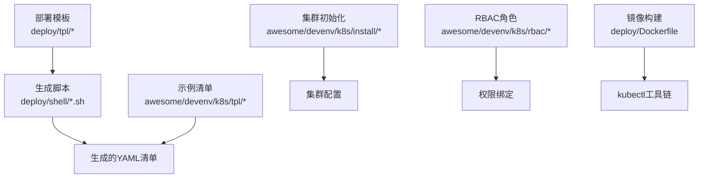
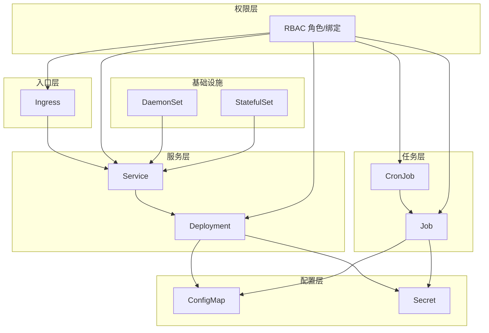
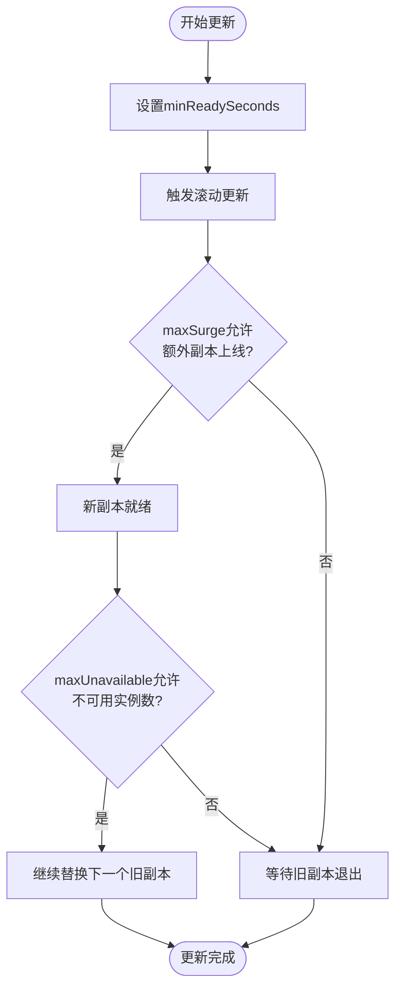
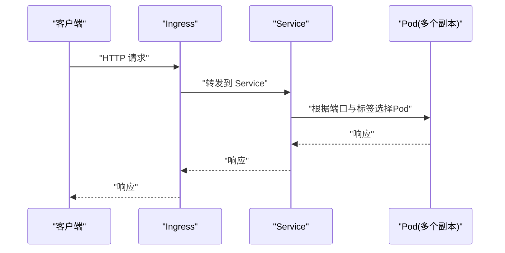
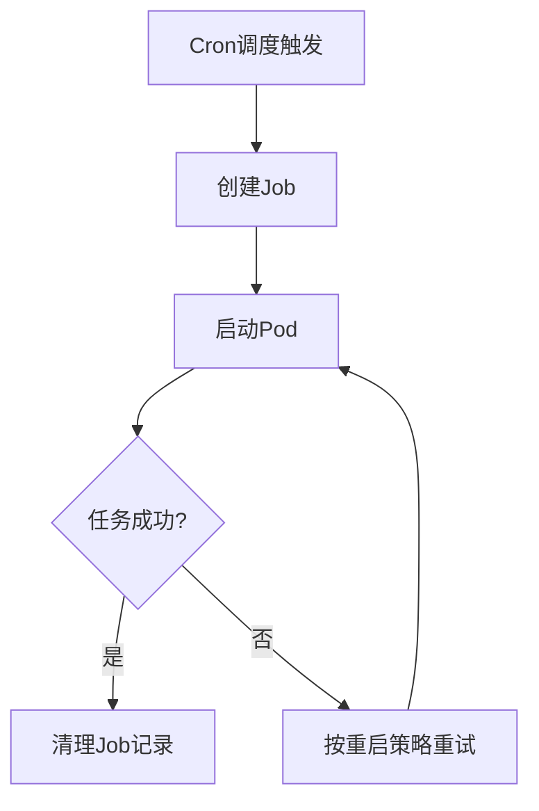
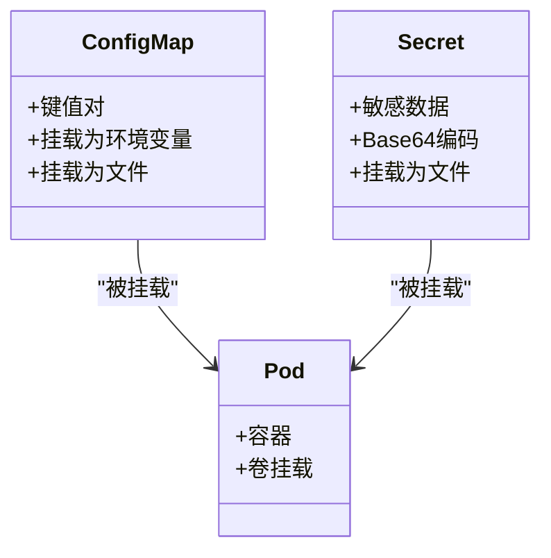
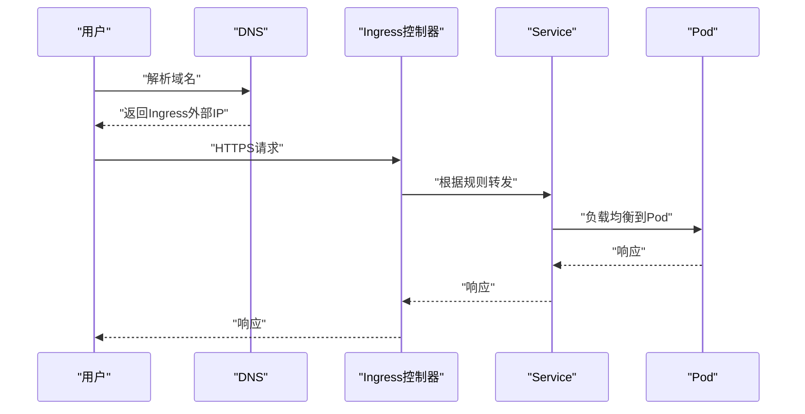
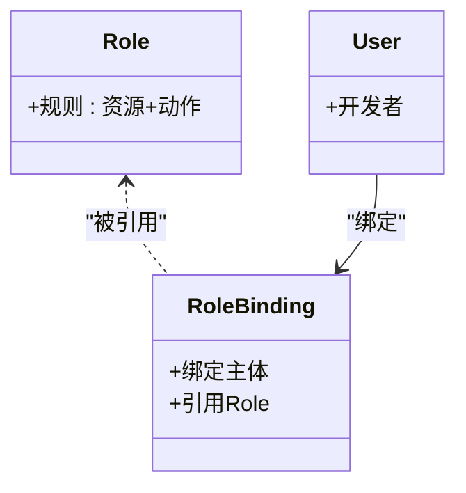
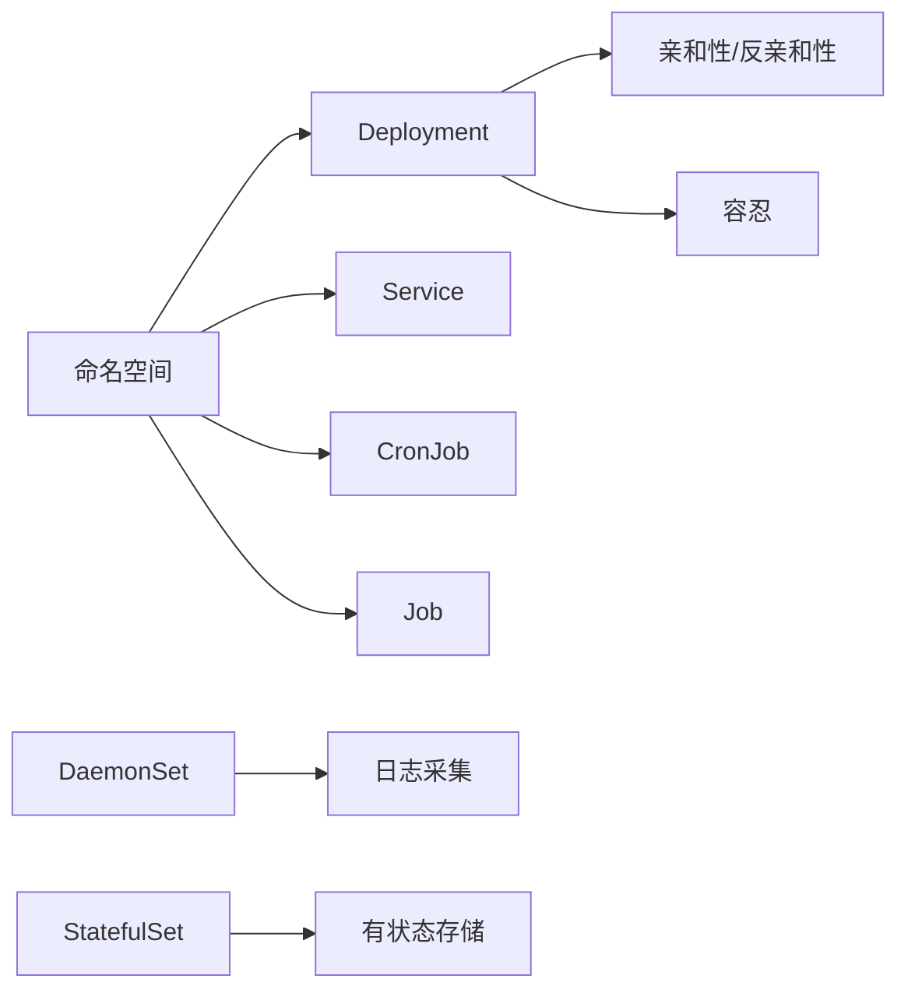
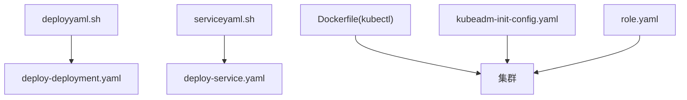

# Kubernetes部署

<cite>
**本文档引用的文件**
- [deploy-deployment.yaml](file://deploy/tpl/deploy-deployment.yaml)
- [deploy-service.yaml](file://deploy/tpl/deploy-service.yaml)
- [deploy-cronjob.yaml](file://deploy/tpl/deploy-cronjob.yaml)
- [deploy-job.yaml](file://deploy/tpl/deploy-job.yaml)
- [Dockerfile](file://deploy/Dockerfile)
- [deployyaml.sh](file://deploy/shell/deployyaml.sh)
- [serviceyaml.sh](file://deploy/shell/serviceyaml.sh)
- [deployment.yaml](file://awesome/devenv/k8s/tpl/deployment.yaml)
- [service.yaml](file://awesome/devenv/k8s/tpl/service.yaml)
- [ingress.yaml](file://awesome/devenv/k8s/tpl/ingress.yaml)
- [configmaps.yaml](file://awesome/devenv/k8s/tpl/configmaps.yaml)
- [daemonset.yaml](file://awesome/devenv/k8s/tpl/daemonset.yaml)
- [StatefulSet.yaml](file://awesome/devenv/k8s/tpl/StatefulSet.yaml)
- [kubeadm-init-config.yaml](file://awesome/devenv/k8s/install/kubeadm-init-config.yaml)
- [role.yaml](file://awesome/devenv/k8s/rbac/role.yaml)
</cite>

## 目录
1. [简介](#简介)
2. [项目结构](#项目结构)
3. [核心组件](#核心组件)
4. [架构总览](#架构总览)
5. [详细组件分析](#详细组件分析)
6. [依赖关系分析](#依赖关系分析)
7. [性能考虑](#性能考虑)
8. [故障排查指南](#故障排查指南)
9. [结论](#结论)
10. [附录](#附录)

## 简介
本文件面向Hoper在Kubernetes上的部署与运维，围绕Deployment、Service、CronJob、Job等核心资源展开，系统阐述服务发现、负载均衡、滚动更新与回滚策略；提供ConfigMap、Secret等配置管理最佳实践；覆盖命名空间管理、资源配额与Pod亲和性调度；并包含Ingress控制器配置、TLS证书与域名解析策略。文中所有实现细节均基于仓库现有模板与脚本进行归纳总结。

## 项目结构
Hoper的Kubernetes部署相关资产主要分布在以下位置：
- 部署模板：deploy/tpl 下的Deployment、Service、CronJob、Job等YAML模板
- 部署工具：deploy/shell 下的生成YAML的Shell脚本
- 示例与参考：awesome/devenv/k8s/tpl 下的示例清单（含Service、Ingress、ConfigMap、DaemonSet、StatefulSet）
- 集群初始化：awesome/devenv/k8s/install 下的kubeadm初始化配置
- RBAC权限：awesome/devenv/k8s/rbac 下的角色与绑定
- 镜像构建：deploy/Dockerfile（包含kubectl与多阶段镜像）

**章节来源**
- [deploy-deployment.yaml:1-51](file://deploy/tpl/deploy-deployment.yaml#L1-L51)
- [deploy-service.yaml:1-16](file://deploy/tpl/deploy-service.yaml#L1-L16)
- [deploy-cronjob.yaml:1-44](file://deploy/tpl/deploy-cronjob.yaml#L1-L44)
- [deploy-job.yaml:1-40](file://deploy/tpl/deploy-job.yaml#L1-L40)
- [deployyaml.sh:1-89](file://deploy/shell/deployyaml.sh#L1-L89)
- [serviceyaml.sh:1-42](file://deploy/shell/serviceyaml.sh#L1-L42)
- [deployment.yaml:1-87](file://awesome/devenv/k8s/tpl/deployment.yaml#L1-L87)
- [service.yaml:1-95](file://awesome/devenv/k8s/tpl/service.yaml#L1-L95)
- [ingress.yaml:1-51](file://awesome/devenv/k8s/tpl/ingress.yaml#L1-L51)
- [configmaps.yaml:1-60](file://awesome/devenv/k8s/tpl/configmaps.yaml#L1-L60)
- [daemonset.yaml:1-42](file://awesome/devenv/k8s/tpl/daemonset.yaml#L1-L42)
- [StatefulSet.yaml:1-34](file://awesome/devenv/k8s/tpl/StatefulSet.yaml#L1-L34)
- [kubeadm-init-config.yaml:1-34](file://awesome/devenv/k8s/install/kubeadm-init-config.yaml#L1-L34)
- [role.yaml:1-50](file://awesome/devenv/k8s/rbac/role.yaml#L1-L50)
- [Dockerfile:1-25](file://deploy/Dockerfile#L1-L25)

## 核心组件
本节聚焦Hoper在Kubernetes中的核心资源类型及其职责：
- Deployment：无状态应用的声明式滚动更新与扩缩容
- Service：服务发现与负载均衡抽象
- CronJob/Job：定时任务与一次性任务执行
- ConfigMap/Secret：配置与敏感信息管理
- Ingress：外部流量入口与路由
- RBAC：最小权限授权模型
- DaemonSet/StatefulSet：日志采集与有状态应用

**章节来源**
- [deploy-deployment.yaml:1-51](file://deploy/tpl/deploy-deployment.yaml#L1-L51)
- [deploy-service.yaml:1-16](file://deploy/tpl/deploy-service.yaml#L1-L16)
- [deploy-cronjob.yaml:1-44](file://deploy/tpl/deploy-cronjob.yaml#L1-L44)
- [deploy-job.yaml:1-40](file://deploy/tpl/deploy-job.yaml#L1-L40)
- [configmaps.yaml:1-60](file://awesome/devenv/k8s/tpl/configmaps.yaml#L1-L60)
- [ingress.yaml:1-51](file://awesome/devenv/k8s/tpl/ingress.yaml#L1-L51)
- [role.yaml:1-50](file://awesome/devenv/k8s/rbac/role.yaml#L1-L50)
- [daemonset.yaml:1-42](file://awesome/devenv/k8s/tpl/daemonset.yaml#L1-L42)
- [StatefulSet.yaml:1-34](file://awesome/devenv/k8s/tpl/StatefulSet.yaml#L1-L34)

## 架构总览
下图展示Hoper在Kubernetes中的典型部署架构：前端通过Ingress接入，后端由Deployment提供无状态服务，Service负责服务发现与负载均衡，CronJob/Job用于后台任务，ConfigMap/Secret提供配置与密钥管理，RBAC控制访问权限。

**图表来源**
- [ingress.yaml:1-51](file://awesome/devenv/k8s/tpl/ingress.yaml#L1-L51)
- [service.yaml:1-95](file://awesome/devenv/k8s/tpl/service.yaml#L1-L95)
- [deployment.yaml:1-87](file://awesome/devenv/k8s/tpl/deployment.yaml#L1-L87)
- [deploy-cronjob.yaml:1-44](file://deploy/tpl/deploy-cronjob.yaml#L1-L44)
- [deploy-job.yaml:1-40](file://deploy/tpl/deploy-job.yaml#L1-L40)
- [configmaps.yaml:1-60](file://awesome/devenv/k8s/tpl/configmaps.yaml#L1-L60)
- [role.yaml:1-50](file://awesome/devenv/k8s/rbac/role.yaml#L1-L50)
- [daemonset.yaml:1-42](file://awesome/devenv/k8s/tpl/daemonset.yaml#L1-L42)
- [StatefulSet.yaml:1-34](file://awesome/devenv/k8s/tpl/StatefulSet.yaml#L1-L34)

## 详细组件分析

### Deployment（滚动更新与回滚）
- 滚动更新策略：通过maxSurge与maxUnavailable控制滚动过程中的并发与不可用实例数，确保服务连续性
- 就绪检查：minReadySeconds定义新实例在标记为就绪前的稳定等待时间
- 资源请求与限制：为CPU与内存设置requests与limits，便于调度与QoS
- 卷挂载：通过hostPath挂载配置与数据目录，便于本地持久化
- 回滚机制：Kubernetes原生支持RollingBack，可通过kubectl rollout undo实现

**图表来源**
- [deploy-deployment.yaml:10-19](file://deploy/tpl/deploy-deployment.yaml#L10-L19)
- [deploy-deployment.yaml:29-35](file://deploy/tpl/deploy-deployment.yaml#L29-L35)

**章节来源**
- [deploy-deployment.yaml:1-51](file://deploy/tpl/deploy-deployment.yaml#L1-L51)
- [deployment.yaml:11-16](file://awesome/devenv/k8s/tpl/deployment.yaml#L11-L16)

### Service（服务发现与负载均衡）
- 类型：ClusterIP用于集群内访问；示例中包含LoadBalancer与ExternalIPs以支持外部访问
- 端口映射：port与targetPort配合selector实现流量转发
- 负载均衡：Kubernetes Service通过kube-proxy实现四层负载均衡
- 外部可达：通过LoadBalancerIP或Ingress对外暴露服务

**图表来源**
- [service.yaml:1-95](file://awesome/devenv/k8s/tpl/service.yaml#L1-L95)
- [ingress.yaml:1-51](file://awesome/devenv/k8s/tpl/ingress.yaml#L1-L51)

**章节来源**
- [deploy-service.yaml:1-16](file://deploy/tpl/deploy-service.yaml#L1-L16)
- [service.yaml:1-95](file://awesome/devenv/k8s/tpl/service.yaml#L1-L95)

### CronJob/Job（定时与一次性任务）
- CronJob：通过schedule字段定义周期，jobTemplate描述每次运行的任务容器与卷挂载
- Job：一次性任务，适合批处理与离线计算
- 重启策略：OnFailure适用于失败重试场景
- 数据持久化：通过hostPath挂载共享目录，便于任务间共享静态资源

**图表来源**
- [deploy-cronjob.yaml:7-23](file://deploy/tpl/deploy-cronjob.yaml#L7-L23)
- [deploy-job.yaml:1-40](file://deploy/tpl/deploy-job.yaml#L1-L40)

**章节来源**
- [deploy-cronjob.yaml:1-44](file://deploy/tpl/deploy-cronjob.yaml#L1-L44)
- [deploy-job.yaml:1-40](file://deploy/tpl/deploy-job.yaml#L1-L40)

### ConfigMap/Secret（配置与密钥管理）
- ConfigMap：存储非敏感配置键值对，可作为环境变量或文件挂载
- Secret：存储敏感信息（如证书、密码），支持Base64编码
- 挂载方式：通过volumeMounts将ConfigMap/Secret挂载到容器文件系统
- 最佳实践：分离敏感与非敏感配置，避免硬编码在镜像或代码中

**图表来源**
- [configmaps.yaml:1-60](file://awesome/devenv/k8s/tpl/configmaps.yaml#L1-L60)
- [deploy-deployment.yaml:36-49](file://deploy/tpl/deploy-deployment.yaml#L36-L49)

**章节来源**
- [configmaps.yaml:1-60](file://awesome/devenv/k8s/tpl/configmaps.yaml#L1-L60)
- [deploy-deployment.yaml:36-49](file://deploy/tpl/deploy-deployment.yaml#L36-L49)

### Ingress控制器、TLS与域名解析
- Ingress：定义HTTP/HTTPS路由规则，将域名与路径映射到Service
- 控制器：通过annotations指定ingress.class（如nginx）
- TLS：结合Secret与IngressTLS实现HTTPS终止
- 域名解析：通过DNS将域名解析到Ingress控制器的外部IP

**图表来源**
- [ingress.yaml:1-51](file://awesome/devenv/k8s/tpl/ingress.yaml#L1-L51)
- [service.yaml:1-95](file://awesome/devenv/k8s/tpl/service.yaml#L1-L95)

**章节来源**
- [ingress.yaml:1-51](file://awesome/devenv/k8s/tpl/ingress.yaml#L1-L51)

### RBAC与权限管理
- Role：定义对资源（如ConfigMap、Service、Deployment、Job、CronJob、Secret等）的增删改查权限
- RoleBinding：将用户或组绑定到具体命名空间的角色
- 最小权限原则：仅授予业务所需的最小权限集

**图表来源**
- [role.yaml:1-50](file://awesome/devenv/k8s/rbac/role.yaml#L1-L50)

**章节来源**
- [role.yaml:1-50](file://awesome/devenv/k8s/rbac/role.yaml#L1-L50)

### 命名空间、资源配额与调度
- 命名空间：通过namespace字段隔离资源（如示例中的namespace: attendance）
- 资源配额：建议在生产环境中为命名空间设置ResourceQuota与LimitRange，约束CPU/内存用量
- 调度：通过nodeSelector、亲和性（nodeAffinity/podAffinity）与污点容忍（tolerations）实现调度约束
- 日志与监控：DaemonSet用于采集节点日志，StatefulSet用于有状态应用

**图表来源**
- [deployment.yaml:4-6](file://awesome/devenv/k8s/tpl/deployment.yaml#L4-L6)
- [daemonset.yaml:17-19](file://awesome/devenv/k8s/tpl/daemonset.yaml#L17-L19)
- [StatefulSet.yaml:1-34](file://awesome/devenv/k8s/tpl/StatefulSet.yaml#L1-L34)

**章节来源**
- [deployment.yaml:4-6](file://awesome/devenv/k8s/tpl/deployment.yaml#L4-L6)
- [daemonset.yaml:1-42](file://awesome/devenv/k8s/tpl/daemonset.yaml#L1-L42)
- [StatefulSet.yaml:1-34](file://awesome/devenv/k8s/tpl/StatefulSet.yaml#L1-L34)

## 依赖关系分析
- 模板与脚本：deployyaml.sh与serviceyaml.sh用于生成Deployment与Service的YAML，减少重复配置
- 工具链：Dockerfile中集成kubectl，便于在CI/CD中直接执行kubectl apply
- 集群初始化：kubeadm-init-config.yaml定义网络、认证与代理模式，影响Service/Ingress行为
- 权限：RBAC角色定义了对各类资源的操作权限，直接影响部署与运维流程

**图表来源**
- [deployyaml.sh:1-89](file://deploy/shell/deployyaml.sh#L1-L89)
- [serviceyaml.sh:1-42](file://deploy/shell/serviceyaml.sh#L1-L42)
- [deploy-deployment.yaml:1-51](file://deploy/tpl/deploy-deployment.yaml#L1-L51)
- [deploy-service.yaml:1-16](file://deploy/tpl/deploy-service.yaml#L1-L16)
- [Dockerfile:1-25](file://deploy/Dockerfile#L1-L25)
- [kubeadm-init-config.yaml:1-34](file://awesome/devenv/k8s/install/kubeadm-init-config.yaml#L1-L34)
- [role.yaml:1-50](file://awesome/devenv/k8s/rbac/role.yaml#L1-L50)

**章节来源**
- [deployyaml.sh:1-89](file://deploy/shell/deployyaml.sh#L1-L89)
- [serviceyaml.sh:1-42](file://deploy/shell/serviceyaml.sh#L1-L42)
- [Dockerfile:1-25](file://deploy/Dockerfile#L1-L25)
- [kubeadm-init-config.yaml:1-34](file://awesome/devenv/k8s/install/kubeadm-init-config.yaml#L1-L34)
- [role.yaml:1-50](file://awesome/devenv/k8s/rbac/role.yaml#L1-L50)

## 性能考虑
- 资源请求与限制：合理设置requests与limits，避免抢占与OOM
- 滚动更新参数：适当调整maxSurge与maxUnavailable，平衡可用性与速度
- 负载均衡：Service后端Pod数量应满足流量峰值，必要时结合HPA（需在集群中启用）
- 存储：hostPath简单但缺乏PV管理，建议在生产中使用PersistentVolume与StorageClass
- 网络：Ingress与Service的端口映射应避免冲突，确保流量正确转发

## 故障排查指南
- 无法拉取镜像：检查imagePullPolicy与镜像仓库凭证
- Pod持续重启：查看容器日志与事件，确认资源限制与健康检查
- Service无法访问：核对selector与端口映射，确认Service类型与外部IP配置
- Ingress不生效：检查ingress.class与注解，验证域名解析与证书
- 权限不足：核对RBAC角色与绑定，确认用户/组与命名空间匹配

**章节来源**
- [deploy-deployment.yaml:35](file://deploy/tpl/deploy-deployment.yaml#L35)
- [service.yaml:1-95](file://awesome/devenv/k8s/tpl/service.yaml#L1-L95)
- [ingress.yaml:1-51](file://awesome/devenv/k8s/tpl/ingress.yaml#L1-L51)
- [role.yaml:1-50](file://awesome/devenv/k8s/rbac/role.yaml#L1-L50)

## 结论
Hoper的Kubernetes部署以模板与脚本为核心，结合Service、Ingress、ConfigMap/Secret与RBAC形成完整的交付体系。通过合理的滚动更新策略、服务发现与负载均衡、以及严格的权限与命名空间管理，可在保证高可用的同时提升运维效率。建议在生产环境中进一步完善资源配额、持久化存储与监控告警体系。

## 附录
- 集群初始化参考：kubeadm-init-config.yaml中定义了网络、认证与代理模式
- 示例清单参考：deployment.yaml、service.yaml、ingress.yaml、configmaps.yaml、daemonset.yaml、StatefulSet.yaml提供了丰富的实践范式
- 部署工具参考：deployyaml.sh与serviceyaml.sh展示了如何自动化生成YAML

**章节来源**
- [kubeadm-init-config.yaml:1-34](file://awesome/devenv/k8s/install/kubeadm-init-config.yaml#L1-L34)
- [deployment.yaml:1-87](file://awesome/devenv/k8s/tpl/deployment.yaml#L1-L87)
- [service.yaml:1-95](file://awesome/devenv/k8s/tpl/service.yaml#L1-L95)
- [ingress.yaml:1-51](file://awesome/devenv/k8s/tpl/ingress.yaml#L1-L51)
- [configmaps.yaml:1-60](file://awesome/devenv/k8s/tpl/configmaps.yaml#L1-L60)
- [daemonset.yaml:1-42](file://awesome/devenv/k8s/tpl/daemonset.yaml#L1-L42)
- [StatefulSet.yaml:1-34](file://awesome/devenv/k8s/tpl/StatefulSet.yaml#L1-L34)
- [deployyaml.sh:1-89](file://deploy/shell/deployyaml.sh#L1-L89)
- [serviceyaml.sh:1-42](file://deploy/shell/serviceyaml.sh#L1-L42)