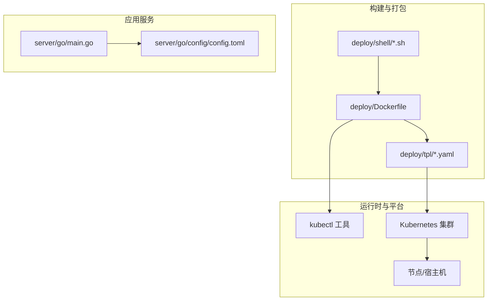
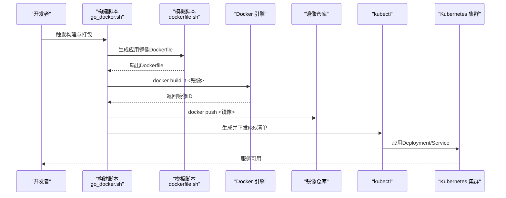
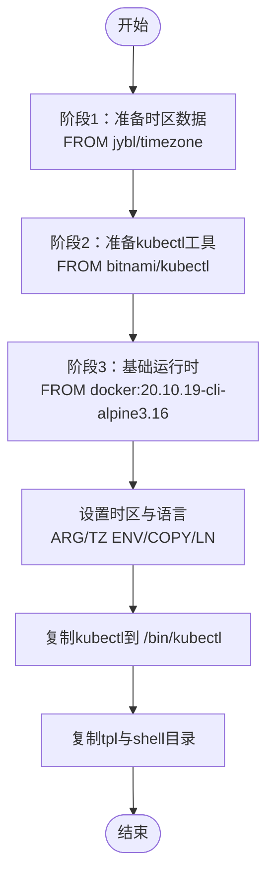
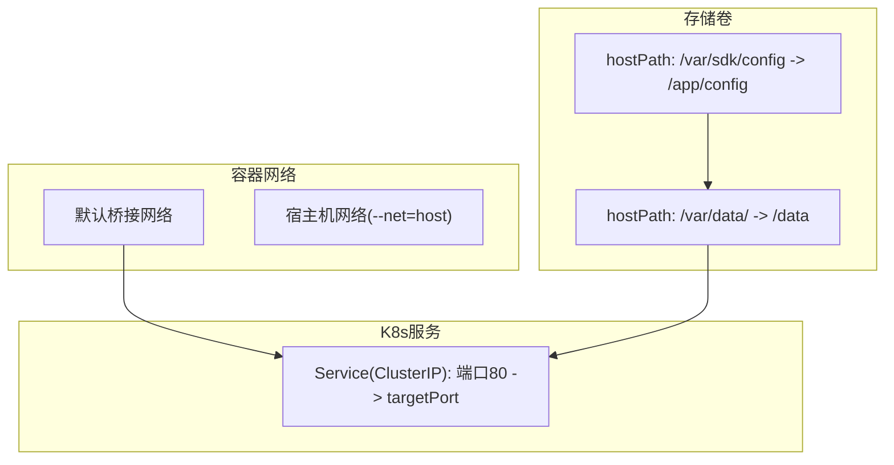
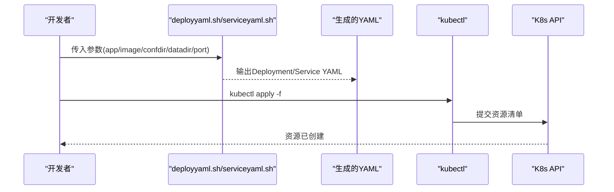
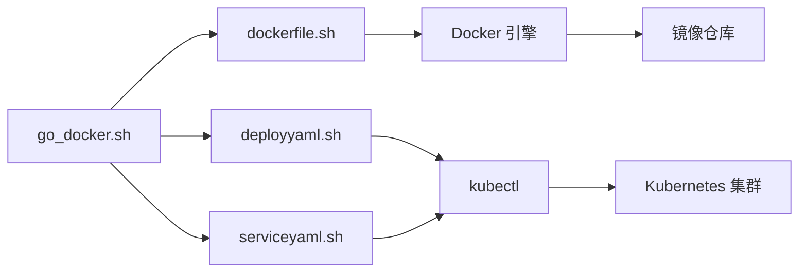

# 容器化部署

<cite>
**本文引用的文件**
- [Dockerfile](file://deploy/Dockerfile)
- [docker.md](file://awesome/devenv/docker/docker.md)
- [alpine镜像时区设置.md](file://awesome/devenv/k8s/alpine镜像时区设置.md)
- [kubectl-install.md](file://awesome/devenv/k8s/kubectl-install.md)
- [go_docker.sh](file://deploy/shell/go_docker.sh)
- [dockerfile.sh](file://deploy/shell/dockerfile.sh)
- [deploy-deployment.yaml](file://deploy/tpl/deploy-deployment.yaml)
- [deploy-service.yaml](file://deploy/tpl/deploy-service.yaml)
- [deployyaml.sh](file://deploy/shell/deployyaml.sh)
- [serviceyaml.sh](file://deploy/shell/serviceyaml.sh)
- [docker.sh](file://awesome/devenv/docker/docker.sh)
- [config.toml](file://server/go/config/config.toml)
- [main.go](file://server/go/main.go)
</cite>

## 目录
1. [简介](#简介)
2. [项目结构](#项目结构)
3. [核心组件](#核心组件)
4. [架构总览](#架构总览)
5. [详细组件分析](#详细组件分析)
6. [依赖关系分析](#依赖关系分析)
7. [性能考量](#性能考量)
8. [故障排查指南](#故障排查指南)
9. [结论](#结论)
10. [附录](#附录)

## 简介
本文件面向Hoper项目的容器化部署，围绕Dockerfile构建策略（多阶段构建、时区配置、kubectl工具集成）、镜像构建流程与优化、安全与合规、容器运行时配置（网络、卷挂载）、健康检查与资源限制、性能调优等方面进行系统化说明。文档同时给出Kubernetes部署模板与Shell脚本的使用方式，帮助读者快速落地生产级容器化方案。

## 项目结构
与容器化部署直接相关的目录与文件：
- deploy/Dockerfile：多阶段构建的最终镜像定义，集成时区与时区数据、kubectl工具与模板脚本。
- deploy/shell/：构建与部署脚本集合，负责生成Dockerfile、打包镜像、推送镜像、生成K8s清单。
- deploy/tpl/：Kubernetes部署模板，包含Deployment与Service的占位符。
- awesome/devenv/docker/：Docker使用手册与最佳实践（日志、网络、卷、资源限制等）。
- awesome/devenv/k8s/：kubectl安装与配置说明。
- server/go/config/config.toml 与 server/go/main.go：服务端配置与入口，为容器运行提供参考。

**图示来源**
- [Dockerfile:1-25](file://deploy/Dockerfile#L1-L25)
- [deploy-deployment.yaml:1-51](file://deploy/tpl/deploy-deployment.yaml#L1-L51)
- [deploy-service.yaml:1-16](file://deploy/tpl/deploy-service.yaml#L1-L16)
- [dockerfile.sh:1-29](file://deploy/shell/dockerfile.sh#L1-L29)
- [go_docker.sh:1-52](file://deploy/shell/go_docker.sh#L1-L52)
- [main.go:1-69](file://server/go/main.go#L1-L69)
- [config.toml:1-41](file://server/go/config/config.toml#L1-L41)

**章节来源**
- [Dockerfile:1-25](file://deploy/Dockerfile#L1-L25)
- [deploy-deployment.yaml:1-51](file://deploy/tpl/deploy-deployment.yaml#L1-L51)
- [deploy-service.yaml:1-16](file://deploy/tpl/deploy-service.yaml#L1-L16)
- [dockerfile.sh:1-29](file://deploy/shell/dockerfile.sh#L1-L29)
- [go_docker.sh:1-52](file://deploy/shell/go_docker.sh#L1-L52)

## 核心组件
- 多阶段构建与最终镜像
  - 使用基础镜像与工具镜像（如docker:20.10.19-cli-alpine3.16、bitnami/kubectl、jybl/timezone）组合，最终得到包含kubectl与所需工具的轻量镜像。
  - 通过ARG与ENV设置时区与语言环境，确保容器内时间与日志一致性。
- Shell自动化脚本
  - dockerfile.sh：动态生成应用镜像的Dockerfile，包含时区配置与CMD命令。
  - go_docker.sh：封装Go二进制构建、Dockerfile生成、镜像构建与推送、K8s清单生成与下发。
  - deployyaml.sh、serviceyaml.sh：生成Deployment与Service的K8s清单。
- Kubernetes部署模板
  - deploy-deployment.yaml：定义副本数、滚动更新策略、资源请求/限制、卷挂载与hostPath路径。
  - deploy-service.yaml：定义ClusterIP服务与端口映射。
- 运行时与平台
  - docker.md与docker.sh：提供容器运行时最佳实践（日志轮转、自动重启、特权能力、网络模式等）。
  - kubectl-install.md：提供kubectl安装与集群配置步骤。

**章节来源**
- [Dockerfile:1-25](file://deploy/Dockerfile#L1-L25)
- [dockerfile.sh:1-29](file://deploy/shell/dockerfile.sh#L1-L29)
- [go_docker.sh:1-52](file://deploy/shell/go_docker.sh#L1-L52)
- [deploy-deployment.yaml:1-51](file://deploy/tpl/deploy-deployment.yaml#L1-L51)
- [deploy-service.yaml:1-16](file://deploy/tpl/deploy-service.yaml#L1-L16)
- [docker.md:1-692](file://awesome/devenv/docker/docker.md#L1-L692)
- [docker.sh:1-181](file://awesome/devenv/docker/docker.sh#L1-L181)
- [kubectl-install.md:1-54](file://awesome/devenv/k8s/kubectl-install.md#L1-L54)

## 架构总览
下图展示从构建到运行的端到端流程：开发者通过脚本生成Dockerfile并构建镜像，推送至镜像仓库；随后使用kubectl应用K8s清单，完成Deployment与Service的创建与发布。

**图示来源**
- [go_docker.sh:1-52](file://deploy/shell/go_docker.sh#L1-L52)
- [dockerfile.sh:1-29](file://deploy/shell/dockerfile.sh#L1-L29)
- [deploy-deployment.yaml:1-51](file://deploy/tpl/deploy-deployment.yaml#L1-L51)
- [deploy-service.yaml:1-16](file://deploy/tpl/deploy-service.yaml#L1-L16)

## 详细组件分析

### Dockerfile构建策略与多阶段构建
- 多阶段构建思路
  - 使用工具镜像（docker:20.10.19-cli-alpine3.16、bitnami/kubectl）复制kubectl工具。
  - 使用jybl/timezone镜像复制时区数据，避免在最终镜像中安装额外包。
  - 最终阶段仅保留运行所需的二进制与工具，减小镜像体积。
- 时区配置
  - 通过ARG与ENV设置时区与语言环境，使用COPY与软链接方式写入容器。
  - 参考alpine镜像时区设置文档中的推荐做法，确保容器内时间与宿主机一致。
- kubectl工具集成
  - 从bitnami/kubectl镜像复制kubectl到最终镜像，便于在容器内执行kubectl命令。
- 模板与脚本
  - 将tpl与shell目录加入镜像，便于在容器内执行部署脚本与模板渲染。

**图示来源**
- [Dockerfile:1-25](file://deploy/Dockerfile#L1-L25)
- [alpine镜像时区设置.md:1-25](file://awesome/devenv/k8s/alpine镜像时区设置.md#L1-L25)

**章节来源**
- [Dockerfile:1-25](file://deploy/Dockerfile#L1-L25)
- [alpine镜像时区设置.md:1-25](file://awesome/devenv/k8s/alpine镜像时区设置.md#L1-L25)

### 镜像构建流程与优化策略
- 构建流程
  - go_docker.sh：负责Go二进制构建、生成应用镜像Dockerfile、构建与推送镜像。
  - dockerfile.sh：生成应用镜像的Dockerfile，包含时区配置与CMD命令。
- 优化策略
  - 多阶段构建减少最终镜像体积。
  - 仅复制必要文件（二进制、模板、脚本），避免冗余。
  - 使用轻量基础镜像（alpine系列）与精简工具集。
  - 通过ARG传递时区参数，避免硬编码。
- 安全考虑
  - 优先使用只读根文件系统与最小权限原则（结合K8s SecurityContext）。
  - 使用镜像仓库访问凭证管理与镜像签名验证（建议在CI/CD中启用）。
  - 控制容器能力（capabilities）与网络模式，遵循最小授权原则。

**章节来源**
- [go_docker.sh:1-52](file://deploy/shell/go_docker.sh#L1-L52)
- [dockerfile.sh:1-29](file://deploy/shell/dockerfile.sh#L1-L29)
- [docker.md:1-692](file://awesome/devenv/docker/docker.md#L1-L692)

### 容器运行时配置、网络与存储卷挂载
- 网络
  - 支持宿主机网络模式（--net=host）与默认桥接网络，按需选择。
  - 在K8s中通过Service暴露服务，使用ClusterIP与端口映射。
- 存储卷挂载
  - K8s Deployment通过hostPath挂载配置目录与数据目录，便于持久化与配置热更新。
  - 建议在生产环境中使用PersistentVolume以提升可靠性与可移植性。
- 运行时最佳实践
  - 使用--restart策略实现自动重启。
  - 通过日志驱动与轮转参数控制日志大小与数量，避免磁盘占用过高。
  - 使用特权模式与能力控制（如NET_ADMIN）时需谨慎评估风险。

**图示来源**
- [deploy-deployment.yaml:36-49](file://deploy/tpl/deploy-deployment.yaml#L36-L49)
- [deploy-service.yaml:9-14](file://deploy/tpl/deploy-service.yaml#L9-L14)
- [docker.sh:142-144](file://awesome/devenv/docker/docker.sh#L142-L144)

**章节来源**
- [deploy-deployment.yaml:1-51](file://deploy/tpl/deploy-deployment.yaml#L1-L51)
- [deploy-service.yaml:1-16](file://deploy/tpl/deploy-service.yaml#L1-L16)
- [docker.sh:1-181](file://awesome/devenv/docker/docker.sh#L1-L181)

### 健康检查、资源限制与性能调优
- 健康检查
  - 建议在K8s中配置livenessProbe/readinessProbe，探测HTTP端点或gRPC端点，确保服务可用性。
  - 对于长时间启动的服务，合理设置initialDelaySeconds与periodSeconds。
- 资源限制
  - Deployment中已设置requests/limits，建议根据实际负载调整内存与CPU配额。
  - 生产环境建议开启HPA（Horizontal Pod Autoscaler）以弹性扩缩容。
- 性能调优
  - 选择合适的GC参数与线程模型（结合应用特性）。
  - 使用cgroups与ulimit限制容器资源，避免资源争用。
  - 通过Prometheus/Grafana监控容器指标，持续优化。

**章节来源**
- [deploy-deployment.yaml:29-35](file://deploy/tpl/deploy-deployment.yaml#L29-L35)
- [docker.md:552-610](file://awesome/devenv/docker/docker.md#L552-L610)

### K8s部署清单与kubectl集成
- 清单生成
  - deployyaml.sh与serviceyaml.sh分别生成Deployment与Service的YAML文件，支持参数化（应用名、镜像、配置目录、数据目录、端口）。
- kubectl使用
  - 提供kubectl安装与集群配置步骤，便于在容器内或本地执行kubectl命令。
- 模板与脚本
  - deploy/Dockerfile中已包含kubectl工具，便于在容器内直接执行kubectl apply等操作。

**图示来源**
- [deployyaml.sh:1-89](file://deploy/shell/deployyaml.sh#L1-L89)
- [serviceyaml.sh:1-42](file://deploy/shell/serviceyaml.sh#L1-L42)
- [deploy-deployment.yaml:1-51](file://deploy/tpl/deploy-deployment.yaml#L1-L51)
- [deploy-service.yaml:1-16](file://deploy/tpl/deploy-service.yaml#L1-L16)
- [kubectl-install.md:1-54](file://awesome/devenv/k8s/kubectl-install.md#L1-L54)

**章节来源**
- [deployyaml.sh:1-89](file://deploy/shell/deployyaml.sh#L1-L89)
- [serviceyaml.sh:1-42](file://deploy/shell/serviceyaml.sh#L1-L42)
- [deploy-deployment.yaml:1-51](file://deploy/tpl/deploy-deployment.yaml#L1-L51)
- [deploy-service.yaml:1-16](file://deploy/tpl/deploy-service.yaml#L1-L16)
- [kubectl-install.md:1-54](file://awesome/devenv/k8s/kubectl-install.md#L1-L54)

## 依赖关系分析
- 组件耦合
  - go_docker.sh依赖dockerfile.sh生成Dockerfile，再调用docker build与push。
  - K8s清单由deployyaml.sh与serviceyaml.sh生成，最终通过kubectl应用。
- 外部依赖
  - docker:20.10.19-cli-alpine3.16、bitnami/kubectl、jybl/timezone等第三方镜像。
  - kubectl工具与集群配置依赖外部Kubernetes环境。
- 潜在风险
  - 多阶段构建中工具镜像版本升级可能导致兼容性问题，需在CI中验证。
  - hostPath在某些K8s发行版中受限，建议迁移到PV/PVC。

**图示来源**
- [go_docker.sh:1-52](file://deploy/shell/go_docker.sh#L1-L52)
- [dockerfile.sh:1-29](file://deploy/shell/dockerfile.sh#L1-L29)
- [deployyaml.sh:1-89](file://deploy/shell/deployyaml.sh#L1-L89)
- [serviceyaml.sh:1-42](file://deploy/shell/serviceyaml.sh#L1-L42)

**章节来源**
- [go_docker.sh:1-52](file://deploy/shell/go_docker.sh#L1-L52)
- [dockerfile.sh:1-29](file://deploy/shell/dockerfile.sh#L1-L29)
- [deployyaml.sh:1-89](file://deploy/shell/deployyaml.sh#L1-L89)
- [serviceyaml.sh:1-42](file://deploy/shell/serviceyaml.sh#L1-L42)

## 性能考量
- 镜像体积与启动速度
  - 多阶段构建与精简基础镜像可显著降低镜像体积，缩短拉取与启动时间。
- 资源分配
  - 结合业务负载调整requests/limits，避免过度预留导致资源浪费。
- 网络与I/O
  - 使用宿主机网络模式时需评估端口冲突与安全影响；存储建议使用SSD与合适的I/O调度策略。
- 监控与可观测性
  - 集成Prometheus/Grafana与OpenTelemetry，持续观测容器CPU、内存、网络与磁盘指标。

[本节为通用指导，无需特定文件引用]

## 故障排查指南
- 容器无法启动或立即退出
  - 检查CMD命令与配置文件路径是否正确。
  - 查看容器日志，确认端口占用与权限问题。
- 端口映射与网络不通
  - 确认Service端口与容器targetPort一致；检查防火墙与网络策略。
- 卷挂载失败
  - 确认hostPath目录存在且权限正确；在生产环境建议使用PV/PVC。
- kubectl命令不可用
  - 确认镜像中已复制kubectl工具；检查集群配置与认证信息。
- 日志过大
  - 调整日志驱动与轮转参数，定期清理或归档。

**章节来源**
- [docker.md:288-314](file://awesome/devenv/docker/docker.md#L288-L314)
- [docker.sh:172-181](file://awesome/devenv/docker/docker.sh#L172-L181)
- [kubectl-install.md:33-54](file://awesome/devenv/k8s/kubectl-install.md#L33-L54)

## 结论
通过多阶段构建、时区与时区数据的精确配置、kubectl工具的集成，以及K8s模板与Shell脚本的自动化，Hoper实现了可复用、可扩展、可运维的容器化部署方案。建议在生产环境中进一步完善安全基线、资源治理与可观测性体系，以获得更高的稳定性与可维护性。

[本节为总结性内容，无需特定文件引用]

## 附录
- 关键配置参考
  - 服务端配置：[config.toml:1-41](file://server/go/config/config.toml#L1-L41)
  - 应用入口：[main.go:1-69](file://server/go/main.go#L1-L69)
- 实用命令与最佳实践
  - Docker常用命令与参数：[docker.md:1-692](file://awesome/devenv/docker/docker.md#L1-L692)
  - 容器运行时最佳实践（日志、网络、卷、资源）：[docker.sh:1-181](file://awesome/devenv/docker/docker.sh#L1-L181)
  - kubectl安装与集群配置：[kubectl-install.md:1-54](file://awesome/devenv/k8s/kubectl-install.md#L1-L54)