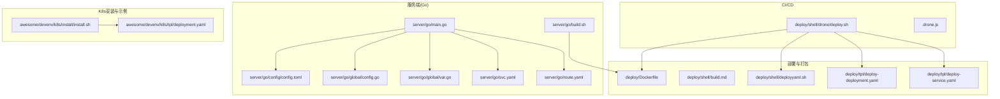
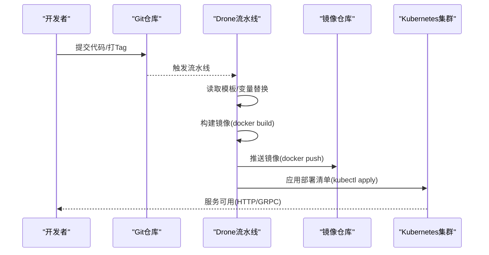
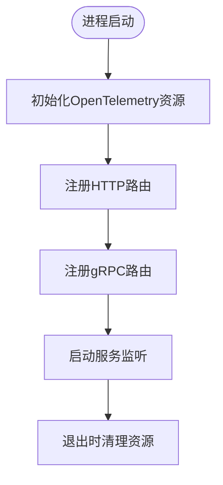
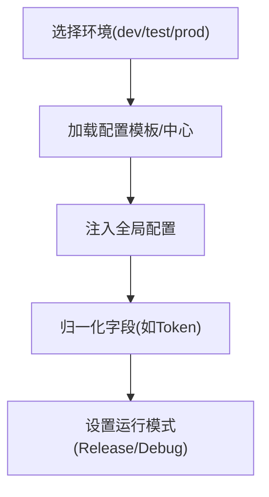
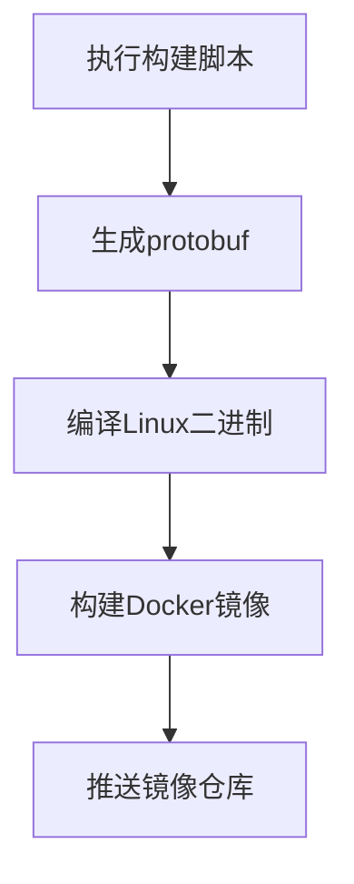
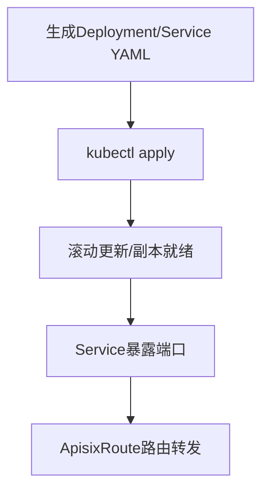
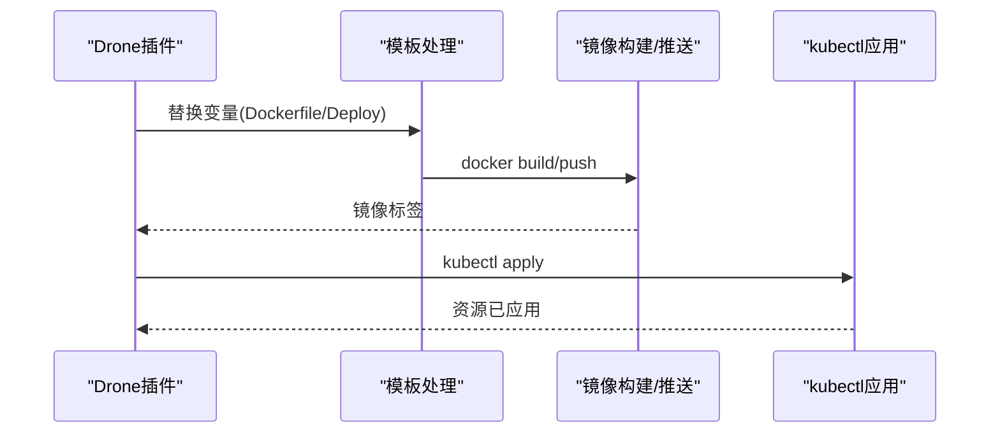
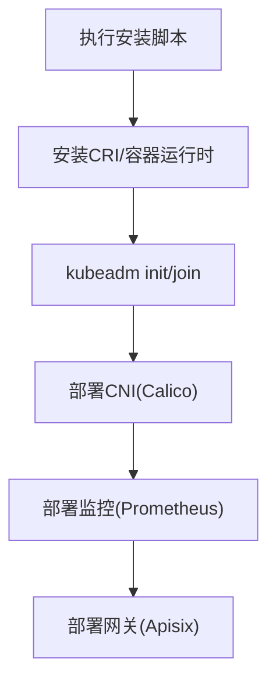
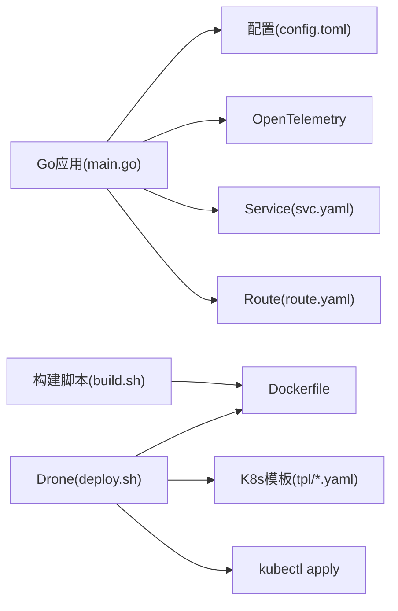

# 生产运维

<cite>
**本文引用的文件**   
- [server/go/main.go](file://server/go/main.go)
- [server/go/config/config.toml](file://server/go/config/config.toml)
- [server/go/global/config.go](file://server/go/global/config.go)
- [server/go/global/var.go](file://server/go/global/var.go)
- [server/go/build.sh](file://server/go/build.sh)
- [server/go/svc.yaml](file://server/go/svc.yaml)
- [server/go/route.yaml](file://server/go/route.yaml)
- [deploy/Dockerfile](file://deploy/Dockerfile)
- [deploy/shell/build.md](file://deploy/shell/build.md)
- [deploy/shell/deployyaml.sh](file://deploy/shell/deployyaml.sh)
- [deploy/tpl/deploy-deployment.yaml](file://deploy/tpl/deploy-deployment.yaml)
- [deploy/tpl/deploy-service.yaml](file://deploy/tpl/deploy-service.yaml)
- [deploy/shell/drone/deploy.sh](file://deploy/shell/drone/deploy.sh)
- [awesome/devenv/k8s/install/install.sh](file://awesome/devenv/k8s/install/install.sh)
- [awesome/devenv/k8s/tpl/deployment.yaml](file://awesome/devenv/k8s/tpl/deployment.yaml)
- [.drone.js](file://.drone.js)
</cite>

## 目录
1. [引言](#引言)
2. [项目结构](#项目结构)
3. [核心组件](#核心组件)
4. [架构总览](#架构总览)
5. [详细组件分析](#详细组件分析)
6. [依赖关系分析](#依赖关系分析)
7. [性能考虑](#性能考虑)
8. [故障排查指南](#故障排查指南)
9. [结论](#结论)
10. [附录](#附录)

## 引言
本指南面向Hoper生产环境的运维团队，围绕部署策略、容量规划、性能优化、配置管理、环境隔离、变更管理、故障排查、应急响应、灾难恢复、安全加固、漏洞扫描、合规检查、运维自动化、基础设施即代码（IaC）、监控告警以及团队协作与知识管理等方面，提供可落地的标准化流程与最佳实践。文档内容严格基于仓库现有文件进行提炼与组织，确保可执行性与一致性。

## 项目结构
Hoper由多模块构成，生产运维关注的关键位置包括：
- 服务端Go应用：启动入口、配置中心、全局变量与OpenTelemetry集成
- 部署与打包：Dockerfile、Kubernetes模板与Shell脚本
- CI/CD：Drone流水线脚本
- K8s安装与示例：Calico网络、Prometheus监控、Apisix网关等

**图表来源**
- [server/go/main.go:1-69](file://server/go/main.go#L1-L69)
- [server/go/config/config.toml:1-41](file://server/go/config/config.toml#L1-L41)
- [server/go/global/config.go:1-126](file://server/go/global/config.go#L1-L126)
- [server/go/global/var.go:1-18](file://server/go/global/var.go#L1-L18)
- [server/go/svc.yaml:1-34](file://server/go/svc.yaml#L1-L34)
- [server/go/route.yaml:1-48](file://server/go/route.yaml#L1-L48)
- [server/go/build.sh:1-7](file://server/go/build.sh#L1-L7)
- [deploy/Dockerfile:1-25](file://deploy/Dockerfile#L1-L25)
- [deploy/shell/build.md:1-8](file://deploy/shell/build.md#L1-L8)
- [deploy/shell/deployyaml.sh:1-89](file://deploy/shell/deployyaml.sh#L1-L89)
- [deploy/tpl/deploy-deployment.yaml:1-51](file://deploy/tpl/deploy-deployment.yaml#L1-L51)
- [deploy/tpl/deploy-service.yaml:1-16](file://deploy/tpl/deploy-service.yaml#L1-L16)
- [deploy/shell/drone/deploy.sh:1-170](file://deploy/shell/drone/deploy.sh#L1-L170)
- [awesome/devenv/k8s/install/install.sh:1-162](file://awesome/devenv/k8s/install/install.sh#L1-L162)
- [awesome/devenv/k8s/tpl/deployment.yaml:1-87](file://awesome/devenv/k8s/tpl/deployment.yaml#L1-L87)

**章节来源**
- [server/go/main.go:1-69](file://server/go/main.go#L1-L69)
- [server/go/config/config.toml:1-41](file://server/go/config/config.toml#L1-L41)
- [server/go/build.sh:1-7](file://server/go/build.sh#L1-L7)
- [deploy/Dockerfile:1-25](file://deploy/Dockerfile#L1-L25)
- [deploy/shell/build.md:1-8](file://deploy/shell/build.md#L1-L8)
- [deploy/shell/deployyaml.sh:1-89](file://deploy/shell/deployyaml.sh#L1-L89)
- [deploy/tpl/deploy-deployment.yaml:1-51](file://deploy/tpl/deploy-deployment.yaml#L1-L51)
- [deploy/tpl/deploy-service.yaml:1-16](file://deploy/tpl/deploy-service.yaml#L1-L16)
- [deploy/shell/drone/deploy.sh:1-170](file://deploy/shell/drone/deploy.sh#L1-L170)
- [awesome/devenv/k8s/install/install.sh:1-162](file://awesome/devenv/k8s/install/install.sh#L1-L162)
- [awesome/devenv/k8s/tpl/deployment.yaml:1-87](file://awesome/devenv/k8s/tpl/deployment.yaml#L1-L87)

## 核心组件
- 应用启动与服务注册：Go主程序负责初始化日志、OpenTelemetry、路由注册与服务运行。
- 配置中心与环境：通过配置文件定义开发/测试/生产环境差异，并支持本地与远端配置中心。
- 容器与镜像：统一的Dockerfile与构建脚本，便于CI/CD复用。
- Kubernetes部署：Deployment/Service/ApisixRoute模板与生成脚本，支持滚动更新与资源限制。
- CI/CD流水线：Drone脚本自动拉起模板、构建镜像、推送、生成部署清单并应用。

**章节来源**
- [server/go/main.go:28-68](file://server/go/main.go#L28-L68)
- [server/go/config/config.toml:1-41](file://server/go/config/config.toml#L1-L41)
- [server/go/build.sh:1-7](file://server/go/build.sh#L1-L7)
- [deploy/Dockerfile:1-25](file://deploy/Dockerfile#L1-L25)
- [deploy/tpl/deploy-deployment.yaml:1-51](file://deploy/tpl/deploy-deployment.yaml#L1-L51)
- [deploy/tpl/deploy-service.yaml:1-16](file://deploy/tpl/deploy-service.yaml#L1-L16)
- [deploy/shell/drone/deploy.sh:1-170](file://deploy/shell/drone/deploy.sh#L1-L170)

## 架构总览
下图展示生产环境从源码到Kubernetes的端到端交付路径，包括镜像构建、配置注入、服务暴露与路由转发。

**图表来源**
- [deploy/shell/drone/deploy.sh:77-127](file://deploy/shell/drone/deploy.sh#L77-L127)
- [server/go/build.sh:2-5](file://server/go/build.sh#L2-L5)
- [deploy/Dockerfile:1-25](file://deploy/Dockerfile#L1-L25)

## 详细组件分析

### 应用启动与服务注册
- 初始化顺序：清理钩子、HTTP/GRPC网关、时间编码、OpenTelemetry资源属性、路由注册、服务运行。
- 路由覆盖：HTTP与GRPC分别注册业务API；Pick框架用于统一处理。
- 运行模式：根据配置切换Gin运行模式。

**图表来源**
- [server/go/main.go:28-68](file://server/go/main.go#L28-L68)

**章节来源**
- [server/go/main.go:28-68](file://server/go/main.go#L28-L68)
- [server/go/global/config.go:42-50](file://server/go/global/config.go#L42-L50)

### 配置管理与环境隔离
- 环境标识：dev/test/prod三档，prod留空以便后续补充。
- 开发环境：本地模板目录、本地文件监听、Nacos配置中心（测试环境示例）。
- 运行时注入：全局配置AfterInject阶段对Token等字段进行归一化处理。
- 环境隔离：通过环境变量与配置中心实现不同环境差异化。

**图表来源**
- [server/go/config/config.toml:1-41](file://server/go/config/config.toml#L1-L41)
- [server/go/global/config.go:38-68](file://server/go/global/config.go#L38-L68)

**章节来源**
- [server/go/config/config.toml:1-41](file://server/go/config/config.toml#L1-L41)
- [server/go/global/config.go:38-68](file://server/go/global/config.go#L38-L68)

### 容器与镜像构建
- Dockerfile：多阶段基础镜像、时区设置、kubectl工具、模板与脚本拷贝。
- 构建脚本：生成protobuf、Linux二进制、Docker镜像构建与推送。
- Shell构建：多语言构建与K8s ConfigMap创建示例。

**图表来源**
- [server/go/build.sh:2-5](file://server/go/build.sh#L2-L5)
- [deploy/Dockerfile:1-25](file://deploy/Dockerfile#L1-L25)
- [deploy/shell/build.md:1-8](file://deploy/shell/build.md#L1-L8)

**章节来源**
- [server/go/build.sh:1-7](file://server/go/build.sh#L1-L7)
- [deploy/Dockerfile:1-25](file://deploy/Dockerfile#L1-L25)
- [deploy/shell/build.md:1-8](file://deploy/shell/build.md#L1-L8)

### Kubernetes部署与服务暴露
- 模板与生成：Deployment/Service模板与Shell生成脚本，支持hostPath挂载与资源限制。
- 服务暴露：ClusterIP Service与ApisixRoute，分别映射HTTP与gRPC端口。
- 路由规则：域名区分，强制HTTPS重定向。

**图表来源**
- [deploy/shell/deployyaml.sh:37-89](file://deploy/shell/deployyaml.sh#L37-L89)
- [deploy/tpl/deploy-deployment.yaml:1-51](file://deploy/tpl/deploy-deployment.yaml#L1-L51)
- [deploy/tpl/deploy-service.yaml:1-16](file://deploy/tpl/deploy-service.yaml#L1-L16)
- [server/go/svc.yaml:1-34](file://server/go/svc.yaml#L1-L34)
- [server/go/route.yaml:1-48](file://server/go/route.yaml#L1-L48)

**章节来源**
- [deploy/shell/deployyaml.sh:1-89](file://deploy/shell/deployyaml.sh#L1-L89)
- [deploy/tpl/deploy-deployment.yaml:1-51](file://deploy/tpl/deploy-deployment.yaml#L1-L51)
- [deploy/tpl/deploy-service.yaml:1-16](file://deploy/tpl/deploy-service.yaml#L1-L16)
- [server/go/svc.yaml:1-34](file://server/go/svc.yaml#L1-L34)
- [server/go/route.yaml:1-48](file://server/go/route.yaml#L1-L48)

### CI/CD与自动化
- Drone流水线：读取插件变量、处理Dockerfile与部署模板、构建镜像、推送、生成并应用K8s资源。
- 变量替换：支持应用名、镜像标签、组、数据/配置目录、定时任务等。
- 集群认证：根据集群设置API Server地址并通过认证脚本生成kubeconfig。

**图表来源**
- [deploy/shell/drone/deploy.sh:77-127](file://deploy/shell/drone/deploy.sh#L77-L127)
- [deploy/shell/drone/deploy.sh:146-167](file://deploy/shell/drone/deploy.sh#L146-L167)

**章节来源**
- [deploy/shell/drone/deploy.sh:1-170](file://deploy/shell/drone/deploy.sh#L1-L170)
- [.drone.js](file://.drone.js)

### K8s安装与网络/监控/网关
- 安装脚本：包含Docker/CRI、containerd、kubeadm、Calico网络、Prometheus监控、Apisix网关等步骤。
- 示例部署：演示hostPath挂载、资源限制、ConfigMap注入与Ingress/ApisixRoute配置。

**图表来源**
- [awesome/devenv/k8s/install/install.sh:1-162](file://awesome/devenv/k8s/install/install.sh#L1-L162)
- [awesome/devenv/k8s/tpl/deployment.yaml:1-87](file://awesome/devenv/k8s/tpl/deployment.yaml#L1-L87)

**章节来源**
- [awesome/devenv/k8s/install/install.sh:1-162](file://awesome/devenv/k8s/install/install.sh#L1-L162)
- [awesome/devenv/k8s/tpl/deployment.yaml:1-87](file://awesome/devenv/k8s/tpl/deployment.yaml#L1-L87)

## 依赖关系分析
- 组件耦合：应用层依赖全局配置与OpenTelemetry；部署层依赖Dockerfile与K8s模板；CI层依赖Drone插件变量与模板。
- 外部依赖：容器运行时、K8s API、镜像仓库、配置中心（Nacos示例）。
- 循环依赖：未见直接循环；配置注入在启动前完成，避免运行时循环。

**图表来源**
- [server/go/main.go:28-68](file://server/go/main.go#L28-L68)
- [server/go/config/config.toml:1-41](file://server/go/config/config.toml#L1-L41)
- [server/go/build.sh:2-5](file://server/go/build.sh#L2-L5)
- [deploy/shell/drone/deploy.sh:77-127](file://deploy/shell/drone/deploy.sh#L77-L127)
- [server/go/svc.yaml:1-34](file://server/go/svc.yaml#L1-L34)
- [server/go/route.yaml:1-48](file://server/go/route.yaml#L1-L48)

**章节来源**
- [server/go/main.go:28-68](file://server/go/main.go#L28-L68)
- [server/go/config/config.toml:1-41](file://server/go/config/config.toml#L1-L41)
- [server/go/build.sh:1-7](file://server/go/build.sh#L1-L7)
- [deploy/shell/drone/deploy.sh:1-170](file://deploy/shell/drone/deploy.sh#L1-L170)

## 性能考虑
- 资源配额：Deployment中显式设置requests/limits，避免资源争抢。
- 滚动更新：maxSurge/maxUnavailable平衡更新速度与稳定性。
- 网络与路由：ApisixRoute启用HTTPS重定向，减少中间层延迟。
- 日志与追踪：OpenTelemetry采集服务元数据，便于定位热点与瓶颈。
- 建议：结合Prometheus/Grafana进行指标采集与告警，按需引入HPA。

[本节为通用性能建议，无需特定文件引用]

## 故障排查指南
- 启动失败
  - 检查OpenTelemetry初始化与资源属性配置。
  - 核对路由注册是否完整（HTTP/GRPC）。
- 配置异常
  - 确认环境变量与配置中心连接正常；核对本地/远端配置优先级。
- 镜像/部署问题
  - 校验Drone变量替换是否正确；确认镜像标签与仓库权限。
  - 检查kubectl认证与集群连通性。
- 网络/路由问题
  - 校验Service端口与TargetPort；确认ApisixRoute主机与路径匹配。
- K8s安装问题
  - 参考安装脚本逐步排查CRI、CNI、监控与网关部署。

**章节来源**
- [server/go/main.go:48-54](file://server/go/main.go#L48-L54)
- [server/go/config/config.toml:13-39](file://server/go/config/config.toml#L13-L39)
- [deploy/shell/drone/deploy.sh:146-167](file://deploy/shell/drone/deploy.sh#L146-L167)
- [server/go/route.yaml:11-47](file://server/go/route.yaml#L11-L47)
- [awesome/devenv/k8s/install/install.sh:1-162](file://awesome/devenv/k8s/install/install.sh#L1-L162)

## 结论
本指南基于仓库现有文件梳理了Hoper生产环境的部署与运维要点，形成从“构建—镜像—部署—监控—排障”的闭环流程。建议在生产环境中进一步完善容量规划、安全基线、合规检查与灾备演练，持续优化可观测性与自动化水平。

[本节为总结性内容，无需特定文件引用]

## 附录

### A. 部署策略与容量规划
- 部署策略
  - 使用滚动更新，合理设置maxSurge/maxUnavailable。
  - 为每个工作负载设置明确的requests/limits。
- 容量规划
  - 基于历史峰值与P95/P99估算CPU/内存需求。
  - 为数据库/缓存/对象存储预留独立资源池。
  - 通过HPA/VPAs配合Prometheus指标动态伸缩。

[本节为通用规划建议，无需特定文件引用]

### B. 安全加固与合规检查
- 安全加固
  - 仅暴露必要端口；启用NetworkPolicy限制入站流量。
  - 使用只读根文件系统与最小权限ServiceAccount。
  - 定期轮换密钥与证书；禁用特权容器。
- 合规检查
  - 建立镜像扫描与准入策略；记录审计日志。
  - 对外域名强制HTTPS；定期检查证书有效期。

[本节为通用安全建议，无需特定文件引用]

### C. 运维自动化与IaC
- IaC
  - 使用Helm/Jsonnet/Kustomize管理K8s资源；将模板纳入版本控制。
- 自动化
  - 将Drone流水线扩展为多环境并行发布；加入质量门禁（测试/扫描/评审）。

[本节为通用自动化建议，无需特定文件引用]

### D. 运维监控与告警
- 指标采集
  - Prometheus采集应用与K8s指标；集成日志与追踪。
- 告警策略
  - 基于SLI/SLO设定阈值；区分严重/一般级别，避免告警风暴。

[本节为通用监控建议，无需特定文件引用]

### E. 团队协作与知识管理
- 角色分工
  - 明确开发、测试、运维职责边界；建立变更审批流程。
- 知识沉淀
  - 将常见问题与处置步骤沉淀为SOP；定期复盘与培训。

[本节为通用团队管理建议，无需特定文件引用]