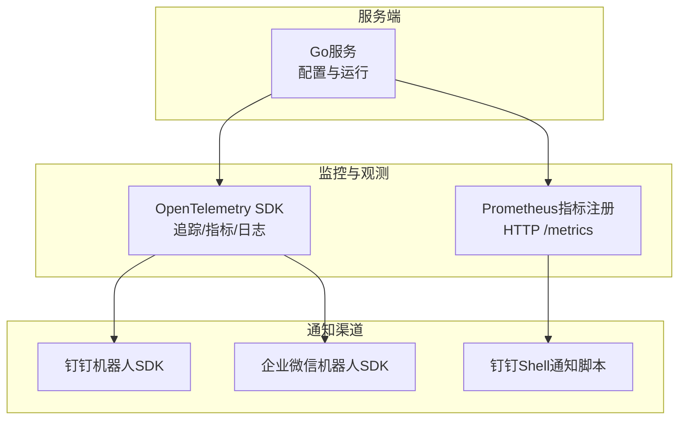
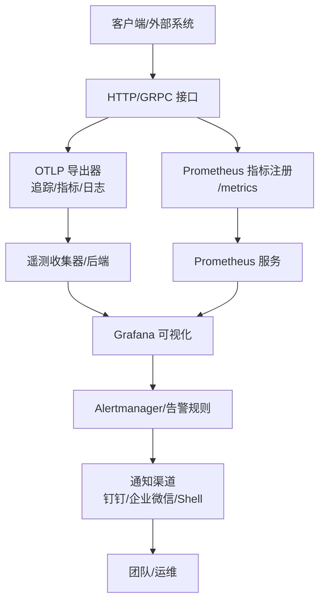
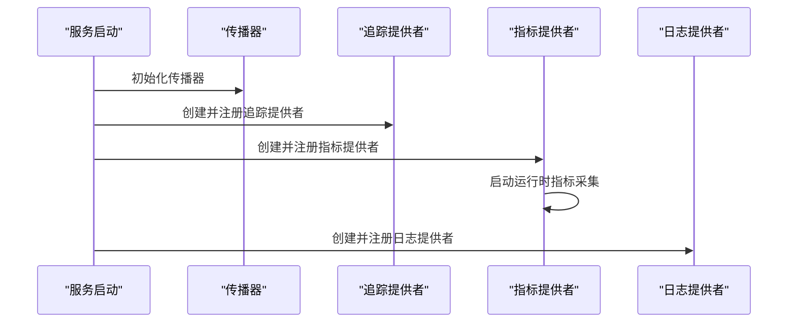
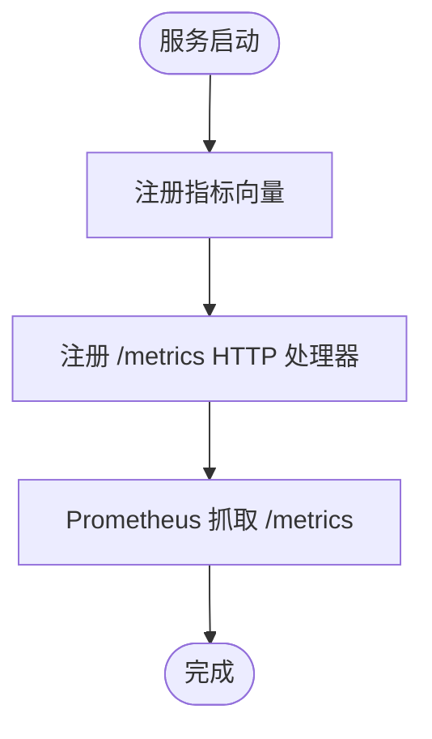
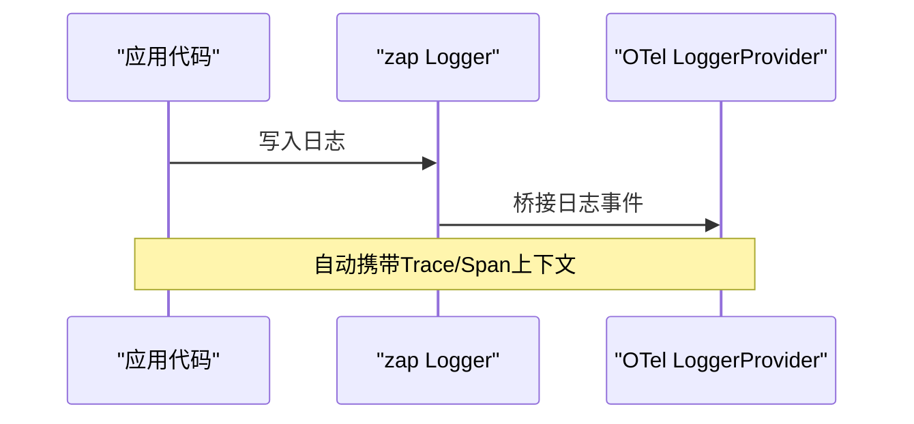
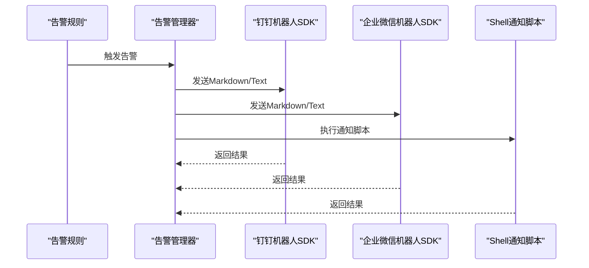
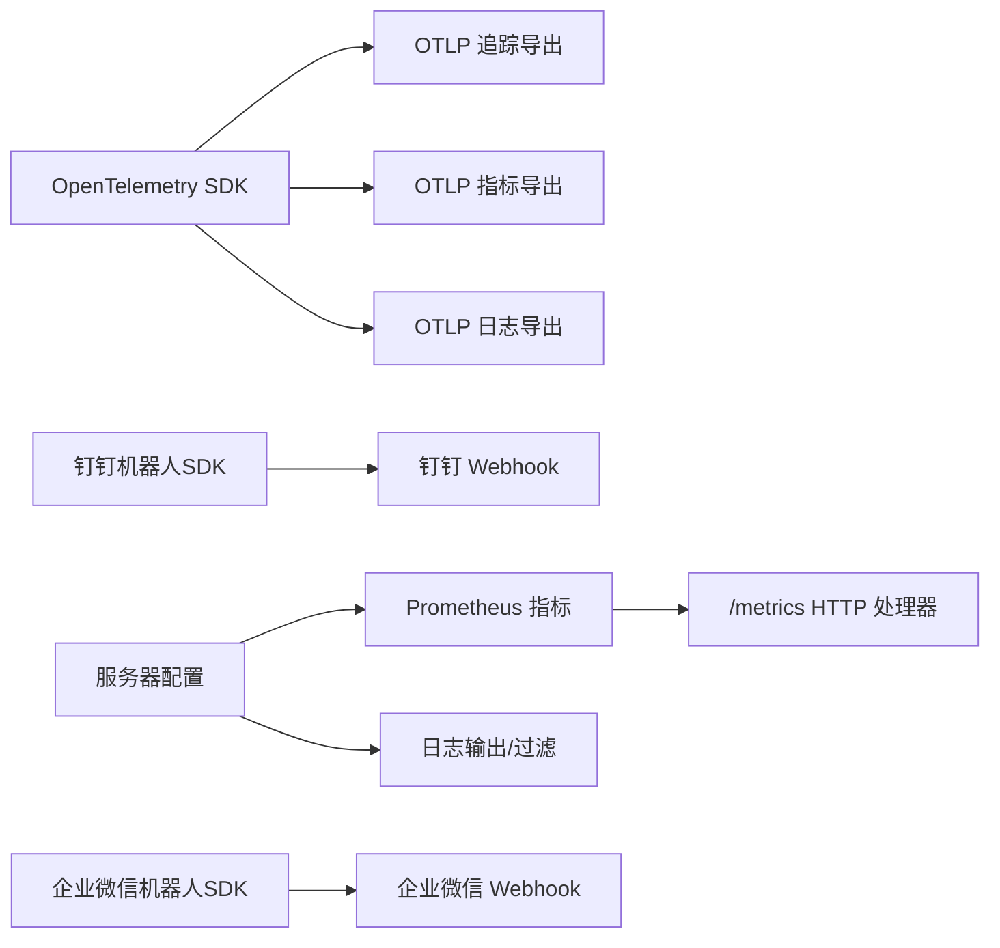

# 监控告警

<cite>
**本文引用的文件**
- [thirdparty/scaffold/otel/otel.go](file://thirdparty/scaffold/otel/otel.go)
- [thirdparty/cherry/otel.go](file://thirdparty/cherry/otel.go)
- [thirdparty/gox/log/otel.go](file://thirdparty/gox/log/otel.go)
- [thirdparty/gox/log/log.go](file://thirdparty/gox/log/log.go)
- [thirdparty/scaffold/prometheus/prometheus.go](file://thirdparty/scaffold/prometheus/prometheus.go)
- [server/go/config/config.toml](file://server/go/config/config.toml)
- [server/go/config/config.dev.toml](file://server/go/config/config.dev.toml)
- [deploy/shell/notify_dingding.sh](file://deploy/shell/notify_dingding.sh)
- [thirdparty/gox/sdk/dingtalk/robot.go](file://thirdparty/gox/sdk/dingtalk/robot.go)
- [thirdparty/gox/sdk/dingtalk/msg_type.go](file://thirdparty/gox/sdk/dingtalk/msg_type.go)
- [thirdparty/gox/log/dingcore/core.go](file://thirdparty/gox/log/dingcore/core.go)
- [thirdparty/initialize/dao/dingtalk/robot.go](file://thirdparty/initialize/dao/dingtalk/robot.go)
- [thirdparty/gox/sdk/qyweixin/robot.go](file://thirdparty/gox/sdk/qyweixin/robot.go)
- [deploy/shell/drone/notify.sh](file://deploy/shell/drone/notify.sh)
</cite>

## 目录
1. 引言
2. 项目结构
3. 核心组件
4. 架构总览
5. 详细组件分析
6. 依赖关系分析
7. 性能考虑
8. 故障排查指南
9. 结论
10. 附录

## 引言
本文件面向Hoper监控告警系统，提供从OpenTelemetry集成到Prometheus指标、Grafana可视化、告警规则与通知通道的完整配置说明。内容覆盖分布式追踪、指标采集、日志聚合、服务健康检查、性能与业务指标监控、告警规则配置、通知渠道设置与升级策略，并给出日志分析、错误追踪与性能瓶颈定位的实践建议。

## 项目结构
围绕监控告警的关键模块分布如下：
- OpenTelemetry集成：提供追踪、指标与日志的统一接入与导出能力
- Prometheus指标：提供HTTP接口与常用指标向量
- 通知渠道：钉钉、企业微信等通知SDK与脚本
- 服务器配置：服务端启用Prometheus抓取、日志过滤与超时控制

图表来源
- [thirdparty/scaffold/otel/otel.go:26-80](file://thirdparty/scaffold/otel/otel.go#L26-L80)
- [thirdparty/scaffold/prometheus/prometheus.go:85-89](file://thirdparty/scaffold/prometheus/prometheus.go#L85-L89)
- [thirdparty/gox/sdk/dingtalk/robot.go:31-39](file://thirdparty/gox/sdk/dingtalk/robot.go#L31-L39)
- [thirdparty/gox/sdk/qyweixin/robot.go:24-32](file://thirdparty/gox/sdk/qyweixin/robot.go#L24-L32)
- [deploy/shell/notify_dingding.sh:11-122](file://deploy/shell/notify_dingding.sh#L11-L122)

章节来源
- [server/go/config/config.toml:1-41](file://server/go/config/config.toml#L1-L41)
- [server/go/config/config.dev.toml:58-72](file://server/go/config/config.dev.toml#L58-L72)

## 核心组件
- OpenTelemetry SDK：统一初始化传播器、追踪、指标与日志提供者，并配置导出器
- Prometheus指标：注册常用指标向量并通过HTTP暴露
- 日志桥接：将zap日志桥接到OpenTelemetry日志
- 通知渠道：钉钉、企业微信机器人SDK与Shell脚本
- 服务器配置：开启Prometheus抓取、设置日志前缀白/黑名单、超时等

章节来源
- [thirdparty/scaffold/otel/otel.go:26-80](file://thirdparty/scaffold/otel/otel.go#L26-L80)
- [thirdparty/scaffold/prometheus/prometheus.go:28-89](file://thirdparty/scaffold/prometheus/prometheus.go#L28-L89)
- [thirdparty/gox/log/otel.go:9-11](file://thirdparty/gox/log/otel.go#L9-L11)
- [thirdparty/gox/log/log.go:19-267](file://thirdparty/gox/log/log.go#L19-L267)
- [thirdparty/gox/sdk/dingtalk/robot.go:31-39](file://thirdparty/gox/sdk/dingtalk/robot.go#L31-L39)
- [thirdparty/gox/sdk/qyweixin/robot.go:24-32](file://thirdparty/gox/sdk/qyweixin/robot.go#L24-L32)
- [server/go/config/config.dev.toml:58-72](file://server/go/config/config.dev.toml#L58-L72)

## 架构总览
下图展示了Hoper监控告警系统的整体架构：服务端通过OpenTelemetry统一采集追踪、指标与日志；Prometheus负责指标抓取；通知渠道通过SDK与脚本实现告警推送。

图表来源
- [thirdparty/scaffold/otel/otel.go:89-134](file://thirdparty/scaffold/otel/otel.go#L89-L134)
- [thirdparty/scaffold/prometheus/prometheus.go:85-89](file://thirdparty/scaffold/prometheus/prometheus.go#L85-L89)
- [deploy/shell/notify_dingding.sh:11-122](file://deploy/shell/notify_dingding.sh#L11-L122)
- [thirdparty/gox/sdk/dingtalk/robot.go:31-39](file://thirdparty/gox/sdk/dingtalk/robot.go#L31-L39)
- [thirdparty/gox/sdk/qyweixin/robot.go:24-32](file://thirdparty/gox/sdk/qyweixin/robot.go#L24-L32)

## 详细组件分析

### OpenTelemetry集成配置
- 传播器：设置TraceContext与Baggage传播
- 追踪：批量导出至OTLP追踪端点，采样率可控
- 指标：周期性读取导出至OTLP指标端点，内置运行时指标采集
- 日志：批量处理器导出至OTLP日志端点，支持zap桥接

图表来源
- [thirdparty/scaffold/otel/otel.go:82-134](file://thirdparty/scaffold/otel/otel.go#L82-L134)

章节来源
- [thirdparty/scaffold/otel/otel.go:26-80](file://thirdparty/scaffold/otel/otel.go#L26-L80)
- [thirdparty/cherry/otel.go:22-92](file://thirdparty/cherry/otel.go#L22-L92)
- [thirdparty/gox/log/otel.go:9-11](file://thirdparty/gox/log/otel.go#L9-L11)

### Prometheus监控指标与抓取
- 指标注册：计数器、直方图、摘要、瞬时值等
- 抓取端点：/metrics
- 服务端开关：可在配置中启用/禁用Prometheus抓取

图表来源
- [thirdparty/scaffold/prometheus/prometheus.go:50-89](file://thirdparty/scaffold/prometheus/prometheus.go#L50-L89)

章节来源
- [thirdparty/scaffold/prometheus/prometheus.go:28-89](file://thirdparty/scaffold/prometheus/prometheus.go#L28-L89)
- [server/go/config/config.dev.toml:67-67](file://server/go/config/config.dev.toml#L67-L67)

### 日志桥接与上下文追踪
- zap日志桥接：将zap日志输出桥接到OTel日志提供者
- 上下文字段：自动注入traceId/spanId便于跨系统关联

图表来源
- [thirdparty/gox/log/otel.go:9-11](file://thirdparty/gox/log/otel.go#L9-L11)
- [thirdparty/gox/log/log.go:246-266](file://thirdparty/gox/log/log.go#L246-L266)

章节来源
- [thirdparty/gox/log/otel.go:9-11](file://thirdparty/gox/log/otel.go#L9-L11)
- [thirdparty/gox/log/log.go:19-267](file://thirdparty/gox/log/log.go#L19-L267)

### 通知渠道配置与告警升级
- 钉钉机器人：支持文本、Markdown、链接、动作卡片等多种消息类型
- 企业微信机器人：支持文本与Markdown消息
- Shell通知脚本：用于CI/CD或运维场景的钉钉通知
- 机器人配置注入：通过初始化模块注入钉钉机器人配置

图表来源
- [thirdparty/gox/sdk/dingtalk/robot.go:31-39](file://thirdparty/gox/sdk/dingtalk/robot.go#L31-L39)
- [thirdparty/gox/sdk/dingtalk/msg_type.go:29-74](file://thirdparty/gox/sdk/dingtalk/msg_type.go#L29-L74)
- [thirdparty/gox/sdk/qyweixin/robot.go:24-32](file://thirdparty/gox/sdk/qyweixin/robot.go#L24-L32)
- [deploy/shell/notify_dingding.sh:11-122](file://deploy/shell/notify_dingding.sh#L11-L122)
- [thirdparty/initialize/dao/dingtalk/robot.go:16-30](file://thirdparty/initialize/dao/dingtalk/robot.go#L16-L30)

章节来源
- [thirdparty/gox/sdk/dingtalk/robot.go:31-39](file://thirdparty/gox/sdk/dingtalk/robot.go#L31-L39)
- [thirdparty/gox/sdk/dingtalk/msg_type.go:29-74](file://thirdparty/gox/sdk/dingtalk/msg_type.go#L29-L74)
- [thirdparty/gox/log/dingcore/core.go:57-63](file://thirdparty/gox/log/dingcore/core.go#L57-L63)
- [thirdparty/initialize/dao/dingtalk/robot.go:16-30](file://thirdparty/initialize/dao/dingtalk/robot.go#L16-L30)
- [deploy/shell/notify_dingding.sh:11-122](file://deploy/shell/notify_dingding.sh#L11-L122)
- [deploy/shell/drone/notify.sh:13-62](file://deploy/shell/drone/notify.sh#L13-L62)

## 依赖关系分析
- OpenTelemetry SDK依赖OTLP导出器，分别导出追踪、指标与日志
- Prometheus指标通过HTTP处理器暴露
- 通知渠道依赖钉钉/企业微信的Webhook接口
- 服务器配置影响日志输出与指标抓取行为

图表来源
- [thirdparty/scaffold/otel/otel.go:89-134](file://thirdparty/scaffold/otel/otel.go#L89-L134)
- [thirdparty/scaffold/prometheus/prometheus.go:85-89](file://thirdparty/scaffold/prometheus/prometheus.go#L85-L89)
- [thirdparty/gox/sdk/dingtalk/robot.go:31-39](file://thirdparty/gox/sdk/dingtalk/robot.go#L31-L39)
- [thirdparty/gox/sdk/qyweixin/robot.go:24-32](file://thirdparty/gox/sdk/qyweixin/robot.go#L24-L32)
- [server/go/config/config.dev.toml:58-72](file://server/go/config/config.dev.toml#L58-L72)

章节来源
- [thirdparty/scaffold/otel/otel.go:26-80](file://thirdparty/scaffold/otel/otel.go#L26-L80)
- [thirdparty/scaffold/prometheus/prometheus.go:28-89](file://thirdparty/scaffold/prometheus/prometheus.go#L28-L89)
- [server/go/config/config.dev.toml:58-72](file://server/go/config/config.dev.toml#L58-L72)

## 性能考虑
- 指标采集间隔：OTel指标提供者采用周期性读取，默认10秒
- 运行时指标：启用运行时指标采集，最小读取间隔可调
- 日志批处理：OTLP日志采用批处理器，降低网络开销
- Prometheus抓取：建议合理设置抓取间隔，避免对服务端造成压力

章节来源
- [thirdparty/scaffold/otel/otel.go:104-121](file://thirdparty/scaffold/otel/otel.go#L104-L121)
- [thirdparty/scaffold/prometheus/prometheus.go:85-89](file://thirdparty/scaffold/prometheus/prometheus.go#L85-L89)

## 故障排查指南
- OpenTelemetry错误处理：SDK设置错误处理器，记录OTel SDK错误
- 日志上下文：确保日志中包含traceId/spanId以便追踪
- 通知渠道：检查钉钉/企业微信机器人Webhook配置与签名（如需）
- Shell通知：确认环境变量与重试逻辑

章节来源
- [thirdparty/scaffold/otel/otel.go:48-50](file://thirdparty/scaffold/otel/otel.go#L48-L50)
- [thirdparty/gox/log/log.go:246-266](file://thirdparty/gox/log/log.go#L246-L266)
- [thirdparty/gox/sdk/dingtalk/robot.go:41-55](file://thirdparty/gox/sdk/dingtalk/robot.go#L41-L55)
- [deploy/shell/notify_dingding.sh:84-113](file://deploy/shell/notify_dingding.sh#L84-L113)

## 结论
Hoper监控告警体系以OpenTelemetry为核心，统一了追踪、指标与日志的采集与导出；Prometheus负责指标抓取与持久化；通知渠道覆盖钉钉、企业微信与Shell脚本，满足多场景告警需求。结合服务器配置与日志桥接，可实现从服务健康检查到性能瓶颈定位的全链路可观测性。

## 附录

### OpenTelemetry配置要点
- 传播器：TraceContext + Baggage
- 追踪导出：OTLP HTTP，采样率0.1
- 指标导出：OTLP HTTP，周期10秒
- 日志导出：OTLP HTTP，批处理
- zap桥接：将zap日志桥接到OTel日志提供者

章节来源
- [thirdparty/scaffold/otel/otel.go:82-134](file://thirdparty/scaffold/otel/otel.go#L82-L134)
- [thirdparty/gox/log/otel.go:9-11](file://thirdparty/gox/log/otel.go#L9-L11)

### Prometheus指标清单与抓取
- 指标类型：计数器、瞬时值、直方图、摘要
- 抓取端点：/metrics
- 开关位置：服务器配置中启用Prometheus抓取

章节来源
- [thirdparty/scaffold/prometheus/prometheus.go:50-89](file://thirdparty/scaffold/prometheus/prometheus.go#L50-L89)
- [server/go/config/config.dev.toml:67-67](file://server/go/config/config.dev.toml#L67-L67)

### 通知渠道配置示例
- 钉钉：支持多种消息类型，可带@提醒
- 企业微信：支持文本与Markdown
- Shell脚本：支持钉钉Webhook，带重试逻辑

章节来源
- [thirdparty/gox/sdk/dingtalk/msg_type.go:29-74](file://thirdparty/gox/sdk/dingtalk/msg_type.go#L29-L74)
- [thirdparty/gox/sdk/qyweixin/robot.go:24-32](file://thirdparty/gox/sdk/qyweixin/robot.go#L24-L32)
- [deploy/shell/notify_dingding.sh:11-122](file://deploy/shell/notify_dingding.sh#L11-L122)

### 服务器配置关键项
- Prometheus抓取开关
- 日志输出路径与编码
- 请求超时与日志前缀白/黑名单

章节来源
- [server/go/config/config.dev.toml:58-72](file://server/go/config/config.dev.toml#L58-L72)
- [server/go/config/config.toml:1-41](file://server/go/config/config.toml#L1-L41)