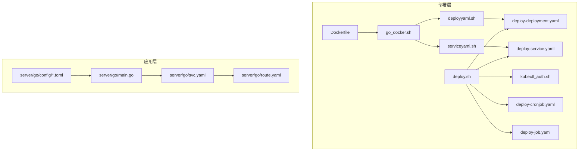
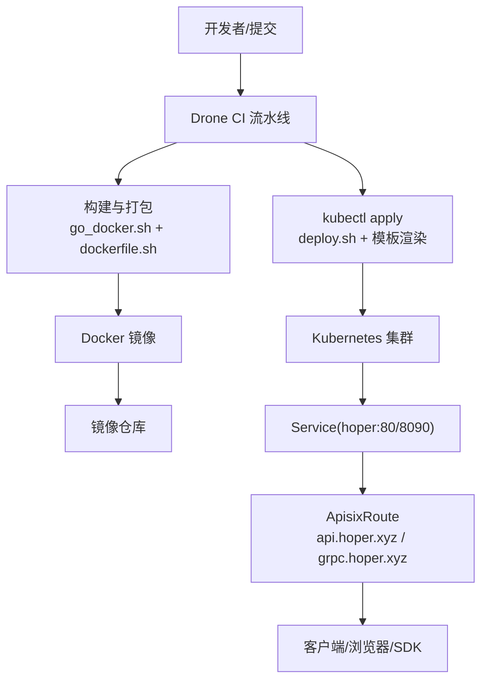
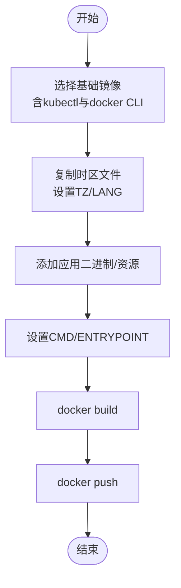
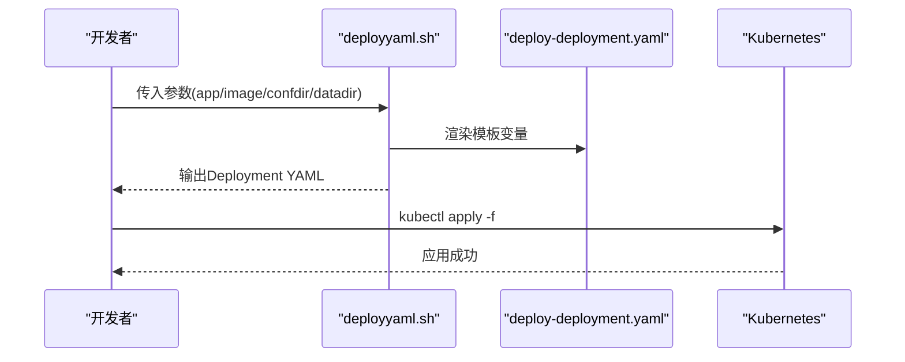
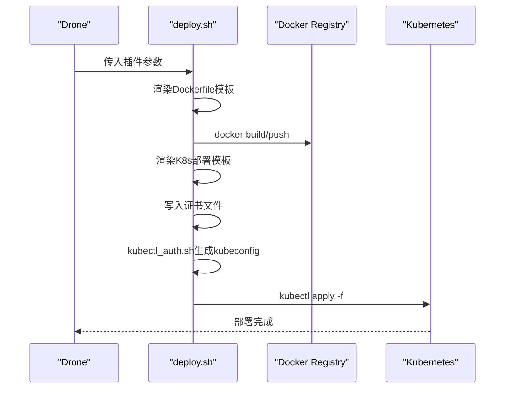
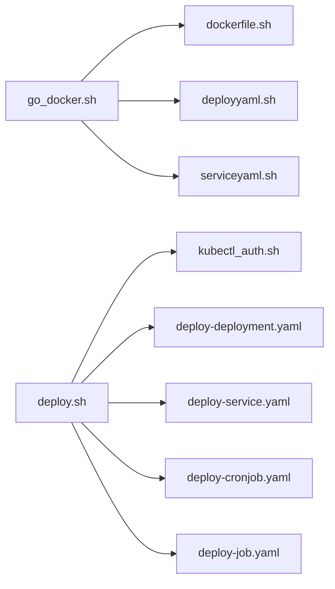

# 部署运维

<cite>
**本文档引用的文件**
- [Dockerfile](file://deploy/Dockerfile)
- [go_docker.sh](file://deploy/shell/go_docker.sh)
- [dockerfile.sh](file://deploy/shell/dockerfile.sh)
- [deployyaml.sh](file://deploy/shell/deployyaml.sh)
- [serviceyaml.sh](file://deploy/shell/serviceyaml.sh)
- [deploy-deployment.yaml](file://deploy/tpl/deploy-deployment.yaml)
- [deploy-service.yaml](file://deploy/tpl/deploy-service.yaml)
- [deploy-cronjob.yaml](file://deploy/tpl/deploy-cronjob.yaml)
- [deploy-job.yaml](file://deploy/tpl/deploy-job.yaml)
- [deploy.sh](file://deploy/shell/drone/deploy.sh)
- [kubectl_auth.sh](file://deploy/shell/kubectl_auth.sh)
- [main.go](file://server/go/main.go)
- [svc.yaml](file://server/go/svc.yaml)
- [route.yaml](file://server/go/route.yaml)
- [config.toml](file://server/go/config/config.toml)
- [config.dev.toml](file://server/go/config/config.dev.toml)
</cite>

## 目录
1. [简介](#简介)
2. [项目结构](#项目结构)
3. [核心组件](#核心组件)
4. [架构总览](#架构总览)
5. [详细组件分析](#详细组件分析)
6. [依赖关系分析](#依赖关系分析)
7. [性能考虑](#性能考虑)
8. [故障排除指南](#故障排除指南)
9. [结论](#结论)
10. [附录](#附录)

## 简介
本文件面向Hoper项目的部署与运维团队，提供从本地开发到生产级Kubernetes集群的完整部署指南。内容涵盖：
- Docker容器化策略：镜像构建、多阶段构建思路、时区与工具链准备
- Kubernetes部署：Deployment、Service、CronJob、Job及模板变量替换
- CI/CD流水线：基于Drone的自动化构建与部署流程
- 监控与日志：OpenTelemetry与Prometheus集成、日志级别与输出路径
- 性能优化与最佳实践：资源配置、滚动更新策略、静态资源挂载
- 故障排除：常见问题定位与修复建议

## 项目结构
围绕部署与运维的关键目录与文件如下：
- deploy/Dockerfile：基础镜像与工具链准备
- deploy/shell/*：构建脚本、模板生成与kubectl认证
- deploy/tpl/*：Kubernetes资源模板（Deployment/Service/CronJob/Job）
- server/go/*：Go服务入口、路由与配置
- server/go/config/*：运行时配置模板与环境差异

图表来源
- [Dockerfile:1-25](file://deploy/Dockerfile#L1-L25)
- [go_docker.sh:1-52](file://deploy/shell/go_docker.sh#L1-L52)
- [deployyaml.sh:1-89](file://deploy/shell/deployyaml.sh#L1-L89)
- [serviceyaml.sh:1-42](file://deploy/shell/serviceyaml.sh#L1-L42)
- [deploy-deployment.yaml:1-51](file://deploy/tpl/deploy-deployment.yaml#L1-L51)
- [deploy-service.yaml:1-16](file://deploy/tpl/deploy-service.yaml#L1-L16)
- [deploy-cronjob.yaml:1-44](file://deploy/tpl/deploy-cronjob.yaml#L1-L44)
- [deploy-job.yaml:1-40](file://deploy/tpl/deploy-job.yaml#L1-L40)
- [deploy.sh:1-170](file://deploy/shell/drone/deploy.sh#L1-L170)
- [kubectl_auth.sh:1-15](file://deploy/shell/kubectl_auth.sh#L1-L15)
- [main.go:1-69](file://server/go/main.go#L1-L69)
- [svc.yaml:1-34](file://server/go/svc.yaml#L1-L34)
- [route.yaml:1-48](file://server/go/route.yaml#L1-L48)
- [config.toml:1-41](file://server/go/config/config.toml#L1-L41)
- [config.dev.toml:1-90](file://server/go/config/config.dev.toml#L1-L90)

章节来源
- [Dockerfile:1-25](file://deploy/Dockerfile#L1-L25)
- [go_docker.sh:1-52](file://deploy/shell/go_docker.sh#L1-L52)
- [deployyaml.sh:1-89](file://deploy/shell/deployyaml.sh#L1-L89)
- [serviceyaml.sh:1-42](file://deploy/shell/serviceyaml.sh#L1-L42)
- [deploy-deployment.yaml:1-51](file://deploy/tpl/deploy-deployment.yaml#L1-L51)
- [deploy-service.yaml:1-16](file://deploy/tpl/deploy-service.yaml#L1-L16)
- [deploy-cronjob.yaml:1-44](file://deploy/tpl/deploy-cronjob.yaml#L1-L44)
- [deploy-job.yaml:1-40](file://deploy/tpl/deploy-job.yaml#L1-L40)
- [deploy.sh:1-170](file://deploy/shell/drone/deploy.sh#L1-L170)
- [kubectl_auth.sh:1-15](file://deploy/shell/kubectl_auth.sh#L1-L15)
- [main.go:1-69](file://server/go/main.go#L1-L69)
- [svc.yaml:1-34](file://server/go/svc.yaml#L1-L34)
- [route.yaml:1-48](file://server/go/route.yaml#L1-L48)
- [config.toml:1-41](file://server/go/config/config.toml#L1-L41)
- [config.dev.toml:1-90](file://server/go/config/config.dev.toml#L1-L90)

## 核心组件
- 容器镜像与工具链
  - 基础镜像包含kubectl与docker CLI，便于在容器内执行集群管理与镜像构建
  - 通过时区镜像将Asia/Shanghai时区注入容器，确保日志与定时任务时区正确
- 部署模板
  - Deployment模板支持滚动更新、资源请求/限制、hostPath卷挂载至配置与数据目录
  - Service模板将HTTP与gRPC统一暴露至80与8090端口
  - CronJob/Job模板支持定时任务与一次性任务，挂载配置、数据与静态资源目录
- CI/CD脚本
  - Drone流水线脚本负责Dockerfile模板渲染、镜像构建/推送、K8s资源apply
  - kubectl认证脚本根据传入参数生成kubeconfig并切换上下文
- 应用入口与配置
  - Go服务入口注册多个API模块，启用OpenTelemetry与Prometheus指标
  - 配置文件区分dev/test/prod环境，并可加载本地或Nacos配置中心

章节来源
- [Dockerfile:1-25](file://deploy/Dockerfile#L1-L25)
- [deploy-deployment.yaml:1-51](file://deploy/tpl/deploy-deployment.yaml#L1-L51)
- [deploy-service.yaml:1-16](file://deploy/tpl/deploy-service.yaml#L1-L16)
- [deploy-cronjob.yaml:1-44](file://deploy/tpl/deploy-cronjob.yaml#L1-L44)
- [deploy-job.yaml:1-40](file://deploy/tpl/deploy-job.yaml#L1-L40)
- [deploy.sh:1-170](file://deploy/shell/drone/deploy.sh#L1-L170)
- [kubectl_auth.sh:1-15](file://deploy/shell/kubectl_auth.sh#L1-L15)
- [main.go:1-69](file://server/go/main.go#L1-L69)
- [config.toml:1-41](file://server/go/config/config.toml#L1-L41)
- [config.dev.toml:1-90](file://server/go/config/config.dev.toml#L1-L90)

## 架构总览
下图展示从代码到Kubernetes集群的端到端部署路径，包括Drone流水线、镜像构建、K8s资源应用与外部流量接入。

图表来源
- [go_docker.sh:1-52](file://deploy/shell/go_docker.sh#L1-L52)
- [dockerfile.sh:1-29](file://deploy/shell/dockerfile.sh#L1-L29)
- [deploy.sh:1-170](file://deploy/shell/drone/deploy.sh#L1-L170)
- [deploy-deployment.yaml:1-51](file://deploy/tpl/deploy-deployment.yaml#L1-L51)
- [deploy-service.yaml:1-16](file://deploy/tpl/deploy-service.yaml#L1-L16)
- [svc.yaml:1-34](file://server/go/svc.yaml#L1-L34)
- [route.yaml:1-48](file://server/go/route.yaml#L1-L48)

## 详细组件分析

### Docker容器化策略
- 多阶段思路
  - 当前Dockerfile直接引入kubectl与docker CLI，适合在容器内进行部署
  - 如需更严格的构建分离，可参考go_docker.sh中的多阶段思路：先在Linux环境下编译二进制，再写入Dockerfile并构建镜像
- 时区与语言
  - 通过复制zoneinfo与设置TZ/LANG确保容器内时间与字符集一致
- 工具链
  - 预装kubectl与docker CLI，便于在CI中直接执行kubectl apply与docker build/push

图表来源
- [Dockerfile:1-25](file://deploy/Dockerfile#L1-L25)
- [go_docker.sh:1-52](file://deploy/shell/go_docker.sh#L1-L52)
- [dockerfile.sh:1-29](file://deploy/shell/dockerfile.sh#L1-L29)

章节来源
- [Dockerfile:1-25](file://deploy/Dockerfile#L1-L25)
- [go_docker.sh:1-52](file://deploy/shell/go_docker.sh#L1-L52)
- [dockerfile.sh:1-29](file://deploy/shell/dockerfile.sh#L1-L29)

### Kubernetes部署配置
- Deployment
  - 支持滚动更新策略，最小就绪秒数与并发控制
  - 资源请求/限制已预设，可根据实际负载调整
  - 通过hostPath挂载配置与数据目录，便于持久化与调试
- Service
  - 统一暴露HTTP(80)与gRPC(8090)，便于前端与SDK访问
- CronJob/Job
  - 支持定时任务与一次性任务，挂载配置、数据与静态资源目录
- 模板变量
  - 通过脚本批量替换模板中的变量（如app、image、group、datadir、confdir、schedule）

图表来源
- [deployyaml.sh:1-89](file://deploy/shell/deployyaml.sh#L1-L89)
- [deploy-deployment.yaml:1-51](file://deploy/tpl/deploy-deployment.yaml#L1-L51)

章节来源
- [deploy-deployment.yaml:1-51](file://deploy/tpl/deploy-deployment.yaml#L1-L51)
- [deploy-service.yaml:1-16](file://deploy/tpl/deploy-service.yaml#L1-L16)
- [deploy-cronjob.yaml:1-44](file://deploy/tpl/deploy-cronjob.yaml#L1-L44)
- [deploy-job.yaml:1-40](file://deploy/tpl/deploy-job.yaml#L1-L40)
- [deployyaml.sh:1-89](file://deploy/shell/deployyaml.sh#L1-L89)
- [serviceyaml.sh:1-42](file://deploy/shell/serviceyaml.sh#L1-L42)

### CI/CD流水线（Drone）
- 触发条件
  - 由Drone根据分支/标签触发，读取插件参数
- 步骤分解
  1) 渲染Dockerfile模板：根据构建类型与命令替换变量
  2) 构建镜像并推送：登录仓库后执行docker build与push
  3) 渲染K8s部署文件：按部署类型替换变量（app、image、group、datadir、confdir、schedule）
  4) 凭证注入：将Base64编码的CA/证书写入文件
  5) kubectl认证：根据集群设置server并生成kubeconfig
  6) 应用资源：删除旧资源（针对job/cronjob）后apply新资源
- 变量来源
  - 通过Drone插件传递的环境变量驱动模板渲染与kubectl配置

图表来源
- [deploy.sh:1-170](file://deploy/shell/drone/deploy.sh#L1-L170)
- [kubectl_auth.sh:1-15](file://deploy/shell/kubectl_auth.sh#L1-L15)

章节来源
- [deploy.sh:1-170](file://deploy/shell/drone/deploy.sh#L1-L170)
- [kubectl_auth.sh:1-15](file://deploy/shell/kubectl_auth.sh#L1-L15)

### 监控与日志
- OpenTelemetry
  - 服务启动时初始化资源属性（服务名等），并设置SDK
- Prometheus
  - 通过导入prometheus包启用指标导出
- 日志
  - 开发环境启用控制台输出与调试级别
  - 可配置输出路径与编码器，便于集中收集

章节来源
- [main.go:1-69](file://server/go/main.go#L1-L69)
- [config.dev.toml:1-90](file://server/go/config/config.dev.toml#L1-L90)

### 流量接入与路由
- Service
  - 暴露HTTP与gRPC端口，供上游网关转发
- ApisixRoute
  - 通过域名区分HTTP与gRPC流量，统一重定向至HTTPS
  - 支持WebSocket与插件扩展

章节来源
- [svc.yaml:1-34](file://server/go/svc.yaml#L1-L34)
- [route.yaml:1-48](file://server/go/route.yaml#L1-L48)

## 依赖关系分析
- 组件耦合
  - go_docker.sh依赖dockerfile.sh生成Dockerfile
  - deployyaml.sh/serviceyaml.sh用于生成K8s资源
  - deploy.sh作为CI入口，串联模板渲染、镜像构建与kubectl应用
- 外部依赖
  - Docker Registry：镜像存储与拉取
  - Kubernetes：资源调度与暴露
  - Apisix：外部流量接入与路由

图表来源
- [go_docker.sh:1-52](file://deploy/shell/go_docker.sh#L1-L52)
- [dockerfile.sh:1-29](file://deploy/shell/dockerfile.sh#L1-L29)
- [deployyaml.sh:1-89](file://deploy/shell/deployyaml.sh#L1-L89)
- [serviceyaml.sh:1-42](file://deploy/shell/serviceyaml.sh#L1-L42)
- [deploy.sh:1-170](file://deploy/shell/drone/deploy.sh#L1-L170)
- [kubectl_auth.sh:1-15](file://deploy/shell/kubectl_auth.sh#L1-L15)
- [deploy-deployment.yaml:1-51](file://deploy/tpl/deploy-deployment.yaml#L1-L51)
- [deploy-service.yaml:1-16](file://deploy/tpl/deploy-service.yaml#L1-L16)
- [deploy-cronjob.yaml:1-44](file://deploy/tpl/deploy-cronjob.yaml#L1-L44)
- [deploy-job.yaml:1-40](file://deploy/tpl/deploy-job.yaml#L1-L40)

章节来源
- [go_docker.sh:1-52](file://deploy/shell/go_docker.sh#L1-L52)
- [deploy.sh:1-170](file://deploy/shell/drone/deploy.sh#L1-L170)

## 性能考虑
- 资源配额
  - Deployment模板已设置较低的requests/limits，建议结合压测结果逐步调优
- 滚动更新
  - maxSurge与maxUnavailable允许平滑升级，避免流量中断
- 存储
  - hostPath卷便于快速部署，生产建议使用PersistentVolume以提升可靠性
- 网络
  - Service统一端口暴露，配合上游网关实现多协议与TLS终止

## 故障排除指南
- 镜像构建失败
  - 检查go_docker.sh中的构建命令与目标路径
  - 确认dockerfile.sh生成的Dockerfile包含正确的CMD/ENTRYPOINT
- 镜像推送失败
  - 确认Docker仓库用户名/密码与镜像tag格式
- K8s资源应用失败
  - 检查deploy.sh中模板变量替换是否正确
  - 确认kubectl_auth.sh生成的kubeconfig有效且指向正确集群
- 时区异常
  - 确认Dockerfile中时区镜像与TZ设置
- 日志与指标
  - 开启开发环境日志级别，检查输出路径
  - 确认Prometheus指标端点可达

章节来源
- [go_docker.sh:1-52](file://deploy/shell/go_docker.sh#L1-L52)
- [dockerfile.sh:1-29](file://deploy/shell/dockerfile.sh#L1-L29)
- [deploy.sh:1-170](file://deploy/shell/drone/deploy.sh#L1-L170)
- [kubectl_auth.sh:1-15](file://deploy/shell/kubectl_auth.sh#L1-L15)
- [Dockerfile:1-25](file://deploy/Dockerfile#L1-L25)
- [config.dev.toml:1-90](file://server/go/config/config.dev.toml#L1-L90)

## 结论
本文档提供了Hoper项目的端到端部署与运维方案，覆盖容器化、Kubernetes编排、CI/CD流水线、监控日志与性能优化。建议在生产环境中进一步完善持久化、安全策略与可观测性配置，并结合业务流量特征持续优化资源配置与更新策略。

## 附录
- 环境变量与参数
  - Docker构建：BUILD_TYPE、DOCKER_CMD、IMAGE_TAG
  - K8s部署：DEPLOY_KIND、DATA_DIR、CONF_DIR、SCHEDULE、CLUSTER
  - 服务端配置：Env、Server.Addr、Prometheus开关、日志级别
- 最佳实践
  - 使用独立命名空间隔离不同环境
  - 为生产环境启用PVC与Secret管理敏感信息
  - 为关键Deployment配置HPA以应对突发流量
  - 在CI中增加健康检查与回滚策略