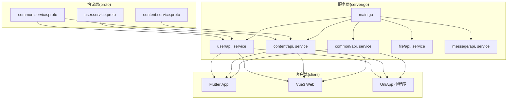
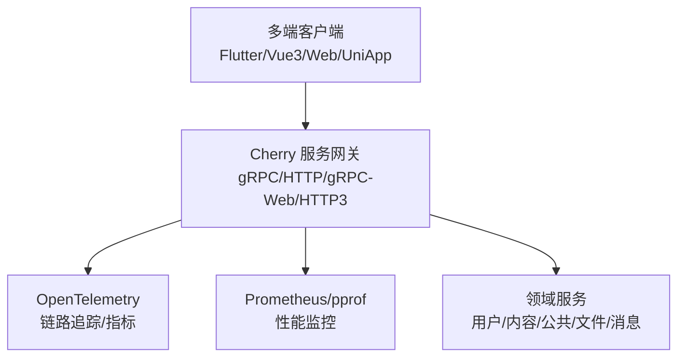
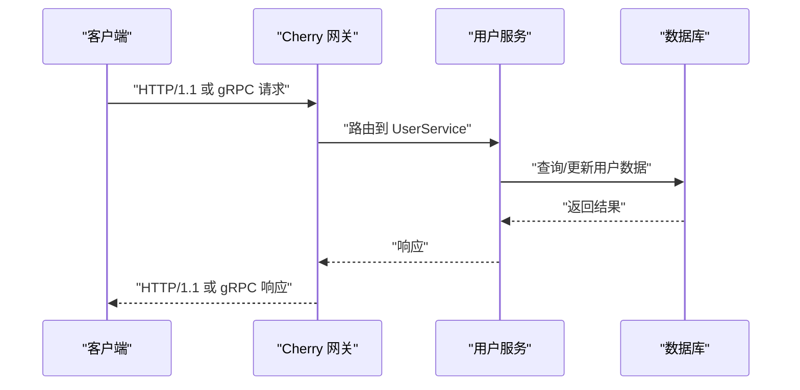
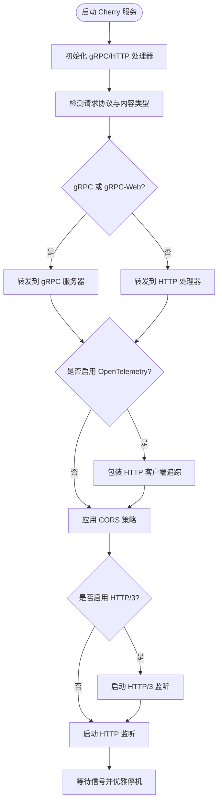
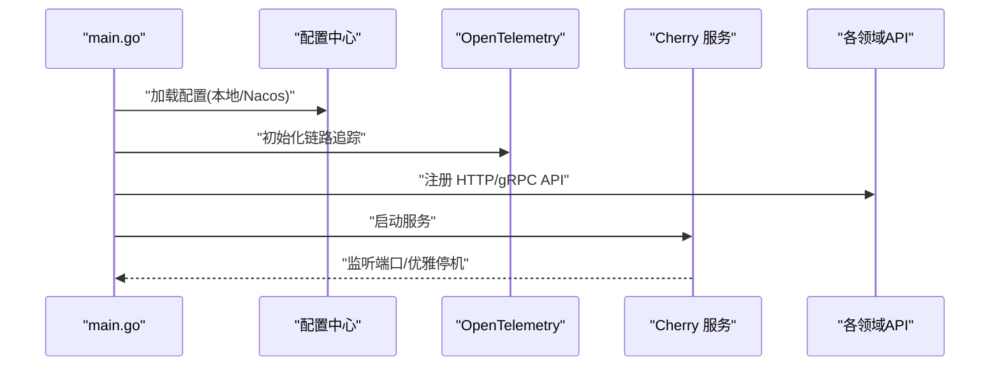
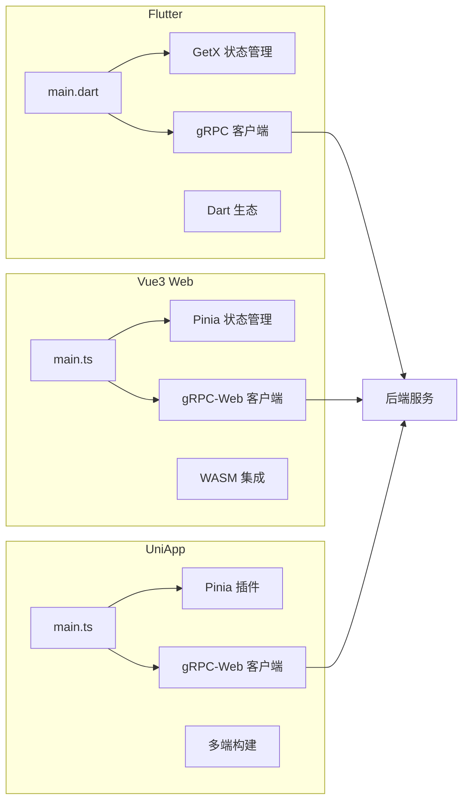
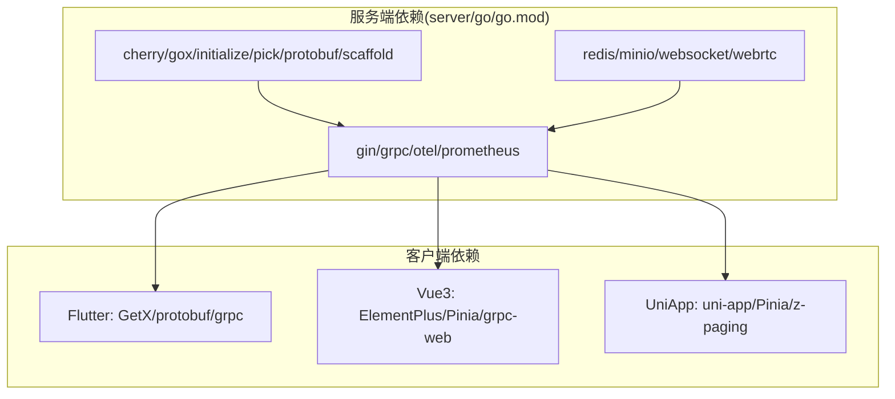

# 项目概述

<cite>
**本文档引用的文件**
- [README.md](file://README.md)
- [proto/common/common.service.proto](file://proto/common/common.service.proto)
- [proto/user/user.service.proto](file://proto/user/user.service.proto)
- [proto/content/content.service.proto](file://proto/content/content.service.proto)
- [server/go/main.go](file://server/go/main.go)
- [server/go/go.mod](file://server/go/go.mod)
- [server/go/config/config.toml](file://server/go/config/config.toml)
- [thirdparty/cherry/README.md](file://thirdparty/cherry/README.md)
- [thirdparty/cherry/server.go](file://thirdparty/cherry/server.go)
- [client/app/pubspec.yaml](file://client/app/pubspec.yaml)
- [client/web/package.json](file://client/web/package.json)
- [client/uniapp/package.json](file://client/uniapp/package.json)
- [client/app/lib/main.dart](file://client/app/lib/main.dart)
- [client/web/src/main.ts](file://client/web/src/main.ts)
- [client/uniapp/src/main.ts](file://client/uniapp/src/main.ts)
</cite>

## 目录
1. [引言](#引言)
2. [项目结构](#项目结构)
3. [核心组件](#核心组件)
4. [架构总览](#架构总览)
5. [详细组件分析](#详细组件分析)
6. [依赖分析](#依赖分析)
7. [性能考虑](#性能考虑)
8. [故障排除指南](#故障排除指南)
9. [结论](#结论)
10. [附录](#附录)

## 引言
Hoper是一个多平台社交应用，旨在通过统一的ProtoBuf数据契约连接Flutter移动端、Vue3 Web应用与UniApp小程序，构建一致的用户体验与数据交互。后端以Go语言为主，采用Cherry微服务框架，提供gRPC与HTTP双栈服务，并集成可观测性与多协议支持，确保跨端协作的一致性与可运维性。

项目愿景与价值定位：
- 社交与互助：为用户提供情感支持与互动平台，强调易用性与可访问性。
- 跨端一致性：通过ProtoBuf契约与Cherry服务层，保证多端数据与行为一致。
- 技术先进性：结合gRPC、HTTP/2、HTTP/3、OpenTelemetry等现代技术栈，兼顾性能与可观测性。
- 可扩展与可演进：模块化服务与清晰的协议边界，便于后续功能扩展与技术升级。

目标用户群体：
- 年轻用户与需要情感支持的人群，覆盖移动端、PC端与小程序场景。

核心功能特性（基于协议与实现）：
- 用户体系：注册、登录、认证、资料编辑、关注/取关、操作日志等。
- 内容体系：收藏夹、合集、内容统计等。
- 公共能力：标签/属性管理、邮件发送、国际化消息等。
- 传输与网关：gRPC、HTTP、gRPC-Web、HTTP/3、OpenTelemetry链路追踪。

发展历程与规划：
- 早期版本（hoper1.0）：2018年起源于个人学习项目，逐步演进至具备基础社交功能。
- 当前阶段（hoper2.0+）：引入ProtoBuf契约、Cherry微服务框架、多端统一数据模型，形成稳定的服务-协议-客户端架构。
- 未来规划：持续完善协议与服务边界，探索Istio/K8s云原生部署与可观测性增强。

章节来源
- [README.md:1-62](file://README.md#L1-L62)

## 项目结构
项目采用“协议-服务-客户端”的分层组织方式：
- 协议层（proto）：定义跨端通用的ProtoBuf消息与服务接口，生成多语言客户端代码。
- 服务层（server/go）：基于Cherry框架提供gRPC/HTTP服务，按领域拆分模块（用户、内容、公共等）。
- 客户端层（client）：Flutter移动端、Vue3 Web、UniApp小程序分别消费服务端接口。

图表来源
- [server/go/main.go:28-68](file://server/go/main.go#L28-L68)
- [proto/user/user.service.proto:26-258](file://proto/user/user.service.proto#L26-L258)
- [proto/content/content.service.proto:18-94](file://proto/content/content.service.proto#L18-L94)
- [proto/common/common.service.proto:18-136](file://proto/common/common.service.proto#L18-L136)

章节来源
- [README.md:42-50](file://README.md#L42-L50)
- [server/go/main.go:28-68](file://server/go/main.go#L28-L68)

## 核心组件
- ProtoBuf协议与服务
  - 用户服务：验证码、注册、登录、认证、资料编辑、关注/取关、重置密码等。
  - 内容服务：收藏夹、合集、用户统计等。
  - 公共服务：标签/属性、邮件发送、国际化消息等。
- Cherry微服务框架
  - 提供gRPC/HTTP双栈、gRPC-Web、HTTP/3、CORS、中间件、OpenTelemetry集成与优雅停机。
- Go服务入口
  - 统一初始化配置、注册各领域API、启动Cherry服务。
- 客户端生态
  - Flutter：GetX状态管理、组件化、SQLite/Hive本地存储、WebView与FFI集成。
  - Vue3 Web：Vite+TypeScript+WASM，支持PC与H5。
  - UniApp：Vue3生态，多端编译（App/H5/小程序）。

章节来源
- [proto/user/user.service.proto:26-258](file://proto/user/user.service.proto#L26-L258)
- [proto/content/content.service.proto:18-94](file://proto/content/content.service.proto#L18-L94)
- [proto/common/common.service.proto:18-136](file://proto/common/common.service.proto#L18-L136)
- [thirdparty/cherry/README.md:1-58](file://thirdparty/cherry/README.md#L1-L58)
- [server/go/main.go:28-68](file://server/go/main.go#L28-L68)
- [client/app/pubspec.yaml:23-101](file://client/app/pubspec.yaml#L23-L101)
- [client/web/package.json:25-47](file://client/web/package.json#L25-L47)
- [client/uniapp/package.json:77-104](file://client/uniapp/package.json#L77-L104)

## 架构总览
Hoper的整体架构围绕“统一协议 + 微服务 + 多端客户端”展开。协议层定义跨端契约，服务层通过Cherry框架提供gRPC/HTTP能力，客户端通过gRPC或gRPC-Web消费服务，实现一致的数据与行为。

图表来源
- [thirdparty/cherry/server.go:40-200](file://thirdparty/cherry/server.go#L40-L200)
- [server/go/main.go:48-67](file://server/go/main.go#L48-L67)

章节来源
- [thirdparty/cherry/server.go:40-200](file://thirdparty/cherry/server.go#L40-L200)
- [server/go/main.go:48-67](file://server/go/main.go#L48-L67)

## 详细组件分析

### 协议与服务组件
- 用户服务（user.service.proto）
  - 覆盖验证码、注册、登录、认证、资料编辑、关注/取关、重置密码、操作日志等。
  - 通过HTTP注解与OpenAPI标注，支持gRPC-gateway生成HTTP接口。
- 内容服务（content.service.proto）
  - 收藏夹、合集、用户统计等，支撑内容聚合与管理。
- 公共服务（common.service.proto）
  - 标签/属性、邮件发送、国际化消息等通用能力。

图表来源
- [proto/user/user.service.proto:26-258](file://proto/user/user.service.proto#L26-L258)
- [thirdparty/cherry/server.go:87-108](file://thirdparty/cherry/server.go#L87-L108)

章节来源
- [proto/user/user.service.proto:26-258](file://proto/user/user.service.proto#L26-L258)
- [proto/content/content.service.proto:18-94](file://proto/content/content.service.proto#L18-L94)
- [proto/common/common.service.proto:18-136](file://proto/common/common.service.proto#L18-L136)

### Cherry微服务框架
- 能力概览
  - gRPC/HTTP双栈、gRPC-Web、HTTP/3、CORS、中间件、OpenTelemetry、Prometheus/pprof。
  - 优雅停机、信号处理、内部管理端口。
- 启动流程
  - 初始化gRPC与HTTP处理器，按Content-Type分流到gRPC或HTTP。
  - 可选开启OpenTelemetry与HTTP/3监听。
  - 启动主服务与内部服务，等待信号进行优雅关闭。

图表来源
- [thirdparty/cherry/server.go:40-200](file://thirdparty/cherry/server.go#L40-L200)

章节来源
- [thirdparty/cherry/README.md:1-58](file://thirdparty/cherry/README.md#L1-L58)
- [thirdparty/cherry/server.go:40-200](file://thirdparty/cherry/server.go#L40-L200)

### Go服务入口与配置
- 服务入口
  - 初始化全局资源、OpenTelemetry、时间编码、gRPC-gateway序列化策略。
  - 注册各领域API（用户、内容、公共、文件、消息）。
  - 启动Cherry服务。
- 配置中心
  - 支持本地、Nacos等配置中心，按环境切换。
  - 开发环境可热加载本地配置。

图表来源
- [server/go/main.go:28-68](file://server/go/main.go#L28-L68)
- [server/go/config/config.toml:1-41](file://server/go/config/config.toml#L1-L41)

章节来源
- [server/go/main.go:28-68](file://server/go/main.go#L28-L68)
- [server/go/config/config.toml:1-41](file://server/go/config/config.toml#L1-L41)

### 客户端组件
- Flutter 客户端
  - 使用GetX状态管理、组件化开发、SQLite/Hive本地存储、WebView与FFI集成。
  - 通过gRPC调用后端接口，支持桌面端预览。
- Vue3 Web 客户端
  - Vite+TypeScript+Element Plus+Pinia，支持WASM与PC/H5场景。
- UniApp 客户端
  - Vue3生态，多端编译（App/H5/小程序），内置路由与状态管理插件。

图表来源
- [client/app/lib/main.dart:17-70](file://client/app/lib/main.dart#L17-L70)
- [client/web/src/main.ts:16-63](file://client/web/src/main.ts#L16-L63)
- [client/uniapp/src/main.ts:11-22](file://client/uniapp/src/main.ts#L11-L22)

章节来源
- [client/app/lib/main.dart:17-70](file://client/app/lib/main.dart#L17-L70)
- [client/web/src/main.ts:16-63](file://client/web/src/main.ts#L16-L63)
- [client/uniapp/src/main.ts:11-22](file://client/uniapp/src/main.ts#L11-L22)
- [client/app/pubspec.yaml:23-101](file://client/app/pubspec.yaml#L23-L101)
- [client/web/package.json:25-47](file://client/web/package.json#L25-L47)
- [client/uniapp/package.json:77-104](file://client/uniapp/package.json#L77-L104)

## 依赖分析
- 服务端依赖
  - Cherry框架、gRPC、gin、OpenTelemetry、Prometheus、Redis、MinIO、WebRTC等。
  - 通过replace指向thirdparty子模块，确保协议与工具链一致性。
- 客户端依赖
  - Flutter：GetX、protobuf、grpc、sqflite、hive、webview_flutter等。
  - Vue3 Web：Element Plus、Pinia、grpc-web、axios、vue-router等。
  - UniApp：@dcloudio/uni-app、Pinia、z-paging、wot-design-uni等。

图表来源
- [server/go/go.mod:5-36](file://server/go/go.mod#L5-L36)
- [client/app/pubspec.yaml:23-101](file://client/app/pubspec.yaml#L23-L101)
- [client/web/package.json:25-47](file://client/web/package.json#L25-L47)
- [client/uniapp/package.json:77-104](file://client/uniapp/package.json#L77-L104)

章节来源
- [server/go/go.mod:5-36](file://server/go/go.mod#L5-L36)
- [client/app/pubspec.yaml:23-101](file://client/app/pubspec.yaml#L23-L101)
- [client/web/package.json:25-47](file://client/web/package.json#L25-L47)
- [client/uniapp/package.json:77-104](file://client/uniapp/package.json#L77-L104)

## 性能考虑
- 传输层优化
  - gRPC/HTTP/2/HTTP/3多协议支持，降低延迟、提升并发。
  - gRPC-Web适配浏览器直连，减少代理复杂度。
- 可观测性
  - OpenTelemetry链路追踪与指标采集，结合Prometheus/pprof定位性能瓶颈。
- 缓存与存储
  - Redis用于热点数据与会话缓存；SQLite/Hive用于移动端离线数据。
- 并发与优雅停机
  - Cherry服务内置信号处理与优雅停机，保障滚动升级与弹性伸缩。

## 故障排除指南
- 启动失败
  - 检查配置中心地址与凭据（Nacos/本地）。
  - 确认protoc与protogen工具安装与版本兼容。
- gRPC/HTTP异常
  - 确认Cherry服务已正确注册各领域API。
  - 检查CORS与HTTP/3证书配置。
- 客户端连接问题
  - Flutter：确认gRPC通道与SSL配置；检查WebView与FFI集成。
  - Vue3/UniApp：确认grpc-web代理与跨域设置。

章节来源
- [server/go/config/config.toml:13-41](file://server/go/config/config.toml#L13-L41)
- [thirdparty/cherry/server.go:133-142](file://thirdparty/cherry/server.go#L133-L142)

## 结论
Hoper通过ProtoBuf统一协议与Cherry微服务框架，实现了跨端一致的数据契约与服务能力，结合Flutter/Vue3/UniApp多端客户端，构建了高可用、可观测、可扩展的社交应用基础设施。未来可在云原生、可观测性与协议演进方面持续深化，进一步提升系统的稳定性与研发效率。

## 附录
- 快速开始
  - 安装protoc与工具链，初始化子模块，生成ProtoBuf代码，运行Go服务。
- 协议生成
  - 使用protogen生成多语言客户端代码，覆盖go/rust/java/dart/js等。
- 多端开发
  - Flutter移动端、Vue3 Web、UniApp小程序均通过gRPC或gRPC-Web消费服务。

章节来源
- [README.md:10-21](file://README.md#L10-L21)
- [README.md:42-50](file://README.md#L42-L50)