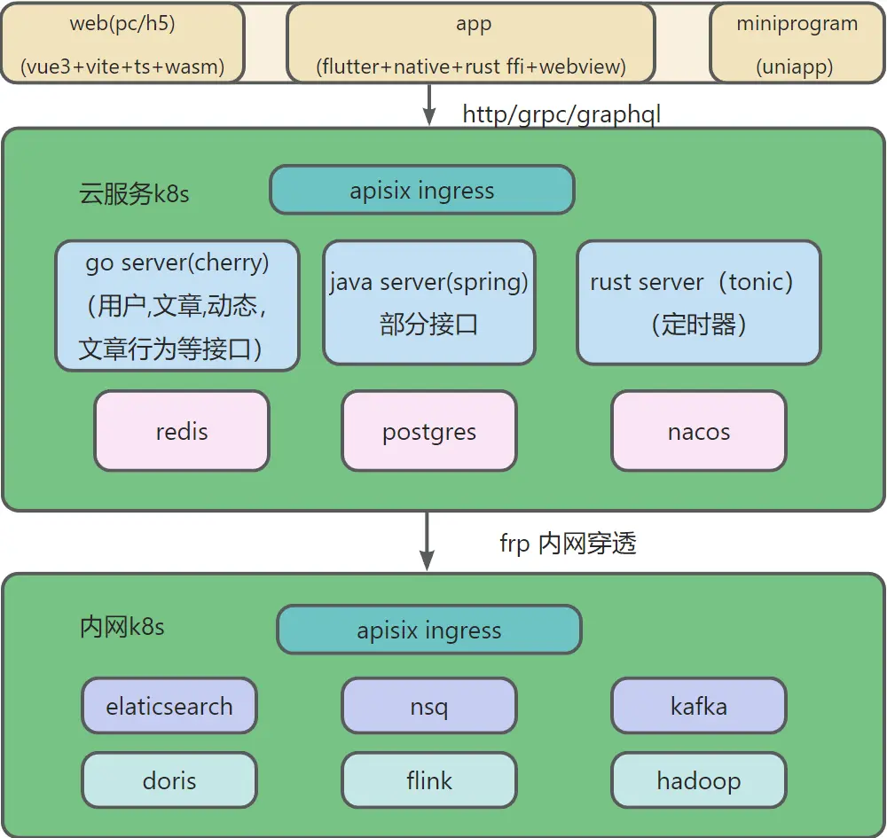

# hoper
| app | h5 |            uniapp             |
|:-----:|:-----:|:-----------------------------:|
|  |  |  |


# 架构


## [quick start]

`install protoc`[https://github.com/protocolbuffers/protobuf/releases](https://github.com/protocolbuffers/protobuf/releases)

```sh
git submodule init
git submodule update
cd server/go
go run $(go list -m -f {{.Dir}}  github.com/hopeio/cherry)/tools/protoc/install_tools.go
protogen go -e -w -v -p ../../proto -o protobuf
go run main.go -c config.toml
```

# client

## flutter
### desktop
flutter desktop尝鲜
### app
 hoper的移动端
flutter开发，Getx状态管理，组件化开发
开发了闪屏页，登录注册功能，动态列表，动态详情，发布照片动态，点赞评论等
grpc调用服务端接口
尝试了简单的dart ffi，调用go，rust交叉编译的动态库，webview嵌入，启动本地服务存储加载页面实现页面热更新
集成sqlite,hive键值对存储

## web
主要是hoper的h5版本，整合vue3+vite+typescript+wasm，实现一套环境开发pc和h5 web，开发了登录注册功能，动态列表，动态详情，发布动态，点赞收藏评论等


## uniapp
uniapp+vue3 开发的hoper小程序，编译的h5版本将取代vue h5版本

# proto
hoper项目客户端，服务端通用的proto定义，用来生成go，rust，java，dart，js grpc源文件


# server
各种语言服务
## go
主要的后端服务,采用cherry
`protogen go -e -w -v -p ../../proto -o protobuf`
## java
### user
- springboot+grpc

[changelog]
- remove rust
- remove kotlin

# friend
friend立项,前端驱动后端
# 架构设想
istio+k8s